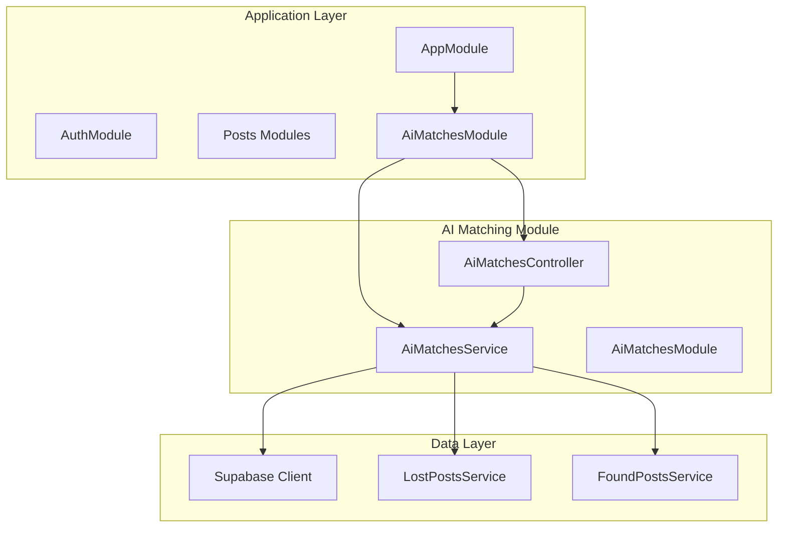
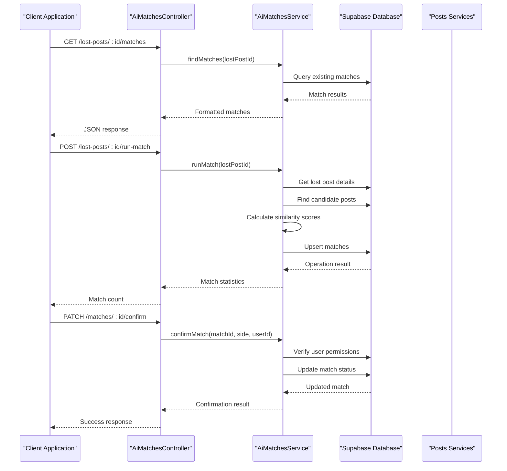
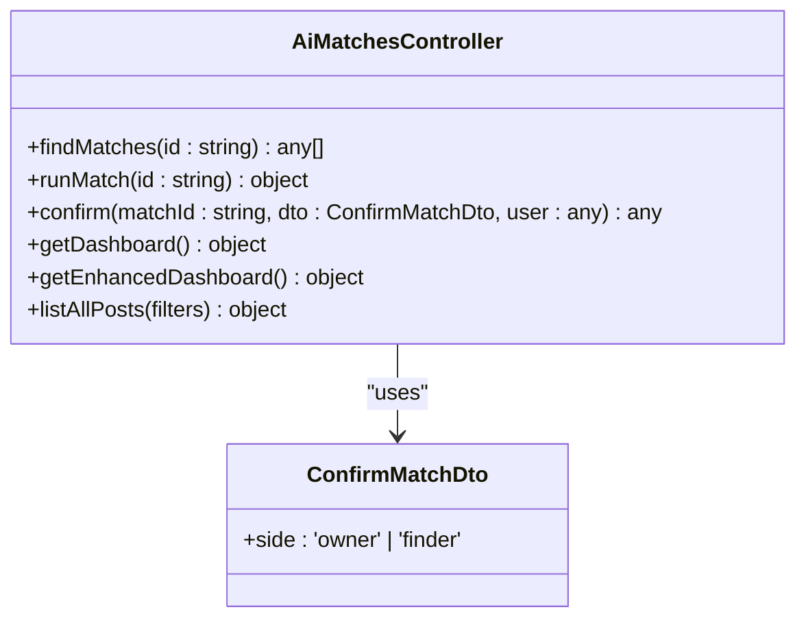
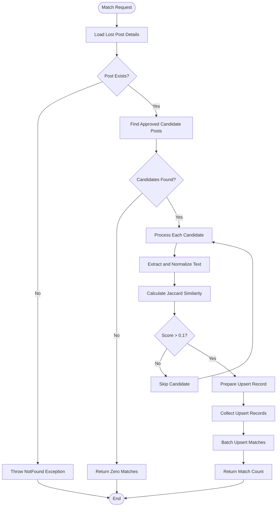
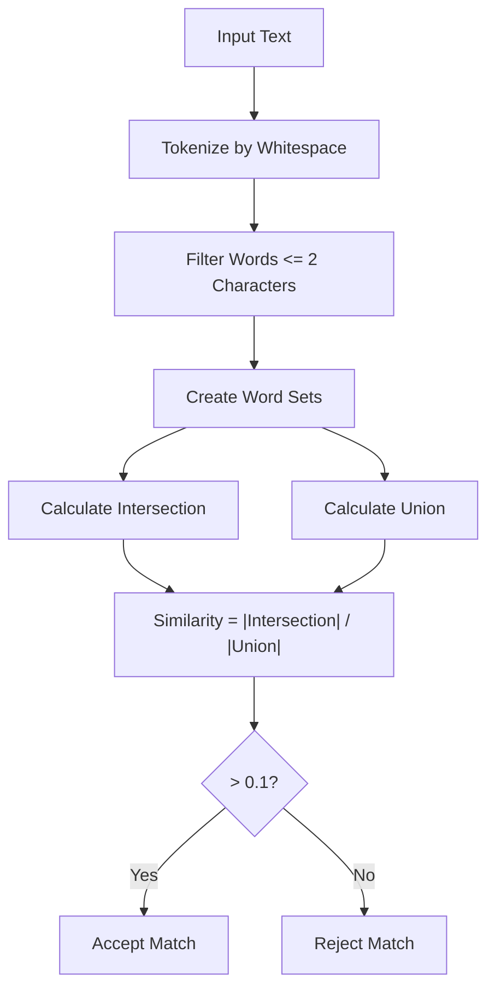
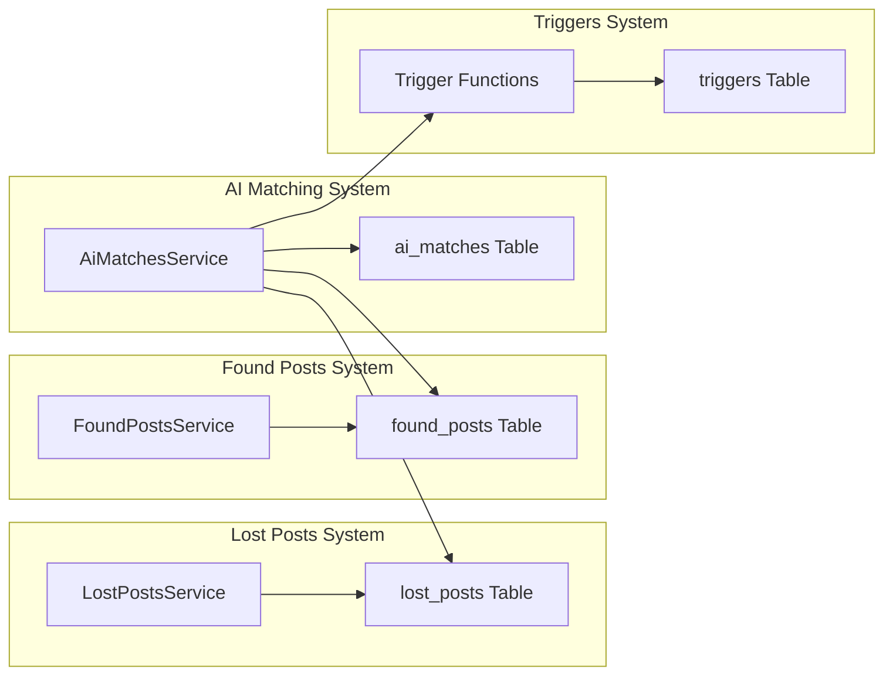

# AI Matching API

<cite>
**Referenced Files in This Document**
- [ai-matches.controller.ts](file://backend/src/modules/ai-matches/ai-matches.controller.ts)
- [ai-matches.service.ts](file://backend/src/modules/ai-matches/ai-matches.service.ts)
- [ai-matches.module.ts](file://backend/src/modules/ai-matches/ai-matches.module.ts)
- [app.module.ts](file://backend/src/app.module.ts)
- [supabase.config.ts](file://backend/src/config/supabase.config.ts)
- [jwt-auth.guard.ts](file://backend/src/common/guards/jwt-auth.guard.ts)
- [roles.guard.ts](file://backend/src/common/guards/roles.guard.ts)
- [current-user.decorator.ts](file://backend/src/common/decorators/current-user.decorator.ts)
- [roles.decorator.ts](file://backend/src/common/decorators/roles.decorator.ts)
- [lost-posts.service.ts](file://backend/src/modules/lost-posts/lost-posts.service.ts)
- [found-posts.service.ts](file://backend/src/modules/found-posts/found-posts.service.ts)
- [triggers_migration.sql](file://backend/sql/triggers_migration.sql)
- [triggers_permissions.sql](file://backend/sql/triggers_permissions.sql)
</cite>

## Table of Contents
1. [Introduction](#introduction)
2. [Project Structure](#project-structure)
3. [Core Components](#core-components)
4. [Architecture Overview](#architecture-overview)
5. [Detailed Component Analysis](#detailed-component-analysis)
6. [API Reference](#api-reference)
7. [Matching Algorithm Details](#matching-algorithm-details)
8. [Integration Patterns](#integration-patterns)
9. [Performance Considerations](#performance-considerations)
10. [Troubleshooting Guide](#troubleshooting-guide)
11. [Conclusion](#conclusion)

## Introduction
The AI Matching API provides intelligent matching capabilities between lost and found posts through text similarity analysis. This system enables automatic discovery of potential matches between lost items and found items based on textual content analysis, while maintaining manual override capabilities and administrative controls for quality assurance.

The API integrates seamlessly with the posts management system, utilizing Supabase for data persistence and real-time features. It supports both automated text-based matching and manual verification processes, ensuring accurate and reliable matching results.

## Project Structure
The AI matching functionality is organized within the NestJS modular architecture:



**Diagram sources**
- [app.module.ts:28-44](file://backend/src/app.module.ts#L28-L44)
- [ai-matches.module.ts:5-9](file://backend/src/modules/ai-matches/ai-matches.module.ts#L5-L9)

**Section sources**
- [app.module.ts:12-26](file://backend/src/app.module.ts#L12-L26)
- [ai-matches.module.ts:1-11](file://backend/src/modules/ai-matches/ai-matches.module.ts#L1-L11)

## Core Components
The AI Matching system consists of three primary components working in concert:

### AiMatchesController
The controller layer handles HTTP requests and implements authentication/authorization guards. It exposes endpoints for:
- Retrieving existing matches for lost posts
- Triggering AI analysis for new matches
- Manual match confirmation
- Administrative dashboards and post management

### AiMatchesService
The service layer implements the core matching logic using Jaccard similarity algorithms and manages:
- Text preprocessing and similarity calculations
- Database operations for match storage and retrieval
- User verification and authorization checks
- Administrative reporting and analytics

### Supabase Integration
The system leverages Supabase for:
- Real-time database operations
- Authentication and authorization
- Row-level security policies
- Event-driven triggers for match confirmation

**Section sources**
- [ai-matches.controller.ts:21-72](file://backend/src/modules/ai-matches/ai-matches.controller.ts#L21-L72)
- [ai-matches.service.ts:6-367](file://backend/src/modules/ai-matches/ai-matches.service.ts#L6-L367)

## Architecture Overview
The AI Matching API follows a layered architecture pattern with clear separation of concerns:



**Diagram sources**
- [ai-matches.controller.ts:24-40](file://backend/src/modules/ai-matches/ai-matches.controller.ts#L24-L40)
- [ai-matches.service.ts:15-141](file://backend/src/modules/ai-matches/ai-matches.service.ts#L15-L141)

## Detailed Component Analysis

### Controller Implementation
The controller implements comprehensive endpoint coverage with proper authentication and authorization:



**Diagram sources**
- [ai-matches.controller.ts:11-15](file://backend/src/modules/ai-matches/ai-matches.controller.ts#L11-L15)
- [ai-matches.controller.ts:21-72](file://backend/src/modules/ai-matches/ai-matches.controller.ts#L21-L72)

**Section sources**
- [ai-matches.controller.ts:17-72](file://backend/src/modules/ai-matches/ai-matches.controller.ts#L17-L72)

### Service Layer Implementation
The service layer implements sophisticated matching algorithms and data management:



**Diagram sources**
- [ai-matches.service.ts:45-96](file://backend/src/modules/ai-matches/ai-matches.service.ts#L45-L96)

**Section sources**
- [ai-matches.service.ts:42-153](file://backend/src/modules/ai-matches/ai-matches.service.ts#L42-L153)

## API Reference

### Authentication and Authorization
All AI matching endpoints require JWT authentication except for administrative dashboards:

- **Header**: `Authorization: Bearer <token>`
- **Guard**: `JwtAuthGuard` for most endpoints
- **Admin Access**: `RolesGuard` with `admin` role required for administrative endpoints

### Endpoint Definitions

#### Retrieve Existing Matches
**GET** `/lost-posts/{id}/matches`

Retrieves all previously computed matches for a lost post, sorted by similarity score.

**Path Parameters:**
- `id` (string, required): Lost post identifier

**Response:** Array of match objects with similarity scores and associated found post details

#### Trigger AI Analysis
**POST** `/lost-posts/{id}/run-match`

Executes text similarity matching between a lost post and all approved found posts in the same category.

**Path Parameters:**
- `id` (string, required): Lost post identifier

**Response:** Object containing match statistics
```json
{
  "matched": 0
}
```

#### Confirm Match
**PATCH** `/matches/{id}/confirm`

Allows either the owner or finder to manually confirm a potential match.

**Path Parameters:**
- `id` (string, required): Match identifier

**Request Body:**
```json
{
  "side": "owner" | "finder"
}
```

**Response:** Updated match object with confirmation status

#### Administrative Dashboard
**GET** `/admin/dashboard`

Provides basic system statistics for administrators.

**Response:** System overview metrics

#### Enhanced Dashboard
**GET** `/admin/dashboard/enhanced`

Provides comprehensive analytics including status breakdowns, recent activity, and category statistics.

**Response:** Detailed analytics report

#### Admin Post Management
**GET** `/admin/posts`

Administrative endpoint to list and filter all posts with pagination support.

**Query Parameters:**
- `type` (enum): 'all' | 'lost' | 'found' (default: 'all')
- `status` (string): Filter by post status
- `search` (string): Search term for post titles
- `page` (number): Page number (default: 1)
- `limit` (number): Results per page (default: 20)

**Response:** Paginated results with metadata

**Section sources**
- [ai-matches.controller.ts:24-71](file://backend/src/modules/ai-matches/ai-matches.controller.ts#L24-L71)

## Matching Algorithm Details

### Text Similarity Implementation
The system uses Jaccard similarity coefficient for text comparison:



**Diagram sources**
- [ai-matches.service.ts:144-153](file://backend/src/modules/ai-matches/ai-matches.service.ts#L144-L153)

### Similarity Scoring Mechanism
The algorithm processes text through several stages:

1. **Text Extraction**: Combines title and description from both posts
2. **Normalization**: Converts to lowercase for case-insensitive comparison
3. **Tokenization**: Splits text into individual words
4. **Filtering**: Removes short words (≤2 characters) to reduce noise
5. **Set Creation**: Creates word sets for mathematical operations
6. **Similarity Calculation**: Uses Jaccard coefficient formula

### Result Filtering Options
- **Minimum Score Threshold**: 0.1 (adjustable)
- **Category Matching**: Automatic filtering by item category
- **Status Filtering**: Only considers approved posts
- **Pagination**: Built-in pagination for large result sets

**Section sources**
- [ai-matches.service.ts:69-95](file://backend/src/modules/ai-matches/ai-matches.service.ts#L69-L95)
- [ai-matches.service.ts:144-153](file://backend/src/modules/ai-matches/ai-matches.service.ts#L144-L153)

## Integration Patterns

### Posts Management Integration
The AI matching system integrates deeply with the posts management infrastructure:



**Diagram sources**
- [lost-posts.service.ts:14-189](file://backend/src/modules/lost-posts/lost-posts.service.ts#L14-L189)
- [found-posts.service.ts:14-162](file://backend/src/modules/found-posts/found-posts.service.ts#L14-L162)
- [ai-matches.service.ts:15-40](file://backend/src/modules/ai-matches/ai-matches.service.ts#L15-L40)

### Workflow Integration
The matching system participates in broader workflow processes:

1. **Automatic Matching**: Triggered when posts are approved
2. **Manual Verification**: Users can override AI suggestions
3. **Administrative Review**: Admins can manage system performance
4. **Trigger Creation**: Successful matches can initiate handover processes

**Section sources**
- [triggers_migration.sql:63-146](file://backend/sql/triggers_migration.sql#L63-L146)
- [triggers_permissions.sql:26-56](file://backend/sql/triggers_permissions.sql#L26-L56)

## Performance Considerations

### Database Optimization
- **Index Usage**: Leverages existing indexes on status and category fields
- **Query Efficiency**: Single-pass queries with appropriate filtering
- **Pagination**: Built-in pagination prevents memory issues
- **Batch Operations**: Upsert operations minimize database round trips

### Algorithm Performance
- **Time Complexity**: O(n*m*k) where n=lost posts, m=candidates, k=average tokens
- **Space Complexity**: O(m) for candidate processing
- **Threshold Filtering**: Reduces computational load by early rejection

### Scalability Recommendations
- **Caching**: Consider caching frequently accessed match results
- **Background Processing**: Move heavy computations to background tasks
- **Database Scaling**: Monitor query performance as user base grows
- **Index Optimization**: Add composite indexes for common query patterns

## Troubleshooting Guide

### Common Issues and Solutions

#### Authentication Failures
**Symptoms**: 401 Unauthorized responses from all endpoints
**Causes**: Invalid or expired JWT tokens
**Solutions**: 
- Regenerate authentication token
- Verify token expiration
- Check user authentication status

#### Authorization Errors
**Symptoms**: 403 Forbidden when confirming matches
**Causes**: User attempting to confirm matches for posts they don't own
**Solutions**:
- Verify user ownership of posts
- Check match assignment to correct parties
- Ensure proper user role validation

#### Database Connection Issues
**Symptoms**: 500 Internal server errors during operations
**Causes**: Supabase connectivity problems
**Solutions**:
- Verify environment variables are set
- Check network connectivity
- Monitor database availability

#### Performance Issues
**Symptoms**: Slow response times for matching operations
**Causes**: Large datasets or insufficient indexing
**Solutions**:
- Optimize database queries
- Add appropriate indexes
- Implement pagination
- Consider background processing

**Section sources**
- [supabase.config.ts:12-23](file://backend/src/config/supabase.config.ts#L12-L23)
- [jwt-auth.guard.ts](file://backend/src/common/guards/jwt-auth.guard.ts)
- [roles.guard.ts](file://backend/src/common/guards/roles.guard.ts)

## Conclusion

The AI Matching API provides a robust foundation for intelligent post matching within the MissLost platform. Its architecture balances automation with human oversight, ensuring both efficiency and accuracy in connecting lost and found items.

Key strengths include:
- **Flexible Matching Algorithm**: Jaccard similarity provides reliable text matching
- **Comprehensive Controls**: Manual override capabilities maintain quality
- **Administrative Oversight**: Dashboards enable system monitoring and management
- **Seamless Integration**: Deep integration with existing posts management infrastructure

The system's modular design and clear separation of concerns facilitate future enhancements, including potential integration of computer vision algorithms for YOLO-based object categorization as suggested by the project name.