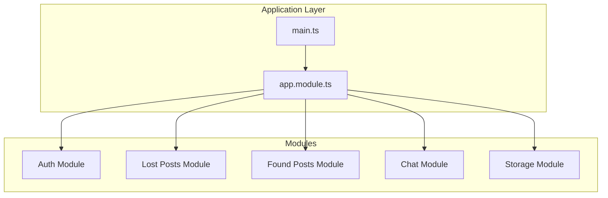
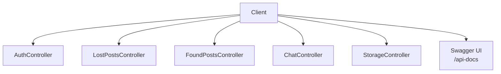
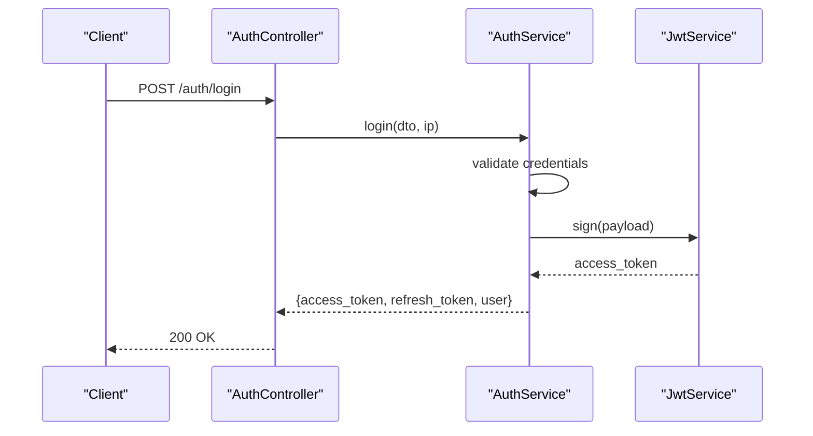
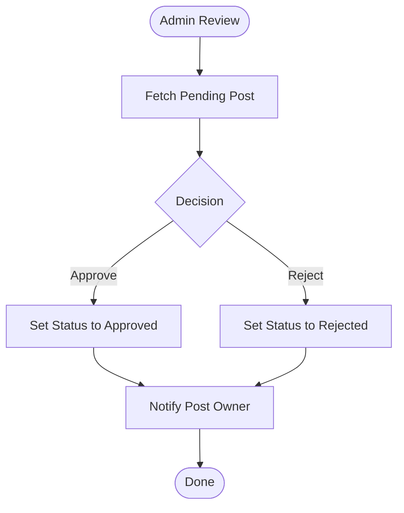
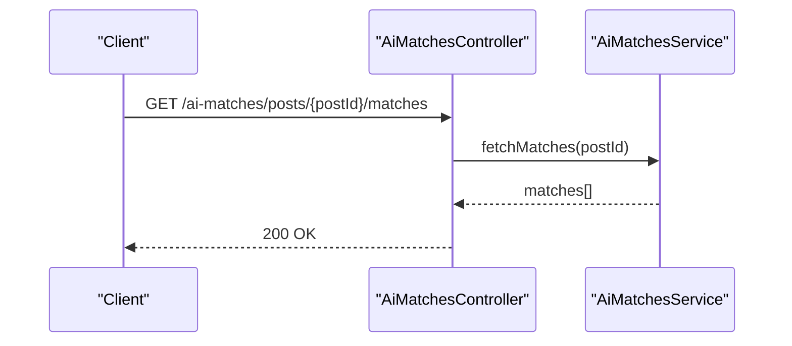
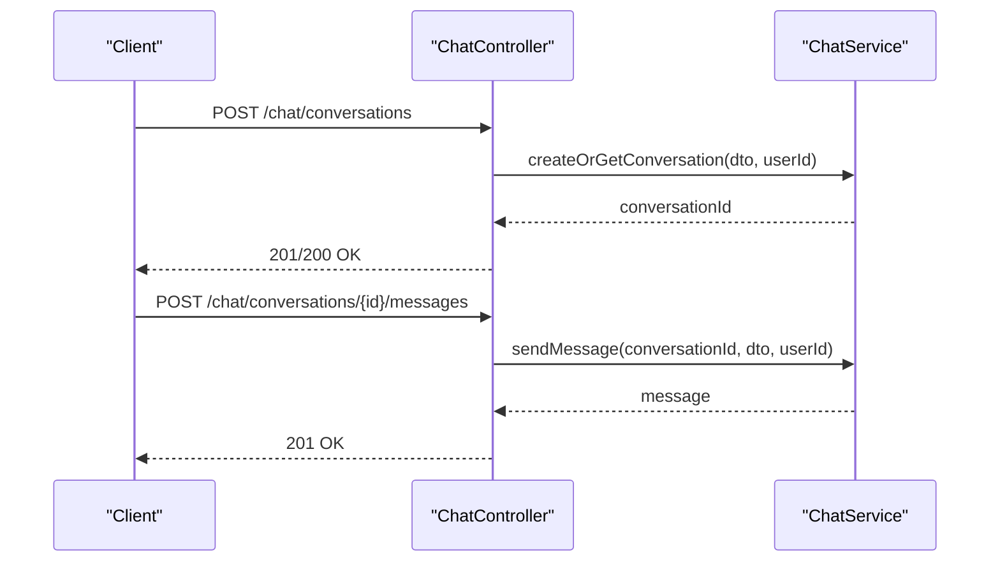
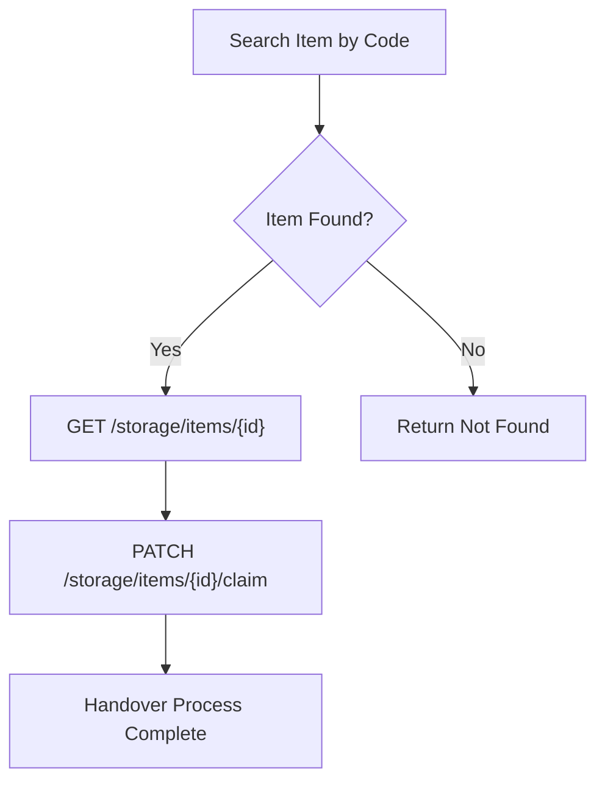
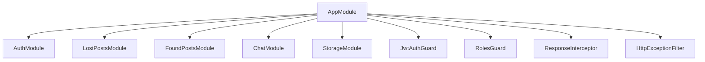

# API Reference

<cite>
**Referenced Files in This Document**
- [main.ts](file://backend/src/main.ts)
- [app.module.ts](file://backend/src/app.module.ts)
- [auth.controller.ts](file://backend/src/modules/auth/auth.controller.ts)
- [auth.service.ts](file://backend/src/modules/auth/auth.service.ts)
- [register.dto.ts](file://backend/src/modules/auth/dto/register.dto.ts)
- [login.dto.ts](file://backend/src/modules/auth/dto/login.dto.ts)
- [forgot-password.dto.ts](file://backend/src/modules/auth/dto/forgot-password.dto.ts)
- [reset-password.dto.ts](file://backend/src/modules/auth/dto/reset-password.dto.ts)
- [lost-posts.controller.ts](file://backend/src/modules/lost-posts/lost-posts.controller.ts)
- [create-lost-post.dto.ts](file://backend/src/modules/lost-posts/dto/create-lost-post.dto.ts)
- [query-lost-posts.dto.ts](file://backend/src/modules/lost-posts/dto/query-lost-posts.dto.ts)
- [found-posts.controller.ts](file://backend/src/modules/found-posts/found-posts.controller.ts)
- [create-found-post.dto.ts](file://backend/src/modules/found-posts/dto/create-found-post.dto.ts)
- [query-found-posts.dto.ts](file://backend/src/modules/found-posts/dto/query-found-posts.dto.ts)
- [chat.controller.ts](file://backend/src/modules/chat/chat.controller.ts)
- [storage.controller.ts](file://backend/src/modules/storage/storage.controller.ts)
</cite>

## Table of Contents
1. [Introduction](#introduction)
2. [Project Structure](#project-structure)
3. [Core Components](#core-components)
4. [Architecture Overview](#architecture-overview)
5. [Detailed Component Analysis](#detailed-component-analysis)
6. [Dependency Analysis](#dependency-analysis)
7. [Performance Considerations](#performance-considerations)
8. [Troubleshooting Guide](#troubleshooting-guide)
9. [Conclusion](#conclusion)
10. [Appendices](#appendices)

## Introduction
This document provides a comprehensive API reference for the MissLost platform’s backend. It covers authentication, posts management (lost and found), AI matching, chat, and storage endpoints. For each endpoint group, you will find HTTP methods, URL patterns, request/response schemas, JWT token management, error handling strategies, rate limiting, and versioning information. Implementation notes and client guidance are included to help developers integrate efficiently.

## Project Structure
The backend is a NestJS application with modular design. Key modules include:
- Authentication
- Users
- Categories
- Lost Posts
- Found Posts
- AI Matches
- Storage
- Chat
- Handovers
- Notifications
- Upload
- Triggers

Global middleware includes CORS, validation pipes, Swagger documentation, and application-wide guards and interceptors.

**Diagram sources**
- [main.ts:1-41](file://backend/src/main.ts#L1-L41)
- [app.module.ts:1-67](file://backend/src/app.module.ts#L1-L67)

**Section sources**
- [main.ts:1-41](file://backend/src/main.ts#L1-L41)
- [app.module.ts:1-67](file://backend/src/app.module.ts#L1-L67)

## Core Components
- Global validation pipe enforces strict input transformation and whitelisting.
- CORS enabled for configured frontend origin with credentials support.
- Swagger UI exposed at /api-docs with bearer auth configuration.
- Application-wide guards: JWT and Roles guards applied globally.
- Interceptors and filters standardize responses and errors.

Key runtime behaviors:
- Versioning: Swagger builder sets version to 1.0.
- Rate limiting: Not implemented in code; consider adding a rate-limiting guard or interceptor.
- Security: JWT payload includes user identity and role; refresh tokens stored hashed.

**Section sources**
- [main.ts:9-33](file://backend/src/main.ts#L9-L33)
- [app.module.ts:46-64](file://backend/src/app.module.ts#L46-L64)

## Architecture Overview
High-level API architecture with authentication and protected routes:

**Diagram sources**
- [main.ts:25-33](file://backend/src/main.ts#L25-L33)
- [auth.controller.ts:27-100](file://backend/src/modules/auth/auth.controller.ts#L27-L100)
- [lost-posts.controller.ts:20-77](file://backend/src/modules/lost-posts/lost-posts.controller.ts#L20-L77)
- [found-posts.controller.ts:20-77](file://backend/src/modules/found-posts/found-posts.controller.ts#L20-L77)
- [chat.controller.ts:11-49](file://backend/src/modules/chat/chat.controller.ts#L11-49)
- [storage.controller.ts:14-59](file://backend/src/modules/storage/storage.controller.ts#L14-59)

## Detailed Component Analysis

### Authentication APIs
Endpoints for user registration, login, logout, email verification, password recovery, and Google OAuth.

- Base Path: /auth
- Authentication: Public endpoints for registration, login, email verification, forgot password, reset password, and Google OAuth. Protected endpoints require a valid JWT.

Common request/response schemas:
- Registration: full_name, email, password, confirm_password, student_id (optional)
- Login: email, password
- Forgot Password: email
- Reset Password: token, new_password, confirm_password
- Logout: requires Authorization header with Bearer token

JWT Token Management:
- Access token: signed JWT payload includes user identity and role.
- Refresh token: generated per login, stored as hashed value with expiration.
- Logout revokes refresh tokens for the user.

Google OAuth:
- Redirects to Google OAuth via AuthGuard('google').
- Callback constructs frontend redirect with token and user data.

**Diagram sources**
- [auth.controller.ts:38-44](file://backend/src/modules/auth/auth.controller.ts#L38-L44)
- [auth.service.ts:71-110](file://backend/src/modules/auth/auth.service.ts#L71-L110)

**Section sources**
- [auth.controller.ts:27-100](file://backend/src/modules/auth/auth.controller.ts#L27-L100)
- [auth.service.ts:18-274](file://backend/src/modules/auth/auth.service.ts#L18-L274)
- [register.dto.ts:1-30](file://backend/src/modules/auth/dto/register.dto.ts#L1-L30)
- [login.dto.ts:1-13](file://backend/src/modules/auth/dto/login.dto.ts#L1-L13)
- [forgot-password.dto.ts:1-9](file://backend/src/modules/auth/dto/forgot-password.dto.ts#L1-L9)
- [reset-password.dto.ts:1-18](file://backend/src/modules/auth/dto/reset-password.dto.ts#L1-L18)

### Posts Management APIs (Lost and Found)
Endpoints for CRUD operations on lost and found posts, including approval workflows and filtering.

- Base Paths:
  - Lost Posts: /lost-posts
  - Found Posts: /found-posts
- Authentication: Requires JWT for creation, updates, deletions, and admin endpoints.
- Roles: Admin-only endpoints require admin role.

Endpoints:
- Lost Posts
  - POST /lost-posts
  - GET /lost-posts (public feed)
  - GET /lost-posts/my
  - GET /lost-posts/:id
  - PATCH /lost-posts/:id
  - DELETE /lost-posts/:id
  - GET /admin/lost-posts/pending
  - POST /admin/lost-posts/:id/review

- Found Posts
  - POST /found-posts
  - GET /found-posts (public feed)
  - GET /found-posts/my
  - GET /found-posts/:id
  - PATCH /found-posts/:id
  - DELETE /found-posts/:id
  - GET /admin/found-posts/pending
  - POST /admin/found-posts/:id/review

Request Schemas:
- Create Lost Post: title, description, location_lost, time_lost, category_id (optional), image_urls (optional), contact_info (optional), is_urgent (optional), reward_note (optional)
- Create Found Post: title, description, location_found, time_found, category_id (optional), image_urls (optional), contact_info (optional), is_in_storage (optional)
- Query Posts: status (pending, approved, rejected, matched, closed), category_id, search, page, limit

Approval Workflow:
- Admin endpoints expose pending lists and review actions to approve or reject posts.

**Diagram sources**
- [lost-posts.controller.ts:62-76](file://backend/src/modules/lost-posts/lost-posts.controller.ts#L62-L76)
- [found-posts.controller.ts:62-75](file://backend/src/modules/found-posts/found-posts.controller.ts#L62-L75)

**Section sources**
- [lost-posts.controller.ts:17-77](file://backend/src/modules/lost-posts/lost-posts.controller.ts#L17-L77)
- [create-lost-post.dto.ts:14-60](file://backend/src/modules/lost-posts/dto/create-lost-post.dto.ts#L14-L60)
- [query-lost-posts.dto.ts:5-35](file://backend/src/modules/lost-posts/dto/query-lost-posts.dto.ts#L5-L35)
- [found-posts.controller.ts:17-77](file://backend/src/modules/found-posts/found-posts.controller.ts#L17-L77)
- [create-found-post.dto.ts:7-47](file://backend/src/modules/found-posts/dto/create-found-post.dto.ts#L7-L47)
- [query-found-posts.dto.ts:5-35](file://backend/src/modules/found-posts/dto/query-found-posts.dto.ts#L5-L35)

### AI Matching APIs
AI matching endpoints are defined under the AI Matches module. The controller exposes endpoints for retrieving matches for posts. The service encapsulates the matching logic.

- Base Path: /ai-matches
- Authentication: Requires JWT.
- Endpoints:
  - GET /ai-matches/posts/:postId/matches

Notes:
- Text similarity and YOLO-based categorization are handled by the service implementation. No explicit endpoints for training or model configuration are exposed in the controller.

**Diagram sources**
- [ai-matches.controller.ts](file://backend/src/modules/ai-matches/ai-matches.controller.ts)

**Section sources**
- [ai-matches.controller.ts](file://backend/src/modules/ai-matches/ai-matches.controller.ts)
- [ai-matches.service.ts](file://backend/src/modules/ai-matches/ai-matches.service.ts)

### Chat APIs
Real-time messaging endpoints for conversations and messages.

- Base Path: /chat
- Authentication: Requires JWT.
- Endpoints:
  - GET /chat/conversations
  - POST /chat/conversations
  - GET /chat/conversations/:id/messages
  - POST /chat/conversations/:id/messages
  - GET /chat/unread-count

Pagination:
- Messages endpoint supports page and limit query parameters with defaults and limits.

**Diagram sources**
- [chat.controller.ts:15-42](file://backend/src/modules/chat/chat.controller.ts#L15-L42)

**Section sources**
- [chat.controller.ts:1-50](file://backend/src/modules/chat/chat.controller.ts#L1-L50)

### Storage APIs
Campus storage integration for item tracking and handover process.

- Base Path: /storage
- Authentication: JWT for protected endpoints; public endpoints for locations/items/search.
- Endpoints:
  - GET /storage/locations
  - GET /storage/items
  - GET /storage/items/search
  - GET /storage/items/:id
  - POST /storage/items (requires admin or storage_staff)
  - PATCH /storage/items/:id/claim

Notes:
- Staff/admin roles required for creating items.
- Claim endpoint handles item retrieval confirmation.

**Diagram sources**
- [storage.controller.ts:18-58](file://backend/src/modules/storage/storage.controller.ts#L18-L58)

**Section sources**
- [storage.controller.ts:1-60](file://backend/src/modules/storage/storage.controller.ts#L1-L60)

## Dependency Analysis
Module-level dependencies and global guards/interceptors:

**Diagram sources**
- [app.module.ts:28-64](file://backend/src/app.module.ts#L28-L64)

**Section sources**
- [app.module.ts:1-67](file://backend/src/app.module.ts#L1-L67)

## Performance Considerations
- Pagination: Use page and limit query parameters for listing endpoints to avoid large payloads.
- Filtering: Apply category_id and status filters to reduce database load.
- Image URLs: Prefer minimal image count and appropriate sizes to reduce bandwidth.
- JWT caching: Consider caching short-lived access tokens and refresh token rotation to minimize database writes.
- Rate limiting: Implement a rate-limiting guard or interceptor to protect sensitive endpoints (login, password reset).
- Background jobs: Offload heavy tasks (matching, notifications) to scheduled tasks or queues.

## Troubleshooting Guide
Common issues and resolutions:
- Validation errors: Ensure DTO fields meet length, type, and format constraints.
- Unauthorized: Verify Authorization header with Bearer token and active account status.
- Email verification: Confirm token validity and non-expired status.
- Password reset: Ensure token matches type and is unexpired.
- Google OAuth: Confirm callback URL and frontend integration for token/user propagation.
- CORS: Verify frontend URL and credentials flag configuration.

Error handling:
- ValidationException: Thrown for mismatched passwords and invalid tokens.
- UnauthorizedException: Thrown for invalid credentials, suspended accounts, or pending verification.
- ConflictException: Thrown for duplicate email or upsert conflicts.
- NotFoundException: Thrown when resources are not found.

**Section sources**
- [auth.service.ts:10-15](file://backend/src/modules/auth/auth.service.ts#L10-L15)
- [auth.service.ts:180-208](file://backend/src/modules/auth/auth.service.ts#L180-L208)
- [auth.service.ts:236-272](file://backend/src/modules/auth/auth.service.ts#L236-L272)

## Conclusion
This API reference outlines all RESTful endpoints for MissLost, including authentication, posts management, AI matching, chat, and storage. Clients should implement robust input validation, handle JWT lifecycle carefully, and leverage pagination and filtering for optimal performance. Administrators should use dedicated admin endpoints to manage post approvals and storage staff endpoints for inventory operations.

## Appendices

### Authentication Methods
- Bearer Token: Authorization: Bearer <access_token>
- Refresh Token: Stored server-side hashed; used for obtaining new access tokens (implementation note).
- Google OAuth: Redirect to /auth/google; callback returns token and user data to frontend.

### Versioning Information
- API version: 1.0 (as set in Swagger builder).

### Rate Limiting
- Not implemented in code; recommended to add a rate-limiting guard or interceptor.

### Common Use Cases and Client Guidelines
- Authentication:
  - Register, verify email, login, and logout flows.
  - Use forgot-password and reset-password securely with token handling.
- Posts:
  - Create posts with images; filter by status/category/search.
  - Admins review pending posts and approve/reject.
- Chat:
  - Create or reuse conversations; paginate message history.
- Storage:
  - Search items by code; list locations and items; claim items with confirmation.