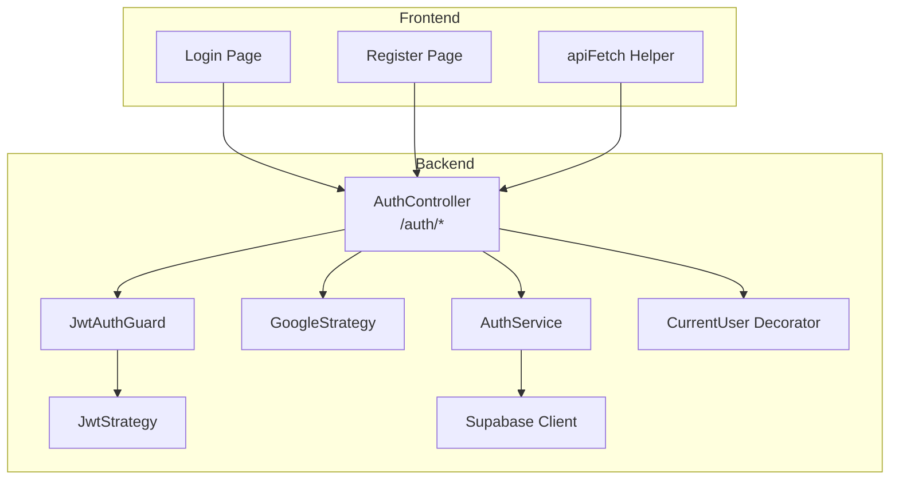
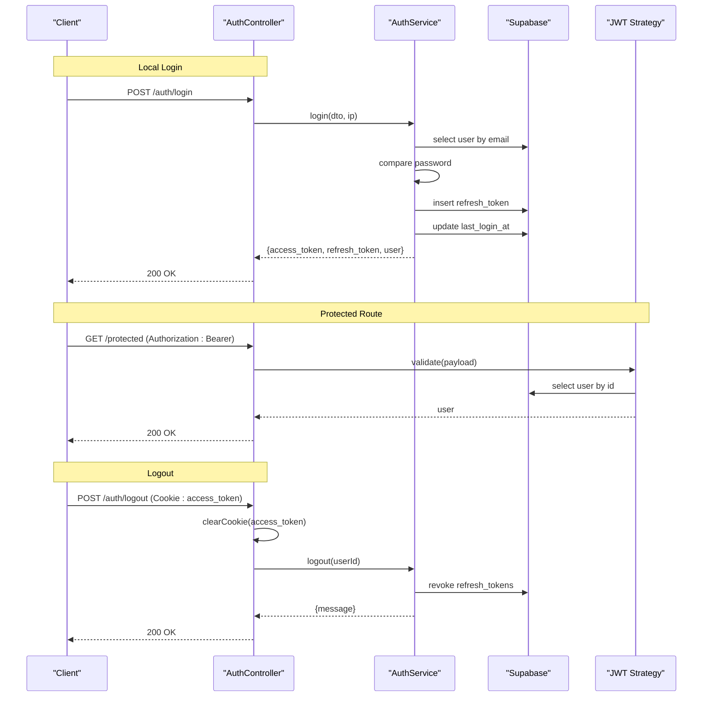
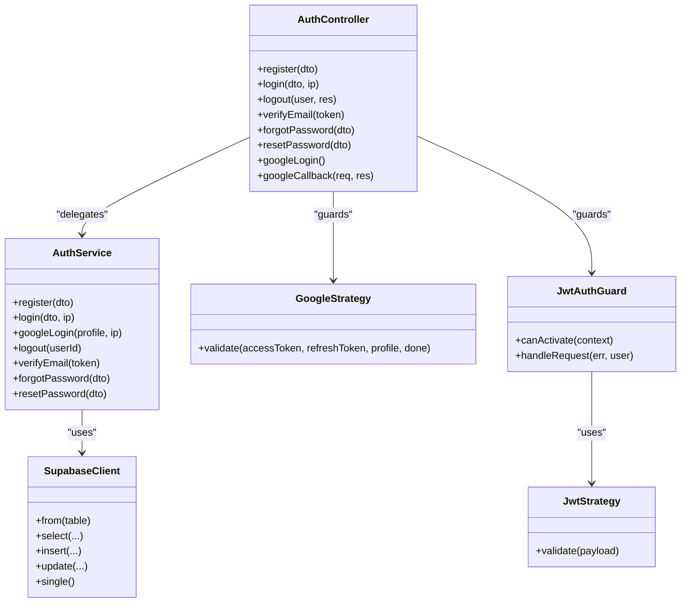

# Authentication API

<cite>
**Referenced Files in This Document**
- [auth.controller.ts](file://backend/src/modules/auth/auth.controller.ts)
- [auth.service.ts](file://backend/src/modules/auth/auth.service.ts)
- [register.dto.ts](file://backend/src/modules/auth/dto/register.dto.ts)
- [login.dto.ts](file://backend/src/modules/auth/dto/login.dto.ts)
- [forgot-password.dto.ts](file://backend/src/modules/auth/dto/forgot-password.dto.ts)
- [reset-password.dto.ts](file://backend/src/modules/auth/dto/reset-password.dto.ts)
- [jwt.strategy.ts](file://backend/src/modules/auth/strategies/jwt.strategy.ts)
- [google.strategy.ts](file://backend/src/modules/auth/strategies/google.strategy.ts)
- [jwt-auth.guard.ts](file://backend/src/common/guards/jwt-auth.guard.ts)
- [current-user.decorator.ts](file://backend/src/common/decorators/current-user.decorator.ts)
- [supabase.config.ts](file://backend/src/config/supabase.config.ts)
- [api.ts](file://frontend/app/lib/api.ts)
- [login.page.tsx](file://frontend/app/auth/login/page.tsx)
- [register.page.tsx](file://frontend/app/auth/register/page.tsx)
- [OVERVIEW.md](file://OVERVIEW.md)
</cite>

## Table of Contents
1. [Introduction](#introduction)
2. [Project Structure](#project-structure)
3. [Core Components](#core-components)
4. [Architecture Overview](#architecture-overview)
5. [Detailed Component Analysis](#detailed-component-analysis)
6. [Dependency Analysis](#dependency-analysis)
7. [Performance Considerations](#performance-considerations)
8. [Troubleshooting Guide](#troubleshooting-guide)
9. [Conclusion](#conclusion)
10. [Appendices](#appendices)

## Introduction
This document provides comprehensive API documentation for the authentication endpoints. It covers HTTP methods, URL patterns, request/response schemas, JWT token management, authentication headers, error handling strategies, and security considerations. It also includes authentication flow diagrams and client implementation guidelines for each endpoint.

## Project Structure
The authentication module is implemented in the backend NestJS application under the modules/auth folder. DTOs define request schemas, the controller exposes endpoints, the service implements business logic, and strategies handle JWT and Google OAuth. Frontend clients consume these endpoints using a shared API helper.

**Diagram sources**
- [auth.controller.ts:28-127](file://backend/src/modules/auth/auth.controller.ts#L28-L127)
- [auth.service.ts:18-273](file://backend/src/modules/auth/auth.service.ts#L18-L273)
- [jwt.strategy.ts:17-39](file://backend/src/modules/auth/strategies/jwt.strategy.ts#L17-L39)
- [google.strategy.ts:6-37](file://backend/src/modules/auth/strategies/google.strategy.ts#L6-L37)
- [jwt-auth.guard.ts:7-28](file://backend/src/common/guards/jwt-auth.guard.ts#L7-L28)
- [current-user.decorator.ts:3-8](file://backend/src/common/decorators/current-user.decorator.ts#L3-L8)
- [supabase.config.ts:7-23](file://backend/src/config/supabase.config.ts#L7-L23)
- [api.ts:12-43](file://frontend/app/lib/api.ts#L12-L43)
- [login.page.tsx:6-51](file://frontend/app/auth/login/page.tsx#L6-L51)
- [register.page.tsx:6-69](file://frontend/app/auth/register/page.tsx#L6-L69)

**Section sources**
- [auth.controller.ts:28-127](file://backend/src/modules/auth/auth.controller.ts#L28-L127)
- [auth.service.ts:18-273](file://backend/src/modules/auth/auth.service.ts#L18-L273)
- [jwt.strategy.ts:17-39](file://backend/src/modules/auth/strategies/jwt.strategy.ts#L17-L39)
- [google.strategy.ts:6-37](file://backend/src/modules/auth/strategies/google.strategy.ts#L6-L37)
- [jwt-auth.guard.ts:7-28](file://backend/src/common/guards/jwt-auth.guard.ts#L7-L28)
- [current-user.decorator.ts:3-8](file://backend/src/common/decorators/current-user.decorator.ts#L3-L8)
- [supabase.config.ts:7-23](file://backend/src/config/supabase.config.ts#L7-L23)
- [api.ts:12-43](file://frontend/app/lib/api.ts#L12-L43)
- [login.page.tsx:6-51](file://frontend/app/auth/login/page.tsx#L6-L51)
- [register.page.tsx:6-69](file://frontend/app/auth/register/page.tsx#L6-L69)

## Core Components
- AuthController: Exposes all authentication endpoints and delegates to AuthService.
- AuthService: Implements registration, login, logout, email verification, forgot/reset password, and Google OAuth login with Supabase integration.
- DTOs: Define request schemas validated by class-validator and documented via Swagger.
- Strategies: JWT strategy validates tokens against Supabase users; Google strategy handles OAuth profile extraction.
- Guards and Decorators: JwtAuthGuard enforces JWT validation; CurrentUser decorator injects the authenticated user into request handlers.
- Supabase Client: Centralized client creation and persistence for database operations.

**Section sources**
- [auth.controller.ts:28-127](file://backend/src/modules/auth/auth.controller.ts#L28-L127)
- [auth.service.ts:18-273](file://backend/src/modules/auth/auth.service.ts#L18-L273)
- [register.dto.ts:4-29](file://backend/src/modules/auth/dto/register.dto.ts#L4-L29)
- [login.dto.ts:4-12](file://backend/src/modules/auth/dto/login.dto.ts#L4-L12)
- [forgot-password.dto.ts:4-8](file://backend/src/modules/auth/dto/forgot-password.dto.ts#L4-L8)
- [reset-password.dto.ts:4-17](file://backend/src/modules/auth/dto/reset-password.dto.ts#L4-L17)
- [jwt.strategy.ts:17-39](file://backend/src/modules/auth/strategies/jwt.strategy.ts#L17-L39)
- [google.strategy.ts:6-37](file://backend/src/modules/auth/strategies/google.strategy.ts#L6-L37)
- [jwt-auth.guard.ts:7-28](file://backend/src/common/guards/jwt-auth.guard.ts#L7-L28)
- [current-user.decorator.ts:3-8](file://backend/src/common/decorators/current-user.decorator.ts#L3-L8)
- [supabase.config.ts:7-23](file://backend/src/config/supabase.config.ts#L7-L23)

## Architecture Overview
The authentication flow integrates REST endpoints with JWT and OAuth. Clients authenticate via local credentials or Google OAuth. Tokens are stored in HTTP-only cookies for logout and protected routes. Supabase manages users, tokens, and refresh tokens.

**Diagram sources**
- [auth.controller.ts:46-60](file://backend/src/modules/auth/auth.controller.ts#L46-L60)
- [auth.service.ts:72-110](file://backend/src/modules/auth/auth.service.ts#L72-L110)
- [jwt.strategy.ts:26-38](file://backend/src/modules/auth/strategies/jwt.strategy.ts#L26-L38)
- [jwt-auth.guard.ts:13-27](file://backend/src/common/guards/jwt-auth.guard.ts#L13-L27)

**Section sources**
- [auth.controller.ts:46-60](file://backend/src/modules/auth/auth.controller.ts#L46-L60)
- [auth.service.ts:72-110](file://backend/src/modules/auth/auth.service.ts#L72-L110)
- [jwt.strategy.ts:26-38](file://backend/src/modules/auth/strategies/jwt.strategy.ts#L26-L38)
- [jwt-auth.guard.ts:13-27](file://backend/src/common/guards/jwt-auth.guard.ts#L13-L27)

## Detailed Component Analysis

### Endpoint: POST /auth/register
- Purpose: Register a new user with email/password.
- Authentication: Not required (public).
- Request Schema (DTO):
  - full_name: string (required, min length 2, max length 150)
  - email: string (required, email format)
  - password: string (required, min length 8)
  - confirm_password: string (required, must match password)
  - student_id: string (optional, digits 8-12)
- Response:
  - message: string
  - user: { id, email, full_name } (only returned on auto-login path)
- Behavior:
  - Validates password confirmation.
  - Checks for duplicate email.
  - Hashes password and inserts user with role=user, status=active.
  - Creates email verification token with 24-hour expiry.
  - Returns success message and user info.
- Security:
  - Password hashed with high cost.
  - Duplicate email detection prevents enumeration.
- Example Request (JSON):
  - {
    "full_name": "John Doe",
    "email": "john@example.com",
    "password": "SecurePass123!",
    "confirm_password": "SecurePass123!"
  }
- Example Response (JSON):
  - {
    "message": "Registration success message",
    "user": { "id": "...", "email": "john@example.com", "full_name": "John Doe" }
  }

**Section sources**
- [auth.controller.ts:31-36](file://backend/src/modules/auth/auth.controller.ts#L31-L36)
- [auth.service.ts:22-69](file://backend/src/modules/auth/auth.service.ts#L22-L69)
- [register.dto.ts:4-29](file://backend/src/modules/auth/dto/register.dto.ts#L4-L29)

### Endpoint: POST /auth/login
- Purpose: Authenticate with email/password and receive tokens.
- Authentication: Not required (public).
- Request Schema (DTO):
  - email: string (required, email format)
  - password: string (required)
- Response:
  - access_token: string (JWT)
  - refresh_token: string (UUID)
  - user: { id, email, full_name, role, status, ... } (without sensitive fields)
- Behavior:
  - Finds user by email, compares password hash.
  - Blocks pending_verify or suspended users.
  - Generates JWT payload {sub, email, role}.
  - Stores hashed refresh token with 30-day expiry.
  - Updates last_login_at.
- Security:
  - Password comparison uses bcrypt.
  - Refresh token stored as hash.
- Example Request (JSON):
  - {
    "email": "john@example.com",
    "password": "SecurePass123!"
  }
- Example Response (JSON):
  - {
    "access_token": "eyJhbGciOiJIUzI1NiIs...",
    "refresh_token": "550e8400-e29b-41d4... (stored hashed)",
    "user": { "id": "...", "email": "john@example.com", "full_name": "John Doe", "role": "user" }
  }

**Section sources**
- [auth.controller.ts:38-44](file://backend/src/modules/auth/auth.controller.ts#L38-L44)
- [auth.service.ts:72-110](file://backend/src/modules/auth/auth.service.ts#L72-L110)
- [login.dto.ts:4-12](file://backend/src/modules/auth/dto/login.dto.ts#L4-L12)

### Endpoint: POST /auth/logout
- Purpose: Invalidate session by clearing cookie and revoking refresh tokens.
- Authentication: Required (JWT).
- Headers:
  - Authorization: Bearer <access_token>
  - Cookie: access_token=<value> (HTTP-only)
- Response:
  - message: string
- Behavior:
  - Clears HTTP-only access_token cookie with secure flags.
  - Revokes unexpired refresh tokens for the user.
- Security:
  - Uses HTTP-only cookie to mitigate XSS.
  - Secure flag enabled in production.
- Example Response (JSON):
  - {
    "message": "Logout success message"
  }

**Section sources**
- [auth.controller.ts:46-60](file://backend/src/modules/auth/auth.controller.ts#L46-L60)
- [auth.service.ts:169-178](file://backend/src/modules/auth/auth.service.ts#L169-L178)
- [jwt-auth.guard.ts:13-27](file://backend/src/common/guards/jwt-auth.guard.ts#L13-L27)

### Endpoint: GET /auth/verify-email
- Purpose: Verify user email using token.
- Authentication: Not required (public).
- Query:
  - token: string (required)
- Response:
  - message: string
- Behavior:
  - Validates token existence, type=email_verify, unused, and not expired.
  - Marks user as active and sets email_verified_at.
  - Marks token as used.
- Security:
  - Token expires in 24 hours.
  - Prevents reuse via used_at.
- Example Response (JSON):
  - {
    "message": "Email verification success message"
  }

**Section sources**
- [auth.controller.ts:62-67](file://backend/src/modules/auth/auth.controller.ts#L62-L67)
- [auth.service.ts:181-208](file://backend/src/modules/auth/auth.service.ts#L181-L208)
- [OVERVIEW.md:107-118](file://OVERVIEW.md#L107-L118)

### Endpoint: POST /auth/forgot-password
- Purpose: Initiate password reset by generating a token.
- Authentication: Not required (public).
- Request Schema (DTO):
  - email: string (required, email format)
- Response:
  - message: string
- Behavior:
  - Creates password_reset token with 2-hour expiry.
  - Always returns success to avoid email enumeration.
- Security:
  - Token expires quickly.
- Example Request (JSON):
  - {
    "email": "john@example.com"
  }
- Example Response (JSON):
  - {
    "message": "If email exists, you will receive reset instructions."
  }

**Section sources**
- [auth.controller.ts:69-75](file://backend/src/modules/auth/auth.controller.ts#L69-L75)
- [auth.service.ts:211-234](file://backend/src/modules/auth/auth.service.ts#L211-L234)
- [forgot-password.dto.ts:4-8](file://backend/src/modules/auth/dto/forgot-password.dto.ts#L4-L8)

### Endpoint: POST /auth/reset-password
- Purpose: Set new password using token.
- Authentication: Not required (public).
- Request Schema (DTO):
  - token: string (required)
  - new_password: string (required, min length 8)
  - confirm_password: string (required, must match new_password)
- Response:
  - message: string
- Behavior:
  - Validates token existence, type=password_reset, unused, and not expired.
  - Hashes new password and updates user.
  - Marks token as used.
  - Revokes all refresh tokens for the user.
- Security:
  - Token expires in 2 hours.
  - Passwords hashed with bcrypt.
- Example Request (JSON):
  - {
    "token": "abcd1234-token-string",
    "new_password": "NewPass456!",
    "confirm_password": "NewPass456!"
  }
- Example Response (JSON):
  - {
    "message": "Password reset success message"
  }

**Section sources**
- [auth.controller.ts:77-83](file://backend/src/modules/auth/auth.controller.ts#L77-L83)
- [auth.service.ts:237-272](file://backend/src/modules/auth/auth.service.ts#L237-L272)
- [reset-password.dto.ts:4-17](file://backend/src/modules/auth/dto/reset-password.dto.ts#L4-L17)

### Endpoint: GET /auth/google
- Purpose: Redirect to Google OAuth consent screen.
- Authentication: Not required (public).
- Behavior:
  - Uses AuthGuard('google') to initiate OAuth flow.
- Notes:
  - Implemented via passport-google-oauth20 strategy.

**Section sources**
- [auth.controller.ts:85-91](file://backend/src/modules/auth/auth.controller.ts#L85-L91)
- [google.strategy.ts:6-37](file://backend/src/modules/auth/strategies/google.strategy.ts#L6-L37)

### Endpoint: GET /auth/google/callback
- Purpose: Receive Google OAuth callback and issue tokens.
- Authentication: Not required (public).
- Behavior:
  - Guard authenticates via GoogleStrategy.
  - Upserts user with provider data (no password).
  - Generates JWT and refresh token.
  - Sets HTTP-only access_token cookie (7 days).
  - Redirects to frontend with user data in query (minimal data).
  - Handles OAuth errors gracefully.
- Security:
  - Uses HTTP-only cookie for access_token.
  - Secure flag enabled in production.
- Example Redirect:
  - /auth/google-callback?user={"id":"...","email":"john@google.com","full_name":"John Doe","role":"user"}

**Section sources**
- [auth.controller.ts:93-126](file://backend/src/modules/auth/auth.controller.ts#L93-L126)
- [auth.service.ts:113-167](file://backend/src/modules/auth/auth.service.ts#L113-L167)
- [google.strategy.ts:17-36](file://backend/src/modules/auth/strategies/google.strategy.ts#L17-L36)

## Dependency Analysis
- AuthController depends on AuthService for business logic.
- AuthService depends on Supabase client for database operations.
- JwtAuthGuard integrates JwtStrategy for bearer token validation.
- GoogleStrategy integrates with Google OAuth provider.
- Frontend apiFetch helper sends Authorization header and credentials for cookie support.

**Diagram sources**
- [auth.controller.ts:28-127](file://backend/src/modules/auth/auth.controller.ts#L28-L127)
- [auth.service.ts:18-273](file://backend/src/modules/auth/auth.service.ts#L18-L273)
- [jwt.strategy.ts:17-39](file://backend/src/modules/auth/strategies/jwt.strategy.ts#L17-L39)
- [google.strategy.ts:6-37](file://backend/src/modules/auth/strategies/google.strategy.ts#L6-L37)
- [jwt-auth.guard.ts:7-28](file://backend/src/common/guards/jwt-auth.guard.ts#L7-L28)
- [supabase.config.ts:7-23](file://backend/src/config/supabase.config.ts#L7-L23)

**Section sources**
- [auth.controller.ts:28-127](file://backend/src/modules/auth/auth.controller.ts#L28-L127)
- [auth.service.ts:18-273](file://backend/src/modules/auth/auth.service.ts#L18-L273)
- [jwt.strategy.ts:17-39](file://backend/src/modules/auth/strategies/jwt.strategy.ts#L17-L39)
- [google.strategy.ts:6-37](file://backend/src/modules/auth/strategies/google.strategy.ts#L6-L37)
- [jwt-auth.guard.ts:7-28](file://backend/src/common/guards/jwt-auth.guard.ts#L7-L28)
- [supabase.config.ts:7-23](file://backend/src/config/supabase.config.ts#L7-L23)

## Performance Considerations
- Token storage: Refresh tokens are hashed and indexed; consider indexing on user_id for efficient revocation.
- Password hashing: bcrypt cost is configured; ensure server capacity matches expected load.
- Database queries: Use selective column retrieval and appropriate indexes on email and token fields.
- Cookie flags: HTTP-only and secure flags improve security but do not impact performance significantly.

[No sources needed since this section provides general guidance]

## Troubleshooting Guide
- Unauthorized on protected routes:
  - Ensure Authorization: Bearer header is present and valid.
  - Verify JWT_SECRET is configured and consistent.
- Login fails with invalid credentials:
  - Confirm email exists and password matches hash.
  - Check user status is not pending_verify or suspended.
- Logout does not clear session:
  - Verify HTTP-only cookie is sent with credentials.
  - Ensure SameSite and path match frontend requests.
- Google OAuth callback issues:
  - Check GOOGLE_CLIENT_ID, GOOGLE_CLIENT_SECRET, and GOOGLE_CALLBACK_URL.
  - Inspect error query parameter and server logs.
- Email verification failures:
  - Confirm token exists, is not used/expired.
  - Ensure user status allows login after verification.

**Section sources**
- [jwt.strategy.ts:26-38](file://backend/src/modules/auth/strategies/jwt.strategy.ts#L26-L38)
- [auth.service.ts:81-91](file://backend/src/modules/auth/auth.service.ts#L81-L91)
- [auth.controller.ts:52-58](file://backend/src/modules/auth/auth.controller.ts#L52-L58)
- [google.strategy.ts:8-15](file://backend/src/modules/auth/strategies/google.strategy.ts#L8-L15)
- [auth.service.ts:192-195](file://backend/src/modules/auth/auth.service.ts#L192-L195)

## Conclusion
The authentication system provides robust local and Google OAuth flows with JWT and refresh tokens, HTTP-only cookies for logout, and Supabase-backed persistence. DTOs enforce request validation, while guards and strategies ensure secure token handling. Clients should use the provided API helper and follow the documented headers and flows.

[No sources needed since this section summarizes without analyzing specific files]

## Appendices

### JWT Token Management
- Access token: short-lived JWT signed by backend; included in Authorization header for protected routes.
- Refresh token: long-lived UUID stored as hash; used server-side to issue new access tokens.
- Cookie: HTTP-only access_token cookie set on login and Google OAuth callback; cleared on logout.

**Section sources**
- [auth.service.ts:94-103](file://backend/src/modules/auth/auth.service.ts#L94-L103)
- [auth.controller.ts:110-116](file://backend/src/modules/auth/auth.controller.ts#L110-L116)
- [auth.service.ts:154-163](file://backend/src/modules/auth/auth.service.ts#L154-L163)

### Authentication Headers
- Authorization: Bearer <access_token> for protected endpoints.
- Credentials: include credentials to send HTTP-only cookies.

**Section sources**
- [jwt.strategy.ts:20-23](file://backend/src/modules/auth/strategies/jwt.strategy.ts#L20-L23)
- [api.ts:21-28](file://frontend/app/lib/api.ts#L21-L28)

### Error Handling Strategies
- Validation errors: ValidationException with user-friendly messages.
- Authentication errors: UnauthorizedException for invalid tokens or credentials.
- Resource conflicts: ConflictException for duplicates.
- Graceful OAuth failure: Redirects with error query parameter.

**Section sources**
- [auth.service.ts:24-25](file://backend/src/modules/auth/auth.service.ts#L24-L25)
- [jwt.strategy.ts:34-35](file://backend/src/modules/auth/strategies/jwt.strategy.ts#L34-L35)
- [auth.controller.ts:101-103](file://backend/src/modules/auth/auth.controller.ts#L101-L103)

### Security Considerations
- Passwords are hashed with bcrypt.
- Tokens expire and are validated server-side.
- HTTP-only cookies protect access tokens from XSS.
- Secure flag enabled in production environments.
- Supabase client configured to disable session persistence.

**Section sources**
- [auth.service.ts:37-37](file://backend/src/modules/auth/auth.service.ts#L37-L37)
- [auth.controller.ts:55-57](file://backend/src/modules/auth/auth.controller.ts#L55-L57)
- [supabase.config.ts:16-18](file://backend/src/config/supabase.config.ts#L16-L18)

### Client Implementation Guidelines
- Use apiFetch for authenticated requests; it includes credentials and Authorization header.
- On login success, store access_token in localStorage and redirect based on role.
- On registration, handle both auto-login (with token) and redirect to login page.
- For Google OAuth, redirect to /auth/google and handle callback redirection.

**Section sources**
- [api.ts:12-43](file://frontend/app/lib/api.ts#L12-L43)
- [login.page.tsx:12-51](file://frontend/app/auth/login/page.tsx#L12-L51)
- [register.page.tsx:30-69](file://frontend/app/auth/register/page.tsx#L30-L69)