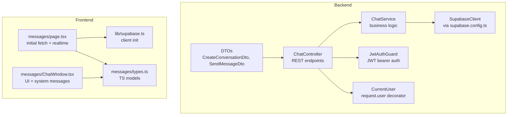
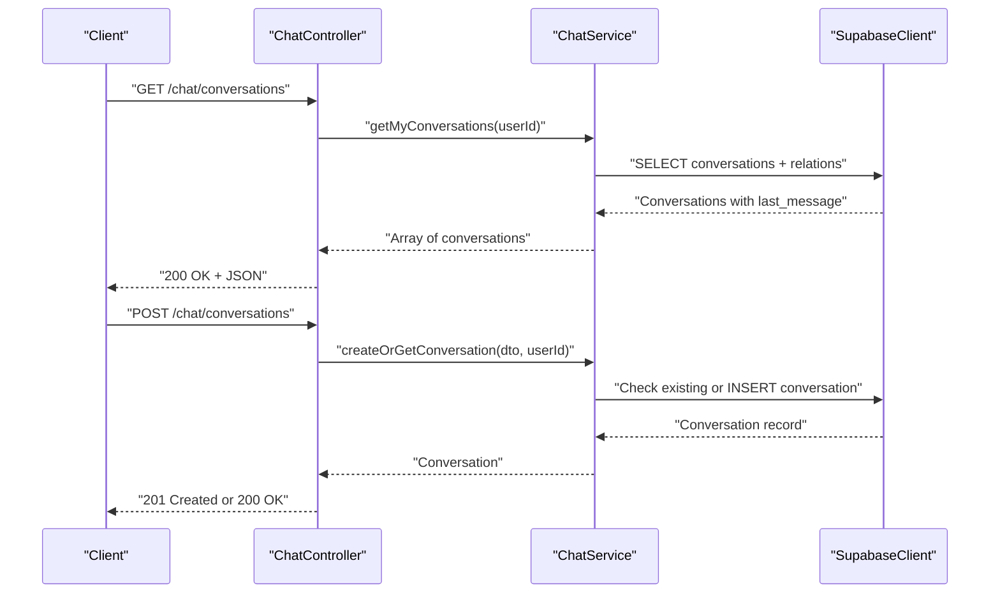
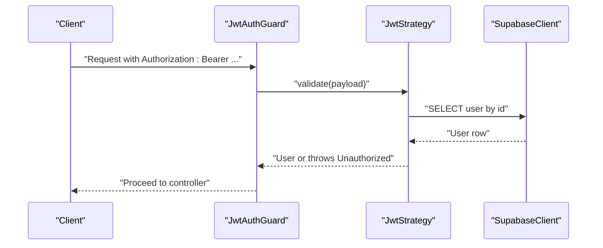
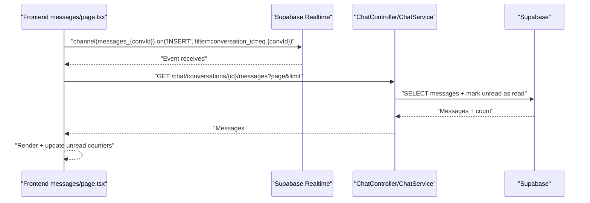
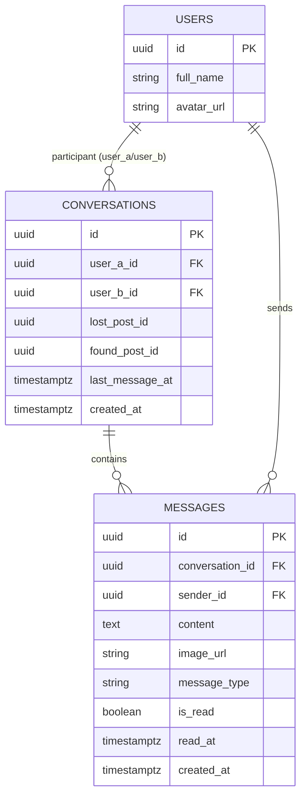
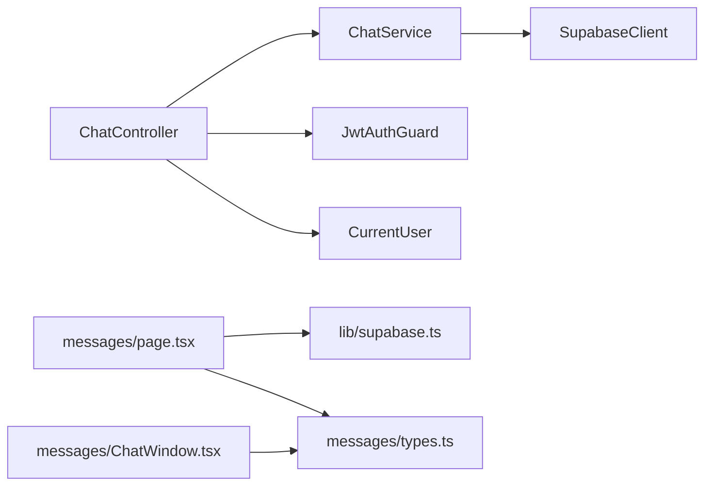

# Chat & Communication API

<cite>
**Referenced Files in This Document**
- [chat.controller.ts](file://backend/src/modules/chat/chat.controller.ts)
- [chat.service.ts](file://backend/src/modules/chat/chat.service.ts)
- [chat.dto.ts](file://backend/src/modules/chat/dto/chat.dto.ts)
- [chat.module.ts](file://backend/src/modules/chat/chat.module.ts)
- [jwt-auth.guard.ts](file://backend/src/common/guards/jwt-auth.guard.ts)
- [current-user.decorator.ts](file://backend/src/common/decorators/current-user.decorator.ts)
- [supabase.config.ts](file://backend/src/config/supabase.config.ts)
- [supabase.ts](file://frontend/app/lib/supabase.ts)
- [types.ts](file://frontend/app/messages/types.ts)
- [page.tsx](file://frontend/app/messages/page.tsx)
- [ChatWindow.tsx](file://frontend/app/messages/ChatWindow.tsx)
- [auth.service.ts](file://backend/src/modules/auth/auth.service.ts)
- [jwt.strategy.ts](file://backend/src/modules/auth/strategies/jwt.strategy.ts)
- [user.entity.ts](file://backend/src/modules/auth/entities/user.entity.ts)
</cite>

## Table of Contents
1. [Introduction](#introduction)
2. [Project Structure](#project-structure)
3. [Core Components](#core-components)
4. [Architecture Overview](#architecture-overview)
5. [Detailed Component Analysis](#detailed-component-analysis)
6. [Dependency Analysis](#dependency-analysis)
7. [Performance Considerations](#performance-considerations)
8. [Troubleshooting Guide](#troubleshooting-guide)
9. [Conclusion](#conclusion)
10. [Appendices](#appendices)

## Introduction
This document describes the Chat & Communication API, covering REST endpoints for conversation management and message handling, and the real-time messaging integration with Supabase. It includes endpoint definitions, request/response schemas, authentication integration, and practical workflows for building chat features.

## Project Structure
The chat feature is implemented as a NestJS module with a controller, service, DTOs, and Swagger annotations. Authentication is enforced via a JWT guard. Frontend integrates Supabase Realtime to subscribe to message insert events and keep the UI synchronized.

**Diagram sources**
- [chat.controller.ts:1-50](file://backend/src/modules/chat/chat.controller.ts#L1-L50)
- [chat.service.ts:1-151](file://backend/src/modules/chat/chat.service.ts#L1-L151)
- [chat.dto.ts:1-36](file://backend/src/modules/chat/dto/chat.dto.ts#L1-L36)
- [jwt-auth.guard.ts:1-29](file://backend/src/common/guards/jwt-auth.guard.ts#L1-L29)
- [current-user.decorator.ts:1-9](file://backend/src/common/decorators/current-user.decorator.ts#L1-L9)
- [supabase.config.ts:1-25](file://backend/src/config/supabase.config.ts#L1-L25)
- [page.tsx:69-113](file://frontend/app/messages/page.tsx#L69-L113)
- [types.ts:1-51](file://frontend/app/messages/types.ts#L1-L51)
- [supabase.ts:1-18](file://frontend/app/lib/supabase.ts#L1-L18)
- [ChatWindow.tsx:263-296](file://frontend/app/messages/ChatWindow.tsx#L263-L296)

**Section sources**
- [chat.controller.ts:1-50](file://backend/src/modules/chat/chat.controller.ts#L1-L50)
- [chat.service.ts:1-151](file://backend/src/modules/chat/chat.service.ts#L1-L151)
- [chat.dto.ts:1-36](file://backend/src/modules/chat/dto/chat.dto.ts#L1-L36)
- [chat.module.ts:1-11](file://backend/src/modules/chat/chat.module.ts#L1-L11)
- [jwt-auth.guard.ts:1-29](file://backend/src/common/guards/jwt-auth.guard.ts#L1-L29)
- [current-user.decorator.ts:1-9](file://backend/src/common/decorators/current-user.decorator.ts#L1-L9)
- [supabase.config.ts:1-25](file://backend/src/config/supabase.config.ts#L1-L25)
- [page.tsx:69-113](file://frontend/app/messages/page.tsx#L69-L113)
- [types.ts:1-51](file://frontend/app/messages/types.ts#L1-L51)
- [supabase.ts:1-18](file://frontend/app/lib/supabase.ts#L1-L18)
- [ChatWindow.tsx:263-296](file://frontend/app/messages/ChatWindow.tsx#L263-L296)

## Core Components
- ChatController: Exposes REST endpoints under /chat for conversations and messages.
- ChatService: Implements business logic for conversations, messages, and unread counts using Supabase.
- DTOs: Strongly typed request bodies for creating conversations and sending messages.
- Authentication: JWT guard enforces bearer auth; CurrentUser decorator injects the authenticated user.
- Frontend Realtime: Subscribes to Supabase postgres_changes to receive live message inserts.

**Section sources**
- [chat.controller.ts:15-48](file://backend/src/modules/chat/chat.controller.ts#L15-L48)
- [chat.service.ts:12-151](file://backend/src/modules/chat/chat.service.ts#L12-L151)
- [chat.dto.ts:4-35](file://backend/src/modules/chat/dto/chat.dto.ts#L4-L35)
- [jwt-auth.guard.ts:7-28](file://backend/src/common/guards/jwt-auth.guard.ts#L7-L28)
- [current-user.decorator.ts:3-8](file://backend/src/common/decorators/current-user.decorator.ts#L3-L8)
- [page.tsx:75-106](file://frontend/app/messages/page.tsx#L75-L106)

## Architecture Overview
The API follows a layered architecture:
- REST endpoints are protected by JWT authentication.
- Controllers delegate to services.
- Services query Supabase for conversations, messages, and metadata.
- Frontend subscribes to Supabase Realtime channels for live updates.

**Diagram sources**
- [chat.controller.ts:15-25](file://backend/src/modules/chat/chat.controller.ts#L15-L25)
- [chat.service.ts:12-66](file://backend/src/modules/chat/chat.service.ts#L12-L66)
- [supabase.config.ts:7-23](file://backend/src/config/supabase.config.ts#L7-L23)

## Detailed Component Analysis

### REST Endpoints

- Base Path: `/chat`
- Authentication: Bearer JWT (required for all endpoints)
- Content-Type: application/json

#### Conversations

- GET `/conversations`
  - Description: List conversations for the authenticated user.
  - Authenticated user ID comes from the JWT payload via the CurrentUser decorator.
  - Response: Array of conversations with embedded last message and participant profiles.
  - Example response shape: see [types.ts:7-21](file://frontend/app/messages/types.ts#L7-L21)

- POST `/conversations`
  - Description: Create a new conversation or fetch an existing one between two users for a specific post context.
  - Request body: CreateConversationDto
    - Fields:
      - `recipient_id`: UUID of the other participant
      - `lost_post_id`: Optional UUID of a lost post context
      - `found_post_id`: Optional UUID of a found post context
  - Response: Conversation object (see [types.ts:7-21](file://frontend/app/messages/types.ts#L7-L21))

#### Messages

- GET `/conversations/:id/messages?page&limit`
  - Description: Retrieve paginated message history for a conversation.
  - Path params:
    - `id`: Conversation UUID
  - Query params:
    - `page`: Page number (default 1)
    - `limit`: Items per page (default 50)
  - Response: Paginated messages array plus metadata (page, limit, total)
  - Notes: Automatically marks unread messages as read for other participants.

- POST `/conversations/:id/messages`
  - Description: Send a new message to a conversation.
  - Path params:
    - `id`: Conversation UUID
  - Request body: SendMessageDto
    - Fields:
      - `content`: Optional text content
      - `image_url`: Optional image URL
      - `message_type`: Enum ['text', 'image', 'system', 'handover_request'] (default 'text')
  - Response: The created message object (see [types.ts:23-36](file://frontend/app/messages/types.ts#L23-L36))

- GET `/unread-count`
  - Description: Get the total count of unread messages for the authenticated user (excluding own messages).

**Section sources**
- [chat.controller.ts:15-48](file://backend/src/modules/chat/chat.controller.ts#L15-L48)
- [chat.dto.ts:4-35](file://backend/src/modules/chat/dto/chat.dto.ts#L4-L35)
- [chat.service.ts:12-151](file://backend/src/modules/chat/chat.service.ts#L12-L151)
- [types.ts:7-36](file://frontend/app/messages/types.ts#L7-L36)

### Authentication Integration
- JWT Guard: Enforces bearer token authentication for all chat endpoints.
- CurrentUser Decorator: Injects the authenticated user into controller methods.
- Backend JWT Strategy: Validates JWT payload against the users table and checks account status.
- Frontend Supabase Client: Initializes with optional Authorization header for server-side rendering scenarios.

**Diagram sources**
- [jwt-auth.guard.ts:13-27](file://backend/src/common/guards/jwt-auth.guard.ts#L13-L27)
- [jwt.strategy.ts:26-38](file://backend/src/modules/auth/strategies/jwt.strategy.ts#L26-L38)
- [supabase.config.ts:7-23](file://backend/src/config/supabase.config.ts#L7-L23)

**Section sources**
- [jwt-auth.guard.ts:7-28](file://backend/src/common/guards/jwt-auth.guard.ts#L7-L28)
- [jwt.strategy.ts:16-39](file://backend/src/modules/auth/strategies/jwt.strategy.ts#L16-L39)
- [auth.service.ts:72-110](file://backend/src/modules/auth/auth.service.ts#L72-L110)
- [user.entity.ts:1-19](file://backend/src/modules/auth/entities/user.entity.ts#L1-L19)

### Real-Time Messaging and Offline Handling
- Frontend Realtime Subscription:
  - Creates a Supabase client and subscribes to a channel scoped to the selected conversation.
  - Listens for INSERT events on the messages table filtered by conversation_id.
  - On receipt, refetches messages from the API to ensure relations (sender) are hydrated.
- Offline Message Handling:
  - The service marks messages as read upon retrieval; unread count excludes the current user’s own messages.
  - Frontend maintains optimistic UI updates while awaiting API responses.

**Diagram sources**
- [page.tsx:75-106](file://frontend/app/messages/page.tsx#L75-L106)
- [chat.controller.ts:27-42](file://backend/src/modules/chat/chat.controller.ts#L27-L42)
- [chat.service.ts:68-100](file://backend/src/modules/chat/chat.service.ts#L68-L100)

**Section sources**
- [page.tsx:75-106](file://frontend/app/messages/page.tsx#L75-L106)
- [supabase.ts:7-17](file://frontend/app/lib/supabase.ts#L7-L17)
- [chat.service.ts:128-136](file://backend/src/modules/chat/chat.service.ts#L128-L136)

### Data Models

**Diagram sources**
- [types.ts:7-36](file://frontend/app/messages/types.ts#L7-L36)
- [chat.service.ts:12-100](file://backend/src/modules/chat/chat.service.ts#L12-L100)

## Dependency Analysis

**Diagram sources**
- [chat.controller.ts:1-13](file://backend/src/modules/chat/chat.controller.ts#L1-L13)
- [chat.service.ts:1-10](file://backend/src/modules/chat/chat.service.ts#L1-L10)
- [jwt-auth.guard.ts:1-5](file://backend/src/common/guards/jwt-auth.guard.ts#L1-L5)
- [current-user.decorator.ts:1-8](file://backend/src/common/decorators/current-user.decorator.ts#L1-L8)
- [supabase.config.ts:1-23](file://backend/src/config/supabase.config.ts#L1-L23)
- [page.tsx:75-106](file://frontend/app/messages/page.tsx#L75-L106)
- [types.ts:1-51](file://frontend/app/messages/types.ts#L1-L51)
- [supabase.ts:1-18](file://frontend/app/lib/supabase.ts#L1-L18)
- [ChatWindow.tsx:263-296](file://frontend/app/messages/ChatWindow.tsx#L263-L296)

**Section sources**
- [chat.module.ts:1-11](file://backend/src/modules/chat/chat.module.ts#L1-L11)
- [supabase.config.ts:7-23](file://backend/src/config/supabase.config.ts#L7-L23)

## Performance Considerations
- Pagination: Use page and limit query parameters to avoid large payloads.
- Read marking: The service marks unread messages as read on retrieval; consider caching recent message lists on the client to reduce redundant reads.
- Realtime efficiency: Subscribe only to the active conversation channel to minimize bandwidth.
- Image URLs: Prefer pre-signed URLs for secure image delivery.

## Troubleshooting Guide
- 401 Unauthorized: Ensure the Authorization header contains a valid JWT issued by the authentication service.
- 403 Forbidden: The authenticated user is not a participant of the requested conversation.
- 404 Not Found: Conversation does not exist.
- Validation errors:
  - Creating a conversation with self is rejected.
  - Sending a message requires either content or image_url.
- Realtime not updating:
  - Confirm the frontend is subscribed to the correct channel name pattern and filter.
  - Verify the Supabase client is initialized with the correct URL and keys.

**Section sources**
- [chat.service.ts:38-41](file://backend/src/modules/chat/chat.service.ts#L38-L41)
- [chat.service.ts:103-105](file://backend/src/modules/chat/chat.service.ts#L103-L105)
- [chat.service.ts:145-148](file://backend/src/modules/chat/chat.service.ts#L145-L148)
- [page.tsx:89-101](file://frontend/app/messages/page.tsx#L89-L101)

## Conclusion
The Chat & Communication API provides robust REST endpoints for conversation and message management, integrated with JWT authentication and Supabase Realtime for live updates. The frontend efficiently handles real-time synchronization and offline-friendly UX patterns.

## Appendices

### Endpoint Reference

- GET `/chat/conversations`
  - Auth: Required
  - Response: Array of conversations with last message and participant info

- POST `/chat/conversations`
  - Auth: Required
  - Request: CreateConversationDto
  - Response: Conversation

- GET `/chat/conversations/:id/messages?page&limit`
  - Auth: Required
  - Response: Paginated messages + metadata

- POST `/chat/conversations/:id/messages`
  - Auth: Required
  - Request: SendMessageDto
  - Response: Message

- GET `/chat/unread-count`
  - Auth: Required
  - Response: { unread: number }

### DTO Schemas

- CreateConversationDto
  - recipient_id: string (UUID)
  - lost_post_id: string (UUID, optional)
  - found_post_id: string (UUID, optional)

- SendMessageDto
  - content: string (optional)
  - image_url: string (optional)
  - message_type: enum ['text','image','system','handover_request'] (optional, default 'text')

**Section sources**
- [chat.dto.ts:4-35](file://backend/src/modules/chat/dto/chat.dto.ts#L4-L35)
- [types.ts:7-36](file://frontend/app/messages/types.ts#L7-L36)