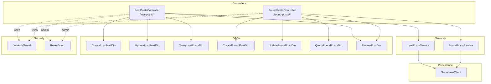
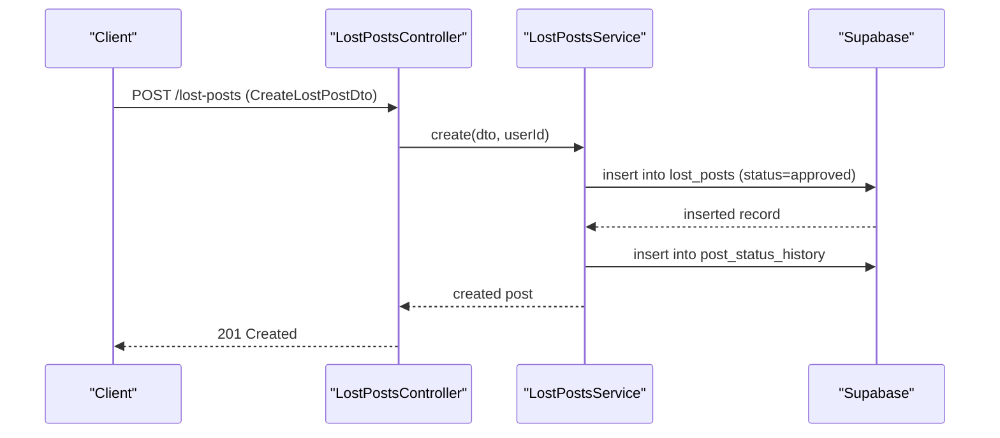
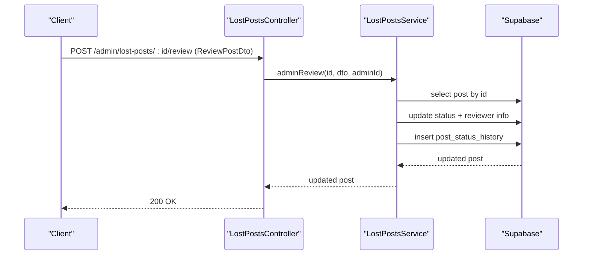
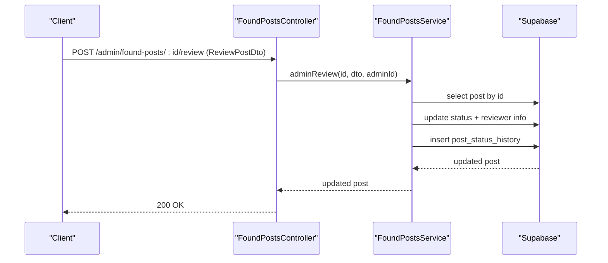
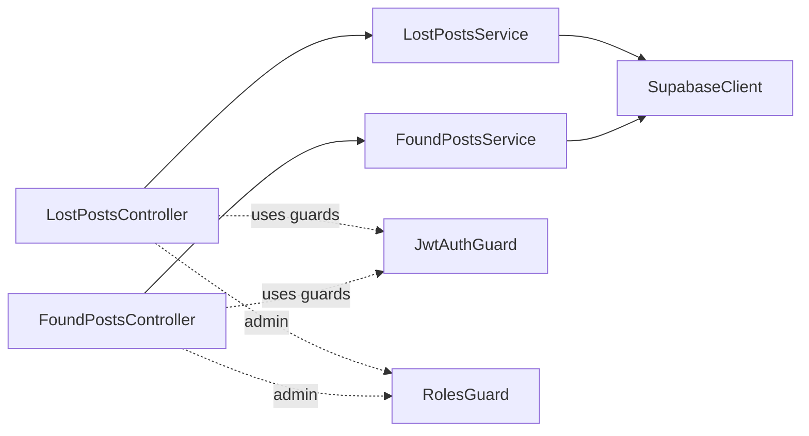

# Posts Management API

<cite>
**Referenced Files in This Document**
- [lost-posts.controller.ts](file://backend/src/modules/lost-posts/lost-posts.controller.ts)
- [found-posts.controller.ts](file://backend/src/modules/found-posts/found-posts.controller.ts)
- [lost-posts.service.ts](file://backend/src/modules/lost-posts/lost-posts.service.ts)
- [found-posts.service.ts](file://backend/src/modules/found-posts/found-posts.service.ts)
- [create-lost-post.dto.ts](file://backend/src/modules/lost-posts/dto/create-lost-post.dto.ts)
- [create-found-post.dto.ts](file://backend/src/modules/found-posts/dto/create-found-post.dto.ts)
- [update-lost-post.dto.ts](file://backend/src/modules/lost-posts/dto/update-lost-post.dto.ts)
- [update-found-post.dto.ts](file://backend/src/modules/found-posts/dto/update-found-post.dto.ts)
- [query-lost-posts.dto.ts](file://backend/src/modules/lost-posts/dto/query-lost-posts.dto.ts)
- [query-found-posts.dto.ts](file://backend/src/modules/found-posts/dto/query-found-posts.dto.ts)
- [review-post.dto.ts](file://backend/src/modules/lost-posts/dto/review-post.dto.ts)
- [jwt-auth.guard.ts](file://backend/src/common/guards/jwt-auth.guard.ts)
- [roles.guard.ts](file://backend/src/common/guards/roles.guard.ts)
- [supabase.config.ts](file://backend/src/config/supabase.config.ts)
- [main.ts](file://backend/src/main.ts)
</cite>

## Table of Contents
1. [Introduction](#introduction)
2. [Project Structure](#project-structure)
3. [Core Components](#core-components)
4. [Architecture Overview](#architecture-overview)
5. [Detailed Component Analysis](#detailed-component-analysis)
6. [Dependency Analysis](#dependency-analysis)
7. [Performance Considerations](#performance-considerations)
8. [Troubleshooting Guide](#troubleshooting-guide)
9. [Conclusion](#conclusion)
10. [Appendices](#appendices)

## Introduction
This document describes the Posts Management API for Lost and Found posts. It covers HTTP endpoints, request/response schemas, validation rules, authentication and authorization requirements, approval workflows, status management, filtering, and search. The API supports CRUD operations for both lost posts and found posts, with administrative review endpoints for status transitions.

## Project Structure
The API is organized into two primary modules:
- Lost Posts: endpoints under /lost-posts/*
- Found Posts: endpoints under /found-posts/*

Controllers define routes and delegate to services. Services interact with Supabase for data persistence and status history logging. DTOs define request schemas and validation rules. Guards enforce authentication and role-based access for admin-only endpoints.

**Diagram sources**
- [lost-posts.controller.ts:20-77](file://backend/src/modules/lost-posts/lost-posts.controller.ts#L20-L77)
- [found-posts.controller.ts:20-77](file://backend/src/modules/found-posts/found-posts.controller.ts#L20-L77)
- [lost-posts.service.ts:14-188](file://backend/src/modules/lost-posts/lost-posts.service.ts#L14-L188)
- [found-posts.service.ts:14-161](file://backend/src/modules/found-posts/found-posts.service.ts#L14-L161)
- [jwt-auth.guard.ts:7-28](file://backend/src/common/guards/jwt-auth.guard.ts#L7-L28)
- [roles.guard.ts:6-27](file://backend/src/common/guards/roles.guard.ts#L6-L27)
- [supabase.config.ts:7-23](file://backend/src/config/supabase.config.ts#L7-L23)

**Section sources**
- [lost-posts.controller.ts:1-78](file://backend/src/modules/lost-posts/lost-posts.controller.ts#L1-L78)
- [found-posts.controller.ts:1-78](file://backend/src/modules/found-posts/found-posts.controller.ts#L1-L78)
- [main.ts:29-37](file://backend/src/main.ts#L29-L37)

## Core Components
- Authentication and Authorization
  - All endpoints except public routes require a bearer token via JWT guard.
  - Admin-only endpoints require the "admin" role via roles guard.
- Request Validation
  - Global ValidationPipe enforces DTO validation and transforms parameters.
- Persistence
  - Supabase client is configured once and reused across services.

Key behaviors:
- Public feed endpoints return approved posts only.
- Creation automatically sets initial status to "approved".
- Admin review endpoint updates status to "approved" or "rejected" and logs status history.
- View counts are incremented on detail retrieval (fire-and-forget).

**Section sources**
- [jwt-auth.guard.ts:7-28](file://backend/src/common/guards/jwt-auth.guard.ts#L7-L28)
- [roles.guard.ts:6-27](file://backend/src/common/guards/roles.guard.ts#L6-L27)
- [main.ts:14-21](file://backend/src/main.ts#L14-L21)
- [supabase.config.ts:7-23](file://backend/src/config/supabase.config.ts#L7-L23)
- [lost-posts.service.ts:19-43](file://backend/src/modules/lost-posts/lost-posts.service.ts#L19-L43)
- [found-posts.service.ts:19-38](file://backend/src/modules/found-posts/found-posts.service.ts#L19-L38)

## Architecture Overview
The API follows a layered architecture:
- Controllers: Define HTTP routes and bind DTOs.
- Services: Implement business logic, enforce permissions, and call Supabase.
- DTOs: Define schemas and validation rules.
- Guards: Enforce auth and roles.
- Supabase: Data persistence and status history.

**Diagram sources**
- [lost-posts.controller.ts:24-28](file://backend/src/modules/lost-posts/lost-posts.controller.ts#L24-L28)
- [lost-posts.service.ts:19-43](file://backend/src/modules/lost-posts/lost-posts.service.ts#L19-L43)

## Detailed Component Analysis

### Lost Posts API

#### Endpoints
- POST /lost-posts
  - Description: Create a new lost post.
  - Auth: Required (JWT).
  - Request body: CreateLostPostDto.
  - Response: Created post object.
  - Notes: Status set to "approved" automatically.

- GET /lost-posts
  - Description: Public feed of lost posts.
  - Auth: Public (no JWT required).
  - Query params: QueryLostPostsDto (filtering and pagination).
  - Response: Paginated list with metadata.

- GET /lost-posts/my
  - Description: List posts created by the authenticated user.
  - Auth: Required (JWT).
  - Response: Array of posts.

- GET /lost-posts/:id
  - Description: Retrieve a single lost post by ID.
  - Auth: Public (no JWT required).
  - Response: Post object (view count incremented).

- PATCH /lost-posts/:id
  - Description: Update a lost post.
  - Auth: Required (JWT).
  - Permissions: Owner or admin; editable only when status is pending or approved.
  - Request body: UpdateLostPostDto.
  - Response: Updated post.

- DELETE /lost-posts/:id
  - Description: Delete a lost post.
  - Auth: Required (JWT).
  - Permissions: Owner or admin.
  - Response: Deletion confirmation.

- GET /admin/lost-posts/pending
  - Description: List pending lost posts for admin review.
  - Auth: Required (JWT + admin role).
  - Response: Array of pending posts.

- POST /admin/lost-posts/:id/review
  - Description: Admin approves or rejects a lost post.
  - Auth: Required (JWT + admin role).
  - Request body: ReviewPostDto (action: approved or rejected, optional reason).
  - Response: Updated post with reviewer info and timestamp.
  - Notes: Logs status history with reason if rejected.

**Section sources**
- [lost-posts.controller.ts:24-77](file://backend/src/modules/lost-posts/lost-posts.controller.ts#L24-L77)

#### Request/Response Schemas

- CreateLostPostDto
  - title: string (min 10, max 255)
  - description: string (min 20)
  - location_lost: string
  - time_lost: date-time string
  - category_id: uuid (optional)
  - image_urls: array of urls (optional)
  - contact_info: string (optional)
  - is_urgent: boolean (optional)
  - reward_note: string (max 255, optional)

- UpdateLostPostDto
  - Inherits all fields from CreateLostPostDto as optional (partial update).

- QueryLostPostsDto
  - status: enum ["pending","approved","rejected","matched","closed"] (optional)
  - category_id: uuid (optional)
  - search: string (optional)
  - page: integer >= 1 (default 1)
  - limit: integer >= 1, <= 100 (default 20)

- ReviewPostDto
  - action: enum ["approved","rejected"]
  - reason: string (required if rejected)

Example request payload (create):
- title: "Mất ba lô đen tại thư viện"
- description: "Ba lô đen Nike có máy tính bên trong..."
- location_lost: "Thư viện tòa B, Cơ sở A UEH"
- time_lost: "2026-04-10T14:00:00Z"
- category_id: "00000000-0000-0000-0000-000000000000"
- image_urls: ["https://example.com/image1.jpg"]
- contact_info: "Call 0123456789"
- is_urgent: true
- reward_note: "Reward up to $50"

Example admin review payload:
- action: "approved"
- reason: "Approved after verification"

**Section sources**
- [create-lost-post.dto.ts:14-60](file://backend/src/modules/lost-posts/dto/create-lost-post.dto.ts#L14-L60)
- [update-lost-post.dto.ts:4-5](file://backend/src/modules/lost-posts/dto/update-lost-post.dto.ts#L4-L5)
- [query-lost-posts.dto.ts:5-35](file://backend/src/modules/lost-posts/dto/query-lost-posts.dto.ts#L5-L35)
- [review-post.dto.ts:4-13](file://backend/src/modules/lost-posts/dto/review-post.dto.ts#L4-L13)

#### Approval Workflow (Lost Posts)

**Diagram sources**
- [lost-posts.controller.ts:70-76](file://backend/src/modules/lost-posts/lost-posts.controller.ts#L70-L76)
- [lost-posts.service.ts:139-171](file://backend/src/modules/lost-posts/lost-posts.service.ts#L139-L171)

### Found Posts API

#### Endpoints
- POST /found-posts
  - Description: Create a new found post.
  - Auth: Required (JWT).
  - Request body: CreateFoundPostDto.
  - Response: Created post object.
  - Notes: Status set to "approved" automatically.

- GET /found-posts
  - Description: Public feed of found posts.
  - Auth: Public (no JWT required).
  - Query params: QueryFoundPostsDto (filtering and pagination).
  - Response: Paginated list with metadata.

- GET /found-posts/my
  - Description: List posts created by the authenticated user.
  - Auth: Required (JWT).
  - Response: Array of posts.

- GET /found-posts/:id
  - Description: Retrieve a single found post by ID.
  - Auth: Public (no JWT required).
  - Response: Post object (view count incremented).

- PATCH /found-posts/:id
  - Description: Update a found post.
  - Auth: Required (JWT).
  - Permissions: Owner or admin.
  - Request body: UpdateFoundPostDto.
  - Response: Updated post.

- DELETE /found-posts/:id
  - Description: Delete a found post.
  - Auth: Required (JWT).
  - Permissions: Owner or admin.
  - Response: Deletion confirmation.

- GET /admin/found-posts/pending
  - Description: List pending found posts for admin review.
  - Auth: Required (JWT + admin role).
  - Response: Array of pending posts.

- POST /admin/found-posts/:id/review
  - Description: Admin approves or rejects a found post.
  - Auth: Required (JWT + admin role).
  - Request body: ReviewPostDto (action: approved or rejected, optional reason).
  - Response: Updated post with reviewer info and timestamp.
  - Notes: Logs status history with reason if rejected.

**Section sources**
- [found-posts.controller.ts:24-77](file://backend/src/modules/found-posts/found-posts.controller.ts#L24-L77)

#### Request/Response Schemas

- CreateFoundPostDto
  - title: string (min 10, max 255)
  - description: string (min 20)
  - location_found: string
  - time_found: date-time string
  - category_id: uuid (optional)
  - image_urls: array of urls (optional)
  - contact_info: string (optional)
  - is_in_storage: boolean (optional)

- UpdateFoundPostDto
  - Inherits all fields from CreateFoundPostDto as optional (partial update).

- QueryFoundPostsDto
  - status: enum ["pending","approved","rejected","matched","closed"] (optional)
  - category_id: uuid (optional)
  - search: string (optional)
  - page: integer >= 1 (default 1)
  - limit: integer >= 1, <= 100 (default 20)

- ReviewPostDto
  - action: enum ["approved","rejected"]
  - reason: string (required if rejected)

Example request payload (create):
- title: "Nhặt được ví tại sân B"
- description: "Ví màu nâu, có thẻ sinh viên bên trong..."
- location_found: "Sân phía sau tòa B, Cơ sở A UEH"
- time_found: "2026-04-10T14:00:00Z"
- category_id: "00000000-0000-0000-0000-000000000000"
- image_urls: ["https://example.com/image1.jpg"]
- contact_info: "Email user@example.com"
- is_in_storage: true

Example admin review payload:
- action: "rejected"
- reason: "Item already returned"

**Section sources**
- [create-found-post.dto.ts:7-47](file://backend/src/modules/found-posts/dto/create-found-post.dto.ts#L7-L47)
- [update-found-post.dto.ts:4-5](file://backend/src/modules/found-posts/dto/update-found-post.dto.ts#L4-L5)
- [query-found-posts.dto.ts:5-35](file://backend/src/modules/found-posts/dto/query-found-posts.dto.ts#L5-L35)
- [review-post.dto.ts:4-13](file://backend/src/modules/lost-posts/dto/review-post.dto.ts#L4-L13)

#### Approval Workflow (Found Posts)

**Diagram sources**
- [found-posts.controller.ts:70-76](file://backend/src/modules/found-posts/found-posts.controller.ts#L70-L76)
- [found-posts.service.ts:117-145](file://backend/src/modules/found-posts/found-posts.service.ts#L117-L145)

### Filtering and Search
Both lost and found posts support:
- status filter: one of ["pending","approved","rejected","matched","closed"]
- category_id filter: UUID
- search: substring match on title (case-insensitive)
- Pagination: page (>=1), limit (>=1, <=100)

Sorting:
- Lost posts: prioritized urgent items, then newest first
- Found posts: newest first

**Section sources**
- [query-lost-posts.dto.ts:5-35](file://backend/src/modules/lost-posts/dto/query-lost-posts.dto.ts#L5-L35)
- [query-found-posts.dto.ts:5-35](file://backend/src/modules/found-posts/dto/query-found-posts.dto.ts#L5-L35)
- [lost-posts.service.ts:45-73](file://backend/src/modules/lost-posts/lost-posts.service.ts#L45-L73)
- [found-posts.service.ts:40-67](file://backend/src/modules/found-posts/found-posts.service.ts#L40-L67)

### Image Upload Handling
- image_urls is an optional array of URLs.
- Validation ensures each URL is a valid URL and the field is an array when present.
- No server-side upload endpoint is exposed; images must be hosted externally and referenced by URL.

**Section sources**
- [create-lost-post.dto.ts:39-43](file://backend/src/modules/lost-posts/dto/create-lost-post.dto.ts#L39-L43)
- [create-found-post.dto.ts:32-36](file://backend/src/modules/found-posts/dto/create-found-post.dto.ts#L32-L36)

### Status Management
- Initial status on creation: "approved"
- Admin review actions: "approved" or "rejected"
- Rejected posts require a reason
- Status transitions are logged in post_status_history with post_type ("lost" or "found"), timestamps, and notes

**Section sources**
- [lost-posts.service.ts:25-40](file://backend/src/modules/lost-posts/lost-posts.service.ts#L25-L40)
- [found-posts.service.ts:22-37](file://backend/src/modules/found-posts/found-posts.service.ts#L22-L37)
- [lost-posts.service.ts:161-168](file://backend/src/modules/lost-posts/lost-posts.service.ts#L161-L168)
- [found-posts.service.ts:135-142](file://backend/src/modules/found-posts/found-posts.service.ts#L135-L142)

## Dependency Analysis

**Diagram sources**
- [lost-posts.controller.ts:17-22](file://backend/src/modules/lost-posts/lost-posts.controller.ts#L17-L22)
- [found-posts.controller.ts:17-22](file://backend/src/modules/found-posts/found-posts.controller.ts#L17-L22)
- [jwt-auth.guard.ts:7-28](file://backend/src/common/guards/jwt-auth.guard.ts#L7-L28)
- [roles.guard.ts:6-27](file://backend/src/common/guards/roles.guard.ts#L6-L27)
- [supabase.config.ts:7-23](file://backend/src/config/supabase.config.ts#L7-L23)

**Section sources**
- [lost-posts.controller.ts:1-78](file://backend/src/modules/lost-posts/lost-posts.controller.ts#L1-L78)
- [found-posts.controller.ts:1-78](file://backend/src/modules/found-posts/found-posts.controller.ts#L1-L78)
- [jwt-auth.guard.ts:1-29](file://backend/src/common/guards/jwt-auth.guard.ts#L1-L29)
- [roles.guard.ts:1-28](file://backend/src/common/guards/roles.guard.ts#L1-L28)
- [supabase.config.ts:1-25](file://backend/src/config/supabase.config.ts#L1-L25)

## Performance Considerations
- Pagination defaults prevent large payloads; keep limit reasonable.
- Public feeds filter by status="approved" to reduce load.
- View count increments are fire-and-forget to avoid blocking responses.
- Sorting by created_at and is_urgent minimizes index usage on large datasets.

## Troubleshooting Guide
Common errors and causes:
- Unauthorized: Missing or invalid Bearer token.
- Forbidden: Non-admin attempting admin-only endpoints; insufficient permissions to edit/delete others' posts; post outside editable statuses.
- Not Found: Post ID does not exist.
- Validation errors: DTO validation failures (e.g., missing required fields, invalid URL format, out-of-range page/limit).

Resolution steps:
- Verify Authorization header contains a valid JWT.
- Confirm user role for admin endpoints.
- Ensure query parameters meet validation constraints.
- Check that posts are in allowed statuses for editing/deletion.

**Section sources**
- [jwt-auth.guard.ts:22-27](file://backend/src/common/guards/jwt-auth.guard.ts#L22-L27)
- [roles.guard.ts:18-25](file://backend/src/common/guards/roles.guard.ts#L18-L25)
- [lost-posts.service.ts:108-114](file://backend/src/modules/lost-posts/lost-posts.service.ts#L108-L114)
- [found-posts.service.ts:96-104](file://backend/src/modules/found-posts/found-posts.service.ts#L96-L104)

## Conclusion
The Posts Management API provides a robust foundation for managing lost and found posts with clear separation of concerns, strong validation, and admin review workflows. Public feeds, filtering, and pagination ensure efficient discovery, while status logging maintains auditability.

## Appendices

### Authentication and Authorization Summary
- All endpoints except public routes require a Bearer token.
- Admin-only routes require role "admin".

**Section sources**
- [jwt-auth.guard.ts:13-20](file://backend/src/common/guards/jwt-auth.guard.ts#L13-L20)
- [roles.guard.ts:10-26](file://backend/src/common/guards/roles.guard.ts#L10-L26)

### Example Query Parameters
- Lost posts feed:
  - status=pending&category_id=00000000-0000-0000-0000-000000000000&page=1&limit=20&search=laptop
- Found posts feed:
  - status=approved&category_id=...&page=2&limit=10&search=wallet

**Section sources**
- [query-lost-posts.dto.ts:5-35](file://backend/src/modules/lost-posts/dto/query-lost-posts.dto.ts#L5-L35)
- [query-found-posts.dto.ts:5-35](file://backend/src/modules/found-posts/dto/query-found-posts.dto.ts#L5-L35)