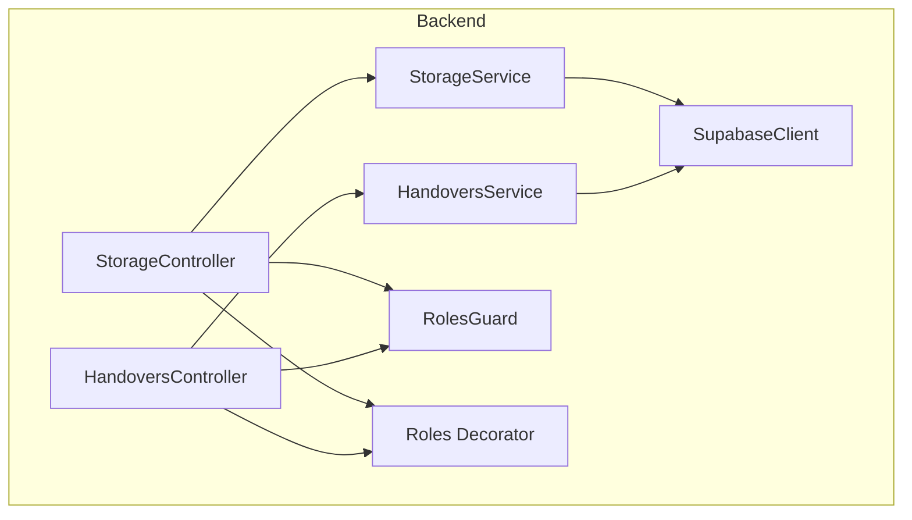
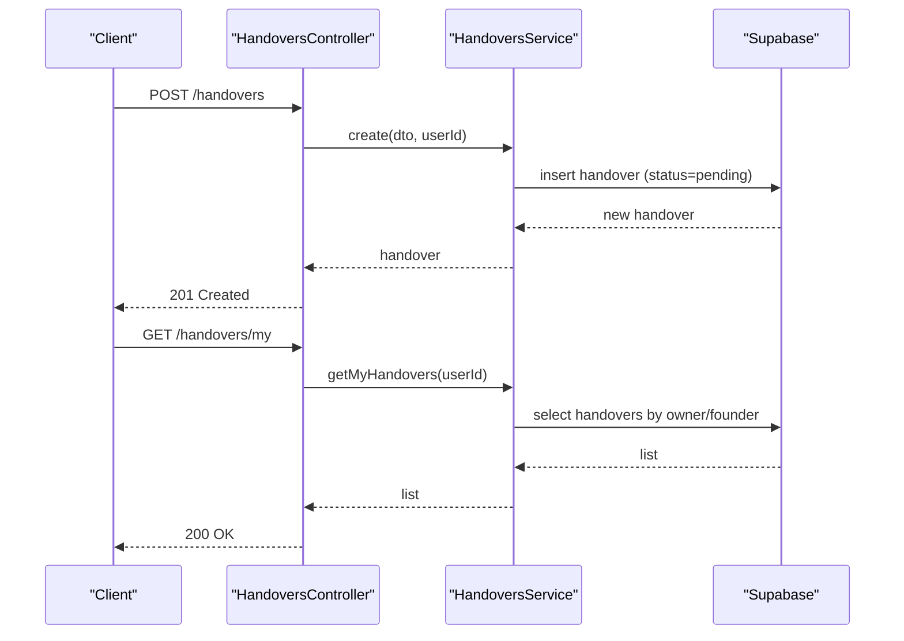
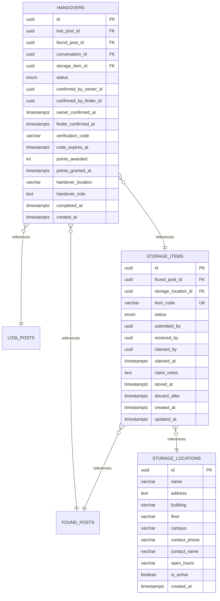
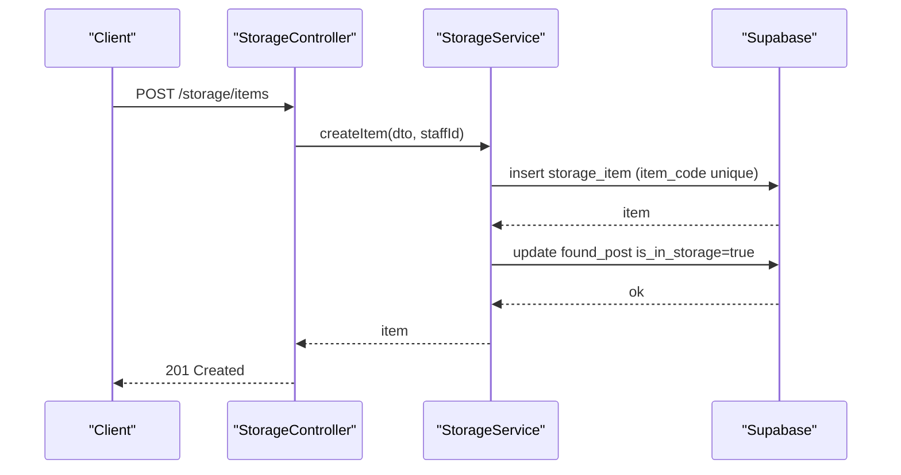
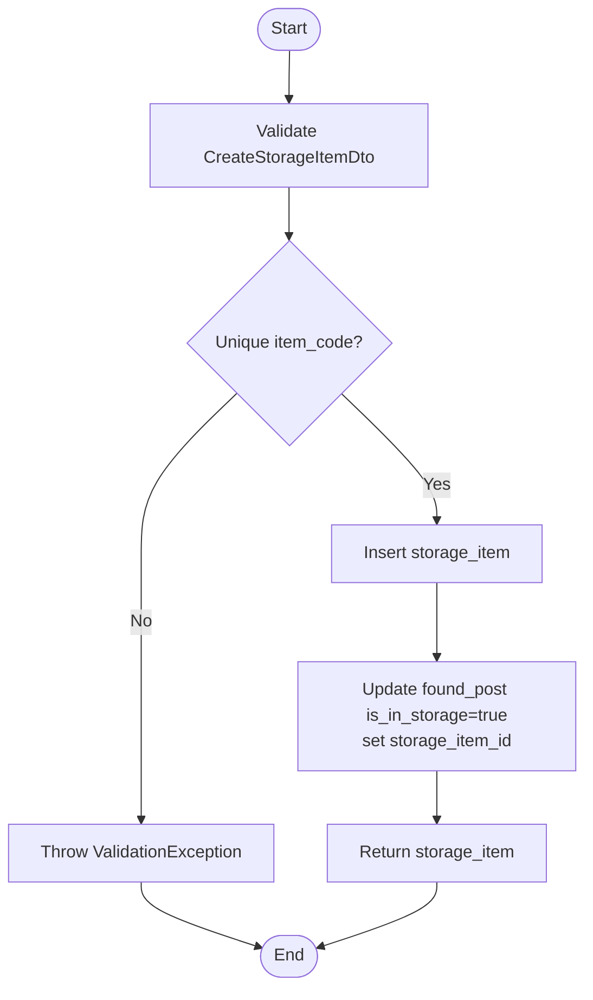
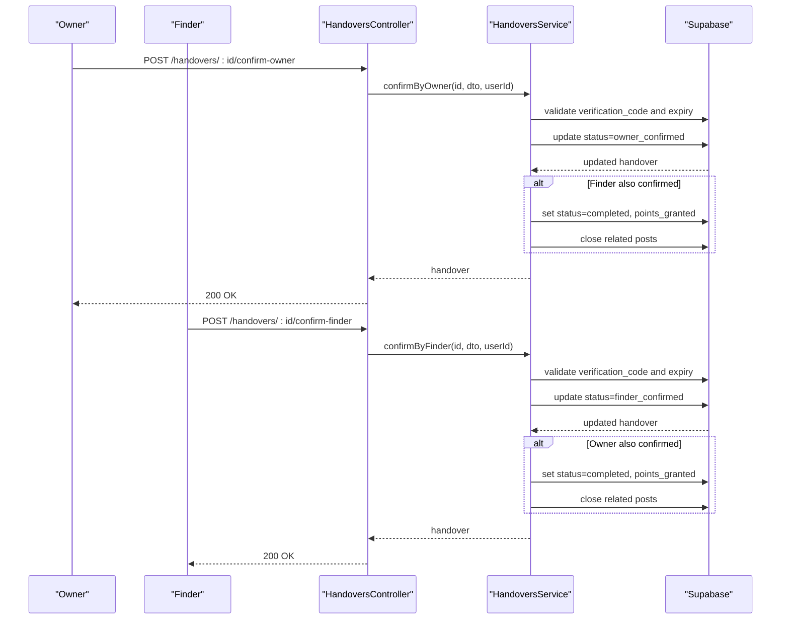
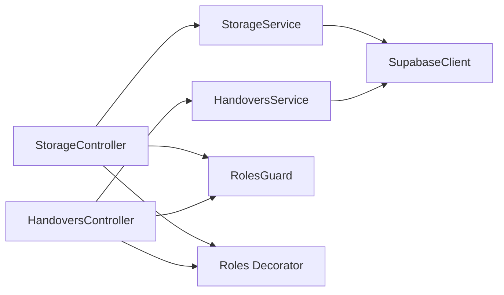

# Storage & Handover API

<cite>
**Referenced Files in This Document**
- [storage.controller.ts](file://backend/src/modules/storage/storage.controller.ts)
- [storage.service.ts](file://backend/src/modules/storage/storage.service.ts)
- [storage.dto.ts](file://backend/src/modules/storage/dto/storage.dto.ts)
- [handovers.controller.ts](file://backend/src/modules/handovers/handovers.controller.ts)
- [handovers.service.ts](file://backend/src/modules/handovers/handovers.service.ts)
- [handover.dto.ts](file://backend/src/modules/handovers/dto/handover.dto.ts)
- [supabase.config.ts](file://backend/src/config/supabase.config.ts)
- [roles.guard.ts](file://backend/src/common/guards/roles.guard.ts)
- [roles.decorator.ts](file://backend/src/common/decorators/roles.decorator.ts)
- [OVERVIEW.md](file://OVERVIEW.md)
</cite>

## Table of Contents
1. [Introduction](#introduction)
2. [Project Structure](#project-structure)
3. [Core Components](#core-components)
4. [Architecture Overview](#architecture-overview)
5. [Detailed Component Analysis](#detailed-component-analysis)
6. [Dependency Analysis](#dependency-analysis)
7. [Performance Considerations](#performance-considerations)
8. [Troubleshooting Guide](#troubleshooting-guide)
9. [Conclusion](#conclusion)

## Introduction
This document provides API documentation for the Storage and Handover modules integrated with the campus storage system. It covers endpoints for storage allocation, item registration, handover approval workflows, and status tracking. It also documents storage capacity management, item location tracking, and handover documentation requirements, including integration with the training points approval system.

## Project Structure
The Storage and Handover APIs are implemented as NestJS modules with controllers, services, DTOs, and guards. They integrate with Supabase for data persistence and rely on row-level security and database functions for business logic.

**Diagram sources**
- [storage.controller.ts:14-58](file://backend/src/modules/storage/storage.controller.ts#L14-L58)
- [storage.service.ts:8-10](file://backend/src/modules/storage/storage.service.ts#L8-L10)
- [handovers.controller.ts:11-43](file://backend/src/modules/handovers/handovers.controller.ts#L11-L43)
- [handovers.service.ts:8-10](file://backend/src/modules/handovers/handovers.service.ts#L8-L10)
- [supabase.config.ts:7-23](file://backend/src/config/supabase.config.ts#L7-L23)
- [roles.guard.ts:6-26](file://backend/src/common/guards/roles.guard.ts#L6-L26)
- [roles.decorator.ts:3-4](file://backend/src/common/decorators/roles.decorator.ts#L3-L4)

**Section sources**
- [storage.controller.ts:14-58](file://backend/src/modules/storage/storage.controller.ts#L14-L58)
- [handovers.controller.ts:11-43](file://backend/src/modules/handovers/handovers.controller.ts#L11-L43)
- [supabase.config.ts:7-23](file://backend/src/config/supabase.config.ts#L7-L23)

## Core Components
- Storage module: Provides endpoints to list storage locations, list/view items, search by item code, create items, and claim items.
- Handovers module: Provides endpoints to create handover requests, list user’s handovers, fetch details, and confirm handovers by owner or finder.

Key responsibilities:
- StorageService: Interacts with storage_locations and storage_items tables; validates uniqueness of item codes; updates related found_post entries; manages item claiming lifecycle.
- HandoversService: Validates ownership, enforces 6-digit verification code with expiry, transitions statuses, grants training points via database function, and closes related posts.

**Section sources**
- [storage.service.ts:12-115](file://backend/src/modules/storage/storage.service.ts#L12-L115)
- [handovers.service.ts:12-145](file://backend/src/modules/handovers/handovers.service.ts#L12-L145)

## Architecture Overview
The API follows a layered architecture:
- Controllers expose HTTP endpoints and apply guards and decorators.
- Services encapsulate business logic and interact with Supabase.
- DTOs define request/response schemas with validation.
- Guards enforce role-based access for storage staff actions.
- Database functions and RLS handle training points and row-level permissions.

**Diagram sources**
- [handovers.controller.ts:15-25](file://backend/src/modules/handovers/handovers.controller.ts#L15-L25)
- [handovers.service.ts:12-32](file://backend/src/modules/handovers/handovers.service.ts#L12-L32)
- [handovers.service.ts:133-145](file://backend/src/modules/handovers/handovers.service.ts#L133-L145)

## Detailed Component Analysis

### Storage Endpoints

- Base Path: `/storage`
- Authentication: Bearer JWT required for protected endpoints; some endpoints are public.

Endpoints:
- GET /storage/locations
  - Description: List active storage locations.
  - Auth: Public.
  - Response: Array of locations with campus, address, and contact info.

- GET /storage/items
  - Description: List items optionally filtered by location ID.
  - Auth: Public.
  - Query: location_id (optional).
  - Response: Array of items with associated found post and location metadata.

- GET /storage/items/search
  - Description: Search items by partial item code.
  - Auth: Public.
  - Query: code (required).
  - Response: Array of items with found post title/image URLs and location contact phone.

- GET /storage/items/:id
  - Description: Retrieve item details with found post owner and location.
  - Auth: Public.
  - Path: id (UUID).
  - Response: Item with nested found post and location.

- POST /storage/items
  - Description: Register a found item into storage (staff/admin).
  - Auth: JWT + RolesGuard (admin, storage_staff).
  - Request Body: CreateStorageItemDto.
  - Response: New storage item.
  - Side effects: Updates found_post is_in_storage and links storage_item_id.

- PATCH /storage/items/:id/claim
  - Description: Mark item as claimed by a user.
  - Auth: JWT.
  - Path: id (UUID).
  - Request Body: ClaimStorageItemDto.
  - Response: Updated item with claim metadata.

Request/Response Schemas:
- CreateStorageItemDto
  - Fields:
    - found_post_id: UUID
    - storage_location_id: UUID
    - item_code: String (unique)
    - discard_after: String (date-time, optional)
- ClaimStorageItemDto
  - Fields:
    - claim_notes: String

Notes:
- Item code uniqueness is enforced before insertion.
- Status transitions:
  - Stored item can be claimed; claimed items cannot be re-claimed.
- Location filtering supports capacity-aware workflows by campus and building.

**Section sources**
- [storage.controller.ts:18-58](file://backend/src/modules/storage/storage.controller.ts#L18-L58)
- [storage.service.ts:21-78](file://backend/src/modules/storage/storage.service.ts#L21-L78)
- [storage.service.ts:80-100](file://backend/src/modules/storage/storage.service.ts#L80-L100)
- [storage.dto.ts:4-27](file://backend/src/modules/storage/dto/storage.dto.ts#L4-L27)
- [roles.guard.ts:6-26](file://backend/src/common/guards/roles.guard.ts#L6-L26)
- [roles.decorator.ts:3-4](file://backend/src/common/decorators/roles.decorator.ts#L3-L4)

### Handover Endpoints

- Base Path: `/handovers`
- Authentication: Bearer JWT required.

Endpoints:
- POST /handovers
  - Description: Create a handover request between a lost post owner and a found post poster.
  - Auth: JWT.
  - Request Body: CreateHandoverDto.
  - Response: New handover with status=pending.
  - Validation: Caller must own the lost post.

- GET /handovers/my
  - Description: List handovers where the user is owner or finder.
  - Auth: JWT.
  - Response: Array of handovers with related post titles.

- GET /handovers/:id
  - Description: Fetch detailed handover with related posts and storage item.
  - Auth: JWT.
  - Path: id (UUID).
  - Response: Handover with nested post and storage item/location info.

- POST /handovers/:id/confirm-owner
  - Description: Owner confirms handover using a 6-digit verification code.
  - Auth: JWT.
  - Path: id (UUID).
  - Request Body: ConfirmHandoverDto.
  - Response: Updated handover; if finder also confirmed, transitions to completed and grants points.

- POST /handovers/:id/confirm-finder
  - Description: Finder confirms handover using the same verification code.
  - Auth: JWT.
  - Path: id (UUID).
  - Request Body: ConfirmHandoverDto.
  - Response: Updated handover; if owner also confirmed, transitions to completed and grants points.

Request/Response Schemas:
- CreateHandoverDto
  - Fields:
    - lost_post_id: UUID
    - found_post_id: UUID
    - conversation_id: UUID (optional)
    - handover_location: String (optional)
    - handover_note: String (optional)
- ConfirmHandoverDto
  - Fields:
    - verification_code: String (6 digits)

Status Tracking:
- Enum: pending → owner_confirmed → completed (when finder also confirms); or finder_confirmed → completed (when owner confirms).
- Verification code is 6 digits with expiry window; both parties must confirm.

Training Points and Post Closure:
- On completion, the database function grants points to the finder and marks handover points as granted.
- Related lost_post and found_post are closed automatically.

**Section sources**
- [handovers.controller.ts:15-43](file://backend/src/modules/handovers/handovers.controller.ts#L15-L43)
- [handovers.service.ts:12-48](file://backend/src/modules/handovers/handovers.service.ts#L12-L48)
- [handovers.service.ts:50-115](file://backend/src/modules/handovers/handovers.service.ts#L50-L115)
- [handovers.service.ts:117-131](file://backend/src/modules/handovers/handovers.service.ts#L117-L131)
- [handover.dto.ts:4-33](file://backend/src/modules/handovers/dto/handover.dto.ts#L4-L33)
- [OVERVIEW.md:477-507](file://OVERVIEW.md#L477-L507)
- [OVERVIEW.md:526-555](file://OVERVIEW.md#L526-L555)

### Database Schema Overview (Storage & Handover)

**Diagram sources**
- [OVERVIEW.md:353-403](file://OVERVIEW.md#L353-L403)
- [OVERVIEW.md:479-507](file://OVERVIEW.md#L479-L507)

## Architecture Overview

**Diagram sources**
- [storage.controller.ts:46-52](file://backend/src/modules/storage/storage.controller.ts#L46-L52)
- [storage.service.ts:53-78](file://backend/src/modules/storage/storage.service.ts#L53-L78)

## Detailed Component Analysis

### Storage Allocation Workflow

**Diagram sources**
- [storage.service.ts:53-78](file://backend/src/modules/storage/storage.service.ts#L53-L78)
- [storage.dto.ts:4-21](file://backend/src/modules/storage/dto/storage.dto.ts#L4-L21)

### Item Registration and Handover Linking

- After successful creation, the system updates the related found_post to mark it as in storage and links the storage_item_id.
- Handover creation can optionally reference a storage_item_id, enabling traceability from storage to handover.

**Section sources**
- [storage.service.ts:71-76](file://backend/src/modules/storage/storage.service.ts#L71-L76)
- [OVERVIEW.md:485](file://OVERVIEW.md#L485)

### Handover Approval Workflow

**Diagram sources**
- [handovers.controller.ts:33-43](file://backend/src/modules/handovers/handovers.controller.ts#L33-L43)
- [handovers.service.ts:50-115](file://backend/src/modules/handovers/handovers.service.ts#L50-L115)
- [OVERVIEW.md:526-555](file://OVERVIEW.md#L526-L555)

### Status Tracking Throughout Handover Process
- pending: Initial state after creation.
- owner_confirmed: Owner verified and confirmed.
- finder_confirmed: Finder verified and confirmed.
- completed: Both parties confirmed; points awarded and posts closed.
- disputed: Not used in current endpoints; reserved for future use.

**Section sources**
- [OVERVIEW.md:477](file://OVERVIEW.md#L477)
- [handovers.service.ts:64-76](file://backend/src/modules/handovers/handovers.service.ts#L64-L76)
- [handovers.service.ts:96-108](file://backend/src/modules/handovers/handovers.service.ts#L96-L108)

### Training Points and Notifications
- Completion triggers automatic point granting to the finder via a database function.
- Logs are recorded in training_point_logs.
- Notifications of type “points_awarded” are generated for the finder.

**Section sources**
- [handovers.service.ts:117-131](file://backend/src/modules/handovers/handovers.service.ts#L117-L131)
- [OVERVIEW.md:514-522](file://OVERVIEW.md#L514-L522)
- [OVERVIEW.md:563-573](file://OVERVIEW.md#L563-L573)

## Dependency Analysis

**Diagram sources**
- [storage.controller.ts:13-16](file://backend/src/modules/storage/storage.controller.ts#L13-L16)
- [handovers.controller.ts:10-13](file://backend/src/modules/handovers/handovers.controller.ts#L10-L13)
- [storage.service.ts:8-10](file://backend/src/modules/storage/storage.service.ts#L8-L10)
- [handovers.service.ts:8-10](file://backend/src/modules/handovers/handovers.service.ts#L8-L10)
- [roles.guard.ts:6-26](file://backend/src/common/guards/roles.guard.ts#L6-L26)
- [roles.decorator.ts:3-4](file://backend/src/common/decorators/roles.decorator.ts#L3-L4)

**Section sources**
- [storage.controller.ts:13-16](file://backend/src/modules/storage/storage.controller.ts#L13-L16)
- [handovers.controller.ts:10-13](file://backend/src/modules/handovers/handovers.controller.ts#L10-L13)
- [supabase.config.ts:7-23](file://backend/src/config/supabase.config.ts#L7-L23)

## Performance Considerations
- Indexes on storage_items (location, status, item_code) and handovers (status, post IDs) support efficient filtering and sorting.
- Selective joins limit payload sizes by choosing only required fields.
- Consider pagination for large lists of items and handovers.

[No sources needed since this section provides general guidance]

## Troubleshooting Guide
Common issues and resolutions:
- ValidationException on item_code duplication during storage item creation.
- ValidationException when attempting to claim an item not in stored status.
- ValidationException for invalid or expired verification code during handover confirmation.
- ForbiddenException when confirming handover without ownership or finder rights.
- NotFoundException when querying non-existent storage items or handovers.

**Section sources**
- [storage.service.ts:61](file://backend/src/modules/storage/storage.service.ts#L61)
- [storage.service.ts:82-84](file://backend/src/modules/storage/storage.service.ts#L82-L84)
- [handovers.service.ts:57-62](file://backend/src/modules/handovers/handovers.service.ts#L57-L62)
- [handovers.service.ts:89-94](file://backend/src/modules/handovers/handovers.service.ts#L89-L94)

## Conclusion
The Storage and Handover APIs provide a robust foundation for campus item lifecycle management. They ensure secure, auditable workflows from item registration to handover completion, with integrated training points and notifications. The design leverages Supabase for data persistence and database functions for automated point granting and post closure, while guards and decorators enforce appropriate access controls.