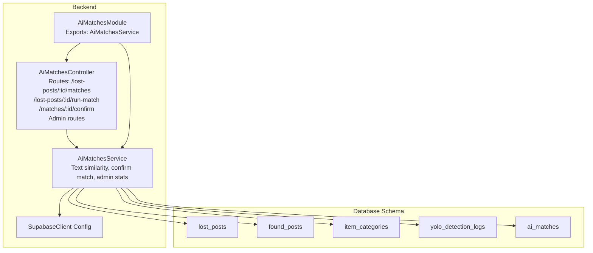
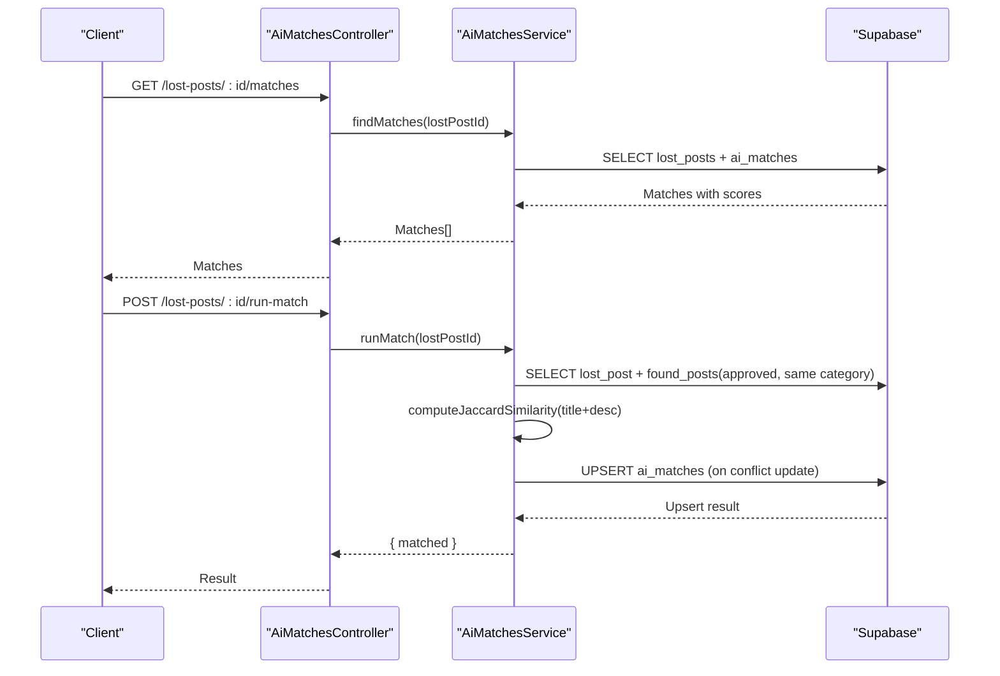
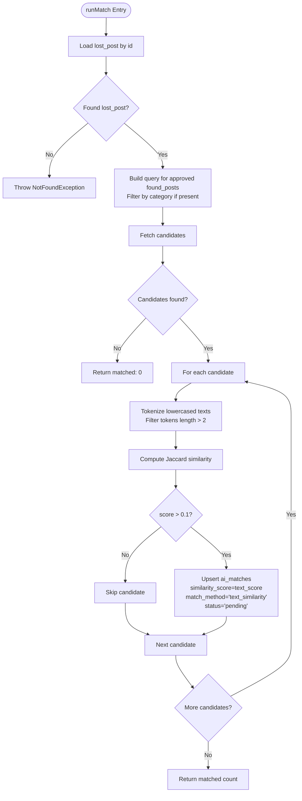
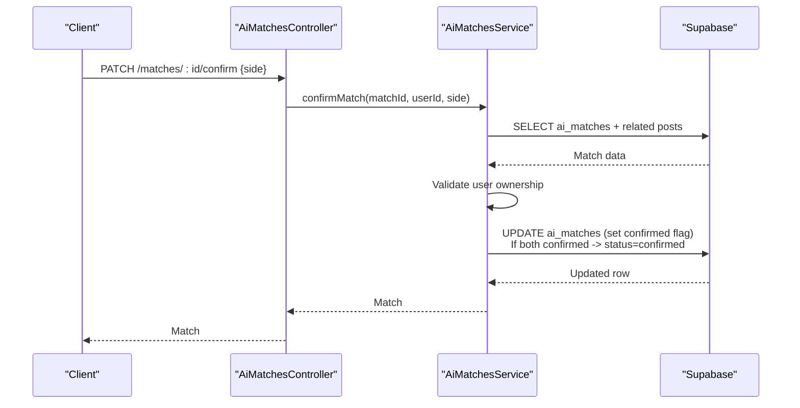
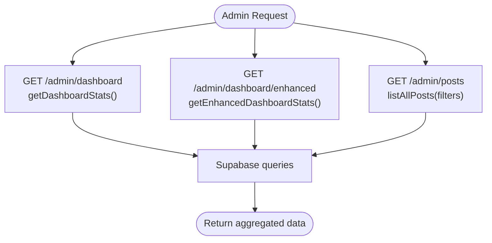
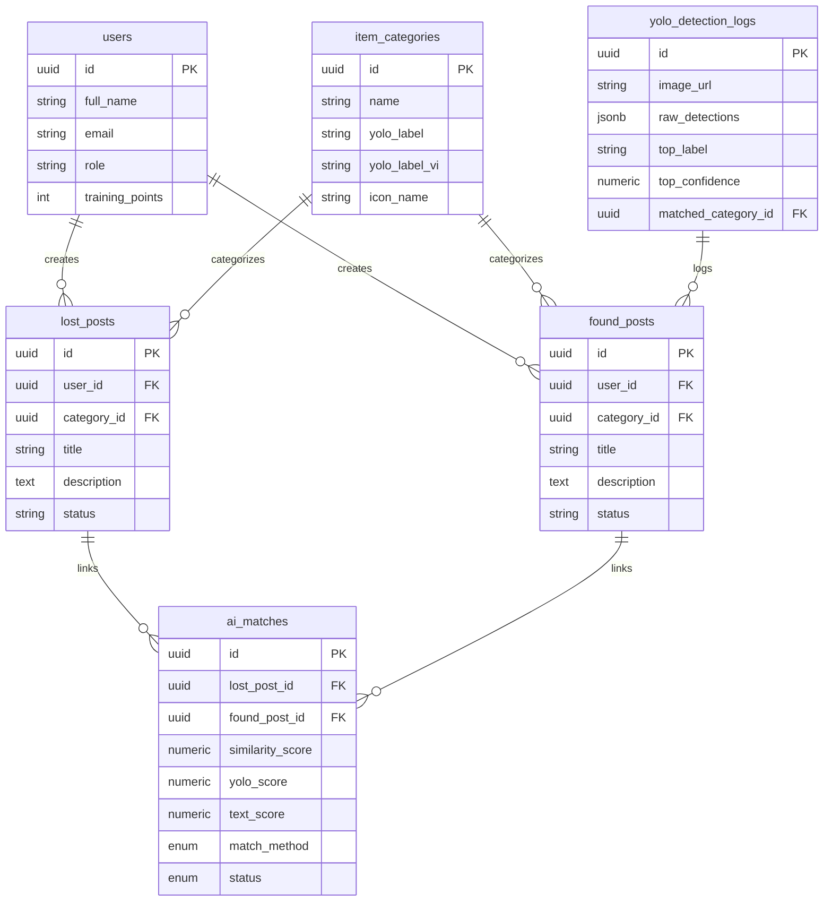
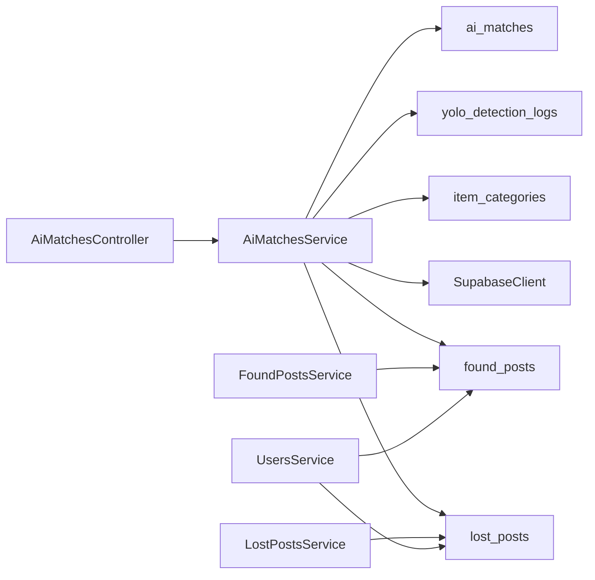

# AI Matching System

<cite>
**Referenced Files in This Document**
- [ai-matches.module.ts](file://backend/src/modules/ai-matches/ai-matches.module.ts)
- [ai-matches.controller.ts](file://backend/src/modules/ai-matches/ai-matches.controller.ts)
- [ai-matches.service.ts](file://backend/src/modules/ai-matches/ai-matches.service.ts)
- [supabase.config.ts](file://backend/src/config/supabase.config.ts)
- [OVERVIEW.md](file://OVERVIEW.md)
- [lost-posts.service.ts](file://backend/src/modules/lost-posts/lost-posts.service.ts)
- [found-posts.service.ts](file://backend/src/modules/found-posts/found-posts.service.ts)
- [users.service.ts](file://backend/src/modules/users/users.service.ts)
- [triggers_migration.sql](file://backend/sql/triggers_migration.sql)
- [triggers_permissions.sql](file://backend/sql/triggers_permissions.sql)
</cite>

## Table of Contents
1. [Introduction](#introduction)
2. [Project Structure](#project-structure)
3. [Core Components](#core-components)
4. [Architecture Overview](#architecture-overview)
5. [Detailed Component Analysis](#detailed-component-analysis)
6. [Dependency Analysis](#dependency-analysis)
7. [Performance Considerations](#performance-considerations)
8. [Troubleshooting Guide](#troubleshooting-guide)
9. [Conclusion](#conclusion)

## Introduction
This document explains the AI Matching System that powers intelligent post pairing for lost and found items. It covers text similarity algorithms, YOLO-based object detection integration, matching result management, and the AI service functionality. It also documents similarity scoring mechanisms, machine learning model integration, concrete examples from the codebase, result ranking, manual override capabilities, entity relationships, integration with PostgreSQL vector extensions, performance optimization strategies, batch processing capabilities, common AI matching issues, accuracy tuning, and fallback mechanisms for low-confidence matches.

## Project Structure
The AI Matching module is organized as a NestJS module with a controller, service, and database schema supporting text-based matching and future YOLO-based enhancements. The system integrates with Supabase for database operations and exposes admin dashboards for statistics and post listings.

**Diagram sources**
- [ai-matches.module.ts:1-11](file://backend/src/modules/ai-matches/ai-matches.module.ts#L1-L11)
- [ai-matches.controller.ts:1-72](file://backend/src/modules/ai-matches/ai-matches.controller.ts#L1-L72)
- [ai-matches.service.ts:1-367](file://backend/src/modules/ai-matches/ai-matches.service.ts#L1-L367)
- [supabase.config.ts:1-25](file://backend/src/config/supabase.config.ts#L1-L25)
- [OVERVIEW.md:140-345](file://OVERVIEW.md#L140-L345)

**Section sources**
- [ai-matches.module.ts:1-11](file://backend/src/modules/ai-matches/ai-matches.module.ts#L1-L11)
- [ai-matches.controller.ts:1-72](file://backend/src/modules/ai-matches/ai-matches.controller.ts#L1-L72)
- [ai-matches.service.ts:1-367](file://backend/src/modules/ai-matches/ai-matches.service.ts#L1-L367)
- [supabase.config.ts:1-25](file://backend/src/config/supabase.config.ts#L1-L25)
- [OVERVIEW.md:140-345](file://OVERVIEW.md#L140-L345)

## Core Components
- AiMatchesModule: Declares and exports the AI matching module and service.
- AiMatchesController: Exposes REST endpoints for retrieving matches, triggering text-based matching, confirming matches, and admin dashboards.
- AiMatchesService: Implements text similarity matching, result ranking, manual confirmation logic, and admin analytics.
- SupabaseClient: Centralized client initialization for database operations.
- Database Schema: Defines enums, tables, indexes, and views supporting matching, categories, detections, and post lifecycle.

Key responsibilities:
- Text similarity scoring using Jaccard similarity on tokenized terms.
- Candidate filtering by category and approval status.
- Upsert of matching records with thresholds and ordering by similarity score.
- Two-sided confirmation workflow with validation and status transitions.
- Admin dashboards for statistics and post listings with filters.

**Section sources**
- [ai-matches.module.ts:1-11](file://backend/src/modules/ai-matches/ai-matches.module.ts#L1-L11)
- [ai-matches.controller.ts:17-71](file://backend/src/modules/ai-matches/ai-matches.controller.ts#L17-L71)
- [ai-matches.service.ts:11-153](file://backend/src/modules/ai-matches/ai-matches.service.ts#L11-L153)
- [OVERVIEW.md:314-345](file://OVERVIEW.md#L314-L345)

## Architecture Overview
The AI Matching System orchestrates text-based similarity between lost and found posts, stores results in ai_matches, and enforces a two-sided confirmation mechanism. Admin endpoints provide dashboards and post listings.

**Diagram sources**
- [ai-matches.controller.ts:24-40](file://backend/src/modules/ai-matches/ai-matches.controller.ts#L24-L40)
- [ai-matches.service.ts:15-96](file://backend/src/modules/ai-matches/ai-matches.service.ts#L15-L96)

## Detailed Component Analysis

### Text Similarity Matching Workflow
- Input: lost post identifier.
- Retrieve lost post metadata and existing ai_matches entries ordered by similarity_score descending.
- Retrieve candidate found posts filtered by status approved and matching category.
- Compute Jaccard similarity on tokenized lowercased text (title + description), filtering tokens shorter than or equal to 2 characters.
- Persist matches via upsert with threshold > 0.1 and status pending.

**Diagram sources**
- [ai-matches.service.ts:45-96](file://backend/src/modules/ai-matches/ai-matches.service.ts#L45-L96)
- [ai-matches.service.ts:144-153](file://backend/src/modules/ai-matches/ai-matches.service.ts#L144-L153)

**Section sources**
- [ai-matches.service.ts:45-96](file://backend/src/modules/ai-matches/ai-matches.service.ts#L45-L96)
- [ai-matches.service.ts:144-153](file://backend/src/modules/ai-matches/ai-matches.service.ts#L144-L153)

### Manual Override and Confirmation
- Endpoint: PATCH /matches/:id/confirm with body specifying side: 'owner' | 'finder'.
- Validation ensures the caller is the owner or finder of the respective post.
- Updates confirmed_by_owner or confirmed_by_finder accordingly.
- When both sides confirm, status transitions to confirmed.
- Returns updated match record.

**Diagram sources**
- [ai-matches.controller.ts:36-40](file://backend/src/modules/ai-matches/ai-matches.controller.ts#L36-L40)
- [ai-matches.service.ts:101-141](file://backend/src/modules/ai-matches/ai-matches.service.ts#L101-L141)

**Section sources**
- [ai-matches.controller.ts:36-40](file://backend/src/modules/ai-matches/ai-matches.controller.ts#L36-L40)
- [ai-matches.service.ts:101-141](file://backend/src/modules/ai-matches/ai-matches.service.ts#L101-L141)

### Admin Dashboards and Post Listings
- Dashboard endpoints expose statistics and recent activity.
- Enhanced dashboard aggregates status breakdowns, top categories, recent handovers, and user stats.
- Admin post listing supports filtering by type, status, search term, and pagination.

**Diagram sources**
- [ai-matches.controller.ts:42-70](file://backend/src/modules/ai-matches/ai-matches.controller.ts#L42-L70)
- [ai-matches.service.ts:156-367](file://backend/src/modules/ai-matches/ai-matches.service.ts#L156-L367)

**Section sources**
- [ai-matches.controller.ts:42-70](file://backend/src/modules/ai-matches/ai-matches.controller.ts#L42-L70)
- [ai-matches.service.ts:156-367](file://backend/src/modules/ai-matches/ai-matches.service.ts#L156-L367)

### Entity Relationships and Data Model
The system defines enums and tables for matching, categories, detections, and posts. Key relationships:
- ai_matches links lost_post_id and found_post_id with similarity scores and status.
- item_categories maps YOLO labels to categories and supports future YOLO detection logging.
- yolo_detection_logs captures detection results and user feedback for model improvement.
- Views and indexes support efficient queries and admin dashboards.

**Diagram sources**
- [OVERVIEW.md:140-345](file://OVERVIEW.md#L140-L345)

**Section sources**
- [OVERVIEW.md:140-345](file://OVERVIEW.md#L140-L345)

### Machine Learning Model Integration and Future Vector Support
- Current implementation uses text similarity (Jaccard) and match_method enum includes 'text_similarity' and 'yolo_label' placeholders.
- The schema reserves slots for yolo_score and embedding_score to integrate YOLO detection labels and future pgvector embeddings.
- yolo_detection_logs captures raw detections and user feedback to improve model accuracy over time.

Integration pathways:
- YOLO label matching: Extend runMatch to compare detected labels against item_categories mappings and populate yolo_score.
- Embedding-based matching: Enable pgvector extension and compute embeddings for titles/descriptions; store embedding_score and rank by vector distance.

**Section sources**
- [OVERVIEW.md:314-345](file://OVERVIEW.md#L314-L345)
- [OVERVIEW.md:165-175](file://OVERVIEW.md#L165-L175)

### Matching Result Management and Ranking
- Results are ranked by similarity_score in descending order.
- Pending status indicates initial AI suggestions awaiting manual confirmation.
- Two-sided confirmation (owner and finder) required to reach confirmed status.
- Admins can review and manage posts and view dashboards for operational insights.

**Section sources**
- [ai-matches.service.ts:27-40](file://backend/src/modules/ai-matches/ai-matches.service.ts#L27-L40)
- [ai-matches.service.ts:101-141](file://backend/src/modules/ai-matches/ai-matches.service.ts#L101-L141)
- [OVERVIEW.md:314-345](file://OVERVIEW.md#L314-L345)

### Batch Processing Capabilities
- runMatch iterates through approved candidates and performs bulk upserts to ai_matches.
- Admin endpoints support pagination and filtering for scalable listing of posts.
- Parallel queries are used for admin stats to optimize dashboard performance.

**Section sources**
- [ai-matches.service.ts:66-96](file://backend/src/modules/ai-matches/ai-matches.service.ts#L66-L96)
- [ai-matches.service.ts:277-367](file://backend/src/modules/ai-matches/ai-matches.service.ts#L277-L367)

## Dependency Analysis
The AI Matching module depends on Supabase for database operations and leverages shared services for posts and users. The database schema defines the contracts for matching, categories, and detections.

**Diagram sources**
- [ai-matches.controller.ts:22-23](file://backend/src/modules/ai-matches/ai-matches.controller.ts#L22-L23)
- [ai-matches.service.ts:7-9](file://backend/src/modules/ai-matches/ai-matches.service.ts#L7-L9)
- [lost-posts.service.ts:14-17](file://backend/src/modules/lost-posts/lost-posts.service.ts#L14-L17)
- [found-posts.service.ts:14-17](file://backend/src/modules/found-posts/found-posts.service.ts#L14-L17)
- [users.service.ts:38-78](file://backend/src/modules/users/users.service.ts#L38-L78)

**Section sources**
- [ai-matches.controller.ts:22-23](file://backend/src/modules/ai-matches/ai-matches.controller.ts#L22-L23)
- [ai-matches.service.ts:7-9](file://backend/src/modules/ai-matches/ai-matches.service.ts#L7-L9)
- [lost-posts.service.ts:14-17](file://backend/src/modules/lost-posts/lost-posts.service.ts#L14-L17)
- [found-posts.service.ts:14-17](file://backend/src/modules/found-posts/found-posts.service.ts#L14-L17)
- [users.service.ts:38-78](file://backend/src/modules/users/users.service.ts#L38-L78)

## Performance Considerations
- Indexes on ai_matches (similarity_score DESC, status) and post tables (status, category, created_at) enable fast retrieval and ranking.
- Full-text search indexes on posts support efficient text operations.
- Jaccard similarity uses tokenization and set operations; filtering short tokens reduces noise and improves performance.
- Admin endpoints use parallel queries and pagination to handle large datasets efficiently.
- Future optimizations:
  - Enable pgvector for embedding-based similarity.
  - Add materialized views for frequently accessed dashboards.
  - Implement background jobs for large-scale matching runs.

[No sources needed since this section provides general guidance]

## Troubleshooting Guide
Common issues and resolutions:
- Missing environment variables for Supabase connection:
  - Ensure SUPABASE_URL and SUPABASE_SERVICE_ROLE_KEY/SUPABASE_ANON_KEY are configured.
- Not found errors:
  - Lost post or match not found throws NotFoundException; verify identifiers.
- Forbidden access:
  - Confirmation requires ownership; ensure the caller matches the post owner or finder.
- Validation failures:
  - Errors during updates raise ValidationException; check payload and constraints.
- Low-confidence matches:
  - Adjust threshold in runMatch or introduce hybrid scoring combining text and YOLO labels.
- YOLO integration gaps:
  - Populate yolo_detected_label and yolo_confidence on found_posts and use yolo_detection_logs for feedback loops.

**Section sources**
- [supabase.config.ts:8-23](file://backend/src/config/supabase.config.ts#L8-L23)
- [ai-matches.service.ts:25](file://backend/src/modules/ai-matches/ai-matches.service.ts#L25)
- [ai-matches.service.ts:110-118](file://backend/src/modules/ai-matches/ai-matches.service.ts#L110-L118)
- [ai-matches.service.ts:139](file://backend/src/modules/ai-matches/ai-matches.service.ts#L139)

## Conclusion
The AI Matching System currently implements robust text-based similarity to pair lost and found posts, with a clear two-sided confirmation mechanism and comprehensive admin tooling. The schema is prepared for YOLO-based label matching and embedding-based similarity, enabling future enhancements. By leveraging database indexes, parallel queries, and structured feedback loops, the system balances accuracy and performance while providing extensible pathways for machine learning improvements.