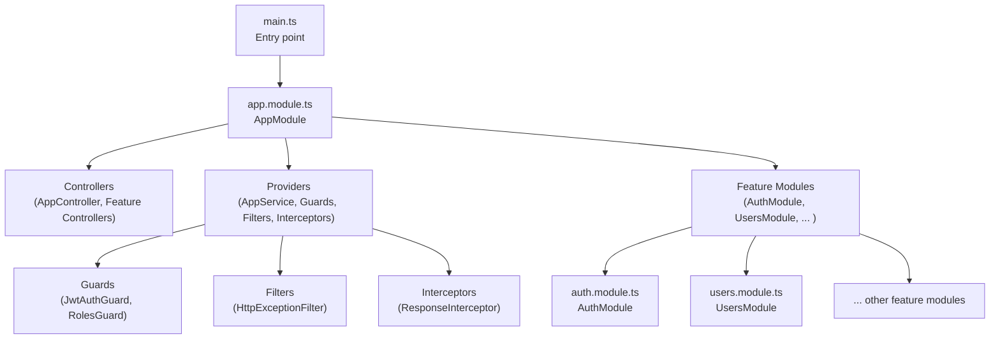
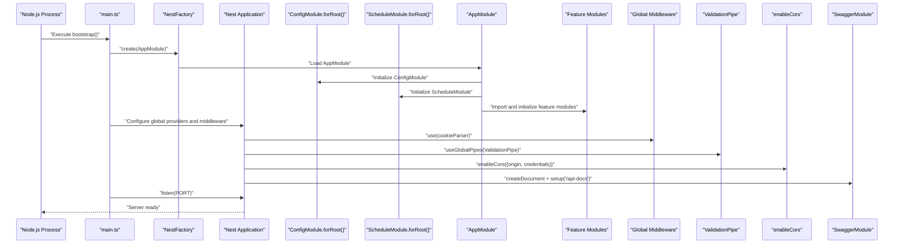
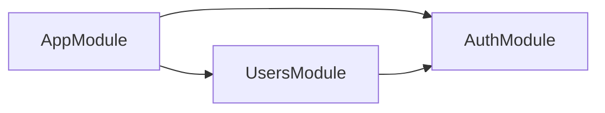
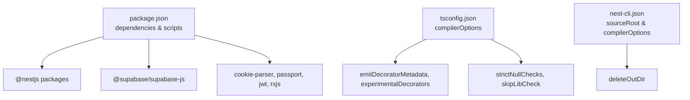

# Application Bootstrap

<cite>
**Referenced Files in This Document**
- [main.ts](file://backend/src/main.ts)
- [app.module.ts](file://backend/src/app.module.ts)
- [app.controller.ts](file://backend/src/app.controller.ts)
- [app.service.ts](file://backend/src/app.service.ts)
- [http-exception.filter.ts](file://backend/src/common/filters/http-exception.filter.ts)
- [response.interceptor.ts](file://backend/src/common/interceptors/response.interceptor.ts)
- [jwt-auth.guard.ts](file://backend/src/common/guards/jwt-auth.guard.ts)
- [roles.guard.ts](file://backend/src/common/guards/roles.guard.ts)
- [supabase.config.ts](file://backend/src/config/supabase.config.ts)
- [client.ts](file://backend/src/utils/supabase/client.ts)
- [auth.module.ts](file://backend/src/modules/auth/auth.module.ts)
- [users.module.ts](file://backend/src/modules/users/users.module.ts)
- [package.json](file://backend/package.json)
- [nest-cli.json](file://backend/nest-cli.json)
- [tsconfig.json](file://backend/tsconfig.json)
</cite>

## Table of Contents
1. [Introduction](#introduction)
2. [Project Structure](#project-structure)
3. [Core Components](#core-components)
4. [Architecture Overview](#architecture-overview)
5. [Detailed Component Analysis](#detailed-component-analysis)
6. [Dependency Analysis](#dependency-analysis)
7. [Performance Considerations](#performance-considerations)
8. [Troubleshooting Guide](#troubleshooting-guide)
9. [Conclusion](#conclusion)

## Introduction
This document explains the MissLost backend application bootstrap process. It covers the main entry point configuration, module orchestration, global providers setup, NestJS application initialization sequence, dependency injection container configuration, and global middleware registration. It also documents how the application service and controllers are wired, how the modular architecture initializes, and provides practical examples of the bootstrapping process, configuration options, and startup sequence. Finally, it addresses common initialization issues and debugging approaches, and clarifies the relationship between AppModule and individual feature modules.

## Project Structure
The backend is a NestJS application organized around a modular architecture. The main entry point creates the Nest application instance, registers global pipes and middleware, enables CORS, sets up OpenAPI/Swagger, and starts the server. AppModule aggregates feature modules and registers global providers for filters, interceptors, and guards. Feature modules encapsulate domain-specific concerns and export services for cross-module consumption.

**Diagram sources**
- [main.ts:1-45](file://backend/src/main.ts#L1-L45)
- [app.module.ts:1-67](file://backend/src/app.module.ts#L1-L67)
- [auth.module.ts:1-35](file://backend/src/modules/auth/auth.module.ts#L1-L35)
- [users.module.ts:1-13](file://backend/src/modules/users/users.module.ts#L1-L13)

**Section sources**
- [main.ts:1-45](file://backend/src/main.ts#L1-L45)
- [app.module.ts:1-67](file://backend/src/app.module.ts#L1-L67)

## Core Components
- Main entry point: Creates the Nest application, registers global middleware (cookie parser), global validation pipe, CORS, and Swagger, then listens on the configured port.
- AppModule: Aggregates ConfigModule, ScheduleModule, and all feature modules; registers global providers for exception filtering, response interception, and authentication/authorization guards; exposes a root controller.
- Global providers: Exception filter, response interceptor, and two guards (JWT-based and role-based) applied globally via provider tokens.
- Feature modules: Encapsulate domain logic and expose services for use by other modules (e.g., UsersModule depends on AuthModule via forwardRef).

Key bootstrap steps:
- Application creation with AppModule
- Cookie parsing middleware registration
- Global ValidationPipe enabling type transformation and whitelisting
- CORS enabled with origin and credentials
- Swagger document built and served under a path
- Port selection from environment or default
- Logging of runtime URLs

**Section sources**
- [main.ts:7-43](file://backend/src/main.ts#L7-L43)
- [app.module.ts:28-66](file://backend/src/app.module.ts#L28-L66)

## Architecture Overview
The bootstrap sequence initializes the Nest application kernel, loads configuration, wires global providers, and mounts feature modules. The resulting dependency injection container resolves requests through controllers and services, applying global guards and interceptors, and returning standardized responses wrapped by the response interceptor.

**Diagram sources**
- [main.ts:7-43](file://backend/src/main.ts#L7-L43)
- [app.module.ts:28-44](file://backend/src/app.module.ts#L28-L44)

## Detailed Component Analysis

### Main Entry Point and Initialization Sequence
- Creates the Nest application using AppModule.
- Registers cookie-parser for secure token handling.
- Applies a global ValidationPipe with whitelisting and implicit type transformation.
- Enables CORS with origin from environment and credentials support.
- Builds and serves Swagger/OpenAPI documentation.
- Starts the server on the configured port and logs URLs.

Practical example paths:
- [main.ts:7-43](file://backend/src/main.ts#L7-L43)

**Section sources**
- [main.ts:7-43](file://backend/src/main.ts#L7-L43)

### AppModule Orchestration and Global Providers
- Imports:
  - ConfigModule as global for environment variables.
  - ScheduleModule for scheduled tasks.
  - All feature modules (auth, users, categories, posts, AI matches, storage, chat, handovers, notifications, upload, triggers).
- Providers:
  - AppService exposed at root level.
  - Global exception filter registered via APP_FILTER token.
  - Global response interceptor registered via APP_INTERCEPTOR token.
  - Two global guards registered via APP_GUARD token:
    - JwtAuthGuard
    - RolesGuard
- Controllers:
  - Root AppController

Practical example paths:
- [app.module.ts:28-66](file://backend/src/app.module.ts#L28-L66)

**Section sources**
- [app.module.ts:28-66](file://backend/src/app.module.ts#L28-L66)

### Global Middleware Registration
- Cookie parsing middleware is registered globally to support secure token handling.
- ValidationPipe is registered globally to enforce DTO validation and automatic transformation.

Practical example paths:
- [main.ts:10-21](file://backend/src/main.ts#L10-L21)

**Section sources**
- [main.ts:10-21](file://backend/src/main.ts#L10-L21)

### Application Service and Controller Setup
- AppService provides a simple greeting method.
- AppController exposes a GET endpoint that delegates to AppService.

Practical example paths:
- [app.service.ts:4-8](file://backend/src/app.service.ts#L4-L8)
- [app.controller.ts:4-12](file://backend/src/app.controller.ts#L4-L12)

**Section sources**
- [app.service.ts:4-8](file://backend/src/app.service.ts#L4-L8)
- [app.controller.ts:4-12](file://backend/src/app.controller.ts#L4-L12)

### Modular Architecture Initialization
- AppModule imports all feature modules, forming the application boundary.
- Feature modules declare their own controllers, providers, and internal imports.
- Example: AuthModule registers Passport and JWT modules and exports AuthService and JwtModule.
- Example: UsersModule imports AuthModule via forwardRef to resolve circular dependencies safely.

Practical example paths:
- [auth.module.ts:11-34](file://backend/src/modules/auth/auth.module.ts#L11-L34)
- [users.module.ts:6-12](file://backend/src/modules/users/users.module.ts#L6-L12)

**Section sources**
- [auth.module.ts:11-34](file://backend/src/modules/auth/auth.module.ts#L11-L34)
- [users.module.ts:6-12](file://backend/src/modules/users/users.module.ts#L6-L12)

### Dependency Injection Container Configuration
- Global providers are registered using Nest’s provider tokens:
  - APP_FILTER: centralized exception handling
  - APP_INTERCEPTOR: standardized response envelope
  - APP_GUARD: authentication and role-based authorization
- Feature modules export services so other modules can inject them without importing internals.

Practical example paths:
- [app.module.ts:46-64](file://backend/src/app.module.ts#L46-L64)

**Section sources**
- [app.module.ts:46-64](file://backend/src/app.module.ts#L46-L64)

### Supabase Clients and Environment Configuration
- Supabase clients are lazily created with environment validation:
  - Centralized client factory validates presence of required environment variables.
  - An anonymous client utility is provided for browser-like SSR scenarios.
- AuthModule enforces JWT_SECRET presence via dynamic provider configuration.

Practical example paths:
- [supabase.config.ts:7-23](file://backend/src/config/supabase.config.ts#L7-L23)
- [client.ts:9-18](file://backend/src/utils/supabase/client.ts#L9-L18)
- [auth.module.ts:14-28](file://backend/src/modules/auth/auth.module.ts#L14-L28)

**Section sources**
- [supabase.config.ts:7-23](file://backend/src/config/supabase.config.ts#L7-L23)
- [client.ts:9-18](file://backend/src/utils/supabase/client.ts#L9-L18)
- [auth.module.ts:14-28](file://backend/src/modules/auth/auth.module.ts#L14-L28)

### Relationship Between AppModule and Feature Modules
- AppModule acts as the composition root, importing all feature modules and exporting only shared services where appropriate.
- Feature modules encapsulate domain logic and may depend on each other (e.g., UsersModule depends on AuthModule via forwardRef).
- This pattern ensures clear boundaries, testability, and maintainability.

**Diagram sources**
- [app.module.ts:13-24](file://backend/src/app.module.ts#L13-L24)
- [users.module.ts:7](file://backend/src/modules/users/users.module.ts#L7)

**Section sources**
- [app.module.ts:13-24](file://backend/src/app.module.ts#L13-L24)
- [users.module.ts:7](file://backend/src/modules/users/users.module.ts#L7)

## Dependency Analysis
- Runtime dependencies include NestJS core packages, Swagger, schedule, Supabase JS client, cookie-parser, passport, JWT, and related types.
- Scripts define development, production, linting, testing, and debugging commands.
- Compiler options enable decorators, metadata emission, strict null checks, and modern module resolution.

**Diagram sources**
- [package.json:22-46](file://backend/package.json#L22-L46)
- [package.json:8-21](file://backend/package.json#L8-L21)
- [tsconfig.json:2-24](file://backend/tsconfig.json#L2-L24)
- [nest-cli.json:1-9](file://backend/nest-cli.json#L1-L9)

**Section sources**
- [package.json:22-46](file://backend/package.json#L22-L46)
- [package.json:8-21](file://backend/package.json#L8-L21)
- [tsconfig.json:2-24](file://backend/tsconfig.json#L2-L24)
- [nest-cli.json:1-9](file://backend/nest-cli.json#L1-L9)

## Performance Considerations
- Keep global middleware minimal to avoid per-request overhead.
- Prefer lazy initialization for heavy clients (e.g., Supabase) to reduce cold-start latency.
- Use ValidationPipe wisely to balance safety and performance; consider disabling transformation when unnecessary.
- Leverage caching and efficient DTOs to reduce serialization costs.
- Monitor guard evaluation order and complexity; keep guard logic lightweight.

## Troubleshooting Guide
Common initialization issues and debugging approaches:
- Missing environment variables:
  - Symptom: Application fails to start or throws errors during client creation.
  - Action: Verify SUPABASE_URL, SUPABASE_SERVICE_ROLE_KEY, SUPABASE_ANON_KEY, and JWT_SECRET are set.
  - References:
    - [supabase.config.ts:12-14](file://backend/src/config/supabase.config.ts#L12-L14)
    - [client.ts:13-14](file://backend/src/utils/supabase/client.ts#L13-L14)
    - [auth.module.ts:18-20](file://backend/src/modules/auth/auth.module.ts#L18-L20)
- CORS errors:
  - Symptom: Browser blocks cross-origin requests.
  - Action: Ensure FRONTEND_URL matches the origin and credentials are enabled.
  - References:
    - [main.ts:24-27](file://backend/src/main.ts#L24-L27)
- Swagger not accessible:
  - Symptom: 404 on /api-docs.
  - Action: Confirm SwaggerModule setup path and that the document was created.
  - References:
    - [main.ts:29-37](file://backend/src/main.ts#L29-L37)
- Global guards not applied:
  - Symptom: Public routes still require authentication.
  - Action: Verify guards are registered via APP_GUARD tokens and decorators are used appropriately.
  - References:
    - [app.module.ts:56-63](file://backend/src/app.module.ts#L56-L63)
    - [jwt-auth.guard.ts:13-20](file://backend/src/common/guards/jwt-auth.guard.ts#L13-L20)
    - [roles.guard.ts:10-26](file://backend/src/common/guards/roles.guard.ts#L10-L26)
- ValidationPipe not working:
  - Symptom: DTOs not validated or transformed.
  - Action: Confirm ValidationPipe is registered globally and DTOs use class-validator decorators.
  - References:
    - [main.ts:14-21](file://backend/src/main.ts#L14-L21)

**Section sources**
- [supabase.config.ts:12-14](file://backend/src/config/supabase.config.ts#L12-L14)
- [client.ts:13-14](file://backend/src/utils/supabase/client.ts#L13-L14)
- [auth.module.ts:18-20](file://backend/src/modules/auth/auth.module.ts#L18-L20)
- [main.ts:24-27](file://backend/src/main.ts#L24-L27)
- [main.ts:29-37](file://backend/src/main.ts#L29-L37)
- [app.module.ts:56-63](file://backend/src/app.module.ts#L56-L63)
- [jwt-auth.guard.ts:13-20](file://backend/src/common/guards/jwt-auth.guard.ts#L13-L20)
- [roles.guard.ts:10-26](file://backend/src/common/guards/roles.guard.ts#L10-L26)
- [main.ts:14-21](file://backend/src/main.ts#L14-L21)

## Conclusion
The MissLost backend bootstrap process follows a clean, modular pattern: a single entry point initializes the Nest application, registers global middleware and providers, enables CORS and Swagger, and starts the server. AppModule orchestrates feature modules and centralizes cross-cutting concerns via global providers. Feature modules encapsulate domain logic and export services for reuse. By validating environment variables early, keeping global middleware lean, and leveraging guards and interceptors, the system remains maintainable and predictable. Use the provided references to locate and adjust configuration as needed.