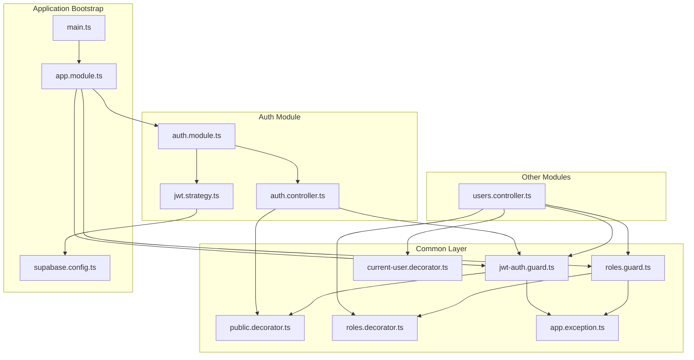
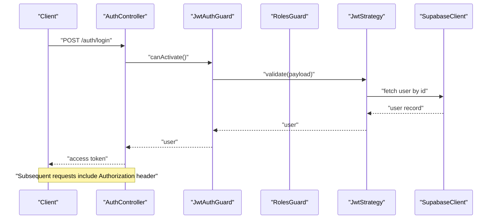
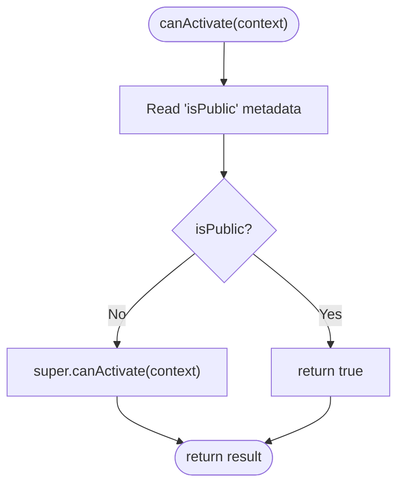
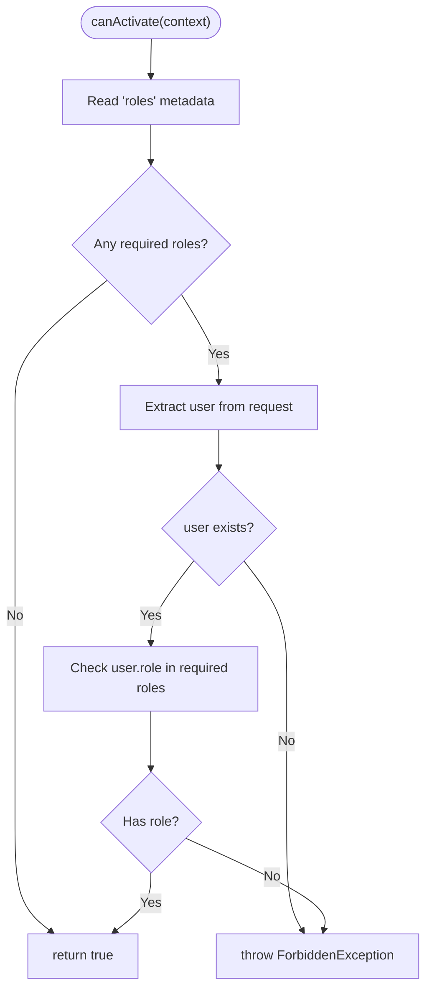
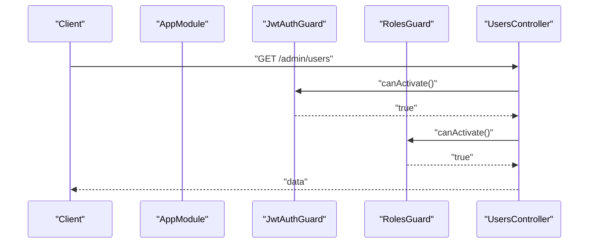
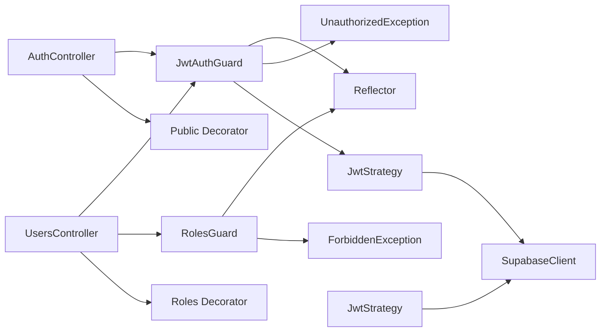

# Access Control and Guards

<cite>
**Referenced Files in This Document**
- [jwt-auth.guard.ts](file://backend/src/common/guards/jwt-auth.guard.ts)
- [roles.guard.ts](file://backend/src/common/guards/roles.guard.ts)
- [public.decorator.ts](file://backend/src/common/decorators/public.decorator.ts)
- [roles.decorator.ts](file://backend/src/common/decorators/roles.decorator.ts)
- [current-user.decorator.ts](file://backend/src/common/decorators/current-user.decorator.ts)
- [app.exception.ts](file://backend/src/common/exceptions/app.exception.ts)
- [jwt.strategy.ts](file://backend/src/modules/auth/strategies/jwt.strategy.ts)
- [auth.module.ts](file://backend/src/modules/auth/auth.module.ts)
- [auth.controller.ts](file://backend/src/modules/auth/auth.controller.ts)
- [users.controller.ts](file://backend/src/modules/users/users.controller.ts)
- [app.module.ts](file://backend/src/app.module.ts)
- [main.ts](file://backend/src/main.ts)
- [supabase.config.ts](file://backend/src/config/supabase.config.ts)
</cite>

## Table of Contents
1. [Introduction](#introduction)
2. [Project Structure](#project-structure)
3. [Core Components](#core-components)
4. [Architecture Overview](#architecture-overview)
5. [Detailed Component Analysis](#detailed-component-analysis)
6. [Dependency Analysis](#dependency-analysis)
7. [Performance Considerations](#performance-considerations)
8. [Troubleshooting Guide](#troubleshooting-guide)
9. [Conclusion](#conclusion)

## Introduction
This document explains the access control and security guards in the MissLost authentication system. It covers JWT authentication guard usage for route protection, role-based access control via roles guard and role decorators, permission management, and the public decorator for selectively bypassing authentication. It also details guard registration and execution order in NestJS, integration with dependency injection, and practical examples of guard configuration and route protection patterns. Security considerations and best practices for fine-grained access control are included.

## Project Structure
The access control layer is implemented under the common folder and integrated into the application via global guards. Authentication-specific modules and controllers demonstrate guard usage patterns.

**Diagram sources**
- [app.module.ts:1-67](file://backend/src/app.module.ts#L1-L67)
- [jwt-auth.guard.ts:1-29](file://backend/src/common/guards/jwt-auth.guard.ts#L1-L29)
- [roles.guard.ts:1-28](file://backend/src/common/guards/roles.guard.ts#L1-L28)
- [public.decorator.ts:1-5](file://backend/src/common/decorators/public.decorator.ts#L1-L5)
- [roles.decorator.ts:1-5](file://backend/src/common/decorators/roles.decorator.ts#L1-L5)
- [current-user.decorator.ts:1-9](file://backend/src/common/decorators/current-user.decorator.ts#L1-L9)
- [auth.module.ts:1-35](file://backend/src/modules/auth/auth.module.ts#L1-L35)
- [auth.controller.ts:1-130](file://backend/src/modules/auth/auth.controller.ts#L1-L130)
- [users.controller.ts:1-94](file://backend/src/modules/users/users.controller.ts#L1-L94)
- [jwt.strategy.ts:1-40](file://backend/src/modules/auth/strategies/jwt.strategy.ts#L1-L40)
- [main.ts:1-45](file://backend/src/main.ts#L1-L45)
- [supabase.config.ts:1-25](file://backend/src/config/supabase.config.ts#L1-L25)

**Section sources**
- [app.module.ts:1-67](file://backend/src/app.module.ts#L1-L67)
- [main.ts:1-45](file://backend/src/main.ts#L1-L45)

## Core Components
- JWT Authentication Guard: Extends the NestJS passport JWT guard and integrates with the Reflector to honor the public metadata. It delegates to the parent guard for token validation and throws unauthorized when invalid.
- Roles Guard: Enforces role-based access control by checking the user’s role against required roles declared via the roles decorator. It throws forbidden when unauthorized.
- Public Decorator: Metadata marker to indicate routes that should bypass authentication.
- Roles Decorator: Metadata marker to declare required roles for a route or controller.
- Current User Decorator: Extracts the authenticated user from the request for controller methods.
- Exception Classes: Centralized HTTP exceptions for unauthorized and forbidden scenarios.

**Section sources**
- [jwt-auth.guard.ts:1-29](file://backend/src/common/guards/jwt-auth.guard.ts#L1-L29)
- [roles.guard.ts:1-28](file://backend/src/common/guards/roles.guard.ts#L1-L28)
- [public.decorator.ts:1-5](file://backend/src/common/decorators/public.decorator.ts#L1-L5)
- [roles.decorator.ts:1-5](file://backend/src/common/decorators/roles.decorator.ts#L1-L5)
- [current-user.decorator.ts:1-9](file://backend/src/common/decorators/current-user.decorator.ts#L1-L9)
- [app.exception.ts:1-46](file://backend/src/common/exceptions/app.exception.ts#L1-L46)

## Architecture Overview
The system enforces authentication and authorization globally via NestJS application guards. The JWT strategy validates tokens and enriches the request with the user object. Controllers apply decorators and per-route guards to selectively enforce public access or role-based restrictions.

**Diagram sources**
- [auth.controller.ts:46-61](file://backend/src/modules/auth/auth.controller.ts#L46-L61)
- [jwt-auth.guard.ts:13-27](file://backend/src/common/guards/jwt-auth.guard.ts#L13-L27)
- [jwt.strategy.ts:26-38](file://backend/src/modules/auth/strategies/jwt.strategy.ts#L26-L38)
- [supabase.config.ts:7-23](file://backend/src/config/supabase.config.ts#L7-L23)

## Detailed Component Analysis

### JWT Authentication Guard
- Purpose: Provide global authentication enforcement with opt-out capability for public routes.
- Behavior:
  - Uses Reflector to check the public metadata on handler/class.
  - If marked public, allows the request to proceed.
  - Otherwise, delegates to the parent JWT auth guard for token validation.
  - Converts missing/invalid tokens into unauthorized exceptions.

**Diagram sources**
- [jwt-auth.guard.ts:13-20](file://backend/src/common/guards/jwt-auth.guard.ts#L13-L20)

**Section sources**
- [jwt-auth.guard.ts:1-29](file://backend/src/common/guards/jwt-auth.guard.ts#L1-L29)
- [public.decorator.ts:1-5](file://backend/src/common/decorators/public.decorator.ts#L1-L5)

### Roles Guard
- Purpose: Enforce role-based access control for protected routes.
- Behavior:
  - Reads required roles from metadata.
  - If no roles are required, allows access.
  - Ensures a user exists on the request; otherwise, denies access.
  - Checks if the user’s role matches any of the required roles; denies if not.

**Diagram sources**
- [roles.guard.ts:10-26](file://backend/src/common/guards/roles.guard.ts#L10-L26)
- [roles.decorator.ts:1-5](file://backend/src/common/decorators/roles.decorator.ts#L1-L5)

**Section sources**
- [roles.guard.ts:1-28](file://backend/src/common/guards/roles.guard.ts#L1-L28)
- [roles.decorator.ts:1-5](file://backend/src/common/decorators/roles.decorator.ts#L1-L5)

### Public Decorator
- Purpose: Mark routes or controllers as publicly accessible, bypassing authentication.
- Usage: Apply to handlers or controllers to opt out of global authentication.

**Section sources**
- [public.decorator.ts:1-5](file://backend/src/common/decorators/public.decorator.ts#L1-L5)

### Roles Decorator
- Purpose: Declare required roles for a route or controller.
- Usage: Apply to handlers or controllers to restrict access to specified roles.

**Section sources**
- [roles.decorator.ts:1-5](file://backend/src/common/decorators/roles.decorator.ts#L1-L5)

### Current User Decorator
- Purpose: Inject the authenticated user into controller method parameters.
- Usage: Use in methods to access the current user directly.

**Section sources**
- [current-user.decorator.ts:1-9](file://backend/src/common/decorators/current-user.decorator.ts#L1-L9)

### JWT Strategy
- Purpose: Validate JWT tokens and load the user from the database.
- Behavior:
  - Extracts JWT secret from configuration.
  - Validates expiration and signature.
  - Queries the database for the user by ID and ensures the account is not suspended.

**Section sources**
- [jwt.strategy.ts:1-40](file://backend/src/modules/auth/strategies/jwt.strategy.ts#L1-L40)
- [supabase.config.ts:1-25](file://backend/src/config/supabase.config.ts#L1-L25)

### Guard Registration and Execution Order
- Global Guards:
  - Both JWT and Roles guards are registered globally via NestJS application providers.
  - Execution order is determined by the order they are provided; the first to deny access stops further processing.
- Controller-Level Guards:
  - Controllers may apply guards at the class level to enforce authentication for all routes.
  - Additional guards (e.g., RolesGuard) can be applied per route or per controller.

**Diagram sources**
- [app.module.ts:56-63](file://backend/src/app.module.ts#L56-L63)
- [users.controller.ts:70-76](file://backend/src/modules/users/users.controller.ts#L70-L76)

**Section sources**
- [app.module.ts:1-67](file://backend/src/app.module.ts#L1-L67)
- [users.controller.ts:1-94](file://backend/src/modules/users/users.controller.ts#L1-L94)

### Route Protection Patterns and Examples
- Public routes:
  - Registration, login, email verification, forgot password, reset password, and Google OAuth callbacks are marked public.
  - Example: Applying the public decorator to the register and login endpoints.
- Authentication enforced:
  - Logout requires JWT authentication.
  - Example: Using the JWT guard at the controller level for user-related endpoints.
- Role-based authorization:
  - Admin-only endpoints require the admin role.
  - Example: Applying RolesGuard and the Roles decorator to admin routes.

**Section sources**
- [auth.controller.ts:31-44](file://backend/src/modules/auth/auth.controller.ts#L31-L44)
- [auth.controller.ts:46-61](file://backend/src/modules/auth/auth.controller.ts#L46-L61)
- [users.controller.ts:62-92](file://backend/src/modules/users/users.controller.ts#L62-L92)

### Integration with NestJS Dependency Injection and Guards
- Guards are provided as application guards, enabling global enforcement.
- Decorators are used to attach metadata for guards to read during execution.
- Strategy and service dependencies are injected via NestJS modules.

**Section sources**
- [app.module.ts:56-63](file://backend/src/app.module.ts#L56-L63)
- [auth.module.ts:1-35](file://backend/src/modules/auth/auth.module.ts#L1-L35)

## Dependency Analysis
The access control system depends on:
- Guards depend on Reflector and exception classes.
- JWT guard depends on the JWT strategy for token validation.
- Controllers depend on guards and decorators for route protection.
- Strategy depends on Supabase client for user lookup.

**Diagram sources**
- [jwt-auth.guard.ts:1-29](file://backend/src/common/guards/jwt-auth.guard.ts#L1-L29)
- [roles.guard.ts:1-28](file://backend/src/common/guards/roles.guard.ts#L1-L28)
- [public.decorator.ts:1-5](file://backend/src/common/decorators/public.decorator.ts#L1-L5)
- [roles.decorator.ts:1-5](file://backend/src/common/decorators/roles.decorator.ts#L1-L5)
- [jwt.strategy.ts:1-40](file://backend/src/modules/auth/strategies/jwt.strategy.ts#L1-L40)
- [auth.controller.ts:1-130](file://backend/src/modules/auth/auth.controller.ts#L1-L130)
- [users.controller.ts:1-94](file://backend/src/modules/users/users.controller.ts#L1-L94)
- [supabase.config.ts:1-25](file://backend/src/config/supabase.config.ts#L1-L25)

**Section sources**
- [jwt-auth.guard.ts:1-29](file://backend/src/common/guards/jwt-auth.guard.ts#L1-L29)
- [roles.guard.ts:1-28](file://backend/src/common/guards/roles.guard.ts#L1-L28)
- [jwt.strategy.ts:1-40](file://backend/src/modules/auth/strategies/jwt.strategy.ts#L1-L40)
- [auth.controller.ts:1-130](file://backend/src/modules/auth/auth.controller.ts#L1-L130)
- [users.controller.ts:1-94](file://backend/src/modules/users/users.controller.ts#L1-L94)

## Performance Considerations
- Token validation occurs per request; keep JWT payloads minimal.
- Avoid heavy operations inside guards; delegate to services when necessary.
- Use caching judiciously for frequently accessed user data if needed.
- Keep guard logic fast and deterministic to minimize latency.

## Troubleshooting Guide
- Unauthorized errors:
  - Occur when the JWT guard fails to validate the token or when the user is missing.
  - Verify token presence, expiration, and signing secret configuration.
- Forbidden errors:
  - Occur when the roles guard denies access due to insufficient privileges.
  - Confirm the user’s role and the required roles on the route.
- Public routes still requiring authentication:
  - Ensure the public decorator is applied at the handler or controller level.
- Cookie-based token handling:
  - Confirm cookie parsing middleware is enabled and cookie attributes match frontend expectations.

**Section sources**
- [jwt-auth.guard.ts:22-27](file://backend/src/common/guards/jwt-auth.guard.ts#L22-L27)
- [roles.guard.ts:18-24](file://backend/src/common/guards/roles.guard.ts#L18-L24)
- [app.exception.ts:23-33](file://backend/src/common/exceptions/app.exception.ts#L23-L33)
- [main.ts:10-11](file://backend/src/main.ts#L10-L11)

## Conclusion
The MissLost authentication system leverages NestJS guards and decorators to provide robust, layered access control. JWT authentication is enforced globally with opt-outs for public routes, while role-based authorization is applied selectively using the roles guard and decorators. The design integrates cleanly with dependency injection, supports predictable execution order, and offers clear patterns for extending protection to new routes and modules.