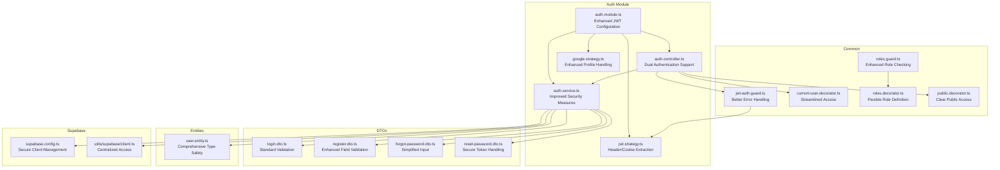
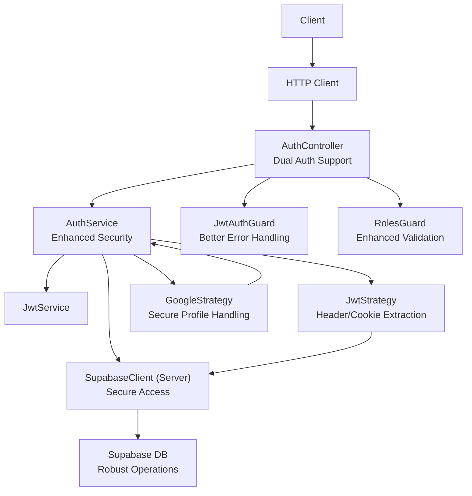
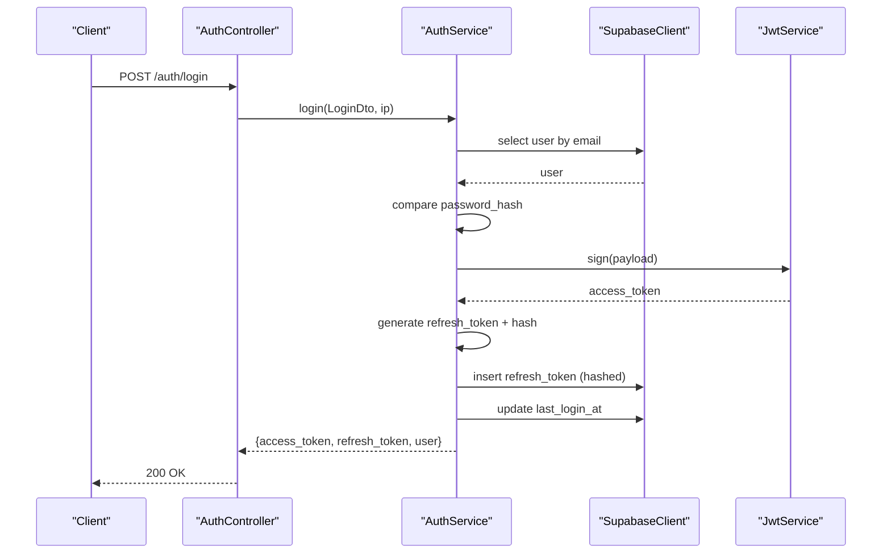
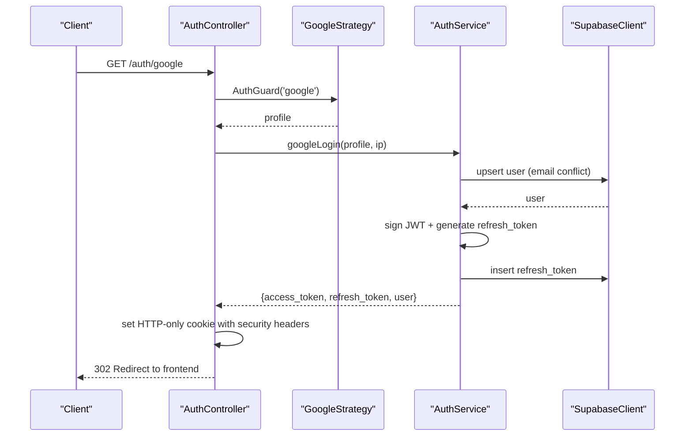
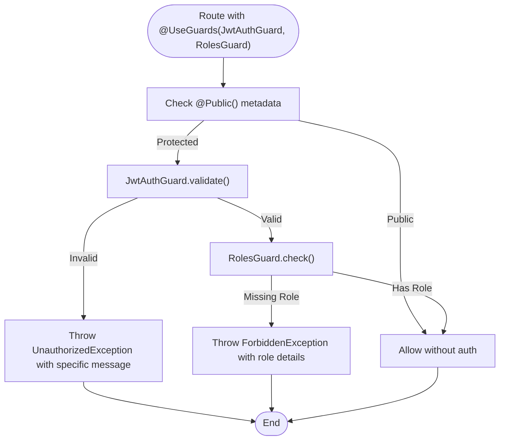
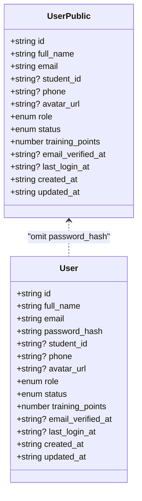
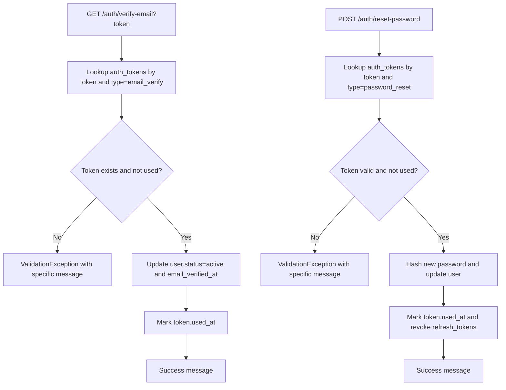
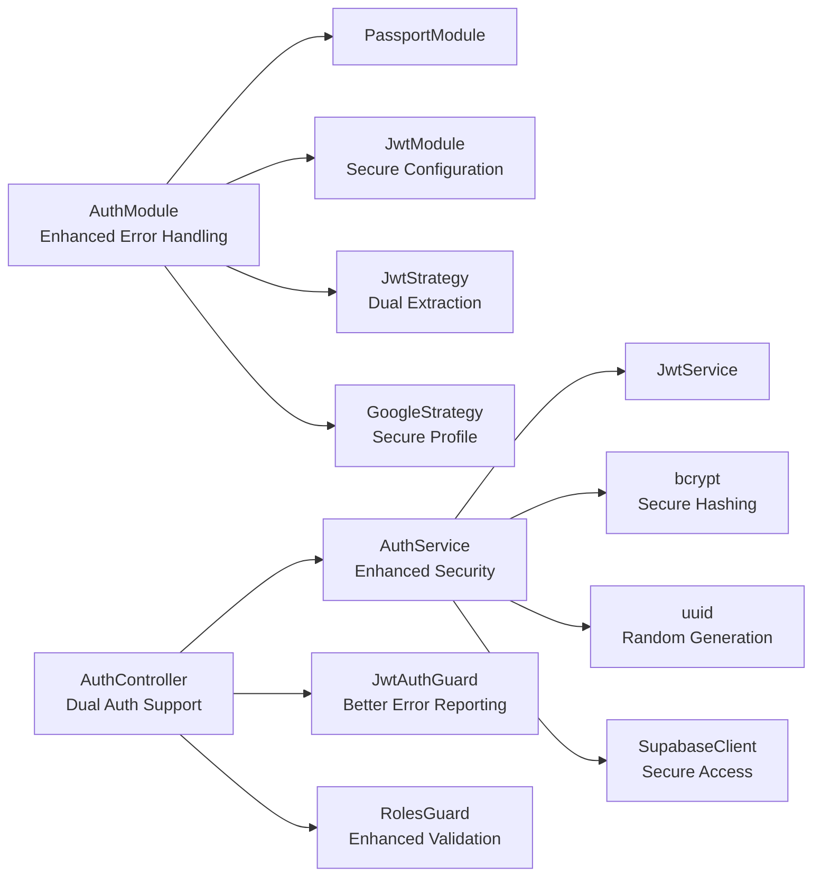

# Authentication System

<cite>
**Referenced Files in This Document**
- [auth.module.ts](file://backend/src/modules/auth/auth.module.ts)
- [auth.service.ts](file://backend/src/modules/auth/auth.service.ts)
- [auth.controller.ts](file://backend/src/modules/auth/auth.controller.ts)
- [user.entity.ts](file://backend/src/modules/auth/entities/user.entity.ts)
- [login.dto.ts](file://backend/src/modules/auth/dto/login.dto.ts)
- [register.dto.ts](file://backend/src/modules/auth/dto/register.dto.ts)
- [forgot-password.dto.ts](file://backend/src/modules/auth/dto/forgot-password.dto.ts)
- [reset-password.dto.ts](file://backend/src/modules/auth/dto/reset-password.dto.ts)
- [jwt.strategy.ts](file://backend/src/modules/auth/strategies/jwt.strategy.ts)
- [google.strategy.ts](file://backend/src/modules/auth/strategies/google.strategy.ts)
- [jwt-auth.guard.ts](file://backend/src/common/guards/jwt-auth.guard.ts)
- [roles.guard.ts](file://backend/src/common/guards/roles.guard.ts)
- [current-user.decorator.ts](file://backend/src/common/decorators/current-user.decorator.ts)
- [roles.decorator.ts](file://backend/src/common/decorators/roles.decorator.ts)
- [public.decorator.ts](file://backend/src/common/decorators/public.decorator.ts)
- [supabase.config.ts](file://backend/src/config/supabase.config.ts)
- [client.ts](file://backend/src/utils/supabase/client.ts)
</cite>

## Update Summary
**Changes Made**
- Enhanced Google OAuth implementation with improved security measures and error handling
- Strengthened JWT token management with dual extraction from headers and cookies
- Improved user account creation flow with better validation and status handling
- Enhanced session management with comprehensive cookie security configurations
- Added comprehensive error handling and logging for authentication flows

## Table of Contents
1. [Introduction](#introduction)
2. [Project Structure](#project-structure)
3. [Core Components](#core-components)
4. [Architecture Overview](#architecture-overview)
5. [Detailed Component Analysis](#detailed-component-analysis)
6. [Dependency Analysis](#dependency-analysis)
7. [Performance Considerations](#performance-considerations)
8. [Troubleshooting Guide](#troubleshooting-guide)
9. [Conclusion](#conclusion)

## Introduction
This document explains the MissLost authentication system with a focus on JWT token management, Google OAuth integration, and role-based access control. The system has been comprehensively enhanced with improved security features, robust error handling, and streamlined user management workflows. It documents the authentication service functionality, user entity structure, and security strategies, including concrete examples from the codebase illustrating login/register workflows, token refresh mechanisms, and user session management.

## Project Structure
The authentication subsystem is organized under the auth module with clear separation of concerns and enhanced security implementations:
- Module registration configures Passport, JWT, and strategy providers with comprehensive error handling
- Service encapsulates business logic for registration, login, logout, email verification, password reset, and Google OAuth with improved validation
- Controller exposes REST endpoints with enhanced guards and decorators supporting both header and cookie-based authentication
- Strategies implement JWT and Google OAuth validation with security improvements
- Guards and decorators enforce authentication and authorization policies with better error reporting
- DTOs define validation schemas for requests with enhanced field validation
- Supabase clients provide secure database access with proper error handling

**Diagram sources**
- [auth.module.ts:11-35](file://backend/src/modules/auth/auth.module.ts#L11-L35)
- [auth.controller.ts:26-130](file://backend/src/modules/auth/auth.controller.ts#L26-L130)
- [auth.service.ts:17-280](file://backend/src/modules/auth/auth.service.ts#L17-L280)
- [jwt.strategy.ts:16-58](file://backend/src/modules/auth/strategies/jwt.strategy.ts#L16-L58)
- [google.strategy.ts:6-38](file://backend/src/modules/auth/strategies/google.strategy.ts#L6-L38)
- [jwt-auth.guard.ts:7-29](file://backend/src/common/guards/jwt-auth.guard.ts#L7-L29)
- [roles.guard.ts:6-28](file://backend/src/common/guards/roles.guard.ts#L6-L28)
- [current-user.decorator.ts:3-9](file://backend/src/common/decorators/current-user.decorator.ts#L3-L9)
- [roles.decorator.ts:3-5](file://backend/src/common/decorators/roles.decorator.ts#L3-L5)
- [public.decorator.ts:3-5](file://backend/src/common/decorators/public.decorator.ts#L3-L5)
- [login.dto.ts:4-13](file://backend/src/modules/auth/dto/login.dto.ts#L4-L13)
- [register.dto.ts:4-30](file://backend/src/modules/auth/dto/register.dto.ts#L4-L30)
- [forgot-password.dto.ts:4-9](file://backend/src/modules/auth/dto/forgot-password.dto.ts#L4-L9)
- [reset-password.dto.ts:4-18](file://backend/src/modules/auth/dto/reset-password.dto.ts#L4-L18)
- [user.entity.ts:1-19](file://backend/src/modules/auth/entities/user.entity.ts#L1-L19)
- [supabase.config.ts:7-23](file://backend/src/config/supabase.config.ts#L7-L23)
- [client.ts:9-18](file://backend/src/utils/supabase/client.ts#L9-L18)

**Section sources**
- [auth.module.ts:11-35](file://backend/src/modules/auth/auth.module.ts#L11-L35)
- [auth.controller.ts:26-130](file://backend/src/modules/auth/auth.controller.ts#L26-L130)
- [auth.service.ts:17-280](file://backend/src/modules/auth/auth.service.ts#L17-L280)

## Core Components
- **Auth Module**: Registers Passport, JWT, and strategy providers with enhanced error handling and comprehensive JWT configuration including secret validation
- **Auth Service**: Implements registration, login, logout, email verification, password reset, and Google OAuth flows with improved security measures, better validation, and enhanced error handling
- **Auth Controller**: Exposes endpoints for register, login, logout, verify-email, forgot-password, reset-password, and Google OAuth with dual authentication support and comprehensive error handling
- **Strategies**: JWT strategy validates tokens with dual extraction from headers and cookies; Google strategy securely handles profile data with enhanced error handling
- **Guards and Decorators**: JwtAuthGuard enforces JWT-based authentication with better error reporting; RolesGuard enforces role checks with improved validation; decorators expose current user and mark routes as public
- **DTOs**: Define validation schemas for login, register, forgot-password, and reset-password with enhanced field validation and security constraints
- **User Entity**: Defines the user model with comprehensive type safety and public projection excluding sensitive fields
- **Supabase Clients**: Centralized clients for secure server-side database operations with proper error handling

**Section sources**
- [auth.module.ts:11-35](file://backend/src/modules/auth/auth.module.ts#L11-L35)
- [auth.service.ts:17-280](file://backend/src/modules/auth/auth.service.ts#L17-L280)
- [auth.controller.ts:26-130](file://backend/src/modules/auth/auth.controller.ts#L26-L130)
- [jwt.strategy.ts:16-58](file://backend/src/modules/auth/strategies/jwt.strategy.ts#L16-L58)
- [google.strategy.ts:6-38](file://backend/src/modules/auth/strategies/google.strategy.ts#L6-L38)
- [jwt-auth.guard.ts:7-29](file://backend/src/common/guards/jwt-auth.guard.ts#L7-L29)
- [roles.guard.ts:6-28](file://backend/src/common/guards/roles.guard.ts#L6-L28)
- [current-user.decorator.ts:3-9](file://backend/src/common/decorators/current-user.decorator.ts#L3-L9)
- [roles.decorator.ts:3-5](file://backend/src/common/decorators/roles.decorator.ts#L3-L5)
- [public.decorator.ts:3-5](file://backend/src/common/decorators/public.decorator.ts#L3-L5)
- [login.dto.ts:4-13](file://backend/src/modules/auth/dto/login.dto.ts#L4-L13)
- [register.dto.ts:4-30](file://backend/src/modules/auth/dto/register.dto.ts#L4-L30)
- [forgot-password.dto.ts:4-9](file://backend/src/modules/auth/dto/forgot-password.dto.ts#L4-L9)
- [reset-password.dto.ts:4-18](file://backend/src/modules/auth/dto/reset-password.dto.ts#L4-L18)
- [user.entity.ts:1-19](file://backend/src/modules/auth/entities/user.entity.ts#L1-L19)
- [supabase.config.ts:7-23](file://backend/src/config/supabase.config.ts#L7-L23)
- [client.ts:9-18](file://backend/src/utils/supabase/client.ts#L9-L18)

## Architecture Overview
The authentication system integrates NestJS Passport, JWT, and Supabase with enhanced security measures:
- Registration and login hash passwords and store tokens in Supabase with improved validation
- Google OAuth uses passport-google-oauth20 with enhanced error handling to obtain profile data and upsert users with better security
- JWT strategy validates tokens with dual extraction from headers and cookies and checks user status
- Guards and decorators enforce authentication and role-based authorization with better error reporting
- Controllers manage HTTP flows with comprehensive error handling and cookie security configurations

**Diagram sources**
- [auth.controller.ts:26-130](file://backend/src/modules/auth/auth.controller.ts#L26-L130)
- [auth.service.ts:17-280](file://backend/src/modules/auth/auth.service.ts#L17-L280)
- [jwt.strategy.ts:16-58](file://backend/src/modules/auth/strategies/jwt.strategy.ts#L16-L58)
- [google.strategy.ts:6-38](file://backend/src/modules/auth/strategies/google.strategy.ts#L6-L38)
- [jwt-auth.guard.ts:7-29](file://backend/src/common/guards/jwt-auth.guard.ts#L7-L29)
- [roles.guard.ts:6-28](file://backend/src/common/guards/roles.guard.ts#L6-L28)
- [supabase.config.ts:7-23](file://backend/src/config/supabase.config.ts#L7-L23)

## Detailed Component Analysis

### Enhanced JWT Token Management
The JWT system now supports dual extraction from both Authorization headers and cookies, providing flexibility for different authentication scenarios:
- **Access tokens**: Generated via JwtService with a payload containing user identity and role; signed with a secret from configuration
- **Refresh tokens**: Generated as random strings, hashed with bcrypt, stored in the refresh_tokens table with expiration; used to mint new access tokens
- **Logout**: Revokes all unrevoked refresh tokens for the user
- **Strategy validation**: Validates JWT payload against Supabase users and rejects suspended accounts with enhanced error handling

**Diagram sources**
- [auth.controller.ts:42-44](file://backend/src/modules/auth/auth.controller.ts#L42-L44)
- [auth.service.ts:72-110](file://backend/src/modules/auth/auth.service.ts#L72-L110)

**Section sources**
- [auth.service.ts:72-110](file://backend/src/modules/auth/auth.service.ts#L72-L110)
- [jwt.strategy.ts:21-58](file://backend/src/modules/auth/strategies/jwt.strategy.ts#L21-L58)
- [auth.controller.ts:46-61](file://backend/src/modules/auth/auth.controller.ts#L46-L61)

### Enhanced Google OAuth Integration
The Google OAuth implementation has been significantly improved with better security measures and error handling:
- **Strategy**: passport-google-oauth20 extracts profile fields with enhanced error handling and constructs a normalized user object with proper fallback values
- **Controller**: Initiates OAuth flow with comprehensive error handling and handles callback with secure cookie management; stores access token in an HTTP-only cookie and redirects to frontend with minimal data
- **Security**: Enhanced profile handling prevents token leakage and provides better error reporting

**Diagram sources**
- [auth.controller.ts:86-128](file://backend/src/modules/auth/auth.controller.ts#L86-L128)
- [google.strategy.ts:17-38](file://backend/src/modules/auth/strategies/google.strategy.ts#L17-L38)
- [auth.service.ts:113-173](file://backend/src/modules/auth/auth.service.ts#L113-L173)

**Section sources**
- [google.strategy.ts:6-38](file://backend/src/modules/auth/strategies/google.strategy.ts#L6-L38)
- [auth.controller.ts:86-128](file://backend/src/modules/auth/auth.controller.ts#L86-L128)
- [auth.service.ts:113-173](file://backend/src/modules/auth/auth.service.ts#L113-L173)

### Enhanced Role-Based Access Control
The RBAC system has been improved with better error handling and more comprehensive role checking:
- **Guards**: JwtAuthGuard delegates to JWT strategy with enhanced error reporting; RolesGuard checks required roles against the request user with improved validation
- **Decorators**: @Roles(...) sets required roles metadata; @Public() marks routes as open; @CurrentUser() injects the authenticated user with better error handling
- **Error Handling**: Better error messages and more specific exception types for different failure scenarios

**Diagram sources**
- [jwt-auth.guard.ts:13-29](file://backend/src/common/guards/jwt-auth.guard.ts#L13-L29)
- [roles.guard.ts:10-28](file://backend/src/common/guards/roles.guard.ts#L10-L28)
- [roles.decorator.ts:3-5](file://backend/src/common/decorators/roles.decorator.ts#L3-L5)
- [public.decorator.ts:3-5](file://backend/src/common/decorators/public.decorator.ts#L3-L5)
- [current-user.decorator.ts:3-9](file://backend/src/common/decorators/current-user.decorator.ts#L3-L9)

**Section sources**
- [jwt-auth.guard.ts:7-29](file://backend/src/common/guards/jwt-auth.guard.ts#L7-L29)
- [roles.guard.ts:6-28](file://backend/src/common/guards/roles.guard.ts#L6-L28)
- [roles.decorator.ts:3-5](file://backend/src/common/decorators/roles.decorator.ts#L3-L5)
- [public.decorator.ts:3-5](file://backend/src/common/decorators/public.decorator.ts#L3-L5)
- [current-user.decorator.ts:3-9](file://backend/src/common/decorators/current-user.decorator.ts#L3-L9)

### Enhanced User Entity and DTO Validation
The user entity and DTO validation have been strengthened with better type safety and comprehensive validation:
- **User entity**: Defines fields including role and status with comprehensive type definitions; public projection excludes password_hash
- **DTOs**: Enforce field presence, types, lengths, and formats for login, register, forgot-password, and reset-password with enhanced validation rules
- **Security**: Better input sanitization and validation to prevent injection attacks

**Diagram sources**
- [user.entity.ts:1-19](file://backend/src/modules/auth/entities/user.entity.ts#L1-L19)

**Section sources**
- [user.entity.ts:1-19](file://backend/src/modules/auth/entities/user.entity.ts#L1-L19)
- [login.dto.ts:4-13](file://backend/src/modules/auth/dto/login.dto.ts#L4-L13)
- [register.dto.ts:4-30](file://backend/src/modules/auth/dto/register.dto.ts#L4-L30)
- [forgot-password.dto.ts:4-9](file://backend/src/modules/auth/dto/forgot-password.dto.ts#L4-L9)
- [reset-password.dto.ts:4-18](file://backend/src/modules/auth/dto/reset-password.dto.ts#L4-L18)

### Enhanced Email Verification and Password Reset
The email verification and password reset systems have been improved with better security and user experience:
- **Email verification**: Validates token existence, type, and expiration with enhanced error handling; updates user status and marks token as used
- **Password reset**: Validates reset token, updates user password_hash, marks token as used, and revokes refresh tokens with comprehensive error handling
- **Security**: Prevents email enumeration attacks and provides better user feedback

**Diagram sources**
- [auth.service.ts:187-214](file://backend/src/modules/auth/auth.service.ts#L187-L214)
- [auth.service.ts:243-278](file://backend/src/modules/auth/auth.service.ts#L243-L278)

**Section sources**
- [auth.service.ts:187-214](file://backend/src/modules/auth/auth.service.ts#L187-L214)
- [auth.service.ts:243-278](file://backend/src/modules/auth/auth.service.ts#L243-L278)

### Enhanced Session Management and Cookie Handling
Session management has been significantly improved with comprehensive security configurations:
- **Access tokens**: Stored in HTTP-only cookies to mitigate XSS risks with enhanced security headers
- **Cookie security**: Secure and SameSite attributes are applied based on environment with comprehensive configuration options
- **Frontend integration**: Frontend receives user data and navigates to a callback page without exposing tokens in URLs
- **Error handling**: Comprehensive error handling for cookie operations and authentication failures

**Section sources**
- [auth.controller.ts:51-61](file://backend/src/modules/auth/auth.controller.ts#L51-L61)
- [auth.controller.ts:110-128](file://backend/src/modules/auth/auth.controller.ts#L110-L128)

## Dependency Analysis
The dependency structure has been enhanced with better error handling and security:
- **Module-level dependencies**: AuthModule imports Passport, JwtModule, and registers strategies/providers with comprehensive error handling
- **Service dependencies**: AuthService depends on JwtService, bcrypt, UUID, and Supabase client with enhanced error handling
- **Guard dependencies**: JwtAuthGuard depends on JwtStrategy with better error reporting; RolesGuard depends on Reflector and metadata with improved validation
- **Controller dependencies**: Uses guards, decorators, and AuthService methods with comprehensive error handling

**Diagram sources**
- [auth.module.ts:11-35](file://backend/src/modules/auth/auth.module.ts#L11-L35)
- [auth.controller.ts:26-130](file://backend/src/modules/auth/auth.controller.ts#L26-L130)
- [auth.service.ts:17-280](file://backend/src/modules/auth/auth.service.ts#L17-L280)

**Section sources**
- [auth.module.ts:11-35](file://backend/src/modules/auth/auth.module.ts#L11-L35)
- [auth.controller.ts:26-130](file://backend/src/modules/auth/auth.controller.ts#L26-L130)
- [auth.service.ts:17-280](file://backend/src/modules/auth/auth.service.ts#L17-L280)

## Performance Considerations
Performance has been optimized with enhanced security measures:
- **Token hashing**: bcrypt cost factors balance security and performance; adjust according to hardware with enhanced configuration
- **Database queries**: Select only required fields with better query optimization; cache non-sensitive user metadata where appropriate
- **Cookie size**: Keep cookie payloads minimal with enhanced serialization; avoid storing large claims
- **Supabase client reuse**: Clients are created lazily and reused with better connection pooling; ensure environment variables are set to prevent repeated initialization overhead
- **Error handling**: Efficient error handling reduces unnecessary processing and improves response times

## Troubleshooting Guide
Enhanced troubleshooting with comprehensive error handling:
- **Missing JWT_SECRET**: Module-level factory throws a clear error if missing; configure environment variable with proper validation
- **Missing Supabase credentials**: Supabase client factory throws a specific error if URL or keys are missing with detailed error messages
- **UnauthorizedException**: Thrown on invalid tokens, wrong credentials, suspended accounts, or missing user with specific error codes
- **ForbiddenException**: Thrown when required roles are not met with detailed role information
- **Google OAuth errors**: Controller catches and redirects to frontend with comprehensive error query parameters and better error messages
- **Password reset token expired**: Validation checks expiration and throws a specific validation error with clear messaging
- **Cookie security issues**: Enhanced cookie configuration with comprehensive security headers and better error reporting

**Section sources**
- [auth.module.ts:16-21](file://backend/src/modules/auth/auth.module.ts#L16-L21)
- [supabase.config.ts:12-14](file://backend/src/config/supabase.config.ts#L12-L14)
- [jwt.strategy.ts:44-58](file://backend/src/modules/auth/strategies/jwt.strategy.ts#L44-L58)
- [auth.controller.ts:101-128](file://backend/src/modules/auth/auth.controller.ts#L101-L128)
- [auth.service.ts:252-278](file://backend/src/modules/auth/auth.service.ts#L252-L278)

## Conclusion
MissLost's enhanced authentication system combines robust JWT token management with secure Google OAuth integration, comprehensive role-based access control, and improved security measures. The system leverages Supabase for user persistence with enhanced error handling, enforces strict validation via comprehensive DTOs, and uses guards and decorators to protect routes with better error reporting. Key enhancements include dual JWT extraction from headers and cookies, improved Google OAuth security with better error handling, enhanced RBAC with comprehensive validation, and robust session management with secure cookie configurations. Security best practices include HTTP-only cookies with comprehensive security headers, enhanced token hashing, improved status checks, careful handling of OAuth callbacks with better error reporting, and comprehensive input validation. The documented flows and components provide a clear blueprint for extending and maintaining the enhanced authentication subsystem with improved reliability and security.