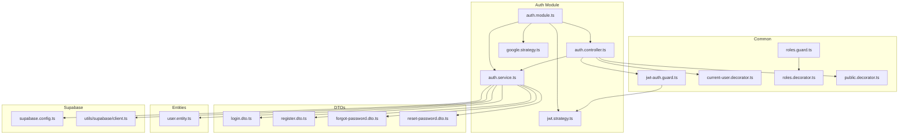
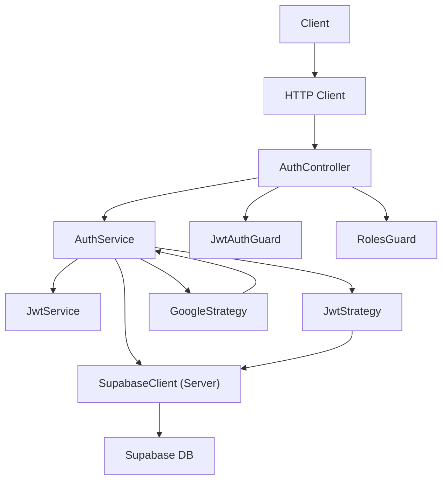
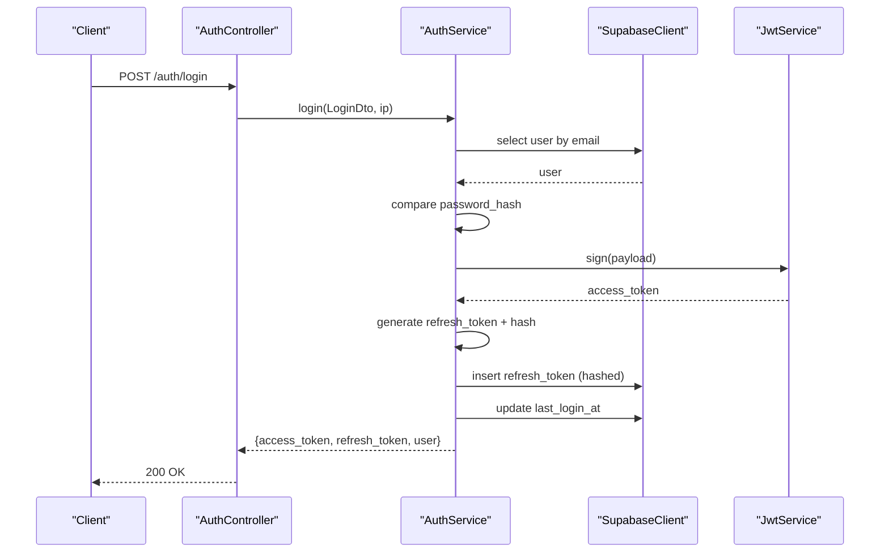
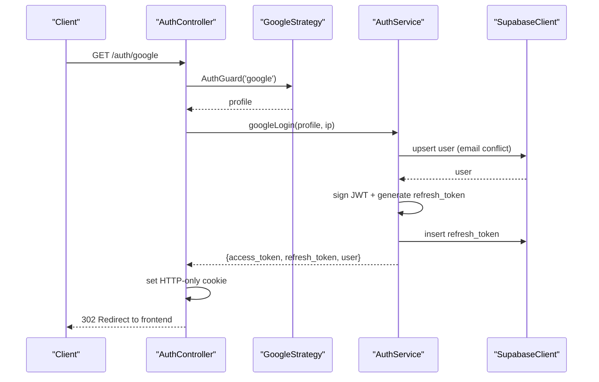
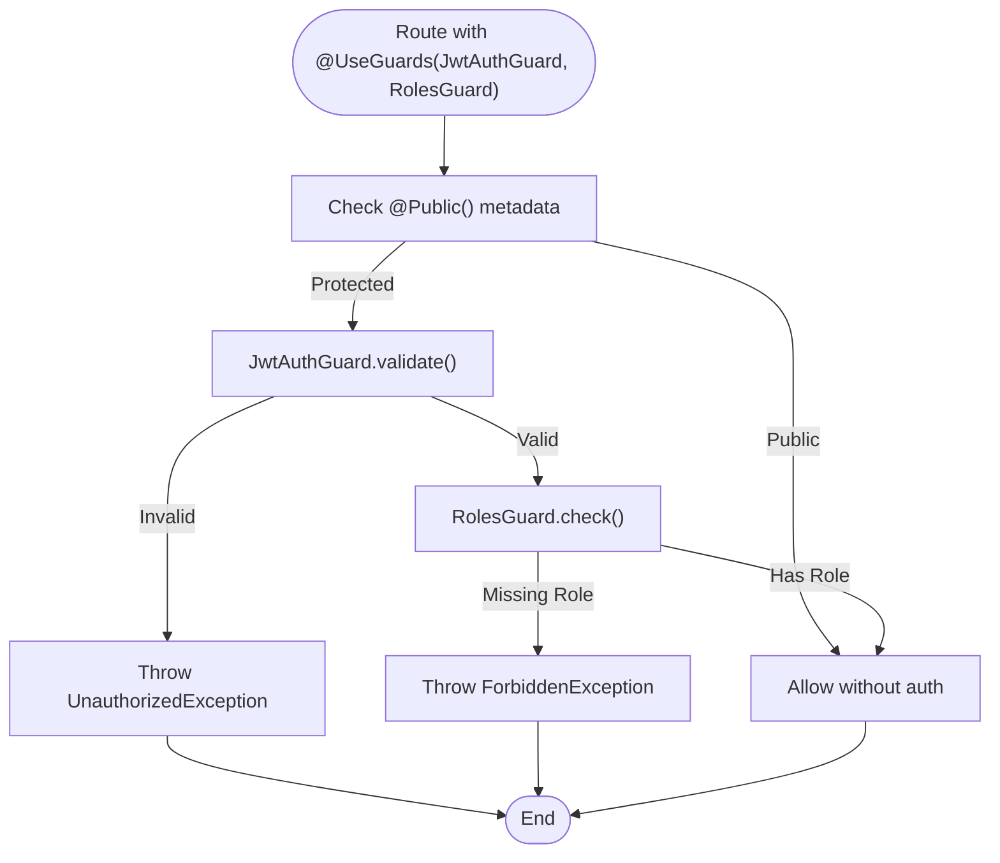
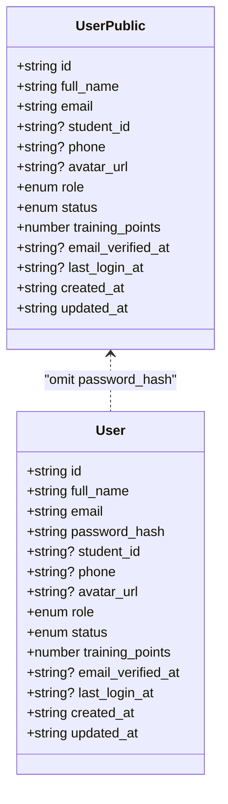
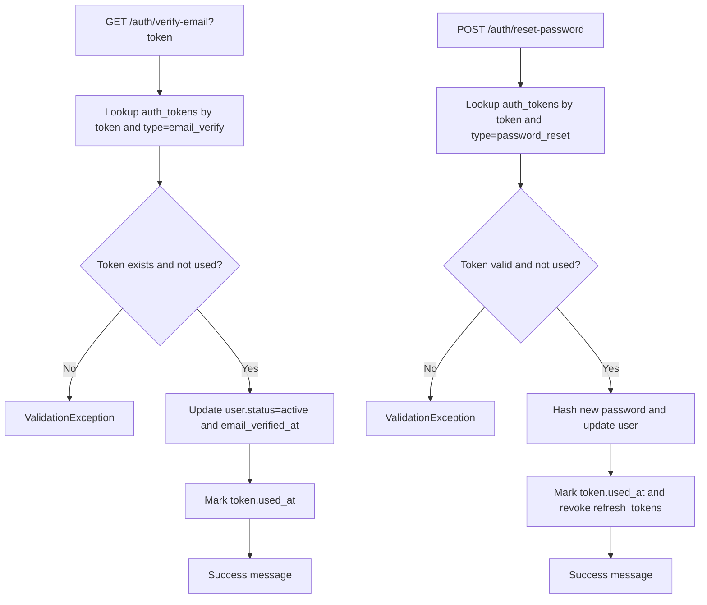
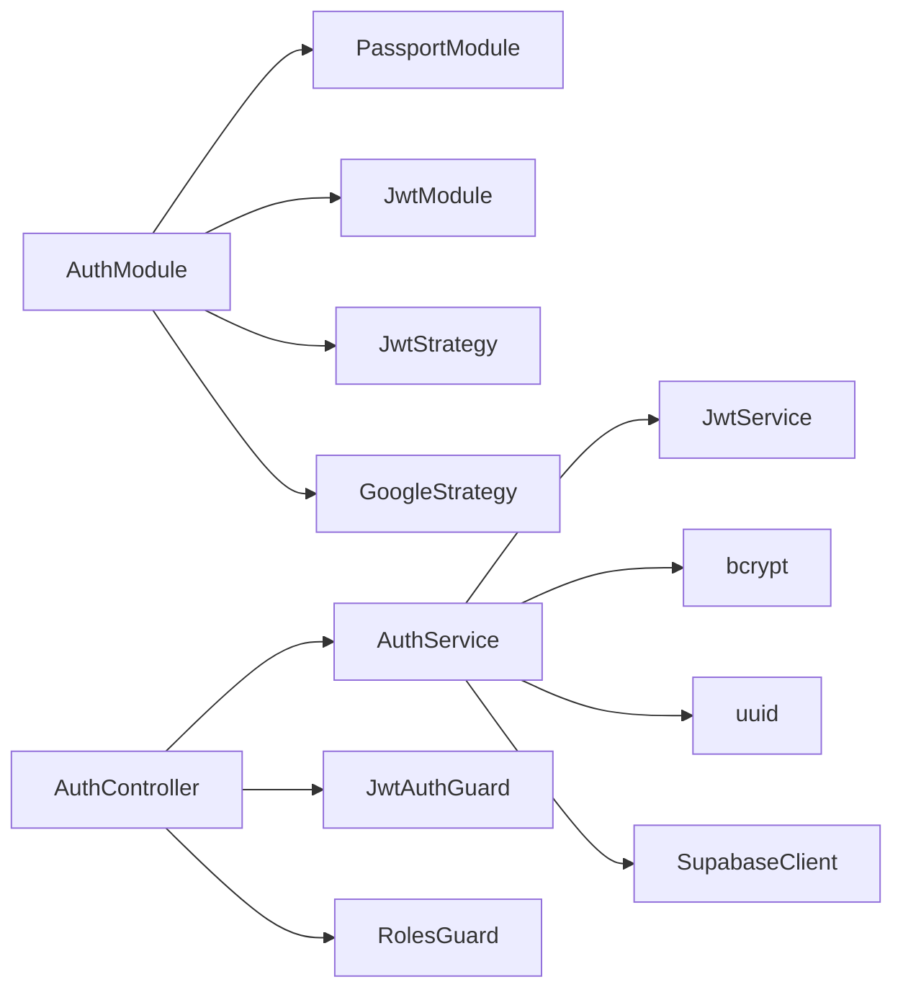

# Authentication System

<cite>
**Referenced Files in This Document**
- [auth.module.ts](file://backend/src/modules/auth/auth.module.ts)
- [auth.service.ts](file://backend/src/modules/auth/auth.service.ts)
- [auth.controller.ts](file://backend/src/modules/auth/auth.controller.ts)
- [user.entity.ts](file://backend/src/modules/auth/entities/user.entity.ts)
- [login.dto.ts](file://backend/src/modules/auth/dto/login.dto.ts)
- [register.dto.ts](file://backend/src/modules/auth/dto/register.dto.ts)
- [forgot-password.dto.ts](file://backend/src/modules/auth/dto/forgot-password.dto.ts)
- [reset-password.dto.ts](file://backend/src/modules/auth/dto/reset-password.dto.ts)
- [jwt.strategy.ts](file://backend/src/modules/auth/strategies/jwt.strategy.ts)
- [google.strategy.ts](file://backend/src/modules/auth/strategies/google.strategy.ts)
- [jwt-auth.guard.ts](file://backend/src/common/guards/jwt-auth.guard.ts)
- [roles.guard.ts](file://backend/src/common/guards/roles.guard.ts)
- [current-user.decorator.ts](file://backend/src/common/decorators/current-user.decorator.ts)
- [roles.decorator.ts](file://backend/src/common/decorators/roles.decorator.ts)
- [public.decorator.ts](file://backend/src/common/decorators/public.decorator.ts)
- [supabase.config.ts](file://backend/src/config/supabase.config.ts)
- [client.ts](file://backend/src/utils/supabase/client.ts)
</cite>

## Table of Contents
1. [Introduction](#introduction)
2. [Project Structure](#project-structure)
3. [Core Components](#core-components)
4. [Architecture Overview](#architecture-overview)
5. [Detailed Component Analysis](#detailed-component-analysis)
6. [Dependency Analysis](#dependency-analysis)
7. [Performance Considerations](#performance-considerations)
8. [Troubleshooting Guide](#troubleshooting-guide)
9. [Conclusion](#conclusion)

## Introduction
This document explains the MissLost authentication system with a focus on JWT token management, Google OAuth integration, and role-based access control. It documents the authentication service functionality, user entity structure, and security strategies. Concrete examples from the codebase illustrate login/register workflows, token refresh mechanisms, and user session management. It also covers DTO validation schemas, guard implementations, and decorator usage patterns, along with relationships to Supabase authentication, password hashing, and user permission systems.

## Project Structure
The authentication subsystem is organized under the auth module with clear separation of concerns:
- Module registration configures Passport, JWT, and strategy providers.
- Service encapsulates business logic for registration, login, logout, email verification, password reset, and Google OAuth.
- Controller exposes REST endpoints with guards and decorators.
- Strategies implement JWT and Google OAuth validation.
- Guards and decorators enforce authentication and authorization policies.
- DTOs define validation schemas for requests.
- Supabase clients provide database access.

**Diagram sources**
- [auth.module.ts:11-34](file://backend/src/modules/auth/auth.module.ts#L11-L34)
- [auth.controller.ts:26-127](file://backend/src/modules/auth/auth.controller.ts#L26-L127)
- [auth.service.ts:17-273](file://backend/src/modules/auth/auth.service.ts#L17-L273)
- [jwt.strategy.ts:16-39](file://backend/src/modules/auth/strategies/jwt.strategy.ts#L16-L39)
- [google.strategy.ts:6-37](file://backend/src/modules/auth/strategies/google.strategy.ts#L6-L37)
- [jwt-auth.guard.ts:7-28](file://backend/src/common/guards/jwt-auth.guard.ts#L7-L28)
- [roles.guard.ts:6-27](file://backend/src/common/guards/roles.guard.ts#L6-L27)
- [current-user.decorator.ts:3-8](file://backend/src/common/decorators/current-user.decorator.ts#L3-L8)
- [roles.decorator.ts:3-4](file://backend/src/common/decorators/roles.decorator.ts#L3-L4)
- [public.decorator.ts:3-4](file://backend/src/common/decorators/public.decorator.ts#L3-L4)
- [login.dto.ts:4-12](file://backend/src/modules/auth/dto/login.dto.ts#L4-L12)
- [register.dto.ts:4-29](file://backend/src/modules/auth/dto/register.dto.ts#L4-L29)
- [forgot-password.dto.ts:4-8](file://backend/src/modules/auth/dto/forgot-password.dto.ts#L4-L8)
- [reset-password.dto.ts:4-17](file://backend/src/modules/auth/dto/reset-password.dto.ts#L4-L17)
- [user.entity.ts:1-18](file://backend/src/modules/auth/entities/user.entity.ts#L1-L18)
- [supabase.config.ts:7-23](file://backend/src/config/supabase.config.ts#L7-L23)
- [client.ts:9-18](file://backend/src/utils/supabase/client.ts#L9-L18)

**Section sources**
- [auth.module.ts:11-34](file://backend/src/modules/auth/auth.module.ts#L11-L34)
- [auth.controller.ts:26-127](file://backend/src/modules/auth/auth.controller.ts#L26-L127)
- [auth.service.ts:17-273](file://backend/src/modules/auth/auth.service.ts#L17-L273)

## Core Components
- Auth Module: Registers Passport, JWT, and strategy providers; exports AuthService and JwtModule.
- Auth Service: Implements registration, login, logout, email verification, password reset, and Google OAuth flows; manages refresh tokens and hashed passwords.
- Auth Controller: Exposes endpoints for register, login, logout, verify-email, forgot-password, reset-password, and Google OAuth; applies guards and decorators.
- Strategies: JWT strategy validates tokens against Supabase users; Google strategy fetches profile data.
- Guards and Decorators: JwtAuthGuard enforces JWT-based authentication; RolesGuard enforces role checks; decorators expose current user and mark routes as public.
- DTOs: Define validation schemas for login, register, forgot-password, and reset-password.
- User Entity: Defines the user model and public projection excluding sensitive fields.
- Supabase Clients: Centralized clients for server-side database operations.

**Section sources**
- [auth.module.ts:11-34](file://backend/src/modules/auth/auth.module.ts#L11-L34)
- [auth.service.ts:17-273](file://backend/src/modules/auth/auth.service.ts#L17-L273)
- [auth.controller.ts:26-127](file://backend/src/modules/auth/auth.controller.ts#L26-L127)
- [jwt.strategy.ts:16-39](file://backend/src/modules/auth/strategies/jwt.strategy.ts#L16-L39)
- [google.strategy.ts:6-37](file://backend/src/modules/auth/strategies/google.strategy.ts#L6-L37)
- [jwt-auth.guard.ts:7-28](file://backend/src/common/guards/jwt-auth.guard.ts#L7-L28)
- [roles.guard.ts:6-27](file://backend/src/common/guards/roles.guard.ts#L6-L27)
- [current-user.decorator.ts:3-8](file://backend/src/common/decorators/current-user.decorator.ts#L3-L8)
- [roles.decorator.ts:3-4](file://backend/src/common/decorators/roles.decorator.ts#L3-L4)
- [public.decorator.ts:3-4](file://backend/src/common/decorators/public.decorator.ts#L3-L4)
- [login.dto.ts:4-12](file://backend/src/modules/auth/dto/login.dto.ts#L4-L12)
- [register.dto.ts:4-29](file://backend/src/modules/auth/dto/register.dto.ts#L4-L29)
- [forgot-password.dto.ts:4-8](file://backend/src/modules/auth/dto/forgot-password.dto.ts#L4-L8)
- [reset-password.dto.ts:4-17](file://backend/src/modules/auth/dto/reset-password.dto.ts#L4-L17)
- [user.entity.ts:1-18](file://backend/src/modules/auth/entities/user.entity.ts#L1-L18)
- [supabase.config.ts:7-23](file://backend/src/config/supabase.config.ts#L7-L23)
- [client.ts:9-18](file://backend/src/utils/supabase/client.ts#L9-L18)

## Architecture Overview
The authentication system integrates NestJS Passport, JWT, and Supabase:
- Registration and login hash passwords and store tokens in Supabase.
- Google OAuth uses passport-google-oauth20 to obtain profile data and upsert users.
- JWT strategy validates tokens and checks user status.
- Guards and decorators enforce authentication and role-based authorization.
- Controllers manage HTTP flows, cookies, and redirects.

**Diagram sources**
- [auth.controller.ts:26-127](file://backend/src/modules/auth/auth.controller.ts#L26-L127)
- [auth.service.ts:17-273](file://backend/src/modules/auth/auth.service.ts#L17-L273)
- [jwt.strategy.ts:16-39](file://backend/src/modules/auth/strategies/jwt.strategy.ts#L16-L39)
- [google.strategy.ts:6-37](file://backend/src/modules/auth/strategies/google.strategy.ts#L6-L37)
- [jwt-auth.guard.ts:7-28](file://backend/src/common/guards/jwt-auth.guard.ts#L7-L28)
- [roles.guard.ts:6-27](file://backend/src/common/guards/roles.guard.ts#L6-L27)
- [supabase.config.ts:7-23](file://backend/src/config/supabase.config.ts#L7-L23)

## Detailed Component Analysis

### JWT Token Management
- Access tokens: Generated via JwtService with a payload containing user identity and role; signed with a secret from configuration.
- Refresh tokens: Generated as random strings, hashed with bcrypt, stored in the refresh_tokens table with expiration; used to mint new access tokens.
- Logout: Revokes all unrevoked refresh tokens for the user.
- Strategy validation: Validates JWT payload against Supabase users and rejects suspended accounts.

**Diagram sources**
- [auth.controller.ts:42-44](file://backend/src/modules/auth/auth.controller.ts#L42-L44)
- [auth.service.ts:72-110](file://backend/src/modules/auth/auth.service.ts#L72-L110)

**Section sources**
- [auth.service.ts:72-110](file://backend/src/modules/auth/auth.service.ts#L72-L110)
- [jwt.strategy.ts:26-38](file://backend/src/modules/auth/strategies/jwt.strategy.ts#L26-L38)
- [auth.controller.ts:46-60](file://backend/src/modules/auth/auth.controller.ts#L46-L60)

### Google OAuth Integration
- Strategy: passport-google-oauth20 extracts profile fields and constructs a normalized user object.
- Controller: Initiates OAuth flow and handles callback; stores access token in an HTTP-only cookie and redirects to frontend with minimal data.

**Diagram sources**
- [auth.controller.ts:85-126](file://backend/src/modules/auth/auth.controller.ts#L85-L126)
- [google.strategy.ts:17-36](file://backend/src/modules/auth/strategies/google.strategy.ts#L17-L36)
- [auth.service.ts:113-167](file://backend/src/modules/auth/auth.service.ts#L113-L167)

**Section sources**
- [google.strategy.ts:6-37](file://backend/src/modules/auth/strategies/google.strategy.ts#L6-L37)
- [auth.controller.ts:85-126](file://backend/src/modules/auth/auth.controller.ts#L85-L126)
- [auth.service.ts:113-167](file://backend/src/modules/auth/auth.service.ts#L113-L167)

### Role-Based Access Control
- Guards: JwtAuthGuard delegates to JWT strategy; RolesGuard checks required roles against the request user.
- Decorators: @Roles(...) sets required roles metadata; @Public() marks routes as open; @CurrentUser() injects the authenticated user.

**Diagram sources**
- [jwt-auth.guard.ts:13-27](file://backend/src/common/guards/jwt-auth.guard.ts#L13-L27)
- [roles.guard.ts:10-26](file://backend/src/common/guards/roles.guard.ts#L10-L26)
- [roles.decorator.ts:3-4](file://backend/src/common/decorators/roles.decorator.ts#L3-L4)
- [public.decorator.ts:3-4](file://backend/src/common/decorators/public.decorator.ts#L3-L4)
- [current-user.decorator.ts:3-8](file://backend/src/common/decorators/current-user.decorator.ts#L3-L8)

**Section sources**
- [jwt-auth.guard.ts:7-28](file://backend/src/common/guards/jwt-auth.guard.ts#L7-L28)
- [roles.guard.ts:6-27](file://backend/src/common/guards/roles.guard.ts#L6-L27)
- [roles.decorator.ts:3-4](file://backend/src/common/decorators/roles.decorator.ts#L3-L4)
- [public.decorator.ts:3-4](file://backend/src/common/decorators/public.decorator.ts#L3-L4)
- [current-user.decorator.ts:3-8](file://backend/src/common/decorators/current-user.decorator.ts#L3-L8)

### User Entity and DTO Validation
- User entity: Defines fields including role and status; public projection excludes password_hash.
- DTOs: Enforce field presence, types, lengths, and formats for login, register, forgot-password, and reset-password.

**Diagram sources**
- [user.entity.ts:1-18](file://backend/src/modules/auth/entities/user.entity.ts#L1-L18)

**Section sources**
- [user.entity.ts:1-18](file://backend/src/modules/auth/entities/user.entity.ts#L1-L18)
- [login.dto.ts:4-12](file://backend/src/modules/auth/dto/login.dto.ts#L4-L12)
- [register.dto.ts:4-29](file://backend/src/modules/auth/dto/register.dto.ts#L4-L29)
- [forgot-password.dto.ts:4-8](file://backend/src/modules/auth/dto/forgot-password.dto.ts#L4-L8)
- [reset-password.dto.ts:4-17](file://backend/src/modules/auth/dto/reset-password.dto.ts#L4-L17)

### Email Verification and Password Reset
- Email verification: Validates token existence, type, and expiration; updates user status and marks token as used.
- Password reset: Validates reset token, updates user password_hash, marks token as used, and revokes refresh tokens.

**Diagram sources**
- [auth.service.ts:181-208](file://backend/src/modules/auth/auth.service.ts#L181-L208)
- [auth.service.ts:237-272](file://backend/src/modules/auth/auth.service.ts#L237-L272)

**Section sources**
- [auth.service.ts:181-208](file://backend/src/modules/auth/auth.service.ts#L181-L208)
- [auth.service.ts:237-272](file://backend/src/modules/auth/auth.service.ts#L237-L272)

### Session Management and Cookie Handling
- Access tokens are stored in HTTP-only cookies to mitigate XSS risks.
- Secure and SameSite attributes are applied based on environment.
- Frontend receives user data and navigates to a callback page without exposing tokens in URLs.

**Section sources**
- [auth.controller.ts:51-60](file://backend/src/modules/auth/auth.controller.ts#L51-L60)
- [auth.controller.ts:109-120](file://backend/src/modules/auth/auth.controller.ts#L109-L120)

## Dependency Analysis
- Module-level dependencies: AuthModule imports Passport, JwtModule, and registers strategies/providers.
- Service dependencies: AuthService depends on JwtService, bcrypt, UUID, and Supabase client.
- Guard dependencies: JwtAuthGuard depends on JwtStrategy; RolesGuard depends on Reflector and metadata.
- Controller dependencies: Uses guards, decorators, and AuthService methods.

**Diagram sources**
- [auth.module.ts:11-34](file://backend/src/modules/auth/auth.module.ts#L11-L34)
- [auth.controller.ts:26-127](file://backend/src/modules/auth/auth.controller.ts#L26-L127)
- [auth.service.ts:17-273](file://backend/src/modules/auth/auth.service.ts#L17-L273)

**Section sources**
- [auth.module.ts:11-34](file://backend/src/modules/auth/auth.module.ts#L11-L34)
- [auth.controller.ts:26-127](file://backend/src/modules/auth/auth.controller.ts#L26-L127)
- [auth.service.ts:17-273](file://backend/src/modules/auth/auth.service.ts#L17-L273)

## Performance Considerations
- Token hashing: bcrypt cost factors balance security and performance; adjust according to hardware.
- Database queries: Select only required fields; cache non-sensitive user metadata where appropriate.
- Cookie size: Keep cookie payloads minimal; avoid storing large claims.
- Supabase client reuse: Clients are created lazily and reused; ensure environment variables are set to prevent repeated initialization overhead.

## Troubleshooting Guide
- Missing JWT_SECRET: Module-level factory throws an error if missing; configure environment variable.
- Missing Supabase credentials: Supabase client factory throws an error if URL or keys are missing.
- UnauthorizedException: Thrown on invalid tokens, wrong credentials, suspended accounts, or missing user.
- ForbiddenException: Thrown when required roles are not met.
- Google OAuth errors: Controller catches and redirects to frontend with error query parameter.
- Password reset token expired: Validation checks expiration and throws a validation error.

**Section sources**
- [auth.module.ts:16-21](file://backend/src/modules/auth/auth.module.ts#L16-L21)
- [supabase.config.ts:12-14](file://backend/src/config/supabase.config.ts#L12-L14)
- [jwt.strategy.ts:34-35](file://backend/src/modules/auth/strategies/jwt.strategy.ts#L34-L35)
- [auth.controller.ts:101-103](file://backend/src/modules/auth/auth.controller.ts#L101-L103)
- [auth.service.ts:252-255](file://backend/src/modules/auth/auth.service.ts#L252-L255)

## Conclusion
MissLost’s authentication system combines robust JWT token management, secure Google OAuth integration, and role-based access control. It leverages Supabase for user persistence, enforces strict validation via DTOs, and uses guards and decorators to protect routes. Security best practices include HTTP-only cookies, token hashing, status checks, and careful handling of OAuth callbacks. The documented flows and components provide a clear blueprint for extending and maintaining the authentication subsystem.