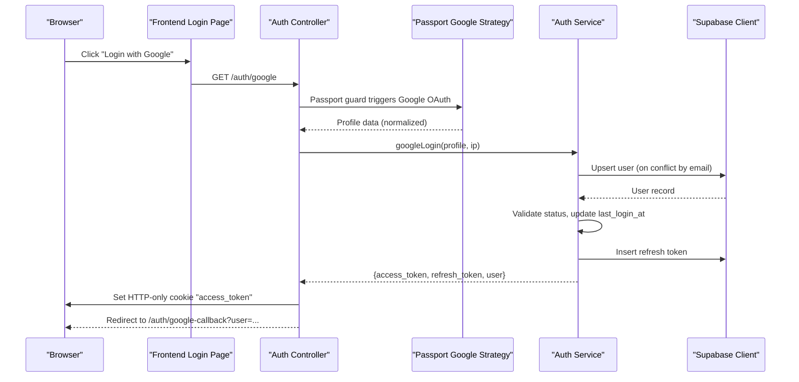
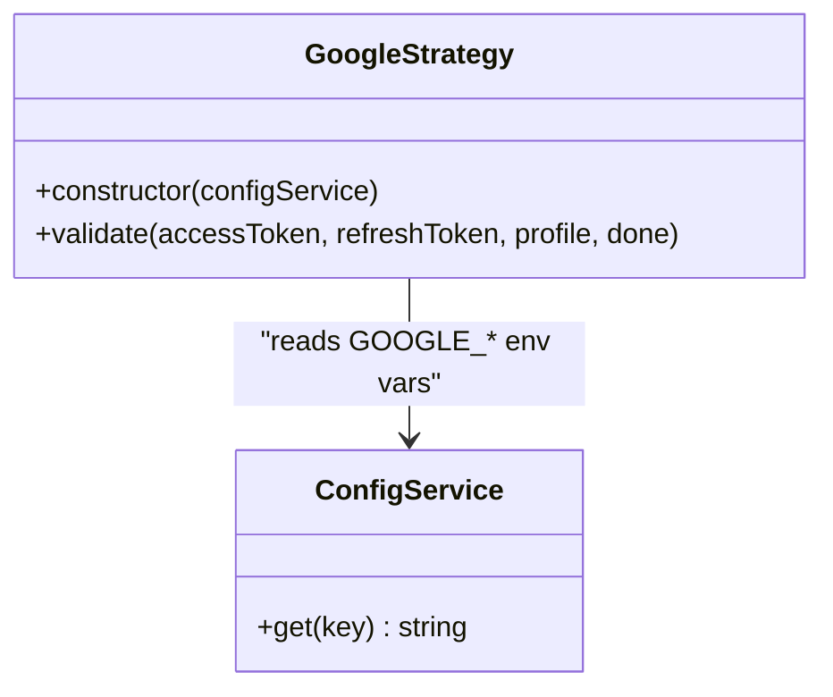
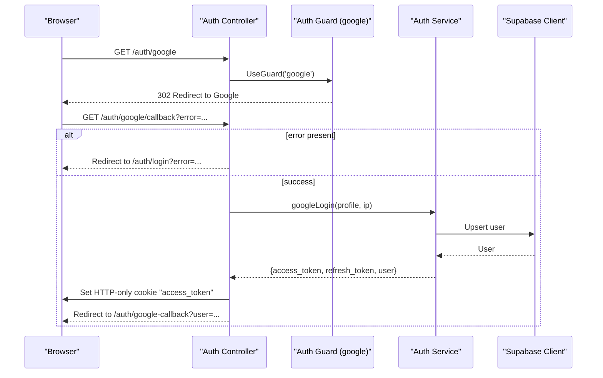
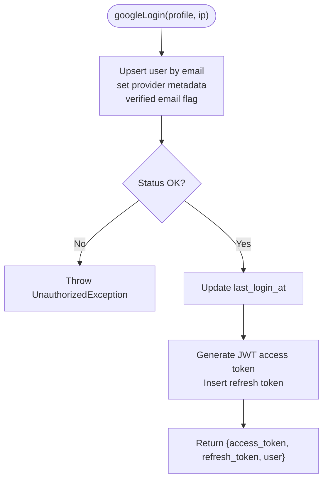
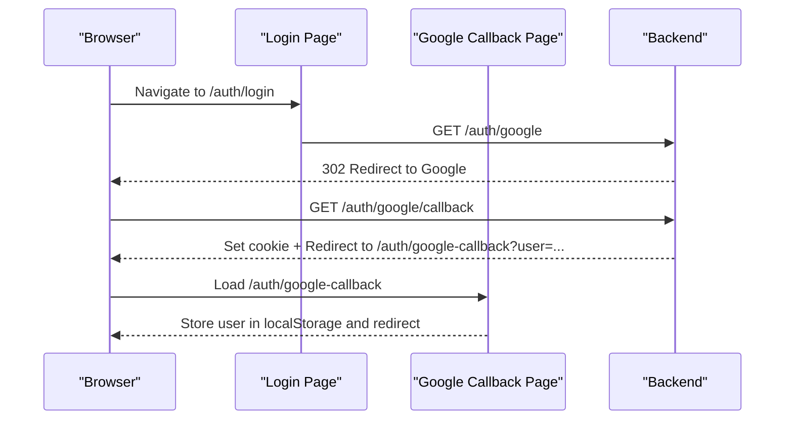
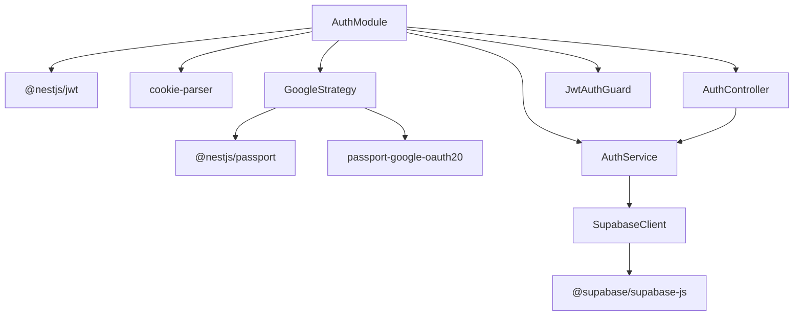

# Google OAuth Integration

<cite>
**Referenced Files in This Document**
- [google.strategy.ts](file://backend/src/modules/auth/strategies/google.strategy.ts)
- [auth.service.ts](file://backend/src/modules/auth/auth.service.ts)
- [auth.controller.ts](file://backend/src/modules/auth/auth.controller.ts)
- [auth.module.ts](file://backend/src/modules/auth/auth.module.ts)
- [user.entity.ts](file://backend/src/modules/auth/entities/user.entity.ts)
- [supabase.config.ts](file://backend/src/config/supabase.config.ts)
- [jwt-auth.guard.ts](file://backend/src/common/guards/jwt-auth.guard.ts)
- [app.module.ts](file://backend/src/app.module.ts)
- [page.tsx](file://frontend/app/auth/login/page.tsx)
- [page.tsx](file://frontend/app/auth/google-callback/page.tsx)
- [GOOGLE_OAUTH_SETUP.md](file://GOOGLE_OAUTH_SETUP.md)
- [package.json](file://backend/package.json)
</cite>

## Table of Contents
1. [Introduction](#introduction)
2. [Project Structure](#project-structure)
3. [Core Components](#core-components)
4. [Architecture Overview](#architecture-overview)
5. [Detailed Component Analysis](#detailed-component-analysis)
6. [Dependency Analysis](#dependency-analysis)
7. [Performance Considerations](#performance-considerations)
8. [Troubleshooting Guide](#troubleshooting-guide)
9. [Conclusion](#conclusion)

## Introduction
This document explains the Google OAuth integration in the MissLost authentication system. It covers the Google OAuth strategy implementation, profile retrieval process, social login workflow, and the googleLogin method functionality. It documents user lookup by email, automatic user creation for new Google users, profile data mapping, and seamless integration with the existing user management system. It also details setup requirements, client configuration, security considerations, user synchronization between Google profiles and local accounts, handling of missing profile information, and error scenarios in OAuth authentication.

## Project Structure
The Google OAuth integration spans backend NestJS modules and frontend Next.js pages:
- Backend: Authentication module with Google strategy, service, controller, and guards
- Frontend: Login page initiating OAuth and callback page handling the result
- Configuration: Environment variables for OAuth credentials and Supabase client

**Diagram sources**
- [app.module.ts:28-67](file://backend/src/app.module.ts#L28-L67)
- [auth.module.ts:11-35](file://backend/src/modules/auth/auth.module.ts#L11-L35)
- [google.strategy.ts:6-38](file://backend/src/modules/auth/strategies/google.strategy.ts#L6-L38)
- [auth.service.ts:112-167](file://backend/src/modules/auth/auth.service.ts#L112-L167)
- [auth.controller.ts:86-129](file://backend/src/modules/auth/auth.controller.ts#L86-L129)
- [jwt-auth.guard.ts:7-29](file://backend/src/common/guards/jwt-auth.guard.ts#L7-L29)
- [supabase.config.ts:7-25](file://backend/src/config/supabase.config.ts#L7-L25)
- [page.tsx](file://frontend/app/auth/login/page.tsx)
- [page.tsx](file://frontend/app/auth/google-callback/page.tsx)

**Section sources**
- [app.module.ts:28-67](file://backend/src/app.module.ts#L28-L67)
- [auth.module.ts:11-35](file://backend/src/modules/auth/auth.module.ts#L11-L35)
- [google.strategy.ts:6-38](file://backend/src/modules/auth/strategies/google.strategy.ts#L6-L38)
- [auth.service.ts:112-167](file://backend/src/modules/auth/auth.service.ts#L112-L167)
- [auth.controller.ts:86-129](file://backend/src/modules/auth/auth.controller.ts#L86-L129)
- [jwt-auth.guard.ts:7-29](file://backend/src/common/guards/jwt-auth.guard.ts#L7-L29)
- [supabase.config.ts:7-25](file://backend/src/config/supabase.config.ts#L7-L25)
- [page.tsx](file://frontend/app/auth/login/page.tsx)
- [page.tsx](file://frontend/app/auth/google-callback/page.tsx)

## Core Components
- Google Strategy: Extracts profile data from Google OAuth and returns a normalized user object without sensitive tokens
- Auth Service: Handles Google login flow, user lookup/creation/upsert, status checks, token generation, and refresh token management
- Auth Controller: Exposes OAuth endpoints, redirects to Google, handles callbacks, and sets secure cookies
- Guards and Modules: Passport and JWT guards enable protected routes and strategy registration
- Supabase Client: Provides database operations for user management and token persistence
- Frontend Pages: Trigger OAuth initiation and handle callback results

Key responsibilities:
- Profile extraction and normalization in Google Strategy
- Upsert and status validation in Auth Service googleLogin
- Secure cookie-based token delivery in Auth Controller
- Frontend callback handling and role-based redirection

**Section sources**
- [google.strategy.ts:17-36](file://backend/src/modules/auth/strategies/google.strategy.ts#L17-L36)
- [auth.service.ts:112-167](file://backend/src/modules/auth/auth.service.ts#L112-L167)
- [auth.controller.ts:86-129](file://backend/src/modules/auth/auth.controller.ts#L86-L129)
- [auth.module.ts:11-35](file://backend/src/modules/auth/auth.module.ts#L11-L35)
- [supabase.config.ts:7-25](file://backend/src/config/supabase.config.ts#L7-L25)

## Architecture Overview
The Google OAuth workflow integrates frontend, backend, and external Google services:

**Diagram sources**
- [auth.controller.ts:86-129](file://backend/src/modules/auth/auth.controller.ts#L86-L129)
- [google.strategy.ts:17-36](file://backend/src/modules/auth/strategies/google.strategy.ts#L17-L36)
- [auth.service.ts:112-167](file://backend/src/modules/auth/auth.service.ts#L112-L167)
- [supabase.config.ts:7-25](file://backend/src/config/supabase.config.ts#L7-L25)
- [page.tsx](file://frontend/app/auth/login/page.tsx)
- [page.tsx](file://frontend/app/auth/google-callback/page.tsx)

## Detailed Component Analysis

### Google Strategy Implementation
The Google Strategy extends Passport’s Google OAuth strategy and normalizes profile data into a standardized user object. It avoids storing sensitive tokens in the session and ensures robust handling of missing profile fields.

**Diagram sources**
- [google.strategy.ts:6-38](file://backend/src/modules/auth/strategies/google.strategy.ts#L6-L38)

Key behaviors:
- Reads client credentials and callback URL from environment
- Extracts email, name, and avatar from Google profile
- Builds normalized user object with provider metadata
- Omits access/refresh tokens to prevent session leakage

**Section sources**
- [google.strategy.ts:8-15](file://backend/src/modules/auth/strategies/google.strategy.ts#L8-L15)
- [google.strategy.ts:23-35](file://backend/src/modules/auth/strategies/google.strategy.ts#L23-L35)

### Auth Controller: OAuth Endpoints and Callback Handling
The Auth Controller exposes two primary endpoints:
- GET /auth/google: Redirects to Google OAuth using the Passport Google guard
- GET /auth/google/callback: Handles the OAuth callback, validates errors, calls googleLogin, sets secure cookies, and redirects to frontend

**Diagram sources**
- [auth.controller.ts:86-129](file://backend/src/modules/auth/auth.controller.ts#L86-L129)
- [auth.service.ts:112-167](file://backend/src/modules/auth/auth.service.ts#L112-L167)
- [supabase.config.ts:7-25](file://backend/src/config/supabase.config.ts#L7-L25)

Security enhancements:
- Uses HTTP-only cookies for access tokens to mitigate XSS
- Applies secure, sameSite, and path cookie attributes configurable via environment
- Clears cookies on logout via a dedicated logout endpoint

**Section sources**
- [auth.controller.ts:86-129](file://backend/src/modules/auth/auth.controller.ts#L86-L129)

### Auth Service: googleLogin Method
The googleLogin method performs user lookup/creation and login completion:
- Upserts user by email with provider metadata and verified email flag
- Validates user status (active, suspended, pending_verify)
- Updates last_login_at
- Generates JWT access token and inserts refresh token
- Returns safe user object without password hash

**Diagram sources**
- [auth.service.ts:112-167](file://backend/src/modules/auth/auth.service.ts#L112-L167)

User synchronization:
- Uses upsert with conflict on email to create or update Google users
- Sets email_verified_at for Google users
- Maps Google profile fields to local user attributes

**Section sources**
- [auth.service.ts:112-167](file://backend/src/modules/auth/auth.service.ts#L112-L167)

### Frontend Integration: Login and Callback Pages
- Login page initiates OAuth by navigating to the backend Google endpoint
- Callback page receives user data via URL parameter and stores it in localStorage, then redirects based on role

**Diagram sources**
- [page.tsx](file://frontend/app/auth/login/page.tsx)
- [page.tsx](file://frontend/app/auth/google-callback/page.tsx)
- [auth.controller.ts:86-129](file://backend/src/modules/auth/auth.controller.ts#L86-L129)

**Section sources**
- [page.tsx](file://frontend/app/auth/login/page.tsx)
- [page.tsx](file://frontend/app/auth/google-callback/page.tsx)

## Dependency Analysis
The integration relies on several key dependencies and configurations:

**Diagram sources**
- [auth.module.ts:11-35](file://backend/src/modules/auth/auth.module.ts#L11-L35)
- [package.json:22-46](file://backend/package.json#L22-L46)
- [google.strategy.ts:1-4](file://backend/src/modules/auth/strategies/google.strategy.ts#L1-L4)
- [auth.controller.ts:13-24](file://backend/src/modules/auth/auth.controller.ts#L13-L24)
- [auth.service.ts:18-19](file://backend/src/modules/auth/auth.service.ts#L18-L19)
- [jwt-auth.guard.ts:1-6](file://backend/src/common/guards/jwt-auth.guard.ts#L1-L6)
- [supabase.config.ts:1-4](file://backend/src/config/supabase.config.ts#L1-L4)

**Section sources**
- [auth.module.ts:11-35](file://backend/src/modules/auth/auth.module.ts#L11-L35)
- [package.json:22-46](file://backend/package.json#L22-L46)

## Performance Considerations
- Strategy validation is lightweight and only extracts required profile fields
- googleLogin uses a single upsert operation with conflict on email to minimize database round-trips
- Refresh token insertion occurs after JWT generation to avoid blocking the response
- Frontend callback page performs minimal processing and redirects quickly

## Troubleshooting Guide
Common issues and resolutions:
- redirect_uri_mismatch: Ensure Authorized redirect URIs in Google Console exactly match GOOGLE_CALLBACK_URL
- invalid_client: Verify GOOGLE_CLIENT_ID and GOOGLE_CLIENT_SECRET are correct and free of extra spaces
- Users can’t login: Confirm OAuth consent screen is configured and app is published if not in testing mode
- Token leakage prevention: Access tokens are stored in HTTP-only cookies; ensure frontend requests include credentials when needed
- Status validation errors: Suspended or pending_verify users cannot log in; check user status in database

Setup checklist:
- Configure Google Cloud Project and OAuth consent screen
- Create OAuth 2.0 credentials with authorized origins and redirect URIs
- Set environment variables for GOOGLE_CLIENT_ID, GOOGLE_CLIENT_SECRET, GOOGLE_CALLBACK_URL, and FRONTEND_URL
- Ensure JWT_SECRET is configured for JWT signing
- Verify Supabase credentials and database connectivity

**Section sources**
- [GOOGLE_OAUTH_SETUP.md:96-118](file://GOOGLE_OAUTH_SETUP.md#L96-L118)
- [auth.controller.ts:101-104](file://backend/src/modules/auth/auth.controller.ts#L101-L104)
- [auth.service.ts:136-144](file://backend/src/modules/auth/auth.service.ts#L136-L144)

## Conclusion
The Google OAuth integration in MissLost provides a secure, streamlined social login experience. The Google Strategy normalizes profile data safely, the Auth Service performs robust user management with upsert and status checks, and the Auth Controller delivers tokens via secure cookies. The frontend pages complete the flow with role-aware redirection. Proper environment configuration and adherence to security best practices ensure reliable and secure authentication.