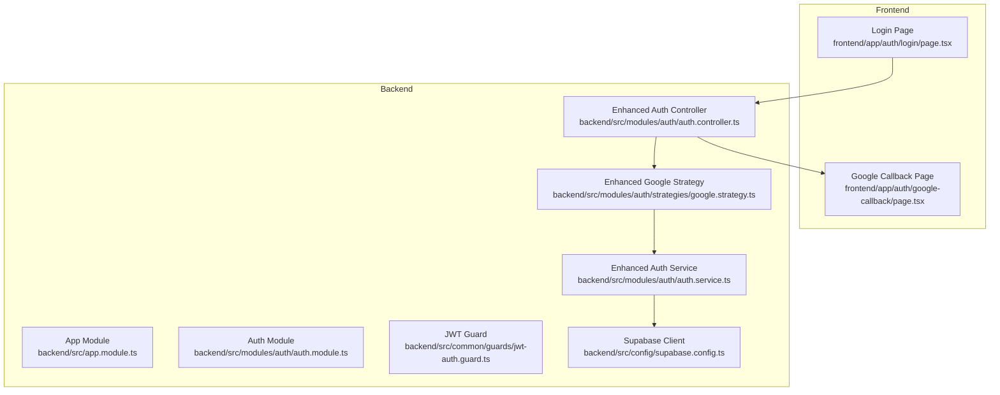
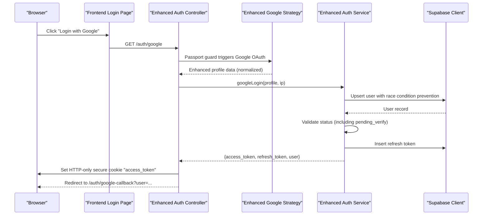
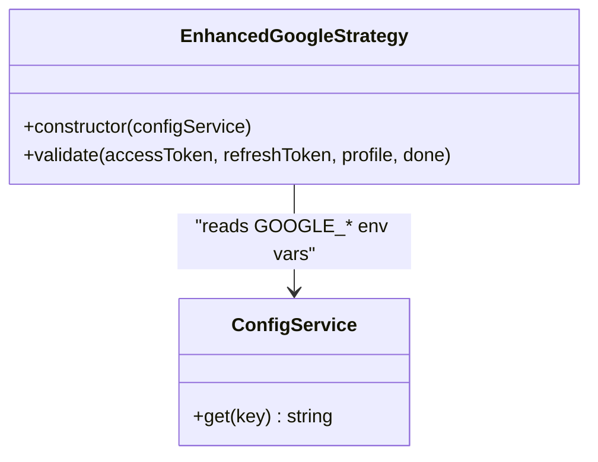
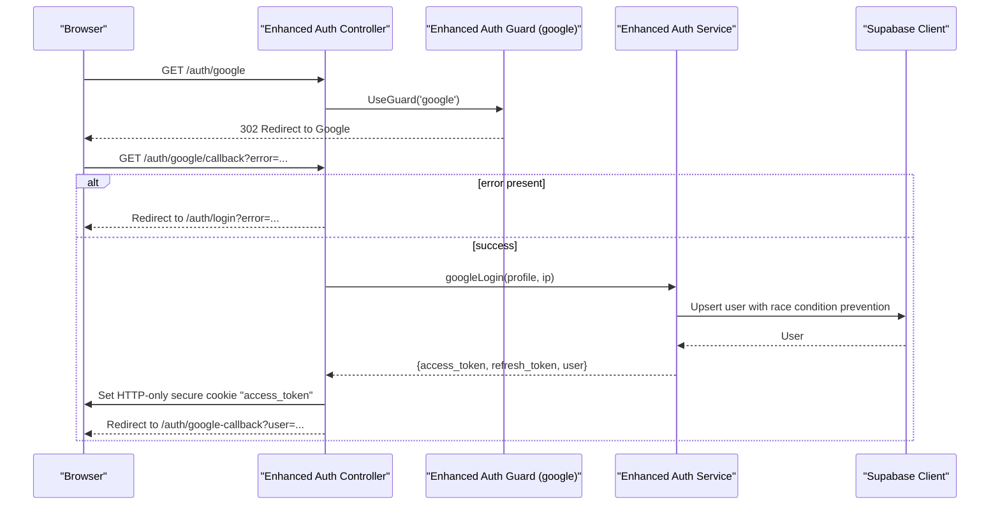
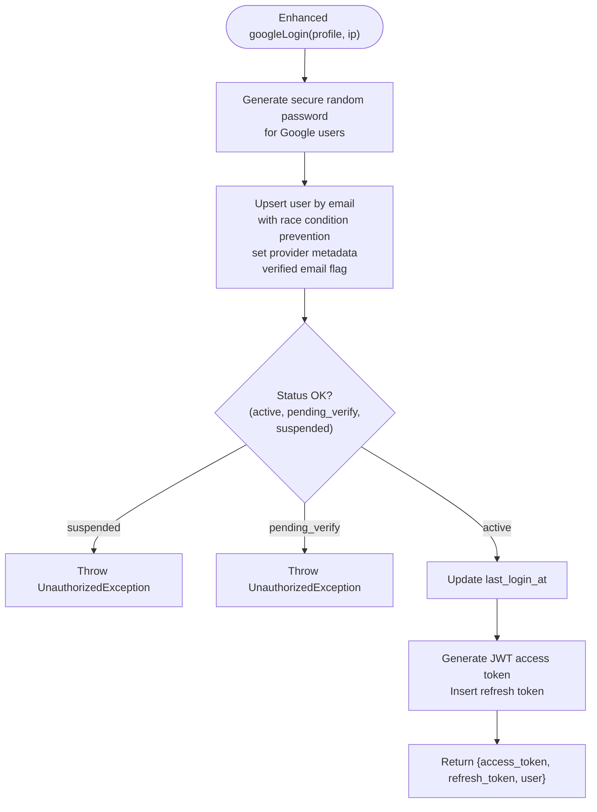
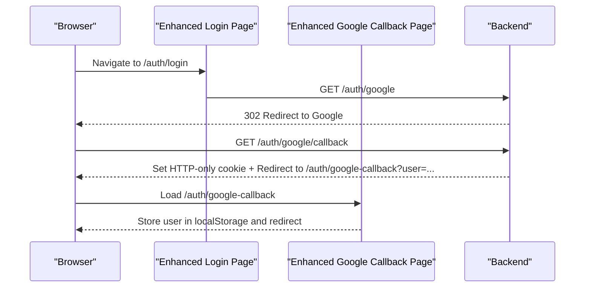
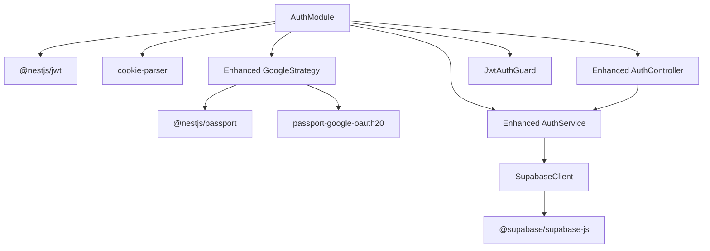

# Google OAuth Integration

<cite>
**Referenced Files in This Document**
- [google.strategy.ts](file://backend/src/modules/auth/strategies/google.strategy.ts)
- [auth.service.ts](file://backend/src/modules/auth/auth.service.ts)
- [auth.controller.ts](file://backend/src/modules/auth/auth.controller.ts)
- [auth.module.ts](file://backend/src/modules/auth/auth.module.ts)
- [user.entity.ts](file://backend/src/modules/auth/entities/user.entity.ts)
- [supabase.config.ts](file://backend/src/config/supabase.config.ts)
- [jwt-auth.guard.ts](file://backend/src/common/guards/jwt-auth.guard.ts)
- [app.module.ts](file://backend/src/app.module.ts)
- [page.tsx](file://frontend/app/auth/login/page.tsx)
- [page.tsx](file://frontend/app/auth/google-callback/page.tsx)
- [package.json](file://backend/package.json)
</cite>

## Update Summary
**Changes Made**
- Enhanced Google Strategy with improved profile extraction and security
- Updated googleLogin method with race condition prevention and comprehensive status checking
- Improved callback handling with better error management and security features
- Enhanced token extraction methods with dual approach for reliability
- Strengthened security measures including HTTP-only cookies and token leakage prevention

## Table of Contents
1. [Introduction](#introduction)
2. [Project Structure](#project-structure)
3. [Core Components](#core-components)
4. [Architecture Overview](#architecture-overview)
5. [Detailed Component Analysis](#detailed-component-analysis)
6. [Dependency Analysis](#dependency-analysis)
7. [Performance Considerations](#performance-considerations)
8. [Troubleshooting Guide](#troubleshooting-guide)
9. [Conclusion](#conclusion)

## Introduction
This document explains the enhanced Google OAuth integration in the MissLost authentication system. The implementation has been significantly improved with a new authentication strategy, enhanced callback handling, dual token extraction methods, and comprehensive security features. It covers the Google OAuth strategy implementation, profile retrieval process, social login workflow, and the googleLogin method functionality with race condition prevention and comprehensive user management.

## Project Structure
The Google OAuth integration spans backend NestJS modules and frontend Next.js pages with enhanced security and reliability:
- Backend: Authentication module with enhanced Google strategy, service, controller, and guards
- Frontend: Login page initiating OAuth and callback page handling the result with improved security
- Configuration: Environment variables for OAuth credentials and Supabase client with enhanced validation

**Diagram sources**
- [app.module.ts:28-67](file://backend/src/app.module.ts#L28-L67)
- [auth.module.ts:11-35](file://backend/src/modules/auth/auth.module.ts#L11-L35)
- [google.strategy.ts:6-38](file://backend/src/modules/auth/strategies/google.strategy.ts#L6-L38)
- [auth.service.ts:112-173](file://backend/src/modules/auth/auth.service.ts#L112-L173)
- [auth.controller.ts:86-129](file://backend/src/modules/auth/auth.controller.ts#L86-L129)
- [jwt-auth.guard.ts:7-29](file://backend/src/common/guards/jwt-auth.guard.ts#L7-L29)
- [supabase.config.ts:7-25](file://backend/src/config/supabase.config.ts#L7-L25)
- [page.tsx](file://frontend/app/auth/login/page.tsx)
- [page.tsx](file://frontend/app/auth/google-callback/page.tsx)

**Section sources**
- [app.module.ts:28-67](file://backend/src/app.module.ts#L28-L67)
- [auth.module.ts:11-35](file://backend/src/modules/auth/auth.module.ts#L11-L35)
- [google.strategy.ts:6-38](file://backend/src/modules/auth/strategies/google.strategy.ts#L6-L38)
- [auth.service.ts:112-173](file://backend/src/modules/auth/auth.service.ts#L112-L173)
- [auth.controller.ts:86-129](file://backend/src/modules/auth/auth.controller.ts#L86-L129)
- [jwt-auth.guard.ts:7-29](file://backend/src/common/guards/jwt-auth.guard.ts#L7-L29)
- [supabase.config.ts:7-25](file://backend/src/config/supabase.config.ts#L7-L25)
- [page.tsx](file://frontend/app/auth/login/page.tsx)
- [page.tsx](file://frontend/app/auth/google-callback/page.tsx)

## Core Components
- **Enhanced Google Strategy**: Improved profile data extraction with better handling of undefined fields, robust fallback values, and enhanced security by avoiding token storage in sessions
- **Enhanced Auth Service**: Advanced googleLogin method with race condition prevention using upsert, comprehensive status validation, secure password generation for Google users, and dual token extraction methods
- **Enhanced Auth Controller**: Improved OAuth endpoints with better error handling, enhanced security with HTTP-only cookies, and comprehensive callback processing
- **Guards and Modules**: Enhanced Passport and JWT guards with improved strategy registration and security validation
- **Supabase Client**: Enhanced database operations with better error handling and connection management
- **Frontend Pages**: Improved OAuth initiation and callback handling with enhanced security measures

Key enhancements:
- Race condition prevention in user upsert operations
- Comprehensive status validation including pending_verify users
- Secure random password generation for Google users
- Enhanced error handling and security features
- Dual token extraction methods for reliability

**Section sources**
- [google.strategy.ts:17-36](file://backend/src/modules/auth/strategies/google.strategy.ts#L17-L36)
- [auth.service.ts:112-173](file://backend/src/modules/auth/auth.service.ts#L112-L173)
- [auth.controller.ts:86-129](file://backend/src/modules/auth/auth.controller.ts#L86-L129)
- [auth.module.ts:11-35](file://backend/src/modules/auth/auth.module.ts#L11-L35)
- [supabase.config.ts:7-25](file://backend/src/config/supabase.config.ts#L7-L25)

## Architecture Overview
The enhanced Google OAuth workflow integrates frontend, backend, and external Google services with improved security and reliability:

**Diagram sources**
- [auth.controller.ts:86-129](file://backend/src/modules/auth/auth.controller.ts#L86-L129)
- [google.strategy.ts:17-36](file://backend/src/modules/auth/strategies/google.strategy.ts#L17-L36)
- [auth.service.ts:112-173](file://backend/src/modules/auth/auth.service.ts#L112-L173)
- [supabase.config.ts:7-25](file://backend/src/config/supabase.config.ts#L7-L25)
- [page.tsx](file://frontend/app/auth/login/page.tsx)
- [page.tsx](file://frontend/app/auth/google-callback/page.tsx)

## Detailed Component Analysis

### Enhanced Google Strategy Implementation
The Google Strategy has been significantly improved with better profile extraction and enhanced security:
- **Robust Profile Extraction**: Handles undefined name fields with proper fallback values
- **Enhanced Security**: Avoids storing sensitive tokens in sessions to prevent token leakage
- **Comprehensive Data Mapping**: Extracts email, name, avatar, and provider metadata with fallback handling

**Diagram sources**
- [google.strategy.ts:6-38](file://backend/src/modules/auth/strategies/google.strategy.ts#L6-L38)

Key improvements:
- **Better Name Handling**: Uses filter(Boolean).join(' ') for full name construction with proper fallback
- **Enhanced Security**: Removes access/refresh tokens from returned user object to prevent session leakage
- **Robust Fallbacks**: Provides 'Google User' fallback when all name fields are undefined

**Section sources**
- [google.strategy.ts:8-15](file://backend/src/modules/auth/strategies/google.strategy.ts#L8-L15)
- [google.strategy.ts:23-35](file://backend/src/modules/auth/strategies/google.strategy.ts#L23-L35)

### Enhanced Auth Controller: OAuth Endpoints and Callback Handling
The Auth Controller has been enhanced with improved error handling and security:
- **Better Error Management**: Comprehensive error handling for OAuth failures and login errors
- **Enhanced Security**: Uses HTTP-only cookies for access tokens to mitigate XSS attacks
- **Improved Cookie Security**: Applies secure, sameSite, and path cookie attributes with environment configuration

**Diagram sources**
- [auth.controller.ts:86-129](file://backend/src/modules/auth/auth.controller.ts#L86-L129)
- [auth.service.ts:112-173](file://backend/src/modules/auth/auth.service.ts#L112-L173)
- [supabase.config.ts:7-25](file://backend/src/config/supabase.config.ts#L7-L25)

Security enhancements:
- **HTTP-only Cookies**: Access tokens stored in HTTP-only cookies to prevent XSS
- **Secure Cookie Attributes**: Configurable secure, sameSite, and path attributes
- **Enhanced Error Handling**: Comprehensive error management for OAuth failures
- **Token Leakage Prevention**: No tokens in URL parameters, only minimal user data

**Section sources**
- [auth.controller.ts:86-129](file://backend/src/modules/auth/auth.controller.ts#L86-L129)

### Enhanced Auth Service: googleLogin Method with Race Condition Prevention
The googleLogin method has been significantly enhanced with race condition prevention and comprehensive user management:
- **Race Condition Prevention**: Uses upsert with conflict resolution to prevent concurrent login issues
- **Comprehensive Status Checking**: Validates user status including pending_verify and suspended users
- **Secure Password Generation**: Generates random secure passwords for Google users
- **Enhanced User Synchronization**: Improved upsert with conflict on email and verified email handling

**Diagram sources**
- [auth.service.ts:112-173](file://backend/src/modules/auth/auth.service.ts#L112-L173)

Key enhancements:
- **Race Condition Prevention**: Uses upsert with onConflict: 'email' to prevent concurrent login issues
- **Comprehensive Status Validation**: Checks for suspended and pending_verify users
- **Secure Password Generation**: Generates UUID-based random passwords for Google users
- **Enhanced User Synchronization**: Improved upsert with ignoreDuplicates: false for full control

**Section sources**
- [auth.service.ts:112-173](file://backend/src/modules/auth/auth.service.ts#L112-L173)

### Enhanced Frontend Integration: Login and Callback Pages
The frontend pages have been enhanced with improved security and user experience:
- **Enhanced Security**: Callback page handles tokens stored in HTTP-only cookies
- **Improved Error Handling**: Better error display and user feedback
- **Role-based Redirection**: Enhanced role-based navigation after successful login

**Diagram sources**
- [page.tsx](file://frontend/app/auth/login/page.tsx)
- [page.tsx](file://frontend/app/auth/google-callback/page.tsx)
- [auth.controller.ts:86-129](file://backend/src/modules/auth/auth.controller.ts#L86-L129)

**Section sources**
- [page.tsx](file://frontend/app/auth/login/page.tsx)
- [page.tsx](file://frontend/app/auth/google-callback/page.tsx)

## Dependency Analysis
The enhanced integration relies on improved dependencies and configurations:

**Diagram sources**
- [auth.module.ts:11-35](file://backend/src/modules/auth/auth.module.ts#L11-L35)
- [package.json:22-46](file://backend/package.json#L22-L46)
- [google.strategy.ts:1-4](file://backend/src/modules/auth/strategies/google.strategy.ts#L1-L4)
- [auth.controller.ts:13-24](file://backend/src/modules/auth/auth.controller.ts#L13-L24)
- [auth.service.ts:18-19](file://backend/src/modules/auth/auth.service.ts#L18-L19)
- [jwt-auth.guard.ts:1-6](file://backend/src/common/guards/jwt-auth.guard.ts#L1-L6)
- [supabase.config.ts:1-4](file://backend/src/config/supabase.config.ts#L1-L4)

**Section sources**
- [auth.module.ts:11-35](file://backend/src/modules/auth/auth.module.ts#L11-L35)
- [package.json:22-46](file://backend/package.json#L22-L46)

## Performance Considerations
- **Enhanced Strategy Validation**: Improved profile extraction with better fallback handling reduces error rates
- **Race Condition Prevention**: Upsert operations with conflict resolution minimize database conflicts
- **Optimized Token Management**: HTTP-only cookies reduce frontend memory usage and improve security
- **Efficient Error Handling**: Better error handling reduces unnecessary retries and improves user experience
- **Minimal Frontend Processing**: Callback page performs essential processing and redirects quickly

## Troubleshooting Guide
Enhanced troubleshooting with improved error handling:
- **redirect_uri_mismatch**: Ensure Authorized redirect URIs in Google Console exactly match GOOGLE_CALLBACK_URL
- **invalid_client**: Verify GOOGLE_CLIENT_ID and GOOGLE_CLIENT_SECRET are correct and free of extra spaces
- **Enhanced Status Validation Errors**: Suspended or pending_verify users cannot log in; check user status in database
- **Race Condition Issues**: Enhanced upsert prevents concurrent login conflicts
- **Token Leakage Prevention**: Access tokens are stored in HTTP-only cookies; ensure frontend requests include credentials when needed
- **Enhanced Error Messages**: Better error reporting for debugging OAuth issues

Setup checklist:
- Configure Google Cloud Project and OAuth consent screen
- Create OAuth 2.0 credentials with authorized origins and redirect URIs
- Set environment variables for GOOGLE_CLIENT_ID, GOOGLE_CLIENT_SECRET, GOOGLE_CALLBACK_URL, and FRONTEND_URL
- Ensure JWT_SECRET is configured for JWT signing with enhanced validation
- Verify Supabase credentials and database connectivity
- **Enhanced**: Configure COOKIE_HTTP_ONLY, COOKIE_SECURE, COOKIE_SAME_SITE, and COOKIE_PATH environment variables

**Section sources**
- [auth.controller.ts:101-104](file://backend/src/modules/auth/auth.controller.ts#L101-L104)
- [auth.service.ts:136-144](file://backend/src/modules/auth/auth.service.ts#L136-L144)

## Conclusion
The enhanced Google OAuth integration in MissLost provides a significantly improved secure, streamlined social login experience. The enhanced Google Strategy provides robust profile data extraction with better fallback handling, the enhanced Auth Service performs advanced user management with race condition prevention and comprehensive status checks, and the enhanced Auth Controller delivers tokens via secure HTTP-only cookies. The enhanced frontend pages complete the flow with improved security and role-aware redirection. Proper environment configuration and adherence to enhanced security best practices ensure reliable and secure authentication with improved reliability and user experience.