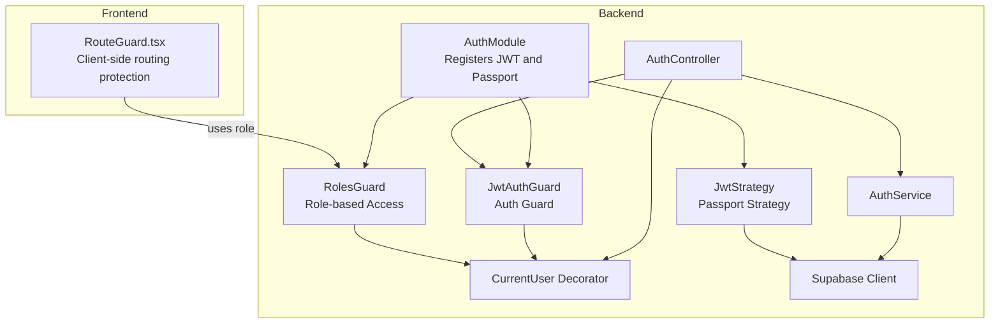
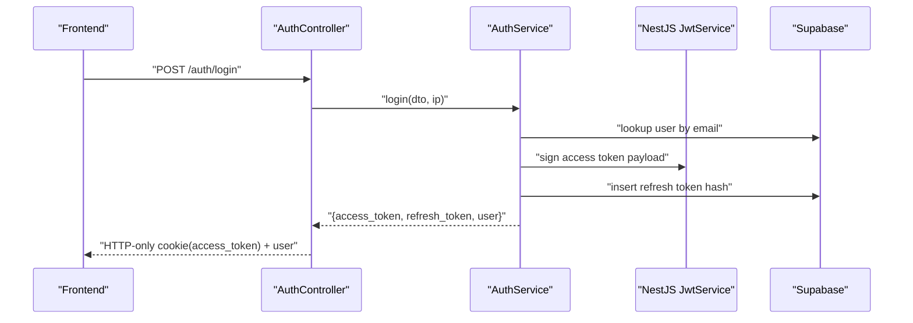
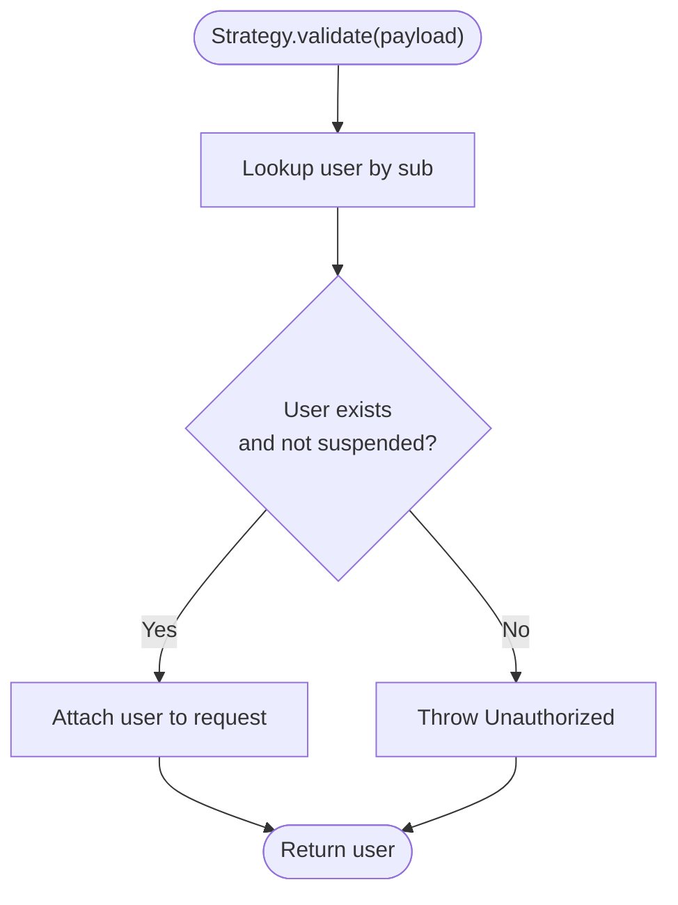
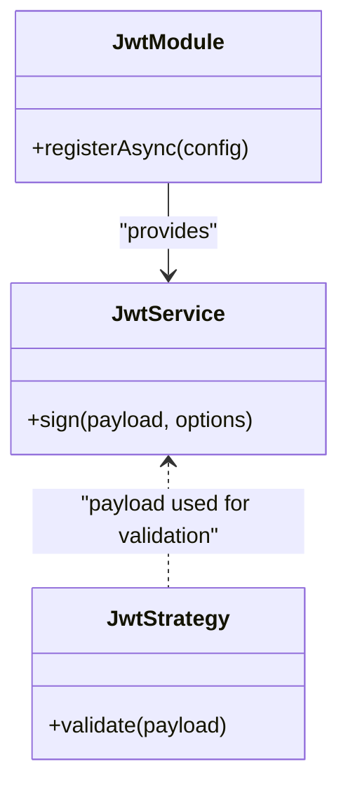
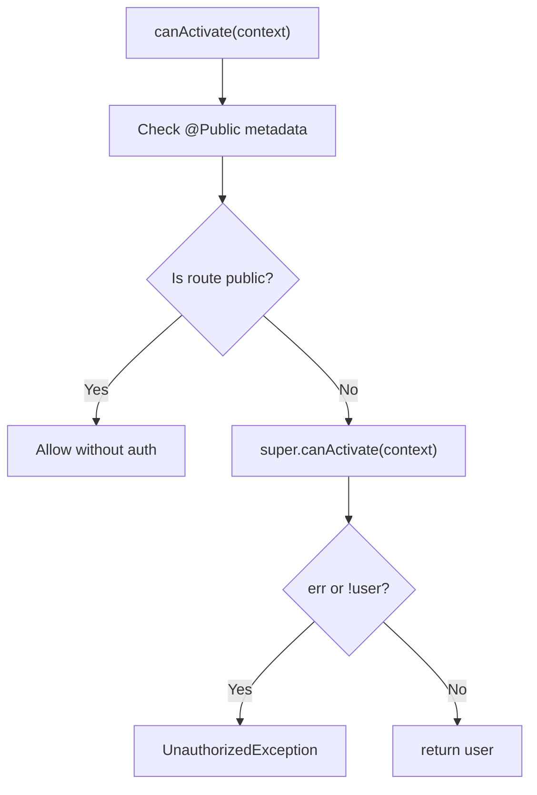
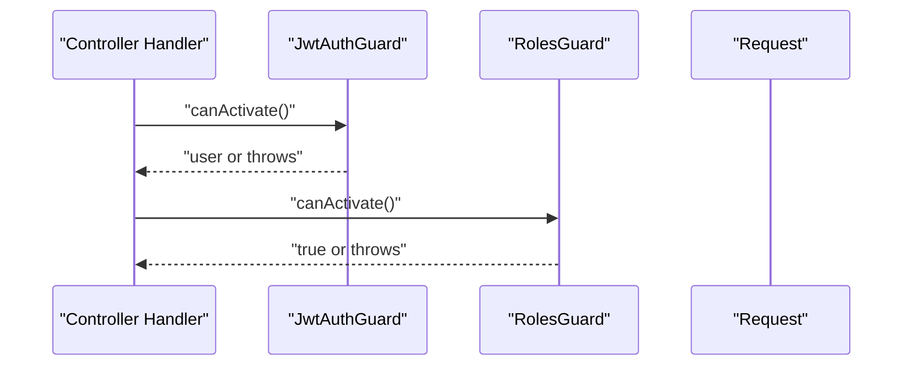
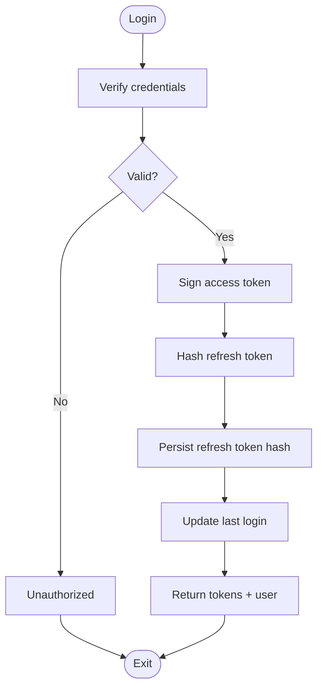
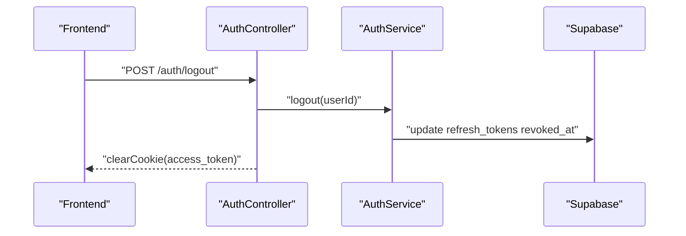
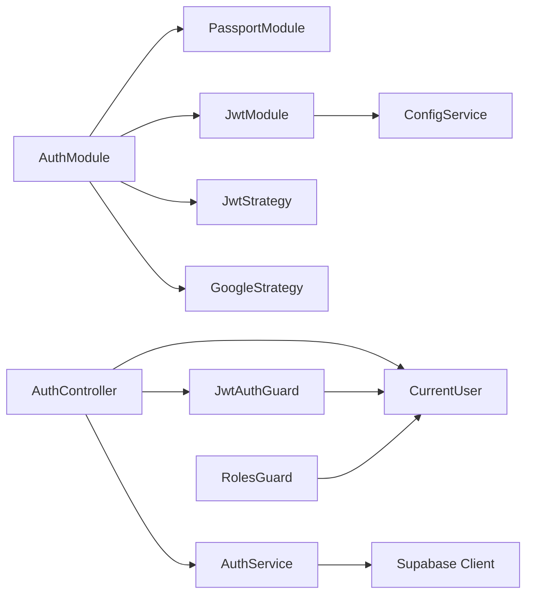

# JWT Token Management

<cite>
**Referenced Files in This Document**
- [jwt.strategy.ts](file://backend/src/modules/auth/strategies/jwt.strategy.ts)
- [jwt-auth.guard.ts](file://backend/src/common/guards/jwt-auth.guard.ts)
- [current-user.decorator.ts](file://backend/src/common/decorators/current-user.decorator.ts)
- [auth.service.ts](file://backend/src/modules/auth/auth.service.ts)
- [auth.controller.ts](file://backend/src/modules/auth/auth.controller.ts)
- [auth.module.ts](file://backend/src/modules/auth/auth.module.ts)
- [public.decorator.ts](file://backend/src/common/decorators/public.decorator.ts)
- [roles.guard.ts](file://backend/src/common/guards/roles.guard.ts)
- [roles.decorator.ts](file://backend/src/common/decorators/roles.decorator.ts)
- [supabase.config.ts](file://backend/src/config/supabase.config.ts)
- [RouteGuard.tsx](file://frontend/app/components/RouteGuard.tsx)
</cite>

## Table of Contents
1. [Introduction](#introduction)
2. [Project Structure](#project-structure)
3. [Core Components](#core-components)
4. [Architecture Overview](#architecture-overview)
5. [Detailed Component Analysis](#detailed-component-analysis)
6. [Dependency Analysis](#dependency-analysis)
7. [Performance Considerations](#performance-considerations)
8. [Troubleshooting Guide](#troubleshooting-guide)
9. [Conclusion](#conclusion)
10. [Appendices](#appendices)

## Introduction
This document explains JWT token management in the MissLost authentication system. It covers the JWT strategy implementation, token signing and verification, payload structure, authentication guard functionality, protected route access control, and token lifecycle management. It also documents how the backend integrates with NestJS guards, how current user extraction works via decorators, and outlines security considerations for token storage and transmission. Finally, it describes token expiration handling, refresh token implementation, and best practices for secure token management on both frontend and backend.

## Project Structure
The JWT-related logic spans the authentication module, guards, decorators, and controller. The backend uses NestJS Passport and NestJS JWT modules, with Supabase for persistence. On the frontend, route protection is enforced client-side using a route guard and a user role hook.

**Diagram sources**
- [auth.module.ts:11-34](file://backend/src/modules/auth/auth.module.ts#L11-L34)
- [jwt.strategy.ts:16-39](file://backend/src/modules/auth/strategies/jwt.strategy.ts#L16-L39)
- [jwt-auth.guard.ts:7-28](file://backend/src/common/guards/jwt-auth.guard.ts#L7-L28)
- [roles.guard.ts:6-27](file://backend/src/common/guards/roles.guard.ts#L6-L27)
- [current-user.decorator.ts:3-8](file://backend/src/common/decorators/current-user.decorator.ts#L3-L8)
- [auth.controller.ts:28-129](file://backend/src/modules/auth/auth.controller.ts#L28-L129)
- [auth.service.ts:17-273](file://backend/src/modules/auth/auth.service.ts#L17-L273)
- [supabase.config.ts:7-23](file://backend/src/config/supabase.config.ts#L7-L23)
- [RouteGuard.tsx:9-57](file://frontend/app/components/RouteGuard.tsx#L9-L57)

**Section sources**
- [auth.module.ts:11-34](file://backend/src/modules/auth/auth.module.ts#L11-L34)
- [auth.controller.ts:28-129](file://backend/src/modules/auth/auth.controller.ts#L28-L129)
- [auth.service.ts:17-273](file://backend/src/modules/auth/auth.service.ts#L17-L273)
- [jwt.strategy.ts:16-39](file://backend/src/modules/auth/strategies/jwt.strategy.ts#L16-L39)
- [jwt-auth.guard.ts:7-28](file://backend/src/common/guards/jwt-auth.guard.ts#L7-L28)
- [roles.guard.ts:6-27](file://backend/src/common/guards/roles.guard.ts#L6-L27)
- [current-user.decorator.ts:3-8](file://backend/src/common/decorators/current-user.decorator.ts#L3-L8)
- [supabase.config.ts:7-23](file://backend/src/config/supabase.config.ts#L7-L23)
- [RouteGuard.tsx:9-57](file://frontend/app/components/RouteGuard.tsx#L9-L57)

## Core Components
- JWT Payload: The payload carries user identity and role information, including subject identifier, email, role, and standard claims.
- JWT Strategy: Validates tokens extracted from Authorization headers, checks user existence and status, and attaches the user object to the request.
- Authentication Guard: Enforces JWT authentication globally and allows bypass for public routes.
- Role Guard: Enforces role-based access control using metadata.
- Current User Decorator: Extracts the authenticated user from the request for controller methods.
- Auth Service: Signs access tokens, generates refresh tokens, persists refresh tokens, and handles logout.
- Auth Controller: Exposes login, logout, and related endpoints; sets HTTP-only cookies for tokens; integrates guards and decorators.
- Supabase Integration: Provides database client for user lookup, refresh token storage, and auxiliary auth tokens.

**Section sources**
- [jwt.strategy.ts:8-14](file://backend/src/modules/auth/strategies/jwt.strategy.ts#L8-L14)
- [jwt.strategy.ts:26-38](file://backend/src/modules/auth/strategies/jwt.strategy.ts#L26-L38)
- [jwt-auth.guard.ts:13-27](file://backend/src/common/guards/jwt-auth.guard.ts#L13-L27)
- [roles.guard.ts:10-26](file://backend/src/common/guards/roles.guard.ts#L10-L26)
- [current-user.decorator.ts:3-8](file://backend/src/common/decorators/current-user.decorator.ts#L3-L8)
- [auth.service.ts:93-109](file://backend/src/modules/auth/auth.service.ts#L93-L109)
- [auth.controller.ts:46-61](file://backend/src/modules/auth/auth.controller.ts#L46-L61)
- [auth.module.ts:14-28](file://backend/src/modules/auth/auth.module.ts#L14-L28)
- [supabase.config.ts:7-23](file://backend/src/config/supabase.config.ts#L7-L23)

## Architecture Overview
The system uses a dual-token model: short-lived access tokens signed by the backend and long-lived refresh tokens stored hashed in the database. Access tokens are validated by a Passport strategy and attached to requests. Guards enforce authentication and roles. Frontend route protection uses client-side logic that relies on user role state.

**Diagram sources**
- [auth.controller.ts:42-44](file://backend/src/modules/auth/auth.controller.ts#L42-L44)
- [auth.service.ts:72-110](file://backend/src/modules/auth/auth.service.ts#L72-L110)
- [auth.module.ts:14-28](file://backend/src/modules/auth/auth.module.ts#L14-L28)
- [supabase.config.ts:7-23](file://backend/src/config/supabase.config.ts#L7-L23)

## Detailed Component Analysis

### JWT Strategy Implementation
- Token Extraction: Uses the Authorization header bearer scheme.
- Validation: Ensures tokens are not expired; verifies signature using the configured secret.
- User Verification: Queries the database for the user identified by the token’s subject claim, rejects suspended accounts, and attaches the user object to the request.

**Diagram sources**
- [jwt.strategy.ts:26-38](file://backend/src/modules/auth/strategies/jwt.strategy.ts#L26-L38)
- [supabase.config.ts:7-23](file://backend/src/config/supabase.config.ts#L7-L23)

**Section sources**
- [jwt.strategy.ts:16-39](file://backend/src/modules/auth/strategies/jwt.strategy.ts#L16-L39)
- [jwt.strategy.ts:26-38](file://backend/src/modules/auth/strategies/jwt.strategy.ts#L26-L38)

### Token Signing and Verification
- Signing: Access tokens are signed by the backend using the NestJS JWT service with a configured secret and expiration.
- Verification: Passport strategy validates the token and ensures it is not expired.
- Secret Management: The JWT module reads the secret from configuration and enforces its presence.

**Diagram sources**
- [auth.module.ts:14-28](file://backend/src/modules/auth/auth.module.ts#L14-L28)
- [auth.service.ts:93-94](file://backend/src/modules/auth/auth.service.ts#L93-L94)
- [jwt.strategy.ts:26-38](file://backend/src/modules/auth/strategies/jwt.strategy.ts#L26-L38)

**Section sources**
- [auth.module.ts:14-28](file://backend/src/modules/auth/auth.module.ts#L14-L28)
- [auth.service.ts:93-94](file://backend/src/modules/auth/auth.service.ts#L93-L94)

### Payload Structure
- Identity Claims: Subject (user identifier), email, role.
- Standard Claims: Optional issued-at and expiration claims managed by the JWT service.
- Strategy Behavior: Validates identity and account status, returning the user object for downstream use.

**Section sources**
- [jwt.strategy.ts:8-14](file://backend/src/modules/auth/strategies/jwt.strategy.ts#L8-L14)
- [auth.module.ts:24](file://backend/src/modules/auth/auth.module.ts#L24)

### JWT Authentication Guard
- Purpose: Extends the base AuthGuard('jwt') to integrate with Passport and apply global authentication enforcement.
- Public Routes: Uses reflection to detect routes marked as public and bypasses authentication for them.
- Error Handling: Converts guard failures into unauthorized exceptions.

**Diagram sources**
- [jwt-auth.guard.ts:13-27](file://backend/src/common/guards/jwt-auth.guard.ts#L13-L27)
- [public.decorator.ts:3-4](file://backend/src/common/decorators/public.decorator.ts#L3-L4)

**Section sources**
- [jwt-auth.guard.ts:7-28](file://backend/src/common/guards/jwt-auth.guard.ts#L7-L28)
- [public.decorator.ts:3-4](file://backend/src/common/decorators/public.decorator.ts#L3-L4)

### Protected Route Access Control and Role Guard
- Role Metadata: Controllers or handlers can declare required roles using a decorator.
- Role Guard: Enforces that the authenticated user possesses at least one of the required roles.
- Combined Guards: Authentication guard runs first; if successful, role guard checks roles.

**Diagram sources**
- [roles.guard.ts:10-26](file://backend/src/common/guards/roles.guard.ts#L10-L26)
- [roles.decorator.ts:3-4](file://backend/src/common/decorators/roles.decorator.ts#L3-L4)
- [jwt-auth.guard.ts:13-27](file://backend/src/common/guards/jwt-auth.guard.ts#L13-L27)

**Section sources**
- [roles.guard.ts:6-27](file://backend/src/common/guards/roles.guard.ts#L6-L27)
- [roles.decorator.ts:3-4](file://backend/src/common/decorators/roles.decorator.ts#L3-L4)

### Current User Extraction Using Decorators
- Decorator: Creates a parameter decorator that extracts the user object attached to the request by the strategy.
- Usage: Controllers can accept the current user as a method parameter, simplifying access to identity and role.

**Section sources**
- [current-user.decorator.ts:3-8](file://backend/src/common/decorators/current-user.decorator.ts#L3-L8)
- [auth.controller.ts:51](file://backend/src/modules/auth/auth.controller.ts#L51)

### Token Lifecycle Management
- Login:
  - Authenticate credentials against the database.
  - Build payload with identity and role.
  - Sign access token with the JWT service.
  - Generate a refresh token value, hash it, and store it with an expiration date.
  - Persist last login timestamp.
  - Return access token, refresh token, and sanitized user data.
- Logout:
  - Mark all unrevoked refresh tokens for the user as revoked.
  - Clear the HTTP-only access token cookie on the client.
- Google Login:
  - Upsert user record, update last login, sign access token, and persist refresh token similarly.

**Diagram sources**
- [auth.service.ts:72-110](file://backend/src/modules/auth/auth.service.ts#L72-L110)
- [auth.service.ts:113-167](file://backend/src/modules/auth/auth.service.ts#L113-L167)
- [auth.controller.ts:51-61](file://backend/src/modules/auth/auth.controller.ts#L51-L61)

**Section sources**
- [auth.service.ts:72-110](file://backend/src/modules/auth/auth.service.ts#L72-L110)
- [auth.service.ts:113-167](file://backend/src/modules/auth/auth.service.ts#L113-L167)
- [auth.controller.ts:42-44](file://backend/src/modules/auth/auth.controller.ts#L42-L44)
- [auth.controller.ts:51-61](file://backend/src/modules/auth/auth.controller.ts#L51-L61)

### Token Expiration Handling and Refresh Tokens
- Access Token Expiration: Managed by the JWT module’s sign options; the backend signs tokens with an expiration window.
- Refresh Token Storage: The backend stores a hashed refresh token in the database with an expiration date.
- Logout Revocation: On logout, the backend marks refresh tokens as revoked for the user.
- Frontend Cookie Policy: The backend sets an HTTP-only cookie for the access token with security attributes and a max age aligned with token expiry.

**Diagram sources**
- [auth.controller.ts:51-61](file://backend/src/modules/auth/auth.controller.ts#L51-L61)
- [auth.service.ts:170-178](file://backend/src/modules/auth/auth.service.ts#L170-L178)

**Section sources**
- [auth.module.ts:24](file://backend/src/modules/auth/auth.module.ts#L24)
- [auth.controller.ts:51-61](file://backend/src/modules/auth/auth.controller.ts#L51-L61)
- [auth.service.ts:170-178](file://backend/src/modules/auth/auth.service.ts#L170-L178)

### Security Considerations for Token Storage and Transmission
- Access Token Delivery: The backend delivers the access token via an HTTP-only cookie to mitigate XSS risks.
- Cookie Attributes: The backend applies secure, same-site, and domain/path controls based on environment variables.
- Token Scope: Access tokens carry identity and role; refresh tokens are stored hashed server-side.
- Secret Management: The JWT secret is loaded from configuration and is required at runtime.

**Section sources**
- [auth.controller.ts:52-59](file://backend/src/modules/auth/auth.controller.ts#L52-L59)
- [auth.module.ts:19-21](file://backend/src/modules/auth/auth.module.ts#L19-L21)

### Frontend Integration and Route Protection
- Client-Side Guard: The route guard enforces navigation rules based on user role and whether the route is public.
- Role-Based Redirection: Admin users are restricted to admin routes; general users are blocked from admin areas and redirected appropriately.
- Auth Page Blocking: Logged-in users are prevented from accessing authentication pages.

**Section sources**
- [RouteGuard.tsx:9-57](file://frontend/app/components/RouteGuard.tsx#L9-L57)

## Dependency Analysis
The JWT subsystem depends on NestJS Passport and JWT modules, the Supabase client, and the application’s configuration. Guards depend on decorators for metadata, and the controller orchestrates endpoints while applying guards and decorators.

**Diagram sources**
- [auth.module.ts:11-34](file://backend/src/modules/auth/auth.module.ts#L11-L34)
- [jwt-auth.guard.ts:7-28](file://backend/src/common/guards/jwt-auth.guard.ts#L7-L28)
- [roles.guard.ts:6-27](file://backend/src/common/guards/roles.guard.ts#L6-L27)
- [current-user.decorator.ts:3-8](file://backend/src/common/decorators/current-user.decorator.ts#L3-L8)
- [auth.controller.ts:28-129](file://backend/src/modules/auth/auth.controller.ts#L28-L129)
- [auth.service.ts:17-273](file://backend/src/modules/auth/auth.service.ts#L17-L273)
- [supabase.config.ts:7-23](file://backend/src/config/supabase.config.ts#L7-L23)

**Section sources**
- [auth.module.ts:11-34](file://backend/src/modules/auth/auth.module.ts#L11-L34)
- [auth.controller.ts:28-129](file://backend/src/modules/auth/auth.controller.ts#L28-L129)
- [auth.service.ts:17-273](file://backend/src/modules/auth/auth.service.ts#L17-L273)

## Performance Considerations
- Token Validation Overhead: Each request performs a database lookup to confirm user existence and status; ensure indexing on user identifiers.
- Refresh Token Storage: Hashing refresh tokens adds CPU overhead; tune bcrypt cost appropriately.
- Cookie Size: Keep cookie payloads minimal; the backend already returns only access tokens via cookies.
- Caching Opportunities: Consider caching non-sensitive user metadata per session to reduce repeated lookups.

## Troubleshooting Guide
- Missing JWT Secret: The JWT module requires a secret; if missing, initialization fails early.
- Invalid or Expired Tokens: Strategy validation rejects invalid or expired tokens; ensure clients renew tokens before expiry.
- Suspended Accounts: Strategy rejects tokens for suspended users; investigate account status before granting access.
- Unauthorized Exceptions: Guards raise unauthorized exceptions on failure; verify guard application and metadata.
- Cookie Not Set: Confirm cookie attributes match environment variables and that the response clears previous cookies if needed.

**Section sources**
- [auth.module.ts:19-21](file://backend/src/modules/auth/auth.module.ts#L19-L21)
- [jwt.strategy.ts:34-35](file://backend/src/modules/auth/strategies/jwt.strategy.ts#L34-L35)
- [jwt-auth.guard.ts:22-27](file://backend/src/common/guards/jwt-auth.guard.ts#L22-L27)
- [auth.controller.ts:52-59](file://backend/src/modules/auth/auth.controller.ts#L52-L59)

## Conclusion
The MissLost authentication system implements a robust JWT-based authentication flow with clear separation of concerns: token signing and validation in the strategy and guards, user identity propagation via decorators, and strict access control through role guards. The backend manages refresh tokens securely by storing hashed values and revoking them on logout. Frontend route protection complements backend controls by enforcing navigation policies based on user roles. Together, these components provide a secure and maintainable foundation for token lifecycle management.

## Appendices

### Example Workflows

- Token Generation During Login
  - The login endpoint authenticates the user, constructs a payload, signs an access token, hashes and persists a refresh token, updates last login, and returns tokens and user data.
  - The controller sets an HTTP-only cookie for the access token and redirects the user to the frontend.

  **Section sources**
  - [auth.controller.ts:42-44](file://backend/src/modules/auth/auth.controller.ts#L42-L44)
  - [auth.service.ts:72-110](file://backend/src/modules/auth/auth.service.ts#L72-L110)

- Logout and Token Revocation
  - The logout endpoint clears the access token cookie and marks refresh tokens as revoked for the user.

  **Section sources**
  - [auth.controller.ts:51-61](file://backend/src/modules/auth/auth.controller.ts#L51-L61)
  - [auth.service.ts:170-178](file://backend/src/modules/auth/auth.service.ts#L170-L178)

- Current User Extraction Using Decorators
  - The current user decorator retrieves the user object attached by the strategy and exposes it to controllers.

  **Section sources**
  - [current-user.decorator.ts:3-8](file://backend/src/common/decorators/current-user.decorator.ts#L3-L8)
  - [auth.controller.ts:51](file://backend/src/modules/auth/auth.controller.ts#L51)

- Frontend Route Protection
  - The route guard enforces role-based navigation rules and prevents access to restricted areas.

  **Section sources**
  - [RouteGuard.tsx:9-57](file://frontend/app/components/RouteGuard.tsx#L9-L57)