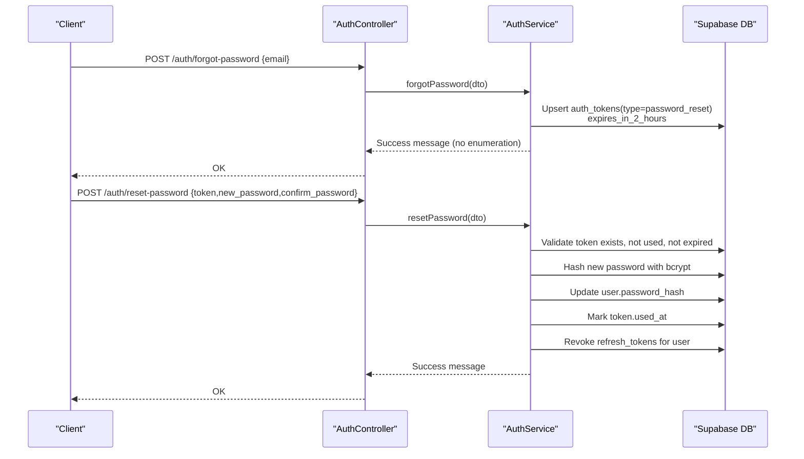
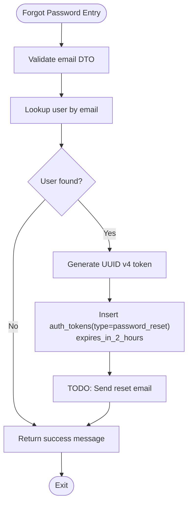
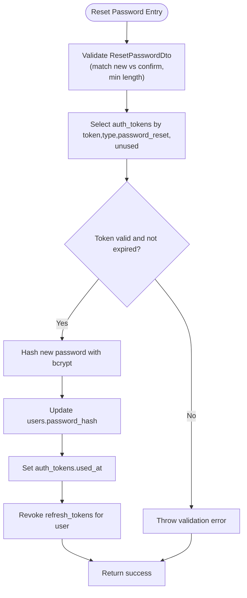
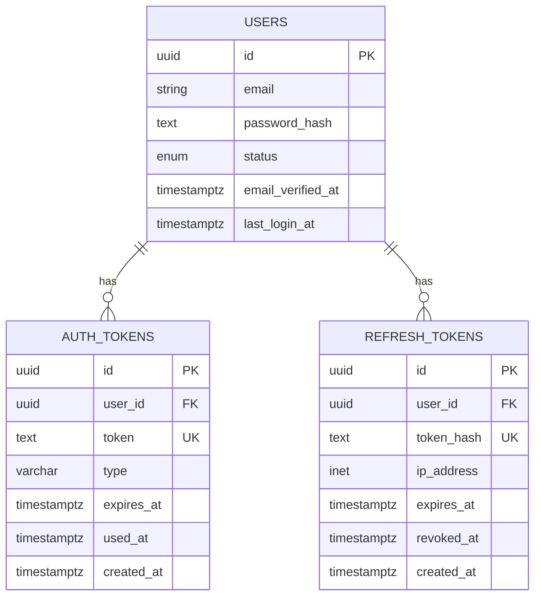
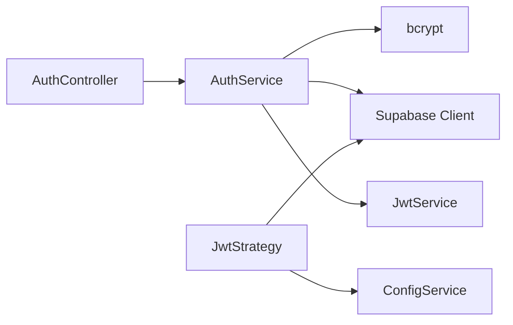

# Password Reset and Security

<cite>
**Referenced Files in This Document**
- [auth.controller.ts](file://backend/src/modules/auth/auth.controller.ts)
- [auth.service.ts](file://backend/src/modules/auth/auth.service.ts)
- [forgot-password.dto.ts](file://backend/src/modules/auth/dto/forgot-password.dto.ts)
- [reset-password.dto.ts](file://backend/src/modules/auth/dto/reset-password.dto.ts)
- [jwt.strategy.ts](file://backend/src/modules/auth/strategies/jwt.strategy.ts)
- [supabase.config.ts](file://backend/src/config/supabase.config.ts)
- [triggers_migration.sql](file://backend/sql/triggers_migration.sql)
- [triggers_permissions.sql](file://backend/sql/triggers_permissions.sql)
- [update_trigger_points.sql](file://backend/sql/update_trigger_points.sql)
- [OVERVIEW.md](file://OVERVIEW.md)
- [SECURITY_FIXES.md](file://SECURITY_FIXES.md)
</cite>

## Table of Contents
1. [Introduction](#introduction)
2. [Project Structure](#project-structure)
3. [Core Components](#core-components)
4. [Architecture Overview](#architecture-overview)
5. [Detailed Component Analysis](#detailed-component-analysis)
6. [Dependency Analysis](#dependency-analysis)
7. [Performance Considerations](#performance-considerations)
8. [Troubleshooting Guide](#troubleshooting-guide)
9. [Conclusion](#conclusion)
10. [Appendices](#appendices)

## Introduction
This document explains the password reset functionality and associated security measures in the MissLost authentication system. It covers the forgot password workflow (token generation and email verification), the reset password process (token validation and secure password updates), and robust protections against email enumeration, timing attacks, token replay, and unauthorized access. It also documents refresh token revocation on password reset, token expiration policies, and best practices for secure password management and user communication.

## Project Structure
The authentication system is implemented as a NestJS module with dedicated controller, service, DTOs, and JWT strategy. Supabase is used as the backend datastore, with database schema definitions provided via SQL scripts. Environment-driven configuration controls cookie and JWT security settings.

```mermaid
graph TB
subgraph "Backend"
AC["AuthController<br/>POST /auth/forgot-password<br/>POST /auth/reset-password"]
AS["AuthService<br/>forgotPassword()<br/>resetPassword()"]
DTO_FP["ForgotPasswordDto"]
DTO_RP["ResetPasswordDto"]
STRAT["JwtStrategy<br/>validate()"]
CFG["Supabase Config<br/>getSupabaseClient()"]
DB["Supabase DB<br/>users<br/>auth_tokens<br/>refresh_tokens"]
end
AC --> AS
AS --> DTO_FP
AS --> DTO_RP
AS --> STRAT
AS --> CFG
AS --> DB
```

**Diagram sources**
- [auth.controller.ts:70-84](file://backend/src/modules/auth/auth.controller.ts#L70-L84)
- [auth.service.ts:216-278](file://backend/src/modules/auth/auth.service.ts#L216-L278)
- [forgot-password.dto.ts:1-9](file://backend/src/modules/auth/dto/forgot-password.dto.ts#L1-L9)
- [reset-password.dto.ts:1-18](file://backend/src/modules/auth/dto/reset-password.dto.ts#L1-L18)
- [jwt.strategy.ts:26-38](file://backend/src/modules/auth/strategies/jwt.strategy.ts#L26-L38)
- [supabase.config.ts:7-23](file://backend/src/config/supabase.config.ts#L7-L23)

**Section sources**
- [auth.controller.ts:26-84](file://backend/src/modules/auth/auth.controller.ts#L26-L84)
- [auth.service.ts:17-280](file://backend/src/modules/auth/auth.service.ts#L17-L280)
- [supabase.config.ts:1-25](file://backend/src/config/supabase.config.ts#L1-L25)

## Core Components
- AuthController: Exposes endpoints for forgot password and reset password, delegating to AuthService.
- AuthService: Implements business logic for token creation, validation, password hashing, and refresh token revocation.
- DTOs: Validate incoming requests for forgot and reset operations.
- JwtStrategy: Validates JWTs and enforces account status checks.
- Supabase Config: Centralized client initialization with environment safeguards.

Key responsibilities:
- Token lifecycle management for password reset and email verification.
- Secure password hashing with bcrypt.
- Prevention of email enumeration and token replay.
- Revocation of refresh tokens upon password reset.

**Section sources**
- [auth.controller.ts:70-84](file://backend/src/modules/auth/auth.controller.ts#L70-L84)
- [auth.service.ts:216-278](file://backend/src/modules/auth/auth.service.ts#L216-L278)
- [forgot-password.dto.ts:1-9](file://backend/src/modules/auth/dto/forgot-password.dto.ts#L1-L9)
- [reset-password.dto.ts:1-18](file://backend/src/modules/auth/dto/reset-password.dto.ts#L1-L18)
- [jwt.strategy.ts:26-38](file://backend/src/modules/auth/strategies/jwt.strategy.ts#L26-L38)

## Architecture Overview
The password reset flow integrates HTTP endpoints, service-layer validation, token persistence, and secure password updates. Supabase stores users, auth tokens, and refresh tokens. JWT strategy ensures validated sessions.

**Diagram sources**
- [auth.controller.ts:70-84](file://backend/src/modules/auth/auth.controller.ts#L70-L84)
- [auth.service.ts:216-278](file://backend/src/modules/auth/auth.service.ts#L216-L278)
- [supabase.config.ts:7-23](file://backend/src/config/supabase.config.ts#L7-L23)

## Detailed Component Analysis

### Forgot Password Workflow
- Input validation: Email address must be present and valid.
- User lookup: Query users by email; if not found, still return a success message to avoid email enumeration.
- Token generation: Create a UUID v4 token and insert into auth_tokens with type password_reset and 2-hour expiry.
- Notification: Placeholder for sending a password reset email with the token.
- Response: Generic success message regardless of whether the email existed.

Security considerations:
- No user enumeration: Always returns the same message.
- Short-lived token: 2 hours reduces risk window.
- Unique token per reset request.

**Diagram sources**
- [auth.service.ts:216-240](file://backend/src/modules/auth/auth.service.ts#L216-L240)
- [forgot-password.dto.ts:1-9](file://backend/src/modules/auth/dto/forgot-password.dto.ts#L1-L9)

**Section sources**
- [auth.controller.ts:70-76](file://backend/src/modules/auth/auth.controller.ts#L70-L76)
- [auth.service.ts:216-240](file://backend/src/modules/auth/auth.service.ts#L216-L240)
- [forgot-password.dto.ts:1-9](file://backend/src/modules/auth/dto/forgot-password.dto.ts#L1-L9)

### Reset Password Workflow
- Input validation: New password and confirmation must match and meet minimum length.
- Token validation: Select token by token string, type password_reset, unused, and not expired.
- Password hashing: Hash new password with bcrypt at a cost factor suitable for server environments.
- Update user: Replace password_hash for the token’s user.
- Token marking: Record token.used_at to prevent reuse.
- Refresh token revocation: Set revoked_at for all unrevoked refresh tokens for the user.
- Response: Success message indicating reset completion.

Security considerations:
- Token replay protection: used_at prevents reuse.
- Expiration enforcement: Expired tokens are rejected.
- Strong password hashing: bcrypt with appropriate cost.
- Immediate session termination: Revoking refresh tokens invalidates all sessions for the user.

**Diagram sources**
- [auth.service.ts:242-278](file://backend/src/modules/auth/auth.service.ts#L242-L278)
- [reset-password.dto.ts:1-18](file://backend/src/modules/auth/dto/reset-password.dto.ts#L1-L18)

**Section sources**
- [auth.controller.ts:78-84](file://backend/src/modules/auth/auth.controller.ts#L78-L84)
- [auth.service.ts:242-278](file://backend/src/modules/auth/auth.service.ts#L242-L278)
- [reset-password.dto.ts:1-18](file://backend/src/modules/auth/dto/reset-password.dto.ts#L1-L18)

### Token Lifecycle and Storage
- Token types: email_verify and password_reset.
- Expiry policy:
  - email_verify: 24 hours.
  - password_reset: 2 hours.
- Storage: auth_tokens table with unique token, foreign key to users, type, expires_at, used_at.
- Indexes: token and user_id for fast lookup and cascading deletes.

**Diagram sources**
- [OVERVIEW.md:106-133](file://OVERVIEW.md#L106-L133)
- [triggers_migration.sql:31-46](file://backend/sql/triggers_migration.sql#L31-L46)

**Section sources**
- [auth.service.ts:54-61](file://backend/src/modules/auth/auth.service.ts#L54-L61)
- [auth.service.ts:229-235](file://backend/src/modules/auth/auth.service.ts#L229-L235)
- [auth.service.ts:250-275](file://backend/src/modules/auth/auth.service.ts#L250-L275)
- [OVERVIEW.md:106-133](file://OVERVIEW.md#L106-L133)

### Password Hashing with bcrypt
- Registration and reset password both use bcrypt to hash passwords.
- Cost factors: bcrypt cost used during registration and reset is applied consistently.
- Timing attack resistance: bcrypt is designed to be slow and constant-time for verification, mitigating timing attacks.

Best practices:
- Use bcrypt with a sufficiently high cost factor on the server.
- Never store plaintext or reversible hashes.
- Enforce strong password policies at the API boundary.

**Section sources**
- [auth.service.ts:37](file://backend/src/modules/auth/auth.service.ts#L37)
- [auth.service.ts:263](file://backend/src/modules/auth/auth.service.ts#L263)

### Security Measures Against Common Threats
- Email enumeration:
  - Forgot password endpoint returns the same message whether the email exists or not.
- Token replay:
  - Tokens carry used_at; once used, they are marked and cannot be reused.
- Token expiration:
  - Both email_verify and password_reset tokens include expires_at; validation rejects expired tokens.
- Unauthorized access:
  - JWT strategy validates payload and checks user status; suspended accounts are rejected.
- Session termination:
  - On password reset, all refresh tokens for the user are revoked, invalidating existing sessions.

Additional cookie and JWT hardening:
- HTTP-only, secure, and SameSite cookies for tokens.
- Proper cookie clearing on logout.
- JWT secret enforced at startup; no fallback to insecure defaults.

**Section sources**
- [auth.service.ts:226-227](file://backend/src/modules/auth/auth.service.ts#L226-L227)
- [auth.service.ts:258-261](file://backend/src/modules/auth/auth.service.ts#L258-L261)
- [auth.service.ts:271-275](file://backend/src/modules/auth/auth.service.ts#L271-L275)
- [jwt.strategy.ts:26-38](file://backend/src/modules/auth/strategies/jwt.strategy.ts#L26-L38)
- [SECURITY_FIXES.md:128-188](file://SECURITY_FIXES.md#L128-L188)

### Auth Token Management Examples
- Generating a password reset token:
  - Call forgot password with a valid email; the service inserts a password_reset token with 2-hour expiry.
- Using the reset token:
  - Submit reset password with the token and new password; the service validates, hashes, updates the user, marks the token used, and revokes refresh tokens.
- Token lifecycle:
  - Created: Insert into auth_tokens with type and expiry.
  - Validated: Select by token, type, unused, not expired.
  - Consumed: Mark used_at after successful reset.
  - Revoked: On password reset, refresh tokens are revoked.

Note: The actual email delivery is currently a placeholder and must be implemented to complete the workflow.

**Section sources**
- [auth.controller.ts:70-84](file://backend/src/modules/auth/auth.controller.ts#L70-L84)
- [auth.service.ts:216-278](file://backend/src/modules/auth/auth.service.ts#L216-L278)

## Dependency Analysis
- AuthController depends on AuthService for business logic.
- AuthService depends on Supabase client for database operations and bcrypt for password hashing.
- JwtStrategy depends on ConfigService for JWT secret and Supabase for user validation.
- Database schema defines relationships among users, auth_tokens, and refresh_tokens.

**Diagram sources**
- [auth.controller.ts:16-29](file://backend/src/modules/auth/auth.controller.ts#L16-L29)
- [auth.service.ts:1-19](file://backend/src/modules/auth/auth.service.ts#L1-L19)
- [jwt.strategy.ts:16-24](file://backend/src/modules/auth/strategies/jwt.strategy.ts#L16-L24)
- [supabase.config.ts:7-23](file://backend/src/config/supabase.config.ts#L7-L23)

**Section sources**
- [auth.controller.ts:16-29](file://backend/src/modules/auth/auth.controller.ts#L16-L29)
- [auth.service.ts:1-19](file://backend/src/modules/auth/auth.service.ts#L1-L19)
- [jwt.strategy.ts:16-24](file://backend/src/modules/auth/strategies/jwt.strategy.ts#L16-L24)
- [supabase.config.ts:7-23](file://backend/src/config/supabase.config.ts#L7-L23)

## Performance Considerations
- Token lookup: auth_tokens token index supports O(log n) retrieval; ensure queries filter by type and used_at.
- Password hashing: bcrypt cost affects CPU usage; tune cost according to server capacity while maintaining acceptable latency.
- Database writes: Batch operations are not used for token creation; keep inserts minimal and indexed.
- Network overhead: Supabase client is initialized once and reused; avoid repeated client creation.

## Troubleshooting Guide
Common issues and resolutions:
- Reset token invalid or expired:
  - Cause: Token not found, wrong type, already used, or expired.
  - Resolution: Regenerate a new reset token; ensure client-side handles expired links gracefully.
- Password confirmation mismatch:
  - Cause: new_password does not equal confirm_password.
  - Resolution: Ensure client enforces matching passwords before submission.
- Account suspended or pending verification:
  - Cause: User status blocks login or requires email verification.
  - Resolution: Advise user to resolve account status before attempting reset.
- JWT secret misconfiguration:
  - Cause: Missing or invalid JWT_SECRET.
  - Resolution: Configure JWT_SECRET; startup will fail if missing to prevent insecure fallbacks.
- Cookie security:
  - Cause: Insecure cookie flags or missing credentials.
  - Resolution: Ensure cookies are httpOnly, secure, and SameSite; include credentials in API calls.

**Section sources**
- [auth.service.ts:244-246](file://backend/src/modules/auth/auth.service.ts#L244-L246)
- [auth.service.ts:258-261](file://backend/src/modules/auth/auth.service.ts#L258-L261)
- [jwt.strategy.ts:26-38](file://backend/src/modules/auth/strategies/jwt.strategy.ts#L26-L38)
- [SECURITY_FIXES.md:128-188](file://SECURITY_FIXES.md#L128-L188)

## Conclusion
The MissLost authentication system implements a secure password reset workflow with strong protections against enumeration, replay, and unauthorized access. Tokens are short-lived, validated rigorously, and marked as used after successful resets. Passwords are hashed securely with bcrypt, and refresh tokens are revoked immediately upon reset to terminate sessions. The design leverages Supabase for reliable persistence and NestJS for clean separation of concerns. Future enhancements should focus on implementing secure email delivery for reset tokens and adding rate limiting to mitigate abuse.

## Appendices

### Database Schema References
- auth_tokens: Stores tokens for email verification and password reset with expiry and usage tracking.
- refresh_tokens: Stores hashed refresh tokens with expiry and revocation support.
- users: Core user entity with status and timestamps.

**Section sources**
- [OVERVIEW.md:106-133](file://OVERVIEW.md#L106-L133)
- [triggers_migration.sql:31-46](file://backend/sql/triggers_migration.sql#L31-L46)