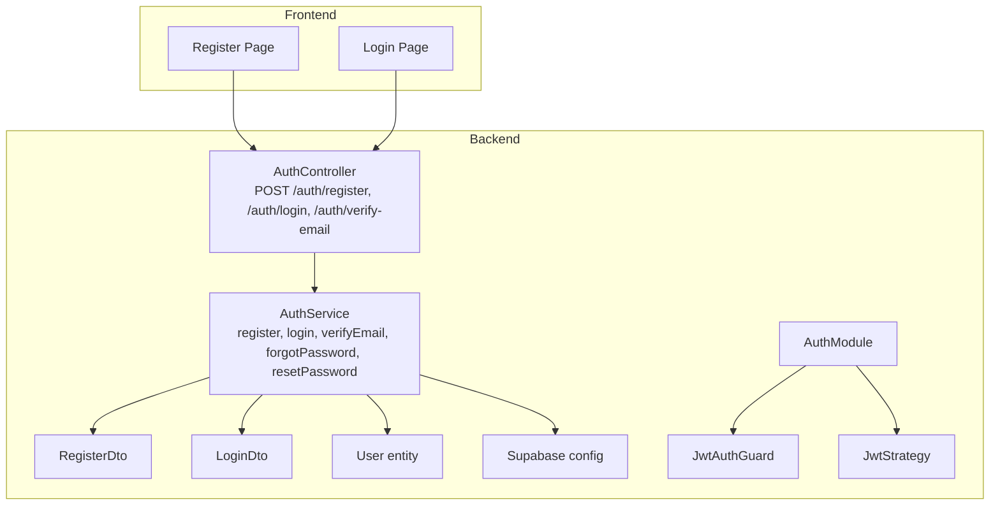
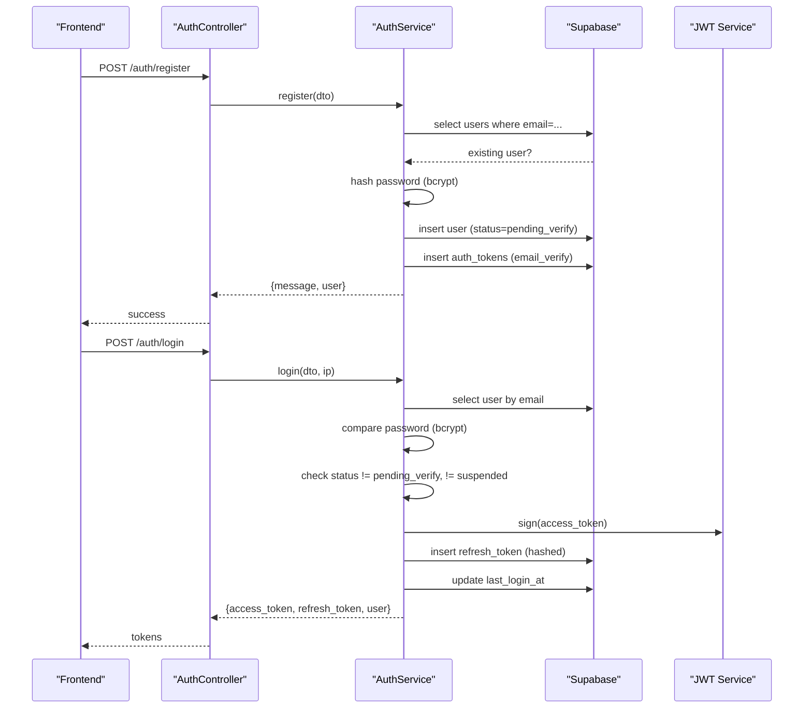
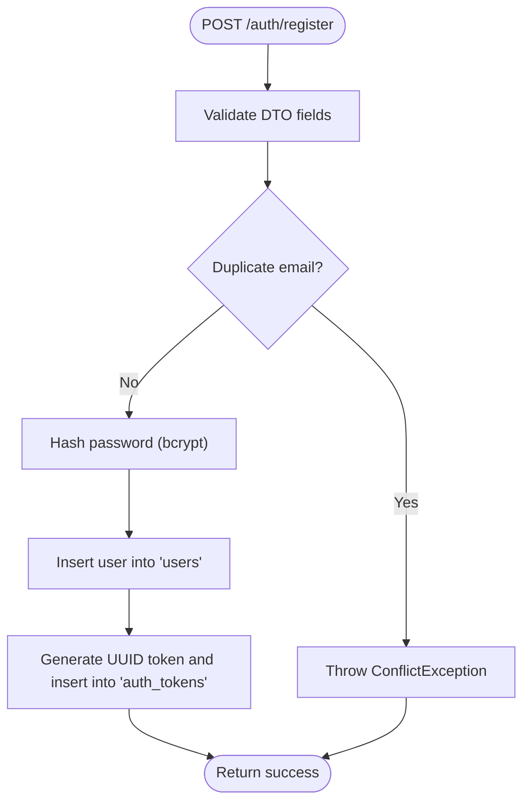
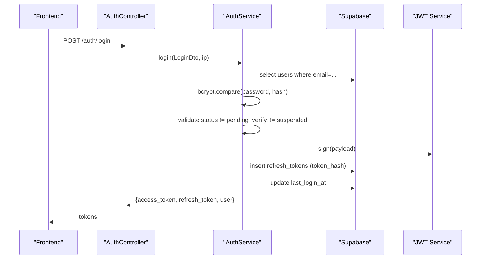
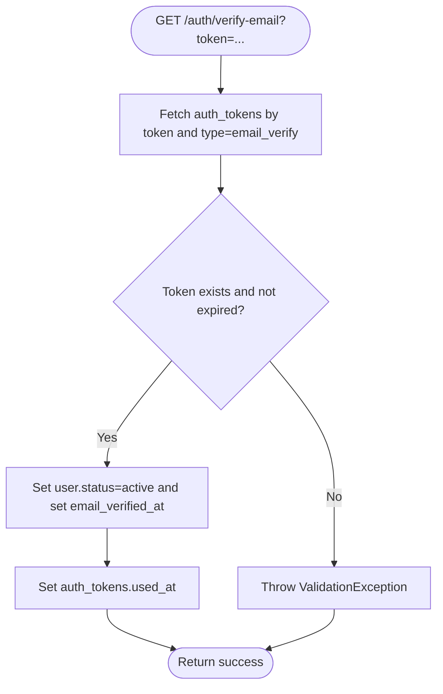
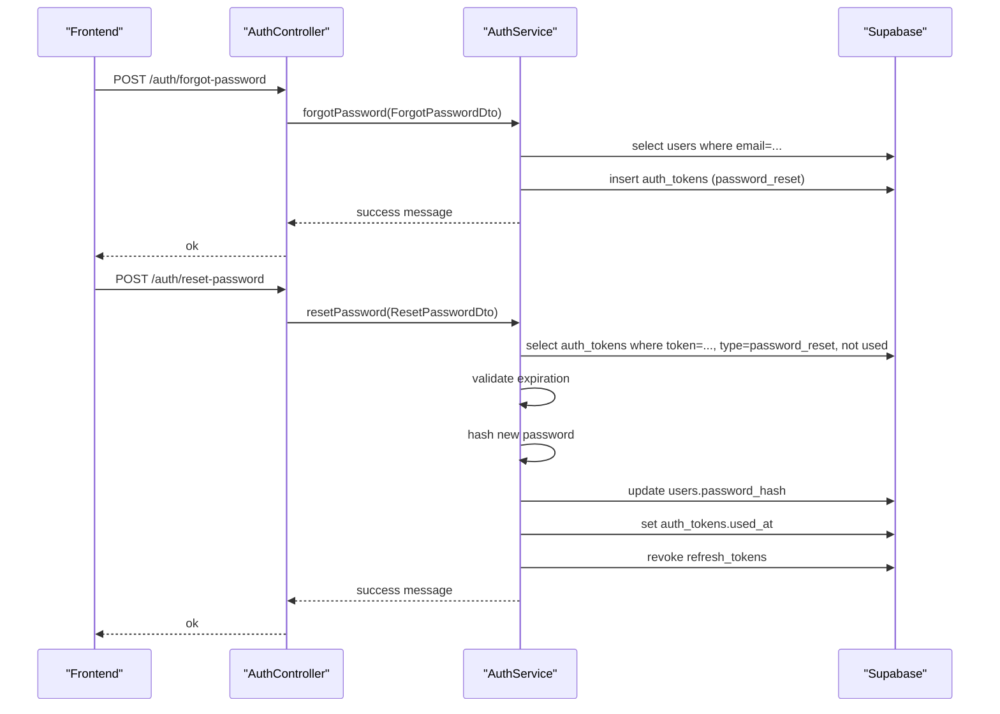
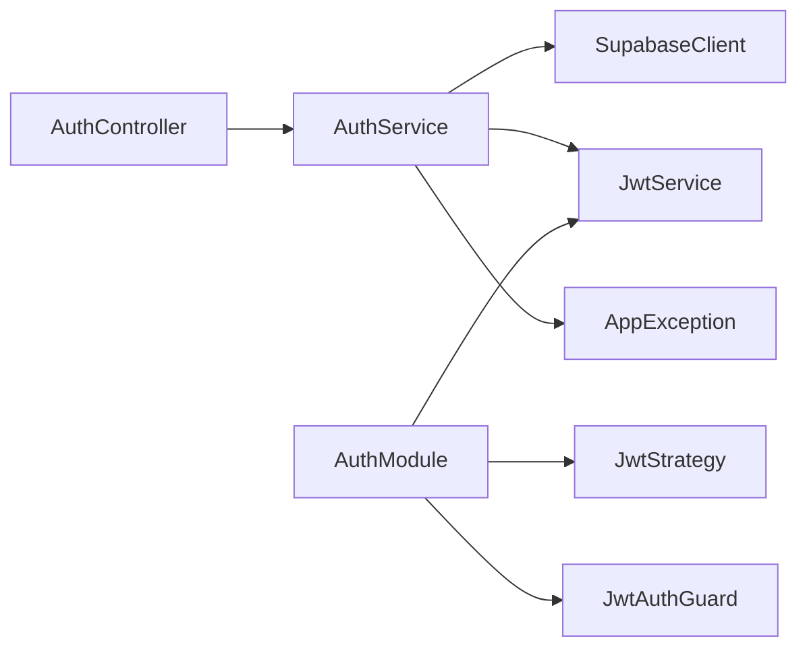

# User Registration and Login

<cite>
**Referenced Files in This Document**
- [auth.controller.ts](file://backend/src/modules/auth/auth.controller.ts)
- [auth.service.ts](file://backend/src/modules/auth/auth.service.ts)
- [register.dto.ts](file://backend/src/modules/auth/dto/register.dto.ts)
- [login.dto.ts](file://backend/src/modules/auth/dto/login.dto.ts)
- [user.entity.ts](file://backend/src/modules/auth/entities/user.entity.ts)
- [supabase.config.ts](file://backend/src/config/supabase.config.ts)
- [app.exception.ts](file://backend/src/common/exceptions/app.exception.ts)
- [jwt.strategy.ts](file://backend/src/modules/auth/strategies/jwt.strategy.ts)
- [jwt-auth.guard.ts](file://backend/src/common/guards/jwt-auth.guard.ts)
- [auth.module.ts](file://backend/src/modules/auth/auth.module.ts)
- [page.tsx (Register)](file://frontend/app/auth/register/page.tsx)
- [page.tsx (Login)](file://frontend/app/auth/login/page.tsx)
</cite>

## Table of Contents
1. [Introduction](#introduction)
2. [Project Structure](#project-structure)
3. [Core Components](#core-components)
4. [Architecture Overview](#architecture-overview)
5. [Detailed Component Analysis](#detailed-component-analysis)
6. [Dependency Analysis](#dependency-analysis)
7. [Performance Considerations](#performance-considerations)
8. [Troubleshooting Guide](#troubleshooting-guide)
9. [Conclusion](#conclusion)
10. [Appendices](#appendices)

## Introduction
This document explains the user registration and login functionality in the MissLost authentication system. It covers the end-to-end flows for registering a new user, validating inputs, hashing passwords, creating user records, generating email verification tokens, logging in, validating credentials, checking account status, issuing JWTs, and integrating with Supabase for persistence. It also includes practical examples from the codebase, error handling patterns, user entity structure, and best practices for secure user onboarding.

## Project Structure
The authentication system spans the backend NestJS modules and the frontend Next.js pages:
- Backend: Auth controller and service orchestrate registration, login, verification, and password reset. DTOs define validation schemas. Supabase client is configured centrally. Guards and strategies enforce JWT-based authentication.
- Frontend: Registration and login pages submit requests to the backend and manage local storage of tokens.

**Diagram sources**
- [auth.controller.ts:28-84](file://backend/src/modules/auth/auth.controller.ts#L28-L84)
- [auth.service.ts:22-110](file://backend/src/modules/auth/auth.service.ts#L22-L110)
- [register.dto.ts:4-29](file://backend/src/modules/auth/dto/register.dto.ts#L4-L29)
- [login.dto.ts:4-12](file://backend/src/modules/auth/dto/login.dto.ts#L4-L12)
- [user.entity.ts:1-19](file://backend/src/modules/auth/entities/user.entity.ts#L1-L19)
- [supabase.config.ts:7-23](file://backend/src/config/supabase.config.ts#L7-L23)
- [jwt-auth.guard.ts:8-28](file://backend/src/common/guards/jwt-auth.guard.ts#L8-L28)
- [jwt.strategy.ts:17-39](file://backend/src/modules/auth/strategies/jwt.strategy.ts#L17-L39)
- [auth.module.ts:11-34](file://backend/src/modules/auth/auth.module.ts#L11-L34)
- [page.tsx (Register):34-69](file://frontend/app/auth/register/page.tsx#L34-L69)
- [page.tsx (Login):16-51](file://frontend/app/auth/login/page.tsx#L16-L51)

**Section sources**
- [auth.controller.ts:28-84](file://backend/src/modules/auth/auth.controller.ts#L28-L84)
- [auth.service.ts:22-110](file://backend/src/modules/auth/auth.service.ts#L22-L110)
- [register.dto.ts:4-29](file://backend/src/modules/auth/dto/register.dto.ts#L4-L29)
- [login.dto.ts:4-12](file://backend/src/modules/auth/dto/login.dto.ts#L4-L12)
- [user.entity.ts:1-19](file://backend/src/modules/auth/entities/user.entity.ts#L1-L19)
- [supabase.config.ts:7-23](file://backend/src/config/supabase.config.ts#L7-L23)
- [jwt-auth.guard.ts:8-28](file://backend/src/common/guards/jwt-auth.guard.ts#L8-L28)
- [jwt.strategy.ts:17-39](file://backend/src/modules/auth/strategies/jwt.strategy.ts#L17-L39)
- [auth.module.ts:11-34](file://backend/src/modules/auth/auth.module.ts#L11-L34)
- [page.tsx (Register):34-69](file://frontend/app/auth/register/page.tsx#L34-L69)
- [page.tsx (Login):16-51](file://frontend/app/auth/login/page.tsx#L16-L51)

## Core Components
- AuthController: Exposes endpoints for registration, login, logout, email verification, forgot password, reset password, and Google OAuth.
- AuthService: Implements business logic for registration, login, token issuance, verification, and password reset using Supabase.
- DTOs: Define validation schemas for registration and login requests.
- User Entity: Describes persisted user fields and safe public representation.
- Supabase Client: Centralized client initialization for database operations.
- JWT Guard and Strategy: Enforce protected routes and validate JWT payloads against the database.
- AuthModule: Registers JWT module with secret and signing options.

**Section sources**
- [auth.controller.ts:28-84](file://backend/src/modules/auth/auth.controller.ts#L28-L84)
- [auth.service.ts:22-110](file://backend/src/modules/auth/auth.service.ts#L22-L110)
- [register.dto.ts:4-29](file://backend/src/modules/auth/dto/register.dto.ts#L4-L29)
- [login.dto.ts:4-12](file://backend/src/modules/auth/dto/login.dto.ts#L4-L12)
- [user.entity.ts:1-19](file://backend/src/modules/auth/entities/user.entity.ts#L1-L19)
- [supabase.config.ts:7-23](file://backend/src/config/supabase.config.ts#L7-L23)
- [jwt-auth.guard.ts:8-28](file://backend/src/common/guards/jwt-auth.guard.ts#L8-L28)
- [jwt.strategy.ts:17-39](file://backend/src/modules/auth/strategies/jwt.strategy.ts#L17-L39)
- [auth.module.ts:11-34](file://backend/src/modules/auth/auth.module.ts#L11-L34)

## Architecture Overview
The authentication flow integrates frontend pages with backend controllers and services, using Supabase for persistence and JWT for sessionless authentication.

**Diagram sources**
- [auth.controller.ts:31-44](file://backend/src/modules/auth/auth.controller.ts#L31-L44)
- [auth.service.ts:22-110](file://backend/src/modules/auth/auth.service.ts#L22-L110)
- [supabase.config.ts:7-23](file://backend/src/config/supabase.config.ts#L7-L23)

## Detailed Component Analysis

### Registration Workflow
- Input validation: Full name, email, password, confirm password, optional student ID.
- Duplicate email check via Supabase.
- Password hashing with bcrypt at a configurable cost.
- Insert user record with default role and status.
- Generate and store a UUID email verification token with expiration.
- Return success message and partial user data.

**Diagram sources**
- [auth.controller.ts:31-36](file://backend/src/modules/auth/auth.controller.ts#L31-L36)
- [auth.service.ts:22-69](file://backend/src/modules/auth/auth.service.ts#L22-L69)
- [register.dto.ts:4-29](file://backend/src/modules/auth/dto/register.dto.ts#L4-L29)

**Section sources**
- [auth.controller.ts:31-36](file://backend/src/modules/auth/auth.controller.ts#L31-L36)
- [auth.service.ts:22-69](file://backend/src/modules/auth/auth.service.ts#L22-L69)
- [register.dto.ts:4-29](file://backend/src/modules/auth/dto/register.dto.ts#L4-L29)
- [user.entity.ts:1-19](file://backend/src/modules/auth/entities/user.entity.ts#L1-L19)
- [supabase.config.ts:7-23](file://backend/src/config/supabase.config.ts#L7-L23)
- [app.exception.ts:35-39](file://backend/src/common/exceptions/app.exception.ts#L35-L39)

### Login Workflow
- Fetch user by email.
- Compare provided password with stored hash using bcrypt.
- Reject if account is pending verification or suspended.
- Sign JWT access token and issue a refresh token (hashed and stored).
- Update last login timestamp.
- Return tokens and sanitized user object.

**Diagram sources**
- [auth.controller.ts:38-44](file://backend/src/modules/auth/auth.controller.ts#L38-L44)
- [auth.service.ts:72-110](file://backend/src/modules/auth/auth.service.ts#L72-L110)

**Section sources**
- [auth.controller.ts:38-44](file://backend/src/modules/auth/auth.controller.ts#L38-L44)
- [auth.service.ts:72-110](file://backend/src/modules/auth/auth.service.ts#L72-L110)
- [jwt.strategy.ts:26-39](file://backend/src/modules/auth/strategies/jwt.strategy.ts#L26-L39)
- [jwt-auth.guard.ts:13-27](file://backend/src/common/guards/jwt-auth.guard.ts#L13-L27)
- [auth.module.ts:14-28](file://backend/src/modules/auth/auth.module.ts#L14-L28)

### Email Verification
- Endpoint accepts a token query parameter.
- Validates token existence, type, un-used status, and expiration.
- Updates user status to active and marks token as used.

**Diagram sources**
- [auth.controller.ts:63-68](file://backend/src/modules/auth/auth.controller.ts#L63-L68)
- [auth.service.ts:181-208](file://backend/src/modules/auth/auth.service.ts#L181-L208)

**Section sources**
- [auth.controller.ts:63-68](file://backend/src/modules/auth/auth.controller.ts#L63-L68)
- [auth.service.ts:181-208](file://backend/src/modules/auth/auth.service.ts#L181-L208)

### Password Reset (Forgot and Reset)
- Forgot password: Lookup user by email, generate token with expiration, insert into auth_tokens (type=password_reset). Always return success to avoid email enumeration.
- Reset password: Validate token, check expiration, hash new password, update user, mark token used, revoke refresh tokens.

**Diagram sources**
- [auth.controller.ts:70-84](file://backend/src/modules/auth/auth.controller.ts#L70-L84)
- [auth.service.ts:211-272](file://backend/src/modules/auth/auth.service.ts#L211-L272)

**Section sources**
- [auth.controller.ts:70-84](file://backend/src/modules/auth/auth.controller.ts#L70-L84)
- [auth.service.ts:211-272](file://backend/src/modules/auth/auth.service.ts#L211-L272)

### DTO Validation Schemas
- RegisterDto: Full name length limits, email validation, password minimum length, confirm password equality, optional student ID with numeric pattern.
- LoginDto: Email and password required.
- ForgotPasswordDto: Email required.
- ResetPasswordDto: Token required, new password minimum length, confirm password equality.

**Section sources**
- [register.dto.ts:4-29](file://backend/src/modules/auth/dto/register.dto.ts#L4-L29)
- [login.dto.ts:4-12](file://backend/src/modules/auth/dto/login.dto.ts#L4-L12)
- [forgot-password.dto.ts:4-8](file://backend/src/modules/auth/dto/forgot-password.dto.ts#L4-L8)
- [reset-password.dto.ts:4-17](file://backend/src/modules/auth/dto/reset-password.dto.ts#L4-L17)

### User Entity Structure
- Fields include identifiers, contact info, credentials, roles, statuses, timestamps, and points.
- Safe public representation excludes sensitive fields like password hash.

**Section sources**
- [user.entity.ts:1-19](file://backend/src/modules/auth/entities/user.entity.ts#L1-L19)

### Supabase Integration
- Centralized client creation with environment variables for URL and keys.
- Used for all user CRUD, token management, and refresh token operations.

**Section sources**
- [supabase.config.ts:7-23](file://backend/src/config/supabase.config.ts#L7-L23)
- [auth.service.ts:27-52](file://backend/src/modules/auth/auth.service.ts#L27-L52)
- [auth.service.ts:75-106](file://backend/src/modules/auth/auth.service.ts#L75-L106)
- [auth.service.ts:184-205](file://backend/src/modules/auth/auth.service.ts#L184-L205)
- [auth.service.ts:224-233](file://backend/src/modules/auth/auth.service.ts#L224-L233)
- [auth.service.ts:244-269](file://backend/src/modules/auth/auth.service.ts#L244-L269)

### Frontend Usage Examples
- Registration page posts to the register endpoint and handles success or error responses, optionally auto-redirecting after token retrieval.
- Login page posts to the login endpoint, stores tokens in local storage, and redirects based on user role.

**Section sources**
- [page.tsx (Register):34-69](file://frontend/app/auth/register/page.tsx#L34-L69)
- [page.tsx (Login):16-51](file://frontend/app/auth/login/page.tsx#L16-L51)

## Dependency Analysis
- AuthController depends on AuthService for business logic.
- AuthService depends on Supabase client, JWT service, and exception classes.
- AuthModule registers JWT with a required secret and signing options.
- JwtAuthGuard and JwtStrategy enforce protected routes and validate JWT payloads against the database.

**Diagram sources**
- [auth.controller.ts](file://backend/src/modules/auth/auth.controller.ts#L29)
- [auth.service.ts](file://backend/src/modules/auth/auth.service.ts#L19)
- [supabase.config.ts:7-23](file://backend/src/config/supabase.config.ts#L7-L23)
- [auth.module.ts:14-28](file://backend/src/modules/auth/auth.module.ts#L14-L28)
- [jwt.strategy.ts:17-24](file://backend/src/modules/auth/strategies/jwt.strategy.ts#L17-L24)
- [jwt-auth.guard.ts:8-11](file://backend/src/common/guards/jwt-auth.guard.ts#L8-L11)
- [app.exception.ts:3-11](file://backend/src/common/exceptions/app.exception.ts#L3-L11)

**Section sources**
- [auth.controller.ts](file://backend/src/modules/auth/auth.controller.ts#L29)
- [auth.service.ts](file://backend/src/modules/auth/auth.service.ts#L19)
- [auth.module.ts:14-28](file://backend/src/modules/auth/auth.module.ts#L14-L28)
- [jwt.strategy.ts:17-24](file://backend/src/modules/auth/strategies/jwt.strategy.ts#L17-L24)
- [jwt-auth.guard.ts:8-11](file://backend/src/common/guards/jwt-auth.guard.ts#L8-L11)
- [app.exception.ts:3-11](file://backend/src/common/exceptions/app.exception.ts#L3-L11)

## Performance Considerations
- Password hashing cost: bcrypt cost is set to a moderate value to balance security and CPU usage. Adjust according to server capacity.
- Token storage: Refresh tokens are hashed before storage to mitigate exposure if the database is compromised.
- Supabase queries: Use selective column fetching and single-row results where possible to reduce payload sizes.
- Cookie security: Logout clears HTTP-only cookies with secure flags and SameSite policies to prevent XSS and CSRF risks.

[No sources needed since this section provides general guidance]

## Troubleshooting Guide
Common issues and resolutions:
- Registration fails with duplicate email: Ensure uniqueness checks are working and the email is not already present.
- Login fails with invalid credentials: Verify the email exists and the password matches the stored hash.
- Account locked or pending verification: Ensure the user’s status allows login; guide them to verify email if pending.
- JWT guard rejects tokens: Confirm the JWT secret is configured and the token is not expired; verify the user still exists and is not suspended.
- Supabase client errors: Check environment variables for Supabase URL and keys; ensure the client is initialized before use.

**Section sources**
- [auth.service.ts:81-91](file://backend/src/modules/auth/auth.service.ts#L81-L91)
- [jwt.strategy.ts:34-35](file://backend/src/modules/auth/strategies/jwt.strategy.ts#L34-L35)
- [supabase.config.ts:12-14](file://backend/src/config/supabase.config.ts#L12-L14)
- [auth.module.ts:18-21](file://backend/src/modules/auth/auth.module.ts#L18-L21)

## Conclusion
The MissLost authentication system provides robust user registration and login flows with strong security practices: validated inputs, bcrypt-based password hashing, JWT issuance, and Supabase-backed persistence. The frontend integrates seamlessly with backend endpoints, while guards and strategies protect downstream routes. Following the outlined best practices ensures a secure and user-friendly onboarding experience.

[No sources needed since this section summarizes without analyzing specific files]

## Appendices

### Security Best Practices for User Onboarding
- Enforce strong password policies and educate users on password hygiene.
- Use HTTPS and secure cookie attributes for token transport.
- Implement rate limiting for registration/login endpoints to deter brute force.
- Log failed attempts and monitor suspicious activity.
- Keep JWT secrets and environment variables secure; rotate secrets periodically.

[No sources needed since this section provides general guidance]