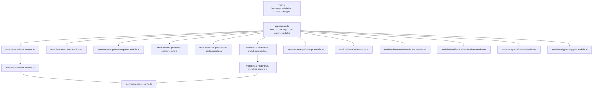
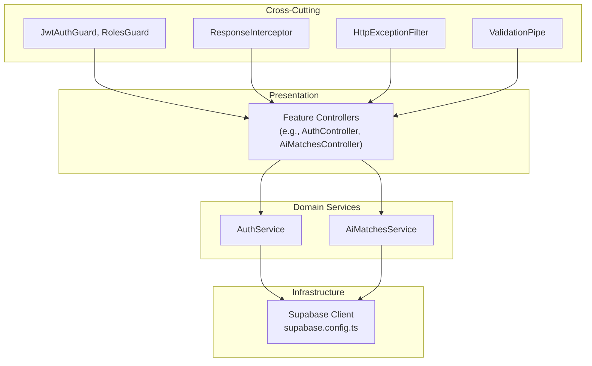
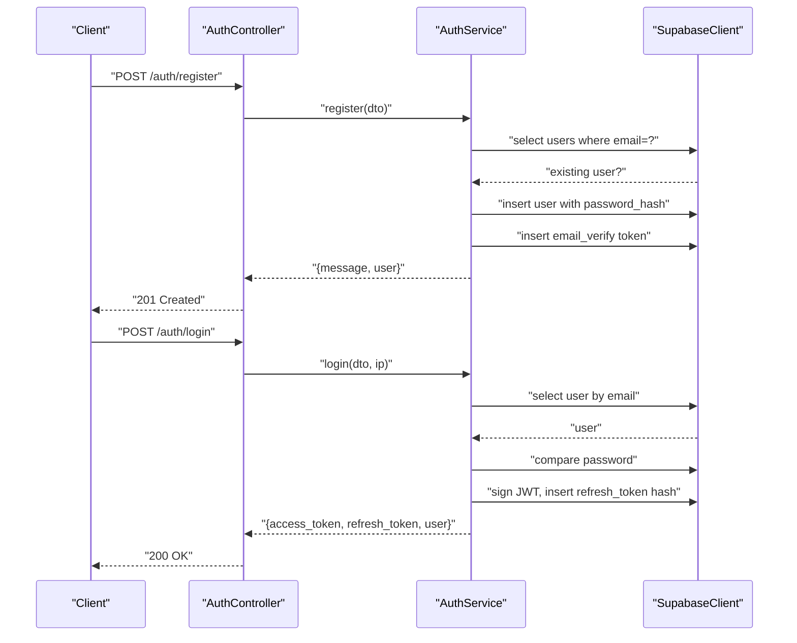
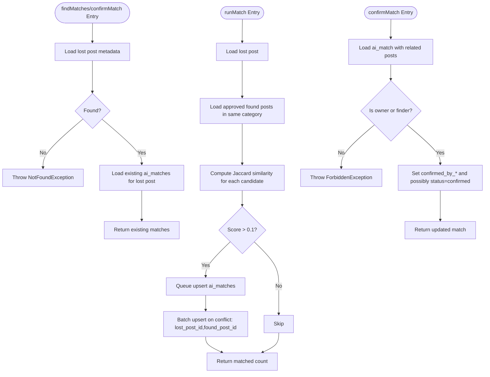
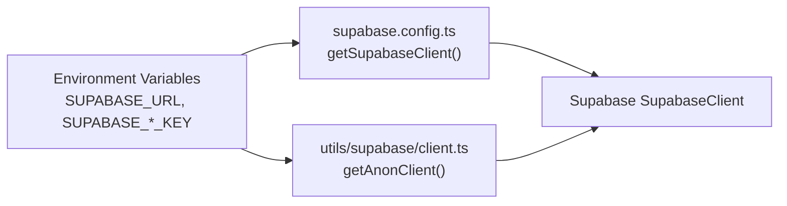
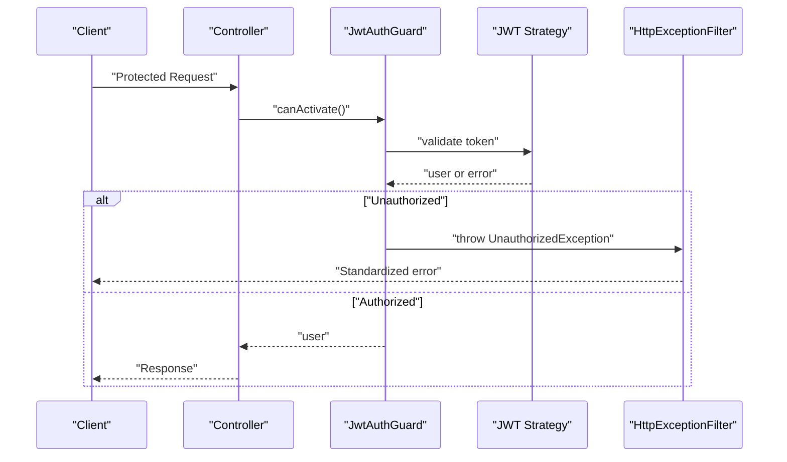
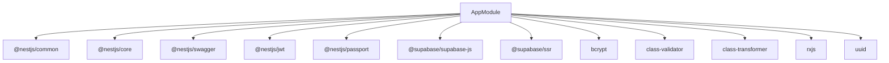

# Backend Architecture

<cite>
**Referenced Files in This Document**
- [main.ts](file://backend/src/main.ts)
- [app.module.ts](file://backend/src/app.module.ts)
- [auth.module.ts](file://backend/src/modules/auth/auth.module.ts)
- [auth.service.ts](file://backend/src/modules/auth/auth.service.ts)
- [jwt-auth.guard.ts](file://backend/src/common/guards/jwt-auth.guard.ts)
- [supabase.config.ts](file://backend/src/config/supabase.config.ts)
- [client.ts](file://backend/src/utils/supabase/client.ts)
- [ai-matches.module.ts](file://backend/src/modules/ai-matches/ai-matches.module.ts)
- [ai-matches.service.ts](file://backend/src/modules/ai-matches/ai-matches.service.ts)
- [package.json](file://backend/package.json)
- [nest-cli.json](file://backend/nest-cli.json)
- [README.md](file://backend/README.md)
</cite>

## Table of Contents
1. [Introduction](#introduction)
2. [Project Structure](#project-structure)
3. [Core Components](#core-components)
4. [Architecture Overview](#architecture-overview)
5. [Detailed Component Analysis](#detailed-component-analysis)
6. [Dependency Analysis](#dependency-analysis)
7. [Performance Considerations](#performance-considerations)
8. [Troubleshooting Guide](#troubleshooting-guide)
9. [Conclusion](#conclusion)
10. [Appendices](#appendices)

## Introduction
This document describes the backend architecture of the MissLost system built with NestJS. The backend follows a modular, plugin-style design leveraging NestJS dependency injection and module system. Authentication integrates with Supabase for user identity and session-like token management. The system interacts with a PostgreSQL-backed Supabase database and exposes REST endpoints via controllers. Cross-cutting concerns include global validation, CORS, Swagger documentation, and centralized exception handling. The AI matching module performs text-based matching between lost and found posts. The document also outlines infrastructure requirements, scalability considerations, and deployment topology.

## Project Structure
The backend is organized around NestJS modules, each encapsulating domain capabilities (authentication, posts, AI matching, storage, chat, etc.). The application bootstraps in main.ts, registers global pipes, CORS, and Swagger, then starts the server. AppModule aggregates all feature modules and registers global guards, interceptors, and filters.

**Diagram sources**
- [main.ts:1-41](file://backend/src/main.ts#L1-L41)
- [app.module.ts:1-67](file://backend/src/app.module.ts#L1-L67)
- [auth.module.ts:1-27](file://backend/src/modules/auth/auth.module.ts#L1-L27)
- [auth.service.ts:1-274](file://backend/src/modules/auth/auth.service.ts#L1-L274)
- [ai-matches.module.ts:1-11](file://backend/src/modules/ai-matches/ai-matches.module.ts#L1-L11)
- [ai-matches.service.ts:1-367](file://backend/src/modules/ai-matches/ai-matches.service.ts#L1-L367)
- [supabase.config.ts:1-25](file://backend/src/config/supabase.config.ts#L1-L25)

**Section sources**
- [main.ts:1-41](file://backend/src/main.ts#L1-L41)
- [app.module.ts:1-67](file://backend/src/app.module.ts#L1-L67)
- [nest-cli.json:1-9](file://backend/nest-cli.json#L1-L9)

## Core Components
- Application bootstrap and middleware pipeline:
  - Global ValidationPipe configured with whitelisting and implicit type transformation.
  - CORS enabled with dynamic origin and credentials support.
  - Swagger/OpenAPI documentation exposed under /api-docs.
- Root module AppModule:
  - Imports ConfigModule globally and ScheduleModule.
  - Aggregates all feature modules.
  - Registers global providers for exception filtering, response interception, and dual guards (JWT and roles).
- Supabase integration:
  - Centralized client creation with environment-driven configuration.
  - Separate anonymous client for browser-like backend usage.
- Authentication module:
  - Passport-based JWT and Google OAuth strategies.
  - JWT module configured via ConfigService with environment-driven secret and expiry.
  - Service implements registration, login, logout, email verification, forgot/reset password flows using Supabase tables.

**Section sources**
- [main.ts:6-39](file://backend/src/main.ts#L6-L39)
- [app.module.ts:28-66](file://backend/src/app.module.ts#L28-L66)
- [auth.module.ts:10-25](file://backend/src/modules/auth/auth.module.ts#L10-L25)
- [supabase.config.ts:7-23](file://backend/src/config/supabase.config.ts#L7-L23)
- [client.ts:9-18](file://backend/src/utils/supabase/client.ts#L9-L18)

## Architecture Overview
The backend employs a layered, modular architecture:
- Presentation layer: Controllers expose REST endpoints.
- Domain services: Feature-specific services encapsulate business logic.
- Infrastructure: Supabase client and database interactions.
- Cross-cutting: Guards, interceptors, filters, and global pipes.

**Diagram sources**
- [app.module.ts:46-64](file://backend/src/app.module.ts#L46-L64)
- [jwt-auth.guard.ts:1-29](file://backend/src/common/guards/jwt-auth.guard.ts#L1-L29)
- [auth.service.ts:17-19](file://backend/src/modules/auth/auth.service.ts#L17-L19)
- [ai-matches.service.ts:6-9](file://backend/src/modules/ai-matches/ai-matches.service.ts#L6-L9)
- [supabase.config.ts:7-23](file://backend/src/config/supabase.config.ts#L7-L23)

## Detailed Component Analysis

### Authentication Module
The Auth module handles user registration, login, logout, and password management. It integrates with Supabase for persistence and uses JWT for access tokens and a hashed refresh token mechanism stored in a dedicated table.

**Diagram sources**
- [auth.service.ts:22-110](file://backend/src/modules/auth/auth.service.ts#L22-L110)
- [supabase.config.ts:7-23](file://backend/src/config/supabase.config.ts#L7-L23)

**Section sources**
- [auth.module.ts:10-25](file://backend/src/modules/auth/auth.module.ts#L10-L25)
- [auth.service.ts:17-274](file://backend/src/modules/auth/auth.service.ts#L17-L274)

### AI Matching Module
The AI matching service computes text similarity between lost and found posts to propose matches. It supports retrieving existing matches, computing new matches, and confirming matches from either party.

**Diagram sources**
- [ai-matches.service.ts:15-141](file://backend/src/modules/ai-matches/ai-matches.service.ts#L15-L141)
- [ai-matches.service.ts:45-96](file://backend/src/modules/ai-matches/ai-matches.service.ts#L45-L96)
- [ai-matches.service.ts:144-153](file://backend/src/modules/ai-matches/ai-matches.service.ts#L144-L153)

**Section sources**
- [ai-matches.module.ts:5-10](file://backend/src/modules/ai-matches/ai-matches.module.ts#L5-L10)
- [ai-matches.service.ts:6-367](file://backend/src/modules/ai-matches/ai-matches.service.ts#L6-L367)

### Supabase Client Utilities
Two client utilities are provided:
- Service client for server-side operations using service role keys.
- Anonymous client for browser-like backend usage.

**Diagram sources**
- [supabase.config.ts:7-23](file://backend/src/config/supabase.config.ts#L7-L23)
- [client.ts:9-18](file://backend/src/utils/supabase/client.ts#L9-L18)

**Section sources**
- [supabase.config.ts:1-25](file://backend/src/config/supabase.config.ts#L1-L25)
- [client.ts:1-19](file://backend/src/utils/supabase/client.ts#L1-L19)

### Security and Access Control
- Global guards:
  - JwtAuthGuard integrates with Passport JWT strategy and respects a public route decorator.
  - RolesGuard can be registered globally alongside JwtAuthGuard.
- Public routes:
  - Decorators allow bypassing authentication for specific handlers.
- Exception handling:
  - Centralized filter standardizes error responses.

**Diagram sources**
- [jwt-auth.guard.ts:13-27](file://backend/src/common/guards/jwt-auth.guard.ts#L13-L27)
- [app.module.ts:46-64](file://backend/src/app.module.ts#L46-L64)

**Section sources**
- [jwt-auth.guard.ts:1-29](file://backend/src/common/guards/jwt-auth.guard.ts#L1-L29)
- [app.module.ts:46-64](file://backend/src/app.module.ts#L46-L64)

## Dependency Analysis
The backend leverages NestJS ecosystem packages and Supabase for identity and data operations. The module system ensures low coupling and high cohesion among features.

**Diagram sources**
- [package.json:22-44](file://backend/package.json#L22-L44)
- [app.module.ts:12-26](file://backend/src/app.module.ts#L12-L26)

**Section sources**
- [package.json:1-92](file://backend/package.json#L1-L92)
- [app.module.ts:12-26](file://backend/src/app.module.ts#L12-L26)

## Performance Considerations
- Database queries:
  - AI matching batches upserts and uses selective joins to reduce payload size.
  - Dashboard stats use concurrent queries to minimize latency.
- Caching:
  - No explicit Redis cache is present in the current codebase; consider adding caching for frequently accessed categories or static content.
- Pagination:
  - AI listing endpoints support pagination to avoid large result sets.
- Token management:
  - Refresh tokens are hashed and stored; ensure index coverage on user_id and token hash for lookup performance.
- Scalability:
  - Stateless JWT access tokens improve horizontal scaling.
  - Offload heavy computations (e.g., advanced AI matching) to background jobs or external services.

[No sources needed since this section provides general guidance]

## Troubleshooting Guide
- Missing environment variables:
  - Supabase client initialization requires SUPABASE_URL and appropriate keys; missing values cause immediate errors during client creation.
- Authentication failures:
  - JwtAuthGuard throws unauthorized when token validation fails; verify token signing secret and expiry.
- Validation errors:
  - Global ValidationPipe enforces DTO rules; ensure DTOs are correctly decorated and inputs match expectations.
- Swagger documentation:
  - Swagger UI is mounted under /api-docs; verify bearer auth configuration and CORS settings.

**Section sources**
- [supabase.config.ts:12-14](file://backend/src/config/supabase.config.ts#L12-L14)
- [jwt-auth.guard.ts:22-27](file://backend/src/common/guards/jwt-auth.guard.ts#L22-L27)
- [main.ts:26-33](file://backend/src/main.ts#L26-L33)

## Conclusion
The MissLost backend adopts a clean, modular NestJS architecture with Supabase as the identity and data layer. Authentication is handled via JWT and Google OAuth strategies, while AI matching provides text-based suggestions. Cross-cutting concerns are centralized through global guards, interceptors, and filters. The system is designed for scalability with stateless tokens and can be extended with caching and background processing as needs evolve.

[No sources needed since this section summarizes without analyzing specific files]

## Appendices

### Technology Stack
- Framework: NestJS (core, common, platform-express, config, schedule, swagger)
- Authentication: @nestjs/jwt, @nestjs/passport, passport-jwt, passport-google-oauth20
- Database: Supabase (PostgreSQL) via @supabase/supabase-js
- Validation: class-validator, class-transformer
- Utilities: bcrypt, uuid, reflect-metadata, rxjs
- Testing and linting: Jest, ESLint/Prettier

**Section sources**
- [package.json:22-44](file://backend/package.json#L22-L44)

### Infrastructure Requirements and Deployment Topology
- Runtime: Node.js (aligned with NestJS v11).
- Environment variables:
  - SUPABASE_URL, SUPABASE_SERVICE_ROLE_KEY (or SUPABASE_ANON_KEY for anonymous client).
  - FRONTEND_URL for CORS.
  - Optional: JWT_SECRET for token signing.
- Ports:
  - Default port 3001; configurable via PORT environment variable.
- Deployment:
  - Build with Nest CLI, run production server using node dist/main.
  - Containerization supported via provided Dockerfile.

**Section sources**
- [main.ts:35-39](file://backend/src/main.ts#L35-L39)
- [README.md:60-71](file://backend/README.md#L60-L71)