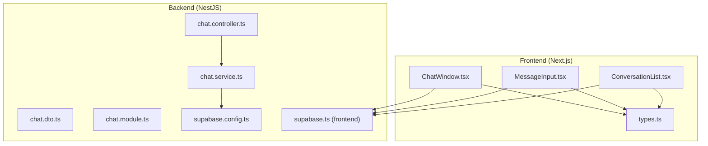
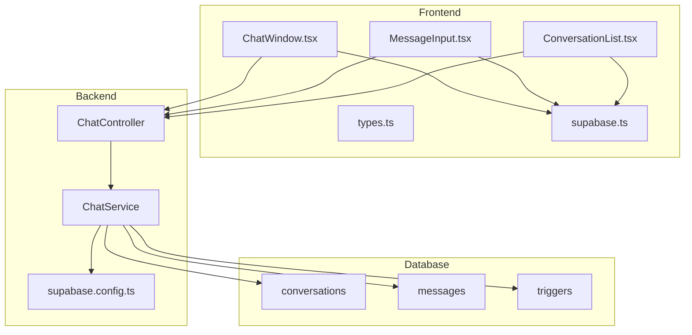
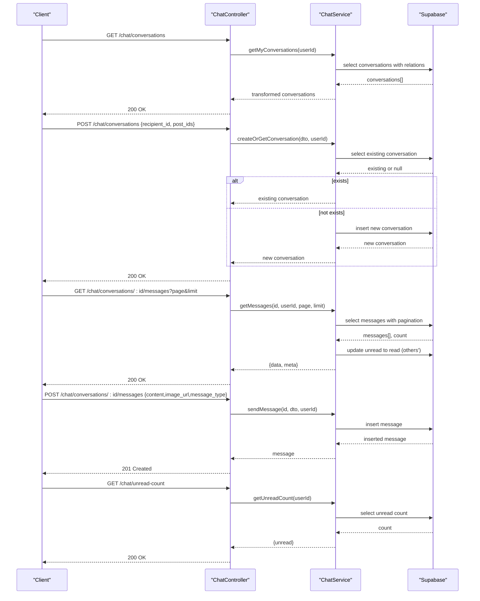
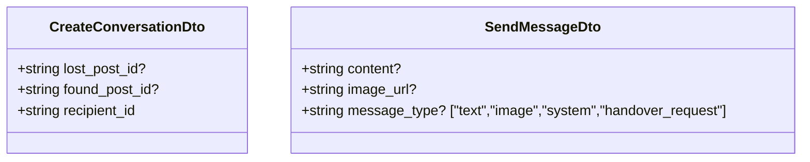
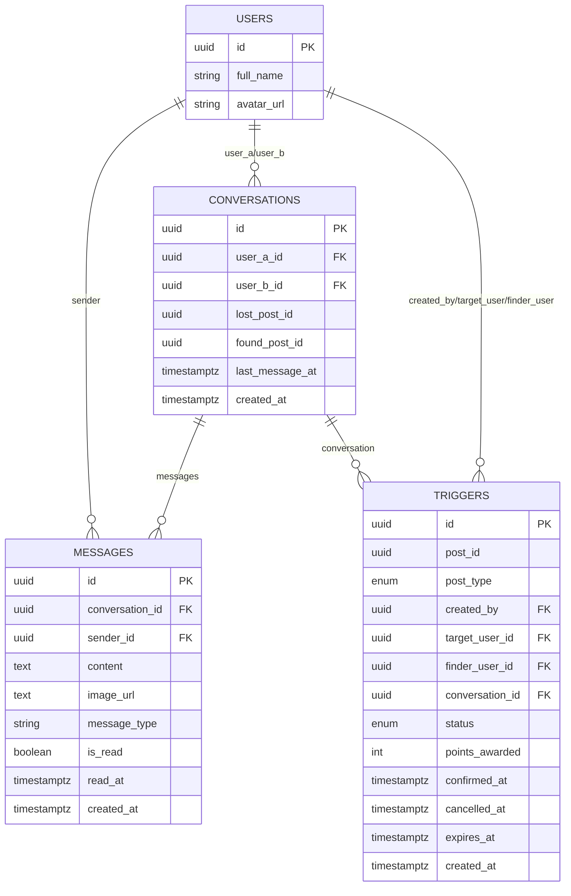
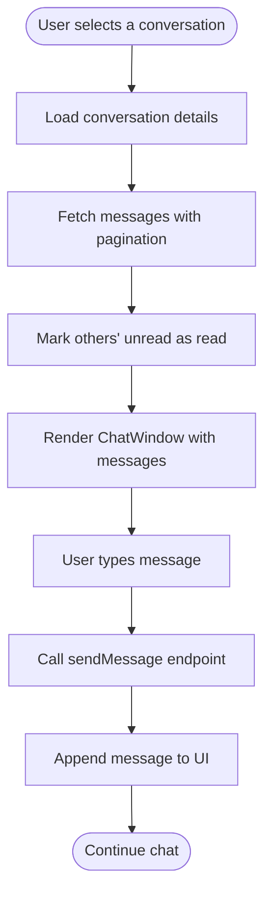
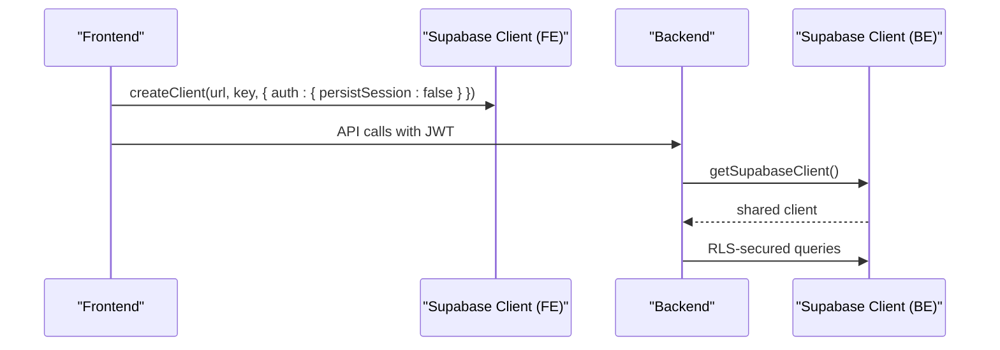
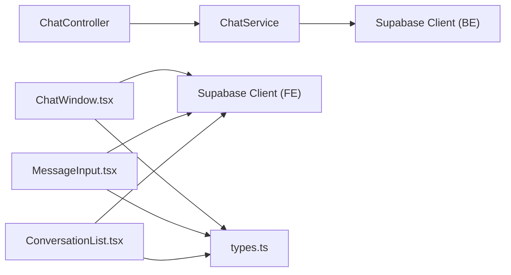

# Chat Infrastructure

<cite>
**Referenced Files in This Document**
- [chat.controller.ts](file://backend/src/modules/chat/chat.controller.ts)
- [chat.service.ts](file://backend/src/modules/chat/chat.service.ts)
- [chat.dto.ts](file://backend/src/modules/chat/dto/chat.dto.ts)
- [chat.module.ts](file://backend/src/modules/chat/chat.module.ts)
- [supabase.config.ts](file://backend/src/config/supabase.config.ts)
- [client.ts](file://backend/src/utils/supabase/client.ts)
- [supabase.ts](file://frontend/app/lib/supabase.ts)
- [types.ts](file://frontend/app/messages/types.ts)
- [ChatWindow.tsx](file://frontend/app/messages/ChatWindow.tsx)
- [MessageInput.tsx](file://frontend/app/messages/MessageInput.tsx)
- [ConversationList.tsx](file://frontend/app/messages/ConversationList.tsx)
- [main.ts](file://backend/src/main.ts)
- [triggers_migration.sql](file://backend/sql/triggers_migration.sql)
- [triggers_permissions.sql](file://backend/sql/triggers_permissions.sql)
</cite>

## Table of Contents
1. [Introduction](#introduction)
2. [Project Structure](#project-structure)
3. [Core Components](#core-components)
4. [Architecture Overview](#architecture-overview)
5. [Detailed Component Analysis](#detailed-component-analysis)
6. [Dependency Analysis](#dependency-analysis)
7. [Performance Considerations](#performance-considerations)
8. [Troubleshooting Guide](#troubleshooting-guide)
9. [Conclusion](#conclusion)
10. [Appendices](#appendices)

## Introduction
This document describes the Chat Infrastructure for the MissLost platform. It explains the WebSocket-based messaging system, real-time communication architecture, and conversation management. It documents the chat service implementation including message persistence, conversation threading, and user presence tracking. It also details the controller endpoints for chat operations, DTO validation schemas, and entity relationships. Concrete examples illustrate chat workflows such as creating conversations, sending messages, and managing chat history. Real-time update mechanisms are explained in the context of Supabase’s capabilities and limitations, including connection pooling and scalability considerations for concurrent chat sessions. Common chat issues such as message ordering, offline message handling, and connection recovery strategies are addressed.

## Project Structure
The chat system spans the backend NestJS module and the frontend Next.js components. The backend exposes REST endpoints for chat operations backed by Supabase, while the frontend integrates with Supabase for real-time updates and renders chat UI components.

**Diagram sources**
- [chat.controller.ts:1-50](file://backend/src/modules/chat/chat.controller.ts#L1-L50)
- [chat.service.ts:1-151](file://backend/src/modules/chat/chat.service.ts#L1-L151)
- [chat.dto.ts:1-36](file://backend/src/modules/chat/dto/chat.dto.ts#L1-L36)
- [chat.module.ts:1-11](file://backend/src/modules/chat/chat.module.ts#L1-L11)
- [supabase.config.ts:1-25](file://backend/src/config/supabase.config.ts#L1-L25)
- [supabase.ts:1-18](file://frontend/app/lib/supabase.ts#L1-L18)
- [types.ts:1-51](file://frontend/app/messages/types.ts#L1-L51)
- [ChatWindow.tsx:1-348](file://frontend/app/messages/ChatWindow.tsx#L1-L348)
- [MessageInput.tsx:1-117](file://frontend/app/messages/MessageInput.tsx#L1-L117)
- [ConversationList.tsx:1-103](file://frontend/app/messages/ConversationList.tsx#L1-L103)

**Section sources**
- [chat.controller.ts:1-50](file://backend/src/modules/chat/chat.controller.ts#L1-L50)
- [chat.service.ts:1-151](file://backend/src/modules/chat/chat.service.ts#L1-L151)
- [chat.dto.ts:1-36](file://backend/src/modules/chat/dto/chat.dto.ts#L1-L36)
- [chat.module.ts:1-11](file://backend/src/modules/chat/chat.module.ts#L1-L11)
- [supabase.config.ts:1-25](file://backend/src/config/supabase.config.ts#L1-L25)
- [supabase.ts:1-18](file://frontend/app/lib/supabase.ts#L1-L18)
- [types.ts:1-51](file://frontend/app/messages/types.ts#L1-L51)
- [ChatWindow.tsx:1-348](file://frontend/app/messages/ChatWindow.tsx#L1-L348)
- [MessageInput.tsx:1-117](file://frontend/app/messages/MessageInput.tsx#L1-L117)
- [ConversationList.tsx:1-103](file://frontend/app/messages/ConversationList.tsx#L1-L103)

## Core Components
- ChatController: Exposes REST endpoints for retrieving conversations, creating or fetching a conversation, fetching paginated messages, sending messages, and getting unread counts. It enforces JWT authentication and delegates to ChatService.
- ChatService: Implements chat business logic using Supabase client. Handles conversation creation, message retrieval with pagination and read marking, message sending, and unread count calculation. It validates participants and throws appropriate exceptions.
- DTOs: Define validation rules for creating conversations and sending messages, including optional content/image fields and message type enumeration.
- Supabase Client: Backend uses a singleton Supabase client configured with service role or anon key. Frontend creates per-request clients with bearer token injection.
- Frontend Components: Render conversation lists, chat windows, and message input. They fetch data via API and integrate with Supabase for real-time updates where permitted.

**Section sources**
- [chat.controller.ts:15-48](file://backend/src/modules/chat/chat.controller.ts#L15-L48)
- [chat.service.ts:12-151](file://backend/src/modules/chat/chat.service.ts#L12-L151)
- [chat.dto.ts:4-36](file://backend/src/modules/chat/dto/chat.dto.ts#L4-L36)
- [supabase.config.ts:7-23](file://backend/src/config/supabase.config.ts#L7-L23)
- [supabase.ts:7-17](file://frontend/app/lib/supabase.ts#L7-L17)

## Architecture Overview
The backend REST API orchestrates chat operations against Supabase tables for conversations and messages. The frontend consumes these APIs and leverages Supabase for real-time updates where permissions allow. The triggers system complements chat by enabling handover requests and notifications.

**Diagram sources**
- [chat.controller.ts:11-48](file://backend/src/modules/chat/chat.controller.ts#L11-L48)
- [chat.service.ts:8-10](file://backend/src/modules/chat/chat.service.ts#L8-L10)
- [supabase.config.ts:7-23](file://backend/src/config/supabase.config.ts#L7-L23)
- [supabase.ts:1-18](file://frontend/app/lib/supabase.ts#L1-L18)
- [types.ts:7-36](file://frontend/app/messages/types.ts#L7-L36)

## Detailed Component Analysis

### Backend REST Endpoints
- GET /chat/conversations: Returns the logged-in user’s conversations with related last message and participant profiles.
- POST /chat/conversations: Creates a new conversation or returns an existing one between two users for the same post context.
- GET /chat/conversations/:id/messages?page=&limit=: Fetches paginated messages for a conversation after verifying participation, and marks unread messages as read.
- POST /chat/conversations/:id/messages: Sends a new message with content or image, validating message type and participant.
- GET /chat/unread-count: Returns the total unread message count for the user excluding their own messages.

**Diagram sources**
- [chat.controller.ts:15-48](file://backend/src/modules/chat/chat.controller.ts#L15-L48)
- [chat.service.ts:12-151](file://backend/src/modules/chat/chat.service.ts#L12-L151)

**Section sources**
- [chat.controller.ts:15-48](file://backend/src/modules/chat/chat.controller.ts#L15-L48)
- [chat.service.ts:12-151](file://backend/src/modules/chat/chat.service.ts#L12-L151)

### DTO Validation Schema
- CreateConversationDto: Validates optional post IDs and required recipient ID.
- SendMessageDto: Validates optional content or image URL, and optional message type constrained to allowed values.

**Diagram sources**
- [chat.dto.ts:4-36](file://backend/src/modules/chat/dto/chat.dto.ts#L4-L36)

**Section sources**
- [chat.dto.ts:4-36](file://backend/src/modules/chat/dto/chat.dto.ts#L4-L36)

### Entity Relationships
- conversations: Links two users and optionally ties to lost/found posts. Contains last_message_at for ordering.
- messages: Belongs to a conversation, references sender user, supports content and image attachments, tracks read status and timestamps.
- triggers: Complements chat with handover requests tied to posts and conversations, with statuses and expiration.

**Diagram sources**
- [triggers_migration.sql:31-46](file://backend/sql/triggers_migration.sql#L31-L46)
- [triggers_migration.sql:325-336](file://backend/sql/triggers_migration.sql#L325-L336)

**Section sources**
- [triggers_migration.sql:31-46](file://backend/sql/triggers_migration.sql#L31-L46)
- [triggers_migration.sql:325-336](file://backend/sql/triggers_migration.sql#L325-L336)

### Frontend Chat Components
- types.ts: Defines Conversation and Message interfaces used across components.
- ConversationList.tsx: Renders a scrollable list of conversations with last message preview and unread indicators.
- ChatWindow.tsx: Displays messages in a chat canvas, auto-scrolls to bottom, and handles trigger banner rendering and actions.
- MessageInput.tsx: Provides text input and image upload controls, invoking send callbacks.

**Diagram sources**
- [ConversationList.tsx:12-103](file://frontend/app/messages/ConversationList.tsx#L12-L103)
- [ChatWindow.tsx:12-348](file://frontend/app/messages/ChatWindow.tsx#L12-L348)
- [MessageInput.tsx:9-117](file://frontend/app/messages/MessageInput.tsx#L9-L117)
- [types.ts:7-36](file://frontend/app/messages/types.ts#L7-L36)

**Section sources**
- [types.ts:1-51](file://frontend/app/messages/types.ts#L1-L51)
- [ConversationList.tsx:12-103](file://frontend/app/messages/ConversationList.tsx#L12-L103)
- [ChatWindow.tsx:12-348](file://frontend/app/messages/ChatWindow.tsx#L12-L348)
- [MessageInput.tsx:9-117](file://frontend/app/messages/MessageInput.tsx#L9-L117)

### Supabase Integration and Real-Time Updates
- Backend Supabase client: Singleton initialized with environment keys and configured to avoid session persistence.
- Frontend Supabase client: Per-request client creation with optional bearer token injection for authenticated routes.
- Real-time permissions: The triggers table is exposed via publication and policies are defined for authenticated users. The chat tables are accessed via REST endpoints in this codebase.

**Diagram sources**
- [supabase.config.ts:7-23](file://backend/src/config/supabase.config.ts#L7-L23)
- [supabase.ts:7-17](file://frontend/app/lib/supabase.ts#L7-L17)

**Section sources**
- [supabase.config.ts:7-23](file://backend/src/config/supabase.config.ts#L7-L23)
- [supabase.ts:7-17](file://frontend/app/lib/supabase.ts#L7-L17)

### WebSocket-Based Messaging System
- The current backend does not implement a dedicated WebSocket server for chat. Real-time updates rely on Supabase’s real-time features where permitted (e.g., triggers). For chat messages, the frontend polls or refreshes data as needed, and the backend exposes REST endpoints for immediate operations.
- To extend to WebSocket-based messaging, consider integrating a WebSocket server (e.g., Socket.IO or raw WebSocket) alongside the existing REST endpoints, broadcasting new messages to conversation participants and persisting events to Supabase.

[No sources needed since this section provides conceptual guidance]

### Conversation Management
- Participants are validated before allowing operations on a conversation.
- Conversations are ordered by last_message_at with foreign-table ordering on messages.
- Unread counts exclude the current user’s own messages.

**Section sources**
- [chat.service.ts:12-36](file://backend/src/modules/chat/chat.service.ts#L12-L36)
- [chat.service.ts:138-149](file://backend/src/modules/chat/chat.service.ts#L138-L149)
- [chat.service.ts:128-136](file://backend/src/modules/chat/chat.service.ts#L128-L136)

### Message Persistence and Ordering
- Messages are stored with sender_id, conversation_id, content, image_url, message_type, and timestamps.
- Pagination uses range queries with exact count support.
- Read status is updated asynchronously upon retrieval.

**Section sources**
- [chat.service.ts:68-100](file://backend/src/modules/chat/chat.service.ts#L68-L100)
- [chat.service.ts:102-126](file://backend/src/modules/chat/chat.service.ts#L102-L126)

### User Presence Tracking
- Presence is not implemented in the current codebase. Consider adding presence indicators via a separate presence table or external service and synchronizing with chat activity.

[No sources needed since this section provides conceptual guidance]

## Dependency Analysis
- ChatController depends on ChatService.
- ChatService depends on Supabase client and throws domain-specific exceptions.
- Frontend components depend on Supabase client and shared types.
- Supabase configuration is centralized in backend and frontend utilities.

**Diagram sources**
- [chat.controller.ts:11-13](file://backend/src/modules/chat/chat.controller.ts#L11-L13)
- [chat.service.ts:8-10](file://backend/src/modules/chat/chat.service.ts#L8-L10)
- [supabase.config.ts:7-23](file://backend/src/config/supabase.config.ts#L7-L23)
- [supabase.ts:7-17](file://frontend/app/lib/supabase.ts#L7-L17)
- [types.ts:1-51](file://frontend/app/messages/types.ts#L1-L51)

**Section sources**
- [chat.controller.ts:11-13](file://backend/src/modules/chat/chat.controller.ts#L11-L13)
- [chat.service.ts:8-10](file://backend/src/modules/chat/chat.service.ts#L8-L10)
- [supabase.config.ts:7-23](file://backend/src/config/supabase.config.ts#L7-L23)
- [supabase.ts:7-17](file://frontend/app/lib/supabase.ts#L7-L17)
- [types.ts:1-51](file://frontend/app/messages/types.ts#L1-L51)

## Performance Considerations
- Connection pooling: Supabase client is reused via singletons in both backend and frontend utilities to minimize overhead.
- Pagination: Backend uses range-based pagination with exact count to avoid scanning entire tables.
- Read marking: Batch updates mark unread messages as read for non-senders, reducing future read scans.
- Frontend rendering: ChatWindow auto-scrolls efficiently using requestAnimationFrame and maintains minimal re-renders by mapping message arrays.

[No sources needed since this section provides general guidance]

## Troubleshooting Guide
- Authentication failures: Ensure JWT guard is applied and tokens are passed correctly. Verify CORS configuration allows credentials.
- Missing environment variables: Backend requires SUPABASE_URL and SUPABASE_SERVICE_ROLE_KEY or SUPABASE_ANON_KEY.
- Participant validation errors: Confirm the user is part of the conversation before performing operations.
- Message ordering anomalies: Verify ordering by created_at on messages and last_message_at on conversations.
- Offline message handling: Since WebSocket is not implemented, consider caching pending messages and retrying on reconnect.
- Connection recovery: Reinitialize Supabase clients on token refresh and retry failed requests with exponential backoff.

**Section sources**
- [main.ts:24-27](file://backend/src/main.ts#L24-L27)
- [supabase.config.ts:12-14](file://backend/src/config/supabase.config.ts#L12-L14)
- [chat.service.ts:138-149](file://backend/src/modules/chat/chat.service.ts#L138-L149)

## Conclusion
The Chat Infrastructure combines REST endpoints with Supabase-backed persistence to deliver conversation and messaging features. While real-time updates leverage Supabase where permitted, the system can be extended to WebSocket-based broadcasting for richer real-time experiences. The modular design of controllers, services, and DTOs ensures maintainability and testability. Scalability benefits from Supabase’s managed infrastructure and connection reuse patterns.

[No sources needed since this section summarizes without analyzing specific files]

## Appendices

### API Endpoints Summary
- GET /chat/conversations
- POST /chat/conversations
- GET /chat/conversations/:id/messages?page=&limit=
- POST /chat/conversations/:id/messages
- GET /chat/unread-count

**Section sources**
- [chat.controller.ts:15-48](file://backend/src/modules/chat/chat.controller.ts#L15-L48)

### Supabase Triggers System Notes
- Triggers table supports handover requests with statuses and expiration.
- Policies and permissions define who can access and modify triggers.
- Publication enables real-time subscriptions for triggers.

**Section sources**
- [triggers_migration.sql:31-46](file://backend/sql/triggers_migration.sql#L31-L46)
- [triggers_permissions.sql:25-56](file://backend/sql/triggers_permissions.sql#L25-L56)