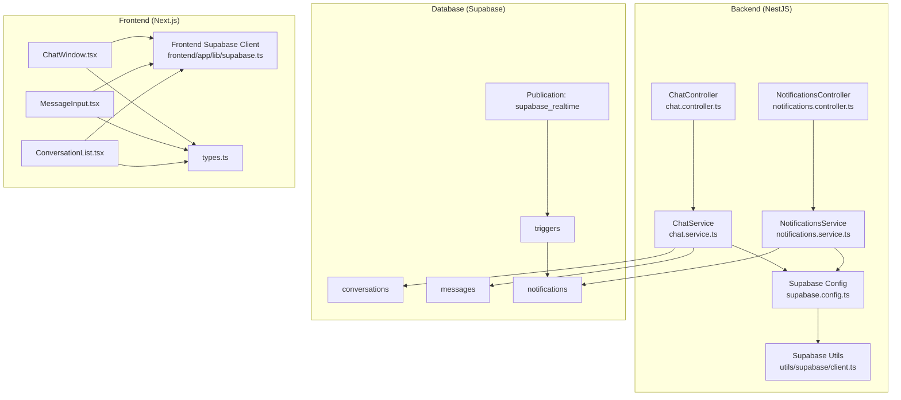
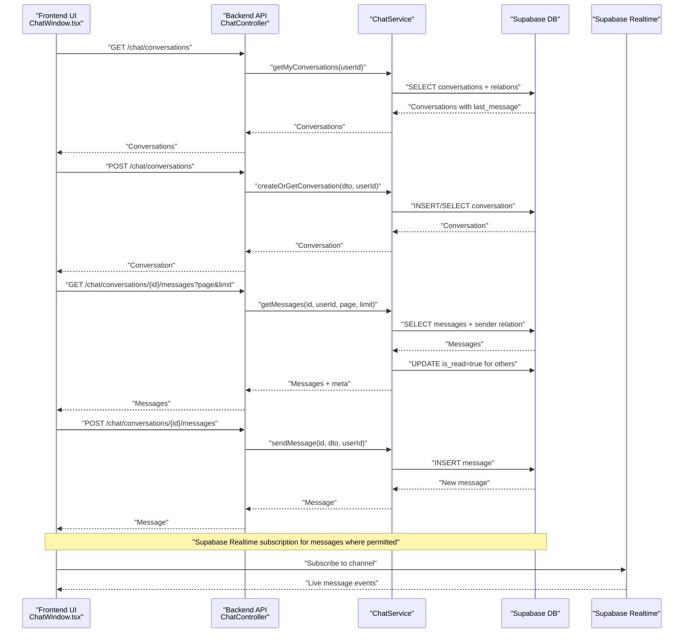
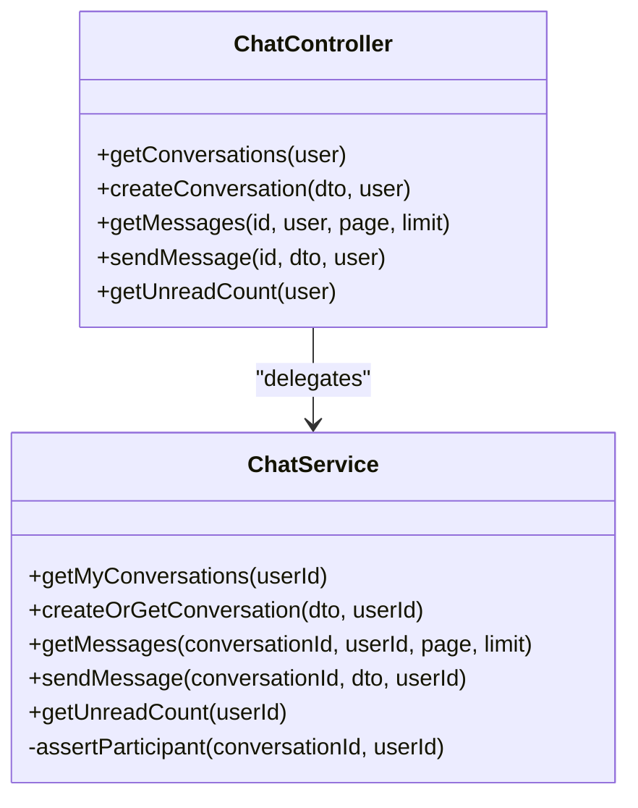
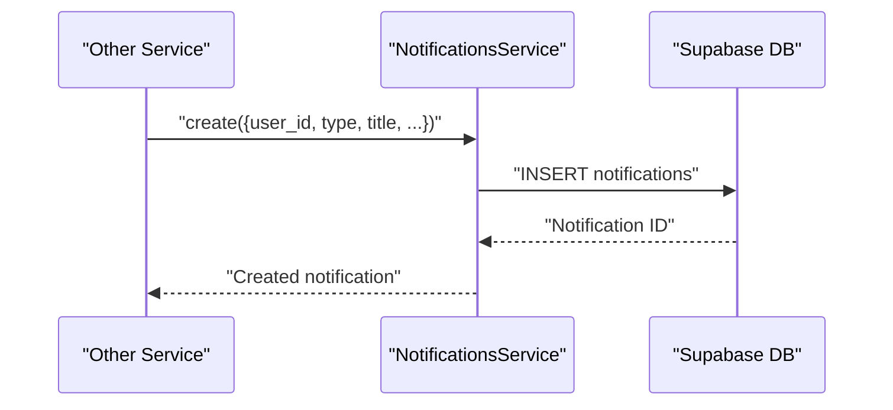
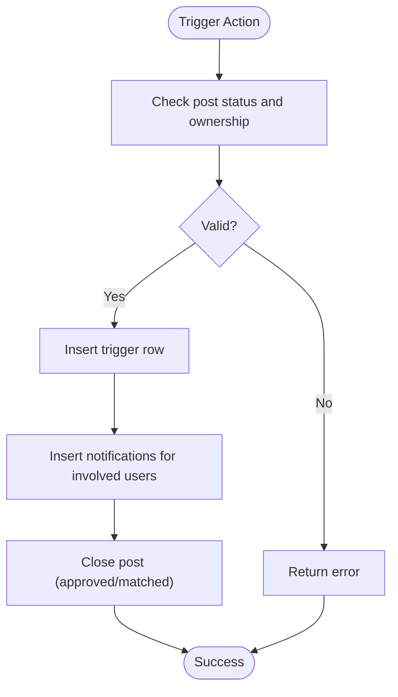
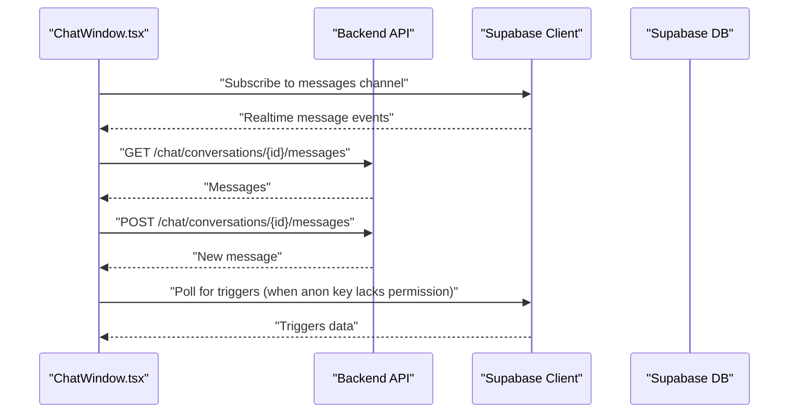
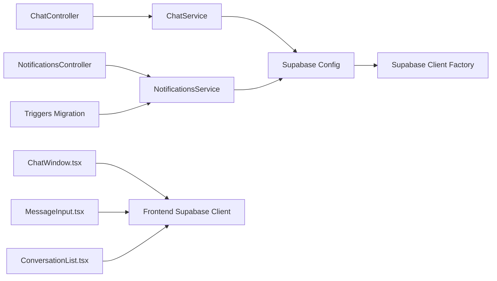
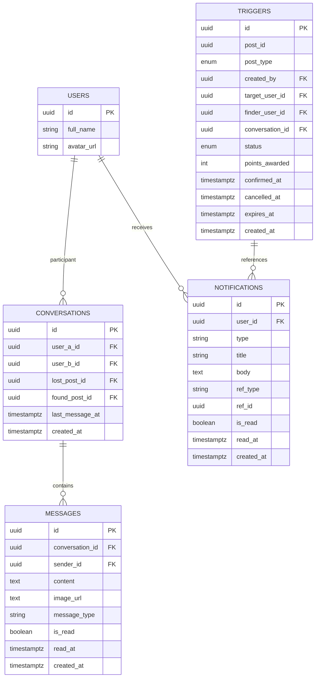

# Communication System

<cite>
**Referenced Files in This Document**
- [chat.service.ts](file://backend/src/modules/chat/chat.service.ts)
- [chat.controller.ts](file://backend/src/modules/chat/chat.controller.ts)
- [chat.dto.ts](file://backend/src/modules/chat/dto/chat.dto.ts)
- [notifications.service.ts](file://backend/src/modules/nearby/notifications/notifications.service.ts)
- [notifications.controller.ts](file://backend/src/modules/nearby/notifications/notifications.controller.ts)
- [supabase.config.ts](file://backend/src/config/supabase.config.ts)
- [client.ts](file://backend/src/utils/supabase/client.ts)
- [supabase.ts](file://frontend/app/lib/supabase.ts)
- [ChatWindow.tsx](file://frontend/app/messages/ChatWindow.tsx)
- [MessageInput.tsx](file://frontend/app/messages/MessageInput.tsx)
- [ConversationList.tsx](file://frontend/app/messages/ConversationList.tsx)
- [types.ts](file://frontend/app/messages/types.ts)
- [triggers_migration.sql](file://backend/sql/triggers_migration.sql)
- [update_trigger_points.sql](file://backend/sql/update_trigger_points.sql)
</cite>

## Table of Contents
1. [Introduction](#introduction)
2. [Project Structure](#project-structure)
3. [Core Components](#core-components)
4. [Architecture Overview](#architecture-overview)
5. [Detailed Component Analysis](#detailed-component-analysis)
6. [Dependency Analysis](#dependency-analysis)
7. [Performance Considerations](#performance-considerations)
8. [Troubleshooting Guide](#troubleshooting-guide)
9. [Conclusion](#conclusion)
10. [Appendices](#appendices)

## Introduction
This document describes the Communication System that powers real-time chat and notifications. It explains the WebSocket-based messaging infrastructure, conversation management, and message persistence. It documents the notification system architecture, event-driven notifications, and delivery mechanisms. It details chat service functionality, message threading, and real-time updates. Concrete examples illustrate chat workflows, notification triggers, and user communication patterns. Entity relationships among conversations, messages, and user profiles are clarified. Integration with Supabase real-time features is explained, along with performance optimization for concurrent connections and message queuing strategies. Common communication issues, message delivery guarantees, and scaling considerations for real-time features are addressed.

## Project Structure
The Communication System spans backend NestJS services and controllers, Supabase database and triggers, and a Next.js frontend with real-time UI patterns.

**Diagram sources**
- [chat.controller.ts:1-50](file://backend/src/modules/chat/chat.controller.ts#L1-L50)
- [chat.service.ts:1-151](file://backend/src/modules/chat/chat.service.ts#L1-L151)
- [notifications.controller.ts:1-42](file://backend/src/modules/nearby/notifications/notifications.controller.ts#L1-L42)
- [notifications.service.ts:1-82](file://backend/src/modules/nearby/notifications/notifications.service.ts#L1-L82)
- [supabase.config.ts:1-25](file://backend/src/config/supabase.config.ts#L1-L25)
- [client.ts:1-19](file://backend/src/utils/supabase/client.ts#L1-L19)
- [supabase.ts:1-18](file://frontend/app/lib/supabase.ts#L1-L18)
- [ChatWindow.tsx:1-348](file://frontend/app/messages/ChatWindow.tsx#L1-L348)
- [MessageInput.tsx:1-117](file://frontend/app/messages/MessageInput.tsx#L1-L117)
- [ConversationList.tsx:1-103](file://frontend/app/messages/ConversationList.tsx#L1-L103)
- [types.ts:1-51](file://frontend/app/messages/types.ts#L1-L51)
- [triggers_migration.sql:1-338](file://backend/sql/triggers_migration.sql#L1-L338)

**Section sources**
- [chat.controller.ts:1-50](file://backend/src/modules/chat/chat.controller.ts#L1-L50)
- [chat.service.ts:1-151](file://backend/src/modules/chat/chat.service.ts#L1-L151)
- [notifications.controller.ts:1-42](file://backend/src/modules/nearby/notifications/notifications.controller.ts#L1-L42)
- [notifications.service.ts:1-82](file://backend/src/modules/nearby/notifications/notifications.service.ts#L1-L82)
- [supabase.config.ts:1-25](file://backend/src/config/supabase.config.ts#L1-L25)
- [client.ts:1-19](file://backend/src/utils/supabase/client.ts#L1-L19)
- [supabase.ts:1-18](file://frontend/app/lib/supabase.ts#L1-L18)
- [ChatWindow.tsx:1-348](file://frontend/app/messages/ChatWindow.tsx#L1-L348)
- [MessageInput.tsx:1-117](file://frontend/app/messages/MessageInput.tsx#L1-L117)
- [ConversationList.tsx:1-103](file://frontend/app/messages/ConversationList.tsx#L1-L103)
- [types.ts:1-51](file://frontend/app/messages/types.ts#L1-L51)
- [triggers_migration.sql:1-338](file://backend/sql/triggers_migration.sql#L1-L338)

## Core Components
- ChatController: Exposes REST endpoints for conversations and messages, guarded by JWT authentication.
- ChatService: Implements conversation creation/getting, message retrieval with pagination, sending messages, and unread counts. Enforces participant checks and marks messages as read.
- NotificationsController: Provides endpoints for listing, counting, and marking notifications as read.
- NotificationsService: Manages notification CRUD, including internal creation invoked by other services.
- Supabase Clients: Backend uses a service-role/anon client factory; frontend creates per-request clients with optional auth headers.
- Frontend Chat UI: Renders conversations, messages, and handles sending text and images; integrates with Supabase for real-time updates where permitted.

Key responsibilities:
- Real-time chat: Backend persists messages; frontend polls for certain features and uses Supabase client for real-time subscriptions where permissions allow.
- Notifications: Event-driven via database triggers that insert notifications upon specific actions (e.g., handover requests, points awarded, handover completion).

**Section sources**
- [chat.controller.ts:1-50](file://backend/src/modules/chat/chat.controller.ts#L1-L50)
- [chat.service.ts:12-151](file://backend/src/modules/chat/chat.service.ts#L12-L151)
- [notifications.controller.ts:1-42](file://backend/src/modules/nearby/notifications/notifications.controller.ts#L1-L42)
- [notifications.service.ts:15-82](file://backend/src/modules/nearby/notifications/notifications.service.ts#L15-L82)
- [supabase.config.ts:7-23](file://backend/src/config/supabase.config.ts#L7-L23)
- [client.ts:9-19](file://backend/src/utils/supabase/client.ts#L9-L19)
- [supabase.ts:7-17](file://frontend/app/lib/supabase.ts#L7-L17)
- [ChatWindow.tsx:32-57](file://frontend/app/messages/ChatWindow.tsx#L32-L57)

## Architecture Overview
The system combines REST APIs with Supabase real-time capabilities. Backend services encapsulate business logic and enforce authorization. Supabase triggers emit notifications for specific events. Frontend components subscribe to Supabase channels where permitted and poll for others.

**Diagram sources**
- [chat.controller.ts:15-42](file://backend/src/modules/chat/chat.controller.ts#L15-L42)
- [chat.service.ts:12-126](file://backend/src/modules/chat/chat.service.ts#L12-L126)
- [ChatWindow.tsx:19-29](file://frontend/app/messages/ChatWindow.tsx#L19-L29)

**Section sources**
- [chat.controller.ts:15-42](file://backend/src/modules/chat/chat.controller.ts#L15-L42)
- [chat.service.ts:12-126](file://backend/src/modules/chat/chat.service.ts#L12-L126)
- [ChatWindow.tsx:19-29](file://frontend/app/messages/ChatWindow.tsx#L19-L29)

## Detailed Component Analysis

### Chat Service and Controllers
- Conversations:
  - List conversations with last message and related post titles.
  - Create or retrieve a conversation between two users for a specific post context.
- Messages:
  - Paginated retrieval ordered by creation time.
  - Automatic marking of received messages as read for other participants.
  - Send text or image messages with type metadata.
- Unread counts:
  - Global unread count for the current user.

**Diagram sources**
- [chat.controller.ts:12-48](file://backend/src/modules/chat/chat.controller.ts#L12-L48)
- [chat.service.ts:6-149](file://backend/src/modules/chat/chat.service.ts#L6-L149)

**Section sources**
- [chat.controller.ts:15-48](file://backend/src/modules/chat/chat.controller.ts#L15-L48)
- [chat.service.ts:12-136](file://backend/src/modules/chat/chat.service.ts#L12-L136)
- [chat.dto.ts:4-35](file://backend/src/modules/chat/dto/chat.dto.ts#L4-L35)

### Notification System
- Endpoints:
  - List notifications with pagination.
  - Count unread notifications.
  - Mark single or all notifications as read.
- Internal creation:
  - Services can create notifications with type, title, body, and reference to a related record.

**Diagram sources**
- [notifications.service.ts:66-80](file://backend/src/modules/nearby/notifications/notifications.service.ts#L66-L80)

**Section sources**
- [notifications.controller.ts:14-40](file://backend/src/modules/nearby/notifications/notifications.controller.ts#L14-L40)
- [notifications.service.ts:15-82](file://backend/src/modules/nearby/notifications/notifications.service.ts#L15-L82)

### Supabase Triggers and Realtime Integration
- Triggers table stores pending/confirmed/expired/cancelled handover requests linked to posts and conversations.
- Triggers emit notifications for handover request, points award, and completion.
- Publication supabase_realtime includes triggers for live updates.

**Diagram sources**
- [triggers_migration.sql:119-146](file://backend/sql/triggers_migration.sql#L119-L146)
- [triggers_migration.sql:222-241](file://backend/sql/triggers_migration.sql#L222-L241)
- [triggers_migration.sql:325-336](file://backend/sql/triggers_migration.sql#L325-L336)

**Section sources**
- [triggers_migration.sql:30-46](file://backend/sql/triggers_migration.sql#L30-L46)
- [triggers_migration.sql:119-146](file://backend/sql/triggers_migration.sql#L119-L146)
- [triggers_migration.sql:222-241](file://backend/sql/triggers_migration.sql#L222-L241)
- [triggers_migration.sql:325-336](file://backend/sql/triggers_migration.sql#L325-L336)

### Frontend Chat UI and Real-Time Patterns
- ChatWindow renders messages with auto-scroll, system messages, and sender avatars.
- MessageInput supports text and image uploads; integrates with upload API helpers.
- ConversationList displays conversation previews with unread indicators.
- Real-time:
  - Uses Supabase client for subscriptions where permitted.
  - Polls for certain features (e.g., triggers) due to permission constraints on triggers table for anonymous keys.

**Diagram sources**
- [ChatWindow.tsx:19-29](file://frontend/app/messages/ChatWindow.tsx#L19-L29)
- [ChatWindow.tsx:32-57](file://frontend/app/messages/ChatWindow.tsx#L32-L57)
- [supabase.ts:7-17](file://frontend/app/lib/supabase.ts#L7-L17)

**Section sources**
- [ChatWindow.tsx:12-348](file://frontend/app/messages/ChatWindow.tsx#L12-L348)
- [MessageInput.tsx:1-117](file://frontend/app/messages/MessageInput.tsx#L1-117)
- [ConversationList.tsx:1-103](file://frontend/app/messages/ConversationList.tsx#L1-L103)
- [types.ts:7-36](file://frontend/app/messages/types.ts#L7-L36)
- [supabase.ts:1-18](file://frontend/app/lib/supabase.ts#L1-L18)

## Dependency Analysis
- Backend depends on Supabase client factories for database access.
- ChatService and NotificationsService encapsulate all DB interactions.
- Frontend depends on Supabase client for real-time subscriptions and on API endpoints for data not covered by realtime permissions.
- Triggers define cross-service events that drive notifications.

**Diagram sources**
- [chat.controller.ts:12-13](file://backend/src/modules/chat/chat.controller.ts#L12-L13)
- [chat.service.ts:8-10](file://backend/src/modules/chat/chat.service.ts#L8-L10)
- [notifications.controller.ts:12-13](file://backend/src/modules/nearby/notifications/notifications.controller.ts#L12-L13)
- [notifications.service.ts:11-13](file://backend/src/modules/nearby/notifications/notifications.service.ts#L11-L13)
- [supabase.config.ts:7-23](file://backend/src/config/supabase.config.ts#L7-L23)
- [client.ts:9-19](file://backend/src/utils/supabase/client.ts#L9-L19)
- [ChatWindow.tsx:1-348](file://frontend/app/messages/ChatWindow.tsx#L1-L348)
- [MessageInput.tsx:1-117](file://frontend/app/messages/MessageInput.tsx#L1-L117)
- [ConversationList.tsx:1-103](file://frontend/app/messages/ConversationList.tsx#L1-L103)
- [triggers_migration.sql:123-131](file://backend/sql/triggers_migration.sql#L123-L131)

**Section sources**
- [chat.controller.ts:12-13](file://backend/src/modules/chat/chat.controller.ts#L12-L13)
- [chat.service.ts:8-10](file://backend/src/modules/chat/chat.service.ts#L8-L10)
- [notifications.controller.ts:12-13](file://backend/src/modules/nearby/notifications/notifications.controller.ts#L12-L13)
- [notifications.service.ts:11-13](file://backend/src/modules/nearby/notifications/notifications.service.ts#L11-L13)
- [supabase.config.ts:7-23](file://backend/src/config/supabase.config.ts#L7-L23)
- [client.ts:9-19](file://backend/src/utils/supabase/client.ts#L9-L19)
- [ChatWindow.tsx:1-348](file://frontend/app/messages/ChatWindow.tsx#L1-L348)
- [MessageInput.tsx:1-117](file://frontend/app/messages/MessageInput.tsx#L1-L117)
- [ConversationList.tsx:1-103](file://frontend/app/messages/ConversationList.tsx#L1-L103)
- [triggers_migration.sql:123-131](file://backend/sql/triggers_migration.sql#L123-L131)

## Performance Considerations
- Connection pooling and reuse:
  - Backend Supabase client is lazily initialized and reused to minimize overhead.
- Pagination and ordering:
  - Message retrieval uses range-based pagination and orders by created_at to support efficient fetching.
- Read receipts:
  - Batch updates mark messages as read for other participants to reduce future read scans.
- Real-time subscriptions:
  - Prefer Supabase realtime subscriptions for live updates where permissions allow; fall back to polling for restricted tables (e.g., triggers with anonymous keys).
- Frontend rendering:
  - Auto-scroll after message list updates; avoid unnecessary re-renders by memoizing derived data.
- Database indexing:
  - Triggers table includes indexes on target_user_id, created_by, conversation_id, and expires_at to optimize queries.

**Section sources**
- [supabase.config.ts:7-23](file://backend/src/config/supabase.config.ts#L7-L23)
- [chat.service.ts:68-100](file://backend/src/modules/chat/chat.service.ts#L68-L100)
- [chat.service.ts:88-94](file://backend/src/modules/chat/chat.service.ts#L88-L94)
- [ChatWindow.tsx:19-29](file://frontend/app/messages/ChatWindow.tsx#L19-L29)
- [triggers_migration.sql:48-56](file://backend/sql/triggers_migration.sql#L48-L56)

## Troubleshooting Guide
- Authentication and authorization:
  - Ensure JWT guard is applied to protected endpoints; verify current user decorator resolves the authenticated user ID.
- Participant validation:
  - If receiving forbidden errors when accessing a conversation, confirm the user is a participant (user_a_id or user_b_id matches the current user).
- Message sending validation:
  - Content or image_url must be present; otherwise, validation exceptions are thrown.
- Real-time subscription failures:
  - Anonymous keys may lack permissions for certain tables (e.g., triggers). Fall back to polling for those resources.
- Notification delivery:
  - Confirm triggers insert notifications for relevant events; check publication inclusion for supabase_realtime.

**Section sources**
- [chat.controller.ts:10-11](file://backend/src/modules/chat/chat.controller.ts#L10-L11)
- [chat.service.ts:138-149](file://backend/src/modules/chat/chat.service.ts#L138-L149)
- [chat.service.ts:102-105](file://backend/src/modules/chat/chat.service.ts#L102-L105)
- [ChatWindow.tsx:32-57](file://frontend/app/messages/ChatWindow.tsx#L32-L57)
- [triggers_migration.sql:338](file://backend/sql/triggers_migration.sql#L338)

## Conclusion
The Communication System integrates REST APIs with Supabase’s database and real-time features. ChatService and NotificationsService encapsulate core logic, while controllers expose secure endpoints. Frontend components leverage Supabase subscriptions and targeted polling to deliver responsive real-time experiences. Triggers automate notification generation for key workflows, ensuring timely user feedback. With proper indexing, connection reuse, and pagination, the system scales to handle concurrent users and high message throughput.

## Appendices

### Entity Relationship Model

**Diagram sources**
- [triggers_migration.sql:30-46](file://backend/sql/triggers_migration.sql#L30-L46)
- [triggers_migration.sql:119-146](file://backend/sql/triggers_migration.sql#L119-L146)
- [triggers_migration.sql:222-241](file://backend/sql/triggers_migration.sql#L222-L241)
- [chat.service.ts:12-36](file://backend/src/modules/chat/chat.service.ts#L12-L36)
- [notifications.service.ts:15-31](file://backend/src/modules/nearby/notifications/notifications.service.ts#L15-L31)