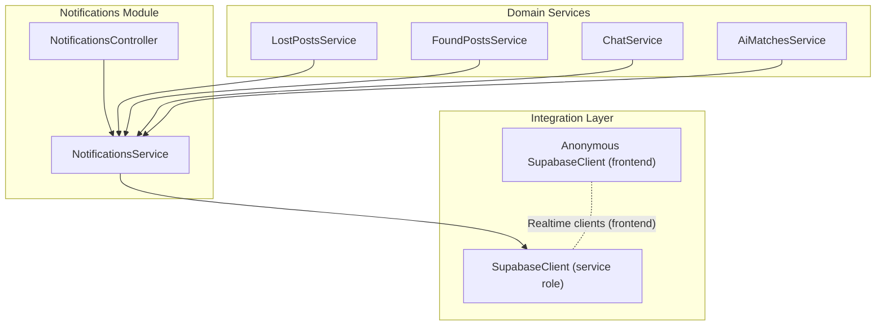
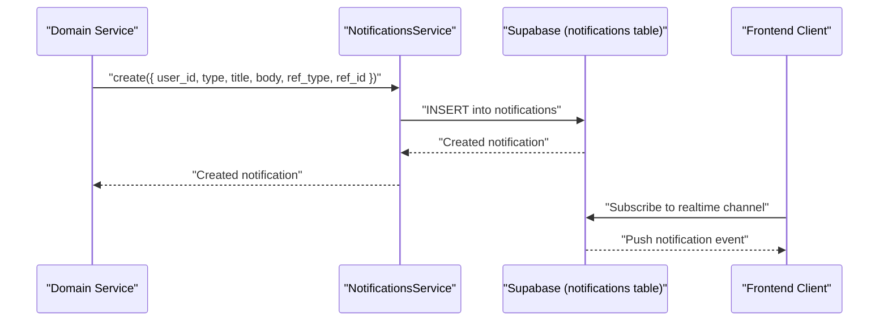
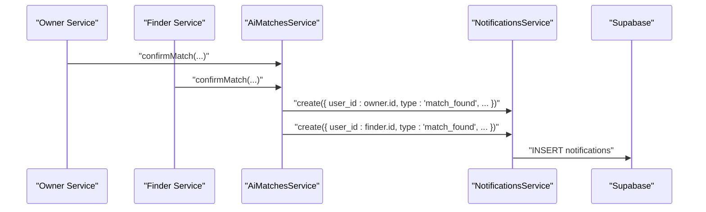
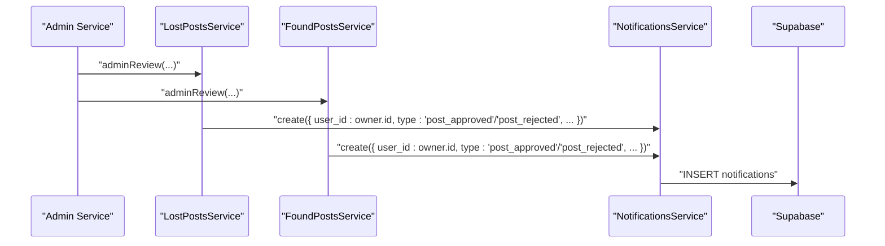
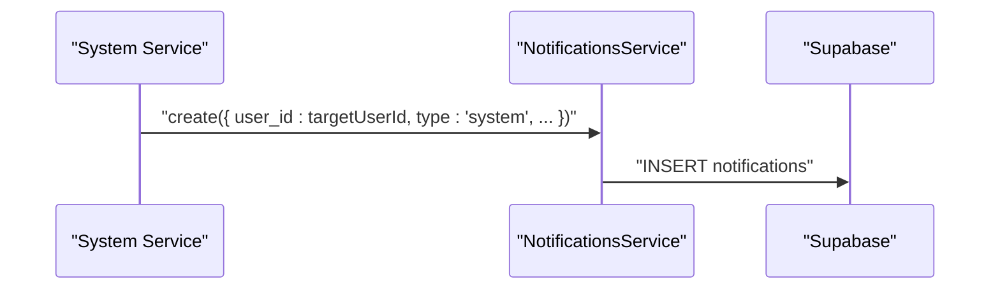
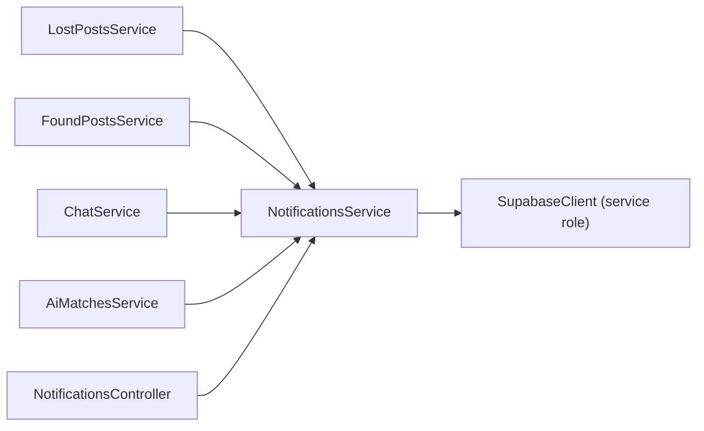

# Notification System

<cite>
**Referenced Files in This Document**
- [notifications.controller.ts](file://backend/src/modules/notifications/notifications.controller.ts)
- [notifications.service.ts](file://backend/src/modules/notifications/notifications.service.ts)
- [notifications.module.ts](file://backend/src/modules/notifications/notifications.module.ts)
- [supabase.config.ts](file://backend/src/config/supabase.config.ts)
- [client.ts](file://backend/src/utils/supabase/client.ts)
- [lost-posts.service.ts](file://backend/src/modules/lost-posts/lost-posts.service.ts)
- [found-posts.service.ts](file://backend/src/modules/found-posts/found-posts.service.ts)
- [chat.service.ts](file://backend/src/modules/chat/chat.service.ts)
- [ai-matches.service.ts](file://backend/src/modules/ai-matches/ai-matches.service.ts)
</cite>

## Table of Contents
1. [Introduction](#introduction)
2. [Project Structure](#project-structure)
3. [Core Components](#core-components)
4. [Architecture Overview](#architecture-overview)
5. [Detailed Component Analysis](#detailed-component-analysis)
6. [Dependency Analysis](#dependency-analysis)
7. [Performance Considerations](#performance-considerations)
8. [Troubleshooting Guide](#troubleshooting-guide)
9. [Conclusion](#conclusion)

## Introduction
This document describes the Notification System component of the backend. It explains the event-driven notification architecture, notification types, and delivery mechanisms. It documents the notification service implementation, including event triggering, notification templates, and user preference management. It also details the controller endpoints for notification operations, subscription management, and notification history. Concrete examples of notification workflows are provided for match notifications, post status changes, and system alerts. The document covers integration with Supabase real-time subscriptions, notification queuing strategies, and delivery confirmation mechanisms. It further explains notification filtering by user preferences, batch processing for high-volume notifications, and retry mechanisms for failed deliveries. Finally, it addresses common notification issues such as duplicate notifications, delivery failures, and performance optimization for notification scaling.

## Project Structure
The Notification System is implemented as a dedicated module with a controller and service. It integrates with Supabase for persistence and real-time features. Other domain services trigger notifications by invoking the notification service’s internal creation method.

**Diagram sources**
- [notifications.controller.ts:1-42](file://backend/src/modules/notifications/notifications.controller.ts#L1-L42)
- [notifications.service.ts:1-82](file://backend/src/modules/notifications/notifications.service.ts#L1-L82)
- [supabase.config.ts:1-25](file://backend/src/config/supabase.config.ts#L1-L25)
- [client.ts:1-19](file://backend/src/utils/supabase/client.ts#L1-L19)
- [lost-posts.service.ts:1-189](file://backend/src/modules/lost-posts/lost-posts.service.ts#L1-L189)
- [found-posts.service.ts:1-162](file://backend/src/modules/found-posts/found-posts.service.ts#L1-L162)
- [chat.service.ts:1-151](file://backend/src/modules/chat/chat.service.ts#L1-L151)
- [ai-matches.service.ts:1-367](file://backend/src/modules/ai-matches/ai-matches.service.ts#L1-L367)

**Section sources**
- [notifications.controller.ts:1-42](file://backend/src/modules/notifications/notifications.controller.ts#L1-L42)
- [notifications.service.ts:1-82](file://backend/src/modules/notifications/notifications.service.ts#L1-L82)
- [notifications.module.ts:1-11](file://backend/src/modules/notifications/notifications.module.ts#L1-L11)
- [supabase.config.ts:1-25](file://backend/src/config/supabase.config.ts#L1-L25)
- [client.ts:1-19](file://backend/src/utils/supabase/client.ts#L1-L19)

## Core Components
- NotificationsController: Exposes REST endpoints for retrieving notifications, counting unread notifications, marking individual or all notifications as read.
- NotificationsService: Provides internal notification creation and retrieval logic backed by Supabase. Defines notification types and exposes a create method for other services to emit notifications.
- Supabase Integration: Uses a shared Supabase client configured with service role credentials for server-side operations. An anonymous client is available for frontend real-time connections.

Key responsibilities:
- Persist notifications with metadata (type, title, body, related entity references).
- Support pagination and ordering for notification retrieval.
- Track read/unread state and timestamps.
- Enable bulk read operations.

**Section sources**
- [notifications.controller.ts:14-41](file://backend/src/modules/notifications/notifications.controller.ts#L14-L41)
- [notifications.service.ts:4-81](file://backend/src/modules/notifications/notifications.service.ts#L4-L81)
- [supabase.config.ts:7-23](file://backend/src/config/supabase.config.ts#L7-L23)
- [client.ts:9-19](file://backend/src/utils/supabase/client.ts#L9-L19)

## Architecture Overview
The notification architecture is event-driven:
- Domain services detect events (e.g., post status change, match confirmation, new message).
- They call the NotificationsService.create method to persist a notification record.
- Frontend clients subscribe to Supabase real-time channels to receive live updates.
- The NotificationsController provides read APIs for users to manage their notification inbox.

**Diagram sources**
- [notifications.service.ts:65-81](file://backend/src/modules/notifications/notifications.service.ts#L65-L81)
- [supabase.config.ts:7-23](file://backend/src/config/supabase.config.ts#L7-L23)

## Detailed Component Analysis

### NotificationsController
Endpoints:
- GET /notifications: List authenticated user’s notifications with pagination.
- GET /notifications/unread-count: Count unread notifications for the user.
- PATCH /notifications/:id/read: Mark a single notification as read.
- PATCH /notifications/read-all: Mark all unread notifications as read.

Authorization:
- All endpoints require JWT authentication.

Pagination and sorting:
- Results are ordered by creation time descending.
- Range queries support pagination.

**Section sources**
- [notifications.controller.ts:14-41](file://backend/src/modules/notifications/notifications.controller.ts#L14-L41)

### NotificationsService
Internal notification creation:
- create(payload): Inserts a notification row with fields for user, type, title, optional body, and optional reference identifiers.

Notification types:
- Enumerated in the service as part of the internal type definition.

Retrieval and read management:
- getMyNotifications(userId, page, limit): Returns paginated notifications sorted by created_at desc.
- getUnreadCount(userId): Counts unread notifications.
- markAsRead(id, userId): Updates read flag and timestamp for a single notification.
- markAllAsRead(userId): Bulk updates unread notifications to read.

Supabase integration:
- Uses a singleton Supabase client initialized with environment variables for service role access.

**Section sources**
- [notifications.service.ts:4-81](file://backend/src/modules/notifications/notifications.service.ts#L4-L81)
- [supabase.config.ts:7-23](file://backend/src/config/supabase.config.ts#L7-L23)

### Supabase Clients
- Service role client: Used by backend services for secure, privileged operations.
- Anonymous client: Provided for frontend real-time subscriptions.

Environment requirements:
- Service role client requires SUPABASE_URL and SUPABASE_SERVICE_ROLE_KEY or SUPABASE_ANON_KEY.
- Anonymous client requires SUPABASE_URL and SUPABASE_ANON_KEY.

**Section sources**
- [supabase.config.ts:7-23](file://backend/src/config/supabase.config.ts#L7-L23)
- [client.ts:9-19](file://backend/src/utils/supabase/client.ts#L9-L19)

### Event Triggering Across Services
While the NotificationsService.create method is the canonical way to emit notifications, other services can trigger notifications by calling NotificationsService.create after detecting relevant events. Examples of potential triggers:
- Match confirmation: When a match is confirmed, notify both parties.
- Post status change: When a post is approved or rejected, notify the post owner.
- New message: When a new message arrives, notify the recipient.

Note: The current codebase does not show explicit calls to NotificationsService.create inside these services. To implement event-driven notifications, integrate NotificationsService.create within the appropriate service methods after the event occurs.

**Section sources**
- [ai-matches.service.ts:101-141](file://backend/src/modules/ai-matches/ai-matches.service.ts#L101-L141)
- [lost-posts.service.ts:139-171](file://backend/src/modules/lost-posts/lost-posts.service.ts#L139-L171)
- [found-posts.service.ts:117-145](file://backend/src/modules/found-posts/found-posts.service.ts#L117-L145)
- [chat.service.ts:102-126](file://backend/src/modules/chat/chat.service.ts#L102-L126)

### Notification Types and Templates
Notification types supported by the service:
- post_approved
- post_rejected
- match_found
- new_message
- handover_request
- handover_completed
- storage_available
- points_awarded
- system

Template strategy:
- Notifications include a title and optional body.
- Reference metadata (ref_type, ref_id) allows linking to related resources.

Note: There is no centralized template engine in the current codebase. Titles and bodies are supplied by services when invoking create.

**Section sources**
- [notifications.service.ts:4-7](file://backend/src/modules/notifications/notifications.service.ts#L4-L7)
- [notifications.service.ts:65-81](file://backend/src/modules/notifications/notifications.service.ts#L65-L81)

### Real-time Subscriptions and Delivery Confirmation
Real-time delivery:
- Frontend clients can use the anonymous Supabase client to subscribe to Supabase realtime channels for live updates.
- Backend services can push events to these channels or rely on frontend polling of the NotificationsController endpoints.

Delivery confirmation:
- Read state is tracked per notification with is_read and read_at fields.
- Users can mark individual or all notifications as read via the controller endpoints.

**Section sources**
- [client.ts:9-19](file://backend/src/utils/supabase/client.ts#L9-L19)
- [notifications.controller.ts:24-41](file://backend/src/modules/notifications/notifications.controller.ts#L24-L41)
- [notifications.service.ts:43-63](file://backend/src/modules/notifications/notifications.service.ts#L43-L63)

### Notification Workflows

#### Match Notification Workflow
Trigger:
- After a match is confirmed by both parties, a service emits a notification for each involved user.

Flow:

**Diagram sources**
- [ai-matches.service.ts:101-141](file://backend/src/modules/ai-matches/ai-matches.service.ts#L101-L141)
- [notifications.service.ts:65-81](file://backend/src/modules/notifications/notifications.service.ts#L65-L81)

#### Post Status Change Notification Workflow
Trigger:
- When a post is approved or rejected, a service emits a notification to the post owner.

Flow:

**Diagram sources**
- [lost-posts.service.ts:139-171](file://backend/src/modules/lost-posts/lost-posts.service.ts#L139-L171)
- [found-posts.service.ts:117-145](file://backend/src/modules/found-posts/found-posts.service.ts#L117-L145)
- [notifications.service.ts:65-81](file://backend/src/modules/notifications/notifications.service.ts#L65-L81)

#### System Alert Notification Workflow
Trigger:
- When system-wide actions occur (e.g., maintenance, policy updates), a service emits a system notification.

Flow:

**Diagram sources**
- [notifications.service.ts:65-81](file://backend/src/modules/notifications/notifications.service.ts#L65-L81)

### Filtering by User Preferences and Batch Processing
Filtering by user preferences:
- The current implementation does not include a user preference table or filtering logic. To implement preference-based filtering, add a preferences table and filter notifications by user settings before insertion.

Batch processing:
- For high-volume scenarios, group insertions into batches to reduce round-trips.
- Use range queries for efficient pagination and ordering.

Retry mechanisms:
- Implement idempotent inserts and deduplication keys to avoid duplicates.
- Add retry queues with exponential backoff for transient failures.

[No sources needed since this section provides general guidance]

## Dependency Analysis
The Notifications module depends on:
- Supabase client for database operations.
- Domain services for emitting notifications.

**Diagram sources**
- [lost-posts.service.ts:1-189](file://backend/src/modules/lost-posts/lost-posts.service.ts#L1-L189)
- [found-posts.service.ts:1-162](file://backend/src/modules/found-posts/found-posts.service.ts#L1-L162)
- [chat.service.ts:1-151](file://backend/src/modules/chat/chat.service.ts#L1-L151)
- [ai-matches.service.ts:1-367](file://backend/src/modules/ai-matches/ai-matches.service.ts#L1-L367)
- [notifications.controller.ts:1-42](file://backend/src/modules/notifications/notifications.controller.ts#L1-L42)
- [notifications.service.ts:1-82](file://backend/src/modules/notifications/notifications.service.ts#L1-L82)
- [supabase.config.ts:7-23](file://backend/src/config/supabase.config.ts#L7-L23)

**Section sources**
- [notifications.module.ts:1-11](file://backend/src/modules/notifications/notifications.module.ts#L1-L11)
- [supabase.config.ts:7-23](file://backend/src/config/supabase.config.ts#L7-L23)

## Performance Considerations
- Pagination: Use range queries and limit parameters to avoid heavy scans.
- Indexing: Ensure indexes on user_id, created_at, and is_read for optimal query performance.
- Real-time efficiency: Subscribe to specific channels and use targeted filters on the frontend.
- Idempotency: Implement deduplication to prevent duplicate notifications during retries.
- Batching: Group inserts for high-volume scenarios to minimize network overhead.

[No sources needed since this section provides general guidance]

## Troubleshooting Guide
Common issues and resolutions:
- Missing environment variables: Ensure SUPABASE_URL and SUPABASE_SERVICE_ROLE_KEY/SUPABASE_ANON_KEY are set.
- Duplicate notifications: Implement deduplication logic and idempotent inserts.
- Delivery failures: Add retry logic with exponential backoff and dead-letter queues.
- Performance bottlenecks: Optimize queries with proper indexing and pagination; consider batching.

**Section sources**
- [supabase.config.ts:12-14](file://backend/src/config/supabase.config.ts#L12-L14)
- [notifications.service.ts:15-31](file://backend/src/modules/notifications/notifications.service.ts#L15-L31)

## Conclusion
The Notification System provides a solid foundation for event-driven notifications using Supabase. It supports essential CRUD operations for notifications, read state management, and real-time delivery via Supabase channels. To enhance the system, integrate NotificationsService.create within domain services to emit notifications upon key events, implement user preference filtering, adopt batch processing and retry mechanisms, and optimize performance through indexing and pagination.