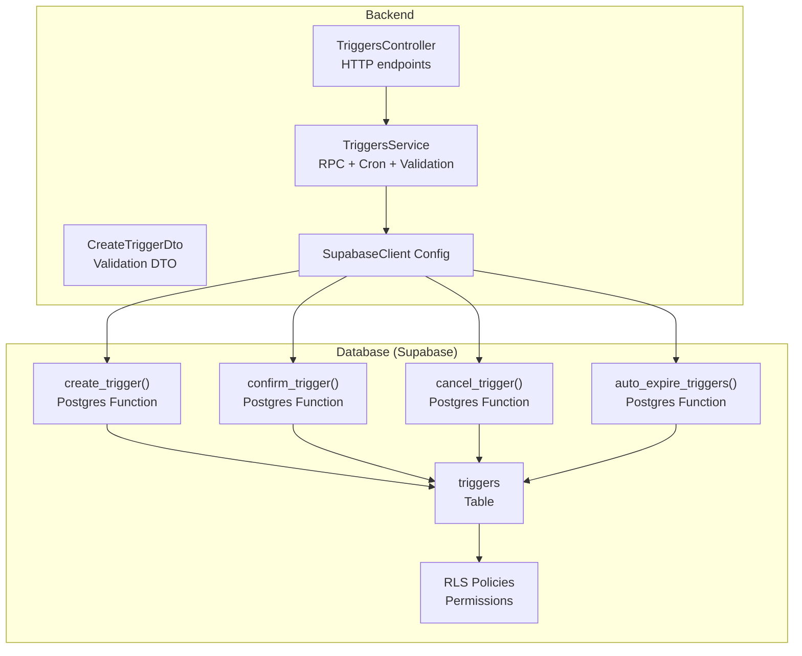
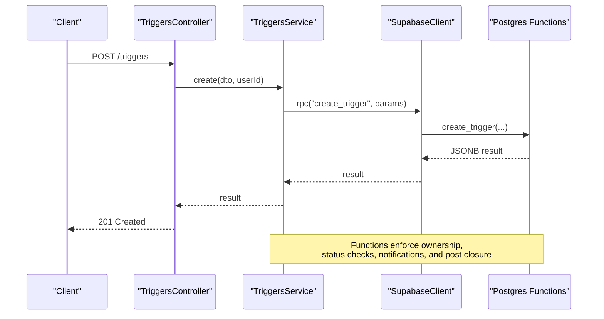
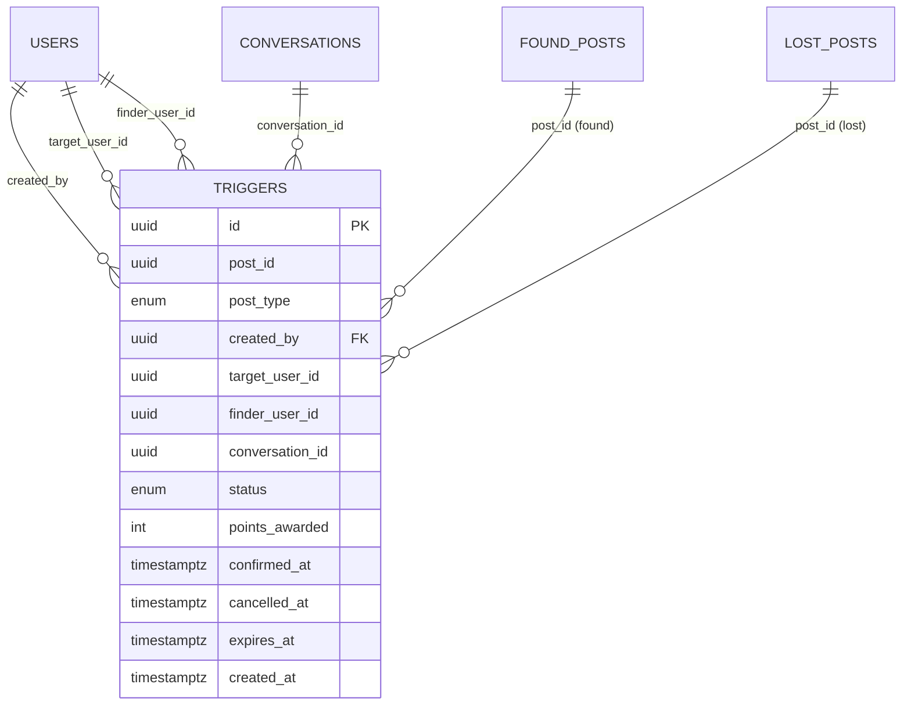
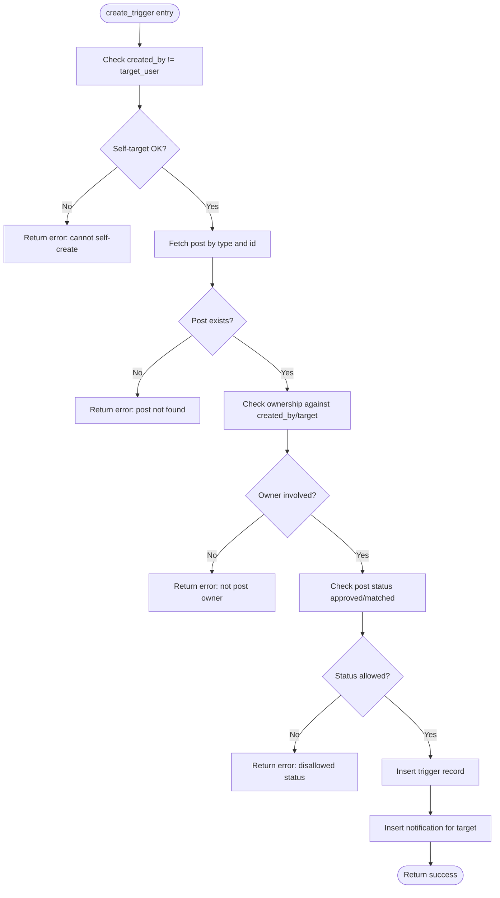
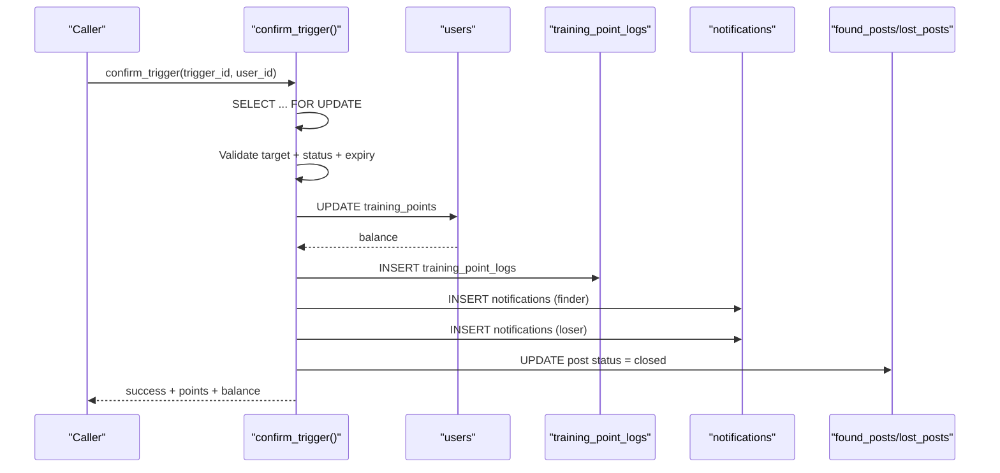
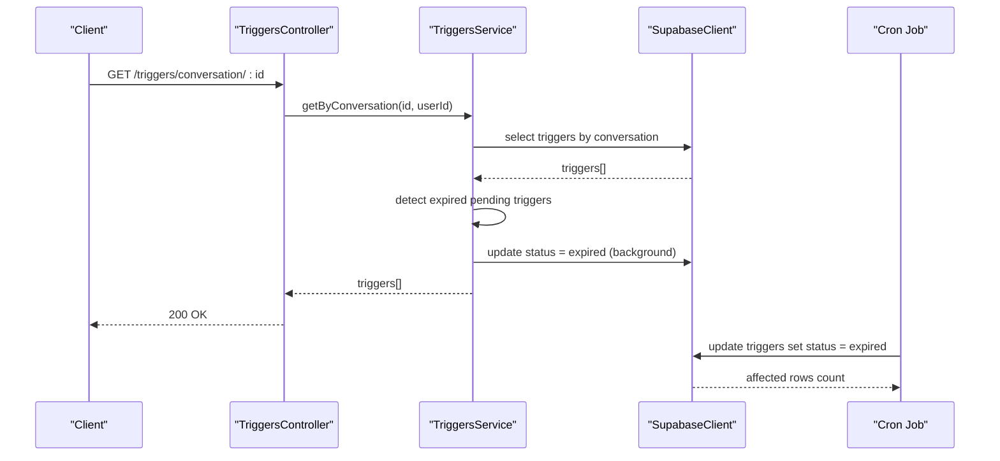
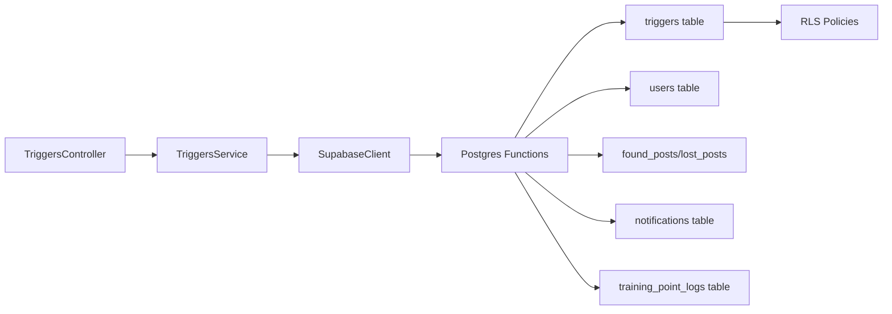

# Database Triggers

<cite>
**Referenced Files in This Document**
- [triggers.service.ts](file://backend/src/modules/triggers/triggers.service.ts)
- [triggers.controller.ts](file://backend/src/modules/triggers/triggers.controller.ts)
- [trigger.dto.ts](file://backend/src/modules/triggers/dto/trigger.dto.ts)
- [triggers_migration.sql](file://backend/sql/triggers_migration.sql)
- [triggers_permissions.sql](file://backend/sql/triggers_permissions.sql)
- [update_trigger_points.sql](file://backend/sql/update_trigger_points.sql)
- [supabase.config.ts](file://backend/src/config/supabase.config.ts)
- [triggers.e2e-spec.ts](file://backend/test/triggers.e2e-spec.ts)
- [test-e2e-trigger.ts](file://backend/test-e2e-trigger.ts)
</cite>

## Table of Contents
1. [Introduction](#introduction)
2. [Project Structure](#project-structure)
3. [Core Components](#core-components)
4. [Architecture Overview](#architecture-overview)
5. [Detailed Component Analysis](#detailed-component-analysis)
6. [Dependency Analysis](#dependency-analysis)
7. [Performance Considerations](#performance-considerations)
8. [Troubleshooting Guide](#troubleshooting-guide)
9. [Conclusion](#conclusion)
10. [Appendices](#appendices)

## Introduction
This document provides comprehensive data model documentation for the Database Triggers system. It covers trigger definitions, automatic update mechanisms, and audit logging functionality implemented in PostgreSQL via Supabase. The system enforces data integrity, automates workflows around post handover confirmations, and manages training points for users. It includes permission management, migration scripts, and integration points with the backend service and event handling.

## Project Structure
The Triggers feature is implemented as a NestJS module with a dedicated controller, service, and DTOs. The database schema and permissions are managed via SQL migration and permission scripts. The backend integrates with Supabase to call Postgres functions and manage row-level security policies.

**Diagram sources**
- [triggers.controller.ts:1-42](file://backend/src/modules/triggers/triggers.controller.ts#L1-L42)
- [triggers.service.ts:18-163](file://backend/src/modules/triggers/triggers.service.ts#L18-L163)
- [supabase.config.ts:7-23](file://backend/src/config/supabase.config.ts#L7-L23)
- [triggers_migration.sql:31-46](file://backend/sql/triggers_migration.sql#L31-L46)
- [triggers_permissions.sql:25-56](file://backend/sql/triggers_permissions.sql#L25-L56)

**Section sources**
- [triggers.controller.ts:1-42](file://backend/src/modules/triggers/triggers.controller.ts#L1-L42)
- [triggers.service.ts:18-163](file://backend/src/modules/triggers/triggers.service.ts#L18-L163)
- [supabase.config.ts:7-23](file://backend/src/config/supabase.config.ts#L7-L23)
- [triggers_migration.sql:31-46](file://backend/sql/triggers_migration.sql#L31-L46)
- [triggers_permissions.sql:25-56](file://backend/sql/triggers_permissions.sql#L25-L56)

## Core Components
- TriggersController: Exposes HTTP endpoints for creating, confirming, cancelling triggers, and fetching triggers by conversation.
- TriggersService: Orchestrates RPC calls to Postgres functions, handles validation, and runs a periodic cron job to expire pending triggers.
- Postgres Functions: Encapsulate atomic business logic for trigger creation, confirmation, cancellation, and expiration.
- Permissions and RLS: Define who can access triggers and what operations are allowed.
- DTO: Validates incoming requests for trigger creation.

Key responsibilities:
- Enforce ownership and status checks during trigger creation.
- Atomic updates to trigger status, user training points, notifications, and post status upon confirmation.
- Automatic expiration of pending triggers via cron and background status correction.
- Audit logging via training point logs.

**Section sources**
- [triggers.controller.ts:15-40](file://backend/src/modules/triggers/triggers.controller.ts#L15-L40)
- [triggers.service.ts:30-88](file://backend/src/modules/triggers/triggers.service.ts#L30-L88)
- [triggers_migration.sql:63-146](file://backend/sql/triggers_migration.sql#L63-L146)
- [triggers_migration.sql:153-259](file://backend/sql/triggers_migration.sql#L153-L259)
- [triggers_migration.sql:266-318](file://backend/sql/triggers_migration.sql#L266-L318)
- [triggers_migration.sql:325-336](file://backend/sql/triggers_migration.sql#L325-L336)

## Architecture Overview
The system integrates NestJS with Supabase to expose REST endpoints backed by Postgres functions. The functions encapsulate atomic operations, ensuring data consistency and enforcing business rules. Row-level security and explicit grants control access.

**Diagram sources**
- [triggers.controller.ts:15-19](file://backend/src/modules/triggers/triggers.controller.ts#L15-L19)
- [triggers.service.ts:30-48](file://backend/src/modules/triggers/triggers.service.ts#L30-L48)
- [triggers_migration.sql:63-146](file://backend/sql/triggers_migration.sql#L63-L146)

## Detailed Component Analysis

### Data Model: triggers
The triggers table defines the core entity for handover confirmations. It includes foreign keys to users and posts, status tracking, expiration, and audit timestamps.

- Unique constraint on active triggers per post prevents duplicate pending triggers.
- Status defaults to pending with a 48-hour expiry window.
- Expiration index accelerates cron-based cleanup.

**Diagram sources**
- [triggers_migration.sql:31-46](file://backend/sql/triggers_migration.sql#L31-L46)
- [triggers_migration.sql:49-56](file://backend/sql/triggers_migration.sql#L49-L56)

**Section sources**
- [triggers_migration.sql:31-46](file://backend/sql/triggers_migration.sql#L31-L46)
- [triggers_migration.sql:49-56](file://backend/sql/triggers_migration.sql#L49-L56)

### Postgres Functions

#### create_trigger
Purpose: Create a new trigger for a post, validate ownership and status, and send notifications.

Key behaviors:
- Validates post existence and ownership against the creator/target.
- Ensures post status allows trigger creation.
- Inserts a trigger record and sends a notification to the target user.
- Returns metadata including trigger ID and expiry time.

**Diagram sources**
- [triggers_migration.sql:63-146](file://backend/sql/triggers_migration.sql#L63-L146)

**Section sources**
- [triggers_migration.sql:63-146](file://backend/sql/triggers_migration.sql#L63-L146)

#### confirm_trigger
Purpose: Confirm a trigger, award training points to the finder, notify involved parties, and close the associated post.

Key behaviors:
- Locks the trigger row for update.
- Validates target user and pending status.
- Checks expiration and suspended status of the finder.
- Updates trigger status, awards points, logs training points, notifies finder and loser, and closes the post.

**Diagram sources**
- [triggers_migration.sql:153-259](file://backend/sql/triggers_migration.sql#L153-L259)

**Section sources**
- [triggers_migration.sql:153-259](file://backend/sql/triggers_migration.sql#L153-L259)

#### cancel_trigger
Purpose: Allow the creator to cancel a pending trigger and notify the target.

Key behaviors:
- Validates creator and pending status.
- Marks trigger as cancelled and inserts a notification for the target.

**Section sources**
- [triggers_migration.sql:266-318](file://backend/sql/triggers_migration.sql#L266-L318)

#### auto_expire_triggers
Purpose: Periodic function to mark expired pending triggers as expired.

**Section sources**
- [triggers_migration.sql:325-336](file://backend/sql/triggers_migration.sql#L325-L336)

### Permission Management and RLS
- Row Level Security is enabled on the triggers table.
- Roles granted:
  - authenticated: SELECT, INSERT, UPDATE on triggers; EXECUTE on trigger functions.
  - service_role: full access; EXECUTE on trigger functions.
  - anon: SELECT on triggers.
- RLS policies:
  - Select: users can view triggers where they are creator, target, or finder.
  - Insert: with check that created_by equals authenticated user.
  - Update: users can update triggers where they are creator or target.
  - Service role: full access.

These policies ensure data isolation and prevent unauthorized modifications.

**Section sources**
- [triggers_permissions.sql:6-17](file://backend/sql/triggers_permissions.sql#L6-L17)
- [triggers_permissions.sql:18-24](file://backend/sql/triggers_permissions.sql#L18-L24)
- [triggers_permissions.sql:25-56](file://backend/sql/triggers_permissions.sql#L25-L56)

### Training Points Calculation
- Default points awarded increased from 10 to 5.
- Only the finder receives training points upon successful confirmation.
- Training point logs capture delta and balance after award.

**Section sources**
- [update_trigger_points.sql:6-7](file://backend/sql/update_trigger_points.sql#L6-L7)
- [update_trigger_points.sql:73-89](file://backend/sql/update_trigger_points.sql#L73-L89)
- [update_trigger_points.sql:120-125](file://backend/sql/update_trigger_points.sql#L120-L125)

### Backend Integration and Event Handling
- TriggersController exposes endpoints for create, confirm, cancel, and fetch by conversation.
- TriggersService:
  - Calls Postgres functions via Supabase RPC.
  - Implements a cron job to expire pending triggers every 6 hours.
  - Performs background status correction for expired triggers when fetched.
- SupabaseClient is configured centrally and reused across the service.

**Diagram sources**
- [triggers.controller.ts:33-40](file://backend/src/modules/triggers/triggers.controller.ts#L33-L40)
- [triggers.service.ts:94-134](file://backend/src/modules/triggers/triggers.service.ts#L94-L134)
- [triggers.service.ts:140-161](file://backend/src/modules/triggers/triggers.service.ts#L140-L161)

**Section sources**
- [triggers.controller.ts:15-40](file://backend/src/modules/triggers/triggers.controller.ts#L15-L40)
- [triggers.service.ts:30-88](file://backend/src/modules/triggers/triggers.service.ts#L30-L88)
- [triggers.service.ts:94-134](file://backend/src/modules/triggers/triggers.service.ts#L94-L134)
- [triggers.service.ts:140-161](file://backend/src/modules/triggers/triggers.service.ts#L140-L161)
- [supabase.config.ts:7-23](file://backend/src/config/supabase.config.ts#L7-L23)

### Audit Logging
- Training point logs record the delta and balance after awarding points.
- Notifications are inserted for both finder and loser upon confirmation.
- Expiration and cancellation are logged implicitly via status transitions.

**Section sources**
- [triggers_migration.sql:212-218](file://backend/sql/triggers_migration.sql#L212-L218)
- [update_trigger_points.sql:83-89](file://backend/sql/update_trigger_points.sql#L83-L89)

## Dependency Analysis
- Controller depends on TriggersService.
- Service depends on SupabaseClient and Postgres functions.
- Functions depend on triggers table and related entities (users, posts, notifications).
- RLS and permissions govern access to triggers and function execution.

**Diagram sources**
- [triggers.controller.ts:1-42](file://backend/src/modules/triggers/triggers.controller.ts#L1-L42)
- [triggers.service.ts:18-163](file://backend/src/modules/triggers/triggers.service.ts#L18-L163)
- [triggers_migration.sql:31-46](file://backend/sql/triggers_migration.sql#L31-L46)
- [triggers_permissions.sql:25-56](file://backend/sql/triggers_permissions.sql#L25-L56)

**Section sources**
- [triggers.controller.ts:1-42](file://backend/src/modules/triggers/triggers.controller.ts#L1-L42)
- [triggers.service.ts:18-163](file://backend/src/modules/triggers/triggers.service.ts#L18-L163)
- [triggers_migration.sql:31-46](file://backend/sql/triggers_migration.sql#L31-L46)
- [triggers_permissions.sql:25-56](file://backend/sql/triggers_permissions.sql#L25-L56)

## Performance Considerations
- Indexes:
  - Unique index on active triggers per post ensures fast uniqueness checks.
  - Composite indexes on target_user/status and conversation_id/status improve query performance.
  - Expiry index on pending triggers accelerates cron-based expiration.
- Function atomicity:
  - All operations are wrapped in functions to minimize transaction overhead and ensure consistency.
- Background updates:
  - Expired status correction is performed asynchronously to reduce latency.
- Cron cadence:
  - Expiration runs every 6 hours; adjust based on traffic and SLAs.

[No sources needed since this section provides general guidance]

## Troubleshooting Guide
Common issues and resolutions:
- Permission errors when calling functions:
  - Ensure triggers_permissions.sql has been executed on Supabase.
  - Verify authenticated/service_role has EXECUTE privileges on functions.
- Function not found:
  - Ensure triggers_migration.sql has been executed to create functions.
- Expiration not working:
  - Confirm cron job is enabled and scheduled.
  - Verify auto_expire_triggers function exists and is executable.
- Data not visible:
  - Check RLS policies for authenticated users and service_role.
  - Confirm SELECT permissions on triggers.

Debugging steps:
- Use the end-to-end test script to validate connectivity and function behavior.
- Manually call functions via Supabase SQL Editor to inspect errors.
- Review logs from the cron job and service logs.

**Section sources**
- [test-e2e-trigger.ts:17-87](file://backend/test-e2e-trigger.ts#L17-L87)
- [triggers_permissions.sql:18-24](file://backend/sql/triggers_permissions.sql#L18-L24)
- [triggers_migration.sql:325-336](file://backend/sql/triggers_migration.sql#L325-L336)

## Conclusion
The Database Triggers system provides a robust, auditable mechanism for managing handover confirmations with strong data integrity and automated workflows. Postgres functions encapsulate business logic, while RLS and explicit grants ensure secure access. The backend integrates seamlessly via Supabase RPC and includes a cron-driven expiration mechanism. Proper migrations and permissions are essential for reliable operation.

[No sources needed since this section summarizes without analyzing specific files]

## Appendices

### Migration Scripts and Permissions
- triggers_migration.sql: Creates extensions, enums, triggers table, indexes, and functions; enables publication for realtime.
- triggers_permissions.sql: Enables RLS, grants permissions, and sets RLS policies.
- update_trigger_points.sql: Adjusts default points and updates confirm_trigger to award points only to finder.

**Section sources**
- [triggers_migration.sql:1-338](file://backend/sql/triggers_migration.sql#L1-L338)
- [triggers_permissions.sql:1-57](file://backend/sql/triggers_permissions.sql#L1-L57)
- [update_trigger_points.sql:1-132](file://backend/sql/update_trigger_points.sql#L1-L132)

### API Endpoints
- POST /triggers: Create a trigger.
- POST /triggers/{id}/confirm: Confirm a trigger.
- PATCH /triggers/{id}/cancel: Cancel a trigger.
- GET /triggers/conversation/{conversationId}: Get triggers by conversation.

Validation:
- CreateTriggerDto validates UUIDs and post_type enum.

**Section sources**
- [triggers.controller.ts:15-40](file://backend/src/modules/triggers/triggers.controller.ts#L15-L40)
- [trigger.dto.ts:4-21](file://backend/src/modules/triggers/dto/trigger.dto.ts#L4-L21)

### Testing
- End-to-end tests validate HTTP responses and error paths for trigger operations.
- Manual test script verifies connectivity and function availability.

**Section sources**
- [triggers.e2e-spec.ts:78-344](file://backend/test/triggers.e2e-spec.ts#L78-L344)
- [test-e2e-trigger.ts:17-87](file://backend/test-e2e-trigger.ts#L17-L87)