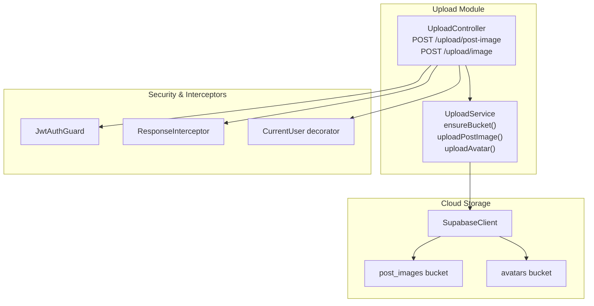
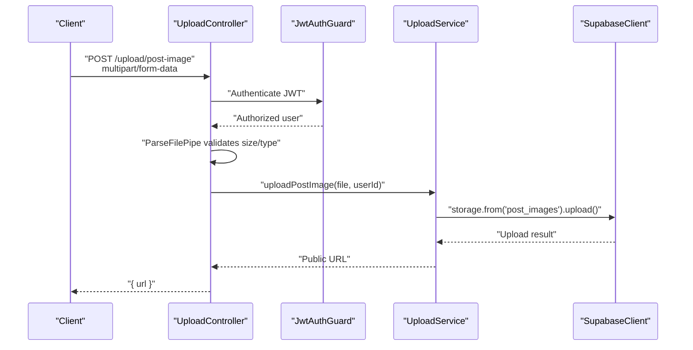
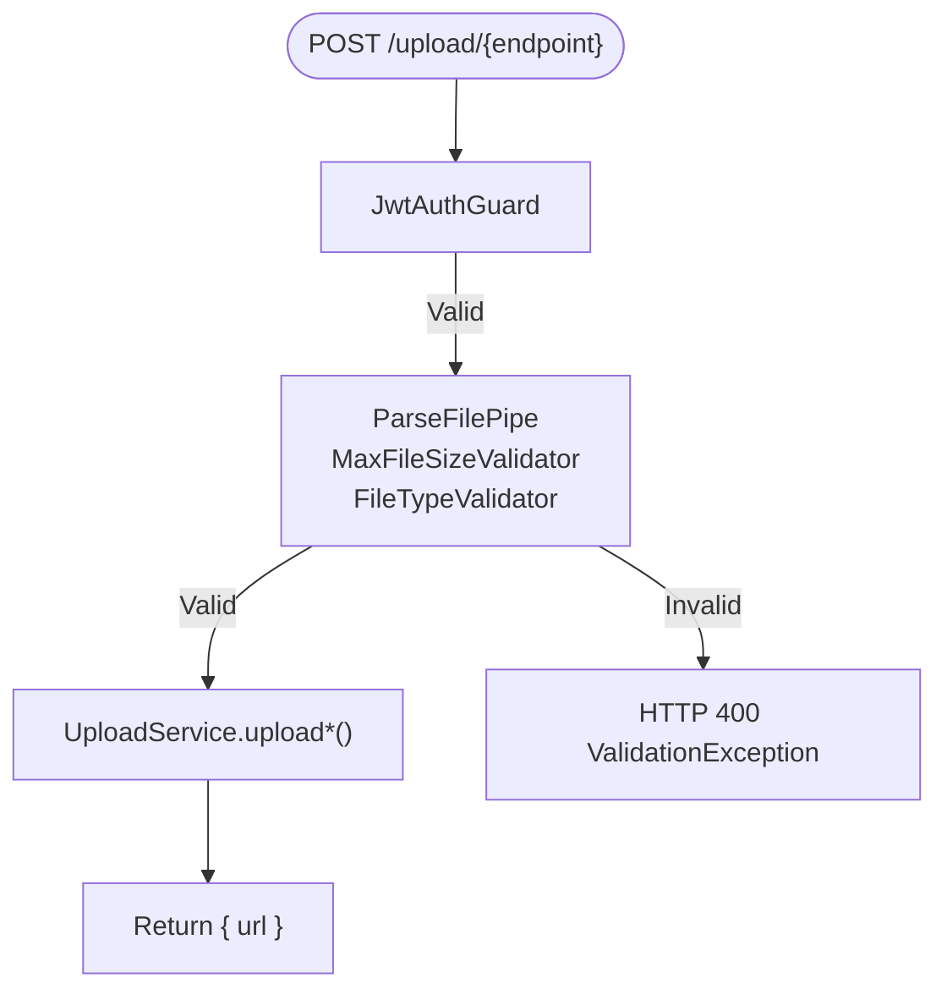
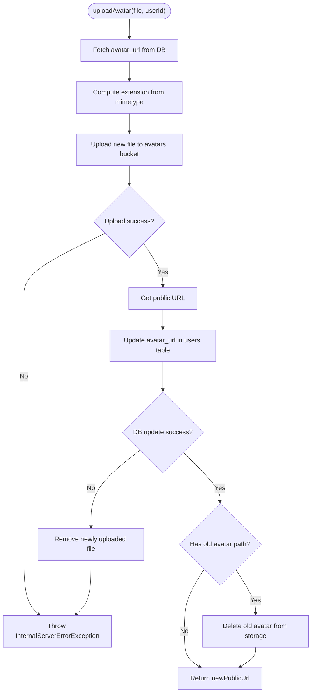
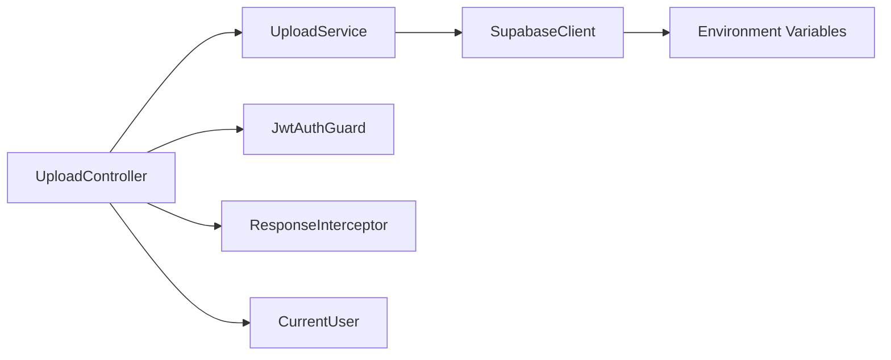

# File Upload System

<cite>
**Referenced Files in This Document**
- [upload.controller.ts](file://backend/src/modules/upload/upload.controller.ts)
- [upload.service.ts](file://backend/src/modules/upload/upload.service.ts)
- [upload.module.ts](file://backend/src/modules/upload/upload.module.ts)
- [supabase.config.ts](file://backend/src/config/supabase.config.ts)
- [client.ts](file://backend/src/utils/supabase/client.ts)
- [jwt-auth.guard.ts](file://backend/src/common/guards/jwt-auth.guard.ts)
- [current-user.decorator.ts](file://backend/src/common/decorators/current-user.decorator.ts)
- [response.interceptor.ts](file://backend/src/common/interceptors/response.interceptor.ts)
- [app.exception.ts](file://backend/src/common/exceptions/app.exception.ts)
- [storage.controller.ts](file://backend/src/modules/storage/storage.controller.ts)
- [storage.service.ts](file://backend/src/modules/storage/storage.service.ts)
- [storage.dto.ts](file://backend/src/modules/storage/dto/storage.dto.ts)
- [package.json](file://backend/package.json)
</cite>

## Table of Contents
1. [Introduction](#introduction)
2. [Project Structure](#project-structure)
3. [Core Components](#core-components)
4. [Architecture Overview](#architecture-overview)
5. [Detailed Component Analysis](#detailed-component-analysis)
6. [Dependency Analysis](#dependency-analysis)
7. [Performance Considerations](#performance-considerations)
8. [Troubleshooting Guide](#troubleshooting-guide)
9. [Conclusion](#conclusion)

## Introduction
This document describes the File Upload System responsible for handling image uploads, enforcing validation rules, integrating with Supabase Storage for cloud storage, and returning public URLs for consumption by clients. It covers upload validation (file type and size), multipart form handling, controller endpoints, response formatting, cloud storage integration, and operational patterns for safe file management.

## Project Structure
The upload system is implemented as a dedicated module with a controller and service. It integrates with Supabase for storage and uses NestJS guards and interceptors for authentication and standardized responses.

**Diagram sources**
- [upload.controller.ts:22-79](file://backend/src/modules/upload/upload.controller.ts#L22-L79)
- [upload.service.ts:6-46](file://backend/src/modules/upload/upload.service.ts#L6-L46)
- [jwt-auth.guard.ts:8-28](file://backend/src/common/guards/jwt-auth.guard.ts#L8-L28)
- [response.interceptor.ts:15-27](file://backend/src/common/interceptors/response.interceptor.ts#L15-L27)
- [supabase.config.ts:7-23](file://backend/src/config/supabase.config.ts#L7-L23)

**Section sources**
- [upload.controller.ts:1-80](file://backend/src/modules/upload/upload.controller.ts#L1-L80)
- [upload.service.ts:1-172](file://backend/src/modules/upload/upload.service.ts#L1-L172)
- [upload.module.ts:1-11](file://backend/src/modules/upload/upload.module.ts#L1-L11)

## Core Components
- UploadController: Exposes two endpoints for uploading images:
  - POST /upload/post-image: Uploads an image for a post with a 5 MB size limit and allowed types jpeg, jpg, png, webp.
  - POST /upload/image: Uploads an avatar with a 2 MB size limit and the same allowed types.
- UploadService: Implements cloud storage integration with Supabase, including bucket initialization, upload logic, and safe avatar replacement with rollback semantics.
- Supabase Integration: Uses a shared Supabase client configured via environment variables.
- Security: Requires JWT authentication via JwtAuthGuard and exposes the current user via a decorator.
- Response Formatting: Standardized response envelope via ResponseInterceptor.

**Section sources**
- [upload.controller.ts:26-78](file://backend/src/modules/upload/upload.controller.ts#L26-L78)
- [upload.service.ts:19-46](file://backend/src/modules/upload/upload.service.ts#L19-L46)
- [supabase.config.ts:7-23](file://backend/src/config/supabase.config.ts#L7-L23)
- [jwt-auth.guard.ts:8-28](file://backend/src/common/guards/jwt-auth.guard.ts#L8-L28)
- [response.interceptor.ts:15-27](file://backend/src/common/interceptors/response.interceptor.ts#L15-L27)

## Architecture Overview
The upload flow enforces validation at the controller level, delegates upload operations to the service, and persists public URLs returned by Supabase Storage.

**Diagram sources**
- [upload.controller.ts:36-51](file://backend/src/modules/upload/upload.controller.ts#L36-L51)
- [upload.service.ts:53-81](file://backend/src/modules/upload/upload.service.ts#L53-L81)
- [supabase.config.ts:7-23](file://backend/src/config/supabase.config.ts#L7-L23)

## Detailed Component Analysis

### UploadController
- Authentication: Requires JWT via JwtAuthGuard.
- Endpoints:
  - POST /upload/post-image: Validates file size ≤ 5 MB and file type among jpeg, jpg, png, webp. Returns a JSON object containing the public URL.
  - POST /upload/image: Validates file size ≤ 2 MB and file type among jpeg, jpg, png, webp. Returns a JSON object containing the public URL.
- Multipart handling: Uses FileInterceptor('file') and ParseFilePipe with validators.
- Response: Returns { url } on success.

**Diagram sources**
- [upload.controller.ts:36-78](file://backend/src/modules/upload/upload.controller.ts#L36-L78)
- [app.exception.ts:41-45](file://backend/src/common/exceptions/app.exception.ts#L41-L45)

**Section sources**
- [upload.controller.ts:26-78](file://backend/src/modules/upload/upload.controller.ts#L26-L78)

### UploadService
- Bucket Management:
  - Ensures existence of 'post_images' and 'avatars' buckets during module initialization.
  - Creates buckets with public visibility, 5 MB size limits, and allowed MIME types.
- Image Upload (Post):
  - Generates a unique filename combining timestamp and random bytes with extension derived from mimetype.
  - Uploads buffer to Supabase Storage under {userId}/{uniqueName}.ext.
  - Retrieves and returns the public URL.
- Avatar Upload:
  - Retrieves the previous avatar URL from the database, extracts the storage path, and deletes it after successful update.
  - Uploads the new avatar with a unique filename and updates the user’s avatar_url in the database.
  - Rollback: If database update fails, removes the newly uploaded file to prevent orphaned files.
  - Logs warnings for failures to delete the old avatar but does not block the operation.

**Diagram sources**
- [upload.service.ts:94-170](file://backend/src/modules/upload/upload.service.ts#L94-L170)

**Section sources**
- [upload.service.ts:19-46](file://backend/src/modules/upload/upload.service.ts#L19-L46)
- [upload.service.ts:53-81](file://backend/src/modules/upload/upload.service.ts#L53-L81)
- [upload.service.ts:94-170](file://backend/src/modules/upload/upload.service.ts#L94-L170)

### Supabase Integration
- Client Initialization: A singleton Supabase client is created using environment variables SUPABASE_URL and SUPABASE_SERVICE_ROLE_KEY or SUPABASE_ANON_KEY.
- Bucket Configuration: Buckets are created with public visibility, size limits, and allowed MIME types.
- Storage Operations: Uploads use the storage.from(bucket).upload() method and retrieve public URLs via getPublicUrl().

**Section sources**
- [supabase.config.ts:7-23](file://backend/src/config/supabase.config.ts#L7-L23)
- [upload.service.ts:24-46](file://backend/src/modules/upload/upload.service.ts#L24-L46)
- [upload.service.ts:64-80](file://backend/src/modules/upload/upload.service.ts#L64-L80)
- [upload.service.ts:126-141](file://backend/src/modules/upload/upload.service.ts#L126-L141)

### Security and Response Formatting
- Authentication: JwtAuthGuard protects endpoints; public routes are explicitly marked with a decorator pattern.
- Current User: CurrentUser decorator extracts the authenticated user from the request.
- Response Envelope: ResponseInterceptor wraps all responses in a standardized { data } envelope unless already structured.

**Section sources**
- [jwt-auth.guard.ts:8-28](file://backend/src/common/guards/jwt-auth.guard.ts#L8-L28)
- [current-user.decorator.ts:3-8](file://backend/src/common/decorators/current-user.decorator.ts#L3-L8)
- [response.interceptor.ts:15-27](file://backend/src/common/interceptors/response.interceptor.ts#L15-L27)

### Related Storage Module (Context)
While not part of the upload pipeline, the storage module demonstrates database-backed resource management and can be used alongside uploaded assets.

**Section sources**
- [storage.controller.ts:14-59](file://backend/src/modules/storage/storage.controller.ts#L14-L59)
- [storage.service.ts:12-116](file://backend/src/modules/storage/storage.service.ts#L12-L116)
- [storage.dto.ts:4-27](file://backend/src/modules/storage/dto/storage.dto.ts#L4-L27)

## Dependency Analysis
- UploadController depends on UploadService, JwtAuthGuard, ResponseInterceptor, and CurrentUser decorator.
- UploadService depends on SupabaseClient and implements bucket lifecycle management.
- SupabaseClient is initialized once and reused across the application.

**Diagram sources**
- [upload.controller.ts:14-24](file://backend/src/modules/upload/upload.controller.ts#L14-L24)
- [upload.service.ts:11-13](file://backend/src/modules/upload/upload.service.ts#L11-L13)
- [supabase.config.ts:7-23](file://backend/src/config/supabase.config.ts#L7-L23)

**Section sources**
- [upload.controller.ts:14-24](file://backend/src/modules/upload/upload.controller.ts#L14-L24)
- [upload.service.ts:11-13](file://backend/src/modules/upload/upload.service.ts#L11-L13)
- [supabase.config.ts:7-23](file://backend/src/config/supabase.config.ts#L7-L23)

## Performance Considerations
- Size Limits: Enforced at the controller level to prevent oversized uploads and reduce memory pressure.
- Unique Filenames: Timestamp plus random bytes minimize collision risks and simplify cleanup.
- Bucket Configuration: Pre-created buckets with size limits and allowed MIME types improve reliability.
- Asynchronous Cleanup: Old avatar deletion failure logs but does not block the new avatar adoption.
- CDN Delivery: Public URLs from Supabase Storage enable efficient global delivery.

[No sources needed since this section provides general guidance]

## Troubleshooting Guide
Common issues and resolutions:
- Validation Failures:
  - Symptom: HTTP 400 errors when uploading files exceeding size limits or with disallowed types.
  - Resolution: Ensure files are <= 5 MB for posts and <= 2 MB for avatars, and use jpeg, jpg, png, or webp.
- Authentication Errors:
  - Symptom: HTTP 401 Unauthorized when JWT is missing or invalid.
  - Resolution: Include a valid Authorization header with a JWT token.
- Upload Failures:
  - Symptom: Internal server errors during upload.
  - Resolution: Check Supabase credentials and bucket permissions; verify network connectivity.
- Avatar Rollback:
  - Symptom: Old avatar remains after failed database update.
  - Resolution: The service removes the newly uploaded file automatically; investigate database errors.
- Orphaned Files:
  - Symptom: Old avatar not deleted after successful database update.
  - Resolution: The service logs warnings but continues; manually inspect storage paths if needed.

**Section sources**
- [upload.controller.ts:38-50](file://backend/src/modules/upload/upload.controller.ts#L38-L50)
- [upload.controller.ts:64-77](file://backend/src/modules/upload/upload.controller.ts#L64-L77)
- [upload.service.ts:133-155](file://backend/src/modules/upload/upload.service.ts#L133-L155)
- [app.exception.ts:41-45](file://backend/src/common/exceptions/app.exception.ts#L41-L45)

## Conclusion
The File Upload System provides robust, secure, and scalable image upload capabilities with strict validation, safe avatar management, and seamless integration with Supabase Storage. Its modular design, centralized security, and standardized responses make it maintainable and easy to extend.