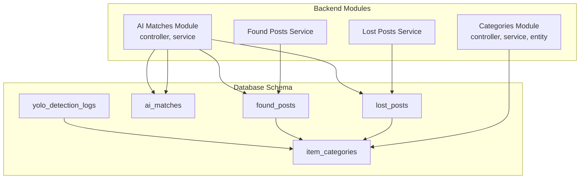
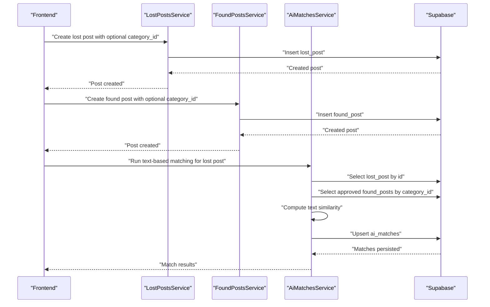
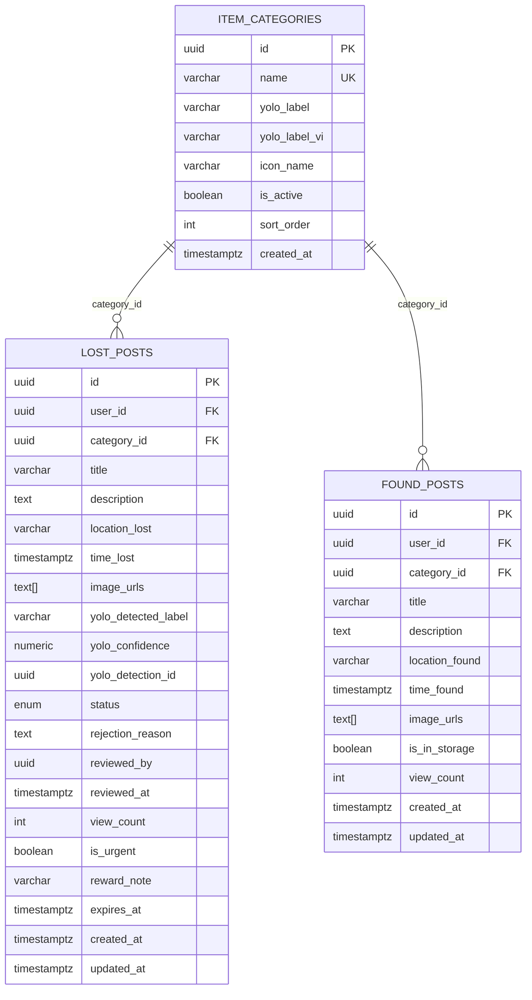
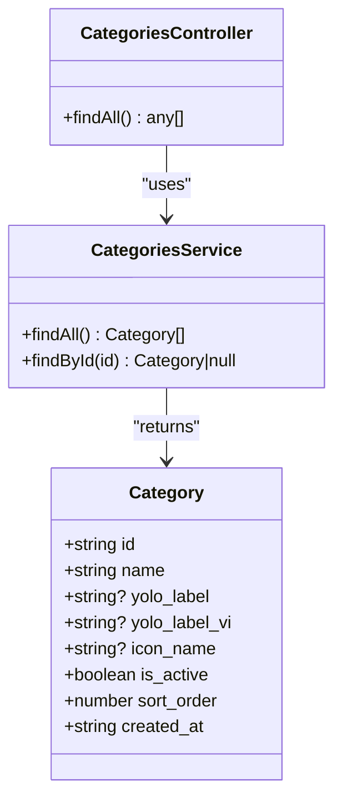
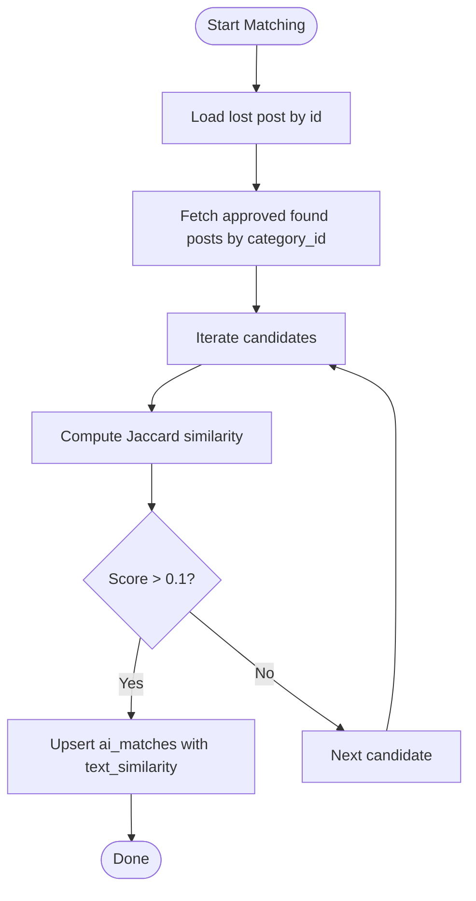
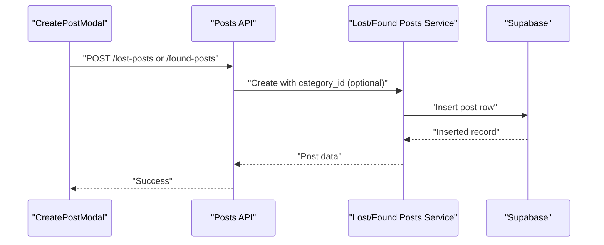
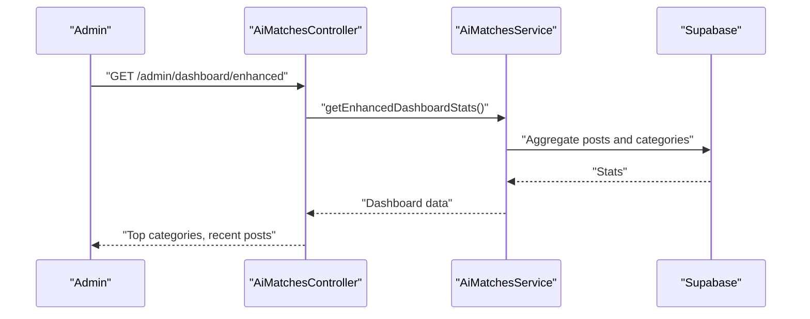
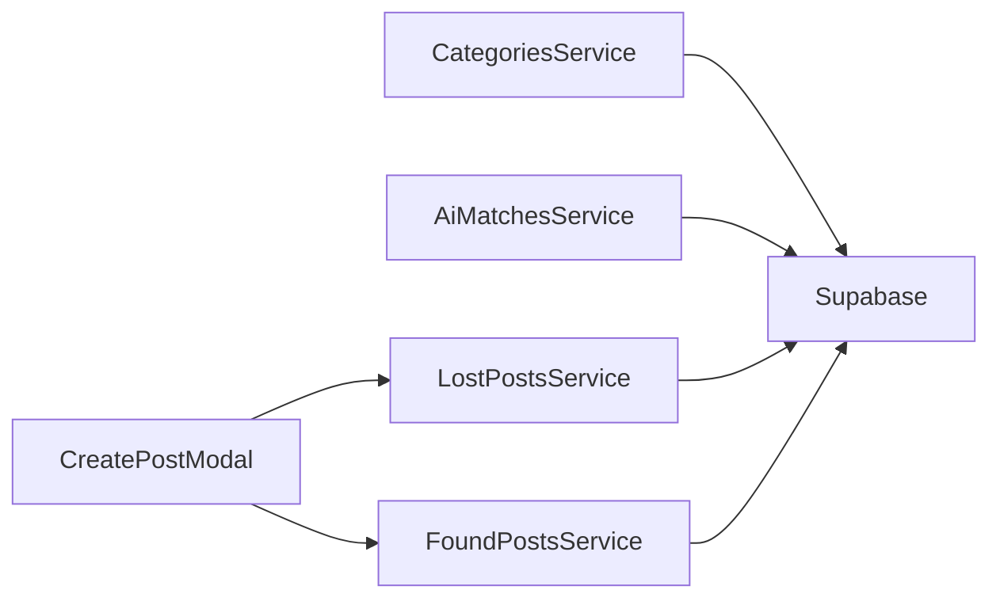

# Categories System

<cite>
**Referenced Files in This Document**
- [category.entity.ts](file://backend/src/modules/categories/entities/category.entity.ts)
- [categories.service.ts](file://backend/src/modules/categories/categories.service.ts)
- [categories.controller.ts](file://backend/src/modules/categories/categories.controller.ts)
- [categories.module.ts](file://backend/src/modules/categories/categories.module.ts)
- [ai-matches.service.ts](file://backend/src/modules/ai-matches/ai-matches.service.ts)
- [ai-matches.controller.ts](file://backend/src/modules/ai-matches/ai-matches.controller.ts)
- [lost-posts.service.ts](file://backend/src/modules/lost-posts/lost-posts.service.ts)
- [found-posts.service.ts](file://backend/src/modules/found-posts/found-posts.service.ts)
- [OVERVIEW.md](file://OVERVIEW.md)
- [CreatePostModal.tsx](file://frontend/app/components/CreatePostModal.tsx)
</cite>

## Table of Contents
1. [Introduction](#introduction)
2. [Project Structure](#project-structure)
3. [Core Components](#core-components)
4. [Architecture Overview](#architecture-overview)
5. [Detailed Component Analysis](#detailed-component-analysis)
6. [Dependency Analysis](#dependency-analysis)
7. [Performance Considerations](#performance-considerations)
8. [Troubleshooting Guide](#troubleshooting-guide)
9. [Conclusion](#conclusion)

## Introduction
This document describes the Categories System that powers item classification and categorization in the platform. It covers:
- Category entity structure and relationships with posts
- Category hierarchy and parent-child relationships (as currently modeled)
- Classification rules and category selection during post creation
- AI-based categorization integration with YOLO object detection and text similarity
- Manual override capabilities for administrators and category management workflows
- Indexing strategies and performance characteristics
- Concrete examples of category creation, assignment, and dynamic updates
- Integration with the AI Matching system for improved post pairing accuracy
- Common issues and maintenance procedures

## Project Structure
The Categories System spans backend NestJS modules and shared database schema definitions:
- Backend module: categories (entity, service, controller, module)
- Backend module: ai-matches (service, controller)
- Backend modules: lost-posts and found-posts (services)
- Frontend: CreatePostModal integrates category selection during post creation
- Database schema: item_categories, yolo_detection_logs, ai_matches, and related indexes

**Diagram sources**
- [categories.controller.ts:1-18](file://backend/src/modules/categories/categories.controller.ts#L1-L18)
- [categories.service.ts:1-32](file://backend/src/modules/categories/categories.service.ts#L1-L32)
- [ai-matches.controller.ts:1-72](file://backend/src/modules/ai-matches/ai-matches.controller.ts#L1-L72)
- [ai-matches.service.ts:1-367](file://backend/src/modules/ai-matches/ai-matches.service.ts#L1-L367)
- [lost-posts.service.ts:1-189](file://backend/src/modules/lost-posts/lost-posts.service.ts#L1-L189)
- [found-posts.service.ts:1-162](file://backend/src/modules/found-posts/found-posts.service.ts#L1-L162)
- [OVERVIEW.md:140-175](file://OVERVIEW.md#L140-L175)
- [OVERVIEW.md:191-232](file://OVERVIEW.md#L191-L232)
- [OVERVIEW.md:314-345](file://OVERVIEW.md#L314-L345)

**Section sources**
- [categories.controller.ts:1-18](file://backend/src/modules/categories/categories.controller.ts#L1-L18)
- [categories.service.ts:1-32](file://backend/src/modules/categories/categories.service.ts#L1-L32)
- [categories.module.ts:1-11](file://backend/src/modules/categories/categories.module.ts#L1-L11)
- [OVERVIEW.md:140-175](file://OVERVIEW.md#L140-L175)
- [OVERVIEW.md:191-232](file://OVERVIEW.md#L191-L232)
- [OVERVIEW.md:314-345](file://OVERVIEW.md#L314-L345)

## Core Components
- Category entity: Defines category metadata including identifiers, labels, icons, activation flag, sorting order, and creation timestamp.
- Categories service: Provides category retrieval (all active categories ordered by sort order) and lookup by ID.
- Categories controller: Exposes a public endpoint to fetch categories.
- AI Matches service: Implements text-based matching between lost and found posts within the same category, computing similarity scores and persisting matches.
- Lost/Foud posts services: Persist posts with optional category assignments and expose category-aware queries.
- Frontend CreatePostModal: Allows users to select a category when posting.

Key implementation references:
- Category entity definition and fields
- Categories service methods for listing and fetching categories
- AI Matches service text similarity computation and match persistence
- Lost/Foud posts services category filtering and selection
- Frontend category selection during post creation

**Section sources**
- [category.entity.ts:1-11](file://backend/src/modules/categories/entities/category.entity.ts#L1-L11)
- [categories.service.ts:10-30](file://backend/src/modules/categories/categories.service.ts#L10-L30)
- [categories.controller.ts:11-16](file://backend/src/modules/categories/categories.controller.ts#L11-L16)
- [ai-matches.service.ts:15-96](file://backend/src/modules/ai-matches/ai-matches.service.ts#L15-L96)
- [lost-posts.service.ts:45-73](file://backend/src/modules/lost-posts/lost-posts.service.ts#L45-L73)
- [found-posts.service.ts:40-67](file://backend/src/modules/found-posts/found-posts.service.ts#L40-L67)
- [CreatePostModal.tsx:28-206](file://frontend/app/components/CreatePostModal.tsx#L28-L206)

## Architecture Overview
The Categories System integrates with post lifecycle and AI Matching:
- Categories are stored in item_categories with optional YOLO labels for automated suggestions.
- Posts (lost and found) reference categories via category_id.
- AI Matching runs text similarity within the same category to propose matches.
- Administrators can review and manage posts and access dashboards.

**Diagram sources**
- [lost-posts.service.ts:19-43](file://backend/src/modules/lost-posts/lost-posts.service.ts#L19-L43)
- [found-posts.service.ts:19-38](file://backend/src/modules/found-posts/found-posts.service.ts#L19-L38)
- [ai-matches.service.ts:45-96](file://backend/src/modules/ai-matches/ai-matches.service.ts#L45-L96)
- [CreatePostModal.tsx:196-222](file://frontend/app/components/CreatePostModal.tsx#L196-L222)

## Detailed Component Analysis

### Category Entity and Relationships
- Category fields include identifiers, localized labels, optional YOLO labels, icon name, activation flag, sort order, and creation timestamp.
- Posts reference categories via category_id, enabling category-aware queries and filtering.
- The seed data maps common YOLO COCO labels to categories, supporting automated suggestions.

**Diagram sources**
- [OVERVIEW.md:140-175](file://OVERVIEW.md#L140-L175)
- [OVERVIEW.md:191-232](file://OVERVIEW.md#L191-L232)

**Section sources**
- [category.entity.ts:1-11](file://backend/src/modules/categories/entities/category.entity.ts#L1-L11)
- [OVERVIEW.md:140-175](file://OVERVIEW.md#L140-L175)
- [OVERVIEW.md:191-232](file://OVERVIEW.md#L191-L232)

### Categories Module
- Controller exposes a public endpoint to list categories.
- Service retrieves active categories ordered by sort order and supports lookup by ID.

**Diagram sources**
- [categories.controller.ts:11-16](file://backend/src/modules/categories/categories.controller.ts#L11-L16)
- [categories.service.ts:10-30](file://backend/src/modules/categories/categories.service.ts#L10-L30)
- [category.entity.ts:1-11](file://backend/src/modules/categories/entities/category.entity.ts#L1-L11)

**Section sources**
- [categories.controller.ts:11-16](file://backend/src/modules/categories/categories.controller.ts#L11-L16)
- [categories.service.ts:10-30](file://backend/src/modules/categories/categories.service.ts#L10-L30)

### AI-Based Categorization and Matching
- Text similarity matching: The AI Matches service computes a Jaccard-based similarity between lost and found posts within the same category and persists matches with scores and method.
- YOLO integration: The schema defines YOLO detection logs with raw detections and matched categories, enabling future improvements to automatic labeling and suggestions.

**Diagram sources**
- [ai-matches.service.ts:45-96](file://backend/src/modules/ai-matches/ai-matches.service.ts#L45-L96)
- [ai-matches.service.ts:144-153](file://backend/src/modules/ai-matches/ai-matches.service.ts#L144-L153)

**Section sources**
- [ai-matches.service.ts:15-96](file://backend/src/modules/ai-matches/ai-matches.service.ts#L15-L96)
- [OVERVIEW.md:165-175](file://OVERVIEW.md#L165-L175)
- [OVERVIEW.md:314-345](file://OVERVIEW.md#L314-L345)

### Post Creation and Category Assignment
- Frontend modal collects category_id along with other post fields and sends it to the backend.
- Backend services insert posts with category_id when provided, enabling category-aware queries and matching.

**Diagram sources**
- [CreatePostModal.tsx:196-222](file://frontend/app/components/CreatePostModal.tsx#L196-L222)
- [lost-posts.service.ts:19-43](file://backend/src/modules/lost-posts/lost-posts.service.ts#L19-L43)
- [found-posts.service.ts:19-38](file://backend/src/modules/found-posts/found-posts.service.ts#L19-L38)

**Section sources**
- [CreatePostModal.tsx:28-206](file://frontend/app/components/CreatePostModal.tsx#L28-L206)
- [lost-posts.service.ts:19-43](file://backend/src/modules/lost-posts/lost-posts.service.ts#L19-L43)
- [found-posts.service.ts:19-38](file://backend/src/modules/found-posts/found-posts.service.ts#L19-L38)

### Manual Override and Administrator Workflows
- Administrators can review posts and change statuses, which indirectly affects category visibility and matching eligibility.
- The AI Matches controller exposes admin endpoints for dashboard statistics and post listings, enabling oversight of category distribution and activity.

**Diagram sources**
- [ai-matches.controller.ts:50-56](file://backend/src/modules/ai-matches/ai-matches.controller.ts#L50-L56)
- [ai-matches.service.ts:185-274](file://backend/src/modules/ai-matches/ai-matches.service.ts#L185-L274)

**Section sources**
- [ai-matches.controller.ts:42-70](file://backend/src/modules/ai-matches/ai-matches.controller.ts#L42-L70)
- [ai-matches.service.ts:185-274](file://backend/src/modules/ai-matches/ai-matches.service.ts#L185-L274)

## Dependency Analysis
- Categories module depends on Supabase client for database operations.
- AI Matches module depends on Supabase client and uses category-aware queries to compute matches.
- Lost/Foud posts services depend on Supabase client and leverage category_id for filtering and selection.
- Frontend relies on categories endpoint and category selection in the post creation modal.

**Diagram sources**
- [categories.service.ts:6-8](file://backend/src/modules/categories/categories.service.ts#L6-L8)
- [ai-matches.service.ts:7-9](file://backend/src/modules/ai-matches/ai-matches.service.ts#L7-L9)
- [lost-posts.service.ts:15-17](file://backend/src/modules/lost-posts/lost-posts.service.ts#L15-L17)
- [found-posts.service.ts:15-17](file://backend/src/modules/found-posts/found-posts.service.ts#L15-L17)
- [CreatePostModal.tsx:196-222](file://frontend/app/components/CreatePostModal.tsx#L196-L222)

**Section sources**
- [categories.service.ts:6-8](file://backend/src/modules/categories/categories.service.ts#L6-L8)
- [ai-matches.service.ts:7-9](file://backend/src/modules/ai-matches/ai-matches.service.ts#L7-L9)
- [lost-posts.service.ts:15-17](file://backend/src/modules/lost-posts/lost-posts.service.ts#L15-L17)
- [found-posts.service.ts:15-17](file://backend/src/modules/found-posts/found-posts.service.ts#L15-L17)
- [CreatePostModal.tsx:196-222](file://frontend/app/components/CreatePostModal.tsx#L196-L222)

## Performance Considerations
- Category retrieval: Active categories are fetched with an index on is_active and sorted by sort_order, ensuring efficient ordering.
- Post queries: Category-aware queries on lost_posts and found_posts use category_id indexes, improving filter performance.
- AI Matching: Text similarity computation is O(n) per candidate; limiting candidates by category reduces workload.
- Indexes: Additional indexes exist for full-text search and status filtering to support scalable queries.

Recommendations:
- Keep category lists small and well-ordered to minimize UI rendering overhead.
- Use category_id filtering to reduce candidate sets for matching.
- Monitor ai_matches scoring and thresholds to balance precision and recall.

**Section sources**
- [categories.service.ts:10-19](file://backend/src/modules/categories/categories.service.ts#L10-L19)
- [OVERVIEW.md:227-232](file://OVERVIEW.md#L227-L232)
- [OVERVIEW.md:342-345](file://OVERVIEW.md#L342-L345)
- [ai-matches.service.ts:45-96](file://backend/src/modules/ai-matches/ai-matches.service.ts#L45-L96)

## Troubleshooting Guide
Common issues and resolutions:
- Category ambiguity or misclassification
  - Symptom: Posts misclassified under unexpected categories.
  - Resolution: Use category_id overrides during post creation; verify category_id is included in post creation payload.
  - References: Category selection in frontend modal and backend post creation services.

- Missing category in results
  - Symptom: Category list appears empty or inactive categories are missing.
  - Resolution: Ensure is_active is true and sort_order is set appropriately; verify categories endpoint returns active categories.
  - References: Categories service active filtering and ordering.

- Slow matching performance
  - Symptom: Matching takes long with many candidates.
  - Resolution: Filter candidates by category_id; adjust similarity threshold to reduce upsert volume.
  - References: Category-aware matching and similarity computation.

- Admin dashboard anomalies
  - Symptom: Dashboard shows incorrect category counts or missing categories.
  - Resolution: Validate category_id presence on posts; ensure category seeding is applied.
  - References: Enhanced dashboard aggregation and seed data.

**Section sources**
- [CreatePostModal.tsx:196-222](file://frontend/app/components/CreatePostModal.tsx#L196-L222)
- [lost-posts.service.ts:19-43](file://backend/src/modules/lost-posts/lost-posts.service.ts#L19-L43)
- [found-posts.service.ts:19-38](file://backend/src/modules/found-posts/found-posts.service.ts#L19-L38)
- [categories.service.ts:10-19](file://backend/src/modules/categories/categories.service.ts#L10-L19)
- [ai-matches.service.ts:45-96](file://backend/src/modules/ai-matches/ai-matches.service.ts#L45-L96)
- [OVERVIEW.md:151-163](file://OVERVIEW.md#L151-L163)

## Conclusion
The Categories System provides a robust foundation for item classification with:
- Clear category entity structure and relationships with posts
- Category-aware queries and filtering
- AI-driven text similarity matching within categories
- Optional YOLO integration for automated suggestions
- Administrative oversight and manual override capabilities

By leveraging category_id in post creation and matching, the system improves post pairing accuracy and enables efficient administration and maintenance workflows.