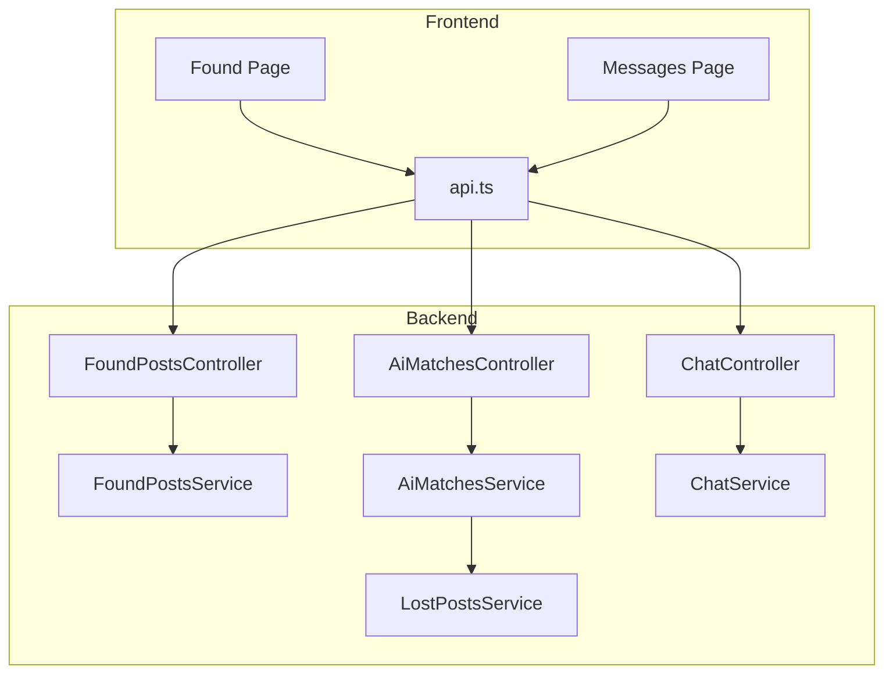
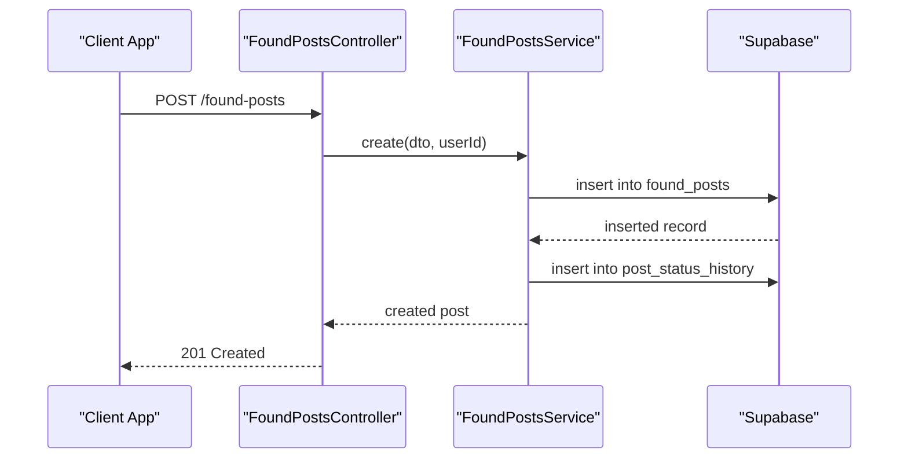
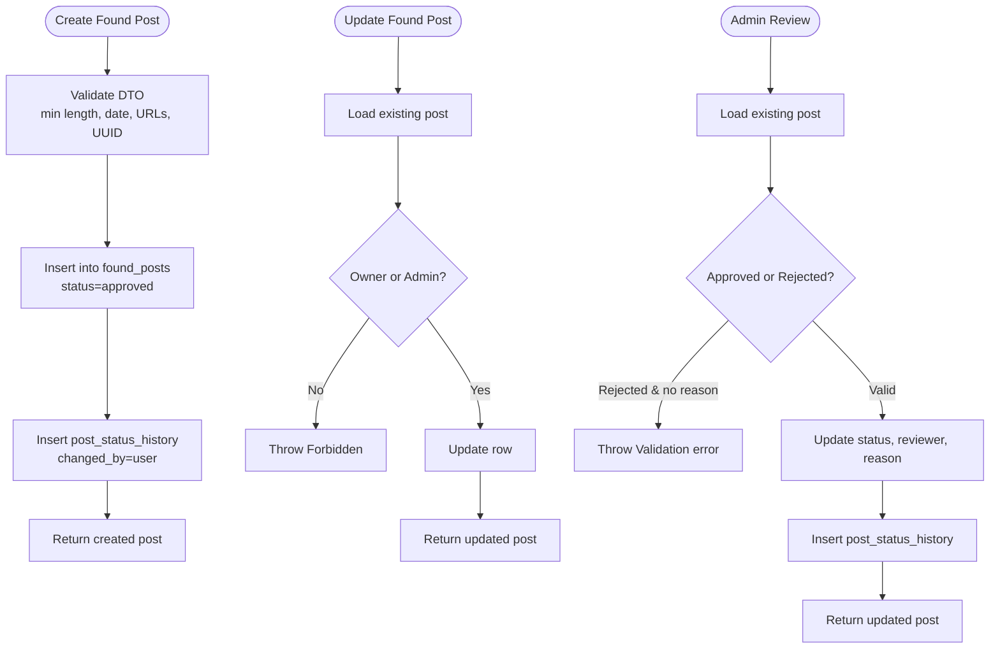
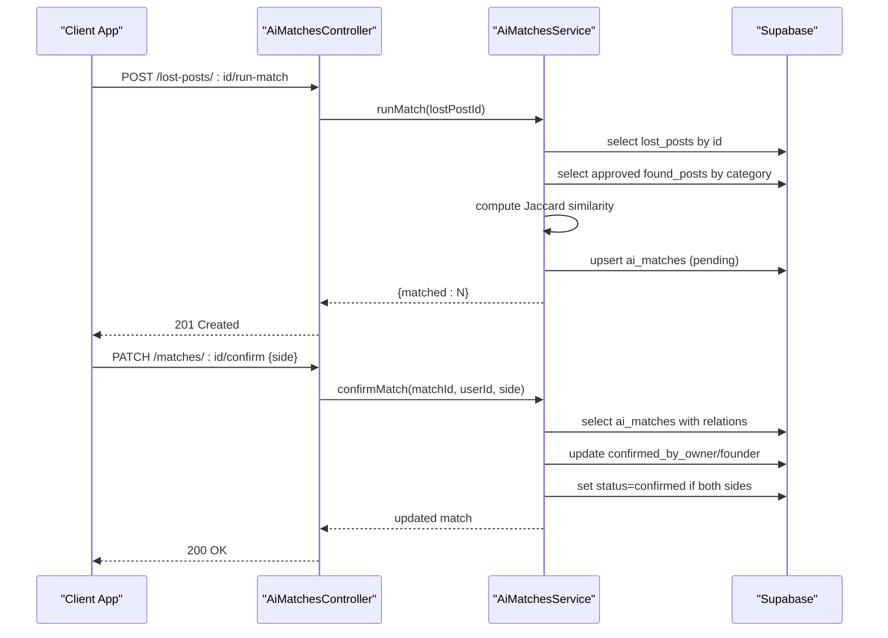
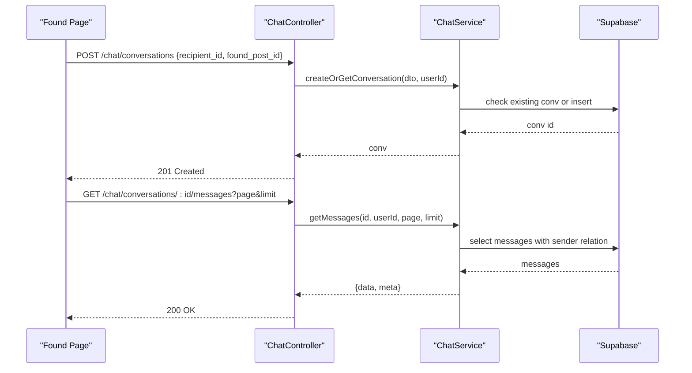
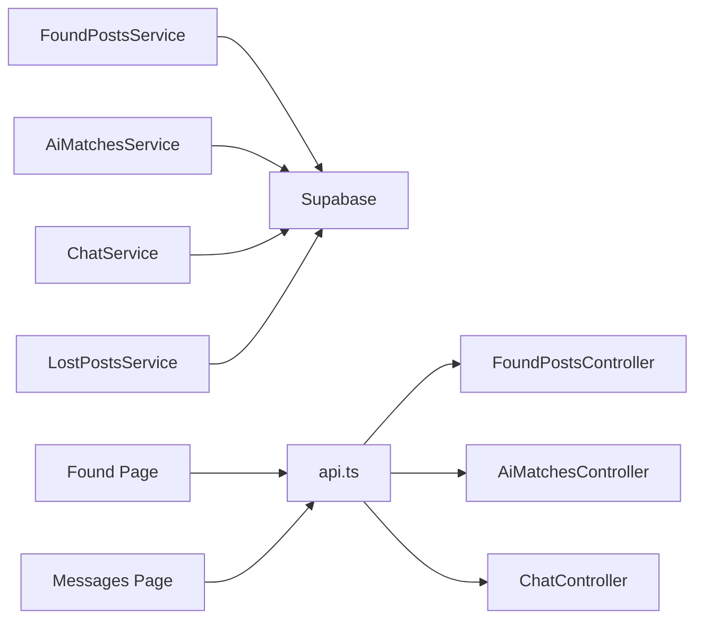

# Found Posts System

<cite>
**Referenced Files in This Document**
- [found-posts.controller.ts](file://backend/src/modules/found-posts/found-posts.controller.ts)
- [found-posts.service.ts](file://backend/src/modules/found-posts/found-posts.service.ts)
- [create-found-post.dto.ts](file://backend/src/modules/found-posts/dto/create-found-post.dto.ts)
- [update-found-post.dto.ts](file://backend/src/modules/found-posts/dto/update-found-post.dto.ts)
- [query-found-posts.dto.ts](file://backend/src/modules/found-posts/dto/query-found-posts.dto.ts)
- [ai-matches.service.ts](file://backend/src/modules/ai-matches/ai-matches.service.ts)
- [ai-matches.controller.ts](file://backend/src/modules/ai-matches/ai-matches.controller.ts)
- [chat.service.ts](file://backend/src/modules/chat/chat.service.ts)
- [chat.controller.ts](file://backend/src/modules/chat/chat.controller.ts)
- [lost-posts.service.ts](file://backend/src/modules/lost-posts/lost-posts.service.ts)
- [review-post.dto.ts](file://backend/src/modules/lost-posts/dto/review-post.dto.ts)
- [page.tsx](file://frontend/app/found/page.tsx)
- [api.ts](file://frontend/app/lib/api.ts)
- [page.tsx](file://frontend/app/messages/page.tsx)
</cite>

## Table of Contents
1. [Introduction](#introduction)
2. [Project Structure](#project-structure)
3. [Core Components](#core-components)
4. [Architecture Overview](#architecture-overview)
5. [Detailed Component Analysis](#detailed-component-analysis)
6. [Dependency Analysis](#dependency-analysis)
7. [Performance Considerations](#performance-considerations)
8. [Troubleshooting Guide](#troubleshooting-guide)
9. [Conclusion](#conclusion)
10. [Appendices](#appendices)

## Introduction
This document describes the Found Posts System end-to-end, covering the complete lifecycle of reporting found items. It documents:
- Post creation workflow: item description, location details, and submission
- Approval process: verification steps, admin review criteria, and status management
- Query system: filtering by location, date, and item type
- Relationship with AI matching algorithms for connecting found items with lost posts
- Integration with the chat system for communication between finder and owner
- Concrete examples of API usage for POST /found-posts, PUT /found-posts/:id, and GET /found-posts
- Common issues and mitigations

## Project Structure
The Found Posts System spans backend NestJS modules and frontend React components:
- Backend modules:
  - Found Posts: controller, service, and DTOs
  - AI Matches: matching engine and admin dashboards
  - Chat: messaging between parties
  - Lost Posts: complementary system for lost items and admin review
- Frontend pages:
  - Found feed page and messaging page integrate with backend APIs

**Diagram sources**
- [found-posts.controller.ts:24-77](file://backend/src/modules/found-posts/found-posts.controller.ts#L24-L77)
- [found-posts.service.ts:19-161](file://backend/src/modules/found-posts/found-posts.service.ts#L19-L161)
- [ai-matches.controller.ts:24-71](file://backend/src/modules/ai-matches/ai-matches.controller.ts#L24-L71)
- [ai-matches.service.ts:15-96](file://backend/src/modules/ai-matches/ai-matches.service.ts#L15-L96)
- [chat.controller.ts:15-48](file://backend/src/modules/chat/chat.controller.ts#L15-L48)
- [chat.service.ts:12-151](file://backend/src/modules/chat/chat.service.ts#L12-L151)
- [lost-posts.service.ts:19-189](file://backend/src/modules/lost-posts/lost-posts.service.ts#L19-L189)
- [page.tsx:82-126](file://frontend/app/found/page.tsx#L82-L126)
- [page.tsx:40-106](file://frontend/app/messages/page.tsx#L40-L106)
- [api.ts:12-43](file://frontend/app/lib/api.ts#L12-L43)

**Section sources**
- [found-posts.controller.ts:1-78](file://backend/src/modules/found-posts/found-posts.controller.ts#L1-L78)
- [found-posts.service.ts:1-162](file://backend/src/modules/found-posts/found-posts.service.ts#L1-L162)
- [ai-matches.controller.ts:1-72](file://backend/src/modules/ai-matches/ai-matches.controller.ts#L1-L72)
- [ai-matches.service.ts:1-367](file://backend/src/modules/ai-matches/ai-matches.service.ts#L1-L367)
- [chat.controller.ts:1-50](file://backend/src/modules/chat/chat.controller.ts#L1-L50)
- [chat.service.ts:1-151](file://backend/src/modules/chat/chat.service.ts#L1-L151)
- [lost-posts.service.ts:1-189](file://backend/src/modules/lost-posts/lost-posts.service.ts#L1-L189)
- [page.tsx:1-405](file://frontend/app/found/page.tsx#L1-L405)
- [page.tsx:1-180](file://frontend/app/messages/page.tsx#L1-L180)
- [api.ts:1-83](file://frontend/app/lib/api.ts#L1-L83)

## Core Components
- FoundPostsController: Exposes REST endpoints for creating, querying, updating, deleting, and admin reviewing found posts.
- FoundPostsService: Implements business logic for CRUD, status transitions, and admin review with audit logging.
- DTOs: Strongly typed request/response contracts for create, update, and query operations.
- AI Matches: Text-based matching engine that connects found posts with relevant lost posts.
- Chat: Messaging module enabling finder-owner communication.
- LostPostsService: Provides complementary admin review and status management for lost posts.

Key capabilities:
- Create a found post with title, description, location, time, optional images, category, and storage flag
- Query approved found posts with pagination, category filter, and text search
- Update or delete posts with ownership/admin checks
- Admin review to approve or reject posts with reason logging
- AI-driven suggestions linking found posts to lost posts
- Chat integration for initiating conversations between finder and owner

**Section sources**
- [found-posts.controller.ts:24-77](file://backend/src/modules/found-posts/found-posts.controller.ts#L24-L77)
- [found-posts.service.ts:19-161](file://backend/src/modules/found-posts/found-posts.service.ts#L19-L161)
- [create-found-post.dto.ts:7-47](file://backend/src/modules/found-posts/dto/create-found-post.dto.ts#L7-L47)
- [update-found-post.dto.ts:1-5](file://backend/src/modules/found-posts/dto/update-found-post.dto.ts#L1-L5)
- [query-found-posts.dto.ts:5-35](file://backend/src/modules/found-posts/dto/query-found-posts.dto.ts#L5-L35)
- [ai-matches.service.ts:15-96](file://backend/src/modules/ai-matches/ai-matches.service.ts#L15-L96)
- [chat.service.ts:12-151](file://backend/src/modules/chat/chat.service.ts#L12-L151)
- [lost-posts.service.ts:139-189](file://backend/src/modules/lost-posts/lost-posts.service.ts#L139-L189)

## Architecture Overview
The system follows a layered architecture:
- Controllers orchestrate requests and delegate to services
- Services encapsulate domain logic and interact with Supabase
- DTOs enforce validation and document API contracts
- Frontend pages consume REST endpoints and real-time channels

**Diagram sources**
- [found-posts.controller.ts:24-28](file://backend/src/modules/found-posts/found-posts.controller.ts#L24-L28)
- [found-posts.service.ts:19-38](file://backend/src/modules/found-posts/found-posts.service.ts#L19-L38)

## Detailed Component Analysis

### Found Posts Lifecycle
- Creation: Title and description minimum lengths enforced; location and time required; optional category, images, contact info, and storage flag.
- Querying: Pagination, category filter, and text search on title; defaults to approved posts.
- Ownership and permissions: Updates and deletes require ownership or admin role.
- Admin review: Approve or reject with optional reason; logs status change with actor and note.

**Diagram sources**
- [create-found-post.dto.ts:7-47](file://backend/src/modules/found-posts/dto/create-found-post.dto.ts#L7-L47)
- [found-posts.service.ts:19-38](file://backend/src/modules/found-posts/found-posts.service.ts#L19-L38)
- [found-posts.service.ts:96-105](file://backend/src/modules/found-posts/found-posts.service.ts#L96-L105)
- [found-posts.service.ts:117-145](file://backend/src/modules/found-posts/found-posts.service.ts#L117-L145)

**Section sources**
- [create-found-post.dto.ts:7-47](file://backend/src/modules/found-posts/dto/create-found-post.dto.ts#L7-L47)
- [query-found-posts.dto.ts:5-35](file://backend/src/modules/found-posts/dto/query-found-posts.dto.ts#L5-L35)
- [found-posts.service.ts:19-161](file://backend/src/modules/found-posts/found-posts.service.ts#L19-L161)

### AI Matching Integration
AI matching connects found posts with relevant lost posts:
- Text similarity (Jaccard) computed between combined title and description
- Only approved found posts considered as candidates
- Matches stored with confidence scores and pending status
- Owner or finder can confirm a match; mutual confirmation sets status to confirmed

**Diagram sources**
- [ai-matches.controller.ts:30-40](file://backend/src/modules/ai-matches/ai-matches.controller.ts#L30-L40)
- [ai-matches.service.ts:45-96](file://backend/src/modules/ai-matches/ai-matches.service.ts#L45-L96)
- [ai-matches.service.ts:101-141](file://backend/src/modules/ai-matches/ai-matches.service.ts#L101-L141)

**Section sources**
- [ai-matches.controller.ts:24-40](file://backend/src/modules/ai-matches/ai-matches.controller.ts#L24-L40)
- [ai-matches.service.ts:15-96](file://backend/src/modules/ai-matches/ai-matches.service.ts#L15-L96)
- [ai-matches.service.ts:101-141](file://backend/src/modules/ai-matches/ai-matches.service.ts#L101-L141)

### Chat Integration
The chat system enables finder-owner communication:
- Create or retrieve a conversation linked to a found post
- Retrieve paginated messages and mark unread as read
- Send messages with content or image
- Frontend polls conversations and uses Supabase real-time for instant updates

**Diagram sources**
- [chat.controller.ts:21-42](file://backend/src/modules/chat/chat.controller.ts#L21-L42)
- [chat.service.ts:38-100](file://backend/src/modules/chat/chat.service.ts#L38-L100)
- [page.tsx:61-80](file://frontend/app/found/page.tsx#L61-L80)
- [page.tsx:64-106](file://frontend/app/messages/page.tsx#L64-L106)

**Section sources**
- [chat.controller.ts:15-48](file://backend/src/modules/chat/chat.controller.ts#L15-L48)
- [chat.service.ts:12-151](file://backend/src/modules/chat/chat.service.ts#L12-L151)
- [page.tsx:61-80](file://frontend/app/found/page.tsx#L61-L80)
- [page.tsx:64-106](file://frontend/app/messages/page.tsx#L64-L106)

### API Examples

- POST /found-posts
  - Purpose: Create a new found post
  - Authentication: Required (Bearer token)
  - Body: CreateFoundPostDto (title, description, location_found, time_found, optional category_id, image_urls, contact_info, is_in_storage)
  - Response: 201 Created with the created post object

- PUT /found-posts/:id
  - Purpose: Update an existing found post
  - Authentication: Required (Bearer token)
  - Permissions: Must be owner or admin
  - Body: UpdateFoundPostDto (partial fields)
  - Response: 200 OK with updated post

- GET /found-posts
  - Purpose: Query found posts feed
  - Authentication: Optional (Public endpoint)
  - Query params: status (default approved), category_id, search, page (default 1), limit (default 20, max 100)
  - Response: Paginated result with data and meta

- GET /found-posts/my
  - Purpose: Get my found posts
  - Authentication: Required (Bearer token)
  - Response: Array of found posts owned by the user

- GET /found-posts/:id
  - Purpose: Get a single found post by ID
  - Authentication: Optional (Public endpoint)
  - Response: Found post with user and category relations; view_count incremented

- DELETE /found-posts/:id
  - Purpose: Delete a found post
  - Authentication: Required (Bearer token)
  - Permissions: Must be owner or admin
  - Response: 200 OK with deletion message

- GET /admin/found-posts/pending
  - Purpose: Admin-only list of pending found posts
  - Authentication: Required (Bearer token)
  - Roles: admin
  - Response: Array of pending posts with user and category

- POST /admin/found-posts/:id/review
  - Purpose: Admin review (approve or reject)
  - Authentication: Required (Bearer token)
  - Roles: admin
  - Body: ReviewPostDto (action: approved or rejected, optional reason)
  - Response: Updated post with status and reviewer metadata

**Section sources**
- [found-posts.controller.ts:24-77](file://backend/src/modules/found-posts/found-posts.controller.ts#L24-L77)
- [found-posts.service.ts:40-161](file://backend/src/modules/found-posts/found-posts.service.ts#L40-L161)
- [review-post.dto.ts:4-13](file://backend/src/modules/lost-posts/dto/review-post.dto.ts#L4-L13)

### Frontend Integration
- Found feed page:
  - Loads approved found posts with pagination
  - Initiates chat with the post owner by creating a conversation linked to the found post
- Messages page:
  - Lists conversations, fetches messages, supports sending text or image messages
  - Uses Supabase real-time for live updates

**Section sources**
- [page.tsx:82-126](file://frontend/app/found/page.tsx#L82-L126)
- [page.tsx:40-106](file://frontend/app/messages/page.tsx#L40-L106)
- [api.ts:12-43](file://frontend/app/lib/api.ts#L12-L43)

## Dependency Analysis
- FoundPostsService depends on Supabase client and uses post_status_history for audit trails
- AiMatchesService depends on FoundPostsService data and LostPostsService for admin dashboards
- ChatService depends on conversations and messages tables; integrates with Supabase real-time
- Frontend pages depend on api.ts for authenticated requests and environment variables for base URL

**Diagram sources**
- [found-posts.service.ts:15-17](file://backend/src/modules/found-posts/found-posts.service.ts#L15-L17)
- [ai-matches.service.ts:7-9](file://backend/src/modules/ai-matches/ai-matches.service.ts#L7-L9)
- [chat.service.ts:8-10](file://backend/src/modules/chat/chat.service.ts#L8-L10)
- [lost-posts.service.ts:15-17](file://backend/src/modules/lost-posts/lost-posts.service.ts#L15-L17)
- [page.tsx:82-126](file://frontend/app/found/page.tsx#L82-L126)
- [page.tsx:40-106](file://frontend/app/messages/page.tsx#L40-L106)
- [api.ts:12-43](file://frontend/app/lib/api.ts#L12-L43)

**Section sources**
- [found-posts.service.ts:15-17](file://backend/src/modules/found-posts/found-posts.service.ts#L15-L17)
- [ai-matches.service.ts:7-9](file://backend/src/modules/ai-matches/ai-matches.service.ts#L7-L9)
- [chat.service.ts:8-10](file://backend/src/modules/chat/chat.service.ts#L8-L10)
- [lost-posts.service.ts:15-17](file://backend/src/modules/lost-posts/lost-posts.service.ts#L15-L17)
- [page.tsx:82-126](file://frontend/app/found/page.tsx#L82-L126)
- [page.tsx:40-106](file://frontend/app/messages/page.tsx#L40-L106)
- [api.ts:12-43](file://frontend/app/lib/api.ts#L12-L43)

## Performance Considerations
- Pagination: Queries support page and limit with a maximum limit to prevent oversized payloads
- Indexing: Ensure database indexes on status, created_at, category_id, and text search columns
- Denormalization: Selecting related user and category data in a single query reduces round-trips
- Real-time updates: Supabase real-time minimizes polling overhead for chat
- Matching cost: Text similarity runs against approved candidates; consider batching or rate limiting for large datasets

[No sources needed since this section provides general guidance]

## Troubleshooting Guide
Common issues and resolutions:
- False positives in AI matching:
  - Improve text preprocessing (normalize case, remove stop words)
  - Increase similarity threshold or add category gating
  - Allow owner/founder to reject matches
- Incomplete descriptions:
  - Enforce minimum length validation on title and description during creation
  - Provide UI hints for richer descriptions
- Location verification challenges:
  - Encourage precise location formatting and timestamps
  - Use map previews or geocoding in future enhancements
- Permission errors:
  - Ensure JWT bearer token is present and valid
  - Verify user role for admin endpoints
- Chat errors:
  - Validate content or image presence before sending
  - Ensure participants are part of the conversation

**Section sources**
- [create-found-post.dto.ts:10-17](file://backend/src/modules/found-posts/dto/create-found-post.dto.ts#L10-L17)
- [ai-matches.service.ts:77-87](file://backend/src/modules/ai-matches/ai-matches.service.ts#L77-L87)
- [chat.service.ts:103-105](file://backend/src/modules/chat/chat.service.ts#L103-L105)

## Conclusion
The Found Posts System provides a robust, secure, and scalable foundation for reporting found items. It enforces strong validation, supports admin oversight, integrates AI matching for efficient connections with lost posts, and offers seamless chat communication. The frontend pages demonstrate practical usage of the APIs, while the backend services ensure data integrity and auditability.

[No sources needed since this section summarizes without analyzing specific files]

## Appendices

### API Reference Summary
- POST /found-posts: Create a found post
- GET /found-posts: Query approved found posts with pagination and filters
- GET /found-posts/my: Get user’s found posts
- GET /found-posts/:id: Get a found post by ID
- PATCH /found-posts/:id: Update a found post
- DELETE /found-posts/:id: Delete a found post
- GET /admin/found-posts/pending: Admin-only pending list
- POST /admin/found-posts/:id/review: Admin review with action and reason

**Section sources**
- [found-posts.controller.ts:24-77](file://backend/src/modules/found-posts/found-posts.controller.ts#L24-L77)