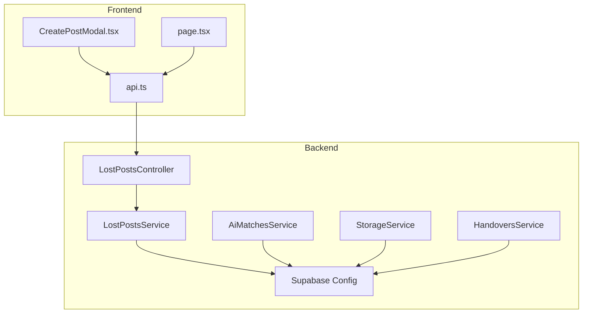
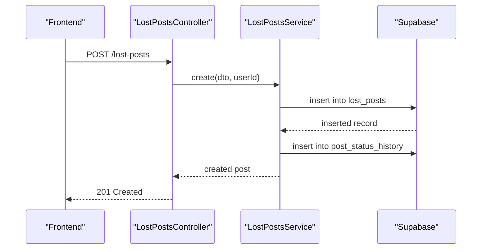
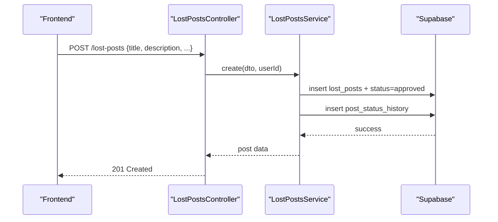
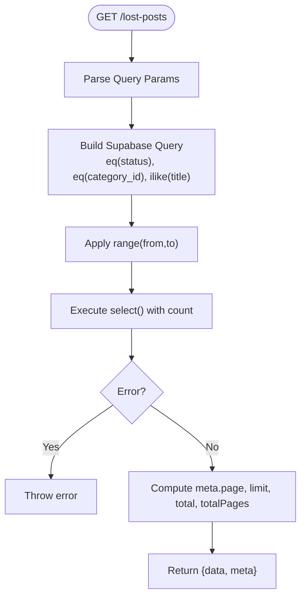
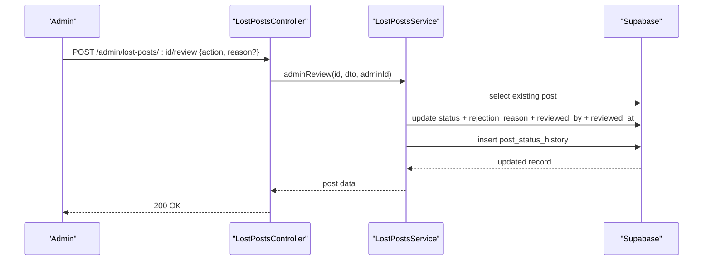
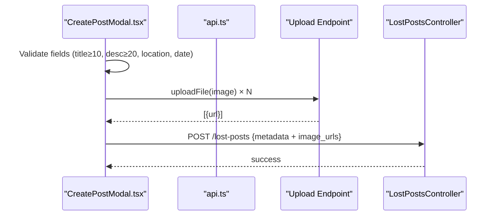
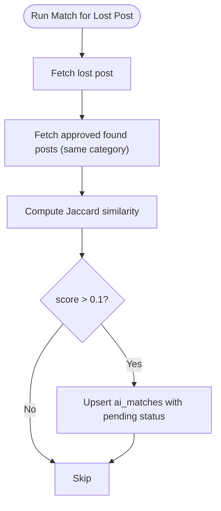
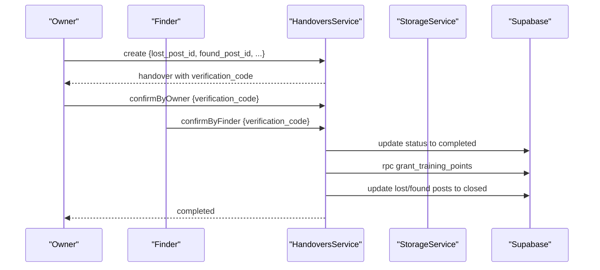
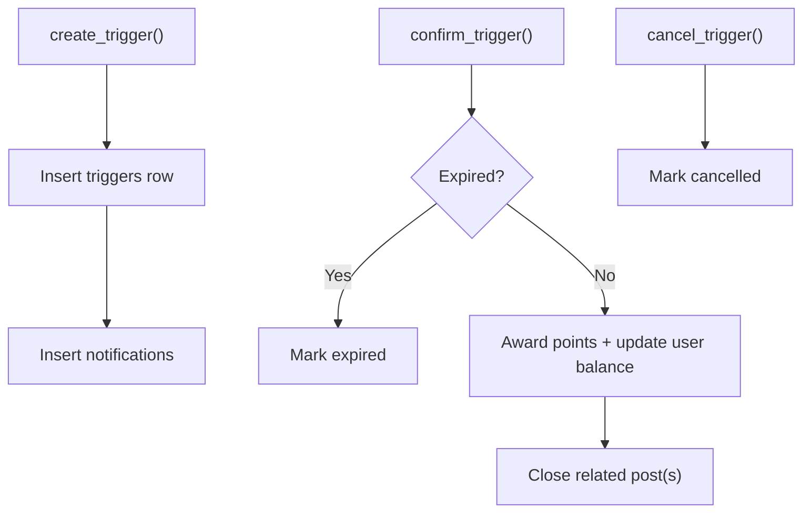
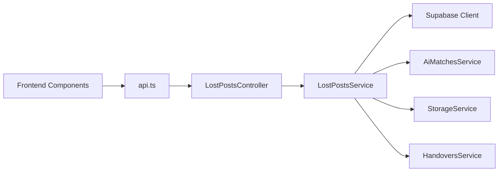

# Lost Posts System

<cite>
**Referenced Files in This Document**
- [lost-posts.controller.ts](file://backend/src/modules/lost-posts/lost-posts.controller.ts)
- [lost-posts.service.ts](file://backend/src/modules/lost-posts/lost-posts.service.ts)
- [create-lost-post.dto.ts](file://backend/src/modules/lost-posts/dto/create-lost-post.dto.ts)
- [query-lost-posts.dto.ts](file://backend/src/modules/lost-posts/dto/query-lost-posts.dto.ts)
- [review-post.dto.ts](file://backend/src/modules/lost-posts/dto/review-post.dto.ts)
- [update-lost-post.dto.ts](file://backend/src/modules/lost-posts/dto/update-lost-post.dto.ts)
- [ai-matches.service.ts](file://backend/src/modules/ai-matches/ai-matches.service.ts)
- [storage.service.ts](file://backend/src/modules/storage/storage.service.ts)
- [handovers.service.ts](file://backend/src/modules/handovers/handovers.service.ts)
- [supabase.config.ts](file://backend/src/config/supabase.config.ts)
- [triggers_migration.sql](file://backend/sql/triggers_migration.sql)
- [api.ts](file://frontend/app/lib/api.ts)
- [CreatePostModal.tsx](file://frontend/app/components/CreatePostModal.tsx)
- [page.tsx](file://frontend/app/lost/page.tsx)
</cite>

## Table of Contents
1. [Introduction](#introduction)
2. [Project Structure](#project-structure)
3. [Core Components](#core-components)
4. [Architecture Overview](#architecture-overview)
5. [Detailed Component Analysis](#detailed-component-analysis)
6. [Dependency Analysis](#dependency-analysis)
7. [Performance Considerations](#performance-considerations)
8. [Troubleshooting Guide](#troubleshooting-guide)
9. [Conclusion](#conclusion)
10. [Appendices](#appendices)

## Introduction
The Lost Posts System enables users to report lost items, manage listings, and connect with finders. It supports:
- Post creation with validation, optional image uploads, and metadata collection
- Approval workflow with admin review and status transitions
- Public and personal queries with filtering, search, and pagination
- AI-powered matching to suggest potential matches between lost and found posts
- Integration with storage and handover processes for item tracking and completion

## Project Structure
The system is organized into NestJS modules with clear separation of concerns:
- Lost posts module: controllers, services, DTOs
- AI Matches module: text-based matching service
- Storage module: item tracking and claiming
- Handovers module: verification and closure workflow
- Supabase configuration for database access
- Frontend components for client-side interactions

**Diagram sources**
- [lost-posts.controller.ts:1-78](file://backend/src/modules/lost-posts/lost-posts.controller.ts#L1-L78)
- [lost-posts.service.ts:1-189](file://backend/src/modules/lost-posts/lost-posts.service.ts#L1-L189)
- [ai-matches.service.ts:1-367](file://backend/src/modules/ai-matches/ai-matches.service.ts#L1-L367)
- [storage.service.ts:1-117](file://backend/src/modules/storage/storage.service.ts#L1-L117)
- [handovers.service.ts:1-147](file://backend/src/modules/handovers/handovers.service.ts#L1-L147)
- [supabase.config.ts:1-25](file://backend/src/config/supabase.config.ts#L1-L25)
- [api.ts:1-83](file://frontend/app/lib/api.ts#L1-L83)
- [CreatePostModal.tsx:1-584](file://frontend/app/components/CreatePostModal.tsx#L1-L584)
- [page.tsx:1-317](file://frontend/app/lost/page.tsx#L1-L317)

**Section sources**
- [lost-posts.controller.ts:1-78](file://backend/src/modules/lost-posts/lost-posts.controller.ts#L1-L78)
- [lost-posts.service.ts:1-189](file://backend/src/modules/lost-posts/lost-posts.service.ts#L1-L189)
- [ai-matches.service.ts:1-367](file://backend/src/modules/ai-matches/ai-matches.service.ts#L1-L367)
- [storage.service.ts:1-117](file://backend/src/modules/storage/storage.service.ts#L1-L117)
- [handovers.service.ts:1-147](file://backend/src/modules/handovers/handovers.service.ts#L1-L147)
- [supabase.config.ts:1-25](file://backend/src/config/supabase.config.ts#L1-L25)
- [api.ts:1-83](file://frontend/app/lib/api.ts#L1-L83)
- [CreatePostModal.tsx:1-584](file://frontend/app/components/CreatePostModal.tsx#L1-L584)
- [page.tsx:1-317](file://frontend/app/lost/page.tsx#L1-L317)

## Core Components
- LostPostsController: Exposes REST endpoints for creating, querying, updating, deleting, and admin reviewing lost posts.
- LostPostsService: Implements business logic for CRUD operations, permission checks, status transitions, and admin reviews.
- DTOs: Strongly typed request/response schemas for validation and documentation.
- AiMatchesService: Provides text-based matching between lost and found posts and manages confirmation flows.
- StorageService: Manages item storage lifecycle and claims.
- HandoversService: Handles verification and completion of handover events, awarding points and closing posts.
- Supabase integration: Centralized client initialization and database access.

**Section sources**
- [lost-posts.controller.ts:1-78](file://backend/src/modules/lost-posts/lost-posts.controller.ts#L1-L78)
- [lost-posts.service.ts:1-189](file://backend/src/modules/lost-posts/lost-posts.service.ts#L1-L189)
- [create-lost-post.dto.ts:1-61](file://backend/src/modules/lost-posts/dto/create-lost-post.dto.ts#L1-L61)
- [query-lost-posts.dto.ts:1-36](file://backend/src/modules/lost-posts/dto/query-lost-posts.dto.ts#L1-L36)
- [review-post.dto.ts:1-14](file://backend/src/modules/lost-posts/dto/review-post.dto.ts#L1-L14)
- [update-lost-post.dto.ts:1-5](file://backend/src/modules/lost-posts/dto/update-lost-post.dto.ts#L1-L5)
- [ai-matches.service.ts:1-367](file://backend/src/modules/ai-matches/ai-matches.service.ts#L1-L367)
- [storage.service.ts:1-117](file://backend/src/modules/storage/storage.service.ts#L1-L117)
- [handovers.service.ts:1-147](file://backend/src/modules/handovers/handovers.service.ts#L1-L147)
- [supabase.config.ts:1-25](file://backend/src/config/supabase.config.ts#L1-L25)

## Architecture Overview
The system follows a layered architecture:
- Controllers handle HTTP requests and delegate to services.
- Services encapsulate domain logic and interact with Supabase.
- DTOs enforce validation and Swagger documentation.
- Frontend components communicate with backend APIs via authenticated fetch helpers.

**Diagram sources**
- [lost-posts.controller.ts:24-28](file://backend/src/modules/lost-posts/lost-posts.controller.ts#L24-L28)
- [lost-posts.service.ts:19-43](file://backend/src/modules/lost-posts/lost-posts.service.ts#L19-L43)
- [supabase.config.ts:7-23](file://backend/src/config/supabase.config.ts#L7-L23)

**Section sources**
- [lost-posts.controller.ts:1-78](file://backend/src/modules/lost-posts/lost-posts.controller.ts#L1-L78)
- [lost-posts.service.ts:1-189](file://backend/src/modules/lost-posts/lost-posts.service.ts#L1-L189)
- [supabase.config.ts:1-25](file://backend/src/config/supabase.config.ts#L1-L25)

## Detailed Component Analysis

### Lost Posts Lifecycle

#### Post Creation Workflow
- Endpoint: POST /lost-posts
- Validation: Enforced by CreateLostPostDto (min/max lengths, date format, URLs, optional fields).
- Metadata: Title, description, location_lost, time_lost, category_id, image_urls, contact_info, is_urgent, reward_note.
- Behavior: Automatically sets initial status to approved and logs status history.

**Diagram sources**
- [lost-posts.controller.ts:24-28](file://backend/src/modules/lost-posts/lost-posts.controller.ts#L24-L28)
- [lost-posts.service.ts:19-43](file://backend/src/modules/lost-posts/lost-posts.service.ts#L19-L43)
- [create-lost-post.dto.ts:14-60](file://backend/src/modules/lost-posts/dto/create-lost-post.dto.ts#L14-L60)

**Section sources**
- [lost-posts.controller.ts:24-28](file://backend/src/modules/lost-posts/lost-posts.controller.ts#L24-L28)
- [lost-posts.service.ts:19-43](file://backend/src/modules/lost-posts/lost-posts.service.ts#L19-L43)
- [create-lost-post.dto.ts:14-60](file://backend/src/modules/lost-posts/dto/create-lost-post.dto.ts#L14-L60)

#### Query System (Filtering, Search, Pagination)
- Endpoint: GET /lost-posts
- Filters: status, category_id, search (ILIKE on title), pagination (page, limit with min/max).
- Sorting: Urgency (is_urgent) then creation time (created_at).
- Response: data + meta (page, limit, total, totalPages).

**Diagram sources**
- [lost-posts.controller.ts:30-35](file://backend/src/modules/lost-posts/lost-posts.controller.ts#L30-L35)
- [lost-posts.service.ts:45-73](file://backend/src/modules/lost-posts/lost-posts.service.ts#L45-L73)
- [query-lost-posts.dto.ts:5-35](file://backend/src/modules/lost-posts/dto/query-lost-posts.dto.ts#L5-L35)

**Section sources**
- [lost-posts.controller.ts:30-35](file://backend/src/modules/lost-posts/lost-posts.controller.ts#L30-L35)
- [lost-posts.service.ts:45-73](file://backend/src/modules/lost-posts/lost-posts.service.ts#L45-L73)
- [query-lost-posts.dto.ts:5-35](file://backend/src/modules/lost-posts/dto/query-lost-posts.dto.ts#L5-L35)

#### Approval Process and Status Transitions
- Admin endpoints: GET /admin/lost-posts/pending, POST /admin/lost-posts/:id/review
- Review criteria: action must be approved or rejected; rejection requires reason.
- Status history logging: captures old/new status, changed_by, and note.
- Allowed transitions: pending -> approved/rejected; editing restricted outside permitted statuses.

**Diagram sources**
- [lost-posts.controller.ts:62-76](file://backend/src/modules/lost-posts/lost-posts.controller.ts#L62-L76)
- [lost-posts.service.ts:139-171](file://backend/src/modules/lost-posts/lost-posts.service.ts#L139-L171)
- [review-post.dto.ts:4-13](file://backend/src/modules/lost-posts/dto/review-post.dto.ts#L4-L13)

**Section sources**
- [lost-posts.controller.ts:62-76](file://backend/src/modules/lost-posts/lost-posts.controller.ts#L62-L76)
- [lost-posts.service.ts:139-171](file://backend/src/modules/lost-posts/lost-posts.service.ts#L139-L171)
- [review-post.dto.ts:4-13](file://backend/src/modules/lost-posts/dto/review-post.dto.ts#L4-L13)

#### Update and Deletion Rules
- Update: Permitted only for owners or admins; editable only when status is pending or approved.
- Delete: Same ownership/admin rules as update.
- Validation: Uses UpdateLostPostDto (partial fields of CreateLostPostDto).

**Section sources**
- [lost-posts.service.ts:105-137](file://backend/src/modules/lost-posts/lost-posts.service.ts#L105-L137)
- [update-lost-post.dto.ts:1-5](file://backend/src/modules/lost-posts/dto/update-lost-post.dto.ts#L1-L5)

#### Frontend Integration for Post Creation
- Client-side validation: Title ≥10, description ≥20, location required, incident date required.
- Image upload: Parallel uploads via uploadFile helper; collects URLs for submission.
- Submission: Sends POST /lost-posts with collected metadata and image URLs.

**Diagram sources**
- [CreatePostModal.tsx:135-238](file://frontend/app/components/CreatePostModal.tsx#L135-L238)
- [api.ts:48-82](file://frontend/app/lib/api.ts#L48-L82)
- [lost-posts.controller.ts:24-28](file://backend/src/modules/lost-posts/lost-posts.controller.ts#L24-L28)

**Section sources**
- [CreatePostModal.tsx:135-238](file://frontend/app/components/CreatePostModal.tsx#L135-L238)
- [api.ts:48-82](file://frontend/app/lib/api.ts#L48-L82)
- [lost-posts.controller.ts:24-28](file://backend/src/modules/lost-posts/lost-posts.controller.ts#L24-L28)

### AI Matching Integration
- Matching algorithm: Text similarity (Jaccard) between lost post title/description and found posts in the same category.
- Endpoint: POST /ai-matches/run/:id runs matching and upserts results.
- Confirmation: Either owner or finder can confirm; mutual confirmation marks match as confirmed.
- Retrieval: GET /ai-matches/:id lists existing matches with scores and status.

**Diagram sources**
- [ai-matches.service.ts:45-96](file://backend/src/modules/ai-matches/ai-matches.service.ts#L45-L96)
- [ai-matches.service.ts:144-153](file://backend/src/modules/ai-matches/ai-matches.service.ts#L144-L153)

**Section sources**
- [ai-matches.service.ts:11-96](file://backend/src/modules/ai-matches/ai-matches.service.ts#L11-L96)
- [ai-matches.service.ts:144-153](file://backend/src/modules/ai-matches/ai-matches.service.ts#L144-L153)

### Storage and Handover Integration
- StorageService: Item creation with unique item_code, linking to found_post, and claiming.
- HandoversService: Creates handover with verification code, two-party confirmation, and completion.
- Completion: RPC grants training points and closes both lost and found posts.

**Diagram sources**
- [handovers.service.ts:12-84](file://backend/src/modules/handovers/handovers.service.ts#L12-L84)
- [handovers.service.ts:117-131](file://backend/src/modules/handovers/handovers.service.ts#L117-L131)
- [storage.service.ts:53-78](file://backend/src/modules/storage/storage.service.ts#L53-L78)

**Section sources**
- [storage.service.ts:53-78](file://backend/src/modules/storage/storage.service.ts#L53-L78)
- [handovers.service.ts:12-84](file://backend/src/modules/handovers/handovers.service.ts#L12-L84)
- [handovers.service.ts:117-131](file://backend/src/modules/handovers/handovers.service.ts#L117-L131)

### Database Triggers and Realtime
- Triggers system supports handover verification with expiration and notifications.
- Functions: create_trigger, confirm_trigger, cancel_trigger, auto_expire_triggers.
- Realtime publication for triggers table.

**Diagram sources**
- [triggers_migration.sql:63-146](file://backend/sql/triggers_migration.sql#L63-L146)
- [triggers_migration.sql:153-259](file://backend/sql/triggers_migration.sql#L153-L259)
- [triggers_migration.sql:266-318](file://backend/sql/triggers_migration.sql#L266-L318)
- [triggers_migration.sql:325-336](file://backend/sql/triggers_migration.sql#L325-L336)

**Section sources**
- [triggers_migration.sql:63-146](file://backend/sql/triggers_migration.sql#L63-L146)
- [triggers_migration.sql:153-259](file://backend/sql/triggers_migration.sql#L153-L259)
- [triggers_migration.sql:266-318](file://backend/sql/triggers_migration.sql#L266-L318)
- [triggers_migration.sql:325-336](file://backend/sql/triggers_migration.sql#L325-L336)

## Dependency Analysis
- Controllers depend on Services for business logic.
- Services depend on Supabase client for database operations.
- DTOs define contracts for validation and serialization.
- Frontend depends on api.ts for authenticated requests and uploadFile for media.

**Diagram sources**
- [api.ts:1-83](file://frontend/app/lib/api.ts#L1-L83)
- [lost-posts.controller.ts:1-78](file://backend/src/modules/lost-posts/lost-posts.controller.ts#L1-L78)
- [lost-posts.service.ts:1-189](file://backend/src/modules/lost-posts/lost-posts.service.ts#L1-L189)
- [supabase.config.ts:7-23](file://backend/src/config/supabase.config.ts#L7-L23)
- [ai-matches.service.ts:1-367](file://backend/src/modules/ai-matches/ai-matches.service.ts#L1-L367)
- [storage.service.ts:1-117](file://backend/src/modules/storage/storage.service.ts#L1-L117)
- [handovers.service.ts:1-147](file://backend/src/modules/handovers/handovers.service.ts#L1-L147)

**Section sources**
- [api.ts:1-83](file://frontend/app/lib/api.ts#L1-L83)
- [lost-posts.controller.ts:1-78](file://backend/src/modules/lost-posts/lost-posts.controller.ts#L1-L78)
- [lost-posts.service.ts:1-189](file://backend/src/modules/lost-posts/lost-posts.service.ts#L1-L189)
- [supabase.config.ts:1-25](file://backend/src/config/supabase.config.ts#L1-L25)
- [ai-matches.service.ts:1-367](file://backend/src/modules/ai-matches/ai-matches.service.ts#L1-L367)
- [storage.service.ts:1-117](file://backend/src/modules/storage/storage.service.ts#L1-L117)
- [handovers.service.ts:1-147](file://backend/src/modules/handovers/handovers.service.ts#L1-L147)

## Performance Considerations
- Pagination: Use page and limit parameters to avoid large payloads.
- Indexes: Database indexes on status, category, and created_at improve query performance.
- Image uploads: Parallel uploads reduce latency; ensure client handles partial failures gracefully.
- Matching: Limit candidate pool by category and approved status to reduce computation.

## Troubleshooting Guide
Common issues and resolutions:
- Duplicate submissions: Ensure unique constraints and category filtering in matching to minimize duplicates.
- Missing information: Client-side validation prevents empty required fields; server-side DTO validation enforces constraints.
- Approval delays: Admin review endpoints require proper authentication and role checks; ensure admin workflows are followed.

Operational checks:
- Unauthorized access: Verify JWT bearer token presence and validity.
- Validation errors: Confirm DTO constraints (lengths, formats, enums) are met.
- Database connectivity: Check SUPABASE_URL and keys; ensure Supabase client initialization succeeds.

**Section sources**
- [CreatePostModal.tsx:138-154](file://frontend/app/components/CreatePostModal.tsx#L138-L154)
- [create-lost-post.dto.ts:14-60](file://backend/src/modules/lost-posts/dto/create-lost-post.dto.ts#L14-L60)
- [api.ts:12-43](file://frontend/app/lib/api.ts#L12-L43)
- [supabase.config.ts:7-23](file://backend/src/config/supabase.config.ts#L7-L23)

## Conclusion
The Lost Posts System provides a robust foundation for reporting lost items, connecting owners and finders, and completing handovers. Its modular design, strong validation, and integration with AI matching, storage, and handover workflows support scalability and maintainability.

## Appendices

### API Reference Examples

- POST /lost-posts
  - Purpose: Create a new lost post
  - Authentication: Required (JWT)
  - Body: CreateLostPostDto fields
  - Example payload path: [create-lost-post.dto.ts:14-60](file://backend/src/modules/lost-posts/dto/create-lost-post.dto.ts#L14-L60)
  - Response: Created post object

- PUT /lost-posts/:id
  - Purpose: Update an existing lost post
  - Authentication: Required (JWT)
  - Ownership/Admin: Owner or admin with edit permissions
  - Body: UpdateLostPostDto (partial fields)
  - Example payload path: [update-lost-post.dto.ts:1-5](file://backend/src/modules/lost-posts/dto/update-lost-post.dto.ts#L1-L5)
  - Response: Updated post object

- GET /lost-posts
  - Purpose: Query lost posts with filters and pagination
  - Authentication: Optional (public)
  - Query params: status, category_id, search, page, limit
  - Example query path: [query-lost-posts.dto.ts:5-35](file://backend/src/modules/lost-posts/dto/query-lost-posts.dto.ts#L5-L35)
  - Response: { data: Post[], meta: { page, limit, total, totalPages } }

- GET /lost-posts/:id
  - Purpose: Retrieve a single lost post (with incrementing view count)
  - Authentication: Optional (public)
  - Response: Post object

- GET /lost-posts/my
  - Purpose: List current user’s lost posts
  - Authentication: Required (JWT)
  - Response: Array of user’s posts

- GET /admin/lost-posts/pending
  - Purpose: Admin view of pending posts
  - Authentication: Required (admin)
  - Response: Pending posts list

- POST /admin/lost-posts/:id/review
  - Purpose: Approve or reject a lost post
  - Authentication: Required (admin)
  - Body: ReviewPostDto { action: 'approved' | 'rejected', reason? }
  - Example payload path: [review-post.dto.ts:4-13](file://backend/src/modules/lost-posts/dto/review-post.dto.ts#L4-L13)
  - Response: Updated post object

**Section sources**
- [lost-posts.controller.ts:24-76](file://backend/src/modules/lost-posts/lost-posts.controller.ts#L24-L76)
- [query-lost-posts.dto.ts:5-35](file://backend/src/modules/lost-posts/dto/query-lost-posts.dto.ts#L5-L35)
- [review-post.dto.ts:4-13](file://backend/src/modules/lost-posts/dto/review-post.dto.ts#L4-L13)
- [update-lost-post.dto.ts:1-5](file://backend/src/modules/lost-posts/dto/update-lost-post.dto.ts#L1-L5)