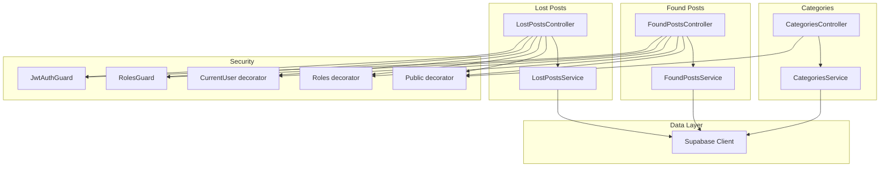
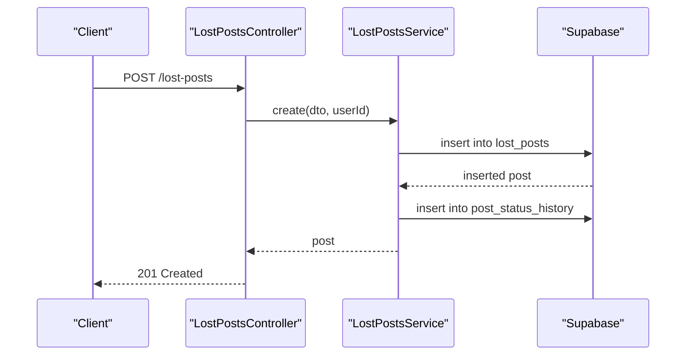
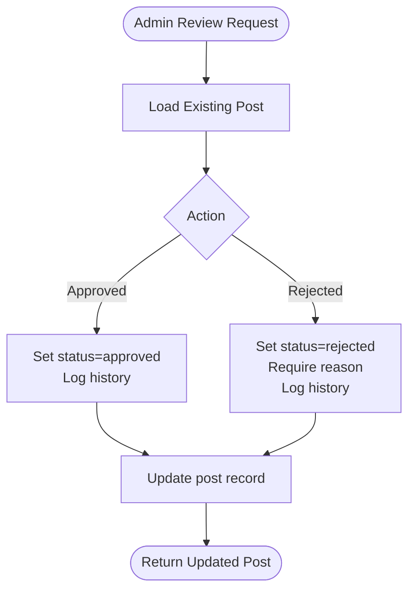
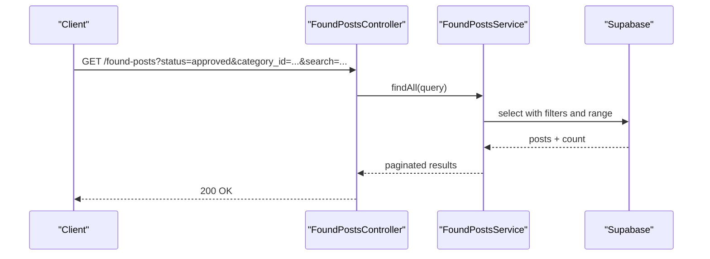
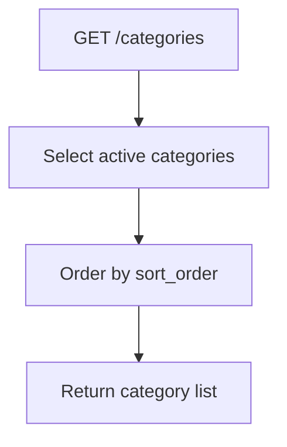
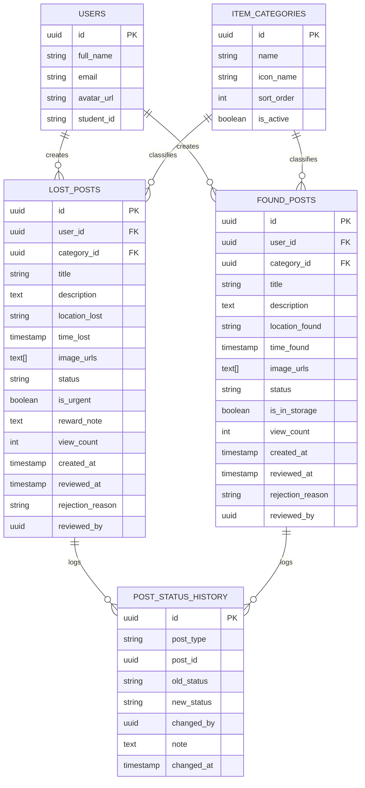
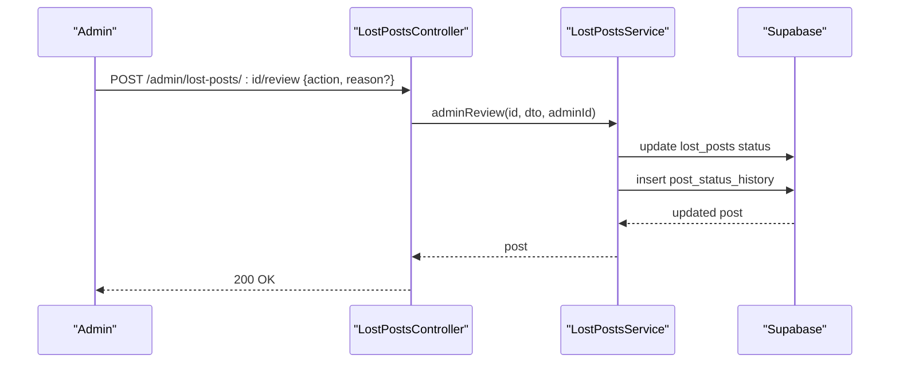
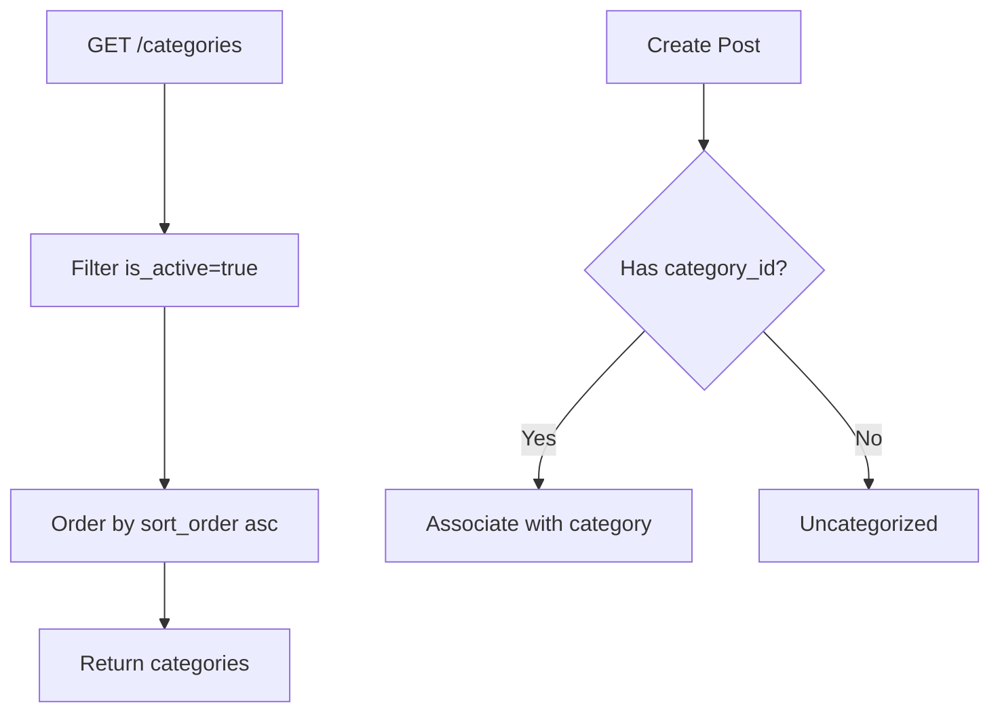
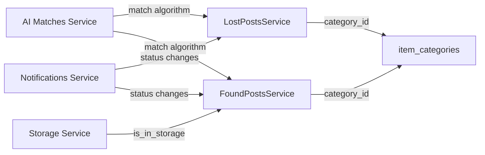
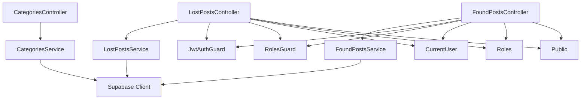

# Posts Management

<cite>
**Referenced Files in This Document**
- [lost-posts.controller.ts](file://backend/src/modules/lost-posts/lost-posts.controller.ts)
- [found-posts.controller.ts](file://backend/src/modules/found-posts/found-posts.controller.ts)
- [categories.controller.ts](file://backend/src/modules/categories/categories.controller.ts)
- [lost-posts.service.ts](file://backend/src/modules/lost-posts/lost-posts.service.ts)
- [found-posts.service.ts](file://backend/src/modules/found-posts/found-posts.service.ts)
- [categories.service.ts](file://backend/src/modules/categories/categories.service.ts)
- [create-lost-post.dto.ts](file://backend/src/modules/lost-posts/dto/create-lost-post.dto.ts)
- [update-lost-post.dto.ts](file://backend/src/modules/lost-posts/dto/update-lost-post.dto.ts)
- [query-lost-posts.dto.ts](file://backend/src/modules/lost-posts/dto/query-lost-posts.dto.ts)
- [review-post.dto.ts](file://backend/src/modules/lost-posts/dto/review-post.dto.ts)
- [create-found-post.dto.ts](file://backend/src/modules/found-posts/dto/create-found-post.dto.ts)
- [update-found-post.dto.ts](file://backend/src/modules/found-posts/dto/update-found-post.dto.ts)
- [query-found-posts.dto.ts](file://backend/src/modules/found-posts/dto/query-found-posts.dto.ts)
- [jwt-auth.guard.ts](file://backend/src/common/guards/jwt-auth.guard.ts)
- [roles.guard.ts](file://backend/src/common/guards/roles.guard.ts)
- [current-user.decorator.ts](file://backend/src/common/decorators/current-user.decorator.ts)
- [roles.decorator.ts](file://backend/src/common/decorators/roles.decorator.ts)
- [public.decorator.ts](file://backend/src/common/decorators/public.decorator.ts)
- [app.exception.ts](file://backend/src/common/exceptions/app.exception.ts)
- [supabase.config.ts](file://backend/src/config/supabase.config.ts)
- [ai-matches.controller.ts](file://backend/src/modules/ai-matches/ai-matches.controller.ts)
- [ai-matches.service.ts](file://backend/src/modules/ai-matches/ai-matches.service.ts)
- [storage.controller.ts](file://backend/src/modules/storage/storage.controller.ts)
- [storage.service.ts](file://backend/src/modules/storage/storage.service.ts)
- [notifications.controller.ts](file://backend/src/modules/notifications/notifications.controller.ts)
- [notifications.service.ts](file://backend/src/modules/notifications/notifications.service.ts)
- [handovers.controller.ts](file://backend/src/modules/handovers/handovers.controller.ts)
- [handovers.service.ts](file://backend/src/modules/handovers/handovers.service.ts)
- [users.controller.ts](file://backend/src/modules/users/users.controller.ts)
- [users.service.ts](file://backend/src/modules/users/users.service.ts)
- [upload.controller.ts](file://backend/src/modules/upload/upload.controller.ts)
- [upload.service.ts](file://backend/src/modules/upload/upload.service.ts)
</cite>

## Table of Contents
1. [Introduction](#introduction)
2. [Project Structure](#project-structure)
3. [Core Components](#core-components)
4. [Architecture Overview](#architecture-overview)
5. [Detailed Component Analysis](#detailed-component-analysis)
6. [Dependency Analysis](#dependency-analysis)
7. [Performance Considerations](#performance-considerations)
8. [Troubleshooting Guide](#troubleshooting-guide)
9. [Conclusion](#conclusion)
10. [Appendices](#appendices)

## Introduction
This document explains the Posts Management system for Lost and Found posts, including creation workflows, approval processes, status management, and category classification. It documents entity relationships between posts, categories, and user profiles, and covers administrative controls, moderation workflows, and integrations with AI matching, storage, and notifications. Practical examples illustrate CRUD operations, filtering, and status transitions.

## Project Structure
The Posts Management system is organized into three primary modules:
- Lost Posts module: handles lost post lifecycle (create, list, detail, update, delete, admin review).
- Found Posts module: mirrors lost posts with additional storage flag and similar admin review.
- Categories module: provides category metadata for item classification.

Controllers expose REST endpoints, services encapsulate Supabase data access and business logic, and DTOs define validation and API schemas. Guards and decorators enforce authentication, role-based access, and public routes.

**Diagram sources**
- [lost-posts.controller.ts:1-78](file://backend/src/modules/lost-posts/lost-posts.controller.ts#L1-L78)
- [found-posts.controller.ts:1-78](file://backend/src/modules/found-posts/found-posts.controller.ts#L1-L78)
- [categories.controller.ts:1-18](file://backend/src/modules/categories/categories.controller.ts#L1-L18)
- [jwt-auth.guard.ts](file://backend/src/common/guards/jwt-auth.guard.ts)
- [roles.guard.ts](file://backend/src/common/guards/roles.guard.ts)
- [current-user.decorator.ts](file://backend/src/common/decorators/current-user.decorator.ts)
- [roles.decorator.ts](file://backend/src/common/decorators/roles.decorator.ts)
- [public.decorator.ts](file://backend/src/common/decorators/public.decorator.ts)
- [supabase.config.ts](file://backend/src/config/supabase.config.ts)

**Section sources**
- [lost-posts.controller.ts:1-78](file://backend/src/modules/lost-posts/lost-posts.controller.ts#L1-L78)
- [found-posts.controller.ts:1-78](file://backend/src/modules/found-posts/found-posts.controller.ts#L1-L78)
- [categories.controller.ts:1-18](file://backend/src/modules/categories/categories.controller.ts#L1-L18)

## Core Components
- LostPostsController: Exposes endpoints for creating, listing, viewing details, updating, deleting lost posts, and admin review of pending posts.
- FoundPostsController: Mirrors lost posts with similar CRUD and admin review endpoints, plus a storage flag.
- CategoriesController: Provides category metadata for item classification.
- LostPostsService: Implements post creation, querying with pagination and filters, detail retrieval with view increment, updates with ownership and status checks, deletion with ownership verification, and admin review with status history logging.
- FoundPostsService: Implements similar operations for found posts, including storage flag handling and admin review.
- CategoriesService: Retrieves active categories ordered by sort order.

Key data models and relationships:
- Lost posts and found posts share common fields (title, description, location, time, images, status, user_id) and differ in domain-specific fields (lost vs found specifics, storage flag).
- Both post types reference item_categories via category_id and include user profile data via foreign keys.
- Status history is recorded per post type for auditability.

**Section sources**
- [lost-posts.service.ts:1-189](file://backend/src/modules/lost-posts/lost-posts.service.ts#L1-L189)
- [found-posts.service.ts:1-162](file://backend/src/modules/found-posts/found-posts.service.ts#L1-L162)
- [categories.service.ts:1-32](file://backend/src/modules/categories/categories.service.ts#L1-L32)

## Architecture Overview
The system follows a layered architecture:
- Controllers handle HTTP requests and delegate to services.
- Services encapsulate business logic and interact with Supabase.
- DTOs validate and document request/response schemas.
- Guards and decorators manage authentication and authorization.
- Exceptions provide structured error handling.

**Diagram sources**
- [lost-posts.controller.ts:24-28](file://backend/src/modules/lost-posts/lost-posts.controller.ts#L24-L28)
- [lost-posts.service.ts:19-43](file://backend/src/modules/lost-posts/lost-posts.service.ts#L19-L43)

**Section sources**
- [lost-posts.controller.ts:1-78](file://backend/src/modules/lost-posts/lost-posts.controller.ts#L1-L78)
- [found-posts.controller.ts:1-78](file://backend/src/modules/found-posts/found-posts.controller.ts#L1-L78)
- [categories.controller.ts:1-18](file://backend/src/modules/categories/categories.controller.ts#L1-L18)

## Detailed Component Analysis

### Lost Posts Module
- Creation workflow:
  - Endpoint: POST /lost-posts
  - Behavior: Inserts a new lost post with status set to approved and logs initial status history.
- Listing and filtering:
  - Endpoint: GET /lost-posts
  - Filters: status, category_id, search term, pagination (page, limit).
  - Sorting: Urgency first, then creation time descending.
- Personal feed:
  - Endpoint: GET /lost-posts/my retrieves user’s posts.
- Detail view:
  - Endpoint: GET /lost-posts/:id
  - Increments view count asynchronously after retrieval.
- Updates and deletions:
  - Endpoint: PATCH /lost-posts/:id and DELETE /lost-posts/:id
  - Ownership checks and status restrictions apply (non-admin cannot edit ended posts).
- Admin review:
  - Endpoint: GET /admin/lost-posts/pending and POST /admin/lost-posts/:id/review
  - Requires admin role and validates rejection reasons.

**Diagram sources**
- [lost-posts.controller.ts:70-76](file://backend/src/modules/lost-posts/lost-posts.controller.ts#L70-L76)
- [lost-posts.service.ts:139-171](file://backend/src/modules/lost-posts/lost-posts.service.ts#L139-L171)

**Section sources**
- [lost-posts.controller.ts:24-76](file://backend/src/modules/lost-posts/lost-posts.controller.ts#L24-L76)
- [lost-posts.service.ts:19-187](file://backend/src/modules/lost-posts/lost-posts.service.ts#L19-L187)
- [query-lost-posts.dto.ts:5-35](file://backend/src/modules/lost-posts/dto/query-lost-posts.dto.ts#L5-L35)
- [review-post.dto.ts:4-13](file://backend/src/modules/lost-posts/dto/review-post.dto.ts#L4-L13)

### Found Posts Module
- Creation workflow mirrors lost posts with status set to approved and status history logging.
- Listing and filtering mirror lost posts with additional is_in_storage flag.
- Personal feed endpoint mirrors lost posts.
- Detail view increments view count asynchronously.
- Updates and deletions mirror lost posts with ownership checks.
- Admin review mirrors lost posts with status history logging.

**Diagram sources**
- [found-posts.controller.ts:30-35](file://backend/src/modules/found-posts/found-posts.controller.ts#L30-L35)
- [found-posts.service.ts:40-67](file://backend/src/modules/found-posts/found-posts.service.ts#L40-L67)

**Section sources**
- [found-posts.controller.ts:24-76](file://backend/src/modules/found-posts/found-posts.controller.ts#L24-L76)
- [found-posts.service.ts:19-160](file://backend/src/modules/found-posts/found-posts.service.ts#L19-L160)
- [query-found-posts.dto.ts:5-35](file://backend/src/modules/found-posts/dto/query-found-posts.dto.ts#L5-L35)

### Categories Module
- Retrieves active categories ordered by sort order for classification.
- Supports lookup by ID for validation and display.

**Diagram sources**
- [categories.controller.ts:11-16](file://backend/src/modules/categories/categories.controller.ts#L11-L16)
- [categories.service.ts:10-19](file://backend/src/modules/categories/categories.service.ts#L10-L19)

**Section sources**
- [categories.controller.ts:1-18](file://backend/src/modules/categories/categories.controller.ts#L1-L18)
- [categories.service.ts:1-32](file://backend/src/modules/categories/categories.service.ts#L1-L32)

### Entity Relationships and Data Model
- Users ↔ Posts: One-to-many relationship via user_id foreign keys.
- Categories ↔ Posts: Many-to-one via category_id foreign keys.
- Status History: Separate table tracks status transitions for auditability.

**Diagram sources**
- [lost-posts.service.ts:50-57](file://backend/src/modules/lost-posts/lost-posts.service.ts#L50-L57)
- [found-posts.service.ts:45-52](file://backend/src/modules/found-posts/found-posts.service.ts#L45-L52)
- [categories.service.ts:10-15](file://backend/src/modules/categories/categories.service.ts#L10-L15)

**Section sources**
- [lost-posts.service.ts:50-57](file://backend/src/modules/lost-posts/lost-posts.service.ts#L50-L57)
- [found-posts.service.ts:45-52](file://backend/src/modules/found-posts/found-posts.service.ts#L45-L52)
- [categories.service.ts:10-15](file://backend/src/modules/categories/categories.service.ts#L10-L15)

### Approval System and Administrative Controls
- Approval process:
  - Posts are created with approved status by default.
  - Admins can review pending posts and approve or reject with optional reason.
- Role-based access:
  - Admin-only endpoints require RolesGuard and admin role.
  - Non-admin users can only modify their own posts while in allowed statuses.
- Status history:
  - Every admin review writes a history record with old/new status and note.

**Diagram sources**
- [lost-posts.controller.ts:70-76](file://backend/src/modules/lost-posts/lost-posts.controller.ts#L70-L76)
- [lost-posts.service.ts:139-171](file://backend/src/modules/lost-posts/lost-posts.service.ts#L139-L171)

**Section sources**
- [lost-posts.controller.ts:62-76](file://backend/src/modules/lost-posts/lost-posts.controller.ts#L62-L76)
- [lost-posts.service.ts:139-171](file://backend/src/modules/lost-posts/lost-posts.service.ts#L139-L171)
- [roles.guard.ts](file://backend/src/common/guards/roles.guard.ts)
- [roles.decorator.ts](file://backend/src/common/decorators/roles.decorator.ts)

### Category Classification System
- Categories are retrieved from item_categories with is_active filter and sort_order ordering.
- Posts optionally reference a category_id; otherwise, they remain uncategorized.
- Manual override capability exists at admin review time to change status and record notes.

**Diagram sources**
- [categories.service.ts:10-19](file://backend/src/modules/categories/categories.service.ts#L10-L19)
- [create-lost-post.dto.ts:36-37](file://backend/src/modules/lost-posts/dto/create-lost-post.dto.ts#L36-L37)
- [create-found-post.dto.ts:29-30](file://backend/src/modules/found-posts/dto/create-found-post.dto.ts#L29-L30)

**Section sources**
- [categories.service.ts:1-32](file://backend/src/modules/categories/categories.service.ts#L1-L32)
- [create-lost-post.dto.ts:36-37](file://backend/src/modules/lost-posts/dto/create-lost-post.dto.ts#L36-L37)
- [create-found-post.dto.ts:29-30](file://backend/src/modules/found-posts/dto/create-found-post.dto.ts#L29-L30)

### Integrations: AI Matching, Storage, Notifications
- AI Matching:
  - Dedicated module exposes endpoints and services for matching algorithms.
  - Integrates with posts to surface potential matches based on categories and descriptions.
- Storage:
  - Found posts support an is_in_storage flag; storage module manages physical item handling workflows.
- Notifications:
  - Notifications module coordinates user alerts for status changes, matches, and handovers.

**Diagram sources**
- [ai-matches.controller.ts](file://backend/src/modules/ai-matches/ai-matches.controller.ts)
- [ai-matches.service.ts](file://backend/src/modules/ai-matches/ai-matches.service.ts)
- [storage.controller.ts](file://backend/src/modules/storage/storage.controller.ts)
- [storage.service.ts](file://backend/src/modules/storage/storage.service.ts)
- [notifications.controller.ts](file://backend/src/modules/notifications/notifications.controller.ts)
- [notifications.service.ts](file://backend/src/modules/notifications/notifications.service.ts)

**Section sources**
- [ai-matches.service.ts](file://backend/src/modules/ai-matches/ai-matches.service.ts)
- [storage.service.ts](file://backend/src/modules/storage/storage.service.ts)
- [notifications.service.ts](file://backend/src/modules/notifications/notifications.service.ts)

## Dependency Analysis
- Controllers depend on services for business logic.
- Services depend on Supabase client for database operations.
- Security decorators and guards enforce access policies.
- DTOs define request/response contracts validated by class-validator.

**Diagram sources**
- [lost-posts.controller.ts:1-78](file://backend/src/modules/lost-posts/lost-posts.controller.ts#L1-L78)
- [found-posts.controller.ts:1-78](file://backend/src/modules/found-posts/found-posts.controller.ts#L1-L78)
- [categories.controller.ts:1-18](file://backend/src/modules/categories/categories.controller.ts#L1-L18)
- [jwt-auth.guard.ts](file://backend/src/common/guards/jwt-auth.guard.ts)
- [roles.guard.ts](file://backend/src/common/guards/roles.guard.ts)
- [current-user.decorator.ts](file://backend/src/common/decorators/current-user.decorator.ts)
- [roles.decorator.ts](file://backend/src/common/decorators/roles.decorator.ts)
- [public.decorator.ts](file://backend/src/common/decorators/public.decorator.ts)
- [supabase.config.ts](file://backend/src/config/supabase.config.ts)

**Section sources**
- [lost-posts.controller.ts:1-78](file://backend/src/modules/lost-posts/lost-posts.controller.ts#L1-L78)
- [found-posts.controller.ts:1-78](file://backend/src/modules/found-posts/found-posts.controller.ts#L1-L78)
- [categories.controller.ts:1-18](file://backend/src/modules/categories/categories.controller.ts#L1-L18)

## Performance Considerations
- Pagination and limits:
  - Queries accept page and limit parameters with a maximum cap to prevent oversized payloads.
- Filtering:
  - Use category_id and search filters to reduce result sets.
- Sorting:
  - Prefer index-friendly sorts (created_at, status) to minimize sorting overhead.
- View counting:
  - Incrementing view count is fire-and-forget to avoid blocking responses.
- Indexing recommendations:
  - Add database indexes on status, category_id, created_at, and user_id for frequent queries.
- Caching:
  - Consider caching category lists and popular posts to reduce database load.

[No sources needed since this section provides general guidance]

## Troubleshooting Guide
Common issues and resolutions:
- Authentication failures:
  - Ensure JWT guard is applied and bearer tokens are included in requests.
- Authorization errors:
  - Admin-only endpoints require RolesGuard with admin role.
- Forbidden operations:
  - Non-admin users cannot edit posts outside allowed statuses or owned by others.
- Validation errors:
  - DTO validation enforces field constraints; check titles, descriptions, dates, URLs, and UUIDs.
- Not found errors:
  - Accessing non-existent posts raises not-found exceptions.
- Review validation:
  - Rejection actions require a reason; otherwise, validation fails.

**Section sources**
- [jwt-auth.guard.ts](file://backend/src/common/guards/jwt-auth.guard.ts)
- [roles.guard.ts](file://backend/src/common/guards/roles.guard.ts)
- [app.exception.ts](file://backend/src/common/exceptions/app.exception.ts)
- [lost-posts.service.ts:105-125](file://backend/src/modules/lost-posts/lost-posts.service.ts#L105-L125)
- [found-posts.service.ts:96-105](file://backend/src/modules/found-posts/found-posts.service.ts#L96-L105)
- [review-post.dto.ts:4-13](file://backend/src/modules/lost-posts/dto/review-post.dto.ts#L4-L13)

## Conclusion
The Posts Management system provides robust workflows for lost and found posts with clear approval and moderation controls, category classification, and administrative oversight. Its modular design, strong validation, and Supabase-backed persistence enable scalable and maintainable post lifecycle management. Integrations with AI matching, storage, and notifications further enhance user experience and operational efficiency.

## Appendices

### API Reference Summary
- Lost Posts
  - POST /lost-posts: Create a lost post
  - GET /lost-posts: List with filters and pagination
  - GET /lost-posts/my: My lost posts
  - GET /lost-posts/:id: Post detail
  - PATCH /lost-posts/:id: Update post
  - DELETE /lost-posts/:id: Delete post
  - GET /admin/lost-posts/pending: Pending posts (admin)
  - POST /admin/lost-posts/:id/review: Admin review
- Found Posts
  - POST /found-posts: Create a found post
  - GET /found-posts: List with filters and pagination
  - GET /found-posts/my: My found posts
  - GET /found-posts/:id: Post detail
  - PATCH /found-posts/:id: Update post
  - DELETE /found-posts/:id: Delete post
  - GET /admin/found-posts/pending: Pending posts (admin)
  - POST /admin/found-posts/:id/review: Admin review
- Categories
  - GET /categories: List active categories

**Section sources**
- [lost-posts.controller.ts:24-76](file://backend/src/modules/lost-posts/lost-posts.controller.ts#L24-L76)
- [found-posts.controller.ts:24-76](file://backend/src/modules/found-posts/found-posts.controller.ts#L24-L76)
- [categories.controller.ts:11-16](file://backend/src/modules/categories/categories.controller.ts#L11-L16)