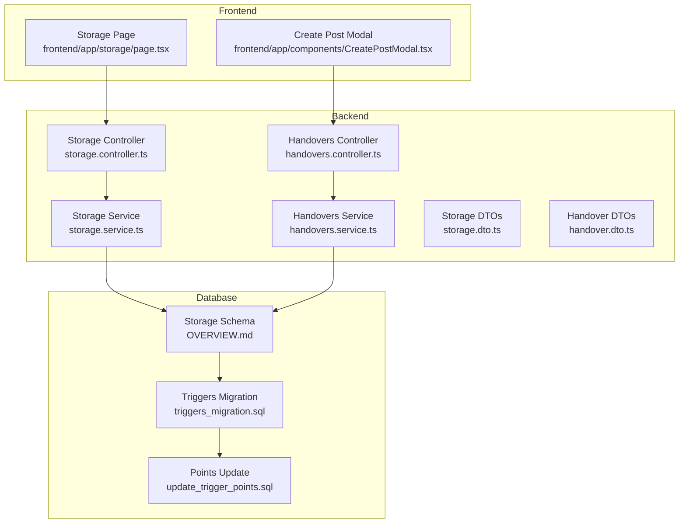
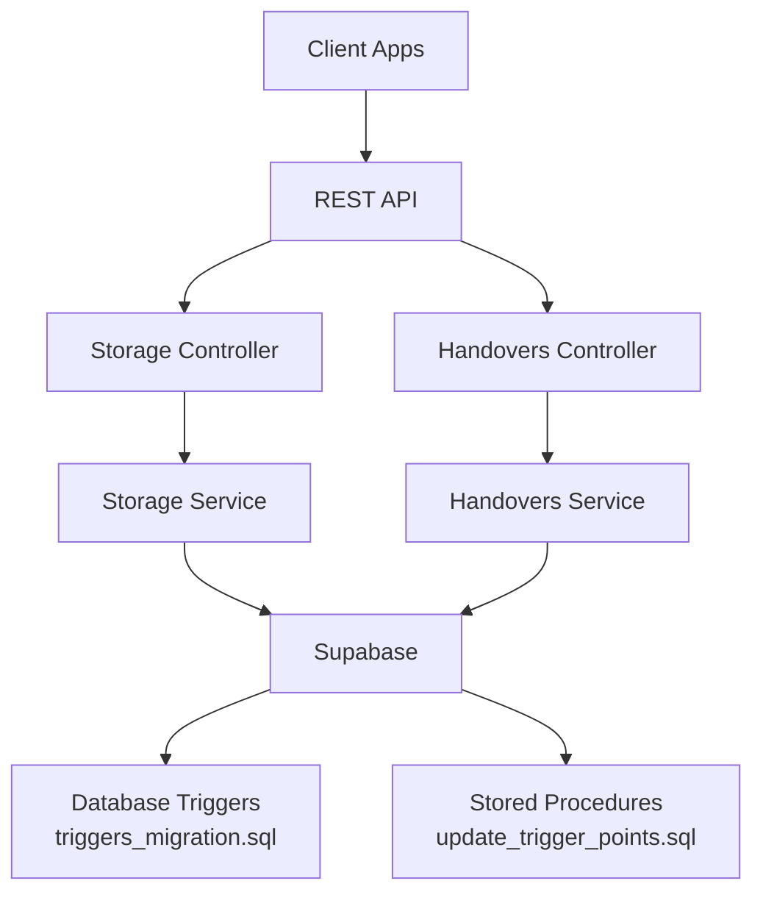
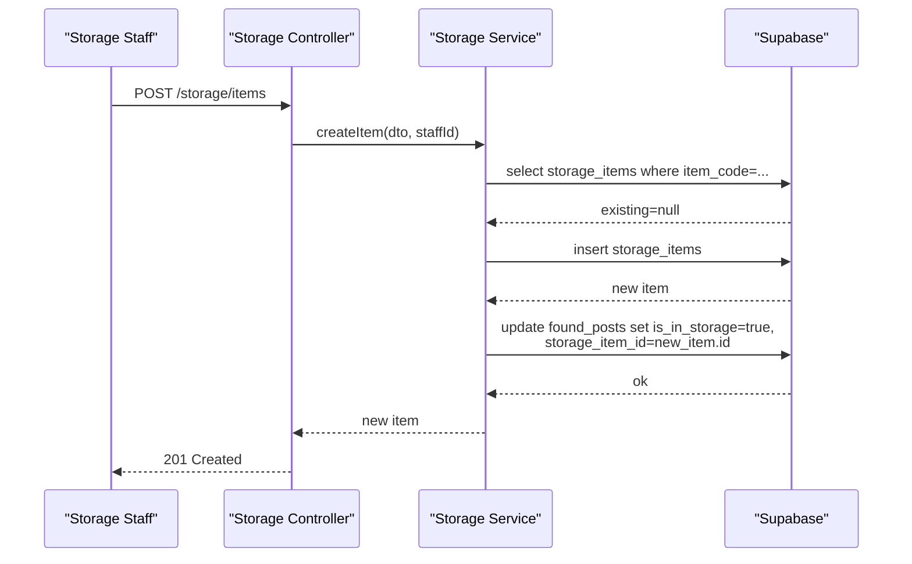
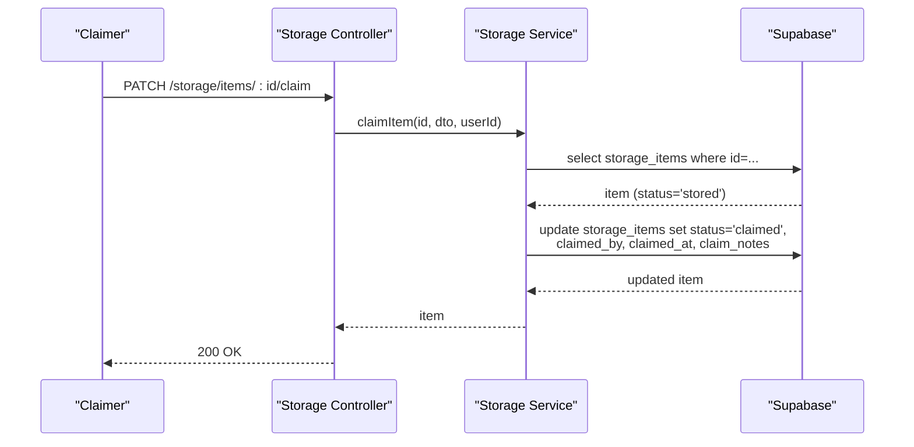
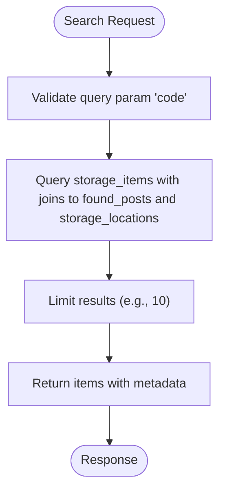
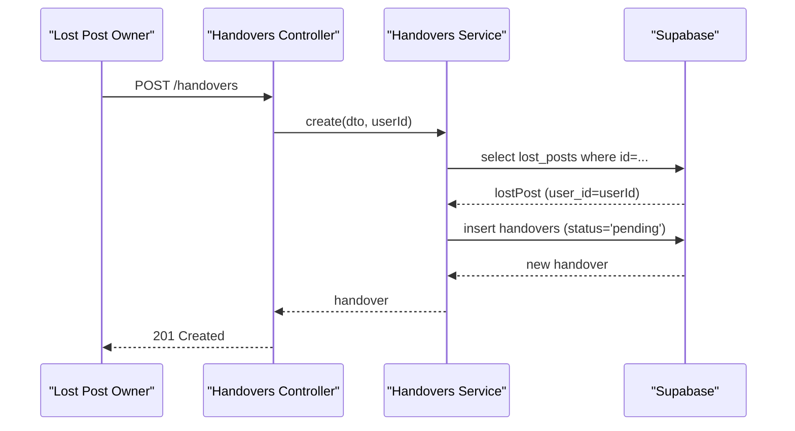
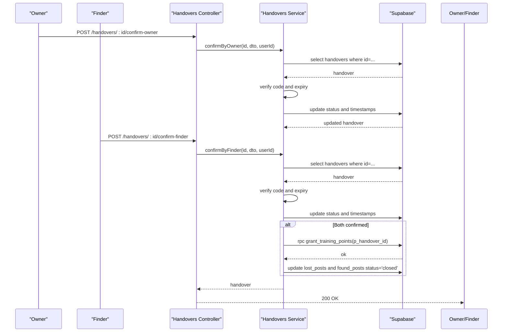
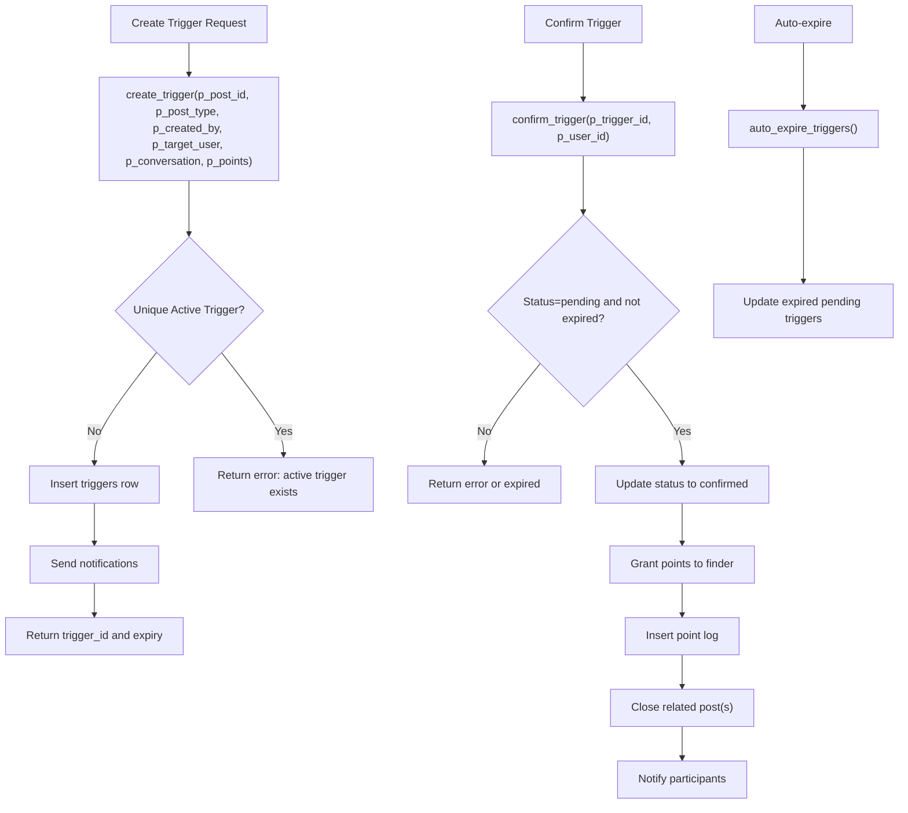
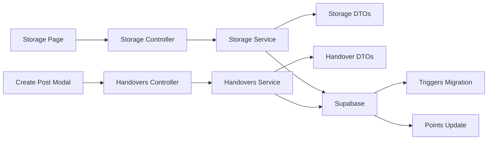

# Storage and Handover System

<cite>
**Referenced Files in This Document**
- [storage.controller.ts](file://backend/src/modules/storage/storage.controller.ts)
- [storage.service.ts](file://backend/src/modules/storage/storage.service.ts)
- [storage.dto.ts](file://backend/src/modules/storage/dto/storage.dto.ts)
- [handovers.controller.ts](file://backend/src/modules/handovers/handovers.controller.ts)
- [handovers.service.ts](file://backend/src/modules/handovers/handovers.service.ts)
- [handover.dto.ts](file://backend/src/modules/handovers/dto/handover.dto.ts)
- [triggers_migration.sql](file://backend/sql/triggers_migration.sql)
- [update_trigger_points.sql](file://backend/sql/update_trigger_points.sql)
- [user.entity.ts](file://backend/src/modules/auth/entities/user.entity.ts)
- [page.tsx](file://frontend/app/storage/page.tsx)
- [CreatePostModal.tsx](file://frontend/app/components/CreatePostModal.tsx)
- [OVERVIEW.md](file://OVERVIEW.md)
</cite>

## Table of Contents
1. [Introduction](#introduction)
2. [Project Structure](#project-structure)
3. [Core Components](#core-components)
4. [Architecture Overview](#architecture-overview)
5. [Detailed Component Analysis](#detailed-component-analysis)
6. [Dependency Analysis](#dependency-analysis)
7. [Performance Considerations](#performance-considerations)
8. [Troubleshooting Guide](#troubleshooting-guide)
9. [Conclusion](#conclusion)
10. [Appendices](#appendices)

## Introduction
This document describes the Storage and Handover System that integrates campus storage facilities with item handover workflows. It covers:
- Storage entity management: locations, items, and physical tracking
- Item lifecycle: storage, claiming, and disposal
- Handover service: request creation, verification, completion, and point awards
- Audit and transaction management: database triggers and stored procedures
- Frontend integration: storage location browsing and post creation with storage flagging
- Entity relationships: posts, users, and storage facilities

## Project Structure
The system spans backend NestJS modules (Storage and Handovers) and shared database schemas, plus frontend pages for storage visibility and post creation.



**Diagram sources**
- [storage.controller.ts:1-60](file://backend/src/modules/storage/storage.controller.ts#L1-L60)
- [storage.service.ts:1-117](file://backend/src/modules/storage/storage.service.ts#L1-L117)
- [handovers.controller.ts:1-45](file://backend/src/modules/handovers/handovers.controller.ts#L1-L45)
- [handovers.service.ts:1-147](file://backend/src/modules/handovers/handovers.service.ts#L1-L147)
- [storage.dto.ts:1-28](file://backend/src/modules/storage/dto/storage.dto.ts#L1-L28)
- [handover.dto.ts:1-34](file://backend/src/modules/handovers/dto/handover.dto.ts#L1-L34)
- [OVERVIEW.md:348-403](file://OVERVIEW.md#L348-L403)
- [triggers_migration.sql:1-338](file://backend/sql/triggers_migration.sql#L1-L338)
- [update_trigger_points.sql:1-132](file://backend/sql/update_trigger_points.sql#L1-L132)
- [page.tsx:1-146](file://frontend/app/storage/page.tsx#L1-L146)
- [CreatePostModal.tsx:1-584](file://frontend/app/components/CreatePostModal.tsx#L1-L584)

**Section sources**
- [storage.controller.ts:1-60](file://backend/src/modules/storage/storage.controller.ts#L1-L60)
- [storage.service.ts:1-117](file://backend/src/modules/storage/storage.service.ts#L1-L117)
- [handovers.controller.ts:1-45](file://backend/src/modules/handovers/handovers.controller.ts#L1-L45)
- [handovers.service.ts:1-147](file://backend/src/modules/handovers/handovers.service.ts#L1-L147)
- [storage.dto.ts:1-28](file://backend/src/modules/storage/dto/storage.dto.ts#L1-L28)
- [handover.dto.ts:1-34](file://backend/src/modules/handovers/dto/handover.dto.ts#L1-L34)
- [OVERVIEW.md:348-403](file://OVERVIEW.md#L348-L403)
- [triggers_migration.sql:1-338](file://backend/sql/triggers_migration.sql#L1-L338)
- [update_trigger_points.sql:1-132](file://backend/sql/update_trigger_points.sql#L1-L132)
- [page.tsx:1-146](file://frontend/app/storage/page.tsx#L1-L146)
- [CreatePostModal.tsx:1-584](file://frontend/app/components/CreatePostModal.tsx#L1-L584)

## Core Components
- Storage Module
  - Controllers expose endpoints for locations, items, search, and item claims
  - Services encapsulate Supabase queries and business rules
  - DTOs validate request payloads
- Handovers Module
  - Controllers manage handover requests and confirmations
  - Services enforce ownership checks, verification codes, and completion logic
  - DTOs validate handover creation and confirmation
- Database Layer
  - Storage schema defines locations and items with statuses and timelines
  - Triggers and stored procedures manage point awards and post closure
- Frontend Integration
  - Storage page lists active storage locations
  - Create Post Modal supports marking found items as “in storage”

**Section sources**
- [storage.controller.ts:1-60](file://backend/src/modules/storage/storage.controller.ts#L1-L60)
- [storage.service.ts:1-117](file://backend/src/modules/storage/storage.service.ts#L1-L117)
- [storage.dto.ts:1-28](file://backend/src/modules/storage/dto/storage.dto.ts#L1-L28)
- [handovers.controller.ts:1-45](file://backend/src/modules/handovers/handovers.controller.ts#L1-L45)
- [handovers.service.ts:1-147](file://backend/src/modules/handovers/handovers.service.ts#L1-L147)
- [handover.dto.ts:1-34](file://backend/src/modules/handovers/dto/handover.dto.ts#L1-L34)
- [OVERVIEW.md:348-403](file://OVERVIEW.md#L348-L403)
- [triggers_migration.sql:1-338](file://backend/sql/triggers_migration.sql#L1-L338)
- [update_trigger_points.sql:1-132](file://backend/sql/update_trigger_points.sql#L1-L132)
- [page.tsx:1-146](file://frontend/app/storage/page.tsx#L1-L146)
- [CreatePostModal.tsx:1-584](file://frontend/app/components/CreatePostModal.tsx#L1-L584)

## Architecture Overview
The system follows a layered architecture:
- Presentation layer: Controllers expose REST endpoints
- Application layer: Services implement workflows and validations
- Persistence layer: Supabase-backed repositories with database triggers and stored procedures
- Frontend: Next.js pages and modals integrate with backend APIs



**Diagram sources**
- [storage.controller.ts:1-60](file://backend/src/modules/storage/storage.controller.ts#L1-L60)
- [handovers.controller.ts:1-45](file://backend/src/modules/handovers/handovers.controller.ts#L1-L45)
- [storage.service.ts:1-117](file://backend/src/modules/storage/storage.service.ts#L1-L117)
- [handovers.service.ts:1-147](file://backend/src/modules/handovers/handovers.service.ts#L1-L147)
- [triggers_migration.sql:1-338](file://backend/sql/triggers_migration.sql#L1-L338)
- [update_trigger_points.sql:1-132](file://backend/sql/update_trigger_points.sql#L1-L132)

## Detailed Component Analysis

### Storage Module

#### Storage Entities and Relationships
- Storage Locations: physical campuses and desks with contact info and operating hours
- Storage Items: tracked by item_code, linked to found posts and locations, with status lifecycle
- Users: staff and users who submit, receive, and claim items

```mermaid
erDiagram
STORAGE_LOCATIONS {
uuid id PK
string name
text address
string building
string floor
string campus
string contact_phone
string contact_name
string open_hours
boolean is_active
timestamptz created_at
}
STORAGE_ITEMS {
uuid id PK
uuid found_post_id FK
uuid storage_location_id FK
string item_code UK
enum status
uuid submitted_by
uuid received_by
uuid claimed_by
timestamptz claimed_at
text claim_notes
timestamptz stored_at
timestamptz discard_after
timestamptz created_at
timestamptz updated_at
}
FOUND_POSTS {
uuid id PK
uuid storage_item_id FK
boolean is_in_storage
-- other fields --
}
USERS {
uuid id PK
string full_name
string email
string role
int training_points
-- other fields --
}
STORAGE_LOCATIONS ||--o{ STORAGE_ITEMS : "hosts"
STORAGE_ITEMS }o--|| FOUND_POSTS : "tracks"
USERS ||--o{ STORAGE_ITEMS : "submits"
USERS ||--o{ STORAGE_ITEMS : "receives"
USERS ||--o{ STORAGE_ITEMS : "claims"
```

**Diagram sources**
- [OVERVIEW.md:348-403](file://OVERVIEW.md#L348-L403)

**Section sources**
- [OVERVIEW.md:348-403](file://OVERVIEW.md#L348-L403)

#### Storage Workflows

##### Storage Allocation Workflow
- A staff member creates a storage item from a found post
- The system validates uniqueness of item_code
- The storage item is inserted and the associated found post is marked as “in storage”
- The found post links back to the storage item via foreign key



**Diagram sources**
- [storage.controller.ts:46-58](file://backend/src/modules/storage/storage.controller.ts#L46-L58)
- [storage.service.ts:53-78](file://backend/src/modules/storage/storage.service.ts#L53-L78)

**Section sources**
- [storage.controller.ts:46-58](file://backend/src/modules/storage/storage.controller.ts#L46-L58)
- [storage.service.ts:53-78](file://backend/src/modules/storage/storage.service.ts#L53-L78)

##### Item Retrieval Workflow
- Authorized users claim stored items
- The system verifies the item’s status is “stored”
- The claim updates status to “claimed” and records claim metadata



**Diagram sources**
- [storage.controller.ts:54-58](file://backend/src/modules/storage/storage.controller.ts#L54-L58)
- [storage.service.ts:80-100](file://backend/src/modules/storage/storage.service.ts#L80-L100)

**Section sources**
- [storage.controller.ts:54-58](file://backend/src/modules/storage/storage.controller.ts#L54-L58)
- [storage.service.ts:80-100](file://backend/src/modules/storage/storage.service.ts#L80-L100)

##### Search and Details
- Public endpoints support searching by item_code and fetching item details with related post and location data



**Diagram sources**
- [storage.controller.ts:32-37](file://backend/src/modules/storage/storage.controller.ts#L32-L37)
- [storage.service.ts:102-115](file://backend/src/modules/storage/storage.service.ts#L102-L115)

**Section sources**
- [storage.controller.ts:32-37](file://backend/src/modules/storage/storage.controller.ts#L32-L37)
- [storage.service.ts:102-115](file://backend/src/modules/storage/storage.service.ts#L102-L115)

#### Storage DTOs
- CreateStorageItemDto: enforces UUIDs for found_post_id and storage_location_id, item_code uniqueness, optional discard_after date
- ClaimStorageItemDto: claim_notes for audit trail

**Section sources**
- [storage.dto.ts:1-28](file://backend/src/modules/storage/dto/storage.dto.ts#L1-L28)

### Handover Module

#### Handover Entities and Relationships
- Handovers link lost and found posts with optional conversation and handover location/note
- Verification codes with expiration drive secure handover completion
- Completion triggers point grants and post closures

```mermaid
erDiagram
HANDOVERS {
uuid id PK
uuid lost_post_id FK
uuid found_post_id FK
uuid conversation_id FK
string status
string verification_code
timestamptz code_expires_at
boolean points_awarded
uuid confirmed_by_owner_id
timestamptz owner_confirmed_at
uuid confirmed_by_finder_id
timestamptz finder_confirmed_at
timestamptz completed_at
timestamptz created_at
}
LOST_POSTS {
uuid id PK
string status
-- other fields --
}
FOUND_POSTS {
uuid id PK
string status
-- other fields --
}
USERS {
uuid id PK
string role
int training_points
-- other fields --
}
HANDOVERS }o--|| LOST_POSTS : "initiates"
HANDOVERS }o--|| FOUND_POSTS : "resolves"
USERS ||--o{ HANDOVERS : "confirms"
```

**Diagram sources**
- [handovers.service.ts:12-32](file://backend/src/modules/handovers/handovers.service.ts#L12-L32)
- [handovers.service.ts:34-48](file://backend/src/modules/handovers/handovers.service.ts#L34-L48)
- [handovers.service.ts:50-84](file://backend/src/modules/handovers/handovers.service.ts#L50-L84)
- [handovers.service.ts:86-115](file://backend/src/modules/handovers/handovers.service.ts#L86-L115)

**Section sources**
- [handovers.service.ts:12-32](file://backend/src/modules/handovers/handovers.service.ts#L12-L32)
- [handovers.service.ts:34-48](file://backend/src/modules/handovers/handovers.service.ts#L34-L48)
- [handovers.service.ts:50-84](file://backend/src/modules/handovers/handovers.service.ts#L50-L84)
- [handovers.service.ts:86-115](file://backend/src/modules/handovers/handovers.service.ts#L86-L115)

#### Handover Workflows

##### Creation and Ownership Verification
- Only the owner of the lost post can create a handover request
- Status initialized as pending; verification_code generated by DB default



**Diagram sources**
- [handovers.controller.ts:15-19](file://backend/src/modules/handovers/handovers.controller.ts#L15-L19)
- [handovers.service.ts:12-32](file://backend/src/modules/handovers/handovers.service.ts#L12-L32)

**Section sources**
- [handovers.controller.ts:15-19](file://backend/src/modules/handovers/handovers.controller.ts#L15-L19)
- [handovers.service.ts:12-32](file://backend/src/modules/handovers/handovers.service.ts#L12-L32)

##### Owner and Finder Confirmation
- Both parties confirm with verification_code and expiration check
- First confirmation sets respective timestamps and status
- Second confirmation completes the handover, grants points, and closes posts



**Diagram sources**
- [handovers.controller.ts:33-43](file://backend/src/modules/handovers/handovers.controller.ts#L33-L43)
- [handovers.service.ts:50-84](file://backend/src/modules/handovers/handovers.service.ts#L50-L84)
- [handovers.service.ts:86-115](file://backend/src/modules/handovers/handovers.service.ts#L86-L115)
- [handovers.service.ts:117-131](file://backend/src/modules/handovers/handovers.service.ts#L117-L131)

**Section sources**
- [handovers.controller.ts:33-43](file://backend/src/modules/handovers/handovers.controller.ts#L33-L43)
- [handovers.service.ts:50-84](file://backend/src/modules/handovers/handovers.service.ts#L50-L84)
- [handovers.service.ts:86-115](file://backend/src/modules/handovers/handovers.service.ts#L86-L115)
- [handovers.service.ts:117-131](file://backend/src/modules/handovers/handovers.service.ts#L117-L131)

#### Handover DTOs
- CreateHandoverDto: UUIDs for lost_post_id and found_post_id, optional conversation_id, handover location, and note
- ConfirmHandoverDto: verification_code string

**Section sources**
- [handover.dto.ts:1-34](file://backend/src/modules/handovers/dto/handover.dto.ts#L1-L34)

### Database Triggers and Stored Procedures

#### Trigger System Overview
- Triggers track handover requests with status lifecycle and expiration
- Functions create, confirm, and cancel triggers; auto-expire pending triggers
- Notifications and point logs are generated upon confirmations



**Diagram sources**
- [triggers_migration.sql:63-146](file://backend/sql/triggers_migration.sql#L63-L146)
- [triggers_migration.sql:153-259](file://backend/sql/triggers_migration.sql#L153-L259)
- [triggers_migration.sql:266-318](file://backend/sql/triggers_migration.sql#L266-L318)
- [triggers_migration.sql:325-336](file://backend/sql/triggers_migration.sql#L325-L336)

**Section sources**
- [triggers_migration.sql:63-146](file://backend/sql/triggers_migration.sql#L63-L146)
- [triggers_migration.sql:153-259](file://backend/sql/triggers_migration.sql#L153-L259)
- [triggers_migration.sql:266-318](file://backend/sql/triggers_migration.sql#L266-L318)
- [triggers_migration.sql:325-336](file://backend/sql/triggers_migration.sql#L325-L336)

#### Point Awarding Procedure
- The stored procedure grants training points to the finder and updates logs
- Posts are closed after successful handover completion

**Section sources**
- [update_trigger_points.sql:10-131](file://backend/sql/update_trigger_points.sql#L10-L131)

### Frontend Integration

#### Storage Locations Page
- Lists active storage locations with operational status, address, and counts
- Provides navigation to item listings per location

**Section sources**
- [page.tsx:1-146](file://frontend/app/storage/page.tsx#L1-L146)

#### Create Post Modal
- Supports marking found items as “in storage” during post creation
- Integrates with backend storage module for post creation

**Section sources**
- [CreatePostModal.tsx:446-462](file://frontend/app/components/CreatePostModal.tsx#L446-L462)

## Dependency Analysis



**Diagram sources**
- [storage.controller.ts:1-60](file://backend/src/modules/storage/storage.controller.ts#L1-L60)
- [storage.service.ts:1-117](file://backend/src/modules/storage/storage.service.ts#L1-L117)
- [handovers.controller.ts:1-45](file://backend/src/modules/handovers/handovers.controller.ts#L1-L45)
- [handovers.service.ts:1-147](file://backend/src/modules/handovers/handovers.service.ts#L1-L147)
- [storage.dto.ts:1-28](file://backend/src/modules/storage/dto/storage.dto.ts#L1-L28)
- [handover.dto.ts:1-34](file://backend/src/modules/handovers/dto/handover.dto.ts#L1-L34)
- [triggers_migration.sql:1-338](file://backend/sql/triggers_migration.sql#L1-L338)
- [update_trigger_points.sql:1-132](file://backend/sql/update_trigger_points.sql#L1-L132)
- [page.tsx:1-146](file://frontend/app/storage/page.tsx#L1-L146)
- [CreatePostModal.tsx:1-584](file://frontend/app/components/CreatePostModal.tsx#L1-L584)

**Section sources**
- [storage.controller.ts:1-60](file://backend/src/modules/storage/storage.controller.ts#L1-L60)
- [storage.service.ts:1-117](file://backend/src/modules/storage/storage.service.ts#L1-L117)
- [handovers.controller.ts:1-45](file://backend/src/modules/handovers/handovers.controller.ts#L1-L45)
- [handovers.service.ts:1-147](file://backend/src/modules/handovers/handovers.service.ts#L1-L147)
- [storage.dto.ts:1-28](file://backend/src/modules/storage/dto/storage.dto.ts#L1-L28)
- [handover.dto.ts:1-34](file://backend/src/modules/handovers/dto/handover.dto.ts#L1-L34)
- [triggers_migration.sql:1-338](file://backend/sql/triggers_migration.sql#L1-L338)
- [update_trigger_points.sql:1-132](file://backend/sql/update_trigger_points.sql#L1-L132)
- [page.tsx:1-146](file://frontend/app/storage/page.tsx#L1-L146)
- [CreatePostModal.tsx:1-584](file://frontend/app/components/CreatePostModal.tsx#L1-L584)

## Performance Considerations
- Database indexing: ensure indexes on storage_items (found_post_id, storage_location_id, status, item_code) and handovers (status, created_at) are maintained
- Pagination and limits: search endpoints limit results to reduce payload sizes
- Batch operations: consider bulk updates for status changes and point grants
- Caching: cache frequently accessed storage locations and post metadata where appropriate
- Asynchronous notifications: keep trigger confirmations lightweight to avoid blocking

## Troubleshooting Guide
- Storage item creation fails with duplicate item_code
  - Cause: item_code must be unique
  - Action: verify item_code and retry
  - Reference: [storage.service.ts:54-61](file://backend/src/modules/storage/storage.service.ts#L54-L61)
- Claim item fails due to invalid status
  - Cause: item not in “stored” status
  - Action: check item status before claiming
  - Reference: [storage.service.ts:81-84](file://backend/src/modules/storage/storage.service.ts#L81-L84)
- Handover confirmation rejected
  - Cause: incorrect verification_code or expired code
  - Action: reissue verification code and retry within expiry window
  - Reference: [handovers.service.ts:57-62](file://backend/src/modules/handovers/handovers.service.ts#L57-L62), [handovers.service.ts:89-94](file://backend/src/modules/handovers/handovers.service.ts#L89-L94)
- Points not awarded after completion
  - Cause: RPC grant_training_points failure or post closure errors
  - Action: inspect stored procedure and post update operations
  - Reference: [handovers.service.ts:117-131](file://backend/src/modules/handovers/handovers.service.ts#L117-L131), [update_trigger_points.sql:10-131](file://backend/sql/update_trigger_points.sql#L10-L131)
- Inventory tracking issues
  - Symptom: mismatch between found post and storage item
  - Action: verify foreign key linkage and is_in_storage flag
  - Reference: [OVERVIEW.md:398-403](file://OVERVIEW.md#L398-L403)

**Section sources**
- [storage.service.ts:54-61](file://backend/src/modules/storage/storage.service.ts#L54-L61)
- [storage.service.ts:81-84](file://backend/src/modules/storage/storage.service.ts#L81-L84)
- [handovers.service.ts:57-62](file://backend/src/modules/handovers/handovers.service.ts#L57-L62)
- [handovers.service.ts:89-94](file://backend/src/modules/handovers/handovers.service.ts#L89-L94)
- [handovers.service.ts:117-131](file://backend/src/modules/handovers/handovers.service.ts#L117-L131)
- [update_trigger_points.sql:10-131](file://backend/sql/update_trigger_points.sql#L10-L131)
- [OVERVIEW.md:398-403](file://OVERVIEW.md#L398-L403)

## Conclusion
The Storage and Handover System provides a robust framework for campus item management and secure handover completion. It leverages Supabase for persistence, database triggers for automation, and clear separation of concerns across controllers, services, and DTOs. The frontend integrates seamlessly to present storage locations and enable storage-flagged post creation. Proper indexing, validation, and auditing ensure reliability and transparency.

## Appendices

### API Endpoints Summary
- Storage
  - GET /storage/locations
  - GET /storage/items
  - GET /storage/items/search?code=...
  - GET /storage/items/:id
  - POST /storage/items (roles: admin, storage_staff)
  - PATCH /storage/items/:id/claim
- Handovers
  - POST /handovers
  - GET /handovers/my
  - GET /handovers/:id
  - POST /handovers/:id/confirm-owner
  - POST /handovers/:id/confirm-finder

**Section sources**
- [storage.controller.ts:18-58](file://backend/src/modules/storage/storage.controller.ts#L18-L58)
- [handovers.controller.ts:15-43](file://backend/src/modules/handovers/handovers.controller.ts#L15-L43)