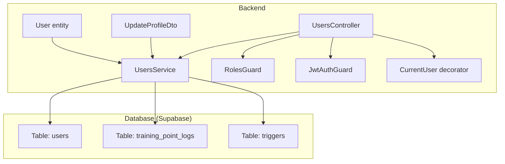
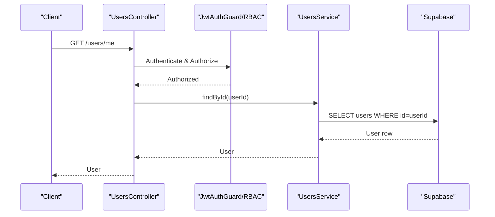
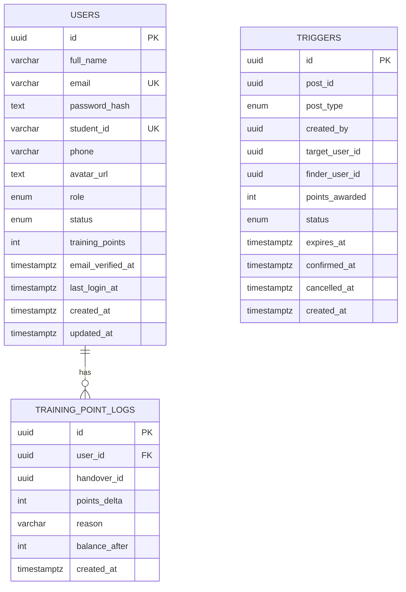
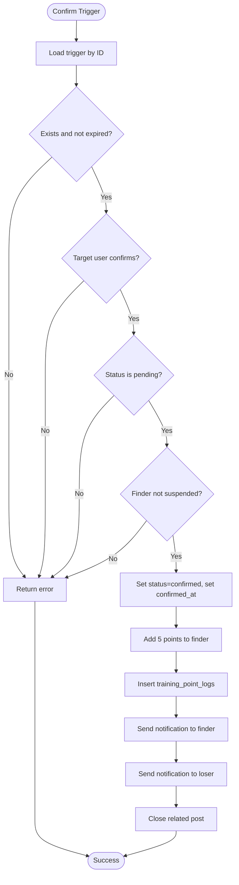
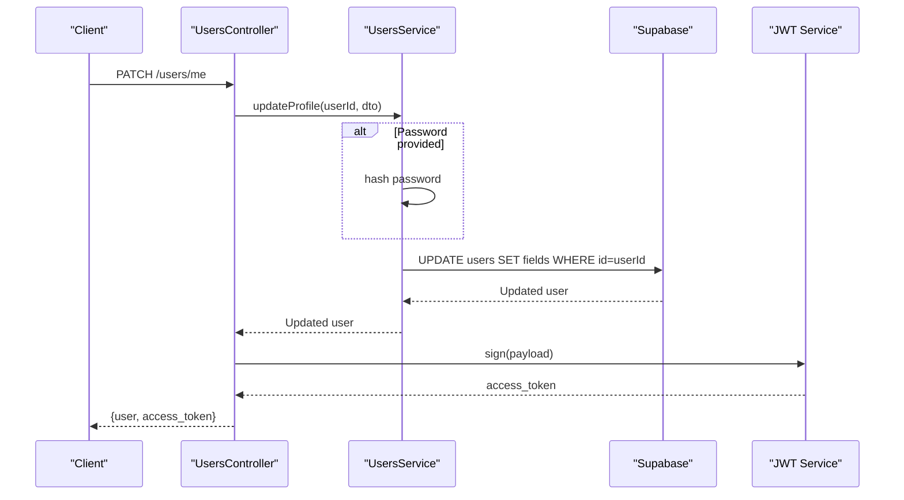
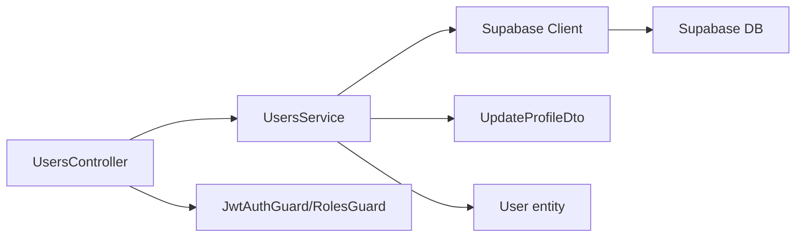

# User Management

<cite>
**Referenced Files in This Document**
- [user.entity.ts](file://backend/src/modules/auth/entities/user.entity.ts)
- [update-profile.dto.ts](file://backend/src/modules/users/dto/update-profile.dto.ts)
- [users.service.ts](file://backend/src/modules/users/users.service.ts)
- [users.controller.ts](file://backend/src/modules/users/users.controller.ts)
- [roles.guard.ts](file://backend/src/common/guards/roles.guard.ts)
- [roles.decorator.ts](file://backend/src/common/decorators/roles.decorator.ts)
- [jwt-auth.guard.ts](file://backend/src/common/guards/jwt-auth.guard.ts)
- [current-user.decorator.ts](file://backend/src/common/decorators/current-user.decorator.ts)
- [register.dto.ts](file://backend/src/modules/auth/dto/register.dto.ts)
- [login.dto.ts](file://backend/src/modules/auth/dto/login.dto.ts)
- [triggers_permissions.sql](file://backend/sql/triggers_permissions.sql)
- [update_trigger_points.sql](file://backend/sql/update_trigger_points.sql)
- [OVERVIEW.md](file://OVERVIEW.md)
</cite>

## Table of Contents
1. [Introduction](#introduction)
2. [Project Structure](#project-structure)
3. [Core Components](#core-components)
4. [Architecture Overview](#architecture-overview)
5. [Detailed Component Analysis](#detailed-component-analysis)
6. [Dependency Analysis](#dependency-analysis)
7. [Performance Considerations](#performance-considerations)
8. [Troubleshooting Guide](#troubleshooting-guide)
9. [Conclusion](#conclusion)
10. [Appendices](#appendices)

## Introduction
This document provides comprehensive data model documentation for the User Management system. It covers user entity relationships, field definitions, training points allocation, primary/foreign keys, indexes, and constraints for user profiles and permissions. It also explains data validation rules, profile management workflows, training points calculation algorithms, database schema diagrams, sample user data, user service methods, profile update operations, role-based access patterns, user lifecycle management, account status handling, administrative controls, and user data security and privacy requirements.

## Project Structure
The User Management system spans backend NestJS modules and Supabase-managed database tables. Key areas include:
- Authentication and user entity definition
- User profile management (update, retrieval)
- Training points and logs
- Role-based access control (RBAC)
- Database schema and triggers for training point updates

**Diagram sources**
- [users.controller.ts:1-94](file://backend/src/modules/users/users.controller.ts#L1-L94)
- [users.service.ts:1-136](file://backend/src/modules/users/users.service.ts#L1-L136)
- [roles.guard.ts:1-28](file://backend/src/common/guards/roles.guard.ts#L1-L28)
- [jwt-auth.guard.ts](file://backend/src/common/guards/jwt-auth.guard.ts)
- [current-user.decorator.ts](file://backend/src/common/decorators/current-user.decorator.ts)
- [user.entity.ts:1-19](file://backend/src/modules/auth/entities/user.entity.ts#L1-L19)
- [update-profile.dto.ts:1-38](file://backend/src/modules/users/dto/update-profile.dto.ts#L1-L38)
- [OVERVIEW.md:84-99](file://OVERVIEW.md#L84-L99)
- [OVERVIEW.md:514-522](file://OVERVIEW.md#L514-L522)

**Section sources**
- [users.controller.ts:1-94](file://backend/src/modules/users/users.controller.ts#L1-L94)
- [users.service.ts:1-136](file://backend/src/modules/users/users.service.ts#L1-L136)
- [roles.guard.ts:1-28](file://backend/src/common/guards/roles.guard.ts#L1-L28)
- [jwt-auth.guard.ts](file://backend/src/common/guards/jwt-auth.guard.ts)
- [current-user.decorator.ts](file://backend/src/common/decorators/current-user.decorator.ts)
- [user.entity.ts:1-19](file://backend/src/modules/auth/entities/user.entity.ts#L1-L19)
- [update-profile.dto.ts:1-38](file://backend/src/modules/users/dto/update-profile.dto.ts#L1-L38)
- [OVERVIEW.md:84-99](file://OVERVIEW.md#L84-L99)
- [OVERVIEW.md:514-522](file://OVERVIEW.md#L514-L522)

## Core Components
- User entity: Defines the user data model with fields for identity, credentials, profile, role, status, training points, and timestamps.
- UpdateProfileDto: Validates profile update requests (name, phone, avatar, email, password, bio).
- UsersService: Implements user operations including profile retrieval, updates, training history, training score computation, listing users, and status updates.
- UsersController: Exposes REST endpoints for self-service and admin operations with JWT and RBAC guards.
- Guards and Decorators: Enforce authentication via JWT and authorization via roles.
- Database schema: Users table with constraints and indexes; training_point_logs with foreign key to users; triggers table with policies and functions for training point updates.

**Section sources**
- [user.entity.ts:1-19](file://backend/src/modules/auth/entities/user.entity.ts#L1-L19)
- [update-profile.dto.ts:1-38](file://backend/src/modules/users/dto/update-profile.dto.ts#L1-L38)
- [users.service.ts:13-136](file://backend/src/modules/users/users.service.ts#L13-L136)
- [users.controller.ts:29-92](file://backend/src/modules/users/users.controller.ts#L29-L92)
- [roles.guard.ts:1-28](file://backend/src/common/guards/roles.guard.ts#L1-L28)
- [roles.decorator.ts:1-5](file://backend/src/common/decorators/roles.decorator.ts#L1-L5)
- [OVERVIEW.md:84-99](file://OVERVIEW.md#L84-L99)
- [OVERVIEW.md:514-522](file://OVERVIEW.md#L514-L522)

## Architecture Overview
The system follows a layered architecture:
- Controllers handle HTTP requests and apply guards.
- Services encapsulate business logic and interact with Supabase.
- Entities and DTOs define data contracts and validation rules.
- Database enforces referential integrity and access control via RLS and policies.

**Diagram sources**
- [users.controller.ts:29-33](file://backend/src/modules/users/users.controller.ts#L29-L33)
- [users.service.ts:13-22](file://backend/src/modules/users/users.service.ts#L13-L22)
- [jwt-auth.guard.ts](file://backend/src/common/guards/jwt-auth.guard.ts)
- [roles.guard.ts:1-28](file://backend/src/common/guards/roles.guard.ts#L1-L28)

## Detailed Component Analysis

### User Entity and Data Model
- Identity and credentials: id, full_name, email, password_hash.
- Profile: student_id, phone, avatar_url, bio.
- Access control: role (enum), status (enum), email_verified_at, last_login_at.
- Metrics: training_points, timestamps created_at/updated_at.

Constraints and defaults:
- Unique constraints: email, student_id.
- Enumerations: role, status.
- Defaults: role='user', status='pending_verify', training_points=0.

Indexes:
- Email, student_id, role for efficient filtering and lookups.

**Diagram sources**
- [OVERVIEW.md:84-99](file://OVERVIEW.md#L84-L99)
- [OVERVIEW.md:514-522](file://OVERVIEW.md#L514-L522)
- [update_trigger_points.sql:10-132](file://backend/sql/update_trigger_points.sql#L10-L132)

**Section sources**
- [user.entity.ts:1-19](file://backend/src/modules/auth/entities/user.entity.ts#L1-L19)
- [OVERVIEW.md:84-99](file://OVERVIEW.md#L84-L99)
- [OVERVIEW.md:514-522](file://OVERVIEW.md#L514-L522)

### Training Points Allocation and Calculation
Training points are awarded via triggers when a successful handover occurs:
- Default award: 5 points per confirmed trigger.
- Award applies only to the finder (person who picked up the item).
- Logs are recorded in training_point_logs with reason and balance_after.
- Functions enforce validation: existence, expiration, status checks, and finder account status.

**Diagram sources**
- [update_trigger_points.sql:10-132](file://backend/sql/update_trigger_points.sql#L10-L132)
- [triggers_permissions.sql:25-57](file://backend/sql/triggers_permissions.sql#L25-L57)

**Section sources**
- [update_trigger_points.sql:10-132](file://backend/sql/update_trigger_points.sql#L10-L132)
- [triggers_permissions.sql:25-57](file://backend/sql/triggers_permissions.sql#L25-L57)

### Data Validation Rules
- Registration:
  - full_name: string, min/max length constraints.
  - email: valid email format.
  - password: minimum length.
  - confirm_password: matches password.
  - student_id: optional numeric string with length constraints.
- Login:
  - email: valid email format.
  - password: string.
- Profile Update:
  - full_name: optional string, max length.
  - phone: optional string.
  - avatar_url: optional string.
  - email: optional valid email.
  - password: optional string with minimum length.
  - bio: optional string, max length.

**Section sources**
- [register.dto.ts:1-30](file://backend/src/modules/auth/dto/register.dto.ts#L1-L30)
- [login.dto.ts:1-13](file://backend/src/modules/auth/dto/login.dto.ts#L1-L13)
- [update-profile.dto.ts:1-38](file://backend/src/modules/users/dto/update-profile.dto.ts#L1-L38)

### Profile Management Workflows
- Retrieve profile: authenticated user fetches personal info.
- Update profile: authenticated user updates name, phone, avatar, email, password; password hashed before persistence.
- Token refresh: upon password change, a new JWT is issued.

**Diagram sources**
- [users.controller.ts:35-42](file://backend/src/modules/users/users.controller.ts#L35-L42)
- [users.service.ts:24-40](file://backend/src/modules/users/users.service.ts#L24-L40)

**Section sources**
- [users.controller.ts:29-42](file://backend/src/modules/users/users.controller.ts#L29-L42)
- [users.service.ts:13-40](file://backend/src/modules/users/users.service.ts#L13-L40)

### Role-Based Access Patterns
- RBAC enforcement:
  - RolesGuard checks required roles against the authenticated user’s role.
  - Roles decorator defines protected endpoints.
  - JwtAuthGuard ensures requests carry a valid JWT.
  - CurrentUser decorator injects the authenticated user into handlers.

Admin endpoints:
- View user details (admin-only).
- List all users with pagination.
- Suspend or activate a user (admin-only).

**Section sources**
- [roles.guard.ts:1-28](file://backend/src/common/guards/roles.guard.ts#L1-L28)
- [roles.decorator.ts:1-5](file://backend/src/common/decorators/roles.decorator.ts#L1-L5)
- [jwt-auth.guard.ts](file://backend/src/common/guards/jwt-auth.guard.ts)
- [current-user.decorator.ts](file://backend/src/common/decorators/current-user.decorator.ts)
- [users.controller.ts:62-92](file://backend/src/modules/users/users.controller.ts#L62-L92)

### User Lifecycle Management and Account Status Handling
- Lifecycle stages:
  - Registration: pending verification until email verified.
  - Active: verified and able to use platform.
  - Suspended: restricted access by admins.
- Status transitions:
  - Admin can activate or suspend accounts.
  - Finder account suspension prevents point awards.
- Training score computation aggregates:
  - Total points from users.training_points.
  - Handover count from triggers with status 'confirmed'.

**Section sources**
- [user.entity.ts:9-11](file://backend/src/modules/auth/entities/user.entity.ts#L9-L11)
- [users.service.ts:70-103](file://backend/src/modules/users/users.service.ts#L70-L103)
- [users.service.ts:124-134](file://backend/src/modules/users/users.service.ts#L124-L134)
- [update_trigger_points.sql:52-57](file://backend/sql/update_trigger_points.sql#L52-L57)

### Administrative Controls
- List users with pagination and metadata.
- View individual user details (admin).
- Update user status (suspend/activate).

**Section sources**
- [users.controller.ts:70-92](file://backend/src/modules/users/users.controller.ts#L70-L92)
- [users.service.ts:106-121](file://backend/src/modules/users/users.service.ts#L106-L121)
- [users.service.ts:124-134](file://backend/src/modules/users/users.service.ts#L124-L134)

### Sample User Data
Example rows conforming to the schema:
- users:
  - id: UUID
  - full_name: "John Doe"
  - email: "john.doe@example.com"
  - password_hash: bcrypt hash
  - student_id: "12345678" or null
  - phone: "1234567890" or null
  - avatar_url: "https://..." or null
  - role: "user" | "admin" | "storage_staff"
  - status: "active" | "suspended" | "pending_verify"
  - training_points: integer >= 0
  - email_verified_at: timestamptz or null
  - last_login_at: timestamptz or null
  - created_at/updated_at: timestamptz

- training_point_logs:
  - id: UUID
  - user_id: UUID referencing users.id
  - handover_id: UUID or null
  - points_delta: positive or negative integer
  - reason: short description
  - balance_after: integer
  - created_at: timestamptz

**Section sources**
- [OVERVIEW.md:84-99](file://OVERVIEW.md#L84-L99)
- [OVERVIEW.md:514-522](file://OVERVIEW.md#L514-L522)

## Dependency Analysis
- Controllers depend on Services and Guards.
- Services depend on Supabase client and DTOs.
- Entities define the shape validated by DTOs.
- Database constraints and policies enforce referential integrity and access control.

**Diagram sources**
- [users.controller.ts:1-94](file://backend/src/modules/users/users.controller.ts#L1-L94)
- [users.service.ts:1-136](file://backend/src/modules/users/users.service.ts#L1-L136)
- [roles.guard.ts:1-28](file://backend/src/common/guards/roles.guard.ts#L1-L28)
- [jwt-auth.guard.ts](file://backend/src/common/guards/jwt-auth.guard.ts)
- [user.entity.ts:1-19](file://backend/src/modules/auth/entities/user.entity.ts#L1-L19)
- [update-profile.dto.ts:1-38](file://backend/src/modules/users/dto/update-profile.dto.ts#L1-L38)

**Section sources**
- [users.controller.ts:1-94](file://backend/src/modules/users/users.controller.ts#L1-L94)
- [users.service.ts:1-136](file://backend/src/modules/users/users.service.ts#L1-L136)
- [roles.guard.ts:1-28](file://backend/src/common/guards/roles.guard.ts#L1-L28)
- [jwt-auth.guard.ts](file://backend/src/common/guards/jwt-auth.guard.ts)
- [user.entity.ts:1-19](file://backend/src/modules/auth/entities/user.entity.ts#L1-L19)
- [update-profile.dto.ts:1-38](file://backend/src/modules/users/dto/update-profile.dto.ts#L1-L38)

## Performance Considerations
- Indexes on users(email), users(student_id), users(role) improve filtering and lookup performance.
- Parallel queries for posts and logs reduce round-trips for training score computation.
- Use pagination for listing users to avoid large result sets.
- Keep training_point_logs indexed by user_id for fast history retrieval.

## Troubleshooting Guide
- Authentication failures:
  - Ensure JwtAuthGuard is applied and a valid JWT is present.
- Authorization failures:
  - Verify RolesGuard and Roles decorator match the user’s role.
- Profile update errors:
  - Confirm DTO validation passes (lengths, formats).
  - On password change, expect a new JWT in the response.
- Training points not updating:
  - Confirm trigger exists, is pending, not expired, and finder is not suspended.
  - Check training_point_logs insertion and notifications.

**Section sources**
- [jwt-auth.guard.ts](file://backend/src/common/guards/jwt-auth.guard.ts)
- [roles.guard.ts:1-28](file://backend/src/common/guards/roles.guard.ts#L1-L28)
- [users.controller.ts:35-42](file://backend/src/modules/users/users.controller.ts#L35-L42)
- [update_trigger_points.sql:10-132](file://backend/sql/update_trigger_points.sql#L10-L132)

## Conclusion
The User Management system integrates a robust data model with Supabase, enforcing strong validation, role-based access control, and secure profile management. Training points are calculated atomically via database functions and logged for auditability. Administrative controls enable safe user lifecycle management, while indexes and constraints optimize performance and data integrity.

## Appendices

### Database Schema Reference
- users: primary key id; unique email and student_id; enums role and status; default training_points; timestamps.
- training_point_logs: foreign key user_id referencing users; optional handover_id; points_delta and reason; balance_after; created_at.
- triggers: references posts and users; status and expiration; points_awarded; notifications handled in functions.

**Section sources**
- [OVERVIEW.md:84-99](file://OVERVIEW.md#L84-L99)
- [OVERVIEW.md:514-522](file://OVERVIEW.md#L514-L522)
- [update_trigger_points.sql:10-132](file://backend/sql/update_trigger_points.sql#L10-L132)
- [triggers_permissions.sql:25-57](file://backend/sql/triggers_permissions.sql#L25-L57)