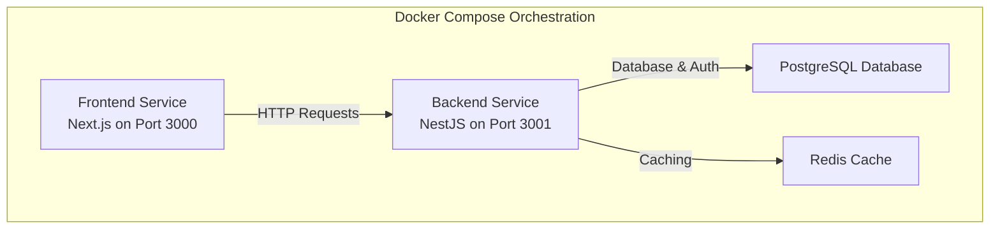
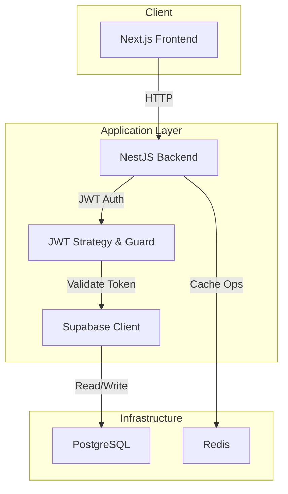
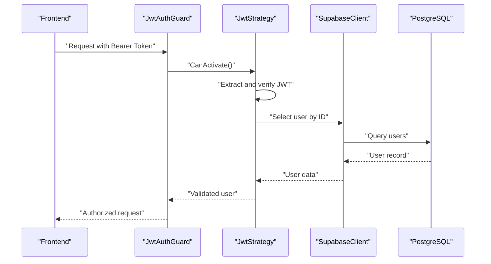
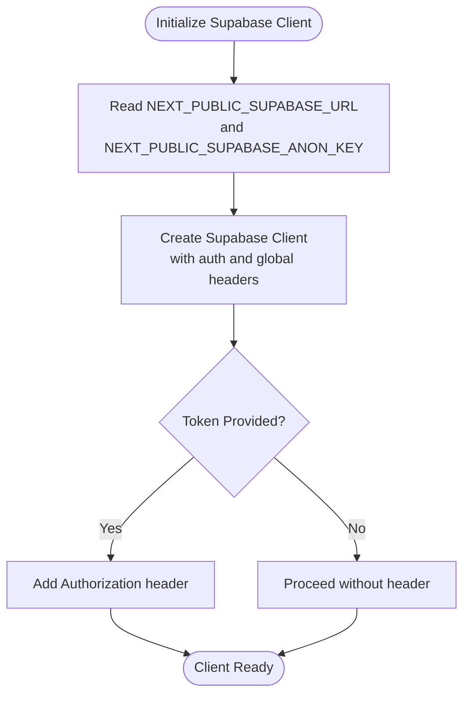
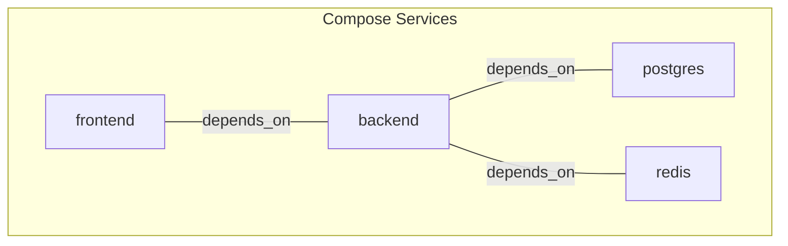
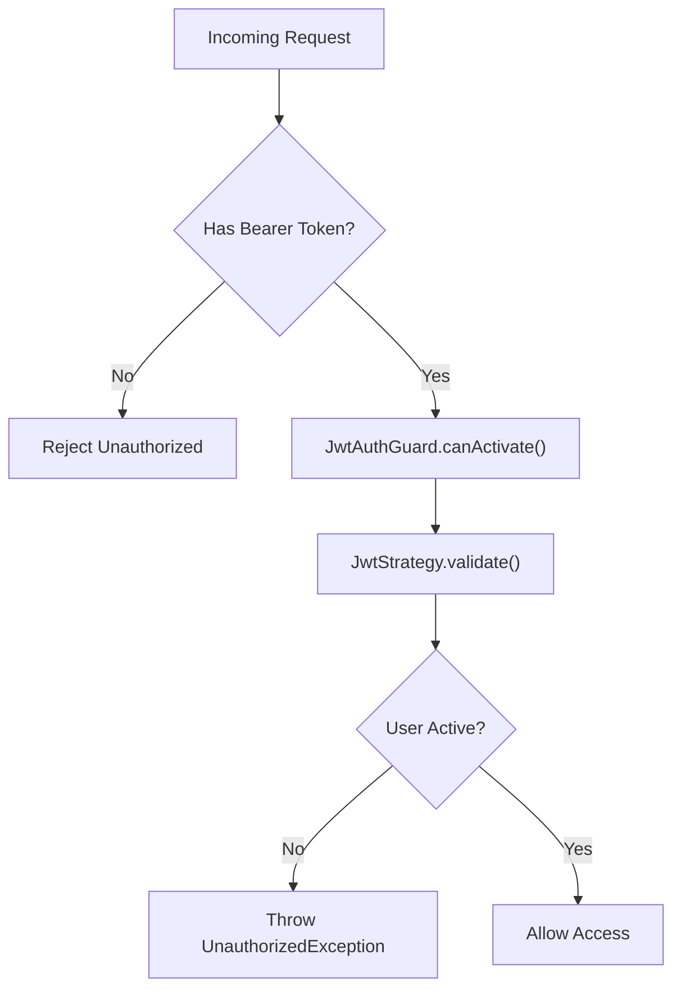
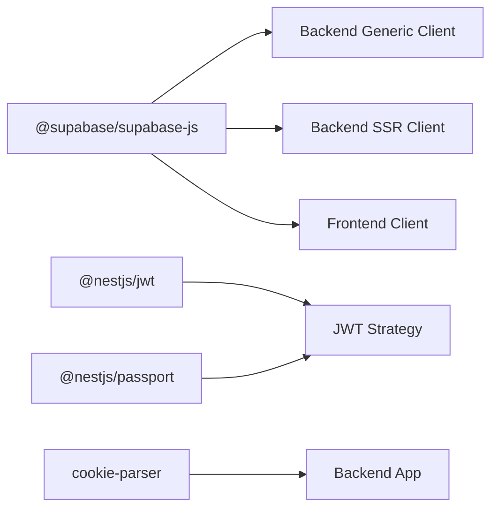

# Configuration and Environment

<cite>
**Referenced Files in This Document**
- [docker-compose.yml](file://docker-compose.yml)
- [backend/Dockerfile](file://backend/Dockerfile)
- [frontend/Dockerfile](file://frontend/Dockerfile)
- [backend/src/main.ts](file://backend/src/main.ts)
- [backend/src/config/supabase.config.ts](file://backend/src/config/supabase.config.ts)
- [backend/src/utils/supabase/client.ts](file://backend/src/utils/supabase/client.ts)
- [backend/src/modules/auth/strategies/jwt.strategy.ts](file://backend/src/modules/auth/strategies/jwt.strategy.ts)
- [backend/src/common/guards/jwt-auth.guard.ts](file://backend/src/common/guards/jwt-auth.guard.ts)
- [frontend/app/lib/supabase.ts](file://frontend/app/lib/supabase.ts)
- [frontend/next.config.ts](file://frontend/next.config.ts)
- [backend/package.json](file://backend/package.json)
- [frontend/package.json](file://frontend/package.json)
</cite>

## Table of Contents
1. [Introduction](#introduction)
2. [Project Structure](#project-structure)
3. [Core Components](#core-components)
4. [Architecture Overview](#architecture-overview)
5. [Detailed Component Analysis](#detailed-component-analysis)
6. [Dependency Analysis](#dependency-analysis)
7. [Performance Considerations](#performance-considerations)
8. [Troubleshooting Guide](#troubleshooting-guide)
9. [Conclusion](#conclusion)
10. [Appendices](#appendices)

## Introduction
This document provides comprehensive configuration and environment setup guidance for the MissLost application. It covers:
- Backend configuration: Supabase credentials, JWT secrets, database connections, and CORS settings
- Frontend configuration: Next.js settings, Supabase client initialization, and environment-specific optimizations
- Docker configuration: Multi-container deployment, service dependencies, networks, and volumes
- Security configurations: CORS policies, JWT token settings, and authentication guard implementations
- Production deployment considerations: environment variable management and configuration validation
- Examples for local development, staging, and production environments

## Project Structure
The project consists of two primary containers orchestrated via Docker Compose:
- Backend service (NestJS): exposes port 3001, depends on PostgreSQL and Redis, loads environment variables from a dedicated .env file
- Frontend service (Next.js): exposes port 3000, depends on the backend, loads environment variables from a dedicated .env.local file
- Shared infrastructure: PostgreSQL and Redis containers

**Diagram sources**
- [docker-compose.yml:1-61](file://docker-compose.yml#L1-L61)

**Section sources**
- [docker-compose.yml:1-61](file://docker-compose.yml#L1-L61)
- [backend/Dockerfile:1-14](file://backend/Dockerfile#L1-L14)
- [frontend/Dockerfile:1-14](file://frontend/Dockerfile#L1-L14)

## Core Components
This section outlines the environment variables and configuration points used across the backend and frontend.

- Backend environment variables
  - Supabase client initialization requires:
    - SUPABASE_URL: Supabase project URL
    - SUPABASE_SERVICE_ROLE_KEY or SUPABASE_ANON_KEY: Supabase service role or anonymous key
  - JWT configuration:
    - JWT_SECRET: Secret used to sign and verify JWT tokens
  - CORS configuration:
    - FRONTEND_URL: Origin allowed for cross-origin requests
  - Port configuration:
    - PORT: Backend server port (default 3001)

- Frontend environment variables
  - NEXT_PUBLIC_SUPABASE_URL: Public Supabase project URL for client-side SDK
  - NEXT_PUBLIC_SUPABASE_ANON_KEY: Public Supabase anonymous key for client-side SDK

- Infrastructure dependencies
  - PostgreSQL: Hosted as a separate service with persistent volume
  - Redis: Hosted as a separate service for caching

**Section sources**
- [backend/src/config/supabase.config.ts:7-23](file://backend/src/config/supabase.config.ts#L7-L23)
- [backend/src/utils/supabase/client.ts:9-19](file://backend/src/utils/supabase/client.ts#L9-L19)
- [backend/src/modules/auth/strategies/jwt.strategy.ts:17-24](file://backend/src/modules/auth/strategies/jwt.strategy.ts#L17-L24)
- [backend/src/main.ts:24-27](file://backend/src/main.ts#L24-L27)
- [frontend/app/lib/supabase.ts:3-17](file://frontend/app/lib/supabase.ts#L3-L17)
- [docker-compose.yml:27-44](file://docker-compose.yml#L27-L44)

## Architecture Overview
The application follows a client-server architecture with Supabase as the identity and database provider. The frontend communicates with the backend over HTTP, while the backend interacts with Supabase for authentication and data persistence.

**Diagram sources**
- [backend/src/main.ts:24-27](file://backend/src/main.ts#L24-L27)
- [backend/src/modules/auth/strategies/jwt.strategy.ts:17-24](file://backend/src/modules/auth/strategies/jwt.strategy.ts#L17-L24)
- [backend/src/common/guards/jwt-auth.guard.ts:1-29](file://backend/src/common/guards/jwt-auth.guard.ts#L1-L29)
- [backend/src/config/supabase.config.ts:7-23](file://backend/src/config/supabase.config.ts#L7-L23)
- [frontend/app/lib/supabase.ts:3-17](file://frontend/app/lib/supabase.ts#L3-L17)

## Detailed Component Analysis

### Backend Configuration
- Supabase client initialization
  - The backend initializes a Supabase client using environment variables SUPABASE_URL and SUPABASE_SERVICE_ROLE_KEY or SUPABASE_ANON_KEY. Missing keys cause an immediate error during client creation.
  - The client is configured to disable session persistence to avoid conflicts.
- JWT strategy and guard
  - The JWT strategy extracts tokens from the Authorization header and validates them using JWT_SECRET. It queries the users table to ensure the token corresponds to an active user.
  - The JWT guard enforces authentication for protected routes and allows public routes marked with a decorator.
- CORS policy
  - The backend enables CORS with credentials and sets the origin from FRONTEND_URL. This ensures the frontend can send cookies and credentials securely.

**Diagram sources**
- [backend/src/common/guards/jwt-auth.guard.ts:13-27](file://backend/src/common/guards/jwt-auth.guard.ts#L13-L27)
- [backend/src/modules/auth/strategies/jwt.strategy.ts:26-38](file://backend/src/modules/auth/strategies/jwt.strategy.ts#L26-L38)
- [backend/src/config/supabase.config.ts:7-23](file://backend/src/config/supabase.config.ts#L7-L23)

**Section sources**
- [backend/src/config/supabase.config.ts:7-23](file://backend/src/config/supabase.config.ts#L7-L23)
- [backend/src/utils/supabase/client.ts:9-19](file://backend/src/utils/supabase/client.ts#L9-L19)
- [backend/src/modules/auth/strategies/jwt.strategy.ts:17-24](file://backend/src/modules/auth/strategies/jwt.strategy.ts#L17-L24)
- [backend/src/common/guards/jwt-auth.guard.ts:1-29](file://backend/src/common/guards/jwt-auth.guard.ts#L1-L29)
- [backend/src/main.ts:24-27](file://backend/src/main.ts#L24-L27)

### Frontend Configuration
- Supabase client initialization
  - The frontend creates a Supabase client using NEXT_PUBLIC_SUPABASE_URL and NEXT_PUBLIC_SUPABASE_ANON_KEY. It supports optional token injection via a global header for authenticated requests.
  - Session persistence is disabled to prevent conflicts when multiple instances are initialized per request.
- Next.js configuration
  - The Next.js configuration file exists and can be extended for environment-specific optimizations (e.g., image domains, redirects, headers).

**Diagram sources**
- [frontend/app/lib/supabase.ts:3-17](file://frontend/app/lib/supabase.ts#L3-L17)

**Section sources**
- [frontend/app/lib/supabase.ts:3-17](file://frontend/app/lib/supabase.ts#L3-L17)
- [frontend/next.config.ts:1-8](file://frontend/next.config.ts#L1-L8)

### Docker Configuration
- Multi-container deployment
  - Backend service builds from ./backend, exposes port 3001, depends on PostgreSQL and Redis, and loads environment variables from ./backend/.env.
  - Frontend service builds from ./frontend, exposes port 3000, depends on backend, and loads environment variables from ./frontend/.env.local.
  - PostgreSQL runs with a persistent volume named pgdata and default credentials for quick setup.
  - Redis runs without persistent volume.
- Container images and commands
  - Backend Dockerfile installs dependencies, builds the NestJS app, exposes port 3001, and starts the server with node dist/main.js.
  - Frontend Dockerfile installs dependencies, builds the Next.js app, exposes port 3000, and starts the server with npm start.

**Diagram sources**
- [docker-compose.yml:3-25](file://docker-compose.yml#L3-L25)

**Section sources**
- [docker-compose.yml:1-61](file://docker-compose.yml#L1-L61)
- [backend/Dockerfile:1-14](file://backend/Dockerfile#L1-L14)
- [frontend/Dockerfile:1-14](file://frontend/Dockerfile#L1-L14)

### Security Configuration
- CORS policy
  - Enabled with credentials support and origin controlled by FRONTEND_URL. Ensure this matches the frontend origin in each environment.
- JWT token settings
  - JWT_SECRET is loaded from configuration and used by passport-jwt to validate tokens. Tokens are extracted from the Authorization header.
- Authentication guard implementation
  - JwtAuthGuard integrates with NestJS Passport and reflects route metadata to allow public routes. It throws UnauthorizedException on validation failure.

**Diagram sources**
- [backend/src/common/guards/jwt-auth.guard.ts:13-27](file://backend/src/common/guards/jwt-auth.guard.ts#L13-L27)
- [backend/src/modules/auth/strategies/jwt.strategy.ts:26-38](file://backend/src/modules/auth/strategies/jwt.strategy.ts#L26-L38)

**Section sources**
- [backend/src/main.ts:24-27](file://backend/src/main.ts#L24-L27)
- [backend/src/modules/auth/strategies/jwt.strategy.ts:17-24](file://backend/src/modules/auth/strategies/jwt.strategy.ts#L17-L24)
- [backend/src/common/guards/jwt-auth.guard.ts:1-29](file://backend/src/common/guards/jwt-auth.guard.ts#L1-L29)

## Dependency Analysis
- Backend dependencies
  - Uses @supabase/supabase-js for client-side operations and @supabase/ssr for SSR contexts (note: backend uses the generic client).
  - Depends on @nestjs/jwt and passport-jwt for JWT handling.
  - Uses cookie-parser for secure token handling.
- Frontend dependencies
  - Uses @supabase/supabase-js for client-side Supabase operations.
  - Next.js framework for SSR/SSG and routing.

**Diagram sources**
- [backend/package.json:31-41](file://backend/package.json#L31-L41)
- [frontend/package.json:11-16](file://frontend/package.json#L11-L16)
- [backend/src/main.ts:10-11](file://backend/src/main.ts#L10-L11)

**Section sources**
- [backend/package.json:22-46](file://backend/package.json#L22-L46)
- [frontend/package.json:11-17](file://frontend/package.json#L11-L17)
- [backend/src/main.ts:10-11](file://backend/src/main.ts#L10-L11)

## Performance Considerations
- Disable session persistence in Supabase clients to avoid conflicts and reduce overhead.
- Use Redis for caching frequently accessed data to reduce database load.
- Configure CORS appropriately to minimize preflight requests and improve response times.
- Keep JWT_SECRET strong and rotate periodically; avoid exposing secrets in client-side code.

## Troubleshooting Guide
- Missing Supabase environment variables
  - Symptom: Backend fails to initialize Supabase client and throws an error.
  - Resolution: Set SUPABASE_URL and either SUPABASE_SERVICE_ROLE_KEY or SUPABASE_ANON_KEY.
- Invalid JWT token
  - Symptom: Requests fail with unauthorized errors after JwtStrategy validation.
  - Resolution: Ensure JWT_SECRET matches the backend configuration and tokens are issued by a trusted issuer.
- CORS errors
  - Symptom: Frontend receives CORS errors when calling backend APIs.
  - Resolution: Set FRONTEND_URL to match the frontend origin and ensure credentials are enabled.
- Cookie handling issues
  - Symptom: Sessions or tokens are not persisted or recognized.
  - Resolution: Ensure cookie-parser is enabled in the backend and CORS credentials are allowed.

**Section sources**
- [backend/src/config/supabase.config.ts:12-14](file://backend/src/config/supabase.config.ts#L12-L14)
- [backend/src/modules/auth/strategies/jwt.strategy.ts:34-35](file://backend/src/modules/auth/strategies/jwt.strategy.ts#L34-L35)
- [backend/src/main.ts:24-27](file://backend/src/main.ts#L24-L27)
- [backend/src/main.ts:10-11](file://backend/src/main.ts#L10-L11)

## Conclusion
This document outlined the configuration and environment setup for the MissLost application across backend, frontend, and Docker orchestration. By adhering to the environment variable requirements, securing JWT and CORS settings, and validating configurations, teams can deploy reliable local, staging, and production environments.

## Appendices

### Environment Variable Reference
- Backend
  - SUPABASE_URL: Supabase project URL
  - SUPABASE_SERVICE_ROLE_KEY or SUPABASE_ANON_KEY: Supabase service role or anonymous key
  - JWT_SECRET: Secret for signing JWT tokens
  - FRONTEND_URL: Allowed origin for CORS with credentials
  - PORT: Backend server port (default 3001)
- Frontend
  - NEXT_PUBLIC_SUPABASE_URL: Public Supabase project URL
  - NEXT_PUBLIC_SUPABASE_ANON_KEY: Public Supabase anonymous key

**Section sources**
- [backend/src/config/supabase.config.ts:9-10](file://backend/src/config/supabase.config.ts#L9-L10)
- [backend/src/utils/supabase/client.ts:11-12](file://backend/src/utils/supabase/client.ts#L11-L12)
- [backend/src/modules/auth/strategies/jwt.strategy.ts](file://backend/src/modules/auth/strategies/jwt.strategy.ts#L22)
- [backend/src/main.ts](file://backend/src/main.ts#L25)
- [frontend/app/lib/supabase.ts:3-4](file://frontend/app/lib/supabase.ts#L3-L4)

### Example Environments

- Local Development
  - Backend .env
    - SUPABASE_URL=https://your-project.supabase.co
    - SUPABASE_SERVICE_ROLE_KEY=your-service-role-key
    - JWT_SECRET=local-dev-secret-change-in-production
    - FRONTEND_URL=http://localhost:3000
    - PORT=3001
  - Frontend .env.local
    - NEXT_PUBLIC_SUPABASE_URL=https://your-project.supabase.co
    - NEXT_PUBLIC_SUPABASE_ANON_KEY=your-anon-key
- Staging
  - Backend .env
    - SUPABASE_URL=https://staging-project.supabase.co
    - SUPABASE_SERVICE_ROLE_KEY=staging-service-role-key
    - JWT_SECRET=a-strong-staging-secret
    - FRONTEND_URL=https://staging.yourapp.com
    - PORT=3001
  - Frontend .env.local
    - NEXT_PUBLIC_SUPABASE_URL=https://staging-project.supabase.co
    - NEXT_PUBLIC_SUPABASE_ANON_KEY=staging-anon-key
- Production
  - Backend .env
    - SUPABASE_URL=https://prod-project.supabase.co
    - SUPABASE_SERVICE_ROLE_KEY=prod-service-role-key
    - JWT_SECRET=a-very-strong-production-secret
    - FRONTEND_URL=https://prod.yourapp.com
    - PORT=3001
  - Frontend .env.local
    - NEXT_PUBLIC_SUPABASE_URL=https://prod-project.supabase.co
    - NEXT_PUBLIC_SUPABASE_ANON_KEY=prod-anon-key

**Section sources**
- [backend/src/main.ts](file://backend/src/main.ts#L25)
- [backend/src/modules/auth/strategies/jwt.strategy.ts](file://backend/src/modules/auth/strategies/jwt.strategy.ts#L22)
- [frontend/app/lib/supabase.ts:3-4](file://frontend/app/lib/supabase.ts#L3-L4)