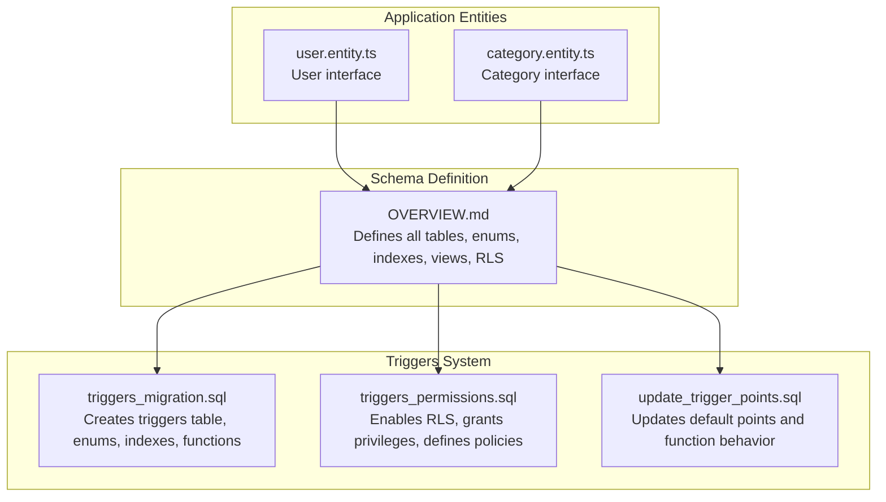
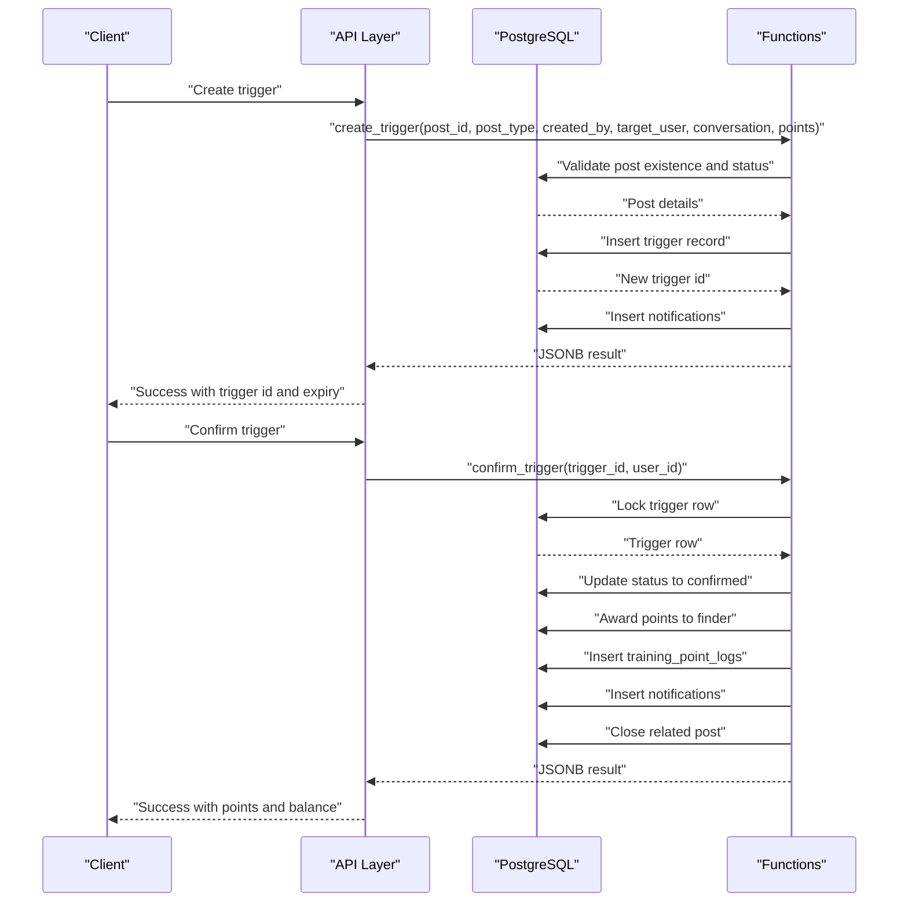
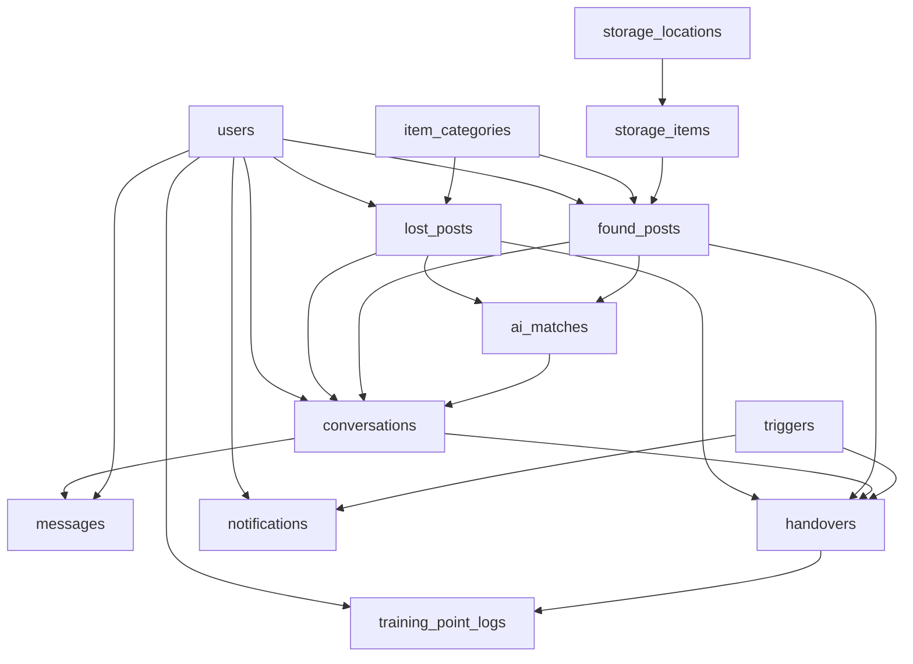

# Database Schema and Design

<cite>
**Referenced Files in This Document**
- [OVERVIEW.md](file://OVERVIEW.md)
- [triggers_migration.sql](file://backend/sql/triggers_migration.sql)
- [triggers_permissions.sql](file://backend/sql/triggers_permissions.sql)
- [update_trigger_points.sql](file://backend/sql/update_trigger_points.sql)
- [user.entity.ts](file://backend/src/modules/auth/entities/user.entity.ts)
- [category.entity.ts](file://backend/src/modules/categories/entities/category.entity.ts)
</cite>

## Table of Contents
1. [Introduction](#introduction)
2. [Project Structure](#project-structure)
3. [Core Components](#core-components)
4. [Architecture Overview](#architecture-overview)
5. [Detailed Component Analysis](#detailed-component-analysis)
6. [Dependency Analysis](#dependency-analysis)
7. [Performance Considerations](#performance-considerations)
8. [Troubleshooting Guide](#troubleshooting-guide)
9. [Conclusion](#conclusion)
10. [Appendices](#appendices)

## Introduction
This document provides comprehensive data model documentation for the MissLost database schema. It details entity relationships, field definitions, and data types for users, posts (lost/found), categories, AI matching records, chat conversations, storage items, and related auxiliary tables. It also explains primary/foreign keys, indexes, constraints, PostgreSQL-specific features such as UUID generation and text search via pg_trgm, data validation rules, business rules, audit logging, row-level security (RLS), data lifecycle and retention considerations, security measures, migration paths, trigger-based automatic updates, and schema evolution strategies.

## Project Structure
The database schema is defined in a single authoritative SQL specification and complemented by TypeScript entity definitions for users and categories. The schema is organized into phases that reflect the application’s development roadmap, enabling incremental deployment and clear ownership of features.

**Diagram sources**
- [OVERVIEW.md:64-695](file://OVERVIEW.md#L64-L695)
- [triggers_migration.sql:1-338](file://backend/sql/triggers_migration.sql#L1-L338)
- [triggers_permissions.sql:1-57](file://backend/sql/triggers_permissions.sql#L1-L57)
- [update_trigger_points.sql:1-132](file://backend/sql/update_trigger_points.sql#L1-L132)
- [user.entity.ts:1-19](file://backend/src/modules/auth/entities/user.entity.ts#L1-L19)
- [category.entity.ts:1-11](file://backend/src/modules/categories/entities/category.entity.ts#L1-L11)

**Section sources**
- [OVERVIEW.md:64-695](file://OVERVIEW.md#L64-L695)
- [triggers_migration.sql:1-338](file://backend/sql/triggers_migration.sql#L1-L338)
- [triggers_permissions.sql:1-57](file://backend/sql/triggers_permissions.sql#L1-L57)
- [update_trigger_points.sql:1-132](file://backend/sql/update_trigger_points.sql#L1-L132)
- [user.entity.ts:1-19](file://backend/src/modules/auth/entities/user.entity.ts#L1-L19)
- [category.entity.ts:1-11](file://backend/src/modules/categories/entities/category.entity.ts#L1-L11)

## Core Components
This section outlines the primary database entities and their attributes, constraints, and relationships.

- Users
  - Purpose: Authentication, authorization, and reputation tracking.
  - Key fields: id (UUID, PK), full_name, email (unique), password_hash, student_id (unique), phone, avatar_url, role (enum), status (enum), training_points, timestamps.
  - Constraints: Unique indexes on email and student_id; default role/status; default zero training_points.
  - RLS: Enabled; policies restrict visibility and modification based on current user context.

- Lost Posts
  - Purpose: Records of lost items with moderation and matching support.
  - Key fields: id (UUID, PK), user_id (FK), category_id (FK), title, description, location_lost, time_lost, contact_info, image_urls, YOLO fields, status (enum), rejection_reason, reviewed_by, reviewed_at, view_count, is_urgent, reward_note, expires_at, timestamps.
  - Constraints: Status enum expanded to include pending, approved, rejected, matched, closed; indexes for user_id, status, category_id, created_at; full-text search GIN index on title and description using pg_trgm; triggers update updated_at automatically; audit log via post_status_history.

- Found Posts
  - Purpose: Records of found items leading to potential handovers.
  - Key fields: id (UUID, PK), user_id (FK), category_id (FK), title, description, location_found, time_found, contact_info, image_urls, YOLO fields, is_in_storage, storage_item_id (FK), status (enum), rejection_reason, reviewed_by, reviewed_at, view_count, timestamps.
  - Constraints: Same structure as lost_posts; includes storage linkage; deferrable foreign key constraint to avoid deadlocks.

- Categories
  - Purpose: Classification of items with optional YOLO mappings.
  - Key fields: id (UUID, PK), name (unique), yolo_label, yolo_label_vi, icon_name, is_active, sort_order, created_at.
  - Notes: Entity interface aligns with schema; seed data included.

- AI Matches
  - Purpose: Automated matching between lost and found posts.
  - Key fields: id (UUID, PK), lost_post_id (FK), found_post_id (FK), similarity_score, yolo_score, text_score, match_method (enum), status (enum), confirmed_by_owner, confirmed_by_finder, auto_notified, timestamps.
  - Constraints: Unique constraint on (lost_post_id, found_post_id); indexes on scores and status.

- Conversations
  - Purpose: Chat sessions between users related to a pair of posts.
  - Key fields: id (UUID, PK), lost_post_id (FK), found_post_id (FK), user_a_id (FK), user_b_id (FK), ai_match_id (FK), last_message_at, timestamps.
  - Constraints: Unique constraint on (lost_post_id, found_post_id, user_a_id, user_b_id); check ensuring participants differ; indexes on user_a_id, user_b_id, last_message_at.

- Messages
  - Purpose: Individual chat messages with soft-delete support.
  - Key fields: id (UUID, PK), conversation_id (FK), sender_id (FK), content or image_url, message_type (enum), is_read, read_at, deleted_at, timestamps.
  - Constraints: Check ensuring either content or image_url is present; indexes on conversation_id, sender_id, unread.

- Handovers
  - Purpose: Formalized handover process with verification and point awarding.
  - Key fields: id (UUID, PK), lost_post_id (FK), found_post_id (FK), conversation_id (FK), storage_item_id (FK), status (enum), confirmed_by_owner_id (FK), confirmed_by_finder_id (FK), owner_confirmed_at, finder_confirmed_at, verification_code (default randomized), code_expires_at, points_awarded, points_granted_at, handover_location, handover_note, completed_at, timestamps.
  - Constraints: Indexes on post_ids and status; function grant_training_points ensures points are awarded once upon completion.

- Training Point Logs
  - Purpose: Audit trail for training points adjustments.
  - Key fields: id (UUID, PK), user_id (FK), handover_id (FK), points_delta, reason, balance_after, timestamps.
  - Constraints: Index on user_id.

- Notifications
  - Purpose: Real-time event notifications.
  - Key fields: id (UUID, PK), user_id (FK), type (enum), title, body, ref_type, ref_id, is_read, read_at, timestamps.
  - Constraints: Indexes on user_id and unread.

- Storage Items and Locations
  - Purpose: Physical inventory management for found items.
  - Key fields: storage_items include found_post_id (FK), storage_location_id (FK), item_code (unique), status (enum), submitted_by, received_by, claimed_by, claimed_at, claim_notes, discard_after, timestamps; storage_locations include identifiers and operational info.
  - Constraints: Indexes on status, item_code, and foreign keys; deferrable FK from found_posts to storage_items.

- Triggers System (Handover Confirmation Workflow)
  - Purpose: Controlled confirmation of handovers with expiration and point awarding.
  - Key fields: id (UUID, PK), post_id (UUID), post_type (enum), created_by (FK), target_user_id (FK), finder_user_id (FK), conversation_id (FK), status (enum), points_awarded, confirmed_at, cancelled_at, expires_at, timestamps.
  - Functions: create_trigger, confirm_trigger, cancel_trigger, auto_expire_triggers; policies enable RLS and controlled access.

**Section sources**
- [OVERVIEW.md:84-99](file://OVERVIEW.md#L84-L99)
- [OVERVIEW.md:191-225](file://OVERVIEW.md#L191-L225)
- [OVERVIEW.md:234-269](file://OVERVIEW.md#L234-L269)
- [OVERVIEW.md:140-149](file://OVERVIEW.md#L140-L149)
- [OVERVIEW.md:317-340](file://OVERVIEW.md#L317-L340)
- [OVERVIEW.md:416-471](file://OVERVIEW.md#L416-L471)
- [OVERVIEW.md:480-522](file://OVERVIEW.md#L480-L522)
- [OVERVIEW.md:514-522](file://OVERVIEW.md#L514-L522)
- [OVERVIEW.md:575-590](file://OVERVIEW.md#L575-L590)
- [OVERVIEW.md:369-391](file://OVERVIEW.md#L369-L391)
- [OVERVIEW.md:353-365](file://OVERVIEW.md#L353-L365)
- [triggers_migration.sql:31-46](file://backend/sql/triggers_migration.sql#L31-L46)
- [triggers_migration.sql:63-146](file://backend/sql/triggers_migration.sql#L63-L146)
- [triggers_migration.sql:153-259](file://backend/sql/triggers_migration.sql#L153-L259)
- [triggers_migration.sql:266-318](file://backend/sql/triggers_migration.sql#L266-L318)
- [triggers_migration.sql:325-336](file://backend/sql/triggers_migration.sql#L325-L336)

## Architecture Overview
The database architecture integrates application entities with specialized systems for AI matching, chat, storage, and handover confirmation. PostgreSQL extensions (uuid-ossp, pg_trgm) and RLS provide robust identity, search, and security foundations.

```mermaid
erDiagram
USERS {
uuid id PK
varchar full_name
varchar email UK
text password_hash
varchar student_id UK
varchar phone
text avatar_url
enum role
enum status
int training_points
timestamptz email_verified_at
timestamptz last_login_at
timestamptz created_at
timestamptz updated_at
}
ITEM_CATEGORIES {
uuid id PK
varchar name UK
varchar yolo_label
varchar yolo_label_vi
varchar icon_name
boolean is_active
int sort_order
timestamptz created_at
}
LOST_POSTS {
uuid id PK
uuid user_id FK
uuid category_id FK
varchar title
text description
varchar location_lost
timestamptz time_lost
varchar contact_info
text[] image_urls
varchar yolo_detected_label
numeric yolo_confidence
uuid yolo_detection_id FK
boolean is_in_storage
uuid storage_item_id FK
enum status
text rejection_reason
uuid reviewed_by FK
timestamptz reviewed_at
int view_count
boolean is_urgent
varchar reward_note
timestamptz expires_at
timestamptz created_at
timestamptz updated_at
}
FOUND_POSTS {
uuid id PK
uuid user_id FK
uuid category_id FK
varchar title
text description
varchar location_found
timestamptz time_found
varchar contact_info
text[] image_urls
varchar yolo_detected_label
numeric yolo_confidence
uuid yolo_detection_id FK
boolean is_in_storage
uuid storage_item_id FK
enum status
text rejection_reason
uuid reviewed_by FK
timestamptz reviewed_at
int view_count
timestamptz created_at
timestamptz updated_at
}
AI_MATCHES {
uuid id PK
uuid lost_post_id FK
uuid found_post_id FK
numeric similarity_score
numeric yolo_score
numeric text_score
enum match_method
enum status
boolean confirmed_by_owner
boolean confirmed_by_finder
boolean auto_notified
timestamptz created_at
timestamptz updated_at
}
CONVERSATIONS {
uuid id PK
uuid lost_post_id FK
uuid found_post_id FK
uuid user_a_id FK
uuid user_b_id FK
uuid ai_match_id FK
timestamptz last_message_at
timestamptz created_at
}
MESSAGES {
uuid id PK
uuid conversation_id FK
uuid sender_id FK
text content
text image_url
varchar message_type
boolean is_read
timestamptz read_at
timestamptz deleted_at
timestamptz created_at
}
HANDOVERS {
uuid id PK
uuid lost_post_id FK
uuid found_post_id FK
uuid conversation_id FK
uuid storage_item_id FK
enum status
uuid confirmed_by_owner_id FK
uuid confirmed_by_finder_id FK
timestamptz owner_confirmed_at
timestamptz finder_confirmed_at
varchar verification_code
timestamptz code_expires_at
int points_awarded
timestamptz points_granted_at
varchar handover_location
text handover_note
timestamptz completed_at
timestamptz created_at
}
TRAINING_POINT_LOGS {
uuid id PK
uuid user_id FK
uuid handover_id FK
int points_delta
varchar reason
int balance_after
timestamptz created_at
}
NOTIFICATIONS {
uuid id PK
uuid user_id FK
enum type
varchar title
text body
varchar ref_type
uuid ref_id
boolean is_read
timestamptz read_at
timestamptz created_at
}
STORAGE_LOCATIONS {
uuid id PK
varchar name
text address
varchar building
varchar floor
varchar campus
varchar contact_phone
varchar contact_name
varchar open_hours
boolean is_active
timestamptz created_at
}
STORAGE_ITEMS {
uuid id PK
uuid found_post_id FK
uuid storage_location_id FK
varchar item_code UK
enum status
uuid submitted_by FK
uuid received_by FK
uuid claimed_by FK
timestamptz claimed_at
text claim_notes
timestamptz stored_at
timestamptz discard_after
timestamptz created_at
timestamptz updated_at
}
TRIGGERS {
uuid id PK
uuid post_id
enum post_type
uuid created_by FK
uuid target_user_id FK
uuid finder_user_id FK
uuid conversation_id FK
enum status
int points_awarded
timestamptz confirmed_at
timestamptz cancelled_at
timestamptz expires_at
timestamptz created_at
}
USERS ||--o{ LOST_POSTS : "creates"
USERS ||--o{ FOUND_POSTS : "creates"
ITEM_CATEGORIES ||--o{ LOST_POSTS : "categorizes"
ITEM_CATEGORIES ||--o{ FOUND_POSTS : "categorizes"
LOST_POSTS ||--|| AI_MATCHES : "matches"
FOUND_POSTS ||--|| AI_MATCHES : "matches"
USERS ||--o{ CONVERSATIONS : "participants"
LOST_POSTS ||--o{ CONVERSATIONS : "relates"
FOUND_POSTS ||--o{ CONVERSATIONS : "relates"
CONVERSATIONS ||--o{ MESSAGES : "contains"
USERS ||--o{ MESSAGES : "sends"
LOST_POSTS ||--o{ HANDOVERS : "involved_in"
FOUND_POSTS ||--o{ HANDOVERS : "involved_in"
CONVERSATIONS ||--o{ HANDOVERS : "relates_to"
STORAGE_ITEMS ||--|| FOUND_POSTS : "stores"
STORAGE_LOCATIONS ||--o{ STORAGE_ITEMS : "hosts"
USERS ||--o{ TRAINING_POINT_LOGS : "affected_by"
HANDOVERS ||--|| TRAINING_POINT_LOGS : "logs"
USERS ||--o{ NOTIFICATIONS : "receives"
AI_MATCHES ||--o{ CONVERSATIONS : "may_initiate"
TRIGGERS ||--o{ NOTIFICATIONS : "generates"
TRIGGERS ||--o{ HANDOVERS : "drives"
```

**Diagram sources**
- [OVERVIEW.md:84-99](file://OVERVIEW.md#L84-L99)
- [OVERVIEW.md:140-149](file://OVERVIEW.md#L140-L149)
- [OVERVIEW.md:191-225](file://OVERVIEW.md#L191-L225)
- [OVERVIEW.md:234-269](file://OVERVIEW.md#L234-L269)
- [OVERVIEW.md:317-340](file://OVERVIEW.md#L317-L340)
- [OVERVIEW.md:416-471](file://OVERVIEW.md#L416-L471)
- [OVERVIEW.md:480-522](file://OVERVIEW.md#L480-L522)
- [OVERVIEW.md:514-522](file://OVERVIEW.md#L514-L522)
- [OVERVIEW.md:575-590](file://OVERVIEW.md#L575-L590)
- [OVERVIEW.md:369-391](file://OVERVIEW.md#L369-L391)
- [OVERVIEW.md:353-365](file://OVERVIEW.md#L353-L365)
- [triggers_migration.sql:31-46](file://backend/sql/triggers_migration.sql#L31-L46)

## Detailed Component Analysis

### Users
- Responsibilities: Identity management, role-based access, training points accounting.
- Data types: UUID primary key; enums for role and status; integers for training_points; timestamptz for temporal fields.
- Validation: Unique constraints on email and student_id; defaults for role/status/points; triggers update timestamps.
- Security: RLS enabled; policies restrict access based on current user context.

**Section sources**
- [OVERVIEW.md:84-99](file://OVERVIEW.md#L84-L99)
- [OVERVIEW.md:648-670](file://OVERVIEW.md#L648-L670)

### Posts (Lost/Found)
- Responsibilities: Content publication, moderation pipeline, full-text search, audit history.
- Data types: UUID primary key; foreign keys to users and categories; arrays for images; numeric scores; enums for status; timestamptz for temporal fields.
- Validation: Status enum expanded to five states; indexes for efficient filtering; GIN index for text search; triggers update timestamps; audit log via post_status_history.

**Section sources**
- [OVERVIEW.md:183-189](file://OVERVIEW.md#L183-L189)
- [OVERVIEW.md:191-225](file://OVERVIEW.md#L191-L225)
- [OVERVIEW.md:234-269](file://OVERVIEW.md#L234-L269)
- [OVERVIEW.md:277-293](file://OVERVIEW.md#L277-L293)
- [OVERVIEW.md:294-307](file://OVERVIEW.md#L294-L307)

### Categories
- Responsibilities: Item classification and optional AI label mapping.
- Data types: UUID primary key; unique name; booleans and integers for flags and ordering; timestamptz for creation.
- Validation: Unique name; seed data provided.

**Section sources**
- [OVERVIEW.md:140-149](file://OVERVIEW.md#L140-L149)
- [category.entity.ts:1-11](file://backend/src/modules/categories/entities/category.entity.ts#L1-L11)

### AI Matching
- Responsibilities: Automated pairing of lost and found posts with scoring and confirmation workflow.
- Data types: UUID primary key; foreign keys to posts; numeric scores; enums for method and status; booleans for confirmation flags.
- Validation: Unique constraint on post pair; indexes on scores and status.

**Section sources**
- [OVERVIEW.md:317-340](file://OVERVIEW.md#L317-L340)

### Chat Conversations and Messages
- Responsibilities: Private messaging between parties involved in a handover or match.
- Data types: UUID primary key; foreign keys to posts and users; enums for message_type; booleans for read/deleted; timestamptz for timestamps.
- Validation: Unique constraint on conversation participants; indexes for performance; trigger updates last_message_at.

**Section sources**
- [OVERVIEW.md:416-471](file://OVERVIEW.md#L416-L471)

### Handovers and Training Points
- Responsibilities: Formalized handover process with verification, point awarding, and audit trail.
- Data types: UUID primary key; foreign keys to posts, conversations, and storage; enums for status; random verification code with expiry; numeric points; timestamptz for timestamps.
- Validation: Function grant_training_points ensures points are awarded once per completed handover; logs track balances.

**Section sources**
- [OVERVIEW.md:480-522](file://OVERVIEW.md#L480-L522)
- [OVERVIEW.md:526-556](file://OVERVIEW.md#L526-L556)
- [OVERVIEW.md:514-522](file://OVERVIEW.md#L514-L522)

### Storage Items and Locations
- Responsibilities: Physical inventory tracking for found items.
- Data types: UUID primary key; foreign keys to locations and posts; unique item_code; enums for status; timestamptz for timeline fields.
- Validation: Deferrable foreign key from found_posts to storage_items; indexes on status and item_code.

**Section sources**
- [OVERVIEW.md:369-391](file://OVERVIEW.md#L369-L391)
- [OVERVIEW.md:353-365](file://OVERVIEW.md#L353-L365)
- [OVERVIEW.md:398-403](file://OVERVIEW.md#L398-L403)

### Triggers System (Handover Confirmation Workflow)
- Responsibilities: Controlled confirmation of handovers with expiration and point awarding.
- Data types: UUID primary key; foreign keys to users and posts; enums for status and post_type; numeric points_awarded; timestamptz for timestamps.
- Functions: create_trigger validates eligibility and creates notifications; confirm_trigger updates status, awards points, logs training_point_logs, notifies parties, and closes posts; cancel_trigger allows creators to withdraw; auto_expire_triggers periodically expires pending triggers.
- Security: RLS enabled; policies restrict access to authorized users; grants for authenticated and service_role.

**Diagram sources**
- [triggers_migration.sql:63-146](file://backend/sql/triggers_migration.sql#L63-L146)
- [triggers_migration.sql:153-259](file://backend/sql/triggers_migration.sql#L153-L259)
- [triggers_permissions.sql:25-57](file://backend/sql/triggers_permissions.sql#L25-L57)

**Section sources**
- [triggers_migration.sql:31-46](file://backend/sql/triggers_migration.sql#L31-L46)
- [triggers_migration.sql:63-146](file://backend/sql/triggers_migration.sql#L63-L146)
- [triggers_migration.sql:153-259](file://backend/sql/triggers_migration.sql#L153-L259)
- [triggers_migration.sql:266-318](file://backend/sql/triggers_migration.sql#L266-L318)
- [triggers_migration.sql:325-336](file://backend/sql/triggers_migration.sql#L325-L336)
- [triggers_permissions.sql:6-17](file://backend/sql/triggers_permissions.sql#L6-L17)
- [triggers_permissions.sql:25-57](file://backend/sql/triggers_permissions.sql#L25-L57)

### Notifications
- Responsibilities: Event-driven communication for posts, matches, messages, handovers, and system alerts.
- Data types: UUID primary key; foreign key to users; polymorphic reference via ref_type/ref_id; enums for notification_type; booleans for read state; timestamptz for timestamps.
- Validation: Indexes on user_id and unread; efficient retrieval for UI.

**Section sources**
- [OVERVIEW.md:575-590](file://OVERVIEW.md#L575-L590)

## Dependency Analysis
The schema exhibits clear dependency chains among entities, with foreign keys enforcing referential integrity and triggers automating timestamp updates and conversation metadata.

**Diagram sources**
- [OVERVIEW.md:84-99](file://OVERVIEW.md#L84-L99)
- [OVERVIEW.md:191-225](file://OVERVIEW.md#L191-L225)
- [OVERVIEW.md:234-269](file://OVERVIEW.md#L234-L269)
- [OVERVIEW.md:317-340](file://OVERVIEW.md#L317-L340)
- [OVERVIEW.md:416-471](file://OVERVIEW.md#L416-L471)
- [OVERVIEW.md:480-522](file://OVERVIEW.md#L480-L522)
- [OVERVIEW.md:369-391](file://OVERVIEW.md#L369-L391)
- [OVERVIEW.md:353-365](file://OVERVIEW.md#L353-L365)
- [OVERVIEW.md:514-522](file://OVERVIEW.md#L514-L522)
- [OVERVIEW.md:575-590](file://OVERVIEW.md#L575-L590)
- [triggers_migration.sql:31-46](file://backend/sql/triggers_migration.sql#L31-L46)

**Section sources**
- [OVERVIEW.md:84-99](file://OVERVIEW.md#L84-L99)
- [OVERVIEW.md:191-225](file://OVERVIEW.md#L191-L225)
- [OVERVIEW.md:234-269](file://OVERVIEW.md#L234-L269)
- [OVERVIEW.md:317-340](file://OVERVIEW.md#L317-L340)
- [OVERVIEW.md:416-471](file://OVERVIEW.md#L416-L471)
- [OVERVIEW.md:480-522](file://OVERVIEW.md#L480-L522)
- [OVERVIEW.md:369-391](file://OVERVIEW.md#L369-L391)
- [OVERVIEW.md:353-365](file://OVERVIEW.md#L353-L365)
- [OVERVIEW.md:514-522](file://OVERVIEW.md#L514-L522)
- [OVERVIEW.md:575-590](file://OVERVIEW.md#L575-L590)
- [triggers_migration.sql:31-46](file://backend/sql/triggers_migration.sql#L31-L46)

## Performance Considerations
- Indexes
  - Users: email, student_id, role for fast lookup and filtering.
  - Posts: user_id, status, category_id, created_at; GIN full-text search on title and description using pg_trgm.
  - AI Matches: similarity_score DESC, status for ranking and filtering.
  - Conversations: user_a_id, user_b_id, last_message_at for efficient chat lists.
  - Messages: conversation_id, sender_id, unread for unread counts and pagination.
  - Storage Items: found_post_id, storage_location_id, status, item_code for inventory queries.
  - Handovers: lost_post_id, found_post_id, status for handover dashboards.
  - Training Point Logs: user_id for audit trails.
  - Notifications: user_id, unread for real-time feeds.
  - Triggers: unique active trigger index, target_user, created_by, conversation, expires_at for workflow efficiency.
- PostgreSQL Extensions
  - uuid-ossp: deterministic UUID generation for primary keys.
  - pg_trgm: GIN indexes for text similarity and full-text search.
  - vector: available for embeddings (not currently enabled).
- Triggers and Functions
  - Automatic updated_at updates reduce application logic and ensure consistency.
  - Triggers system enforces business rules and notifications asynchronously.
- Caching Strategies
  - Application-level caching for frequently accessed categories and public feeds.
  - Database-side materialized views or summary tables can be introduced for admin dashboards.
- Query Patterns
  - Prefer filtered indexes and partial indexes (e.g., unread messages) to minimize scans.
  - Use LIMIT and OFFSET for paginated feeds; consider cursor-based pagination for stability.

[No sources needed since this section provides general guidance]

## Troubleshooting Guide
- Common Issues
  - Duplicate trigger creation: The create_trigger function returns a unique violation error when attempting to create multiple pending triggers for the same post; ensure UI prevents duplicate requests.
  - Expired triggers: confirm_trigger checks expiry and transitions status to expired; inform users accordingly.
  - Suspended users: confirm_trigger rejects confirmation if the finder is suspended; escalate to admin if needed.
  - Deadlocks: deferrable foreign keys between found_posts and storage_items mitigate deadlocks during concurrent updates.
- Audit and Debugging
  - Use post_status_history to trace status changes.
  - training_point_logs provides a complete audit trail for point adjustments.
  - Notifications table helps diagnose communication issues.
- Permissions
  - Ensure RLS policies are enabled and correctly applied; verify grants for authenticated and service_role.
  - Confirm function EXECUTE grants for trigger-related functions.

**Section sources**
- [triggers_migration.sql:140-146](file://backend/sql/triggers_migration.sql#L140-L146)
- [triggers_migration.sql:183-186](file://backend/sql/triggers_migration.sql#L183-L186)
- [triggers_migration.sql:195-199](file://backend/sql/triggers_migration.sql#L195-L199)
- [OVERVIEW.md:398-403](file://OVERVIEW.md#L398-L403)
- [OVERVIEW.md:294-307](file://OVERVIEW.md#L294-L307)
- [OVERVIEW.md:514-522](file://OVERVIEW.md#L514-L522)
- [triggers_permissions.sql:6-17](file://backend/sql/triggers_permissions.sql#L6-L17)
- [triggers_permissions.sql:18-24](file://backend/sql/triggers_permissions.sql#L18-L24)

## Conclusion
The MissLost database schema is a well-structured, extensible foundation designed for a multi-phase feature rollout. It leverages PostgreSQL capabilities including UUIDs, full-text search, RLS, and triggers/functions to enforce business rules and maintain auditability. The schema supports scalable performance through targeted indexing and offers clear migration paths for future enhancements such as AI embeddings and advanced analytics.

[No sources needed since this section summarizes without analyzing specific files]

## Appendices

### Data Lifecycle and Retention
- Posts: retained indefinitely; moderation actions (rejected, closed) manage visibility and activity.
- Conversations and Messages: retain historical context; soft-deleted messages preserve integrity.
- Training Point Logs: maintained for audit and reporting.
- Notifications: short-term retention aligned with user engagement; can be archived for compliance.
- Storage Items: lifecycle governed by discard_after and claimed_at; long-term archival supported.
- Triggers: expire after 48 hours; historical records preserved for audit.

[No sources needed since this section provides general guidance]

### Security Measures
- Row Level Security: enforced on core tables (posts, triggers) with policies restricting access to authorized users.
- Function Grants: explicit EXECUTE grants for authenticated users on trigger functions.
- Token Management: auth_tokens and refresh_tokens for secure authentication workflows.
- Role-Based Access: user, admin, storage_staff roles with distinct capabilities.

**Section sources**
- [triggers_permissions.sql:6-17](file://backend/sql/triggers_permissions.sql#L6-L17)
- [triggers_permissions.sql:18-24](file://backend/sql/triggers_permissions.sql#L18-L24)
- [OVERVIEW.md:648-670](file://OVERVIEW.md#L648-L670)

### Migration Paths and Version Management
- Extension Setup: uuid-ossp and pg_trgm are created conditionally at schema initialization.
- Triggers System: clean migration removes old functions/types/tables before recreating; preserves data where possible.
- Point Adjustment: update_trigger_points.sql modifies defaults and function behavior while maintaining backward compatibility.
- Schema Evolution: use ALTER TABLE statements for incremental changes; keep RLS policies and indexes aligned with new columns.

**Section sources**
- [OVERVIEW.md:70-73](file://OVERVIEW.md#L70-L73)
- [triggers_migration.sql:1-18](file://backend/sql/triggers_migration.sql#L1-L18)
- [update_trigger_points.sql:1-132](file://backend/sql/update_trigger_points.sql#L1-L132)

### Sample Data Structures
- Users: id, full_name, email, role, status, training_points, timestamps.
- Categories: id, name, yolo_label, yolo_label_vi, icon_name, is_active, sort_order, created_at.
- Lost Posts: id, user_id, category_id, title, description, status, timestamps.
- Found Posts: id, user_id, category_id, title, description, status, timestamps.
- AI Matches: id, lost_post_id, found_post_id, similarity_score, match_method, status.
- Conversations: id, lost_post_id, found_post_id, user_a_id, user_b_id, last_message_at.
- Messages: id, conversation_id, sender_id, content/image_url, message_type, timestamps.
- Handovers: id, lost_post_id, found_post_id, status, verification_code, points_awarded, timestamps.
- Training Point Logs: id, user_id, handover_id, points_delta, reason, balance_after, timestamps.
- Notifications: id, user_id, type, title, body, ref_type/ref_id, timestamps.
- Storage Items: id, found_post_id, storage_location_id, item_code, status, timestamps.
- Storage Locations: id, name, address, building, floor, campus, contact_phone, contact_name, open_hours, is_active, created_at.
- Triggers: id, post_id, post_type, created_by, target_user_id, finder_user_id, conversation_id, status, points_awarded, expires_at, timestamps.

**Section sources**
- [user.entity.ts:1-19](file://backend/src/modules/auth/entities/user.entity.ts#L1-L19)
- [category.entity.ts:1-11](file://backend/src/modules/categories/entities/category.entity.ts#L1-L11)
- [OVERVIEW.md:84-99](file://OVERVIEW.md#L84-L99)
- [OVERVIEW.md:140-149](file://OVERVIEW.md#L140-L149)
- [OVERVIEW.md:191-225](file://OVERVIEW.md#L191-L225)
- [OVERVIEW.md:234-269](file://OVERVIEW.md#L234-L269)
- [OVERVIEW.md:317-340](file://OVERVIEW.md#L317-L340)
- [OVERVIEW.md:416-471](file://OVERVIEW.md#L416-L471)
- [OVERVIEW.md:480-522](file://OVERVIEW.md#L480-L522)
- [OVERVIEW.md:514-522](file://OVERVIEW.md#L514-L522)
- [OVERVIEW.md:575-590](file://OVERVIEW.md#L575-L590)
- [OVERVIEW.md:369-391](file://OVERVIEW.md#L369-L391)
- [OVERVIEW.md:353-365](file://OVERVIEW.md#L353-L365)
- [triggers_migration.sql:31-46](file://backend/sql/triggers_migration.sql#L31-L46)