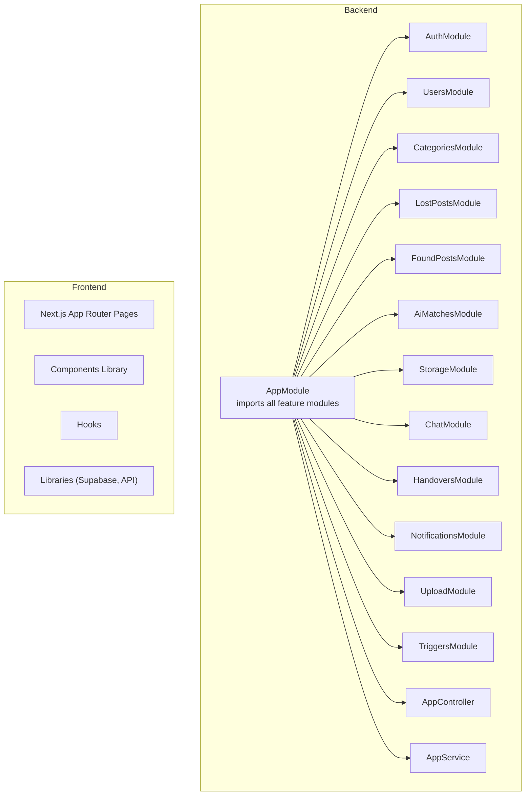
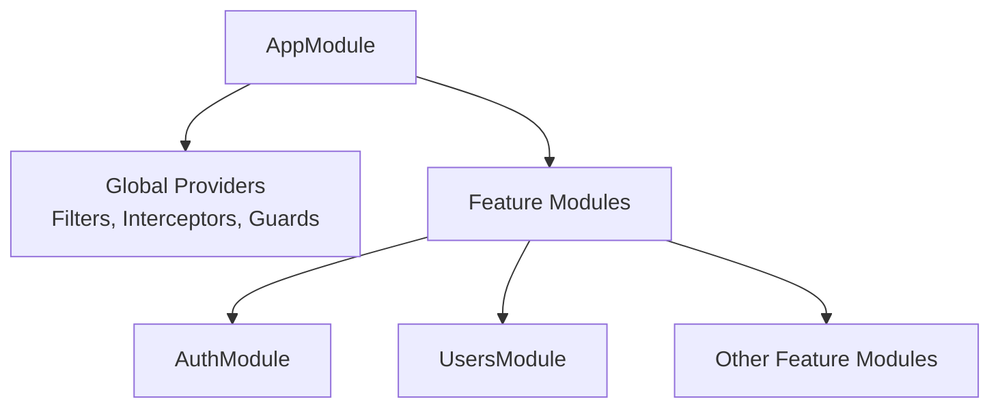
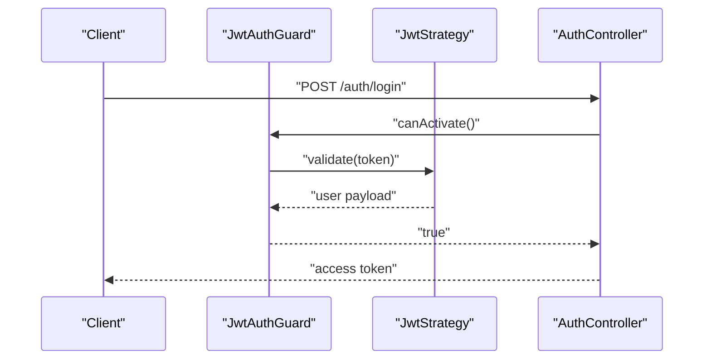
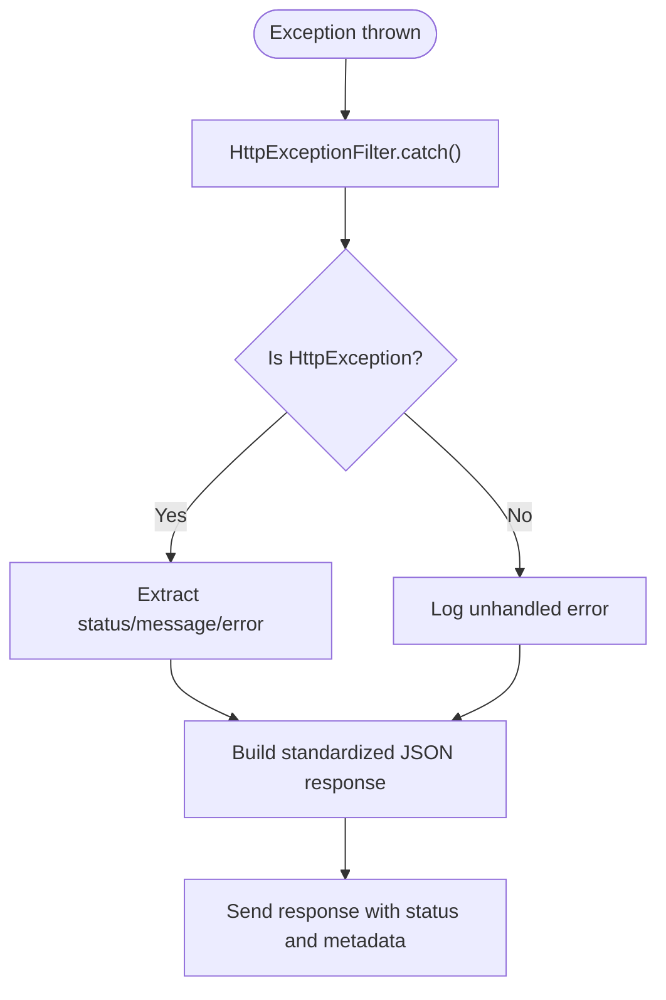
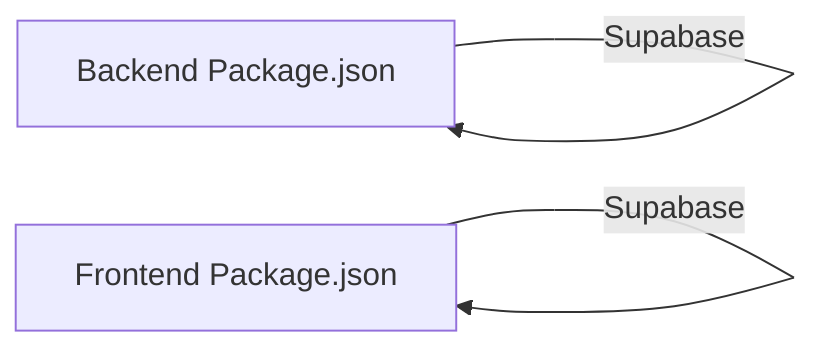

# Development Guidelines

<cite>
**Referenced Files in This Document**
- [package.json](file://backend/package.json)
- [.prettierrc](file://backend/.prettierrc)
- [eslint.config.mjs](file://backend/eslint.config.mjs)
- [nest-cli.json](file://backend/nest-cli.json)
- [docker-compose.yml](file://docker-compose.yml)
- [app.module.ts](file://backend/src/app.module.ts)
- [main.ts](file://backend/src/main.ts)
- [auth.module.ts](file://backend/src/modules/auth/auth.module.ts)
- [users.module.ts](file://backend/src/modules/users/users.module.ts)
- [jwt-auth.guard.ts](file://backend/src/common/guards/jwt-auth.guard.ts)
- [http-exception.filter.ts](file://backend/src/common/filters/http-exception.filter.ts)
- [current-user.decorator.ts](file://backend/src/common/decorators/current-user.decorator.ts)
- [app.controller.ts](file://backend/src/app.controller.ts)
- [app.service.ts](file://backend/src/app.service.ts)
- [package.json](file://frontend/package.json)
- [eslint.config.mjs](file://frontend/eslint.config.mjs)
- [next.config.ts](file://frontend/next.config.ts)
</cite>

## Table of Contents
1. [Introduction](#introduction)
2. [Project Structure](#project-structure)
3. [Core Components](#core-components)
4. [Architecture Overview](#architecture-overview)
5. [Detailed Component Analysis](#detailed-component-analysis)
6. [Dependency Analysis](#dependency-analysis)
7. [Performance Considerations](#performance-considerations)
8. [Troubleshooting Guide](#troubleshooting-guide)
9. [Development Workflow](#development-workflow)
10. [Code Quality Standards](#code-quality-standards)
11. [Testing Requirements](#testing-requirements)
12. [Database and API Practices](#database-and-api-practices)
13. [Security Coding Practices](#security-coding-practices)
14. [Documentation Standards](#documentation-standards)
15. [Conclusion](#conclusion)

## Introduction
This document defines comprehensive development guidelines for the MissLost project. It covers TypeScript coding standards, NestJS architecture patterns, frontend component organization principles, formatting and linting rules, commit conventions, development workflow, CI practices, database migrations, API versioning, backward compatibility, error handling, logging, performance optimization, security practices, testing requirements, and architectural decision-making criteria.

## Project Structure
MissLost follows a monorepo-like structure with two primary directories:
- backend: NestJS server with modular architecture, shared common utilities, and feature modules.
- frontend: Next.js application with route-based pages, shared components, and hooks.

**Diagram sources**
- [app.module.ts:28-66](file://backend/src/app.module.ts#L28-L66)
- [auth.module.ts:11-34](file://backend/src/modules/auth/auth.module.ts#L11-L34)
- [users.module.ts:6-12](file://backend/src/modules/users/users.module.ts#L6-L12)

**Section sources**
- [docker-compose.yml:1-61](file://docker-compose.yml#L1-L61)
- [app.module.ts:28-66](file://backend/src/app.module.ts#L28-L66)

## Core Components
- Application bootstrap and middleware: global validation pipe, CORS, Swagger, cookie parsing.
- Centralized exception filtering and response interception.
- Authentication guard with role-based access control.
- Shared decorators for extracting current user context.
- Feature modules organized per domain (auth, users, posts, chat, storage, etc.).

Key implementation references:
- Bootstrap and middleware: [main.ts:7-44](file://backend/src/main.ts#L7-L44)
- Global exception filter: [http-exception.filter.ts:11-61](file://backend/src/common/filters/http-exception.filter.ts#L11-L61)
- JWT guard and public route handling: [jwt-auth.guard.ts:7-28](file://backend/src/common/guards/jwt-auth.guard.ts#L7-L28)
- Current user decorator: [current-user.decorator.ts:1-9](file://backend/src/common/decorators/current-user.decorator.ts#L1-L9)
- Feature module wiring: [app.module.ts:28-66](file://backend/src/app.module.ts#L28-L66)

**Section sources**
- [main.ts:7-44](file://backend/src/main.ts#L7-L44)
- [http-exception.filter.ts:11-61](file://backend/src/common/filters/http-exception.filter.ts#L11-L61)
- [jwt-auth.guard.ts:7-28](file://backend/src/common/guards/jwt-auth.guard.ts#L7-L28)
- [current-user.decorator.ts:1-9](file://backend/src/common/decorators/current-user.decorator.ts#L1-L9)
- [app.module.ts:28-66](file://backend/src/app.module.ts#L28-L66)

## Architecture Overview
The backend uses a layered, modular NestJS architecture:
- AppModule aggregates all feature modules and registers global providers (filters, interceptors, guards).
- Feature modules encapsulate domain logic, DTOs, entities, services, controllers, and strategies.
- AuthModule centralizes JWT and OAuth strategies and exports JWT module for consumers.
- UsersModule depends on AuthModule via forwardRef to avoid circular dependencies.

**Diagram sources**
- [app.module.ts:28-66](file://backend/src/app.module.ts#L28-L66)
- [auth.module.ts:11-34](file://backend/src/modules/auth/auth.module.ts#L11-L34)
- [users.module.ts:6-12](file://backend/src/modules/users/users.module.ts#L6-L12)

**Section sources**
- [app.module.ts:28-66](file://backend/src/app.module.ts#L28-L66)
- [auth.module.ts:11-34](file://backend/src/modules/auth/auth.module.ts#L11-L34)
- [users.module.ts:6-12](file://backend/src/modules/users/users.module.ts#L6-L12)

## Detailed Component Analysis

### Authentication and Authorization
- JWT guard supports public routes via metadata and throws unauthorized on failure.
- AuthModule registers JWT asynchronously using environment configuration and exports JWT module.
- UsersModule depends on AuthModule via forwardRef to access JWT strategies.

**Diagram sources**
- [jwt-auth.guard.ts:7-28](file://backend/src/common/guards/jwt-auth.guard.ts#L7-L28)
- [auth.module.ts:11-34](file://backend/src/modules/auth/auth.module.ts#L11-L34)

**Section sources**
- [jwt-auth.guard.ts:7-28](file://backend/src/common/guards/jwt-auth.guard.ts#L7-L28)
- [auth.module.ts:11-34](file://backend/src/modules/auth/auth.module.ts#L11-L34)
- [users.module.ts:6-12](file://backend/src/modules/users/users.module.ts#L6-L12)

### Error Handling and Logging
- Centralized exception filter standardizes error responses and logs unhandled errors.
- Default error codes mapped by HTTP status for consistent client handling.

**Diagram sources**
- [http-exception.filter.ts:11-61](file://backend/src/common/filters/http-exception.filter.ts#L11-L61)

**Section sources**
- [http-exception.filter.ts:11-61](file://backend/src/common/filters/http-exception.filter.ts#L11-L61)

### Frontend Component Organization
- Next.js App Router pages under app/<route>/page.tsx.
- Shared components under app/components/.
- Hooks under app/hooks/.
- Libraries under app/lib/ (e.g., Supabase client, API helpers).
- ESLint configured via eslint.config.mjs extending Next.js recommended configs.

**Section sources**
- [package.json:1-29](file://frontend/package.json#L1-L29)
- [eslint.config.mjs:1-19](file://frontend/eslint.config.mjs#L1-L19)
- [next.config.ts:1-8](file://frontend/next.config.ts#L1-L8)

## Dependency Analysis
- Backend dependencies include NestJS core, JWT, Passport, Supabase SSR/JS, class-validator, and RxJS.
- Dev dependencies include Jest, ESLint, Prettier, TypeScript ESLint, and TS-Jest.
- Frontend dependencies include Next.js, React, Supabase JS, date-fns, TailwindCSS, and TypeScript.

**Diagram sources**
- [package.json:22-46](file://backend/package.json#L22-L46)
- [package.json:11-17](file://frontend/package.json#L11-L17)

**Section sources**
- [package.json:22-46](file://backend/package.json#L22-L46)
- [package.json:11-17](file://frontend/package.json#L11-L17)

## Performance Considerations
- Use global ValidationPipe to enforce DTO validation and automatic type transformation.
- Enable CORS with credentials for cross-origin requests from the frontend.
- Leverage Swagger for API documentation and reduce client-side guesswork.
- Keep modules cohesive and avoid circular dependencies (use forwardRef where needed).
- Prefer interceptors for response shaping to minimize controller boilerplate.

**Section sources**
- [main.ts:14-27](file://backend/src/main.ts#L14-L27)
- [app.module.ts:46-66](file://backend/src/app.module.ts#L46-L66)

## Troubleshooting Guide
- Unhandled exceptions are standardized by the centralized filter and logged with stack traces.
- Ensure JWT_SECRET is set for AuthModule to prevent runtime failures.
- Verify CORS configuration matches frontend origin to avoid blocked requests.
- Use Swagger endpoints to inspect API behavior during local development.

**Section sources**
- [http-exception.filter.ts:36-38](file://backend/src/common/filters/http-exception.filter.ts#L36-L38)
- [auth.module.ts:18-21](file://backend/src/modules/auth/auth.module.ts#L18-L21)
- [main.ts:24-27](file://backend/src/main.ts#L24-L27)

## Development Workflow
- Branching strategy:
  - main: protected, requires pull request with approval.
  - develop: integration branch for merging approved features.
  - feature/<issue>: isolated feature work.
  - hotfix/*: urgent fixes to main.
- Commit message convention:
  - feat(module): add new capability
  - fix(module): resolve bug
  - refactor(module): internal change without behavior change
  - docs(module): documentation updates
  - chore(module): maintenance tasks
- Code review:
  - At least one reviewer approval required.
  - Lint and tests must pass.
  - New features require tests and documentation updates.
- Continuous integration:
  - Automated linting and unit/e2e tests on pull requests.
  - Build and deploy previews for feature branches.

[No sources needed since this section provides general guidance]

## Code Quality Standards
- Formatting:
  - Prettier configuration enforces single quotes and trailing commas.
  - Run formatting via npm/yarn scripts.
- Linting:
  - Backend: ESLint with TypeScript ESLint and Prettier plugin.
  - Frontend: Next ESLint configs applied via eslint.config.mjs.
- NestJS CLI:
  - Nest schematics used for generating modules, controllers, services, and DTOs.
- TypeScript:
  - Strict type checking enabled via TypeScript ESLint recommended type-checked configs.

**Section sources**
- [.prettierrc:1-5](file://backend/.prettierrc#L1-L5)
- [eslint.config.mjs:1-36](file://backend/eslint.config.mjs#L1-L36)
- [eslint.config.mjs:1-19](file://frontend/eslint.config.mjs#L1-L19)
- [nest-cli.json:1-9](file://backend/nest-cli.json#L1-L9)

## Testing Requirements
- Unit tests:
  - Place spec files alongside source files with .spec.ts suffix.
  - Use Jest with ts-jest transformer.
  - Coverage collected across all TypeScript files.
- E2E tests:
  - Dedicated e2e configuration and runner.
- Scripts:
  - Run tests with npm/yarn scripts; ensure coverage and watch modes as needed.

**Section sources**
- [package.json:76-92](file://backend/package.json#L76-L92)

## Database and API Practices
- Database migrations:
  - Use SQL scripts under backend/sql for triggers and permissions.
  - Keep migration scripts idempotent and versioned.
- API versioning:
  - Use semantic versioning in Swagger and maintain backward-compatible endpoints.
  - Introduce new endpoints for breaking changes; deprecate old ones after a grace period.
- Backward compatibility:
  - Avoid removing required fields; introduce optional fields with defaults.
  - Return structured error responses for client handling.

**Section sources**
- [main.ts:30-37](file://backend/src/main.ts#L30-L37)

## Security Coding Practices
- Authentication:
  - JWT guard handles bearer tokens; ensure HTTPS in production.
  - Public decorator allows selective bypass of authentication.
- Authorization:
  - Roles guard can be extended to enforce role-based access.
- Environment configuration:
  - Secrets loaded via ConfigModule; fail fast if required variables are missing.
- Input validation:
  - Global ValidationPipe strips unknown properties and transforms inputs.

**Section sources**
- [jwt-auth.guard.ts:7-28](file://backend/src/common/guards/jwt-auth.guard.ts#L7-L28)
- [auth.module.ts:18-21](file://backend/src/modules/auth/auth.module.ts#L18-L21)
- [main.ts:14-21](file://backend/src/main.ts#L14-L21)

## Documentation Standards
- API documentation:
  - Swagger generated from NestJS SwaggerModule; keep descriptions clear and up-to-date.
- Code comments:
  - Document complex logic, public APIs, and non-obvious decisions.
- READMEs:
  - Maintain project-level and module-level documentation as needed.

**Section sources**
- [main.ts:30-37](file://backend/src/main.ts#L30-L37)

## Conclusion
These guidelines establish a consistent, scalable development process for MissLost. By adhering to NestJS modularity, centralized middleware, strict linting/formatting, robust error handling, and disciplined testing and CI practices, contributors can deliver reliable features while preserving backward compatibility and performance.