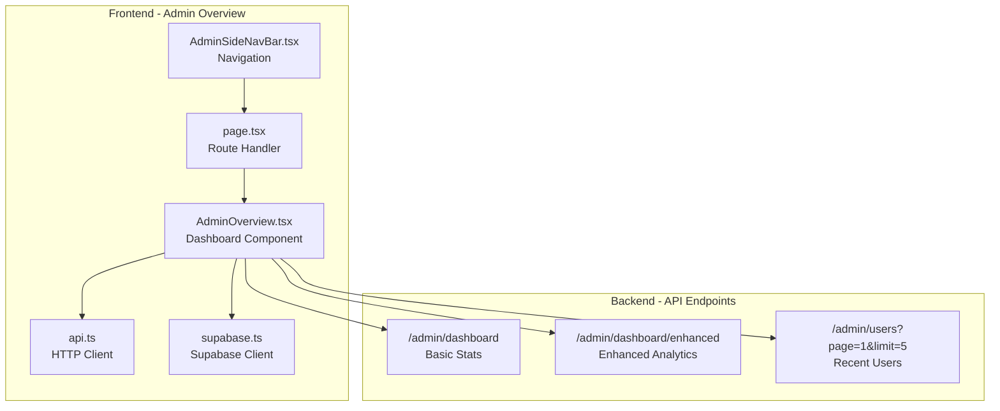
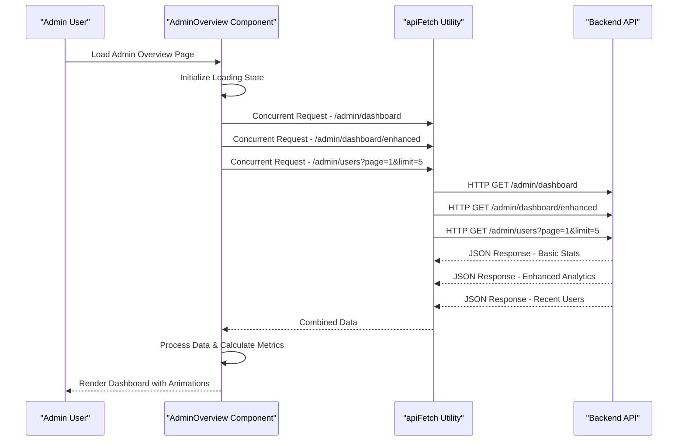
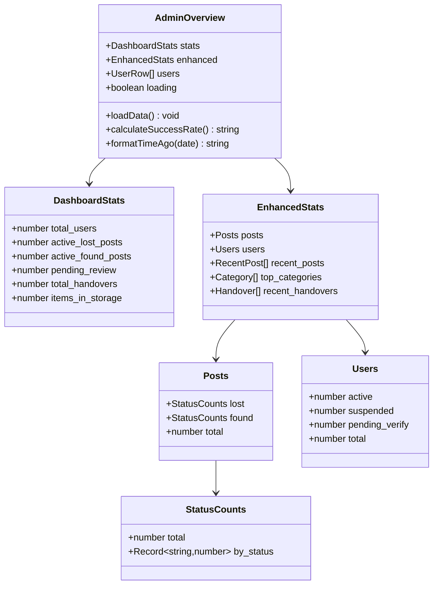
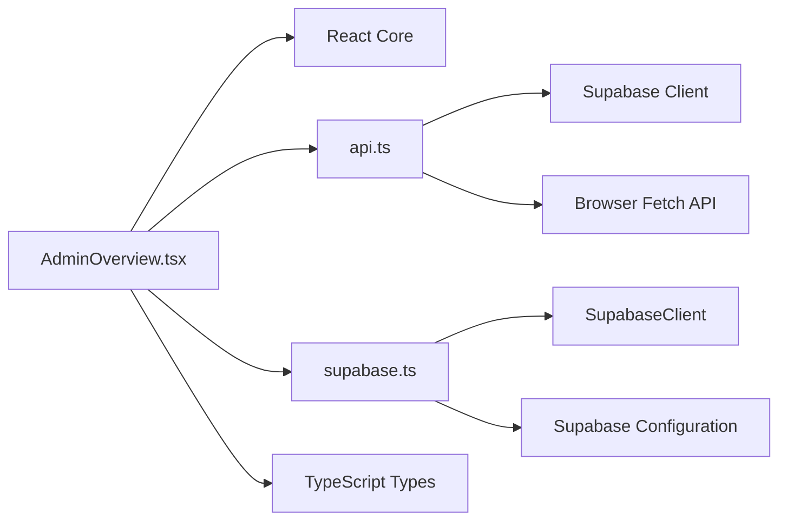

# Admin Overview Dashboard

<cite>
**Referenced Files in This Document**
- [AdminOverview.tsx](file://frontend/app/admin/admin-overview/AdminOverview.tsx)
- [page.tsx](file://frontend/app/admin/admin-overview/page.tsx)
- [AdminSideNavBar.tsx](file://frontend/app/components/AdminSideNavBar.tsx)
- [api.ts](file://frontend/app/lib/api.ts)
- [supabase.ts](file://frontend/app/lib/supabase.ts)
- [OVERVIEW.md](file://OVERVIEW.md)
</cite>

## Table of Contents
1. [Introduction](#introduction)
2. [Project Structure](#project-structure)
3. [Core Components](#core-components)
4. [Architecture Overview](#architecture-overview)
5. [Detailed Component Analysis](#detailed-component-analysis)
6. [Dependency Analysis](#dependency-analysis)
7. [Performance Considerations](#performance-considerations)
8. [Troubleshooting Guide](#troubleshooting-guide)
9. [Conclusion](#conclusion)

## Introduction
The Admin Overview Dashboard provides administrators with a comprehensive, real-time view of system metrics and activities. It displays key statistics such as total users, active lost/found posts, pending reviews, handovers, and storage items. The enhanced statistics section presents post status breakdown, top categories visualization, recent activity feed, and user registration tracking. The dashboard leverages concurrent data fetching from two primary endpoints: `/admin/dashboard` for basic statistics and `/admin/dashboard/enhanced` for enriched analytics. The interface employs a bento grid layout, animated progress bars, color-coded status indicators, and responsive design patterns to deliver an intuitive administrative experience.

## Project Structure
The admin overview dashboard is implemented as a Next.js app router page with a dedicated component responsible for data fetching, rendering, and user interactions. Supporting files include API utilities for data retrieval and navigation components for admin routing.

**Diagram sources**
- [AdminOverview.tsx](file://frontend/app/admin/admin-overview/AdminOverview.tsx)
- [page.tsx](file://frontend/app/admin/admin-overview/page.tsx)
- [AdminSideNavBar.tsx](file://frontend/app/components/AdminSideNavBar.tsx)
- [api.ts](file://frontend/app/lib/api.ts)
- [supabase.ts](file://frontend/app/lib/supabase.ts)

**Section sources**
- [AdminOverview.tsx](file://frontend/app/admin/admin-overview/AdminOverview.tsx)
- [page.tsx](file://frontend/app/admin/admin-overview/page.tsx)
- [AdminSideNavBar.tsx](file://frontend/app/components/AdminSideNavBar.tsx)

## Core Components
The dashboard comprises several key components that work together to present a cohesive administrative interface:

### Dashboard Statistics Container
The main container manages state for three data sets: basic dashboard statistics, enhanced analytics, and recent users. It implements concurrent data fetching using Promise.all to optimize loading performance and reduce total latency.

### Bento Grid Layout
A responsive grid system organizes statistics cards with varying sizes and visual emphasis. The layout adapts from single-column on mobile to multi-column configurations on larger screens, ensuring optimal information density across devices.

### Enhanced Analytics Panels
Specialized panels present complex data visualizations including:
- Post status breakdown with animated progress bars
- Top categories visualization with gradient color schemes
- Recent activity feed with timestamp formatting
- User registration tracking with role and status indicators

### Loading States and Error Handling
The component implements comprehensive loading states with spinner animations and fallback content. Error handling captures network failures and displays appropriate feedback to administrators.

**Section sources**
- [AdminOverview.tsx](file://frontend/app/admin/admin-overview/AdminOverview.tsx)

## Architecture Overview
The dashboard follows a client-side rendering architecture with centralized data fetching. The component orchestrates multiple asynchronous requests to backend endpoints, processes the data, and renders responsive visualizations.

**Diagram sources**
- [AdminOverview.tsx](file://frontend/app/admin/admin-overview/AdminOverview.tsx)
- [api.ts](file://frontend/app/lib/api.ts)

**Section sources**
- [AdminOverview.tsx](file://frontend/app/admin/admin-overview/AdminOverview.tsx)

## Detailed Component Analysis

### AdminOverview Component
The primary dashboard component implements a comprehensive data visualization system with the following key features:

#### Data Fetching Strategy
The component utilizes concurrent data fetching to minimize loading times:
- Basic dashboard statistics via `/admin/dashboard`
- Enhanced analytics via `/admin/dashboard/enhanced`
- Recent users via `/admin/users?page=1&limit=5`

#### Real-Time Statistics Display
The dashboard presents six primary metrics:
- Active lost posts (approved status)
- Active found posts (approved status)
- Pending review count
- Total handovers
- Items in storage
- Total users

#### Enhanced Statistics Features
The enhanced section provides deeper insights through:
- Post status breakdown showing distribution across pending, approved, rejected, matched, and closed statuses
- Top categories visualization highlighting most frequently used item categories
- Recent activity feed displaying latest posts with user and category information
- User registration tracking with role and status indicators

#### Visual Design Elements
The component implements sophisticated visual design patterns:
- Bento grid layout with responsive column arrangements
- Animated progress bars with smooth transitions
- Color-coded status indicators using semantic color schemes
- Glass-morphism card designs with subtle shadows
- Gradient backgrounds for featured statistics

#### Responsive Design Patterns
The dashboard adapts seamlessly across device sizes:
- Single column layout on mobile devices
- Multi-column grids on tablets and desktops
- Flexible card sizing with aspect ratio preservation
- Adaptive typography scaling for different screen sizes

**Diagram sources**
- [AdminOverview.tsx](file://frontend/app/admin/admin-overview/AdminOverview.tsx)

**Section sources**
- [AdminOverview.tsx](file://frontend/app/admin/admin-overview/AdminOverview.tsx)

### Data Visualization Techniques
The dashboard employs several advanced visualization techniques:

#### Animated Progress Bars
Progress bars utilize smooth CSS transitions with duration controls to create engaging visual feedback. Each bar animates from zero to its calculated percentage, providing immediate visual representation of data proportions.

#### Color-Coded Status Indicators
Semantic color schemes provide instant status recognition:
- Green for active/success states
- Red for inactive/suspension states  
- Amber for pending/waiting states
- Blue for informational states

#### Category Visualization
Top categories are displayed using a rotating color palette with percentage-based width calculations, ensuring proportional representation of category popularity.

#### Recent Activity Feed
Activity feed items include:
- Timestamp formatting with relative time calculations
- User avatars and profile information
- Category badges with descriptive labels
- Status indicators with appropriate color coding

**Section sources**
- [AdminOverview.tsx](file://frontend/app/admin/admin-overview/AdminOverview.tsx)

### Real-Time Data Updates
The dashboard implements automatic data refresh through:
- Initial load via useEffect hook
- Concurrent data fetching for optimal performance
- Loading state management with spinner animations
- Error boundary handling for graceful degradation

**Section sources**
- [AdminOverview.tsx](file://frontend/app/admin/admin-overview/AdminOverview.tsx)

## Dependency Analysis
The dashboard component has minimal external dependencies, relying primarily on React's built-in state management and the project's API utilities.

**Diagram sources**
- [AdminOverview.tsx](file://frontend/app/admin/admin-overview/AdminOverview.tsx)
- [api.ts](file://frontend/app/lib/api.ts)
- [supabase.ts](file://frontend/app/lib/supabase.ts)

**Section sources**
- [AdminOverview.tsx](file://frontend/app/admin/admin-overview/AdminOverview.tsx)
- [api.ts](file://frontend/app/lib/api.ts)
- [supabase.ts](file://frontend/app/lib/supabase.ts)

## Performance Considerations
The dashboard implements several performance optimization strategies:

### Concurrent Data Fetching
Multiple API requests are executed simultaneously using Promise.all, reducing total loading time from sequential to parallel execution.

### Efficient Rendering
- Memoized calculations prevent unnecessary recomputation
- Conditional rendering avoids DOM manipulation during loading states
- CSS transitions are hardware-accelerated for smooth animations

### Memory Management
- Component cleanup prevents memory leaks
- Proper state initialization avoids undefined value handling
- Efficient data structures minimize computational overhead

### Network Optimization
- Minimal payload sizes through focused API endpoints
- Reduced re-renders through selective state updates
- Optimized image loading with placeholder fallbacks

## Troubleshooting Guide
Common issues and their resolutions:

### Data Loading Failures
**Symptoms**: Blank dashboard or persistent loading spinner
**Causes**: Network connectivity issues, API endpoint unavailability, authentication failures
**Resolutions**: 
- Verify backend service availability
- Check network connectivity and CORS configuration
- Ensure proper authentication tokens are present

### Visual Rendering Issues
**Symptoms**: Misaligned grid layout or missing animations
**Causes**: CSS variable conflicts, browser compatibility issues, viewport scaling problems
**Resolutions**:
- Validate CSS custom properties are properly defined
- Test across supported browser versions
- Adjust responsive breakpoints as needed

### Performance Degradation
**Symptoms**: Slow loading times or janky animations
**Causes**: Large data payloads, excessive re-renders, inefficient calculations
**Resolutions**:
- Implement data pagination for large datasets
- Optimize calculation algorithms
- Reduce unnecessary state updates

**Section sources**
- [AdminOverview.tsx](file://frontend/app/admin/admin-overview/AdminOverview.tsx)

## Conclusion
The Admin Overview Dashboard provides a robust, real-time monitoring solution for administrators. Its comprehensive data visualization capabilities, responsive design, and performance optimizations deliver an efficient administrative experience. The modular architecture supports easy maintenance and future enhancements while maintaining excellent user experience across all device types.