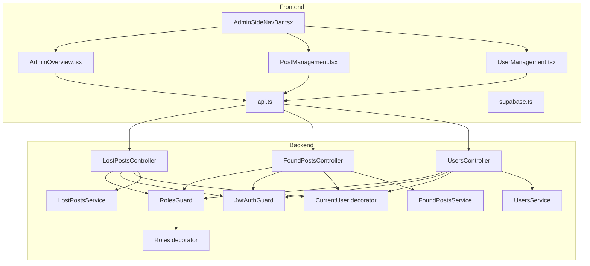
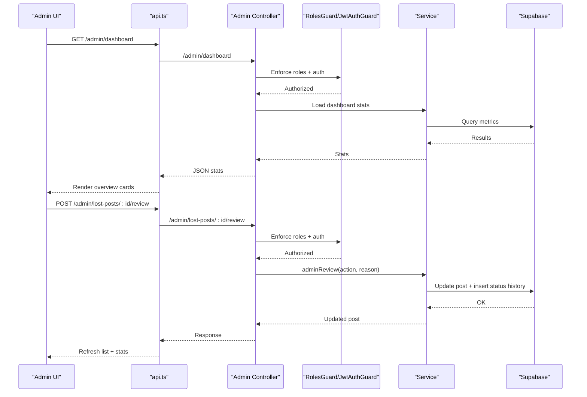
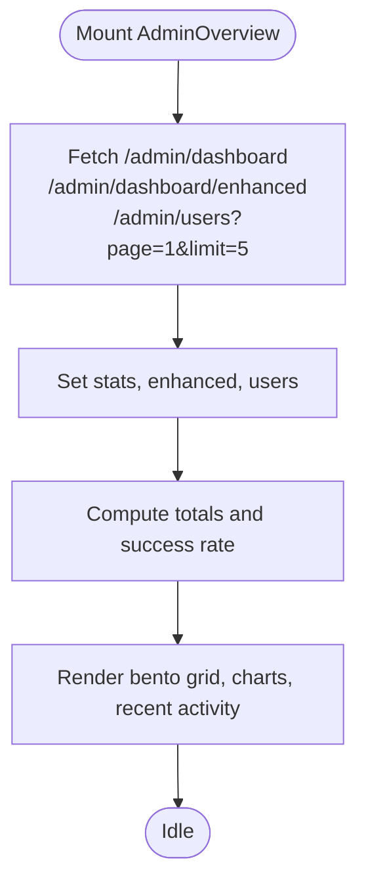
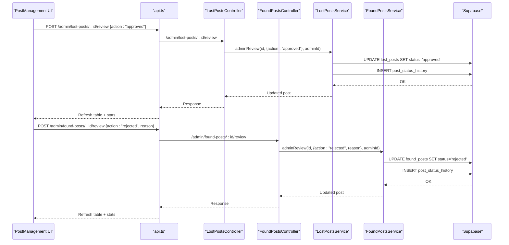
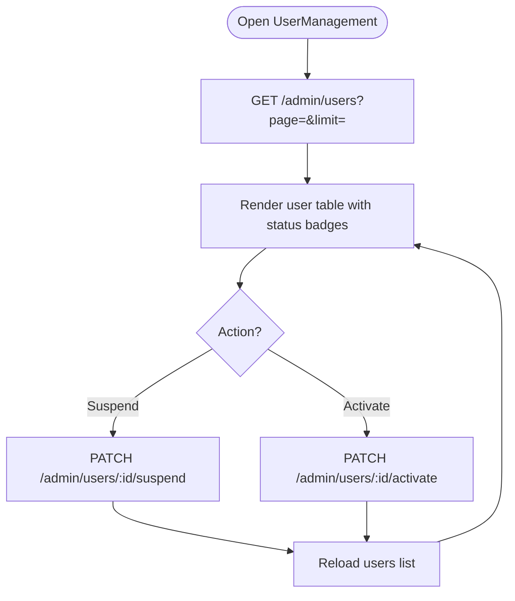
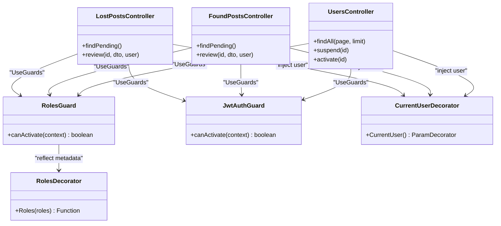
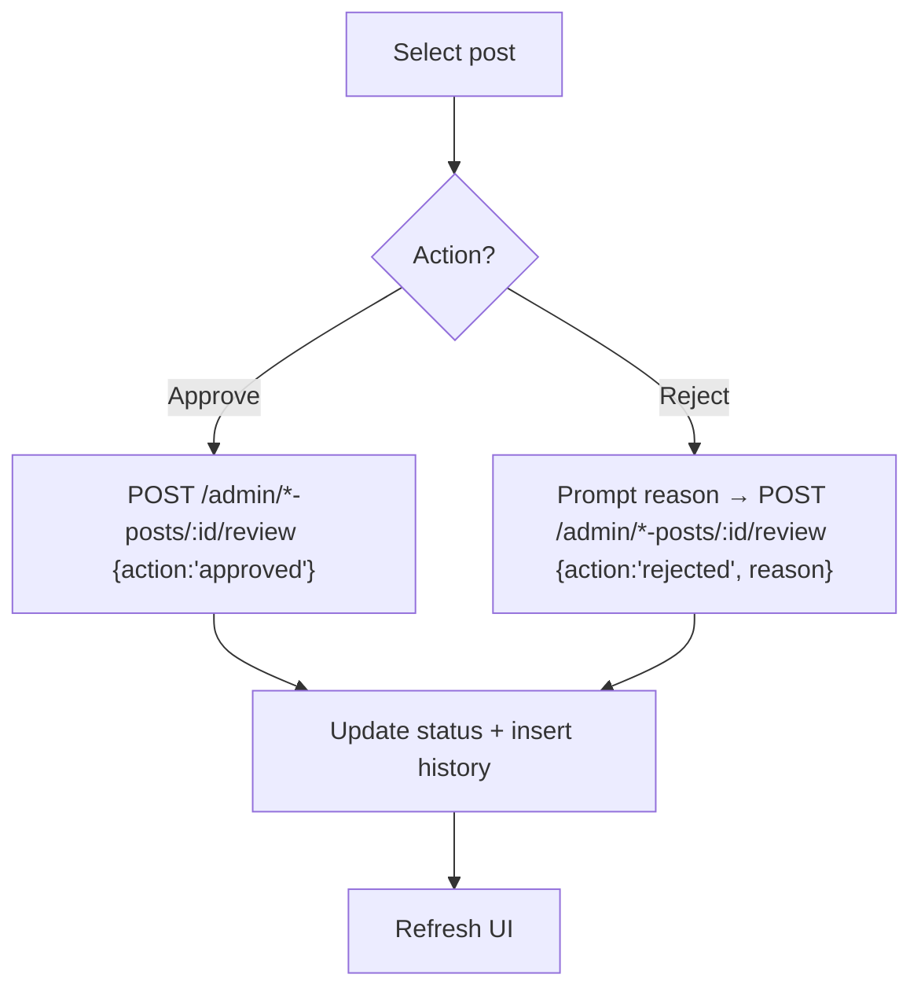
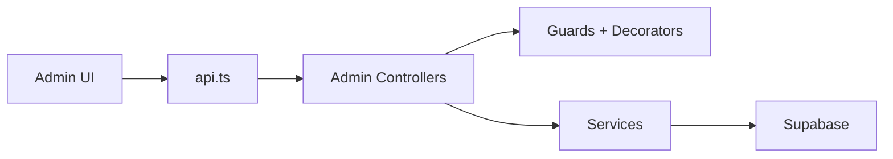

# Administrative Interface

<cite>
**Referenced Files in This Document**
- [AdminOverview.tsx](file://frontend/app/admin/admin-overview/AdminOverview.tsx)
- [page.tsx](file://frontend/app/admin/admin-overview/page.tsx)
- [PostManagement.tsx](file://frontend/app/admin/post-management/PostManagement.tsx)
- [UserManagement.tsx](file://frontend/app/admin/user-management/UserManagement.tsx)
- [AdminSideNavBar.tsx](file://frontend/app/components/AdminSideNavBar.tsx)
- [api.ts](file://frontend/app/lib/api.ts)
- [supabase.ts](file://frontend/app/lib/supabase.ts)
- [roles.guard.ts](file://backend/src/common/guards/roles.guard.ts)
- [roles.decorator.ts](file://backend/src/common/decorators/roles.decorator.ts)
- [jwt-auth.guard.ts](file://backend/src/common/guards/jwt-auth.guard.ts)
- [current-user.decorator.ts](file://backend/src/common/decorators/current-user.decorator.ts)
- [lost-posts.controller.ts](file://backend/src/modules/lost-posts/lost-posts.controller.ts)
- [found-posts.controller.ts](file://backend/src/modules/found-posts/found-posts.controller.ts)
- [users.controller.ts](file://backend/src/modules/users/users.controller.ts)
- [lost-posts.service.ts](file://backend/src/modules/lost-posts/lost-posts.service.ts)
- [found-posts.service.ts](file://backend/src/modules/found-posts/found-posts.service.ts)
- [users.service.ts](file://backend/src/modules/users/users.service.ts)
</cite>

## Table of Contents
1. [Introduction](#introduction)
2. [Project Structure](#project-structure)
3. [Core Components](#core-components)
4. [Architecture Overview](#architecture-overview)
5. [Detailed Component Analysis](#detailed-component-analysis)
6. [Dependency Analysis](#dependency-analysis)
7. [Performance Considerations](#performance-considerations)
8. [Troubleshooting Guide](#troubleshooting-guide)
9. [Conclusion](#conclusion)

## Introduction
This document describes the administrative dashboard system for content moderation and user administration. It covers:
- Admin-only access patterns and role-based permissions
- Admin overview statistics display
- Post management interface for content moderation
- User management controls
- Analytics dashboard components and data visualization
- Bulk operation capabilities
- Moderation workflows, user action logging, and administrative reporting
- Security considerations for admin access and audit trails

## Project Structure
The administrative interface spans the frontend Next.js application and the NestJS backend. The frontend renders admin dashboards and manages user interactions, while the backend enforces role-based access control and exposes admin endpoints.

**Diagram sources**
- [AdminOverview.tsx:1-530](file://frontend/app/admin/admin-overview/AdminOverview.tsx#L1-L530)
- [PostManagement.tsx:1-698](file://frontend/app/admin/post-management/PostManagement.tsx#L1-L698)
- [UserManagement.tsx:1-327](file://frontend/app/admin/user-management/UserManagement.tsx#L1-L327)
- [AdminSideNavBar.tsx:1-119](file://frontend/app/components/AdminSideNavBar.tsx#L1-L119)
- [api.ts](file://frontend/app/lib/api.ts)
- [supabase.ts](file://frontend/app/lib/supabase.ts)
- [roles.guard.ts:1-28](file://backend/src/common/guards/roles.guard.ts#L1-L28)
- [roles.decorator.ts:1-5](file://backend/src/common/decorators/roles.decorator.ts#L1-L5)
- [jwt-auth.guard.ts](file://backend/src/common/guards/jwt-auth.guard.ts)
- [current-user.decorator.ts](file://backend/src/common/decorators/current-user.decorator.ts)
- [lost-posts.controller.ts:1-78](file://backend/src/modules/lost-posts/lost-posts.controller.ts#L1-L78)
- [found-posts.controller.ts:1-78](file://backend/src/modules/found-posts/found-posts.controller.ts#L1-L78)
- [users.controller.ts:1-94](file://backend/src/modules/users/users.controller.ts#L1-L94)
- [lost-posts.service.ts:1-189](file://backend/src/modules/lost-posts/lost-posts.service.ts#L1-L189)
- [found-posts.service.ts:1-162](file://backend/src/modules/found-posts/found-posts.service.ts#L1-L162)
- [users.service.ts:1-136](file://backend/src/modules/users/users.service.ts#L1-L136)

**Section sources**
- [AdminOverview.tsx:1-530](file://frontend/app/admin/admin-overview/AdminOverview.tsx#L1-L530)
- [PostManagement.tsx:1-698](file://frontend/app/admin/post-management/PostManagement.tsx#L1-L698)
- [UserManagement.tsx:1-327](file://frontend/app/admin/user-management/UserManagement.tsx#L1-L327)
- [AdminSideNavBar.tsx:1-119](file://frontend/app/components/AdminSideNavBar.tsx#L1-L119)
- [roles.guard.ts:1-28](file://backend/src/common/guards/roles.guard.ts#L1-L28)
- [roles.decorator.ts:1-5](file://backend/src/common/decorators/roles.decorator.ts#L1-L5)
- [lost-posts.controller.ts:1-78](file://backend/src/modules/lost-posts/lost-posts.controller.ts#L1-L78)
- [found-posts.controller.ts:1-78](file://backend/src/modules/found-posts/found-posts.controller.ts#L1-L78)
- [users.controller.ts:1-94](file://backend/src/modules/users/users.controller.ts#L1-L94)

## Core Components
- Admin Overview Dashboard: Loads system-wide metrics, post status breakdown, top categories, recent activity, and recent users.
- Post Management Interface: Lists posts with filtering, live counts, and moderation actions (approve, reject, delete).
- User Management Controls: Lists users, shows status distribution, and supports suspend/activate actions.
- Admin Navigation: Provides sidebar navigation and mobile-friendly admin menu.
- Role-Based Access Control: Guards admin endpoints and enforces admin-only access.

**Section sources**
- [AdminOverview.tsx:56-86](file://frontend/app/admin/admin-overview/AdminOverview.tsx#L56-L86)
- [PostManagement.tsx:38-93](file://frontend/app/admin/post-management/PostManagement.tsx#L38-L93)
- [UserManagement.tsx:22-45](file://frontend/app/admin/user-management/UserManagement.tsx#L22-L45)
- [AdminSideNavBar.tsx:6-11](file://frontend/app/components/AdminSideNavBar.tsx#L6-L11)
- [roles.guard.ts:10-26](file://backend/src/common/guards/roles.guard.ts#L10-L26)

## Architecture Overview
The admin interface follows a layered architecture:
- Frontend components fetch data via a shared API client and render analytics and management UIs.
- Backend controllers expose admin endpoints and apply JWT authentication and role-based guards.
- Services encapsulate Supabase queries and enforce business rules, including status history logging for moderation actions.

**Diagram sources**
- [AdminOverview.tsx:62-80](file://frontend/app/admin/admin-overview/AdminOverview.tsx#L62-L80)
- [PostManagement.tsx:96-136](file://frontend/app/admin/post-management/PostManagement.tsx#L96-L136)
- [roles.guard.ts:10-26](file://backend/src/common/guards/roles.guard.ts#L10-L26)
- [jwt-auth.guard.ts](file://backend/src/common/guards/jwt-auth.guard.ts)
- [lost-posts.controller.ts:70-76](file://backend/src/modules/lost-posts/lost-posts.controller.ts#L70-L76)
- [lost-posts.service.ts:139-171](file://backend/src/modules/lost-posts/lost-posts.service.ts#L139-L171)

## Detailed Component Analysis

### Admin Overview Dashboard
- Data fetching: Concurrently loads dashboard stats, enhanced analytics, and recent users.
- Metrics: Displays active lost/found posts, pending reviews, success rate, total users, items in storage, and recent activity.
- Visualizations: Status breakdown bars, top categories chart, and recent posts feed.
- Navigation: Links to post management and user management for quick access.

**Diagram sources**
- [AdminOverview.tsx:62-86](file://frontend/app/admin/admin-overview/AdminOverview.tsx#L62-L86)

**Section sources**
- [AdminOverview.tsx:56-86](file://frontend/app/admin/admin-overview/AdminOverview.tsx#L56-L86)
- [page.tsx:1-5](file://frontend/app/admin/admin-overview/page.tsx#L1-L5)

### Post Management Interface
- Filtering: Supports type filter (all/lost/found), status filter, and search by title.
- Pagination: Loads 20 posts per page with page navigation.
- Moderation actions:
  - Approve: Calls admin review endpoint with action approved.
  - Reject: Prompts for reason, calls admin review endpoint with action rejected.
  - Delete: Confirms deletion and removes post via public endpoint.
- Live stats: Shows total posts, pending, approved, and rejected counts.
- Status visualization: Progress bars and recent activity panel.

**Diagram sources**
- [PostManagement.tsx:96-136](file://frontend/app/admin/post-management/PostManagement.tsx#L96-L136)
- [lost-posts.controller.ts:70-76](file://backend/src/modules/lost-posts/lost-posts.controller.ts#L70-L76)
- [found-posts.controller.ts:70-76](file://backend/src/modules/found-posts/found-posts.controller.ts#L70-L76)
- [lost-posts.service.ts:139-171](file://backend/src/modules/lost-posts/lost-posts.service.ts#L139-L171)
- [found-posts.service.ts:117-145](file://backend/src/modules/found-posts/found-posts.service.ts#L117-L145)

**Section sources**
- [PostManagement.tsx:38-151](file://frontend/app/admin/post-management/PostManagement.tsx#L38-L151)
- [lost-posts.controller.ts:62-76](file://backend/src/modules/lost-posts/lost-posts.controller.ts#L62-L76)
- [found-posts.controller.ts:62-76](file://backend/src/modules/found-posts/found-posts.controller.ts#L62-L76)
- [lost-posts.service.ts:139-171](file://backend/src/modules/lost-posts/lost-posts.service.ts#L139-L171)
- [found-posts.service.ts:117-145](file://backend/src/modules/found-posts/found-posts.service.ts#L117-L145)

### User Management Controls
- Listing: Paginated user list with role and status badges.
- Status distribution: Computes totals for active, suspended, and pending users.
- Actions:
  - Suspend: Patches user status to suspended.
  - Activate: Patches user status to active.
- Role enforcement: Prevents acting on admin users.

**Diagram sources**
- [UserManagement.tsx:28-72](file://frontend/app/admin/user-management/UserManagement.tsx#L28-L72)
- [users.controller.ts:78-92](file://backend/src/modules/users/users.controller.ts#L78-L92)
- [users.service.ts:123-134](file://backend/src/modules/users/users.service.ts#L123-L134)

**Section sources**
- [UserManagement.tsx:22-72](file://frontend/app/admin/user-management/UserManagement.tsx#L22-L72)
- [users.controller.ts:70-92](file://backend/src/modules/users/users.controller.ts#L70-L92)
- [users.service.ts:105-134](file://backend/src/modules/users/users.service.ts#L105-L134)

### Admin Navigation Structure
- Desktop sidebar with links to overview, post management, user management, and settings.
- Mobile bottom navigation with admin center prominently featured.
- Prefetching for faster navigation between admin pages.

**Section sources**
- [AdminSideNavBar.tsx:6-11](file://frontend/app/components/AdminSideNavBar.tsx#L6-L11)
- [AdminSideNavBar.tsx:13-78](file://frontend/app/components/AdminSideNavBar.tsx#L13-L78)
- [AdminSideNavBar.tsx:80-119](file://frontend/app/components/AdminSideNavBar.tsx#L80-L119)

### Role-Based Permissions and Admin-Only Access
- Guards:
  - JwtAuthGuard: Ensures requests carry a valid JWT.
  - RolesGuard: Enforces admin-only access for admin endpoints.
- Decorators:
  - Roles decorator: Declares required roles per endpoint.
  - CurrentUser decorator: Injects user identity into request handlers.
- Controllers:
  - LostPostsController: Admin endpoints for pending posts and review actions.
  - FoundPostsController: Admin endpoints mirroring lost posts.
  - UsersController: Admin endpoints for listing users and updating statuses.

**Diagram sources**
- [roles.guard.ts:1-28](file://backend/src/common/guards/roles.guard.ts#L1-L28)
- [jwt-auth.guard.ts](file://backend/src/common/guards/jwt-auth.guard.ts)
- [roles.decorator.ts:1-5](file://backend/src/common/decorators/roles.decorator.ts#L1-L5)
- [current-user.decorator.ts](file://backend/src/common/decorators/current-user.decorator.ts)
- [lost-posts.controller.ts:62-76](file://backend/src/modules/lost-posts/lost-posts.controller.ts#L62-L76)
- [found-posts.controller.ts:62-76](file://backend/src/modules/found-posts/found-posts.controller.ts#L62-L76)
- [users.controller.ts:70-92](file://backend/src/modules/users/users.controller.ts#L70-L92)

**Section sources**
- [roles.guard.ts:10-26](file://backend/src/common/guards/roles.guard.ts#L10-L26)
- [roles.decorator.ts:1-5](file://backend/src/common/decorators/roles.decorator.ts#L1-L5)
- [jwt-auth.guard.ts](file://backend/src/common/guards/jwt-auth.guard.ts)
- [current-user.decorator.ts](file://backend/src/common/decorators/current-user.decorator.ts)
- [lost-posts.controller.ts:62-76](file://backend/src/modules/lost-posts/lost-posts.controller.ts#L62-L76)
- [found-posts.controller.ts:62-76](file://backend/src/modules/found-posts/found-posts.controller.ts#L62-L76)
- [users.controller.ts:70-92](file://backend/src/modules/users/users.controller.ts#L70-L92)

### Analytics Dashboard Components and Data Visualization
- Overview cards: Active posts, success rate, total users, items in storage.
- Status breakdown: Horizontal bars for post statuses across lost and found.
- Top categories: Horizontal bars showing most frequent categories.
- Recent activity: List of recent posts with user and category info.
- User table: Recent users with role and status badges.

**Section sources**
- [AdminOverview.tsx:132-368](file://frontend/app/admin/admin-overview/AdminOverview.tsx#L132-L368)
- [AdminOverview.tsx:370-527](file://frontend/app/admin/admin-overview/AdminOverview.tsx#L370-L527)

### Content Moderation Tools
- Pending queues: Separate endpoints for pending lost and found posts.
- Review actions: Approve or reject with optional reason for rejections.
- Status history: Logs all status changes with timestamps and reasons.
- Audit trail: Each moderation action records who changed the status and when.

**Section sources**
- [lost-posts.controller.ts:62-76](file://backend/src/modules/lost-posts/lost-posts.controller.ts#L62-L76)
- [found-posts.controller.ts:62-76](file://backend/src/modules/found-posts/found-posts.controller.ts#L62-L76)
- [lost-posts.service.ts:139-171](file://backend/src/modules/lost-posts/lost-posts.service.ts#L139-L171)
- [found-posts.service.ts:117-145](file://backend/src/modules/found-posts/found-posts.service.ts#L117-L145)

### User Administration Features
- User listing: Paginated list with role and status indicators.
- Status updates: Suspend and activate actions enforced by admin guard.
- Role safety: Prevents acting on admin users.

**Section sources**
- [users.controller.ts:70-92](file://backend/src/modules/users/users.controller.ts#L70-L92)
- [users.service.ts:105-134](file://backend/src/modules/users/users.service.ts#L105-L134)
- [UserManagement.tsx:244-270](file://frontend/app/admin/user-management/UserManagement.tsx#L244-L270)

### Bulk Operation Capabilities
- Pagination-driven bulk actions: Apply suspend/activate across pages.
- Batch moderation: Approve/reject/delete posts individually or via pagination.
- Filtering: Reduce dataset before applying actions.

**Section sources**
- [PostManagement.tsx:158-167](file://frontend/app/admin/post-management/PostManagement.tsx#L158-L167)
- [UserManagement.tsx:72-78](file://frontend/app/admin/user-management/UserManagement.tsx#L72-L78)

### Examples of Moderation Workflows
- Workflow A: Approve a lost post
  - Select post in Post Management → Click Approve → Service updates status and inserts status history → UI refreshes.
- Workflow B: Reject a found post
  - Select post in Post Management → Click Reject → Prompt for reason → Service updates status and inserts status history → UI refreshes.

**Diagram sources**
- [PostManagement.tsx:96-136](file://frontend/app/admin/post-management/PostManagement.tsx#L96-L136)
- [lost-posts.controller.ts:70-76](file://backend/src/modules/lost-posts/lost-posts.controller.ts#L70-L76)
- [found-posts.controller.ts:70-76](file://backend/src/modules/found-posts/found-posts.controller.ts#L70-L76)
- [lost-posts.service.ts:139-171](file://backend/src/modules/lost-posts/lost-posts.service.ts#L139-L171)
- [found-posts.service.ts:117-145](file://backend/src/modules/found-posts/found-posts.service.ts#L117-L145)

### Administrative Reporting Features
- Overview reports: Real-time stats, success rate, and recent activity.
- Category distribution: Top categories chart for trend analysis.
- User reporting: Status distribution and recent user table.

**Section sources**
- [AdminOverview.tsx:178-368](file://frontend/app/admin/admin-overview/AdminOverview.tsx#L178-L368)
- [AdminOverview.tsx:439-527](file://frontend/app/admin/admin-overview/AdminOverview.tsx#L439-L527)

### Security Considerations for Admin Access and Audit Trail
- Authentication: All admin endpoints require a valid JWT.
- Authorization: RolesGuard ensures only admin users can access admin endpoints.
- Audit trail: Status history logs capture who changed the status and when.
- Data exposure: Admin-only endpoints prevent unauthorized access to sensitive operations.

**Section sources**
- [roles.guard.ts:10-26](file://backend/src/common/guards/roles.guard.ts#L10-L26)
- [jwt-auth.guard.ts](file://backend/src/common/guards/jwt-auth.guard.ts)
- [lost-posts.service.ts:160-168](file://backend/src/modules/lost-posts/lost-posts.service.ts#L160-L168)
- [found-posts.service.ts:135-142](file://backend/src/modules/found-posts/found-posts.service.ts#L135-L142)

## Dependency Analysis
- Frontend depends on a shared API client for all admin endpoints.
- Controllers depend on Guards and Services.
- Services depend on Supabase client for database operations.
- Status history is inserted alongside post updates to maintain auditability.

**Diagram sources**
- [AdminOverview.tsx:3-4](file://frontend/app/admin/admin-overview/AdminOverview.tsx#L3-L4)
- [PostManagement.tsx:3-4](file://frontend/app/admin/post-management/PostManagement.tsx#L3-L4)
- [UserManagement.tsx:3-4](file://frontend/app/admin/user-management/UserManagement.tsx#L3-L4)
- [roles.guard.ts:1-28](file://backend/src/common/guards/roles.guard.ts#L1-L28)
- [lost-posts.controller.ts:1-78](file://backend/src/modules/lost-posts/lost-posts.controller.ts#L1-L78)
- [found-posts.controller.ts:1-78](file://backend/src/modules/found-posts/found-posts.controller.ts#L1-L78)
- [users.controller.ts:1-94](file://backend/src/modules/users/users.controller.ts#L1-L94)
- [lost-posts.service.ts:1-189](file://backend/src/modules/lost-posts/lost-posts.service.ts#L1-L189)
- [found-posts.service.ts:1-162](file://backend/src/modules/found-posts/found-posts.service.ts#L1-L162)
- [users.service.ts:1-136](file://backend/src/modules/users/users.service.ts#L1-L136)

**Section sources**
- [AdminOverview.tsx:3-4](file://frontend/app/admin/admin-overview/AdminOverview.tsx#L3-L4)
- [PostManagement.tsx:3-4](file://frontend/app/admin/post-management/PostManagement.tsx#L3-L4)
- [UserManagement.tsx:3-4](file://frontend/app/admin/user-management/UserManagement.tsx#L3-L4)
- [roles.guard.ts:1-28](file://backend/src/common/guards/roles.guard.ts#L1-L28)
- [lost-posts.controller.ts:1-78](file://backend/src/modules/lost-posts/lost-posts.controller.ts#L1-L78)
- [found-posts.controller.ts:1-78](file://backend/src/modules/found-posts/found-posts.controller.ts#L1-L78)
- [users.controller.ts:1-94](file://backend/src/modules/users/users.controller.ts#L1-L94)

## Performance Considerations
- Concurrent data fetching: Overview dashboard uses concurrent requests to reduce perceived latency.
- Pagination: Admin endpoints support page and limit parameters to manage large datasets.
- Client-side caching: Consider memoizing API responses for repeated filters.
- Database indexing: Ensure database queries leverage appropriate indexes for status, created_at, and search fields.

[No sources needed since this section provides general guidance]

## Troubleshooting Guide
- Authentication failures: Verify JWT presence and validity for admin endpoints.
- Authorization errors: Confirm user role is admin when accessing admin-only endpoints.
- Missing data: Check pagination parameters and filters; ensure database records exist.
- Moderation errors: Ensure rejection reason is provided when rejecting posts.

**Section sources**
- [roles.guard.ts:10-26](file://backend/src/common/guards/roles.guard.ts#L10-L26)
- [lost-posts.service.ts:142-144](file://backend/src/modules/lost-posts/lost-posts.service.ts#L142-L144)
- [found-posts.service.ts:119-121](file://backend/src/modules/found-posts/found-posts.service.ts#L119-L121)

## Conclusion
The administrative dashboard integrates frontend analytics and management UIs with backend role-based access control and robust moderation workflows. Admins can monitor system health, moderate content efficiently, and manage users securely, with audit trails ensuring transparency and accountability.