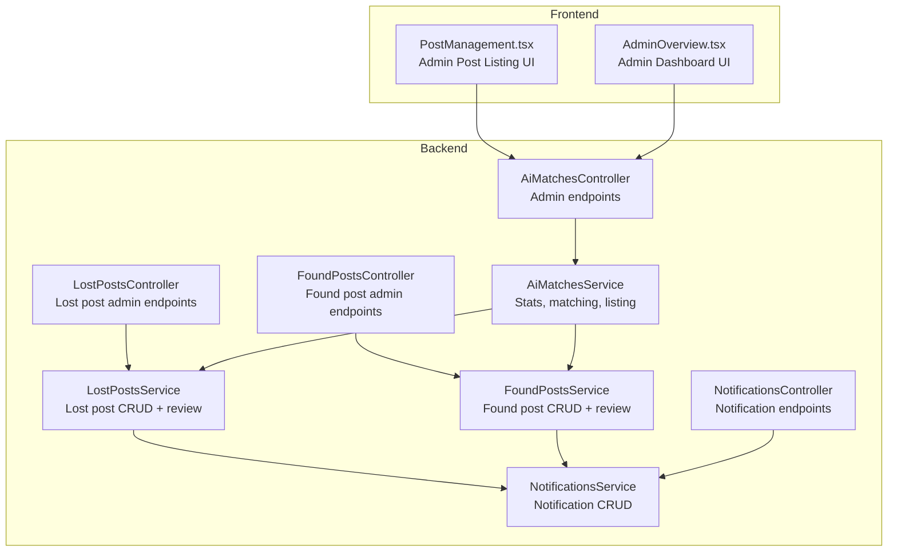
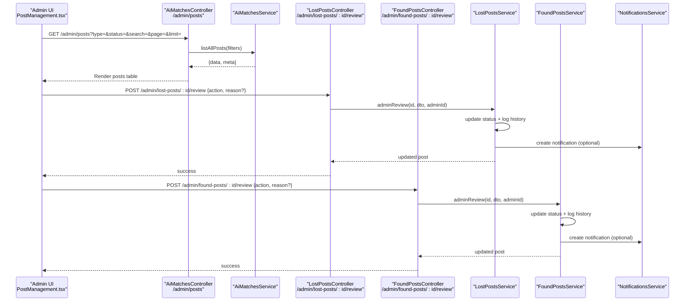
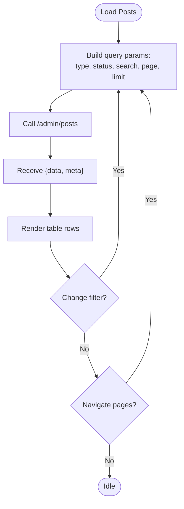
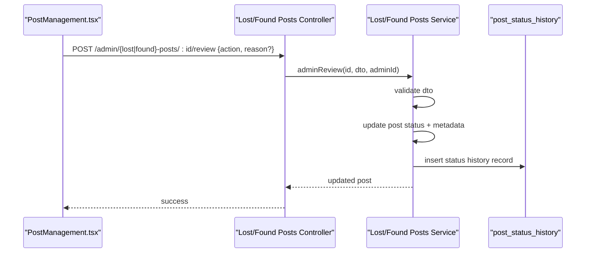
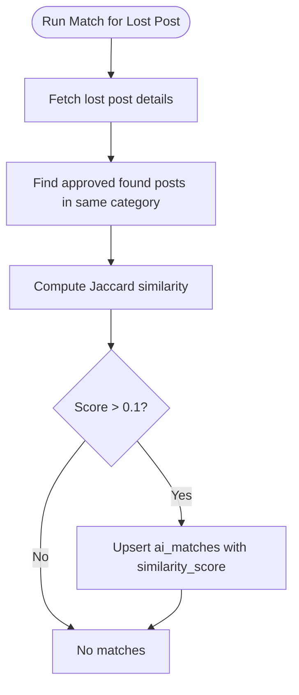
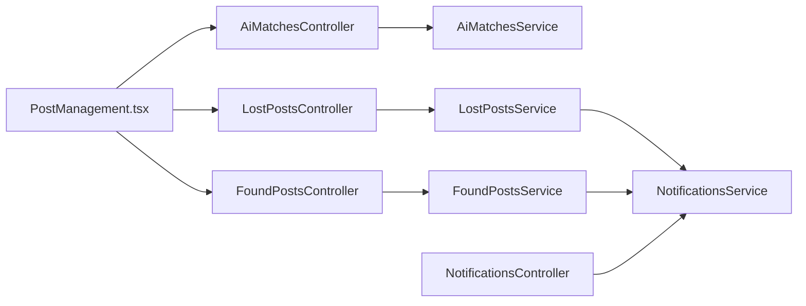

# Post Management Interface

<cite>
**Referenced Files in This Document**
- [PostManagement.tsx](file://frontend/app/admin/post-management/PostManagement.tsx)
- [AdminOverview.tsx](file://frontend/app/admin/admin-overview/AdminOverview.tsx)
- [ai-matches.controller.ts](file://backend/src/modules/ai-matches/ai-matches.controller.ts)
- [ai-matches.service.ts](file://backend/src/modules/ai-matches/ai-matches.service.ts)
- [lost-posts.controller.ts](file://backend/src/modules/lost-posts/lost-posts.controller.ts)
- [found-posts.controller.ts](file://backend/src/modules/found-posts/found-posts.controller.ts)
- [lost-posts.service.ts](file://backend/src/modules/lost-posts/lost-posts.service.ts)
- [found-posts.service.ts](file://backend/src/modules/found-posts/found-posts.service.ts)
- [query-lost-posts.dto.ts](file://backend/src/modules/lost-posts/dto/query-lost-posts.dto.ts)
- [review-post.dto.ts](file://backend/src/modules/lost-posts/dto/review-post.dto.ts)
- [notifications.controller.ts](file://backend/src/modules/notifications/notifications.controller.ts)
- [notifications.service.ts](file://backend/src/modules/notifications/notifications.service.ts)
</cite>

## Table of Contents
1. [Introduction](#introduction)
2. [Project Structure](#project-structure)
3. [Core Components](#core-components)
4. [Architecture Overview](#architecture-overview)
5. [Detailed Component Analysis](#detailed-component-analysis)
6. [Dependency Analysis](#dependency-analysis)
7. [Performance Considerations](#performance-considerations)
8. [Troubleshooting Guide](#troubleshooting-guide)
9. [Conclusion](#conclusion)

## Introduction
This document describes the administrator-facing post management interface for content moderation. It covers the post listing system with filtering by status (pending, approved, rejected, matched, closed), post type (lost/found), and search functionality. It explains the moderation workflow including approve/reject actions, status updates, and how the system integrates with the AI matching system and notification service. It also documents the post preview components and audit trail logging for all moderation actions.

## Project Structure
The post management interface spans the frontend Next.js application and the backend NestJS API. The frontend renders the admin UI and interacts with backend endpoints exposed by the AI matches module and post-specific controllers. The backend services encapsulate Supabase data access and implement moderation logic, status history tracking, and dashboard statistics.

**Diagram sources**
- [PostManagement.tsx:38-698](file://frontend/app/admin/post-management/PostManagement.tsx#L38-L698)
- [AdminOverview.tsx:56-80](file://frontend/app/admin/admin-overview/AdminOverview.tsx#L56-L80)
- [ai-matches.controller.ts:58-71](file://backend/src/modules/ai-matches/ai-matches.controller.ts#L58-L71)
- [ai-matches.service.ts:276-367](file://backend/src/modules/ai-matches/ai-matches.service.ts#L276-L367)
- [lost-posts.controller.ts:70-77](file://backend/src/modules/lost-posts/lost-posts.controller.ts#L70-L77)
- [found-posts.controller.ts:70-77](file://backend/src/modules/found-posts/found-posts.controller.ts#L70-L77)
- [lost-posts.service.ts:139-171](file://backend/src/modules/lost-posts/lost-posts.service.ts#L139-L171)
- [found-posts.service.ts:117-145](file://backend/src/modules/found-posts/found-posts.service.ts#L117-L145)
- [notifications.controller.ts:14-41](file://backend/src/modules/notifications/notifications.controller.ts#L14-L41)
- [notifications.service.ts:65-81](file://backend/src/modules/notifications/notifications.service.ts#L65-L81)

**Section sources**
- [PostManagement.tsx:38-698](file://frontend/app/admin/post-management/PostManagement.tsx#L38-L698)
- [ai-matches.controller.ts:58-71](file://backend/src/modules/ai-matches/ai-matches.controller.ts#L58-L71)
- [ai-matches.service.ts:276-367](file://backend/src/modules/ai-matches/ai-matches.service.ts#L276-L367)

## Core Components
- Admin Post Listing UI: Renders filtered post lists, stats cards, and action buttons (approve, reject, delete). It fetches data from the backend admin endpoints and refreshes stats after actions.
- Admin Dashboard UI: Displays enhanced statistics including post status breakdown, top categories, recent activity, and user metrics.
- Admin Controllers: Expose endpoints for listing all posts with filters, approving/rejecting posts, and retrieving dashboard statistics.
- Post Services: Implement moderation logic, status updates, and status history logging. They also provide public listing with search and pagination.
- AI Matching Service: Powers text-based matching between lost and found posts, supports manual triggering and confirmation flows.
- Notifications Service: Provides CRUD operations for user notifications and internal creation for moderation outcomes.

**Section sources**
- [PostManagement.tsx:38-698](file://frontend/app/admin/post-management/PostManagement.tsx#L38-L698)
- [AdminOverview.tsx:56-80](file://frontend/app/admin/admin-overview/AdminOverview.tsx#L56-L80)
- [ai-matches.controller.ts:58-71](file://backend/src/modules/ai-matches/ai-matches.controller.ts#L58-L71)
- [lost-posts.service.ts:139-171](file://backend/src/modules/lost-posts/lost-posts.service.ts#L139-L171)
- [found-posts.service.ts:117-145](file://backend/src/modules/found-posts/found-posts.service.ts#L117-L145)
- [ai-matches.service.ts:15-96](file://backend/src/modules/ai-matches/ai-matches.service.ts#L15-L96)
- [notifications.service.ts:65-81](file://backend/src/modules/notifications/notifications.service.ts#L65-L81)

## Architecture Overview
The moderation workflow connects the admin UI to backend controllers and services. Approve/reject actions call admin endpoints that update post status and log changes. Optional AI matching can be triggered to find potential matches, and notifications can be generated for outcome events.

**Diagram sources**
- [PostManagement.tsx:96-151](file://frontend/app/admin/post-management/PostManagement.tsx#L96-L151)
- [ai-matches.controller.ts:58-71](file://backend/src/modules/ai-matches/ai-matches.controller.ts#L58-L71)
- [ai-matches.service.ts:276-367](file://backend/src/modules/ai-matches/ai-matches.service.ts#L276-L367)
- [lost-posts.controller.ts:70-77](file://backend/src/modules/lost-posts/lost-posts.controller.ts#L70-L77)
- [found-posts.controller.ts:70-77](file://backend/src/modules/found-posts/found-posts.controller.ts#L70-L77)
- [lost-posts.service.ts:139-171](file://backend/src/modules/lost-posts/lost-posts.service.ts#L139-L171)
- [found-posts.service.ts:117-145](file://backend/src/modules/found-posts/found-posts.service.ts#L117-L145)
- [notifications.service.ts:65-81](file://backend/src/modules/notifications/notifications.service.ts#L65-L81)

## Detailed Component Analysis

### Post Listing and Filtering
- Filters supported:
  - Post type: all, lost, found
  - Status: pending, approved, rejected, matched, closed
  - Search: free-text on title
- Pagination: page and limit parameters with computed page range display
- Enhanced stats: total posts, pending count, approved count, rejected count, top categories, status distribution, recent activity

**Diagram sources**
- [PostManagement.tsx:53-76](file://frontend/app/admin/post-management/PostManagement.tsx#L53-L76)
- [ai-matches.controller.ts:58-71](file://backend/src/modules/ai-matches/ai-matches.controller.ts#L58-L71)
- [ai-matches.service.ts:276-367](file://backend/src/modules/ai-matches/ai-matches.service.ts#L276-L367)

**Section sources**
- [PostManagement.tsx:44-93](file://frontend/app/admin/post-management/PostManagement.tsx#L44-L93)
- [ai-matches.controller.ts:58-71](file://backend/src/modules/ai-matches/ai-matches.controller.ts#L58-L71)
- [ai-matches.service.ts:276-367](file://backend/src/modules/ai-matches/ai-matches.service.ts#L276-L367)

### Moderation Workflow: Approve/Reject/Delete
- Approve:
  - Endpoint differs by post type: lost vs found
  - Payload includes action: approved
  - On success, reloads current page and refreshes stats
- Reject:
  - Requires reason input
  - Endpoint differs by post type
  - Payload includes action: rejected and reason
  - On success, reloads current page and refreshes stats
- Delete:
  - Confirms deletion
  - Uses public endpoints (/lost-posts/:id or /found-posts/:id)
  - On success, reloads current page and refreshes stats

**Diagram sources**
- [PostManagement.tsx:96-151](file://frontend/app/admin/post-management/PostManagement.tsx#L96-L151)
- [lost-posts.controller.ts:70-77](file://backend/src/modules/lost-posts/lost-posts.controller.ts#L70-L77)
- [found-posts.controller.ts:70-77](file://backend/src/modules/found-posts/found-posts.controller.ts#L70-L77)
- [lost-posts.service.ts:139-171](file://backend/src/modules/lost-posts/lost-posts.service.ts#L139-L171)
- [found-posts.service.ts:117-145](file://backend/src/modules/found-posts/found-posts.service.ts#L117-L145)

**Section sources**
- [PostManagement.tsx:96-151](file://frontend/app/admin/post-management/PostManagement.tsx#L96-L151)
- [lost-posts.service.ts:139-171](file://backend/src/modules/lost-posts/lost-posts.service.ts#L139-L171)
- [found-posts.service.ts:117-145](file://backend/src/modules/found-posts/found-posts.service.ts#L117-L145)

### Post Preview Components
- Post row includes:
  - Thumbnail image (first image URL)
  - Title and truncated description
  - Category name and location
  - Post type badge (lost/found)
  - Reporter avatar and name
  - Created date and relative time
  - Status indicator with color-coded label
  - View count
  - Action buttons (approve, reject, delete) visible on hover when status is pending

**Section sources**
- [PostManagement.tsx:408-551](file://frontend/app/admin/post-management/PostManagement.tsx#L408-L551)

### Approval Process and Status Change Tracking
- Status transitions:
  - approved: posts created by users are auto-approved and logged
  - pending: awaiting admin review
  - rejected: requires reason; stored on post
  - matched: managed by AI matching system
  - closed: indicates resolution/completion
- Audit trail:
  - All status changes write to post_status_history with post_type, post_id, old_status, new_status, changed_by, and optional note/reason

**Section sources**
- [lost-posts.service.ts:32-42](file://backend/src/modules/lost-posts/lost-posts.service.ts#L32-L42)
- [lost-posts.service.ts:160-168](file://backend/src/modules/lost-posts/lost-posts.service.ts#L160-L168)
- [found-posts.service.ts:28-36](file://backend/src/modules/found-posts/found-posts.service.ts#L28-L36)
- [found-posts.service.ts:135-142](file://backend/src/modules/found-posts/found-posts.service.ts#L135-L142)

### AI Matching Integration
- Manual matching:
  - Endpoint to run text-based matching for a lost post
  - Computes Jaccard similarity between title/description of candidate found posts
  - Upserts matches with similarity scores
- Match confirmation:
  - Owner or finder confirms match; both sides required for final confirmation
- Status propagation:
  - Matches can influence post status to "matched" when confirmed

**Diagram sources**
- [ai-matches.service.ts:45-96](file://backend/src/modules/ai-matches/ai-matches.service.ts#L45-L96)

**Section sources**
- [ai-matches.controller.ts:30-34](file://backend/src/modules/ai-matches/ai-matches.controller.ts#L30-L34)
- [ai-matches.service.ts:45-96](file://backend/src/modules/ai-matches/ai-matches.service.ts#L45-L96)

### Notification System Integration
- Notification types include post_approved, post_rejected, match_found, and others
- Notifications can be retrieved per user, counted as unread, and marked as read
- Moderation actions can trigger notifications via internal creation from services

**Section sources**
- [notifications.controller.ts:14-41](file://backend/src/modules/notifications/notifications.controller.ts#L14-L41)
- [notifications.service.ts:4-81](file://backend/src/modules/notifications/notifications.service.ts#L4-L81)

### Administrative Decision-Making Workflows
- Bulk-like operations:
  - Approve/reject/delete performed per post row
  - Pending posts are highlighted for quick moderation
- Dashboard insights:
  - Enhanced dashboard provides status breakdown, top categories, recent activity, and user metrics
  - Live count highlights pending posts requiring review

**Section sources**
- [AdminOverview.tsx:56-80](file://frontend/app/admin/admin-overview/AdminOverview.tsx#L56-L80)
- [PostManagement.tsx:340-354](file://frontend/app/admin/post-management/PostManagement.tsx#L340-L354)

## Dependency Analysis
- Frontend depends on backend admin endpoints for listing and moderation actions
- Controllers delegate to services for business logic
- Services use Supabase client for data access and status history writes
- AI matching service coordinates with post services for status updates and notifications
- Notifications service is reusable across moderation outcomes

**Diagram sources**
- [PostManagement.tsx:38-698](file://frontend/app/admin/post-management/PostManagement.tsx#L38-L698)
- [ai-matches.controller.ts:58-71](file://backend/src/modules/ai-matches/ai-matches.controller.ts#L58-L71)
- [lost-posts.controller.ts:70-77](file://backend/src/modules/lost-posts/lost-posts.controller.ts#L70-L77)
- [found-posts.controller.ts:70-77](file://backend/src/modules/found-posts/found-posts.controller.ts#L70-L77)
- [ai-matches.service.ts:276-367](file://backend/src/modules/ai-matches/ai-matches.service.ts#L276-L367)
- [lost-posts.service.ts:139-171](file://backend/src/modules/lost-posts/lost-posts.service.ts#L139-L171)
- [found-posts.service.ts:117-145](file://backend/src/modules/found-posts/found-posts.service.ts#L117-L145)
- [notifications.controller.ts:14-41](file://backend/src/modules/notifications/notifications.controller.ts#L14-L41)
- [notifications.service.ts:65-81](file://backend/src/modules/notifications/notifications.service.ts#L65-L81)

**Section sources**
- [PostManagement.tsx:38-698](file://frontend/app/admin/post-management/PostManagement.tsx#L38-L698)
- [ai-matches.controller.ts:58-71](file://backend/src/modules/ai-matches/ai-matches.controller.ts#L58-L71)
- [lost-posts.controller.ts:70-77](file://backend/src/modules/lost-posts/lost-posts.controller.ts#L70-L77)
- [found-posts.controller.ts:70-77](file://backend/src/modules/found-posts/found-posts.controller.ts#L70-L77)
- [ai-matches.service.ts:276-367](file://backend/src/modules/ai-matches/ai-matches.service.ts#L276-L367)
- [lost-posts.service.ts:139-171](file://backend/src/modules/lost-posts/lost-posts.service.ts#L139-L171)
- [found-posts.service.ts:117-145](file://backend/src/modules/found-posts/found-posts.service.ts#L117-L145)
- [notifications.controller.ts:14-41](file://backend/src/modules/notifications/notifications.controller.ts#L14-L41)
- [notifications.service.ts:65-81](file://backend/src/modules/notifications/notifications.service.ts#L65-L81)

## Performance Considerations
- Pagination: Backend enforces page and limit bounds; frontend computes visible page numbers to reduce rendering overhead.
- Search: Text search is applied server-side with ILIKE on title; keep search terms concise to avoid heavy scans.
- Status filtering: Server-side equality filters minimize payload sizes.
- Dashboard stats: Enhanced stats use aggregated counts and sorted recent activity; cache or throttle frequent dashboard refreshes.
- Image thumbnails: Lazy loading via browser-native attributes reduces initial render cost.

## Troubleshooting Guide
- Approve/Reject errors:
  - Ensure reason is provided for rejections
  - Verify admin credentials and roles
- Deletion failures:
  - Confirm ownership or admin role
  - Check backend error responses for validation or forbidden reasons
- Empty results:
  - Adjust filters (type, status, search) or navigate pages
- Stats not updating:
  - Refresh the page or trigger stats reload after moderation actions
- Notification delivery:
  - Confirm notification creation in moderation flows and user access to notifications endpoint

**Section sources**
- [lost-posts.service.ts:142-144](file://backend/src/modules/lost-posts/lost-posts.service.ts#L142-L144)
- [found-posts.service.ts:119-121](file://backend/src/modules/found-posts/found-posts.service.ts#L119-L121)
- [PostManagement.tsx:117-135](file://frontend/app/admin/post-management/PostManagement.tsx#L117-L135)

## Conclusion
The post management interface provides administrators with a comprehensive toolkit for content moderation. It supports robust filtering, actionable moderation controls, integrated AI matching, and status change auditing. The admin dashboard offers contextual insights to guide decision-making, while the notification system ensures stakeholders are informed of moderation outcomes.