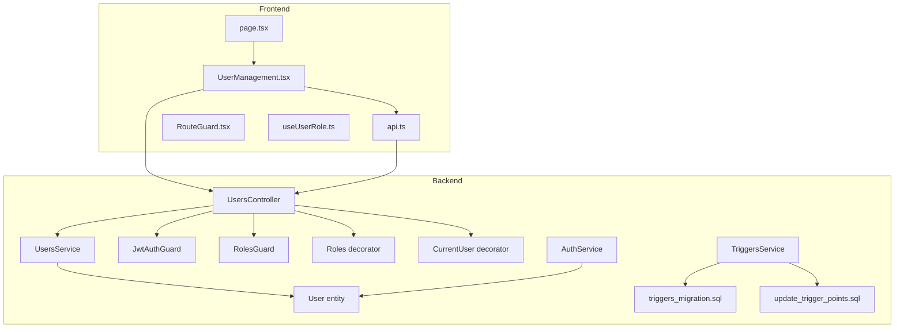
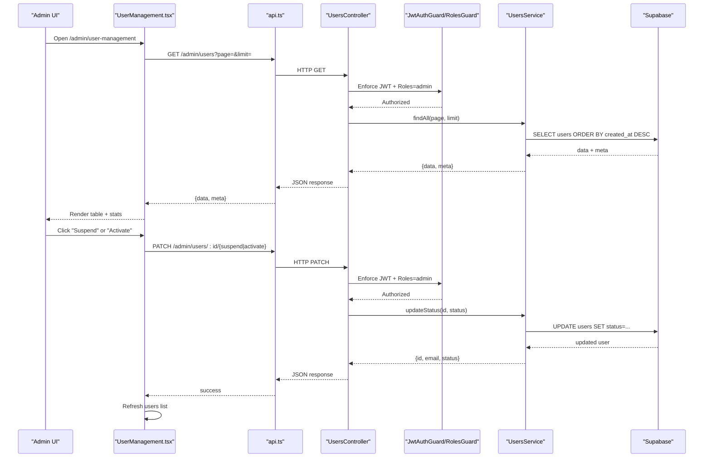
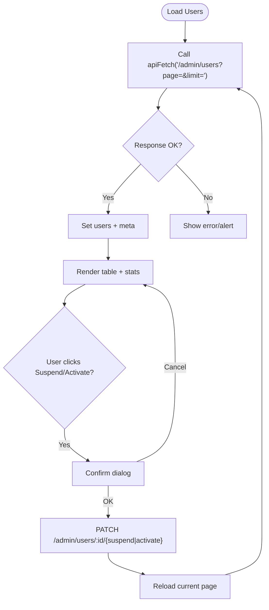
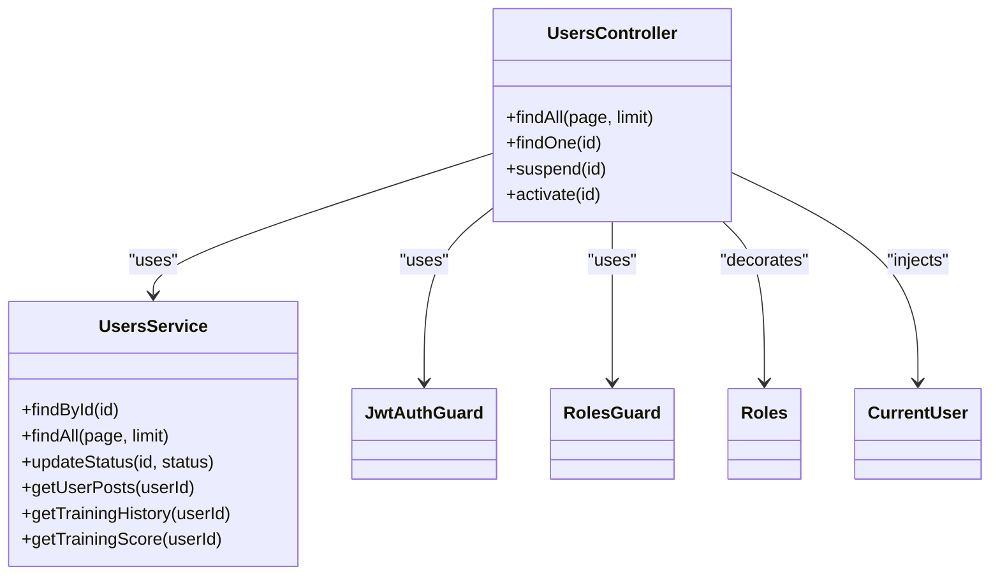
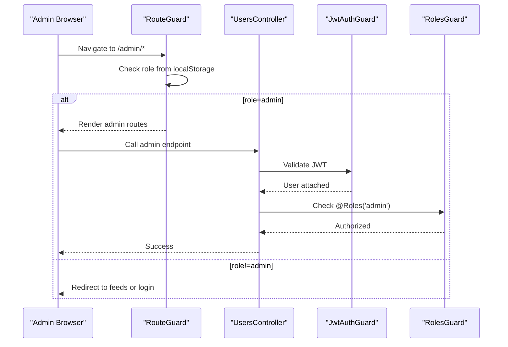
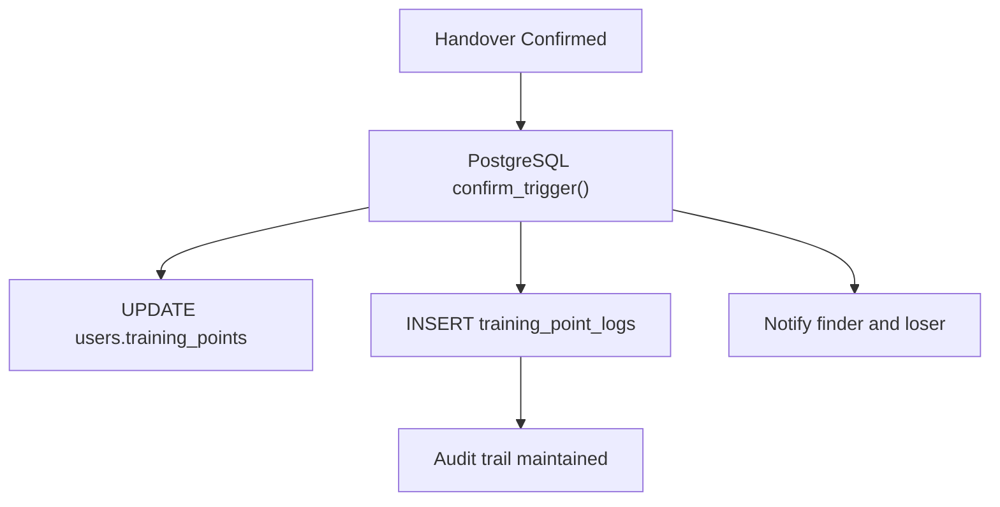
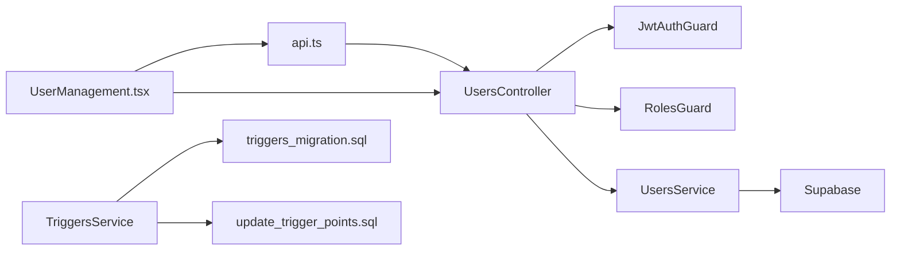

# User Management Interface

<cite>
**Referenced Files in This Document**
- [UserManagement.tsx](file://frontend/app/admin/user-management/UserManagement.tsx)
- [page.tsx](file://frontend/app/admin/user-management/page.tsx)
- [api.ts](file://frontend/app/lib/api.ts)
- [RouteGuard.tsx](file://frontend/app/components/RouteGuard.tsx)
- [useUserRole.ts](file://frontend/app/hooks/useUserRole.ts)
- [users.controller.ts](file://backend/src/modules/users/users.controller.ts)
- [users.service.ts](file://backend/src/modules/users/users.service.ts)
- [user.entity.ts](file://backend/src/modules/auth/entities/user.entity.ts)
- [jwt-auth.guard.ts](file://backend/src/common/guards/jwt-auth.guard.ts)
- [roles.guard.ts](file://backend/src/common/guards/roles.guard.ts)
- [roles.decorator.ts](file://backend/src/common/decorators/roles.decorator.ts)
- [current-user.decorator.ts](file://backend/src/common/decorators/current-user.decorator.ts)
- [triggers_migration.sql](file://backend/sql/triggers_migration.sql)
- [update_trigger_points.sql](file://backend/sql/update_trigger_points.sql)
- [triggers.service.ts](file://backend/src/modules/triggers/triggers.service.ts)
- [auth.service.ts](file://backend/src/modules/auth/auth.service.ts)
</cite>

## Table of Contents
1. [Introduction](#introduction)
2. [Project Structure](#project-structure)
3. [Core Components](#core-components)
4. [Architecture Overview](#architecture-overview)
5. [Detailed Component Analysis](#detailed-component-analysis)
6. [Dependency Analysis](#dependency-analysis)
7. [Performance Considerations](#performance-considerations)
8. [Troubleshooting Guide](#troubleshooting-guide)
9. [Conclusion](#conclusion)
10. [Appendices](#appendices)

## Introduction
This document describes the user management interface that enables administrators to control platform users. It covers the user listing system, sorting and pagination, role and status management, bulk operations, profile viewing capabilities, search and filtering, role-based access control, and administrative audit trails. It also explains the integration with the training points system, user activity monitoring, and compliance considerations for student accounts.

## Project Structure
The user management feature spans the frontend Next.js application and the NestJS backend:
- Frontend: Admin page renders a user table, handles actions, and paginates results.
- Backend: Admin endpoints expose user listing, status updates, and profile retrieval guarded by role checks.

**Diagram sources**
- [UserManagement.tsx:1-327](file://frontend/app/admin/user-management/UserManagement.tsx#L1-L327)
- [page.tsx:1-6](file://frontend/app/admin/user-management/page.tsx#L1-L6)
- [api.ts:1-83](file://frontend/app/lib/api.ts#L1-L83)
- [RouteGuard.tsx:1-58](file://frontend/app/components/RouteGuard.tsx#L1-L58)
- [useUserRole.ts:1-29](file://frontend/app/hooks/useUserRole.ts#L1-L29)
- [users.controller.ts:1-94](file://backend/src/modules/users/users.controller.ts#L1-L94)
- [users.service.ts:1-136](file://backend/src/modules/users/users.service.ts#L1-L136)
- [user.entity.ts:1-19](file://backend/src/modules/auth/entities/user.entity.ts#L1-L19)
- [jwt-auth.guard.ts:1-29](file://backend/src/common/guards/jwt-auth.guard.ts#L1-L29)
- [roles.guard.ts:1-28](file://backend/src/common/guards/roles.guard.ts#L1-L28)
- [roles.decorator.ts:1-5](file://backend/src/common/decorators/roles.decorator.ts#L1-L5)
- [current-user.decorator.ts:1-9](file://backend/src/common/decorators/current-user.decorator.ts#L1-L9)
- [triggers.service.ts:1-163](file://backend/src/modules/triggers/triggers.service.ts#L1-L163)
- [triggers_migration.sql:1-338](file://backend/sql/triggers_migration.sql#L1-L338)
- [update_trigger_points.sql:1-132](file://backend/sql/update_trigger_points.sql#L1-L132)
- [auth.service.ts:1-274](file://backend/src/modules/auth/auth.service.ts#L1-L274)

**Section sources**
- [UserManagement.tsx:1-327](file://frontend/app/admin/user-management/UserManagement.tsx#L1-L327)
- [users.controller.ts:1-94](file://backend/src/modules/users/users.controller.ts#L1-L94)
- [users.service.ts:1-136](file://backend/src/modules/users/users.service.ts#L1-L136)

## Core Components
- Admin user listing page: Renders a paginated table of users with role, status, training points, and registration date. Provides suspend/activate actions per row.
- API client: Centralized fetch wrapper that injects bearer tokens and credentials, handles 401 redirects, and parses JSON.
- Route guard: Enforces role-based routing so only admins can access admin routes.
- Backend controller: Exposes admin endpoints for listing users, suspending, and activating accounts, protected by JWT and roles guards.
- Backend service: Implements data access to Supabase, including user listing with ordering, status updates, and training-related queries.

Key capabilities:
- Sorting by registration date (newest first).
- Status management: active, suspended, pending_verify.
- Role management: admin, storage_staff, regular_user.
- Bulk-like operations: suspend/activate via PATCH endpoints.
- Profile viewing: endpoint to fetch user details for admin review.
- Training points integration: displays current points and logs for audit.

**Section sources**
- [UserManagement.tsx:22-45](file://frontend/app/admin/user-management/UserManagement.tsx#L22-L45)
- [api.ts:12-43](file://frontend/app/lib/api.ts#L12-L43)
- [RouteGuard.tsx:9-57](file://frontend/app/components/RouteGuard.tsx#L9-L57)
- [users.controller.ts:70-92](file://backend/src/modules/users/users.controller.ts#L70-L92)
- [users.service.ts:105-134](file://backend/src/modules/users/users.service.ts#L105-L134)

## Architecture Overview
The admin user management flow integrates frontend UI actions with backend endpoints secured by authentication and authorization guards.

**Diagram sources**
- [UserManagement.tsx:28-70](file://frontend/app/admin/user-management/UserManagement.tsx#L28-L70)
- [api.ts:12-43](file://frontend/app/lib/api.ts#L12-L43)
- [users.controller.ts:70-92](file://backend/src/modules/users/users.controller.ts#L70-L92)
- [users.service.ts:105-134](file://backend/src/modules/users/users.service.ts#L105-L134)
- [jwt-auth.guard.ts:1-29](file://backend/src/common/guards/jwt-auth.guard.ts#L1-L29)
- [roles.guard.ts:1-28](file://backend/src/common/guards/roles.guard.ts#L1-L28)

## Detailed Component Analysis

### Frontend: User Management Page
- Responsibilities:
  - Fetch users with pagination.
  - Display summary statistics (total, active, suspended, pending).
  - Render user rows with role badges, status badges, training points, and registration date.
  - Provide suspend/activate actions with confirmation and loading states.
  - Paginate across pages and reflect meta information.
- Data model:
  - UserRow fields include id, full_name, email, role, status, training_points, created_at.
  - Meta includes page, limit, total.
- Actions:
  - Suspend: PATCH /admin/users/:id/suspend.
  - Activate: PATCH /admin/users/:id/activate.

**Diagram sources**
- [UserManagement.tsx:28-70](file://frontend/app/admin/user-management/UserManagement.tsx#L28-L70)

**Section sources**
- [UserManagement.tsx:22-327](file://frontend/app/admin/user-management/UserManagement.tsx#L22-L327)

### Backend: Users Controller and Service
- Endpoints:
  - GET /admin/users: List users with pagination and total count.
  - PATCH /admin/users/:id/suspend: Suspend user.
  - PATCH /admin/users/:id/activate: Activate user.
  - GET /users/:id: View user details (admin-only).
- Guards and decorators:
  - JwtAuthGuard: Ensures valid JWT.
  - RolesGuard + @Roles('admin'): Restricts endpoints to admin.
  - @CurrentUser: Injects user object into request.
- Service logic:
  - findAll: Orders by created_at descending, supports pagination.
  - updateStatus: Updates status and returns updated record.
  - Additional training-related endpoints exist for personal profiles.

**Diagram sources**
- [users.controller.ts:1-94](file://backend/src/modules/users/users.controller.ts#L1-L94)
- [users.service.ts:1-136](file://backend/src/modules/users/users.service.ts#L1-L136)
- [jwt-auth.guard.ts:1-29](file://backend/src/common/guards/jwt-auth.guard.ts#L1-L29)
- [roles.guard.ts:1-28](file://backend/src/common/guards/roles.guard.ts#L1-L28)
- [roles.decorator.ts:1-5](file://backend/src/common/decorators/roles.decorator.ts#L1-L5)
- [current-user.decorator.ts:1-9](file://backend/src/common/decorators/current-user.decorator.ts#L1-L9)

**Section sources**
- [users.controller.ts:70-92](file://backend/src/modules/users/users.controller.ts#L70-L92)
- [users.service.ts:105-134](file://backend/src/modules/users/users.service.ts#L105-L134)

### Role-Based Access Control (RBAC)
- Authentication:
  - JwtAuthGuard enforces JWT presence and validity.
- Authorization:
  - RolesGuard checks required roles metadata set by @Roles('admin').
  - CurrentUser decorator extracts user from request for use in handlers.
- Routing enforcement:
  - RouteGuard restricts access to /admin routes for admin users only and prevents non-admins from accessing admin areas.

**Diagram sources**
- [RouteGuard.tsx:9-57](file://frontend/app/components/RouteGuard.tsx#L9-L57)
- [jwt-auth.guard.ts:1-29](file://backend/src/common/guards/jwt-auth.guard.ts#L1-L29)
- [roles.guard.ts:1-28](file://backend/src/common/guards/roles.guard.ts#L1-L28)
- [roles.decorator.ts:1-5](file://backend/src/common/decorators/roles.decorator.ts#L1-L5)
- [current-user.decorator.ts:1-9](file://backend/src/common/decorators/current-user.decorator.ts#L1-L9)

**Section sources**
- [RouteGuard.tsx:9-57](file://frontend/app/components/RouteGuard.tsx#L9-L57)
- [jwt-auth.guard.ts:1-29](file://backend/src/common/guards/jwt-auth.guard.ts#L1-L29)
- [roles.guard.ts:1-28](file://backend/src/common/guards/roles.guard.ts#L1-L28)
- [roles.decorator.ts:1-5](file://backend/src/common/decorators/roles.decorator.ts#L1-L5)
- [current-user.decorator.ts:1-9](file://backend/src/common/decorators/current-user.decorator.ts#L1-L9)

### Training Points Integration and Audit Trails
- Training points display:
  - Users listing shows training_points per user.
  - Personal training score and history endpoints exist for users.
- Audit trail:
  - Training point logs capture reason, points delta, and balance after each event.
  - Logs are ordered by created_at descending for auditability.
- Trigger-based point awards:
  - PostgreSQL functions award points to the finder upon successful handover confirmation.
  - Logs are inserted atomically with notifications and post closure.

**Diagram sources**
- [triggers_migration.sql:150-259](file://backend/sql/triggers_migration.sql#L150-L259)
- [update_trigger_points.sql:10-131](file://backend/sql/update_trigger_points.sql#L10-L131)
- [users.service.ts:61-68](file://backend/src/modules/users/users.service.ts#L61-L68)

**Section sources**
- [UserManagement.tsx:236-238](file://frontend/app/admin/user-management/UserManagement.tsx#L236-L238)
- [users.service.ts:61-103](file://backend/src/modules/users/users.service.ts#L61-L103)
- [triggers_migration.sql:150-259](file://backend/sql/triggers_migration.sql#L150-L259)
- [update_trigger_points.sql:10-131](file://backend/sql/update_trigger_points.sql#L10-L131)

### Compliance Considerations for Student Accounts
- Account lifecycle:
  - Registration sets default role and status.
  - Login checks status and denies suspended or pending users.
- Email verification:
  - Verification transitions status to active and records verification timestamp.
- Suspensions:
  - Admins can suspend accounts; suspended users are blocked from logging in.

**Section sources**
- [auth.service.ts:22-69](file://backend/src/modules/auth/auth.service.ts#L22-L69)
- [auth.service.ts:72-110](file://backend/src/modules/auth/auth.service.ts#L72-L110)
- [auth.service.ts:181-208](file://backend/src/modules/auth/auth.service.ts#L181-L208)

## Dependency Analysis
- Frontend depends on:
  - api.ts for HTTP requests with bearer tokens and credentials.
  - RouteGuard and useUserRole for runtime role checks and navigation.
- Backend depends on:
  - JwtAuthGuard and RolesGuard for protection.
  - Supabase client for data access.
  - PostgreSQL triggers and functions for training point automation.

**Diagram sources**
- [UserManagement.tsx:1-327](file://frontend/app/admin/user-management/UserManagement.tsx#L1-L327)
- [api.ts:1-83](file://frontend/app/lib/api.ts#L1-L83)
- [users.controller.ts:1-94](file://backend/src/modules/users/users.controller.ts#L1-L94)
- [users.service.ts:1-136](file://backend/src/modules/users/users.service.ts#L1-L136)
- [jwt-auth.guard.ts:1-29](file://backend/src/common/guards/jwt-auth.guard.ts#L1-L29)
- [roles.guard.ts:1-28](file://backend/src/common/guards/roles.guard.ts#L1-L28)
- [triggers.service.ts:1-163](file://backend/src/modules/triggers/triggers.service.ts#L1-L163)
- [triggers_migration.sql:1-338](file://backend/sql/triggers_migration.sql#L1-L338)
- [update_trigger_points.sql:1-132](file://backend/sql/update_trigger_points.sql#L1-L132)

**Section sources**
- [users.controller.ts:1-94](file://backend/src/modules/users/users.controller.ts#L1-L94)
- [users.service.ts:1-136](file://backend/src/modules/users/users.service.ts#L1-L136)

## Performance Considerations
- Pagination: Backend limits results per page and returns total count for efficient rendering.
- Sorting: Users are sorted by created_at descending to prioritize recent registrations.
- Parallel queries: Training score endpoint aggregates user profile, logs, and trigger counts concurrently.
- Database indexing: Triggers table includes indexes supporting status and expiration checks.

Recommendations:
- Add indexes for frequent filters (e.g., status, role).
- Consider caching user lists for admin dashboards if traffic is high.
- Monitor trigger cron job performance for expired pending triggers.

**Section sources**
- [users.service.ts:105-134](file://backend/src/modules/users/users.service.ts#L105-L134)
- [triggers_migration.sql:48-57](file://backend/sql/triggers_migration.sql#L48-L57)
- [triggers.service.ts:140-161](file://backend/src/modules/triggers/triggers.service.ts#L140-L161)

## Troubleshooting Guide
Common issues and resolutions:
- Unauthorized access:
  - Symptom: 401 errors or redirect to login.
  - Cause: Missing or invalid JWT, or insufficient permissions.
  - Resolution: Ensure login, verify token presence, and confirm admin role.
- Forbidden access:
  - Symptom: 403 errors when accessing admin routes.
  - Cause: Non-admin user attempting admin endpoint.
  - Resolution: RouteGuard enforces admin-only access.
- Suspend/activate failures:
  - Symptom: Action fails with error.
  - Cause: User not found or database error.
  - Resolution: Confirm user exists and retry; check backend logs.
- Training points discrepancies:
  - Symptom: Discrepancies between user list and personal score.
  - Cause: Logs may reflect recent changes not yet reflected in cached views.
  - Resolution: Refresh views and verify training_point_logs.

**Section sources**
- [api.ts:30-43](file://frontend/app/lib/api.ts#L30-L43)
- [RouteGuard.tsx:16-57](file://frontend/app/components/RouteGuard.tsx#L16-L57)
- [users.controller.ts:78-92](file://backend/src/modules/users/users.controller.ts#L78-L92)
- [users.service.ts:124-134](file://backend/src/modules/users/users.service.ts#L124-L134)

## Conclusion
The user management interface provides administrators with a secure, efficient way to monitor and manage platform users. It integrates role-based access control, training points auditing, and compliance safeguards for student accounts. The design balances usability with robust backend protections and clear audit trails.

## Appendices

### Administrative Workflows and Examples
- User listing and sorting:
  - Load page to fetch users ordered by registration date.
  - Use pagination controls to navigate across pages.
- Role assignment:
  - Not implemented in the referenced code; admin endpoints support listing, status changes, and profile retrieval.
- Account status management:
  - Suspend: Navigate to user row and click suspend; confirm dialog; observe status badge change after refresh.
  - Activate: Same flow for activation.
- Bulk operations:
  - No dedicated bulk endpoint; suspend/activate performed per user via individual actions.
- User profile viewing:
  - Use GET /users/:id (admin) to retrieve user details including training points and registration date.
- Search and filtering:
  - No search/filter UI implemented in the user management page; future enhancements could add filters by role/status or search by name/email.
- Training points system:
  - Training logs show reasons and balances; trigger-based awards occur automatically upon successful handovers.
- Activity monitoring:
  - Training score endpoint aggregates recent logs and total handovers for user activity insights.
- Compliance with university regulations:
  - Pending verification and suspended statuses prevent unauthorized access; email verification transitions accounts to active.

**Section sources**
- [UserManagement.tsx:47-70](file://frontend/app/admin/user-management/UserManagement.tsx#L47-L70)
- [users.controller.ts:62-92](file://backend/src/modules/users/users.controller.ts#L62-L92)
- [users.service.ts:61-103](file://backend/src/modules/users/users.service.ts#L61-L103)
- [triggers_migration.sql:150-259](file://backend/sql/triggers_migration.sql#L150-L259)
- [update_trigger_points.sql:10-131](file://backend/sql/update_trigger_points.sql#L10-L131)
- [auth.service.ts:86-91](file://backend/src/modules/auth/auth.service.ts#L86-L91)