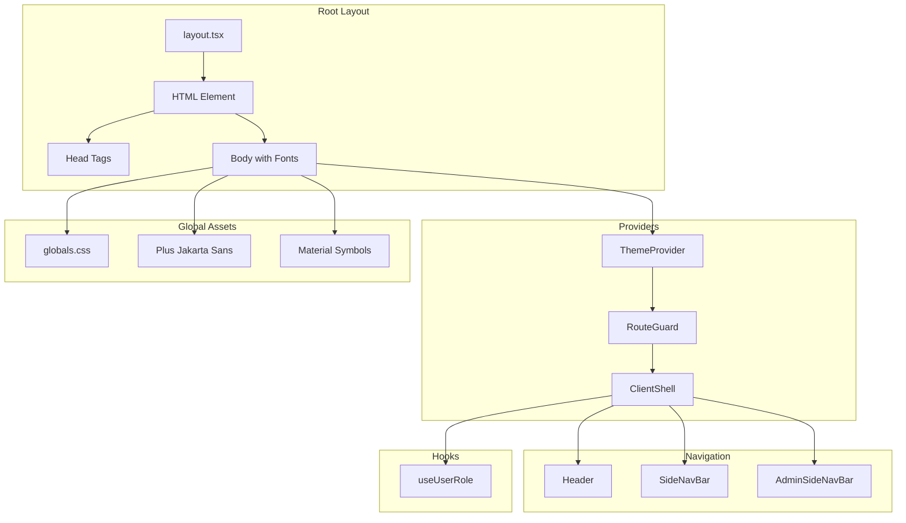
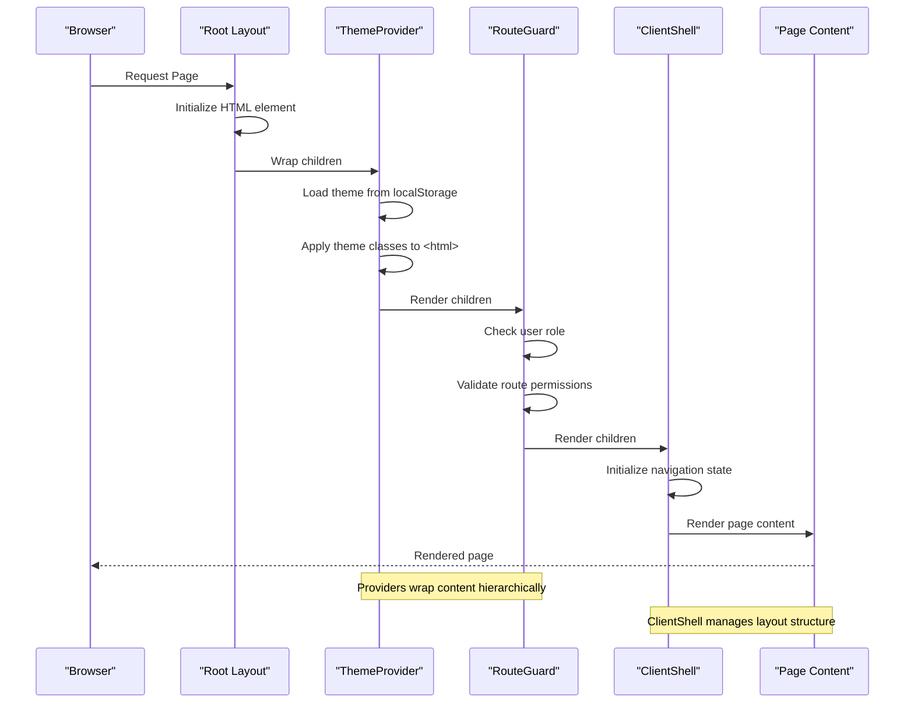
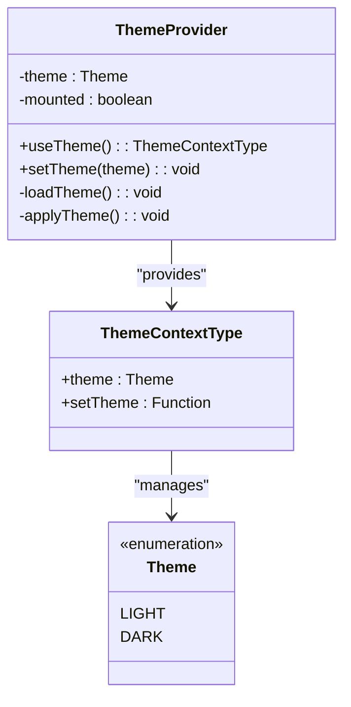
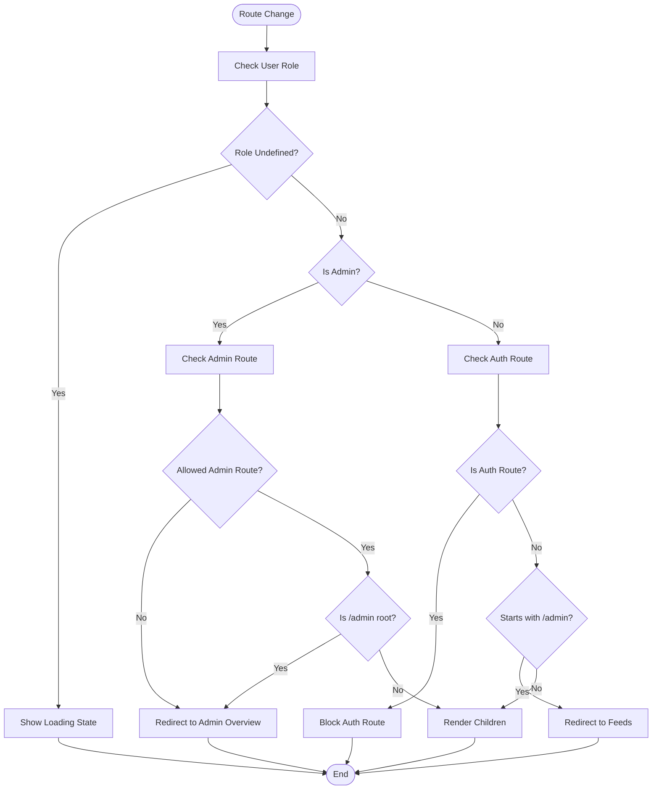
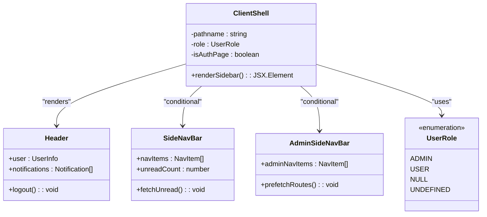
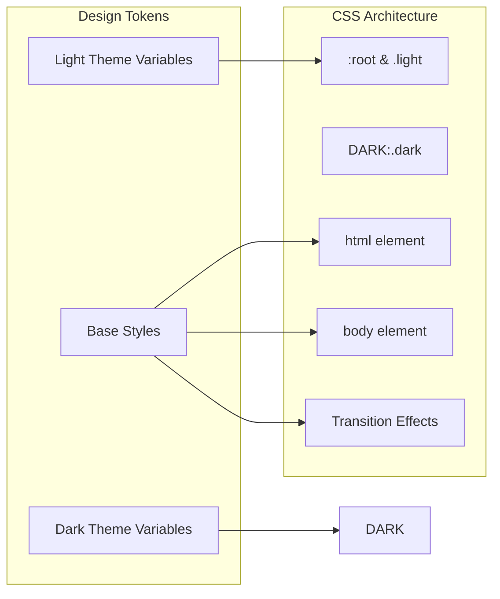

# Application Shell

<cite>
**Referenced Files in This Document**
- [layout.tsx](file://frontend/app/layout.tsx)
- [ThemeProvider.tsx](file://frontend/app/components/ThemeProvider.tsx)
- [RouteGuard.tsx](file://frontend/app/components/RouteGuard.tsx)
- [ClientShell.tsx](file://frontend/app/components/ClientShell.tsx)
- [Header.tsx](file://frontend/app/components/Header.tsx)
- [SideNavBar.tsx](file://frontend/app/components/SideNavBar.tsx)
- [AdminSideNavBar.tsx](file://frontend/app/components/AdminSideNavBar.tsx)
- [useUserRole.ts](file://frontend/app/hooks/useUserRole.ts)
- [globals.css](file://frontend/app/globals.css)
- [auth/layout.tsx](file://frontend/app/auth/layout.tsx)
- [next.config.ts](file://frontend/next.config.ts)
- [package.json](file://frontend/package.json)
</cite>

## Table of Contents
1. [Introduction](#introduction)
2. [Project Structure](#project-structure)
3. [Core Components](#core-components)
4. [Architecture Overview](#architecture-overview)
5. [Detailed Component Analysis](#detailed-component-analysis)
6. [Dependency Analysis](#dependency-analysis)
7. [Performance Considerations](#performance-considerations)
8. [Troubleshooting Guide](#troubleshooting-guide)
9. [Conclusion](#conclusion)

## Introduction

The MissLost frontend application shell serves as the foundational framework for the Next.js application, establishing the root layout structure, provider hierarchy, and global configuration setup. This shell creates a cohesive user experience through carefully orchestrated components that handle theme management, authentication protection, client-side hydration, and responsive navigation.

The application follows modern React patterns with a focus on performance, accessibility, and user experience. It leverages Next.js App Router capabilities while maintaining a clean separation of concerns through its provider-based architecture.

## Project Structure

The frontend application follows Next.js App Router conventions with a well-organized structure that separates concerns effectively:



**Diagram sources**
- [layout.tsx:19-43](file://frontend/app/layout.tsx#L19-L43)
- [globals.css:1-121](file://frontend/app/globals.css#L1-L121)

**Section sources**
- [layout.tsx:1-44](file://frontend/app/layout.tsx#L1-L44)
- [package.json:1-29](file://frontend/package.json#L1-L29)

## Core Components

The application shell consists of four primary components that form the foundation of the user interface:

### ThemeProvider
Manages light/dark mode switching with persistent storage and smooth transitions. Implements a sophisticated hydration strategy to prevent flash-of-unstyled-content (FOUC) by rendering hidden content until theme resolution completes.

### RouteGuard
Enforces authentication and authorization policies, redirecting users based on their roles and preventing unauthorized access to protected routes. Handles complex routing logic for both general users and administrators.

### ClientShell
Provides client-side hydration and manages the overall application layout, including header, navigation, and content areas. Implements role-aware navigation with dynamic sidebar selection.

### Global Styling System
Establishes a comprehensive design token system with CSS custom properties that adapt to both light and dark themes, ensuring consistent visual design across all components.

**Section sources**
- [ThemeProvider.tsx:1-56](file://frontend/app/components/ThemeProvider.tsx#L1-L56)
- [RouteGuard.tsx:1-58](file://frontend/app/components/RouteGuard.tsx#L1-L58)
- [ClientShell.tsx:1-43](file://frontend/app/components/ClientShell.tsx#L1-L43)
- [globals.css:1-121](file://frontend/app/globals.css#L1-L121)

## Architecture Overview

The application shell implements a hierarchical provider pattern that ensures proper component initialization order and state management:



**Diagram sources**
- [layout.tsx:24-39](file://frontend/app/layout.tsx#L24-L39)
- [ThemeProvider.tsx:21-55](file://frontend/app/components/ThemeProvider.tsx#L21-L55)
- [RouteGuard.tsx:9-57](file://frontend/app/components/RouteGuard.tsx#L9-L57)
- [ClientShell.tsx:10-42](file://frontend/app/components/ClientShell.tsx#L10-L42)

The architecture ensures that:

1. **Theme Resolution**: Occurs before any UI rendering to prevent visual flashes
2. **Authentication Validation**: Happens before content rendering for security
3. **Client Hydration**: Provides proper layout structure with navigation
4. **Role-Based Access**: Enforces permissions at the routing level

## Detailed Component Analysis

### ThemeProvider Implementation

The ThemeProvider component implements a robust theme management system with the following key features:



**Diagram sources**
- [ThemeProvider.tsx:5-19](file://frontend/app/components/ThemeProvider.tsx#L5-L19)
- [ThemeProvider.tsx:21-55](file://frontend/app/components/ThemeProvider.tsx#L21-L55)

Key implementation patterns include:

- **Local Storage Persistence**: Theme preferences are saved between sessions
- **Hydration Protection**: Prevents FOUC through conditional rendering
- **DOM Class Management**: Applies theme classes to the root HTML element
- **Context API Pattern**: Provides theme state throughout the component tree

**Section sources**
- [ThemeProvider.tsx:1-56](file://frontend/app/components/ThemeProvider.tsx#L1-L56)

### RouteGuard Authentication System

The RouteGuard component enforces comprehensive access control with role-based routing:



**Diagram sources**
- [RouteGuard.tsx:16-40](file://frontend/app/components/RouteGuard.tsx#L16-L40)
- [RouteGuard.tsx:47-56](file://frontend/app/components/RouteGuard.tsx#L47-L56)

**Section sources**
- [RouteGuard.tsx:1-58](file://frontend/app/components/RouteGuard.tsx#L1-L58)

### ClientShell Layout Manager

The ClientShell component orchestrates the application's layout structure with intelligent role-based navigation:



**Diagram sources**
- [ClientShell.tsx:10-42](file://frontend/app/components/ClientShell.tsx#L10-L42)
- [Header.tsx:14-265](file://frontend/app/components/Header.tsx#L14-L265)
- [SideNavBar.tsx:18-151](file://frontend/app/components/SideNavBar.tsx#L18-L151)
- [AdminSideNavBar.tsx:13-119](file://frontend/app/components/AdminSideNavBar.tsx#L13-L119)

**Section sources**
- [ClientShell.tsx:1-43](file://frontend/app/components/ClientShell.tsx#L1-L43)

### Global CSS and Design System

The application implements a comprehensive design token system through CSS custom properties:



**Diagram sources**
- [globals.css:12-93](file://frontend/app/globals.css#L12-L93)
- [globals.css:96-121](file://frontend/app/globals.css#L96-L121)

**Section sources**
- [globals.css:1-121](file://frontend/app/globals.css#L1-L121)

## Dependency Analysis

The application shell demonstrates excellent dependency management with clear separation of concerns:

```mermaid
graph TB
subgraph "Runtime Dependencies"
NEXT[Next.js 16.2.3]
REACT[React 19.2.4]
TAILWIND[Tailwind CSS 4]
SUPABASE[@supabase/supabase-js 2.103.0]
end
subgraph "Application Dependencies"
THEME[ThemeProvider]
GUARD[RouteGuard]
SHELL[ClientShell]
HEADER[Header]
NAV[SideNavBar]
ADMINNAV[AdminSideNavBar]
ROLE[useUserRole]
CSS[globals.css]
end
subgraph "Development Dependencies"
ESLINT[ESLint 9]
TYPESCRIPT[TypeScript 5]
POSTCSS[PostCSS]
end
NEXT --> THEME
NEXT --> GUARD
NEXT --> SHELL
REACT --> HEADER
REACT --> NAV
REACT --> ADMINNAV
TAILWIND --> CSS
SUPABASE --> HEADER
SUPABASE --> NAV
ESLINT --> THEME
TYPESCRIPT --> SHELL
POSTCSS --> CSS
```

**Diagram sources**
- [package.json:11-28](file://frontend/package.json#L11-L28)

**Section sources**
- [package.json:1-29](file://frontend/package.json#L1-L29)

## Performance Considerations

The application shell incorporates several performance optimization strategies:

### Client-Side Hydration Optimization
- **Conditional Rendering**: RouteGuard prevents unnecessary component rendering during redirects
- **Lazy Loading**: Navigation components are loaded only when needed based on user roles
- **Prefetching**: Strategic route prefetching improves navigation performance

### Theme Management Efficiency
- **LocalStorage Caching**: Theme preferences are cached locally to avoid repeated calculations
- **DOM Class Management**: Efficient theme application through CSS class manipulation
- **SSR Compatibility**: Theme resolution works seamlessly with server-side rendering

### Memory Management
- **Cleanup Functions**: Proper event listener cleanup in useEffect hooks
- **Interval Management**: Timed operations are properly cleaned up
- **Conditional State Updates**: State updates only occur when necessary

## Troubleshooting Guide

### Common Issues and Solutions

**Theme Not Persisting**
- Verify localStorage availability in browser
- Check for theme context provider wrapping
- Ensure proper hydration timing

**Route Guard Blocking Issues**
- Confirm user role is properly stored in localStorage
- Verify authentication tokens are present
- Check for infinite redirect loops

**Navigation Not Showing**
- Ensure user role is properly detected
- Verify pathname matching logic
- Check for component loading states

**Styling Issues**
- Verify CSS custom properties are defined
- Check Tailwind configuration
- Ensure proper font loading

**Section sources**
- [ThemeProvider.tsx:25-41](file://frontend/app/components/ThemeProvider.tsx#L25-L41)
- [RouteGuard.tsx:16-40](file://frontend/app/components/RouteGuard.tsx#L16-L40)
- [ClientShell.tsx:26-30](file://frontend/app/components/ClientShell.tsx#L26-L30)

## Conclusion

The MissLost application shell represents a well-architected foundation that successfully balances functionality, performance, and maintainability. Through its hierarchical provider pattern, comprehensive theme management, robust authentication system, and thoughtful layout architecture, it establishes a solid foundation for the entire application ecosystem.

The implementation demonstrates modern React patterns with Next.js App Router, providing a scalable and extensible base for future development. The careful attention to user experience, particularly around hydration timing and navigation flow, ensures a smooth and intuitive user interface.

Key strengths of the implementation include:
- Clean separation of concerns through provider architecture
- Comprehensive role-based access control
- Efficient theme management with persistence
- Responsive design system with CSS custom properties
- Performance optimizations throughout the component hierarchy

This foundation provides an excellent starting point for developing the full MissLost application while maintaining consistency and scalability across all features and user interactions.