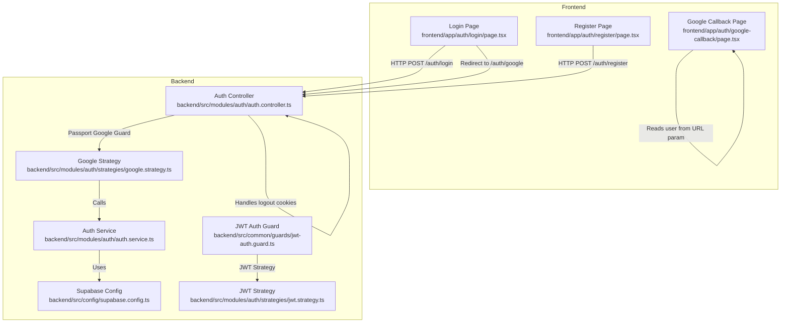
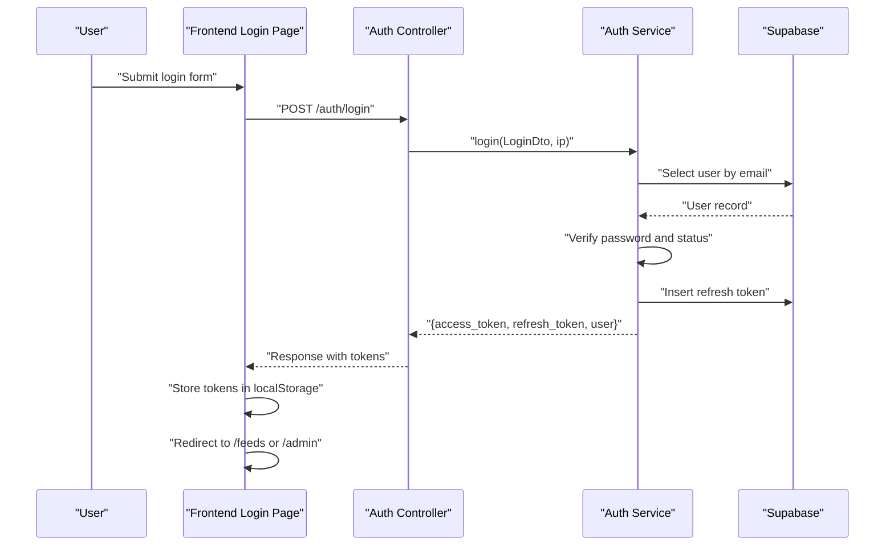
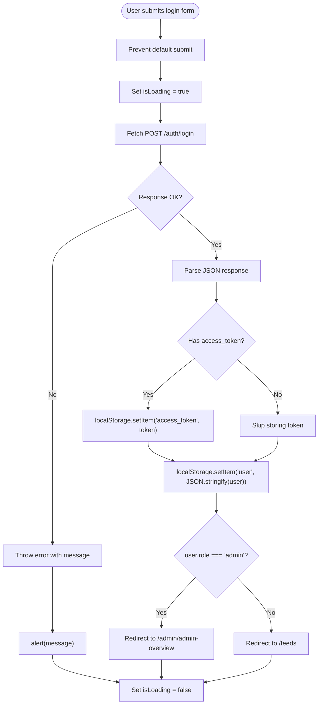
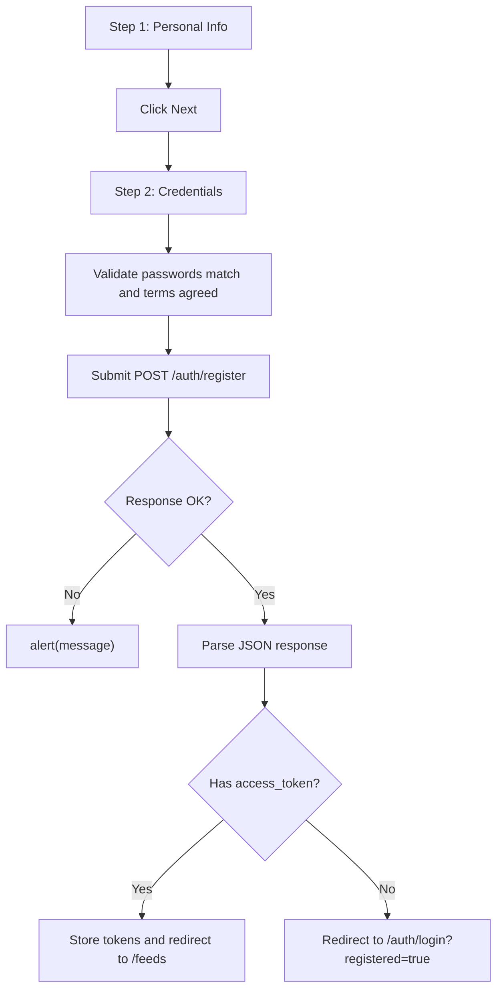
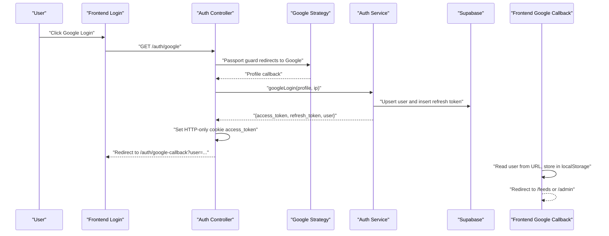
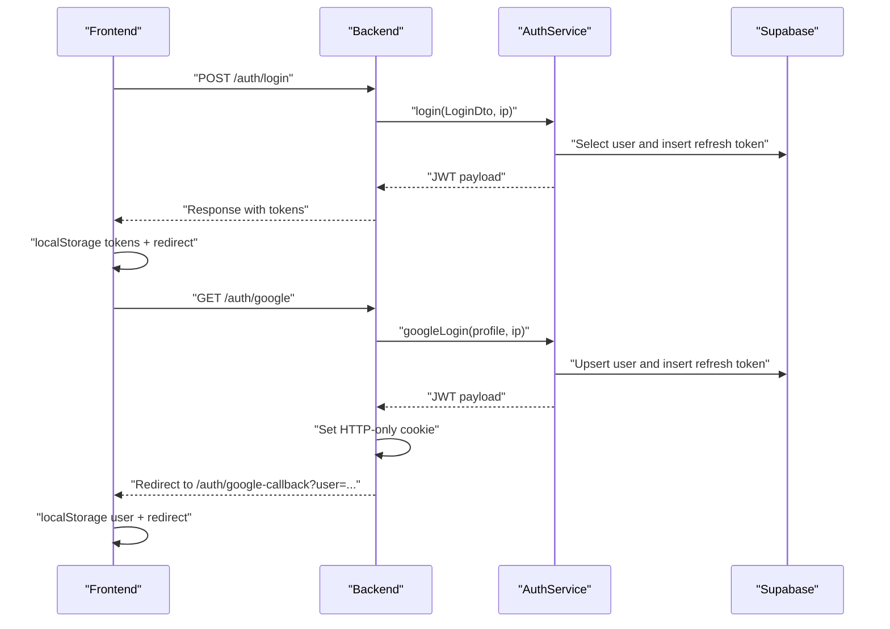
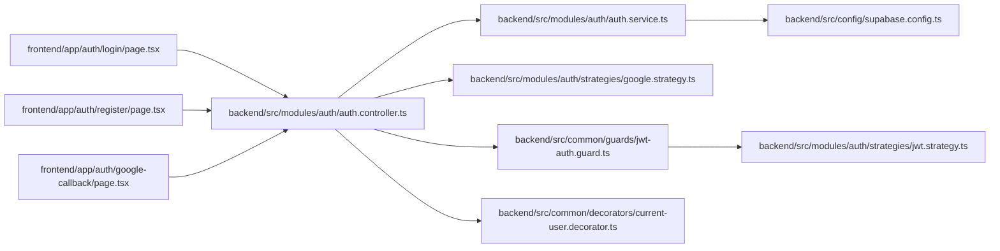

# Authentication Pages

<cite>
**Referenced Files in This Document**
- [auth.controller.ts](file://backend/src/modules/auth/auth.controller.ts)
- [auth.service.ts](file://backend/src/modules/auth/auth.service.ts)
- [login.dto.ts](file://backend/src/modules/auth/dto/login.dto.ts)
- [register.dto.ts](file://backend/src/modules/auth/dto/register.dto.ts)
- [google.strategy.ts](file://backend/src/modules/auth/strategies/google.strategy.ts)
- [jwt.strategy.ts](file://backend/src/modules/auth/strategies/jwt.strategy.ts)
- [jwt-auth.guard.ts](file://backend/src/common/guards/jwt-auth.guard.ts)
- [current-user.decorator.ts](file://backend/src/common/decorators/current-user.decorator.ts)
- [supabase.config.ts](file://backend/src/config/supabase.config.ts)
- [login/page.tsx](file://frontend/app/auth/login/page.tsx)
- [register/page.tsx](file://frontend/app/auth/register/page.tsx)
- [google-callback/page.tsx](file://frontend/app/auth/google-callback/page.tsx)
- [GOOGLE_OAUTH_SETUP.md](file://GOOGLE_OAUTH_SETUP.md)
</cite>

## Table of Contents
1. [Introduction](#introduction)
2. [Project Structure](#project-structure)
3. [Core Components](#core-components)
4. [Architecture Overview](#architecture-overview)
5. [Detailed Component Analysis](#detailed-component-analysis)
6. [Dependency Analysis](#dependency-analysis)
7. [Performance Considerations](#performance-considerations)
8. [Troubleshooting Guide](#troubleshooting-guide)
9. [Conclusion](#conclusion)

## Introduction
This document explains the authentication system for the MissLost application, focusing on the login and registration forms, Google OAuth integration, and the end-to-end authentication flow. It covers form validation patterns, error handling, redirects, session management, and security considerations. The backend is built with NestJS and uses Supabase for persistence, while the frontend is a Next.js application that communicates with the backend via REST and handles OAuth callbacks.

## Project Structure
The authentication system spans two primary areas:
- Backend (NestJS): Controllers, services, DTOs, strategies, guards, and Supabase configuration.
- Frontend (Next.js): Login, registration, and Google OAuth callback pages.

**Diagram sources**
- [auth.controller.ts:28-127](file://backend/src/modules/auth/auth.controller.ts#L28-L127)
- [auth.service.ts:18-274](file://backend/src/modules/auth/auth.service.ts#L18-L274)
- [google.strategy.ts:7-38](file://backend/src/modules/auth/strategies/google.strategy.ts#L7-L38)
- [jwt.strategy.ts:17-40](file://backend/src/modules/auth/strategies/jwt.strategy.ts#L17-L40)
- [jwt-auth.guard.ts:7-29](file://backend/src/common/guards/jwt-auth.guard.ts#L7-L29)
- [supabase.config.ts:7-25](file://backend/src/config/supabase.config.ts#L7-L25)
- [login/page.tsx:6-208](file://frontend/app/auth/login/page.tsx#L6-L208)
- [register/page.tsx:6-359](file://frontend/app/auth/register/page.tsx#L6-L359)
- [google-callback/page.tsx:5-78](file://frontend/app/auth/google-callback/page.tsx#L5-L78)

**Section sources**
- [auth.controller.ts:28-127](file://backend/src/modules/auth/auth.controller.ts#L28-L127)
- [auth.service.ts:18-274](file://backend/src/modules/auth/auth.service.ts#L18-L274)
- [google.strategy.ts:7-38](file://backend/src/modules/auth/strategies/google.strategy.ts#L7-L38)
- [jwt.strategy.ts:17-40](file://backend/src/modules/auth/strategies/jwt.strategy.ts#L17-L40)
- [jwt-auth.guard.ts:7-29](file://backend/src/common/guards/jwt-auth.guard.ts#L7-L29)
- [supabase.config.ts:7-25](file://backend/src/config/supabase.config.ts#L7-L25)
- [login/page.tsx:6-208](file://frontend/app/auth/login/page.tsx#L6-L208)
- [register/page.tsx:6-359](file://frontend/app/auth/register/page.tsx#L6-L359)
- [google-callback/page.tsx:5-78](file://frontend/app/auth/google-callback/page.tsx#L5-L78)

## Core Components
- Login form: Validates email and password, submits to backend, stores access token, and redirects based on role.
- Registration form: Multi-step form collecting personal info and credentials, validates inputs, and either auto-logins or redirects to login.
- Google OAuth: Redirects users to backend Google endpoint, receives callback, sets cookie on backend, and reads user from URL param to finalize login.
- Backend controller: Exposes endpoints for register, login, logout, email verification, forgot/reset password, and Google OAuth routes.
- Backend service: Implements business logic for registration, login, Google login, logout, and password reset flows.
- Strategies: Passport Google and JWT strategies for OAuth profile handling and JWT validation.
- Guards and decorators: JWT guard and current-user decorator for protected routes and user injection.
- Supabase integration: Centralized client creation and usage for database operations.

**Section sources**
- [login/page.tsx:6-208](file://frontend/app/auth/login/page.tsx#L6-L208)
- [register/page.tsx:6-359](file://frontend/app/auth/register/page.tsx#L6-L359)
- [google-callback/page.tsx:5-78](file://frontend/app/auth/google-callback/page.tsx#L5-L78)
- [auth.controller.ts:28-127](file://backend/src/modules/auth/auth.controller.ts#L28-L127)
- [auth.service.ts:18-274](file://backend/src/modules/auth/auth.service.ts#L18-L274)
- [google.strategy.ts:7-38](file://backend/src/modules/auth/strategies/google.strategy.ts#L7-L38)
- [jwt.strategy.ts:17-40](file://backend/src/modules/auth/strategies/jwt.strategy.ts#L17-L40)
- [jwt-auth.guard.ts:7-29](file://backend/src/common/guards/jwt-auth.guard.ts#L7-L29)
- [current-user.decorator.ts:3-9](file://backend/src/common/decorators/current-user.decorator.ts#L3-L9)
- [supabase.config.ts:7-25](file://backend/src/config/supabase.config.ts#L7-L25)

## Architecture Overview
The authentication flow consists of:
- Frontend pages submit requests to backend endpoints.
- Backend validates DTOs, checks user status, generates JWTs, and persists refresh tokens.
- Google OAuth uses Passport strategies to obtain profile data and sign in users.
- Session management uses HTTP-only cookies for tokens and localStorage for user metadata on the frontend.

**Diagram sources**
- [auth.controller.ts:42-44](file://backend/src/modules/auth/auth.controller.ts#L42-L44)
- [auth.service.ts:72-110](file://backend/src/modules/auth/auth.service.ts#L72-L110)
- [login/page.tsx:12-51](file://frontend/app/auth/login/page.tsx#L12-L51)

## Detailed Component Analysis

### Login Form Implementation
- Validation pattern: Uses HTML5 inputs and controlled React state to manage email and password. On submit, prevents default, sets loading state, posts to backend, and parses response.
- Error handling: Checks response.ok; on failure, throws an error with a message and alerts the user.
- Redirect mechanism: After successful login, stores access token and user in localStorage and redirects to feeds or admin based on role.
- Loading states: Disables submit button and shows spinner during network request.

**Diagram sources**
- [login/page.tsx:12-51](file://frontend/app/auth/login/page.tsx#L12-L51)

**Section sources**
- [login/page.tsx:6-208](file://frontend/app/auth/login/page.tsx#L6-L208)
- [login.dto.ts:4-12](file://backend/src/modules/auth/dto/login.dto.ts#L4-L12)
- [auth.controller.ts:42-44](file://backend/src/modules/auth/auth.controller.ts#L42-L44)
- [auth.service.ts:72-110](file://backend/src/modules/auth/auth.service.ts#L72-L110)

### Registration Form Implementation
- Multi-step form: Personal info on step 1, credentials on step 2. Controlled state updates for all fields.
- Validation patterns: Enforces min/max lengths, confirms passwords match, and ensures terms agreement. Password strength visualization is shown.
- Submission handling: Posts to backend register endpoint; on success, either auto-logins (if backend returns tokens) or redirects to login with a success flag.
- Error handling: Displays error messages from backend and disables submit when validation fails.

**Diagram sources**
- [register/page.tsx:25-69](file://frontend/app/auth/register/page.tsx#L25-L69)
- [register.dto.ts:4-29](file://backend/src/modules/auth/dto/register.dto.ts#L4-L29)
- [auth.controller.ts:34-36](file://backend/src/modules/auth/auth.controller.ts#L34-L36)
- [auth.service.ts:22-69](file://backend/src/modules/auth/auth.service.ts#L22-L69)

**Section sources**
- [register/page.tsx:6-359](file://frontend/app/auth/register/page.tsx#L6-L359)
- [register.dto.ts:4-29](file://backend/src/modules/auth/dto/register.dto.ts#L4-L29)
- [auth.controller.ts:31-36](file://backend/src/modules/auth/auth.controller.ts#L31-L36)
- [auth.service.ts:22-69](file://backend/src/modules/auth/auth.service.ts#L22-L69)

### Google OAuth Callback Handling
- Frontend initiation: Clicking “Login with Google” navigates to backend Google endpoint.
- Backend flow: Passport Google strategy authenticates and calls the callback handler. The backend:
  - Handles OAuth errors from query parameters.
  - Calls service to upsert user and generate tokens.
  - Sets HTTP-only cookie for access token and redirects to frontend callback page with user data in URL.
- Frontend callback: Reads user from URL, stores in localStorage, and redirects based on role. Displays an error page if missing user or error present.

**Diagram sources**
- [auth.controller.ts:85-126](file://backend/src/modules/auth/auth.controller.ts#L85-L126)
- [google.strategy.ts:17-36](file://backend/src/modules/auth/strategies/google.strategy.ts#L17-L36)
- [auth.service.ts:113-167](file://backend/src/modules/auth/auth.service.ts#L113-L167)
- [google-callback/page.tsx:8-43](file://frontend/app/auth/google-callback/page.tsx#L8-L43)

**Section sources**
- [auth.controller.ts:85-126](file://backend/src/modules/auth/auth.controller.ts#L85-L126)
- [google.strategy.ts:17-36](file://backend/src/modules/auth/strategies/google.strategy.ts#L17-L36)
- [auth.service.ts:113-167](file://backend/src/modules/auth/auth.service.ts#L113-L167)
- [google-callback/page.tsx:5-78](file://frontend/app/auth/google-callback/page.tsx#L5-L78)
- [GOOGLE_OAUTH_SETUP.md:53-63](file://GOOGLE_OAUTH_SETUP.md#L53-L63)

### Authentication Flow: From Login to Session Establishment
- Email/Password:
  - Frontend posts credentials to backend.
  - Backend verifies user existence, password, and status.
  - Backend inserts refresh token and returns JWT payload.
  - Frontend stores tokens and redirects to appropriate dashboard.
- Google OAuth:
  - Frontend initiates OAuth via backend.
  - Backend upserts user, inserts refresh token, sets HTTP-only cookie, and redirects to frontend callback with user data.
  - Frontend callback stores user and redirects.

**Diagram sources**
- [auth.controller.ts:42-44](file://backend/src/modules/auth/auth.controller.ts#L42-L44)
- [auth.controller.ts:94-126](file://backend/src/modules/auth/auth.controller.ts#L94-L126)
- [auth.service.ts:72-110](file://backend/src/modules/auth/auth.service.ts#L72-L110)
- [auth.service.ts:113-167](file://backend/src/modules/auth/auth.service.ts#L113-L167)
- [login/page.tsx:12-51](file://frontend/app/auth/login/page.tsx#L12-L51)
- [google-callback/page.tsx:8-43](file://frontend/app/auth/google-callback/page.tsx#L8-L43)

**Section sources**
- [auth.controller.ts:42-44](file://backend/src/modules/auth/auth.controller.ts#L42-L44)
- [auth.controller.ts:94-126](file://backend/src/modules/auth/auth.controller.ts#L94-L126)
- [auth.service.ts:72-110](file://backend/src/modules/auth/auth.service.ts#L72-L110)
- [auth.service.ts:113-167](file://backend/src/modules/auth/auth.service.ts#L113-L167)
- [login/page.tsx:12-51](file://frontend/app/auth/login/page.tsx#L12-L51)
- [google-callback/page.tsx:8-43](file://frontend/app/auth/google-callback/page.tsx#L8-L43)

### Form Validation Patterns and Error Handling
- Backend DTOs enforce email format, string types, length constraints, and optional student ID matching.
- Frontend validation leverages HTML5 constraints and React state to provide immediate feedback.
- Error handling:
  - Frontend catches errors and displays messages.
  - Backend throws specific exceptions for validation failures, unauthorized access, conflicts, and expired tokens.
  - Logout clears HTTP-only cookie and revokes refresh tokens.

**Section sources**
- [login.dto.ts:4-12](file://backend/src/modules/auth/dto/login.dto.ts#L4-L12)
- [register.dto.ts:4-29](file://backend/src/modules/auth/dto/register.dto.ts#L4-L29)
- [login/page.tsx:46-50](file://frontend/app/auth/login/page.tsx#L46-L50)
- [register/page.tsx:64-69](file://frontend/app/auth/register/page.tsx#L64-L69)
- [auth.service.ts:22-26](file://backend/src/modules/auth/auth.service.ts#L22-L26)
- [auth.service.ts:81-91](file://backend/src/modules/auth/auth.service.ts#L81-L91)
- [auth.controller.ts:51-60](file://backend/src/modules/auth/auth.controller.ts#L51-L60)

### Redirect Mechanisms and User Feedback
- After login: Redirect to feeds or admin depending on role.
- After registration: Redirect to login with a success flag if email verification is required.
- Google callback: Redirect to feeds or admin after parsing user from URL.
- Feedback: Alerts for errors; loading spinners during submissions; step indicators and strength bars for improved UX.

**Section sources**
- [login/page.tsx:37-44](file://frontend/app/auth/login/page.tsx#L37-L44)
- [register/page.tsx:53-63](file://frontend/app/auth/register/page.tsx#L53-L63)
- [google-callback/page.tsx:27-32](file://frontend/app/auth/google-callback/page.tsx#L27-L32)

### Google OAuth Integration Setup
- Environment variables: Client ID, client secret, callback URL, and frontend URL must be configured.
- Consent screen and credentials: Created in Google Cloud Console with authorized origins and redirect URIs.
- Strategy configuration: Passport Google strategy reads from environment and scopes email/profile.
- Backend routes: Public routes for initiating OAuth and handling the callback, setting cookies and redirecting.

**Section sources**
- [GOOGLE_OAUTH_SETUP.md:53-63](file://GOOGLE_OAUTH_SETUP.md#L53-L63)
- [GOOGLE_OAUTH_SETUP.md:84-94](file://GOOGLE_OAUTH_SETUP.md#L84-L94)
- [google.strategy.ts:8-15](file://backend/src/modules/auth/strategies/google.strategy.ts#L8-L15)
- [auth.controller.ts:85-126](file://backend/src/modules/auth/auth.controller.ts#L85-L126)

### Session Management and Security Considerations
- Tokens:
  - Access token stored in HTTP-only cookie on backend for secure transport and protection against XSS.
  - Refresh token inserted into database with hashed value and expiration.
- Frontend storage:
  - Access token stored in localStorage for client-side usage.
  - User object stored in localStorage for quick access.
- Security measures:
  - HTTP-only cookie with secure flags and SameSite policy.
  - JWT validation via strategy checks user existence and status.
  - Password hashing with bcrypt and token hashing for refresh tokens.
  - Email verification and status checks prevent login for suspended/pending users.

**Section sources**
- [auth.controller.ts:51-60](file://backend/src/modules/auth/auth.controller.ts#L51-L60)
- [auth.controller.ts:110-116](file://backend/src/modules/auth/auth.controller.ts#L110-L116)
- [auth.service.ts:95-103](file://backend/src/modules/auth/auth.service.ts#L95-L103)
- [auth.service.ts:155-163](file://backend/src/modules/auth/auth.service.ts#L155-L163)
- [jwt.strategy.ts:26-38](file://backend/src/modules/auth/strategies/jwt.strategy.ts#L26-L38)
- [supabase.config.ts:16-18](file://backend/src/config/supabase.config.ts#L16-L18)

## Dependency Analysis
- Frontend depends on backend endpoints for authentication and on localStorage for session state.
- Backend controllers depend on services for business logic and strategies for external auth providers.
- Services depend on Supabase client for database operations.
- Guards and decorators integrate with Passport and NestJS reflection to protect routes.

**Diagram sources**
- [login/page.tsx:6-208](file://frontend/app/auth/login/page.tsx#L6-L208)
- [register/page.tsx:6-359](file://frontend/app/auth/register/page.tsx#L6-L359)
- [google-callback/page.tsx:5-78](file://frontend/app/auth/google-callback/page.tsx#L5-L78)
- [auth.controller.ts:28-127](file://backend/src/modules/auth/auth.controller.ts#L28-L127)
- [auth.service.ts:18-274](file://backend/src/modules/auth/auth.service.ts#L18-L274)
- [supabase.config.ts:7-25](file://backend/src/config/supabase.config.ts#L7-L25)
- [google.strategy.ts:7-38](file://backend/src/modules/auth/strategies/google.strategy.ts#L7-L38)
- [jwt-auth.guard.ts:7-29](file://backend/src/common/guards/jwt-auth.guard.ts#L7-L29)
- [jwt.strategy.ts:17-40](file://backend/src/modules/auth/strategies/jwt.strategy.ts#L17-L40)
- [current-user.decorator.ts:3-9](file://backend/src/common/decorators/current-user.decorator.ts#L3-L9)

**Section sources**
- [auth.controller.ts:28-127](file://backend/src/modules/auth/auth.controller.ts#L28-L127)
- [auth.service.ts:18-274](file://backend/src/modules/auth/auth.service.ts#L18-L274)
- [google.strategy.ts:7-38](file://backend/src/modules/auth/strategies/google.strategy.ts#L7-L38)
- [jwt.strategy.ts:17-40](file://backend/src/modules/auth/strategies/jwt.strategy.ts#L17-L40)
- [jwt-auth.guard.ts:7-29](file://backend/src/common/guards/jwt-auth.guard.ts#L7-L29)
- [current-user.decorator.ts:3-9](file://backend/src/common/decorators/current-user.decorator.ts#L3-L9)
- [supabase.config.ts:7-25](file://backend/src/config/supabase.config.ts#L7-L25)
- [login/page.tsx:6-208](file://frontend/app/auth/login/page.tsx#L6-L208)
- [register/page.tsx:6-359](file://frontend/app/auth/register/page.tsx#L6-L359)
- [google-callback/page.tsx:5-78](file://frontend/app/auth/google-callback/page.tsx#L5-L78)

## Performance Considerations
- Keep DTO validations strict to reduce unnecessary backend work.
- Use HTTP-only cookies for tokens to minimize frontend memory footprint and improve security.
- Debounce or throttle form submissions to avoid redundant network calls.
- Cache frequently accessed user data in localStorage to reduce repeated fetches.

## Troubleshooting Guide
Common issues and resolutions:
- Redirect URI mismatch: Ensure Google Console Authorized redirect URIs match the backend callback URL.
- Invalid client credentials: Verify GOOGLE_CLIENT_ID and GOOGLE_CLIENT_SECRET in environment.
- Users cannot login: Confirm OAuth consent screen is configured and app is published if needed.
- Login failures: Check backend logs for UnauthorizedException messages related to email/password or user status.
- Google login errors: Backend redirects to frontend with error query parameter; frontend displays an error page.

**Section sources**
- [GOOGLE_OAUTH_SETUP.md:96-110](file://GOOGLE_OAUTH_SETUP.md#L96-L110)
- [auth.controller.ts:101-103](file://backend/src/modules/auth/auth.controller.ts#L101-L103)
- [google-callback/page.tsx:17-21](file://frontend/app/auth/google-callback/page.tsx#L17-L21)

## Conclusion
The authentication system combines robust backend validation and secure token handling with a user-friendly frontend experience. The login and registration flows are designed for clarity and resilience, while Google OAuth integrates seamlessly through Passport strategies. Proper error handling, redirect mechanisms, and security practices ensure a reliable and safe user experience.