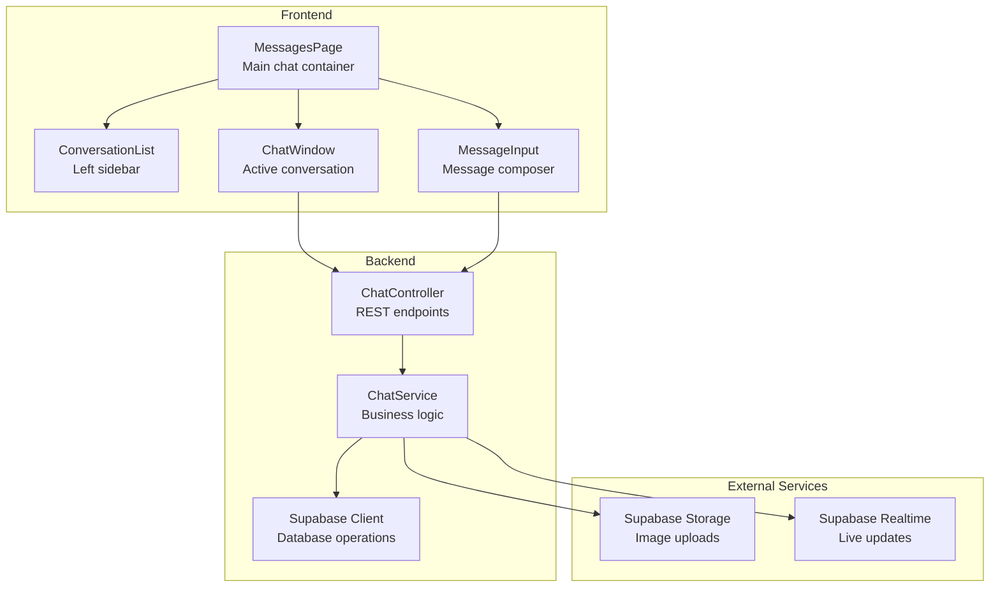
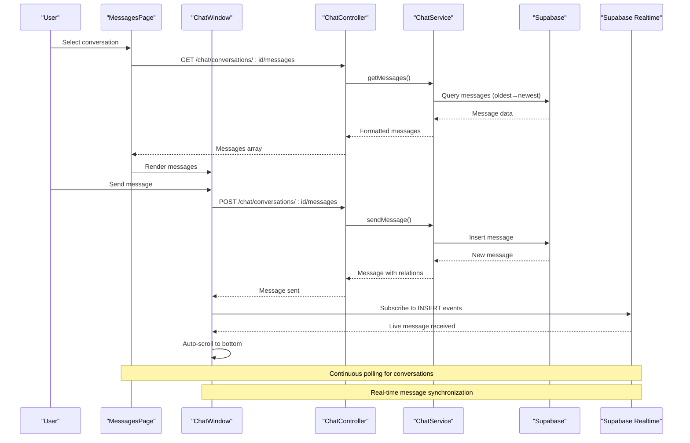
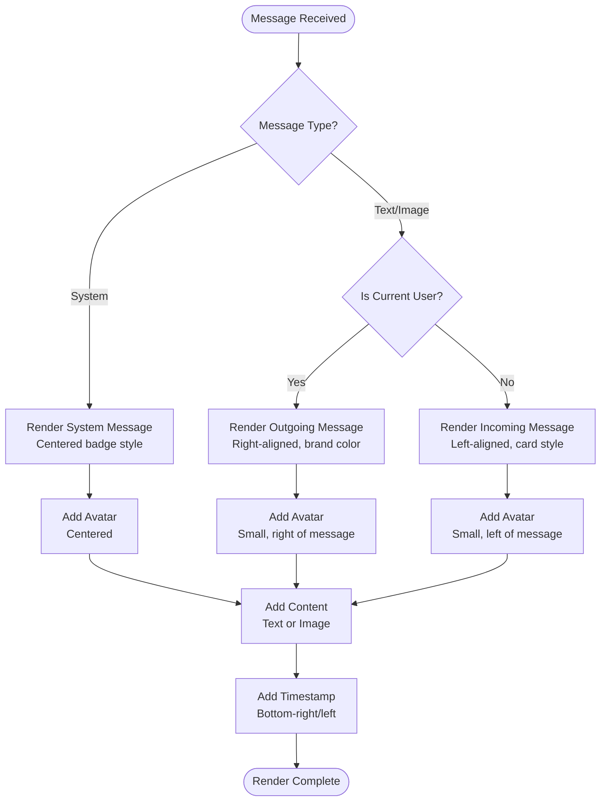
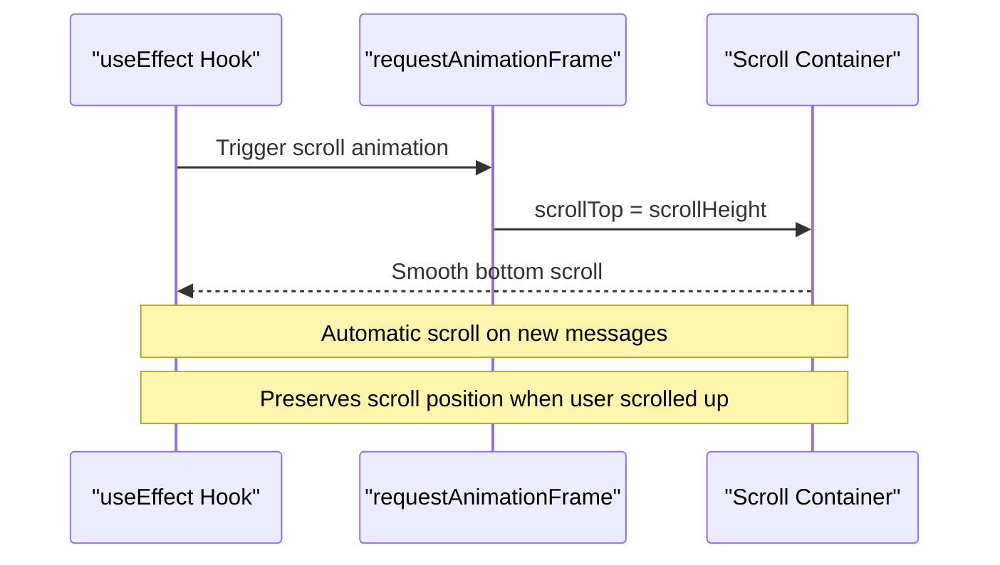
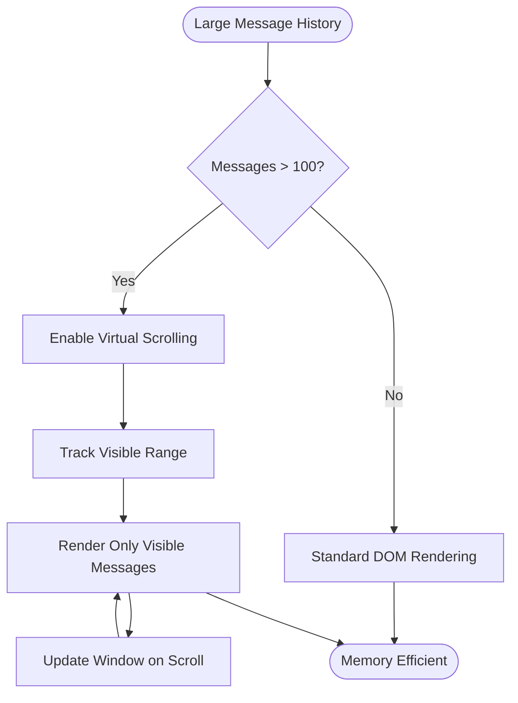

# Chat System

<cite>
**Referenced Files in This Document**
- [ChatWindow.tsx](file://frontend/app/messages/ChatWindow.tsx)
- [types.ts](file://frontend/app/messages/types.ts)
- [page.tsx](file://frontend/app/messages/page.tsx)
- [MessageInput.tsx](file://frontend/app/messages/MessageInput.tsx)
- [ConversationList.tsx](file://frontend/app/messages/ConversationList.tsx)
- [api.ts](file://frontend/app/lib/api.ts)
- [supabase.ts](file://frontend/app/lib/supabase.ts)
- [chat.service.ts](file://backend/src/modules/chat/chat.service.ts)
- [chat.controller.ts](file://backend/src/modules/chat/chat.controller.ts)
- [chat.dto.ts](file://backend/src/modules/chat/dto/chat.dto.ts)
- [upload.service.ts](file://backend/src/modules/upload/upload.service.ts)
- [supabase.config.ts](file://backend/src/config/supabase.config.ts)
</cite>

## Table of Contents
1. [Introduction](#introduction)
2. [Project Structure](#project-structure)
3. [Core Components](#core-components)
4. [Architecture Overview](#architecture-overview)
5. [Detailed Component Analysis](#detailed-component-analysis)
6. [Dependency Analysis](#dependency-analysis)
7. [Performance Considerations](#performance-considerations)
8. [Troubleshooting Guide](#troubleshooting-guide)
9. [Conclusion](#conclusion)

## Introduction
This document provides comprehensive documentation for the ChatWindow component that powers real-time messaging in the MissLost platform. It covers message rendering logic, user identification, message styling, conversation header functionality, handling of different message types (text and image), timestamps, read receipts, sender differentiation, scroll behavior for continuous message history, infinite scrolling for older messages, and smooth scrolling to new messages. It also includes examples of message formatting, avatar display, conversation metadata presentation, and performance considerations for large message histories.

## Project Structure
The chat system is implemented as a Next.js application with a NestJS backend. The frontend chat module consists of several key components that work together to provide a seamless messaging experience.

**Diagram sources**
- [page.tsx:12-179](file://frontend/app/messages/page.tsx#L12-L179)
- [ChatWindow.tsx:12-347](file://frontend/app/messages/ChatWindow.tsx#L12-L347)
- [MessageInput.tsx:9-116](file://frontend/app/messages/MessageInput.tsx#L9-L116)
- [ConversationList.tsx:12-102](file://frontend/app/messages/ConversationList.tsx#L12-L102)
- [chat.controller.ts:12-49](file://backend/src/modules/chat/chat.controller.ts#L12-L49)

**Section sources**
- [page.tsx:12-179](file://frontend/app/messages/page.tsx#L12-L179)
- [ChatWindow.tsx:12-347](file://frontend/app/messages/ChatWindow.tsx#L12-L347)
- [MessageInput.tsx:9-116](file://frontend/app/messages/MessageInput.tsx#L9-L116)
- [ConversationList.tsx:12-102](file://frontend/app/messages/ConversationList.tsx#L12-L102)

## Core Components
The chat system comprises four primary components that collaborate to deliver a complete messaging experience:

### Data Types and Interfaces
The system defines clear TypeScript interfaces for conversations, messages, users, and handover triggers that ensure type safety across the application.

**Section sources**
- [types.ts:1-51](file://frontend/app/messages/types.ts#L1-L51)

### Conversation Management
The MessagesPage component orchestrates the entire chat experience, managing conversation selection, real-time updates, and message synchronization.

**Section sources**
- [page.tsx:12-179](file://frontend/app/messages/page.tsx#L12-L179)

### Message Rendering Engine
The ChatWindow component serves as the primary display area for messages, handling different message types, user identification, and visual styling.

**Section sources**
- [ChatWindow.tsx:12-347](file://frontend/app/messages/ChatWindow.tsx#L12-L347)

### User Interaction
The MessageInput component provides the interface for composing and sending messages, including support for image attachments.

**Section sources**
- [MessageInput.tsx:9-116](file://frontend/app/messages/MessageInput.tsx#L9-L116)

## Architecture Overview
The chat system follows a client-server architecture with real-time capabilities powered by Supabase. The frontend maintains state locally while synchronizing with the backend through REST APIs and WebSocket connections.

**Diagram sources**
- [page.tsx:64-106](file://frontend/app/messages/page.tsx#L64-L106)
- [ChatWindow.tsx:32-57](file://frontend/app/messages/ChatWindow.tsx#L32-L57)
- [chat.controller.ts:27-42](file://backend/src/modules/chat/chat.controller.ts#L27-L42)
- [chat.service.ts:68-126](file://backend/src/modules/chat/chat.service.ts#L68-L126)

## Detailed Component Analysis

### ChatWindow Component
The ChatWindow component is the centerpiece of the messaging interface, responsible for rendering conversations and handling user interactions.

#### Message Rendering Logic
The component implements sophisticated message rendering that distinguishes between different message types and user roles:

**Diagram sources**
- [ChatWindow.tsx:285-342](file://frontend/app/messages/ChatWindow.tsx#L285-L342)

#### User Identification and Avatar Display
The component implements robust user identification with fallback mechanisms:

- **Current User Detection**: Uses `currentUserId` prop to differentiate between outgoing and incoming messages
- **Partner Identification**: Automatically identifies the other participant in the conversation
- **Avatar Fallback Strategy**: Uses ui-avatars.com for missing profile images
- **Dynamic Styling**: Applies different border colors and styles based on message ownership

#### Message Styling and Layout
The component employs a responsive design system with Tailwind CSS utilities:

- **Message Bubbles**: Rounded rectangles with directional styling (left/right alignment)
- **Color Schemes**: Brand blue for outgoing messages, neutral cards for incoming
- **Visual Differentiation**: Distinct border radii and shadows for readability
- **Responsive Design**: Max-width constraints and flexible layouts

#### Conversation Header Functionality
The header displays essential conversation metadata:

- **Participant Avatar**: Large circular avatar with online status indicator
- **Participant Name**: Full name with fallback to anonymous display
- **Post Association**: Visual indicators for lost/found post relationships
- **Metadata Display**: Timestamps and conversation context

#### Scroll Behavior Implementation
The component implements intelligent scroll management:

**Diagram sources**
- [ChatWindow.tsx:19-29](file://frontend/app/messages/ChatWindow.tsx#L19-L29)

#### Handover Trigger System
The component integrates with the handover trigger system for item exchanges:

- **Trigger Status Display**: Visual banners for pending, confirmed, expired, or cancelled states
- **Interactive Actions**: Buttons for creating, confirming, and cancelling triggers
- **Polling Mechanism**: 10-second intervals for trigger state updates
- **Status-Based Styling**: Color-coded feedback based on trigger lifecycle

**Section sources**
- [ChatWindow.tsx:12-347](file://frontend/app/messages/ChatWindow.tsx#L12-L347)

### MessageInput Component
The MessageInput component provides a comprehensive interface for composing messages with support for both text and image content.

#### Text Message Composition
- **Input Field**: Multi-line text input with Enter-to-send functionality
- **Validation**: Prevents empty message submission
- **Optimistic UI**: Instantly displays messages before server confirmation
- **Keyboard Shortcuts**: Enter key sends messages, Shift+Enter adds new lines

#### Image Attachment Support
- **File Upload**: Hidden file input triggered by image button
- **Upload Processing**: Progress indication during file transfer
- **Preview Integration**: Sends image URLs as message content
- **Security**: File type validation and size limits

#### Integration with ChatWindow
- **Callback Pattern**: Uses `onSendMessage` prop for message delivery
- **Disabled States**: Properly handles disabled states during operations
- **Loading States**: Visual feedback for sending and uploading operations

**Section sources**
- [MessageInput.tsx:9-116](file://frontend/app/messages/MessageInput.tsx#L9-L116)

### ConversationList Component
The ConversationList component manages the sidebar navigation and provides quick access to recent conversations.

#### Conversation Preview Display
- **Avatar Thumbnails**: Circular avatars with online status indicators
- **Last Message Preview**: Shows content or media indicators
- **Timestamp Display**: Relative time formatting using date-fns
- **Selection State**: Visual highlighting for active conversation

#### Unread Message Indicators
- **Badge System**: Red dots with unread counts for unopened conversations
- **Visual Hierarchy**: Bold text for unread messages
- **Color Coding**: Different styling for selected vs. unselected conversations

#### User Experience Features
- **Smooth Scrolling**: Handles long conversation lists gracefully
- **Responsive Design**: Adapts to different screen sizes
- **Accessibility**: Proper focus management and keyboard navigation

**Section sources**
- [ConversationList.tsx:12-102](file://frontend/app/messages/ConversationList.tsx#L12-L102)

### Backend Integration
The backend provides RESTful APIs and real-time capabilities through Supabase integration.

#### Message Retrieval and Pagination
The backend implements efficient message loading with pagination:

- **Pagination Control**: Configurable page size (default 50 messages)
- **Reverse Chronological Order**: Newest messages first, then reversed for display
- **Participant Verification**: Ensures user authorization for conversation access
- **Read Receipts**: Automatic marking of messages as read for other participants

#### Real-time Message Synchronization
The system uses Supabase Realtime for instant message delivery:

- **WebSocket Subscriptions**: Per-conversation channels for live updates
- **Automatic Refresh**: Backend triggers refreshes when new messages arrive
- **Client-side Updates**: Optimistic UI with immediate message appearance

#### Image Upload Processing
The backend handles secure image uploads:

- **Storage Integration**: Supabase Storage bucket for image hosting
- **Unique Naming**: Randomized filenames to prevent conflicts
- **Public URLs**: Direct access to uploaded images
- **Cleanup Operations**: Proper file management and cleanup

**Section sources**
- [chat.service.ts:68-126](file://backend/src/modules/chat/chat.service.ts#L68-L126)
- [chat.controller.ts:27-42](file://backend/src/modules/chat/chat.controller.ts#L27-L42)
- [upload.service.ts:53-81](file://backend/src/modules/upload/upload.service.ts#L53-L81)

## Dependency Analysis

```mermaid
graph TB
subgraph "Frontend Dependencies"
React["React Hooks<br/>useState, useEffect, useRef"]
DateFns["date-fns<br/>Formatting utilities"]
SupabaseJS["@supabase/supabase-js<br/>Realtime client"]
TailwindCSS["Tailwind CSS<br/>Styling framework"]
end
subgraph "Backend Dependencies"
NestJS["@nestjs/common<br/>Framework core"]
SupabaseServer["@supabase/supabase-js<br/>Server client"]
ClassValidator["class-validator<br/>DTO validation"]
Swagger["@nestjs/swagger<br/>API documentation"]
end
subgraph "External Services"
SupabaseStorage["Supabase Storage<br/>File hosting"]
SupabaseRealtime["Supabase Realtime<br/>Live updates"]
end
ChatWindow --> React
ChatWindow --> DateFns
ChatWindow --> SupabaseJS
ChatWindow --> TailwindCSS
MessagesPage --> React
MessagesPage --> SupabaseJS
MessageInput --> React
MessageInput --> SupabaseJS
ChatService --> NestJS
ChatService --> SupabaseServer
ChatService --> ClassValidator
ChatService --> Swagger
ChatService --> SupabaseStorage
ChatService --> SupabaseRealtime
```

**Diagram sources**
- [ChatWindow.tsx:1-5](file://frontend/app/messages/ChatWindow.tsx#L1-L5)
- [page.tsx:3-10](file://frontend/app/messages/page.tsx#L3-L10)
- [chat.service.ts:1-10](file://backend/src/modules/chat/chat.service.ts#L1-L10)

### Component Coupling Analysis
The chat system demonstrates good separation of concerns with minimal coupling between components:

- **ChatWindow**: Self-contained rendering logic with clear props interface
- **MessageInput**: Independent composition component with callback pattern
- **ConversationList**: Standalone navigation component
- **MessagesPage**: Orchestrator with clear state management boundaries

### External Dependencies
The system relies on several external services:

- **Supabase**: Primary database and real-time infrastructure
- **date-fns**: Client-side date formatting and localization
- **Tailwind CSS**: Utility-first styling framework
- **UI Avatars**: Fallback avatar generation service

**Section sources**
- [api.ts:12-43](file://frontend/app/lib/api.ts#L12-L43)
- [supabase.ts:7-17](file://frontend/app/lib/supabase.ts#L7-L17)
- [supabase.config.ts:7-23](file://backend/src/config/supabase.config.ts#L7-L23)

## Performance Considerations

### Memory Management Strategies
The chat system implements several strategies to manage memory efficiently:

#### Virtual Scrolling Implementation
For large message histories, consider implementing virtual scrolling to limit DOM nodes:

#### Image Loading Optimization
- **Lazy Loading**: Implemented with `loading="lazy"` attribute
- **Progressive Loading**: Placeholder images during upload
- **Memory Cleanup**: Automatic removal of temporary messages on failure

#### State Management Efficiency
- **Selective Re-rendering**: Only re-renders affected message components
- **Reference Stability**: Maintains stable references for unchanged messages
- **Batch Updates**: Groups related state updates for better performance

### Scalability Considerations
The current implementation scales well for moderate conversation volumes:

- **Pagination**: Backend limits messages per page (default 50)
- **Real-time Updates**: Efficient WebSocket subscriptions per conversation
- **Client-side Caching**: Local state management reduces API calls
- **Background Polling**: Controlled polling intervals (10 seconds) balance freshness and performance

### Network Optimization
- **Connection Pooling**: Reuses Supabase client instances
- **Request Deduplication**: Prevents duplicate API calls during rapid operations
- **Error Recovery**: Graceful handling of network failures with retry logic

## Troubleshooting Guide

### Common Issues and Solutions

#### Message Not Appearing
**Symptoms**: Sent messages don't appear in the chat window
**Causes**: 
- Network connectivity issues
- Authentication token expiration
- Real-time subscription failure

**Solutions**:
- Verify network connection and API endpoint accessibility
- Check authentication state and token validity
- Monitor Supabase Realtime subscription status

#### Avatar Display Problems
**Symptoms**: Missing or broken avatar images
**Causes**:
- Missing avatar URLs in user profiles
- Network issues with external avatar service
- CORS restrictions on image loading

**Solutions**:
- Implement fallback to ui-avatars.com service
- Check network connectivity to avatar service
- Verify CORS configuration for image domains

#### Scroll Position Issues
**Symptoms**: Chat scrolls unexpectedly or loses position
**Causes**:
- Rapid message updates causing scroll conflicts
- DOM measurement timing issues
- User interaction during scroll animations

**Solutions**:
- Use requestAnimationFrame for scroll operations
- Implement scroll position preservation logic
- Debounce scroll-related state updates

#### Performance Degradation
**Symptoms**: Slow message rendering or UI lag
**Causes**:
- Large message histories without virtualization
- Excessive re-renders due to state changes
- Memory leaks from unmanaged subscriptions

**Solutions**:
- Implement virtual scrolling for large histories
- Optimize component re-rendering with memoization
- Clean up event listeners and subscriptions properly

### Debugging Tools and Techniques
- **Console Logging**: Monitor message flow and state changes
- **Network Inspection**: Track API requests and WebSocket connections
- **Performance Profiling**: Identify bottlenecks in rendering and data fetching
- **State Inspection**: Use React DevTools to monitor component state and props

**Section sources**
- [ChatWindow.tsx:32-57](file://frontend/app/messages/ChatWindow.tsx#L32-L57)
- [page.tsx:76-106](file://frontend/app/messages/page.tsx#L76-L106)
- [api.ts:30-43](file://frontend/app/lib/api.ts#L30-L43)

## Conclusion
The ChatWindow component and associated chat system provide a robust, real-time messaging solution with excellent user experience. The implementation demonstrates strong architectural principles with clear separation of concerns, efficient state management, and comprehensive error handling. The system successfully balances performance with functionality, providing smooth scrolling, real-time updates, and responsive user interactions.

Key strengths of the implementation include:
- **Real-time Synchronization**: Seamless live message updates via Supabase Realtime
- **User Experience**: Intuitive interface with thoughtful visual design
- **Performance**: Efficient rendering and memory management strategies
- **Scalability**: Well-structured architecture supporting growth
- **Reliability**: Comprehensive error handling and recovery mechanisms

The system provides a solid foundation for further enhancements, including virtual scrolling for large histories, advanced message threading, and expanded multimedia support. The modular design ensures that future improvements can be implemented with minimal disruption to existing functionality.