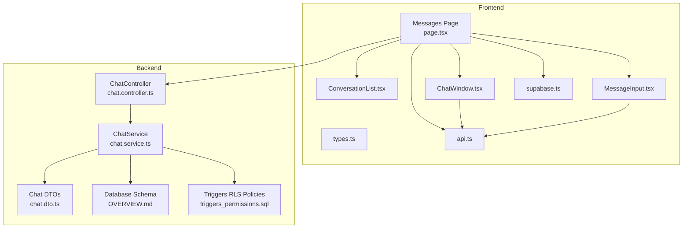
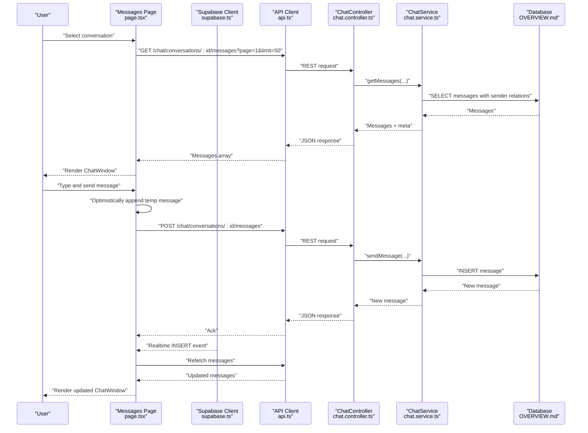
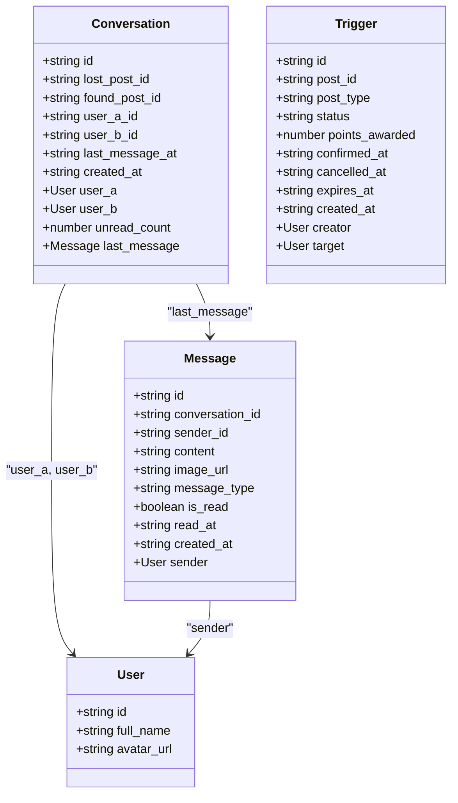
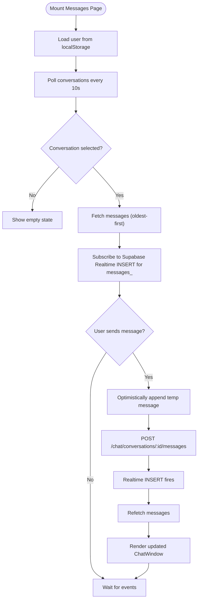
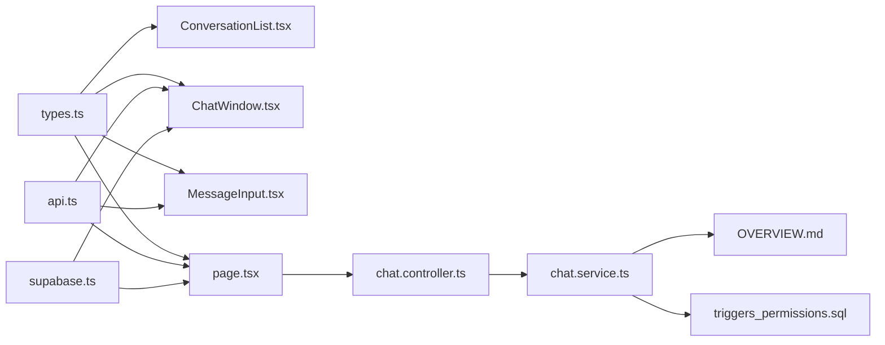

# Communication Interface

<cite>
**Referenced Files in This Document**
- [types.ts](file://frontend/app/messages/types.ts)
- [ChatWindow.tsx](file://frontend/app/messages/ChatWindow.tsx)
- [ConversationList.tsx](file://frontend/app/messages/ConversationList.tsx)
- [MessageInput.tsx](file://frontend/app/messages/MessageInput.tsx)
- [page.tsx](file://frontend/app/messages/page.tsx)
- [api.ts](file://frontend/app/lib/api.ts)
- [supabase.ts](file://frontend/app/lib/supabase.ts)
- [chat.service.ts](file://backend/src/modules/chat/chat.service.ts)
- [chat.controller.ts](file://backend/src/modules/chat/chat.controller.ts)
- [chat.dto.ts](file://backend/src/modules/chat/dto/chat.dto.ts)
- [triggers_permissions.sql](file://backend/sql/triggers_permissions.sql)
- [OVERVIEW.md](file://OVERVIEW.md)
</cite>

## Table of Contents
1. [Introduction](#introduction)
2. [Project Structure](#project-structure)
3. [Core Components](#core-components)
4. [Architecture Overview](#architecture-overview)
5. [Detailed Component Analysis](#detailed-component-analysis)
6. [Dependency Analysis](#dependency-analysis)
7. [Performance Considerations](#performance-considerations)
8. [Troubleshooting Guide](#troubleshooting-guide)
9. [Conclusion](#conclusion)

## Introduction
This document describes the real-time communication system for chat and related messaging features. It covers the frontend components for conversation browsing, message display, and message composition, as well as the backend APIs and database schema supporting real-time updates, message persistence, conversation creation, participant management, and specialized handover request workflows. It also documents WebSocket integration via Supabase Realtime, optimistic UI patterns, pagination, and practical guidance for performance and offline resilience.

## Project Structure
The communication interface spans two primary areas:
- Frontend Next.js application under frontend/app/messages with React components and page orchestration
- Backend NestJS application under backend/src/modules/chat exposing REST endpoints for conversations and messages

**Diagram sources**
- [page.tsx:12-179](file://frontend/app/messages/page.tsx#L12-L179)
- [ConversationList.tsx:12-102](file://frontend/app/messages/ConversationList.tsx#L12-L102)
- [ChatWindow.tsx:12-347](file://frontend/app/messages/ChatWindow.tsx#L12-L347)
- [MessageInput.tsx:9-116](file://frontend/app/messages/MessageInput.tsx#L9-L116)
- [types.ts:1-51](file://frontend/app/messages/types.ts#L1-L51)
- [api.ts:12-82](file://frontend/app/lib/api.ts#L12-L82)
- [supabase.ts:7-17](file://frontend/app/lib/supabase.ts#L7-L17)
- [chat.controller.ts:12-49](file://backend/src/modules/chat/chat.controller.ts#L12-L49)
- [chat.service.ts:7-150](file://backend/src/modules/chat/chat.service.ts#L7-L150)
- [chat.dto.ts:4-35](file://backend/src/modules/chat/dto/chat.dto.ts#L4-L35)
- [OVERVIEW.md:431-470](file://OVERVIEW.md#L431-L470)
- [triggers_permissions.sql:1-57](file://backend/sql/triggers_permissions.sql#L1-L57)

**Section sources**
- [page.tsx:12-179](file://frontend/app/messages/page.tsx#L12-L179)
- [chat.controller.ts:12-49](file://backend/src/modules/chat/chat.controller.ts#L12-L49)
- [chat.service.ts:7-150](file://backend/src/modules/chat/chat.service.ts#L7-L150)
- [types.ts:1-51](file://frontend/app/messages/types.ts#L1-L51)

## Core Components
- Conversation model and message model define the data structures used across the UI and API.
- ConversationList renders the sidebar navigation with previews and unread indicators.
- ChatWindow displays messages, handles trigger banners for handover requests, and manages auto-scroll.
- MessageInput supports text and image uploads, optimistic UI, and Enter-to-send.
- The Messages page orchestrates polling, Supabase Realtime subscriptions, and message sending with optimistic updates.

**Section sources**
- [types.ts:7-36](file://frontend/app/messages/types.ts#L7-L36)
- [ConversationList.tsx:12-102](file://frontend/app/messages/ConversationList.tsx#L12-L102)
- [ChatWindow.tsx:12-347](file://frontend/app/messages/ChatWindow.tsx#L12-L347)
- [MessageInput.tsx:9-116](file://frontend/app/messages/MessageInput.tsx#L9-L116)
- [page.tsx:12-179](file://frontend/app/messages/page.tsx#L12-L179)

## Architecture Overview
The system integrates REST APIs with Supabase Realtime for near-instantaneous message delivery. The frontend polls conversation metadata periodically and subscribes to message insertions via Realtime channels. On send, the UI optimistically appends a temporary message while the backend persists it and broadcasts via Realtime.

**Diagram sources**
- [page.tsx:64-148](file://frontend/app/messages/page.tsx#L64-L148)
- [supabase.ts:7-17](file://frontend/app/lib/supabase.ts#L7-L17)
- [api.ts:12-43](file://frontend/app/lib/api.ts#L12-L43)
- [chat.controller.ts:27-42](file://backend/src/modules/chat/chat.controller.ts#L27-L42)
- [chat.service.ts:68-126](file://backend/src/modules/chat/chat.service.ts#L68-L126)
- [OVERVIEW.md:431-470](file://OVERVIEW.md#L431-L470)

## Detailed Component Analysis

### Data Models and Types
The frontend defines core TypeScript interfaces for users, conversations, messages, and trigger handover requests. These types guide rendering and API interactions.

**Diagram sources**
- [types.ts:1-51](file://frontend/app/messages/types.ts#L1-L51)

**Section sources**
- [types.ts:1-51](file://frontend/app/messages/types.ts#L1-L51)

### ConversationList Component
Responsibilities:
- Renders a scrollable sidebar of conversations
- Shows participant avatars, last message preview, relative timestamps, and unread counts
- Handles selection and applies visual selection state

Key behaviors:
- Uses date-fns to compute human-friendly relative times
- Computes partner identity from current user ID
- Highlights unread indicators when present

**Section sources**
- [ConversationList.tsx:12-102](file://frontend/app/messages/ConversationList.tsx#L12-L102)

### ChatWindow Component
Responsibilities:
- Displays messages in a chat canvas anchored to the bottom
- Auto-scrolls to the latest message
- Renders system messages differently
- Shows trigger banner for handover requests with actions
- Loads and refreshes trigger state via polling due to RLS limitations on triggers table

Rendering logic:
- Own messages vs others distinguished by alignment and colors
- Avatars sourced from sender relation or fallback URLs
- Timestamps formatted using date-fns
- Trigger banner reacts to loading, pending, confirmed, expired/cancelled states

**Section sources**
- [ChatWindow.tsx:12-347](file://frontend/app/messages/ChatWindow.tsx#L12-L347)

### MessageInput Component
Responsibilities:
- Text input with Enter-to-send support
- Image upload via uploadFile helper
- Optimistic send button states and disabled states
- Integrates with parent handler to send content or image URL

**Section sources**
- [MessageInput.tsx:9-116](file://frontend/app/messages/MessageInput.tsx#L9-L116)

### Messages Page Orchestration
Responsibilities:
- Authentication guard via JWT token in localStorage
- Periodic polling of conversations (every 10 seconds)
- Realtime subscription to new messages per selected conversation
- Optimistic UI for sending messages
- Refetching messages and updating conversation list after send

**Diagram sources**
- [page.tsx:25-148](file://frontend/app/messages/page.tsx#L25-L148)
- [supabase.ts:7-17](file://frontend/app/lib/supabase.ts#L7-L17)
- [api.ts:12-43](file://frontend/app/lib/api.ts#L12-L43)

**Section sources**
- [page.tsx:25-148](file://frontend/app/messages/page.tsx#L25-L148)

### Backend API and Services
Endpoints:
- GET /chat/conversations: returns conversations with last message preview and user relations
- POST /chat/conversations: creates or retrieves a conversation between two users
- GET /chat/conversations/:id/messages: paginated messages with sender relations; marks others’ unread as read
- POST /chat/conversations/:id/messages: inserts a new message
- GET /chat/unread-count: total unread count for current user

Validation and permissions:
- Participants are verified before fetching messages or sending
- DTOs enforce allowed message types and presence of content or image

**Section sources**
- [chat.controller.ts:15-48](file://backend/src/modules/chat/chat.controller.ts#L15-L48)
- [chat.service.ts:12-150](file://backend/src/modules/chat/chat.service.ts#L12-L150)
- [chat.dto.ts:4-35](file://backend/src/modules/chat/dto/chat.dto.ts#L4-L35)

### Database Schema and Real-Time Triggers
- conversations table stores participants and last_message_at
- messages table stores content, images, message_type, read flags, and soft-delete
- PostgreSQL trigger updates conversations.last_message_at on new message insert
- Indexes optimize queries for conversations and messages

**Section sources**
- [OVERVIEW.md:431-470](file://OVERVIEW.md#L431-L470)

### Handover Request Workflow (Triggers)
- Triggers are managed via a dedicated triggers table with RLS policies allowing authenticated users to view/update only their own triggers
- ChatWindow polls trigger status for the selected conversation
- Actions include create, confirm, and cancel, with immediate UI feedback and reload

**Section sources**
- [ChatWindow.tsx:32-123](file://frontend/app/messages/ChatWindow.tsx#L32-L123)
- [triggers_permissions.sql:1-57](file://backend/sql/triggers_permissions.sql#L1-L57)

## Dependency Analysis
Frontend dependencies:
- page.tsx depends on ConversationList, ChatWindow, MessageInput, api.ts, and supabase.ts
- ChatWindow depends on types.ts and uses api.ts indirectly via trigger actions
- MessageInput depends on api.ts uploadFile helper
- Supabase client is configured per-request with optional Bearer token

Backend dependencies:
- ChatController delegates to ChatService
- ChatService uses Supabase client and enforces participant checks
- Database schema and triggers support real-time updates

**Diagram sources**
- [types.ts:1-51](file://frontend/app/messages/types.ts#L1-L51)
- [ConversationList.tsx:12-102](file://frontend/app/messages/ConversationList.tsx#L12-L102)
- [ChatWindow.tsx:12-347](file://frontend/app/messages/ChatWindow.tsx#L12-L347)
- [MessageInput.tsx:9-116](file://frontend/app/messages/MessageInput.tsx#L9-L116)
- [page.tsx:12-179](file://frontend/app/messages/page.tsx#L12-L179)
- [api.ts:12-82](file://frontend/app/lib/api.ts#L12-L82)
- [supabase.ts:7-17](file://frontend/app/lib/supabase.ts#L7-L17)
- [chat.controller.ts:12-49](file://backend/src/modules/chat/chat.controller.ts#L12-L49)
- [chat.service.ts:7-150](file://backend/src/modules/chat/chat.service.ts#L7-L150)
- [OVERVIEW.md:431-470](file://OVERVIEW.md#L431-L470)
- [triggers_permissions.sql:1-57](file://backend/sql/triggers_permissions.sql#L1-L57)

**Section sources**
- [page.tsx:12-179](file://frontend/app/messages/page.tsx#L12-L179)
- [chat.controller.ts:12-49](file://backend/src/modules/chat/chat.controller.ts#L12-L49)
- [chat.service.ts:7-150](file://backend/src/modules/chat/chat.service.ts#L7-L150)

## Performance Considerations
- Pagination: Backend returns paginated messages with explicit ordering and reverse to present oldest-to-newest. Frontend sets a reasonable limit (default 50) and relies on Realtime for live updates.
- Auto-scroll: requestAnimationFrame ensures smooth scrolling after DOM updates.
- Polling: Conversations are polled every 10 seconds to keep last message previews fresh; adjust interval based on traffic.
- Optimistic UI: Minimizes perceived latency by rendering local messages immediately; rollback on failure.
- Images: Lazy-loading of images reduces initial render cost.
- Infinite scroll patterns (used elsewhere) demonstrate efficient intersection-based loading strategies that can inspire future enhancements for message history.

[No sources needed since this section provides general guidance]

## Troubleshooting Guide
Common issues and remedies:
- Unauthorized access: api.ts redirects to login on 401; ensure access_token is present in localStorage.
- Participant validation failures: ChatService throws when a user is not part of a conversation; verify conversation ownership before sending.
- Read receipts: Backend marks others’ messages as read upon retrieval; ensure client-side state reflects read flags.
- Realtime not firing: Confirm Supabase credentials and channel filter match the selected conversation ID.
- Trigger banner errors: ChatWindow handles missing or expired/cancelled triggers gracefully; localized error messages are surfaced to users.

**Section sources**
- [api.ts:12-43](file://frontend/app/lib/api.ts#L12-L43)
- [chat.service.ts:68-150](file://backend/src/modules/chat/chat.service.ts#L68-L150)
- [page.tsx:75-106](file://frontend/app/messages/page.tsx#L75-L106)
- [ChatWindow.tsx:32-123](file://frontend/app/messages/ChatWindow.tsx#L32-L123)

## Conclusion
The communication interface combines REST APIs with Supabase Realtime to deliver a responsive chat experience. The frontend components are modular and focused: ConversationList for navigation, ChatWindow for rich message rendering and trigger management, and MessageInput for composing and sending content. The backend enforces participant checks, maintains read receipts, and exposes paginated message retrieval. Together, these pieces provide a solid foundation for real-time messaging, with clear extension points for advanced features like typing indicators, read receipts synchronization, and offline message queuing.