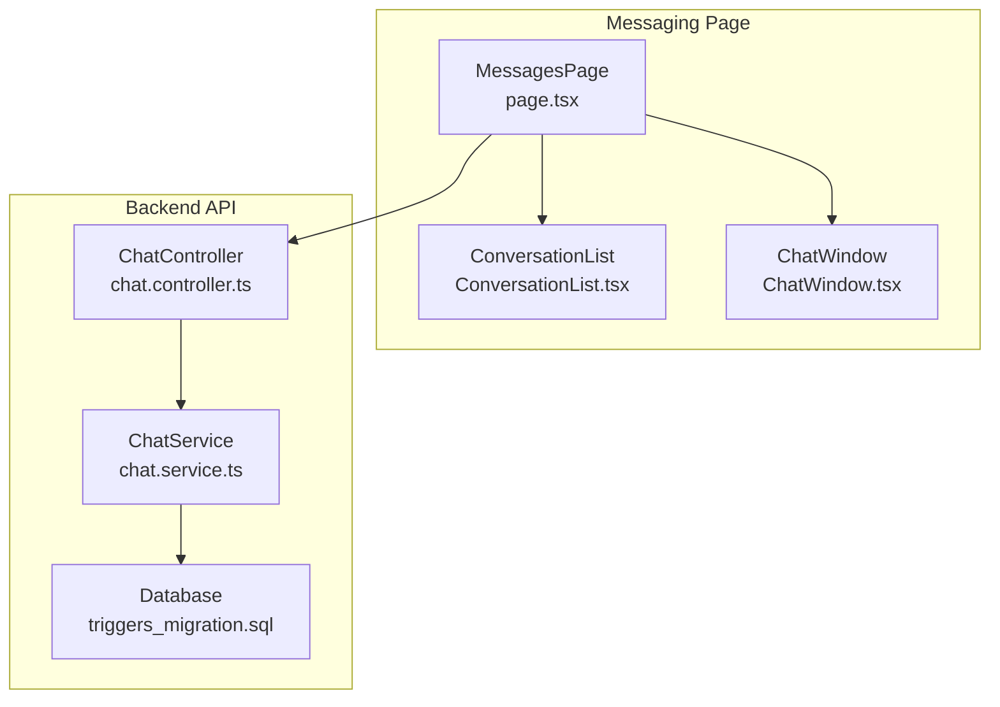
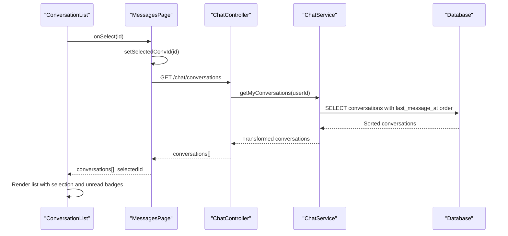
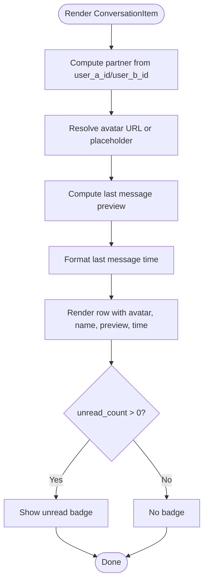
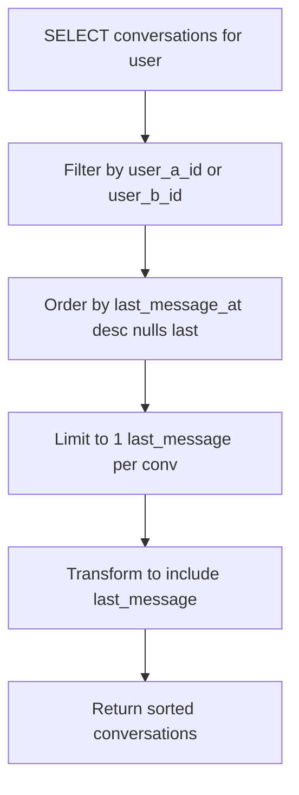
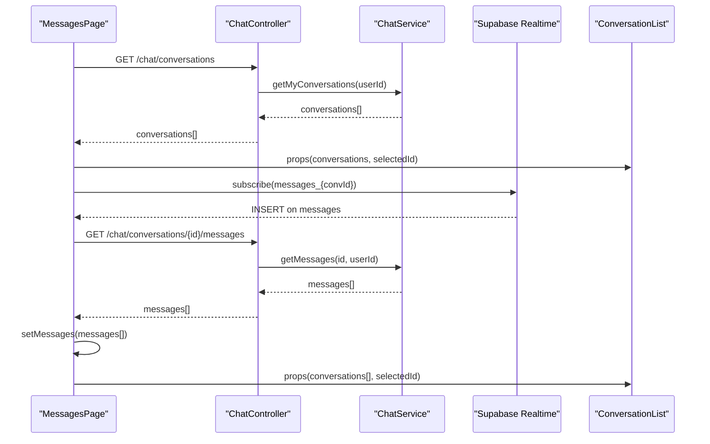
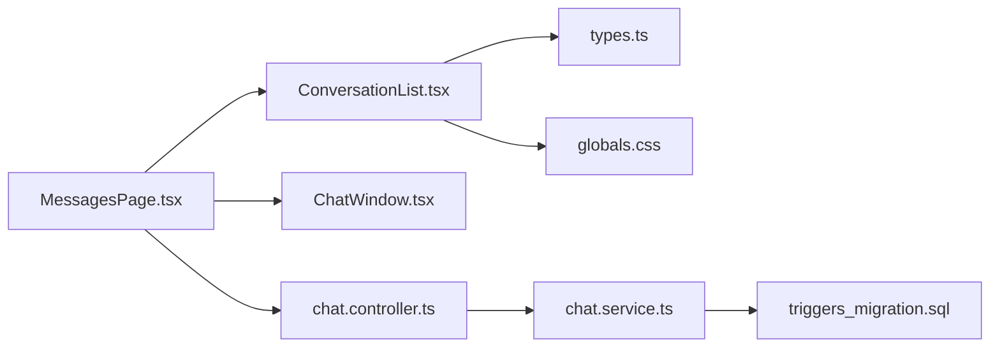

# Conversation List

<cite>
**Referenced Files in This Document**
- [ConversationList.tsx](file://frontend/app/messages/ConversationList.tsx)
- [types.ts](file://frontend/app/messages/types.ts)
- [page.tsx](file://frontend/app/messages/page.tsx)
- [ChatWindow.tsx](file://frontend/app/messages/ChatWindow.tsx)
- [globals.css](file://frontend/app/globals.css)
- [chat.controller.ts](file://backend/src/modules/chat/chat.controller.ts)
- [chat.service.ts](file://backend/src/modules/chat/chat.service.ts)
- [triggers_migration.sql](file://backend/sql/triggers_migration.sql)
</cite>

## Table of Contents
1. [Introduction](#introduction)
2. [Project Structure](#project-structure)
3. [Core Components](#core-components)
4. [Architecture Overview](#architecture-overview)
5. [Detailed Component Analysis](#detailed-component-analysis)
6. [Dependency Analysis](#dependency-analysis)
7. [Performance Considerations](#performance-considerations)
8. [Troubleshooting Guide](#troubleshooting-guide)
9. [Conclusion](#conclusion)

## Introduction
This document provides comprehensive technical documentation for the ConversationList component that powers the left sidebar of the messaging interface. It covers conversation selection logic, last message previews, unread indicators, participant information display, filtering and sorting behavior, rendering mechanics, hover and selection states, and performance considerations for large conversation lists. It also explains how the component integrates with backend APIs and real-time updates.

## Project Structure
The messaging feature is implemented as a Next.js app page with a split-pane layout:
- Left pane: ConversationList renders the conversation list and handles selection.
- Right pane: ChatWindow displays the active conversation and message input.
- Shared state: The parent page orchestrates data fetching, real-time subscriptions, and optimistic UI updates.

**Diagram sources**
- [page.tsx:12-179](file://frontend/app/messages/page.tsx#L12-L179)
- [ConversationList.tsx:12-102](file://frontend/app/messages/ConversationList.tsx#L12-L102)
- [ChatWindow.tsx:12-347](file://frontend/app/messages/ChatWindow.tsx#L12-L347)
- [chat.controller.ts:15-48](file://backend/src/modules/chat/chat.controller.ts#L15-L48)
- [chat.service.ts:12-36](file://backend/src/modules/chat/chat.service.ts#L12-L36)
- [triggers_migration.sql:416-470](file://backend/sql/triggers_migration.sql#L416-L470)

**Section sources**
- [page.tsx:12-179](file://frontend/app/messages/page.tsx#L12-L179)
- [ConversationList.tsx:12-102](file://frontend/app/messages/ConversationList.tsx#L12-L102)
- [ChatWindow.tsx:12-347](file://frontend/app/messages/ChatWindow.tsx#L12-L347)
- [chat.controller.ts:15-48](file://backend/src/modules/chat/chat.controller.ts#L15-L48)
- [chat.service.ts:12-36](file://backend/src/modules/chat/chat.service.ts#L12-L36)
- [triggers_migration.sql:416-470](file://backend/sql/triggers_migration.sql#L416-L470)

## Core Components
- ConversationList: Renders the conversation list sidebar with participant avatars, last message preview, unread indicators, and selection states.
- Types: Defines Conversation, Message, and User interfaces used across the messaging module.
- MessagesPage: Orchestrates data fetching, real-time subscriptions, and optimistic UI updates.
- ChatWindow: Displays the selected conversation’s messages and related UI.

Key responsibilities:
- ConversationList: Handles selection callbacks, computes partner identity, formats timestamps, and renders unread badges.
- MessagesPage: Manages conversations and messages state, polls for updates, subscribes to real-time events, and optimistically updates UI on send.
- ChatWindow: Displays messages with sender avatars and timestamps, and renders trigger banners.

**Section sources**
- [ConversationList.tsx:12-102](file://frontend/app/messages/ConversationList.tsx#L12-L102)
- [types.ts:1-51](file://frontend/app/messages/types.ts#L1-L51)
- [page.tsx:12-179](file://frontend/app/messages/page.tsx#L12-L179)
- [ChatWindow.tsx:12-347](file://frontend/app/messages/ChatWindow.tsx#L12-L347)

## Architecture Overview
The ConversationList participates in a reactive messaging architecture:
- Frontend polls conversations every 10 seconds and subscribes to real-time updates via Supabase channels.
- Backend sorts conversations by recency using database ordering and triggers that update last_message_at.
- ConversationList consumes the sorted list and renders previews with unread counts and formatted timestamps.

**Diagram sources**
- [page.tsx:39-61](file://frontend/app/messages/page.tsx#L39-L61)
- [chat.controller.ts:15-19](file://backend/src/modules/chat/chat.controller.ts#L15-L19)
- [chat.service.ts:12-36](file://backend/src/modules/chat/chat.service.ts#L12-L36)
- [ConversationList.tsx:40-98](file://frontend/app/messages/ConversationList.tsx#L40-L98)

## Detailed Component Analysis

### ConversationList Component
Responsibilities:
- Renders conversation items with participant avatar, name, last message preview, and timestamp.
- Applies selection state styling and hover effects.
- Displays unread count badges when present.
- Computes partner identity based on current user ID.

Rendering logic highlights:
- Partner identification: Uses current user ID to select the other participant from user_a or user_b.
- Avatar fallback: Uses a placeholder service if no avatar URL is available.
- Last message preview: Shows content or special placeholders for images/system messages.
- Timestamp formatting: Uses date-fns with Vietnamese locale to humanize relative time.
- Selection state: Highlights the selected item with a border and background, while others receive hover styling.

Selection and interaction:
- Clicking an item invokes the onSelect callback with the conversation ID.
- The component receives selectedId to compute isSelected for each row.

Unread indicators:
- Unread count is conditionally rendered as a red dot badge when unread_count > 0.

Hover and selection states:
- Selected item: Background color and border highlight.
- Hover state: Subtle background tint for non-selected items.

**Diagram sources**
- [ConversationList.tsx:40-98](file://frontend/app/messages/ConversationList.tsx#L40-L98)

**Section sources**
- [ConversationList.tsx:12-102](file://frontend/app/messages/ConversationList.tsx#L12-L102)

### Conversation Filtering and Sorting
- Filtering: The backend filters conversations to the current user using OR conditions on user_a_id and user_b_id.
- Sorting: Conversations are ordered by last_message_at descending, with nulls last, ensuring active chats appear first.
- Backend ordering details: The service orders by last_message_at (descending, nulls last) and limits to one last message per conversation.

**Diagram sources**
- [chat.service.ts:12-36](file://backend/src/modules/chat/chat.service.ts#L12-L36)

**Section sources**
- [chat.service.ts:12-36](file://backend/src/modules/chat/chat.service.ts#L12-L36)

### Conversation Metadata Display
- Participant information: Full name and avatar URL are resolved from the participant user record.
- Timestamp formatting: Relative time is computed using date-fns with Vietnamese locale and simplified suffix removal.
- Last message preview: Content is shown with sender prefix for self-sent messages; images and system messages use placeholders.

Examples of metadata display:
- Participant avatar: Resolved from user profile or generated placeholder.
- Timestamp: Human-readable relative time (e.g., “x minutes ago”).
- Preview text: Truncated with bold emphasis when unread.

**Section sources**
- [ConversationList.tsx:40-98](file://frontend/app/messages/ConversationList.tsx#L40-L98)

### Conversation Item Rendering, Hover Effects, and Selection States
- Layout: Flex container with avatar on the left, name and time on the top row, preview text below.
- Hover effect: Non-selected items gain a subtle background tint on hover.
- Selection state: Selected item gets a highlighted background and border.
- Unread emphasis: When unread_count > 0, the preview text becomes bold and colored differently.

**Section sources**
- [ConversationList.tsx:58-96](file://frontend/app/messages/ConversationList.tsx#L58-L96)

### Integration with MessagesPage and Real-Time Updates
- Data fetching: MessagesPage fetches conversations on mount and every 10 seconds.
- Real-time: Subscribes to Supabase channel for new messages; refetches messages on insert.
- Optimistic UI: On send, MessagesPage inserts a temporary message into the UI before confirming with the backend.
- Conversation list refresh: After sending, MessagesPage refetches conversations to update last message preview.

**Diagram sources**
- [page.tsx:39-61](file://frontend/app/messages/page.tsx#L39-L61)
- [page.tsx:63-106](file://frontend/app/messages/page.tsx#L63-L106)
- [chat.controller.ts:27-42](file://backend/src/modules/chat/chat.controller.ts#L27-L42)
- [chat.service.ts:68-100](file://backend/src/modules/chat/chat.service.ts#L68-L100)
- [ConversationList.tsx:40-98](file://frontend/app/messages/ConversationList.tsx#L40-L98)

**Section sources**
- [page.tsx:39-148](file://frontend/app/messages/page.tsx#L39-L148)
- [chat.controller.ts:27-42](file://backend/src/modules/chat/chat.controller.ts#L27-L42)
- [chat.service.ts:68-100](file://backend/src/modules/chat/chat.service.ts#L68-L100)

### Backend Data Model and Triggers
- Conversations table: Stores user_a_id and user_b_id, last_message_at, and references to related posts.
- Messages table: Stores content, image_url, message_type, is_read, read_at, and created_at.
- Triggers system: Related to handover requests and does not directly affect conversation list rendering but influences conversation context.

**Section sources**
- [triggers_migration.sql:416-470](file://backend/sql/triggers_migration.sql#L416-L470)

## Dependency Analysis
- ConversationList depends on:
  - Conversation and User types for rendering.
  - date-fns for timestamp formatting.
  - Tailwind CSS classes for styling and theme tokens.
- MessagesPage depends on:
  - API client for chat endpoints.
  - Supabase client for real-time subscriptions.
  - ConversationList for rendering the list.
- Backend depends on:
  - Supabase client for database operations.
  - Database schema with indexes on last_message_at and conversation_id.

**Diagram sources**
- [ConversationList.tsx:12-102](file://frontend/app/messages/ConversationList.tsx#L12-L102)
- [types.ts:1-51](file://frontend/app/messages/types.ts#L1-L51)
- [globals.css:1-121](file://frontend/app/globals.css#L1-L121)
- [page.tsx:12-179](file://frontend/app/messages/page.tsx#L12-L179)
- [ChatWindow.tsx:12-347](file://frontend/app/messages/ChatWindow.tsx#L12-L347)
- [chat.controller.ts:15-48](file://backend/src/modules/chat/chat.controller.ts#L15-L48)
- [chat.service.ts:12-36](file://backend/src/modules/chat/chat.service.ts#L12-L36)
- [triggers_migration.sql:416-470](file://backend/sql/triggers_migration.sql#L416-L470)

**Section sources**
- [ConversationList.tsx:12-102](file://frontend/app/messages/ConversationList.tsx#L12-L102)
- [types.ts:1-51](file://frontend/app/messages/types.ts#L1-L51)
- [globals.css:1-121](file://frontend/app/globals.css#L1-L121)
- [page.tsx:12-179](file://frontend/app/messages/page.tsx#L12-L179)
- [ChatWindow.tsx:12-347](file://frontend/app/messages/ChatWindow.tsx#L12-L347)
- [chat.controller.ts:15-48](file://backend/src/modules/chat/chat.controller.ts#L15-L48)
- [chat.service.ts:12-36](file://backend/src/modules/chat/chat.service.ts#L12-L36)
- [triggers_migration.sql:416-470](file://backend/sql/triggers_migration.sql#L416-L470)

## Performance Considerations
Current implementation characteristics:
- ConversationList renders all conversations in a single list. There is no explicit virtual scrolling implementation in the current code.
- The component uses React’s built-in list rendering with keys and minimal transforms.
- Backend sorting ensures recency-based ordering, reducing client-side sorting overhead.
- Real-time updates via Supabase minimize polling for message changes; conversations are polled less frequently (every 10 seconds).

Optimization opportunities:
- Virtual scrolling: For large conversation lists, implement a virtualized list (e.g., react-window or react-virtual) to render only visible items.
- Memoization: Memoize derived values (partner resolution, avatar URLs, previews) to reduce re-computation on re-renders.
- Debounced search: If search is introduced, debounce input and avoid re-fetching until the user stops typing.
- Efficient re-rendering: Use shallow comparisons for conversations and messages arrays to prevent unnecessary re-renders of unchanged items.

[No sources needed since this section provides general guidance]

## Troubleshooting Guide
Common issues and resolutions:
- Empty conversation list:
  - Ensure the user is authenticated and the current user ID is available.
  - Verify that the backend filters conversations by user_a_id or user_b_id.
- Incorrect participant name/avatar:
  - Confirm that user_a and user_b relations are populated by the backend.
- Stale last message preview:
  - Check that the backend updates last_message_at via triggers and that the frontend refetches conversations after sending a message.
- Unread badge not appearing:
  - Verify that unread_count is provided by the backend and is greater than zero.
- Real-time message delays:
  - Confirm that the Supabase channel subscription is active and that the page refetches messages on insert.

**Section sources**
- [page.tsx:25-37](file://frontend/app/messages/page.tsx#L25-L37)
- [chat.service.ts:12-36](file://backend/src/modules/chat/chat.service.ts#L12-L36)
- [page.tsx:140-148](file://frontend/app/messages/page.tsx#L140-L148)
- [ConversationList.tsx:75-80](file://frontend/app/messages/ConversationList.tsx#L75-L80)
- [page.tsx:85-106](file://frontend/app/messages/page.tsx#L85-L106)

## Conclusion
The ConversationList component provides a clean, responsive sidebar for managing active conversations. It integrates tightly with backend sorting and real-time updates to keep the UI fresh and accurate. While the current implementation focuses on simplicity and readability, adding virtual scrolling and memoization would significantly improve performance for large conversation sets. The component’s design aligns with the broader messaging architecture, ensuring consistent user experience across selection, previews, and unread indicators.