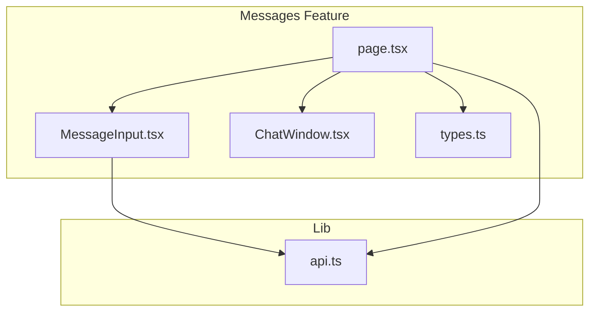
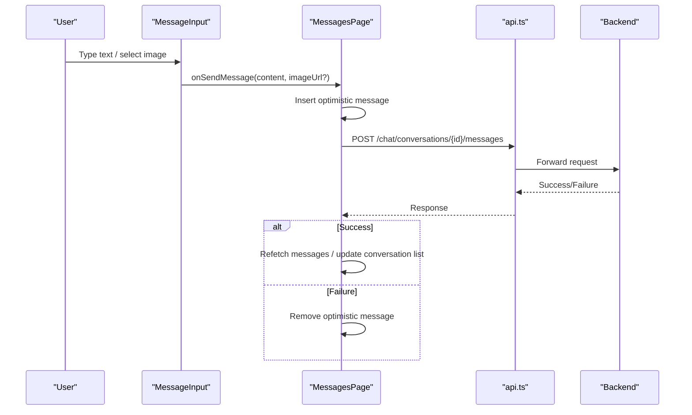
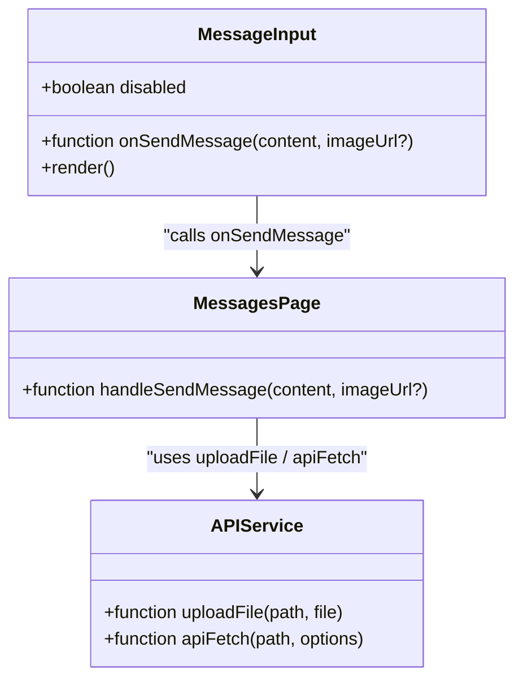
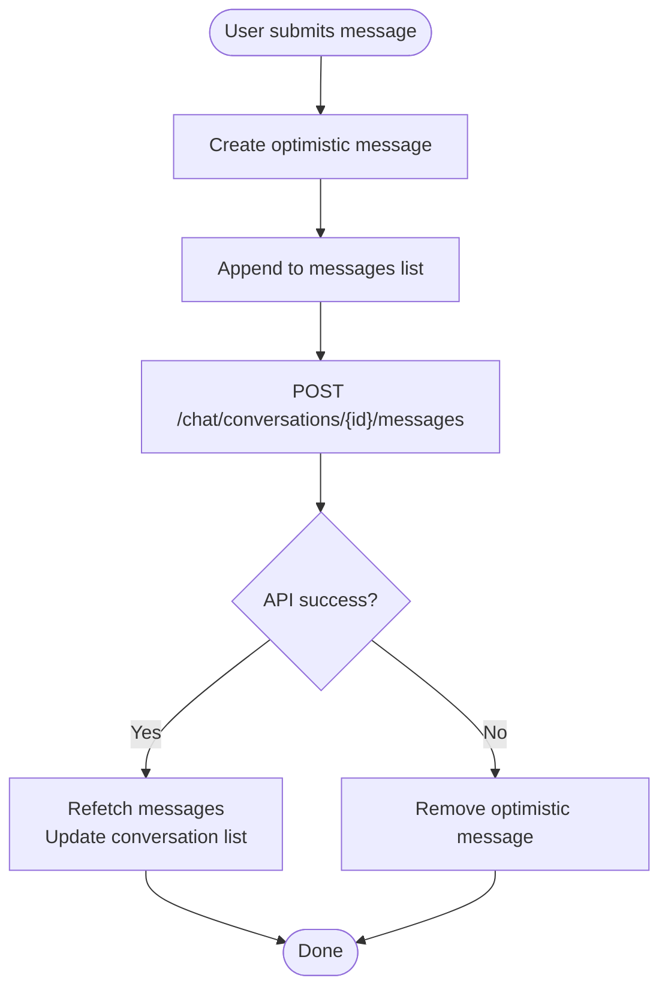
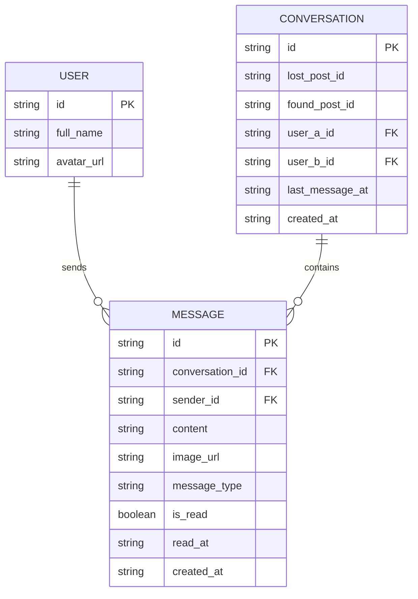
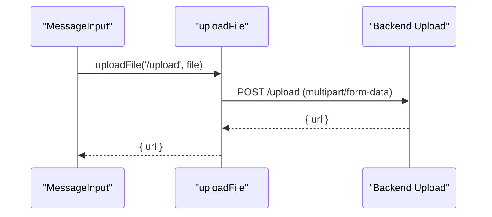
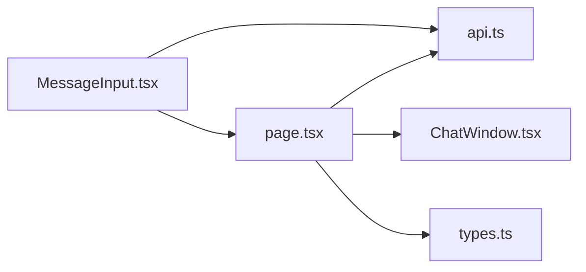

# Message Input

<cite>
**Referenced Files in This Document**
- [MessageInput.tsx](file://frontend/app/messages/MessageInput.tsx)
- [page.tsx](file://frontend/app/messages/page.tsx)
- [types.ts](file://frontend/app/messages/types.ts)
- [api.ts](file://frontend/app/lib/api.ts)
- [ChatWindow.tsx](file://frontend/app/messages/ChatWindow.tsx)
</cite>

## Table of Contents
1. [Introduction](#introduction)
2. [Project Structure](#project-structure)
3. [Core Components](#core-components)
4. [Architecture Overview](#architecture-overview)
5. [Detailed Component Analysis](#detailed-component-analysis)
6. [Dependency Analysis](#dependency-analysis)
7. [Performance Considerations](#performance-considerations)
8. [Troubleshooting Guide](#troubleshooting-guide)
9. [Conclusion](#conclusion)

## Introduction
This document provides comprehensive documentation for the MessageInput component responsible for composing and submitting user messages in the chat module. It covers text input behavior, image attachment flow, emoji support, validation, send button state, keyboard shortcuts, auto-resize considerations, input state management, optimistic UI during send, error handling and retry strategies, accessibility and mobile responsiveness, and performance optimizations. The component integrates with the broader chat page and backend APIs for message creation and file uploads.

## Project Structure
The MessageInput component resides in the messages feature area alongside supporting types, API helpers, and the chat page that orchestrates message sending and rendering.

**Diagram sources**
- [MessageInput.tsx:1-117](file://frontend/app/messages/MessageInput.tsx#L1-L117)
- [page.tsx:1-180](file://frontend/app/messages/page.tsx#L1-L180)
- [ChatWindow.tsx:1-348](file://frontend/app/messages/ChatWindow.tsx#L1-L348)
- [types.ts:1-51](file://frontend/app/messages/types.ts#L1-L51)
- [api.ts:1-83](file://frontend/app/lib/api.ts#L1-L83)

**Section sources**
- [MessageInput.tsx:1-117](file://frontend/app/messages/MessageInput.tsx#L1-L117)
- [page.tsx:1-180](file://frontend/app/messages/page.tsx#L1-L180)
- [types.ts:1-51](file://frontend/app/messages/types.ts#L1-L51)
- [api.ts:1-83](file://frontend/app/lib/api.ts#L1-L83)

## Core Components
- MessageInput: Handles text input, image selection, Enter-to-send, and invokes the parent’s send handler. It manages local input state and upload/send states, disables controls appropriately, and renders a send button with dynamic enabled state.
- page.tsx: Provides the chat page container, maintains conversation and message lists, sets up Supabase realtime subscriptions, and implements optimistic UI for message sends.
- types.ts: Defines Message, Conversation, User, and Trigger interfaces used across the chat UI and API integrations.
- api.ts: Supplies apiFetch and uploadFile helpers for authenticated requests and multipart uploads.

Key responsibilities:
- Text input: controlled state updates, Enter key handling, disabled states.
- Image attachments: file picker, upload via uploadFile, optimistic send with image URL.
- Validation: prevents empty sends, guards against concurrent operations.
- Optimistic UI: inserts temporary message immediately, reverts on failure.
- Error handling: logs failures, alerts on upload errors, removes optimistic message on send failure.
- Accessibility and responsiveness: uses semantic inputs, disabled states, and responsive layout tokens.

**Section sources**
- [MessageInput.tsx:9-117](file://frontend/app/messages/MessageInput.tsx#L9-L117)
- [page.tsx:109-148](file://frontend/app/messages/page.tsx#L109-L148)
- [types.ts:23-36](file://frontend/app/messages/types.ts#L23-L36)
- [api.ts:48-82](file://frontend/app/lib/api.ts#L48-L82)

## Architecture Overview
The MessageInput component is a leaf UI element invoked by the chat page. It delegates message sending to the parent, which implements optimistic UI and API communication. Image uploads are handled via a dedicated upload helper.

**Diagram sources**
- [MessageInput.tsx:15-27](file://frontend/app/messages/MessageInput.tsx#L15-L27)
- [page.tsx:109-148](file://frontend/app/messages/page.tsx#L109-L148)
- [api.ts:12-43](file://frontend/app/lib/api.ts#L12-L43)

## Detailed Component Analysis

### MessageInput Component
Responsibilities:
- Manage local input state for text content.
- Handle Enter key to submit (Shift+Enter for newline is not implemented).
- Manage upload state for images and disable controls during uploads.
- Invoke onSendMessage with either text or image URL.
- Render a send button whose enabled state depends on content presence, disabled prop, and send/upload states.

Behavior highlights:
- Controlled input: value and onChange update local state.
- Keyboard shortcut: Enter triggers send; Shift+Enter is not handled.
- Image upload: hidden file input opened on click; uploadFile helper posts to /upload; on success, calls onSendMessage with image URL.
- Disabled states: component-wide disabled prop, per-control disabled flags for buttons and input.
- Visual feedback: upload icon rotates during upload; send button scales on hover/active; disabled opacity applied to container.

Accessibility and UX:
- Uses native input and button elements with proper disabled attributes.
- Placeholder text adapts to disabled state.
- Color tokens and CSS variables ensure theme-aware appearance.

Validation and error handling:
- Prevents empty sends and concurrent operations.
- Upload errors are surfaced via alert; optimistic send errors revert the temporary message.

Optimistic UI:
- Implemented in the parent (MessagesPage) upon invoking onSendMessage.

**Section sources**
- [MessageInput.tsx:9-117](file://frontend/app/messages/MessageInput.tsx#L9-L117)

#### Class Model

**Diagram sources**
- [MessageInput.tsx:4-7](file://frontend/app/messages/MessageInput.tsx#L4-L7)
- [page.tsx:109-148](file://frontend/app/messages/page.tsx#L109-L148)
- [api.ts:48-82](file://frontend/app/lib/api.ts#L48-L82)

### Parent Page Integration (Optimistic UI)
The chat page composes the optimistic UI around message sends:
- Creates a temporary message with a client-generated ID.
- Immediately appends it to the message list.
- Calls the backend to persist the message.
- On success, refetches messages and updates conversation previews.
- On failure, removes the optimistic message.

**Diagram sources**
- [page.tsx:109-148](file://frontend/app/messages/page.tsx#L109-L148)

**Section sources**
- [page.tsx:109-148](file://frontend/app/messages/page.tsx#L109-L148)

### Types and Data Contracts
Message and Conversation types define the shape of data exchanged between the UI and backend.

**Diagram sources**
- [types.ts:1-51](file://frontend/app/messages/types.ts#L1-L51)

**Section sources**
- [types.ts:1-51](file://frontend/app/messages/types.ts#L1-L51)

### API Helpers
- apiFetch: Adds JWT token and credentials, handles 401 redirects, parses JSON, throws on non-OK responses.
- uploadFile: Posts multipart/form-data to /upload, extracts URL from response, handles 401 redirects, and throws on non-OK responses.

**Diagram sources**
- [api.ts:48-82](file://frontend/app/lib/api.ts#L48-L82)
- [MessageInput.tsx:36-56](file://frontend/app/messages/MessageInput.tsx#L36-L56)

**Section sources**
- [api.ts:12-82](file://frontend/app/lib/api.ts#L12-L82)
- [MessageInput.tsx:36-56](file://frontend/app/messages/MessageInput.tsx#L36-L56)

## Dependency Analysis
MessageInput depends on:
- Parent-provided onSendMessage callback.
- uploadFile helper for image uploads.
- CSS variables and tokens for theming.

The chat page depends on:
- Supabase realtime for live message updates.
- apiFetch for conversation/message queries and posting.
- Optimistic UI to improve perceived latency.

**Diagram sources**
- [MessageInput.tsx:1-117](file://frontend/app/messages/MessageInput.tsx#L1-L117)
- [page.tsx:1-180](file://frontend/app/messages/page.tsx#L1-L180)
- [ChatWindow.tsx:1-348](file://frontend/app/messages/ChatWindow.tsx#L1-L348)
- [types.ts:1-51](file://frontend/app/messages/types.ts#L1-L51)
- [api.ts:1-83](file://frontend/app/lib/api.ts#L1-L83)

**Section sources**
- [MessageInput.tsx:1-117](file://frontend/app/messages/MessageInput.tsx#L1-L117)
- [page.tsx:1-180](file://frontend/app/messages/page.tsx#L1-L180)
- [api.ts:1-83](file://frontend/app/lib/api.ts#L1-L83)

## Performance Considerations
- Controlled input: Local state updates are O(1) per keystroke; keep input unthrottled for responsiveness.
- Optimistic UI: Reduces perceived latency; ensure removal on failure to prevent stale UI.
- Auto-scroll: ChatWindow uses requestAnimationFrame to scroll to bottom after message list updates; avoid unnecessary reflows by minimizing DOM churn.
- Image uploads: Use browser-native FormData; avoid large buffers in memory; consider progress indicators if needed.
- Disabled states: Prevent redundant work when disabled or during uploads/sends.
- CSS variables: Theming via CSS variables avoids costly re-renders.

[No sources needed since this section provides general guidance]

## Troubleshooting Guide
Common issues and resolutions:
- Empty send attempts: The component checks for trimmed content and disabled states; ensure the parent passes a valid selected conversation ID.
- Upload failures: uploadFile throws on non-OK responses; the component alerts the user and resets the file input; verify backend /upload endpoint availability and authentication.
- Send failures: The parent removes the optimistic message on error; confirm network connectivity and backend health.
- Keyboard shortcuts: Enter sends; Shift+Enter is not implemented for newlines; adjust expectations accordingly.
- Accessibility: Buttons reflect disabled states; ensure screen readers announce disabled states via aria-disabled or native disabled attributes.

**Section sources**
- [MessageInput.tsx:15-27](file://frontend/app/messages/MessageInput.tsx#L15-L27)
- [MessageInput.tsx:36-56](file://frontend/app/messages/MessageInput.tsx#L36-L56)
- [page.tsx:142-147](file://frontend/app/messages/page.tsx#L142-L147)

## Conclusion
MessageInput provides a focused, accessible, and responsive input surface for composing and sending messages. It integrates seamlessly with the chat page’s optimistic UI and the API helpers for robust message persistence and image uploads. By leveraging controlled state, guarded operations, and clear error handling, it delivers a smooth user experience across desktop and mobile contexts.