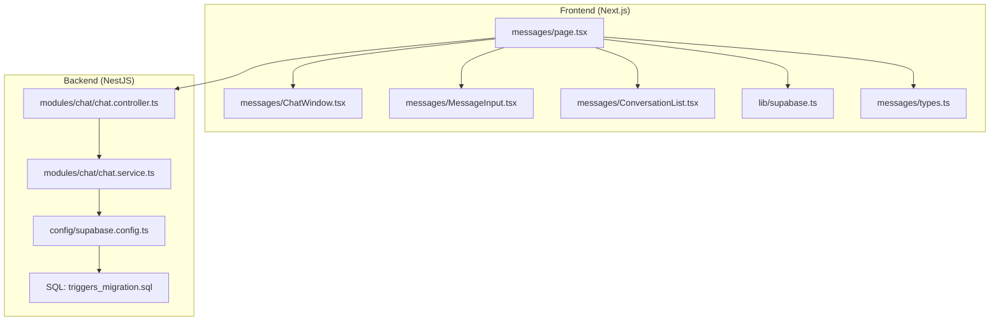
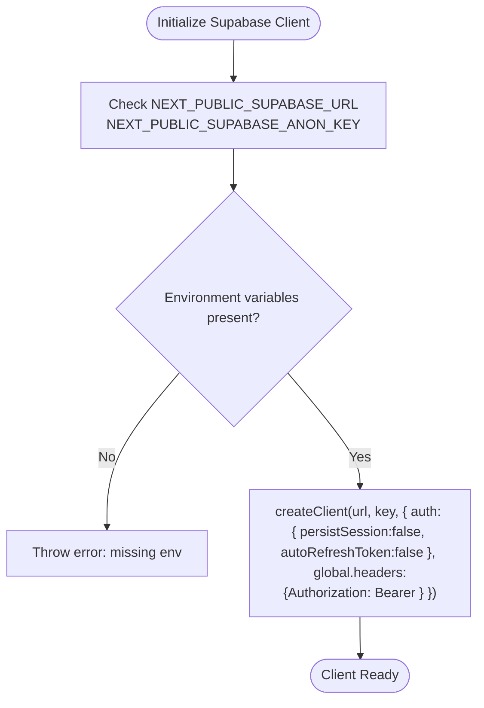
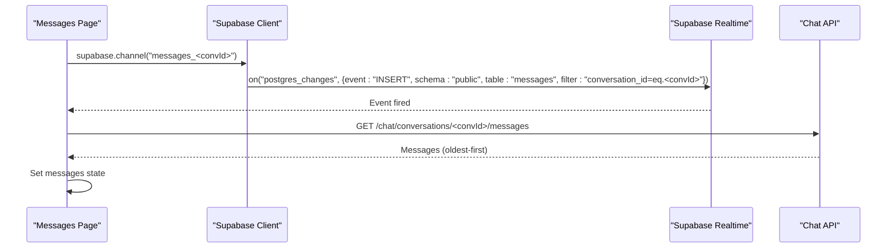
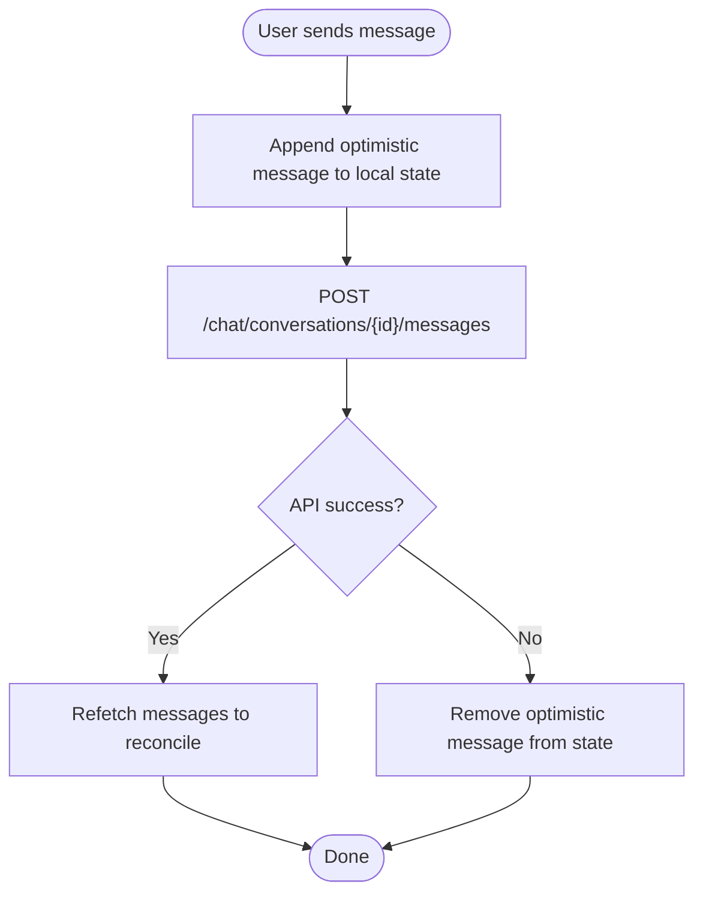
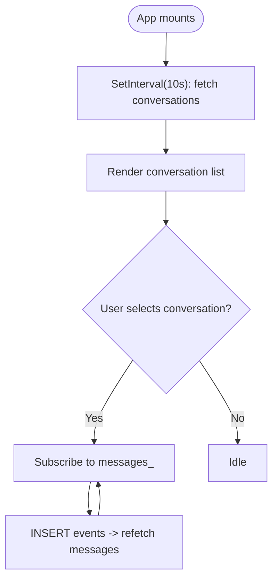
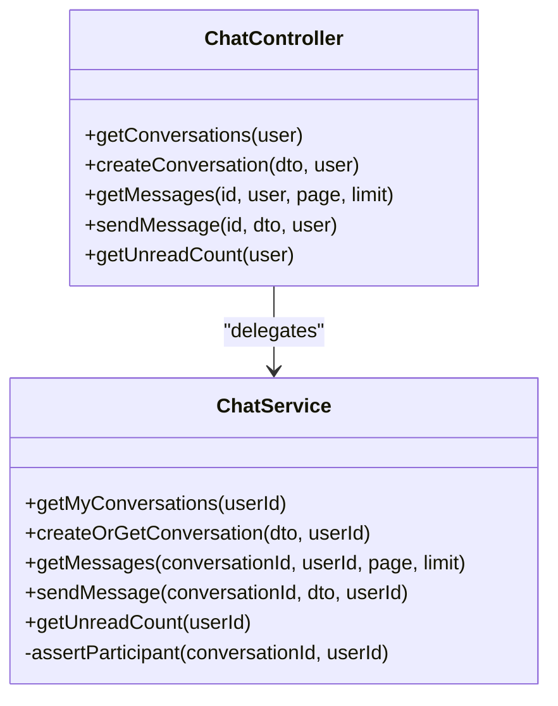
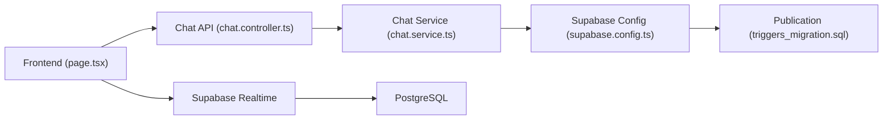

# Real-time Integration

<cite>
**Referenced Files in This Document**
- [supabase.ts](file://frontend/app/lib/supabase.ts)
- [page.tsx](file://frontend/app/messages/page.tsx)
- [ChatWindow.tsx](file://frontend/app/messages/ChatWindow.tsx)
- [MessageInput.tsx](file://frontend/app/messages/MessageInput.tsx)
- [ConversationList.tsx](file://frontend/app/messages/ConversationList.tsx)
- [types.ts](file://frontend/app/messages/types.ts)
- [chat.service.ts](file://backend/src/modules/chat/chat.service.ts)
- [chat.controller.ts](file://backend/src/modules/chat/chat.controller.ts)
- [supabase.config.ts](file://backend/src/config/supabase.config.ts)
- [triggers_migration.sql](file://backend/sql/triggers_migration.sql)
</cite>

## Table of Contents
1. [Introduction](#introduction)
2. [Project Structure](#project-structure)
3. [Core Components](#core-components)
4. [Architecture Overview](#architecture-overview)
5. [Detailed Component Analysis](#detailed-component-analysis)
6. [Dependency Analysis](#dependency-analysis)
7. [Performance Considerations](#performance-considerations)
8. [Troubleshooting Guide](#troubleshooting-guide)
9. [Conclusion](#conclusion)

## Introduction
This document explains the real-time messaging infrastructure built on Supabase Realtime. It covers WebSocket connection setup, channel subscription management, event handling for message synchronization, and the hybrid approach combining polling and real-time updates. It also details optimistic UI, local state management, automatic synchronization with server state, channel naming conventions, event filtering, connection lifecycle management, error handling, reconnection strategies, and graceful degradation when real-time features are unavailable.

## Project Structure
The real-time messaging spans the frontend Next.js application and the backend NestJS service:
- Frontend: Realtime subscriptions, optimistic UI, polling fallbacks, and UI components.
- Backend: Chat APIs, Supabase client configuration, and database publication for triggers.



**Diagram sources**
- [page.tsx:1-180](file://frontend/app/messages/page.tsx#L1-L180)
- [supabase.ts:1-18](file://frontend/app/lib/supabase.ts#L1-L18)
- [ChatWindow.tsx:1-348](file://frontend/app/messages/ChatWindow.tsx#L1-L348)
- [MessageInput.tsx:1-117](file://frontend/app/messages/MessageInput.tsx#L1-L117)
- [ConversationList.tsx:1-103](file://frontend/app/messages/ConversationList.tsx#L1-L103)
- [types.ts:1-51](file://frontend/app/messages/types.ts#L1-L51)
- [chat.controller.ts:1-50](file://backend/src/modules/chat/chat.controller.ts#L1-L50)
- [chat.service.ts:1-151](file://backend/src/modules/chat/chat.service.ts#L1-L151)
- [supabase.config.ts:1-25](file://backend/src/config/supabase.config.ts#L1-L25)
- [triggers_migration.sql:1-338](file://backend/sql/triggers_migration.sql#L1-L338)

**Section sources**
- [page.tsx:1-180](file://frontend/app/messages/page.tsx#L1-L180)
- [supabase.ts:1-18](file://frontend/app/lib/supabase.ts#L1-L18)
- [chat.controller.ts:1-50](file://backend/src/modules/chat/chat.controller.ts#L1-L50)
- [chat.service.ts:1-151](file://backend/src/modules/chat/chat.service.ts#L1-L151)
- [supabase.config.ts:1-25](file://backend/src/config/supabase.config.ts#L1-L25)
- [triggers_migration.sql:1-338](file://backend/sql/triggers_migration.sql#L1-L338)

## Core Components
- Supabase client initialization with per-request tokens and disabled session persistence for predictable auth behavior.
- Realtime subscription to the messages table with event filtering scoped to a specific conversation.
- Optimistic UI pattern for immediate message rendering followed by reconciliation on failure or refresh.
- Hybrid strategy: Realtime for live updates, polling for conversation lists and auxiliary resources.
- Local state management for messages and conversations, with UI-driven updates and controlled cleanup.

**Section sources**
- [supabase.ts:1-18](file://frontend/app/lib/supabase.ts#L1-L18)
- [page.tsx:75-106](file://frontend/app/messages/page.tsx#L75-L106)
- [chat.service.ts:68-126](file://backend/src/modules/chat/chat.service.ts#L68-L126)

## Architecture Overview
The real-time messaging architecture integrates frontend Supabase clients with backend chat endpoints. The frontend subscribes to Supabase Realtime events for new messages and performs optimistic updates. The backend exposes REST endpoints for conversations and messages, and the database publishes changes for triggers to support related workflows.

```mermaid
sequenceDiagram
participant UI as "Messages Page (page.tsx)"
participant SupaFE as "Supabase Client (lib/supabase.ts)"
participant Realtime as "Supabase Realtime"
participant API as "Chat Controller (chat.controller.ts)"
participant Service as "Chat Service (chat.service.ts)"
participant DB as "PostgreSQL"
UI->>SupaFE : Initialize client with access token
UI->>SupaFE : Create channel "messages_<conversationId>"
SupaFE->>Realtime : Subscribe to "postgres_changes" INSERT on "messages"
Realtime-->>UI : Event callback on insert
UI->>API : Fetch messages for <conversationId>
API->>Service : getMessages(conversationId, userId)
Service->>DB : SELECT messages with relations
DB-->>Service : Rows
Service-->>API : Messages
API-->>UI : Messages payload
UI->>UI : Update local messages state
UI->>API : POST /chat/conversations/<id>/messages
API->>Service : sendMessage(conversationId, payload, userId)
Service->>DB : INSERT message
DB-->>Service : New row
Service-->>API : Message
API-->>UI : Message
UI->>UI : Optimistically append to messages
Note over UI,Realtime : Realtime will trigger again; UI refetches to reconcile
```

**Diagram sources**
- [page.tsx:75-106](file://frontend/app/messages/page.tsx#L75-L106)
- [supabase.ts:1-18](file://frontend/app/lib/supabase.ts#L1-L18)
- [chat.controller.ts:27-42](file://backend/src/modules/chat/chat.controller.ts#L27-L42)
- [chat.service.ts:102-126](file://backend/src/modules/chat/chat.service.ts#L102-L126)

## Detailed Component Analysis

### Supabase Client Initialization
- The frontend creates a Supabase client per request with explicit Authorization header and disabled session persistence to avoid conflicts.
- The backend initializes a Supabase client for server-side operations using environment variables and logs successful connection.



**Diagram sources**
- [supabase.ts:1-18](file://frontend/app/lib/supabase.ts#L1-L18)
- [supabase.config.ts:7-23](file://backend/src/config/supabase.config.ts#L7-L23)

**Section sources**
- [supabase.ts:1-18](file://frontend/app/lib/supabase.ts#L1-L18)
- [supabase.config.ts:1-25](file://backend/src/config/supabase.config.ts#L1-L25)

### Realtime Subscription and Event Handling
- The frontend subscribes to a channel named after the active conversation ID.
- Event filtering restricts updates to inserts where the conversation ID matches.
- On event receipt, the UI refetches messages to ensure full relations and correct ordering.



**Diagram sources**
- [page.tsx:89-101](file://frontend/app/messages/page.tsx#L89-L101)

**Section sources**
- [page.tsx:75-106](file://frontend/app/messages/page.tsx#L75-L106)

### Optimistic UI and Local State Management
- On send, the UI immediately appends a temporary message with a client-generated ID.
- After successful API submission, the UI refetches messages and relies on Realtime to keep the list fresh.
- On failure, the UI removes the optimistic message to maintain consistency with server state.



**Diagram sources**
- [page.tsx:110-148](file://frontend/app/messages/page.tsx#L110-L148)

**Section sources**
- [page.tsx:109-148](file://frontend/app/messages/page.tsx#L109-L148)

### Conversation Polling and Hybrid Strategy
- Conversation list polling runs every 10 seconds to keep last messages and counts up to date.
- Message polling is not used; instead, Realtime drives live updates.
- Triggers (auxiliary resource) are polled separately due to permissions constraints around the triggers table.



**Diagram sources**
- [page.tsx:54-61](file://frontend/app/messages/page.tsx#L54-L61)
- [page.tsx:75-106](file://frontend/app/messages/page.tsx#L75-L106)
- [ChatWindow.tsx:32-57](file://frontend/app/messages/ChatWindow.tsx#L32-L57)

**Section sources**
- [page.tsx:54-61](file://frontend/app/messages/page.tsx#L54-L61)
- [ChatWindow.tsx:31-57](file://frontend/app/messages/ChatWindow.tsx#L31-L57)

### Channel Naming Conventions and Event Filtering
- Channel naming: messages_<conversationId>.
- Event filtering: postgres_changes INSERT on public.messages where conversation_id equals the selected conversation ID.
- This ensures minimal bandwidth and precise scoping to the active chat.

**Section sources**
- [page.tsx:89-95](file://frontend/app/messages/page.tsx#L89-L95)

### Connection Lifecycle Management
- Channels are created when a conversation is selected and removed when unmounted to prevent leaks.
- Access tokens are read from local storage and attached to the Supabase client for authenticated requests.

**Section sources**
- [page.tsx:85-106](file://frontend/app/messages/page.tsx#L85-L106)
- [supabase.ts:7-17](file://frontend/app/lib/supabase.ts#L7-L17)

### Backend Chat Endpoints and Data Model
- Controllers expose endpoints for conversations, messages, and unread counts.
- Services encapsulate database operations, including participant checks, pagination, and marking messages as read.
- Types define the shape of conversations and messages used across the UI.



**Diagram sources**
- [chat.controller.ts:1-50](file://backend/src/modules/chat/chat.controller.ts#L1-L50)
- [chat.service.ts:1-151](file://backend/src/modules/chat/chat.service.ts#L1-L151)

**Section sources**
- [chat.controller.ts:1-50](file://backend/src/modules/chat/chat.controller.ts#L1-L50)
- [chat.service.ts:12-136](file://backend/src/modules/chat/chat.service.ts#L12-L136)
- [types.ts:7-36](file://frontend/app/messages/types.ts#L7-L36)

### Triggers Publication and Realtime Scope
- The triggers table is added to the supabase_realtime publication, enabling Realtime events for trigger-related changes.
- This supports auxiliary workflows (e.g., handover requests) that complement messaging.

**Section sources**
- [triggers_migration.sql:338-338](file://backend/sql/triggers_migration.sql#L338-L338)

## Dependency Analysis
- Frontend depends on:
  - Supabase client library for Realtime and authenticated requests.
  - Chat API endpoints for CRUD operations on conversations and messages.
  - Local storage for access tokens.
- Backend depends on:
  - Supabase client configured with service or anonymous keys.
  - PostgreSQL with proper publications for Realtime.
  - Database functions and tables supporting triggers and notifications.



**Diagram sources**
- [page.tsx:1-180](file://frontend/app/messages/page.tsx#L1-L180)
- [chat.controller.ts:1-50](file://backend/src/modules/chat/chat.controller.ts#L1-L50)
- [chat.service.ts:1-151](file://backend/src/modules/chat/chat.service.ts#L1-L151)
- [supabase.config.ts:1-25](file://backend/src/config/supabase.config.ts#L1-L25)
- [triggers_migration.sql:338-338](file://backend/sql/triggers_migration.sql#L338-L338)

**Section sources**
- [page.tsx:1-180](file://frontend/app/messages/page.tsx#L1-L180)
- [chat.controller.ts:1-50](file://backend/src/modules/chat/chat.controller.ts#L1-L50)
- [chat.service.ts:1-151](file://backend/src/modules/chat/chat.service.ts#L1-L151)
- [supabase.config.ts:1-25](file://backend/src/config/supabase.config.ts#L1-L25)
- [triggers_migration.sql:1-338](file://backend/sql/triggers_migration.sql#L1-L338)

## Performance Considerations
- Realtime subscriptions minimize latency for new messages; use event filtering to reduce unnecessary reloads.
- Polling for conversations balances freshness with network usage; adjust intervals based on traffic and device battery impact.
- Optimistic UI reduces perceived latency; ensure robust rollback on errors to prevent stale state.
- Backend queries order and paginate efficiently; avoid selecting large relations unnecessarily.

## Troubleshooting Guide
- Connection failures:
  - Verify environment variables for Supabase URL and keys on both frontend and backend.
  - Confirm the Supabase client is initialized with a valid access token for authenticated channels.
- Reconnection strategies:
  - Rely on the underlying Supabase client’s internal retry/backoff; avoid manual reconnect loops in the UI.
  - On unmount, remove channels to prevent dangling subscriptions.
- Graceful degradation:
  - If Realtime is unavailable, continue using polling for conversations and rely on API calls for messages.
  - For resources like triggers, continue polling when Realtime permissions are insufficient.
- Error handling:
  - On send failure, remove the optimistic message to keep UI state consistent.
  - Log and surface user-friendly errors for failed operations.

**Section sources**
- [supabase.ts:1-18](file://frontend/app/lib/supabase.ts#L1-L18)
- [page.tsx:142-148](file://frontend/app/messages/page.tsx#L142-L148)
- [ChatWindow.tsx:31-57](file://frontend/app/messages/ChatWindow.tsx#L31-L57)

## Conclusion
The messaging infrastructure combines Supabase Realtime for live updates with a pragmatic hybrid model: polling for conversations and auxiliary resources, and optimistic UI for responsive interactions. Clear channel naming, precise event filtering, and disciplined lifecycle management ensure reliability. Robust error handling and graceful degradation preserve usability when real-time features are unavailable.