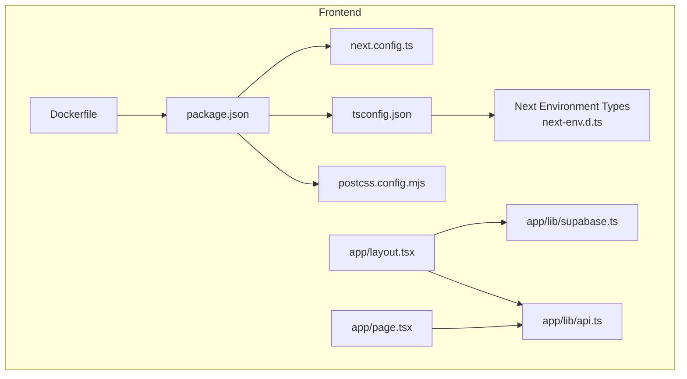
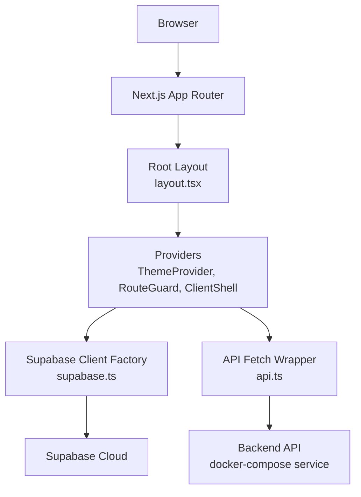
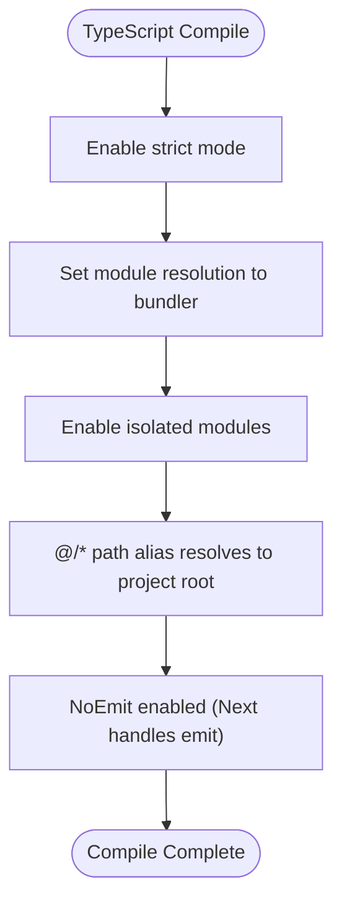
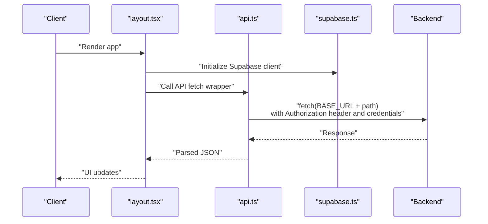
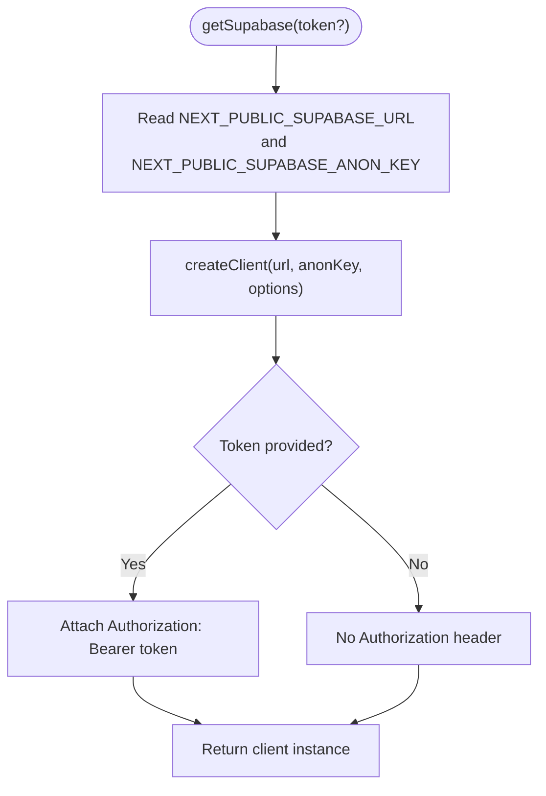
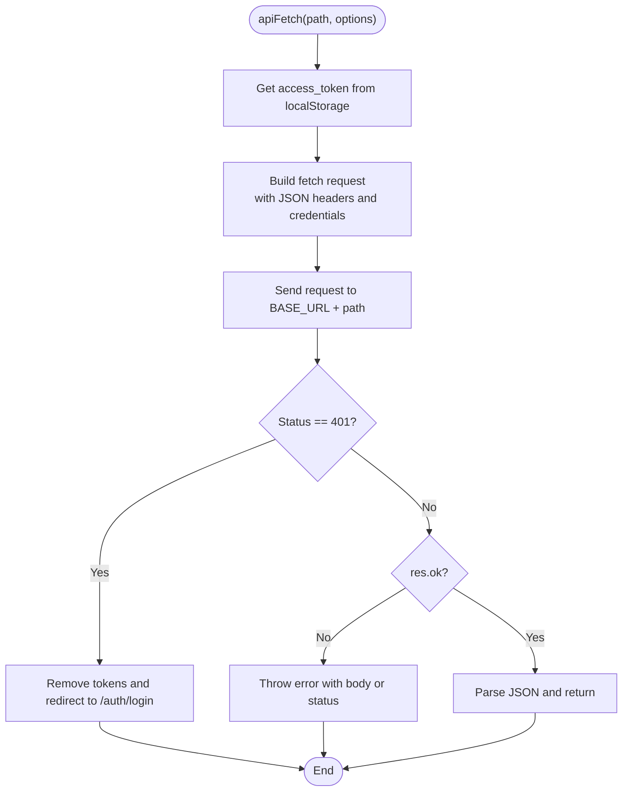
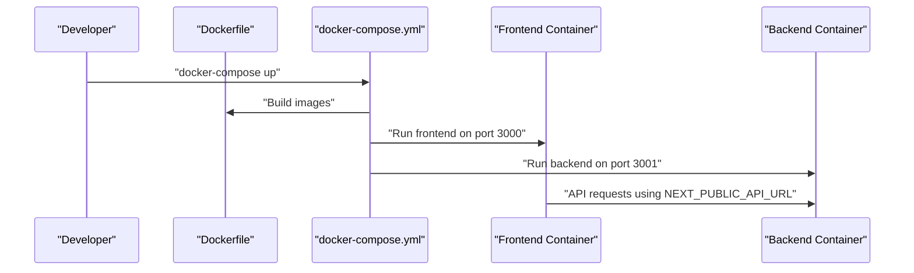
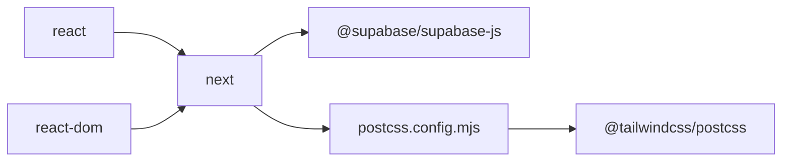

# Configuration and Setup

<cite>
**Referenced Files in This Document**
- [next.config.ts](file://frontend/next.config.ts)
- [tsconfig.json](file://frontend/tsconfig.json)
- [package.json](file://frontend/package.json)
- [next-env.d.ts](file://frontend/next-env.d.ts)
- [postcss.config.mjs](file://frontend/postcss.config.mjs)
- [Dockerfile](file://frontend/Dockerfile)
- [docker-compose.yml](file://docker-compose.yml)
- [supabase.ts](file://frontend/app/lib/supabase.ts)
- [api.ts](file://frontend/app/lib/api.ts)
- [layout.tsx](file://frontend/app/layout.tsx)
- [page.tsx](file://frontend/app/page.tsx)
</cite>

## Table of Contents
1. [Introduction](#introduction)
2. [Project Structure](#project-structure)
3. [Core Components](#core-components)
4. [Architecture Overview](#architecture-overview)
5. [Detailed Component Analysis](#detailed-component-analysis)
6. [Dependency Analysis](#dependency-analysis)
7. [Performance Considerations](#performance-considerations)
8. [Troubleshooting Guide](#troubleshooting-guide)
9. [Conclusion](#conclusion)

## Introduction
This document explains the frontend configuration and setup for the Next.js application. It covers Next.js configuration, TypeScript setup, path aliases, environment variable handling, Supabase client initialization, API configuration patterns, build and deployment configuration, and performance considerations. It also highlights differences between development and production environments and provides troubleshooting guidance for common setup issues.

## Project Structure
The frontend is organized under the frontend directory and follows Next.js App Router conventions. Key configuration files include Next.js configuration, TypeScript configuration, PostCSS/Tailwind configuration, and Docker-based build/deployment artifacts. Environment variables are consumed via Next.js runtime helpers and process environment variables.

**Diagram sources**
- [package.json:1-29](file://frontend/package.json#L1-L29)
- [next.config.ts:1-8](file://frontend/next.config.ts#L1-L8)
- [tsconfig.json:1-35](file://frontend/tsconfig.json#L1-L35)
- [next-env.d.ts:1-7](file://frontend/next-env.d.ts#L1-L7)
- [postcss.config.mjs:1-8](file://frontend/postcss.config.mjs#L1-L8)
- [supabase.ts:1-18](file://frontend/app/lib/supabase.ts#L1-L18)
- [api.ts:1-83](file://frontend/app/lib/api.ts#L1-L83)
- [layout.tsx:1-44](file://frontend/app/layout.tsx#L1-L44)
- [page.tsx:1-24](file://frontend/app/page.tsx#L1-L24)
- [Dockerfile:1-14](file://frontend/Dockerfile#L1-L14)

**Section sources**
- [package.json:1-29](file://frontend/package.json#L1-L29)
- [next.config.ts:1-8](file://frontend/next.config.ts#L1-L8)
- [tsconfig.json:1-35](file://frontend/tsconfig.json#L1-L35)
- [next-env.d.ts:1-7](file://frontend/next-env.d.ts#L1-L7)
- [postcss.config.mjs:1-8](file://frontend/postcss.config.mjs#L1-L8)
- [Dockerfile:1-14](file://frontend/Dockerfile#L1-L14)

## Core Components
- Next.js configuration: The configuration file is present and ready for customization. Currently, it includes a comment indicating where to place options.
- TypeScript configuration: Strict mode is enabled, module resolution uses bundler, isolated modules are enabled, and path aliases are configured via the paths compiler option.
- Environment types: Next.js environment typings are included via next-env.d.ts.
- PostCSS/Tailwind: Tailwind plugin is configured via PostCSS.
- Supabase client: A factory-style client initializer supports per-request tokens and disables session persistence to avoid conflicts.
- API client: A wrapper around fetch injects Authorization headers, handles credentials, and redirects on 401.
- Build and deployment: Dockerfile builds and starts the Next.js app; docker-compose orchestrates frontend/backend/postgres/redis.

**Section sources**
- [next.config.ts:1-8](file://frontend/next.config.ts#L1-L8)
- [tsconfig.json:1-35](file://frontend/tsconfig.json#L1-L35)
- [next-env.d.ts:1-7](file://frontend/next-env.d.ts#L1-L7)
- [postcss.config.mjs:1-8](file://frontend/postcss.config.mjs#L1-L8)
- [supabase.ts:1-18](file://frontend/app/lib/supabase.ts#L1-L18)
- [api.ts:1-83](file://frontend/app/lib/api.ts#L1-L83)
- [Dockerfile:1-14](file://frontend/Dockerfile#L1-L14)
- [docker-compose.yml:1-61](file://docker-compose.yml#L1-L61)

## Architecture Overview
The frontend integrates Supabase for authentication and real-time features and communicates with the backend API using a typed fetch wrapper. The layout composes theme, route protection, and client-side shell providers. Docker and docker-compose define the build and runtime environment.

**Diagram sources**
- [layout.tsx:1-44](file://frontend/app/layout.tsx#L1-L44)
- [supabase.ts:1-18](file://frontend/app/lib/supabase.ts#L1-L18)
- [api.ts:1-83](file://frontend/app/lib/api.ts#L1-L83)
- [docker-compose.yml:1-61](file://docker-compose.yml#L1-L61)

## Detailed Component Analysis

### Next.js Configuration
- Purpose: Centralized Next.js configuration file for build and runtime options.
- Current state: Empty configuration object with a placeholder comment; ready for extension.
- Recommendations:
  - Add experimental flags if needed (e.g., instrumentation hooks).
  - Configure output traces or custom headers if required by backend integration.
  - Keep the configuration minimal until explicit needs arise.

**Section sources**
- [next.config.ts:1-8](file://frontend/next.config.ts#L1-L8)

### TypeScript Configuration and Path Aliases
- Compiler options:
  - Strict mode enabled for safer type checking.
  - Module resolution set to bundler for modern toolchains.
  - Isolated modules enabled for fast incremental builds.
  - JSX handled via react-jsx.
  - Path alias @/* mapped to project root for ergonomic imports.
- Includes/excludes:
  - Includes Next.js environment types and TypeScript sources.
  - Excludes node_modules globally.

**Diagram sources**
- [tsconfig.json:1-35](file://frontend/tsconfig.json#L1-L35)

**Section sources**
- [tsconfig.json:1-35](file://frontend/tsconfig.json#L1-L35)

### Environment Variable Handling
- Next.js runtime:
  - Next environment types are declared to integrate with Next.js features.
- Frontend API client:
  - NEXT_PUBLIC_API_URL controls the base URL for API requests.
  - Credentials are sent with requests to support HTTP-only cookies.
- Supabase client:
  - NEXT_PUBLIC_SUPABASE_URL and NEXT_PUBLIC_SUPABASE_ANON_KEY are used for client initialization.
  - Token-based overrides are supported via a factory pattern for per-request scenarios.
- Local development:
  - docker-compose loads environment variables from a local environment file for the frontend service.

**Diagram sources**
- [layout.tsx:1-44](file://frontend/app/layout.tsx#L1-L44)
- [api.ts:1-83](file://frontend/app/lib/api.ts#L1-L83)
- [supabase.ts:1-18](file://frontend/app/lib/supabase.ts#L1-L18)

**Section sources**
- [next-env.d.ts:1-7](file://frontend/next-env.d.ts#L1-L7)
- [api.ts:1-83](file://frontend/app/lib/api.ts#L1-L83)
- [supabase.ts:1-18](file://frontend/app/lib/supabase.ts#L1-L18)
- [docker-compose.yml:16-25](file://docker-compose.yml#L16-L25)

### Supabase Client Initialization
- Initialization pattern:
  - Uses a factory function to create a client instance with optional token override.
  - Disables session persistence and auto-refresh to prevent conflicts in multi-client usage.
  - Attaches Authorization header when a token is provided.
- Environment variables:
  - Reads NEXT_PUBLIC_SUPABASE_URL and NEXT_PUBLIC_SUPABASE_ANON_KEY.
  - Falls back to placeholders when variables are missing.

**Diagram sources**
- [supabase.ts:1-18](file://frontend/app/lib/supabase.ts#L1-L18)

**Section sources**
- [supabase.ts:1-18](file://frontend/app/lib/supabase.ts#L1-L18)

### API Configuration Patterns
- Base URL:
  - NEXT_PUBLIC_API_URL defines the backend base URL; defaults to a localhost address when undefined.
- Authentication:
  - Injects Authorization header using a Bearer token retrieved from localStorage.
  - Supports both localStorage tokens and HTTP-only cookies via credentials inclusion.
- Error handling:
  - On 401, clears tokens and redirects to the login page.
  - Throws errors for non-OK responses with informative messages.
- Uploads:
  - Provides a dedicated uploadFile helper using FormData and extracts a URL from the response.

**Diagram sources**
- [api.ts:1-83](file://frontend/app/lib/api.ts#L1-L83)

**Section sources**
- [api.ts:1-83](file://frontend/app/lib/api.ts#L1-L83)

### Build and Deployment Configuration
- Scripts:
  - dev, build, start, and lint scripts are defined in package.json.
- Dockerfile:
  - Builds the Next.js app and exposes port 3000.
  - Runs the production server using next start.
- docker-compose:
  - Defines frontend and backend services, exposing ports 3000 and 3001 respectively.
  - Loads environment files for backend and frontend services.
  - Orchestrates PostgreSQL and Redis services.

**Diagram sources**
- [Dockerfile:1-14](file://frontend/Dockerfile#L1-L14)
- [docker-compose.yml:1-61](file://docker-compose.yml#L1-L61)

**Section sources**
- [package.json:1-29](file://frontend/package.json#L1-L29)
- [Dockerfile:1-14](file://frontend/Dockerfile#L1-L14)
- [docker-compose.yml:1-61](file://docker-compose.yml#L1-L61)

### Development vs Production Configuration Differences
- Environment variables:
  - NEXT_PUBLIC_* variables are embedded at build time and suitable for frontend consumption.
  - Backend variables are managed separately via backend environment files.
- Runtime behavior:
  - The API wrapper sends credentials to support cookie-based auth in production-like environments.
  - The Supabase client factory allows per-request token overrides for SSR or server-side contexts.
- Build pipeline:
  - Development runs via next dev; production builds via next build and serves via next start.
- Containerization:
  - docker-compose aligns ports and environment files for local development; adjust ports and URLs for production deployments.

**Section sources**
- [api.ts:1-83](file://frontend/app/lib/api.ts#L1-L83)
- [supabase.ts:1-18](file://frontend/app/lib/supabase.ts#L1-L18)
- [package.json:1-29](file://frontend/package.json#L1-L29)
- [docker-compose.yml:16-25](file://docker-compose.yml#L16-L25)

## Dependency Analysis
The frontend depends on Next.js, React, Supabase client, and Tailwind via PostCSS. The layout composes providers and components, while the API and Supabase libraries encapsulate network concerns.

**Diagram sources**
- [package.json:11-27](file://frontend/package.json#L11-L27)
- [postcss.config.mjs:1-8](file://frontend/postcss.config.mjs#L1-L8)

**Section sources**
- [package.json:11-27](file://frontend/package.json#L11-L27)
- [postcss.config.mjs:1-8](file://frontend/postcss.config.mjs#L1-L8)

## Performance Considerations
- Keep Next.js configuration minimal until explicit needs arise.
- Leverage bundler module resolution and isolated modules for faster incremental builds.
- Avoid unnecessary re-renders by structuring providers and guards efficiently in the root layout.
- Use the Supabase client factory sparingly and reuse instances where possible to reduce overhead.
- Prefer static generation and caching strategies where applicable; defer dynamic behavior to client components.

## Troubleshooting Guide
- Missing environment variables:
  - If NEXT_PUBLIC_SUPABASE_URL or NEXT_PUBLIC_SUPABASE_ANON_KEY are undefined, the Supabase client falls back to placeholders. Ensure environment files are loaded via docker-compose.
- API 401 errors:
  - The API wrapper clears tokens and redirects to the login page on 401. Verify token presence in localStorage and backend cookie configuration.
- CORS or credential issues:
  - Ensure credentials are included in requests to support HTTP-only cookies. Confirm backend CORS and credentials policies.
- Build failures:
  - Verify TypeScript strictness and path aliases. Confirm PostCSS/Tailwind plugin configuration and that next-env.d.ts is present.
- Port conflicts:
  - Adjust exposed ports in docker-compose if 3000 or 3001 are in use.

**Section sources**
- [supabase.ts:1-18](file://frontend/app/lib/supabase.ts#L1-L18)
- [api.ts:1-83](file://frontend/app/lib/api.ts#L1-L83)
- [docker-compose.yml:16-25](file://docker-compose.yml#L16-L25)
- [tsconfig.json:1-35](file://frontend/tsconfig.json#L1-L35)
- [postcss.config.mjs:1-8](file://frontend/postcss.config.mjs#L1-L8)

## Conclusion
The frontend is configured with a strict TypeScript setup, path aliases, and environment-aware clients for Supabase and the backend API. The Next.js configuration is ready for extension, and the Docker-based build and orchestration streamline development and deployment. Following the patterns documented here ensures consistent behavior across development and production environments.