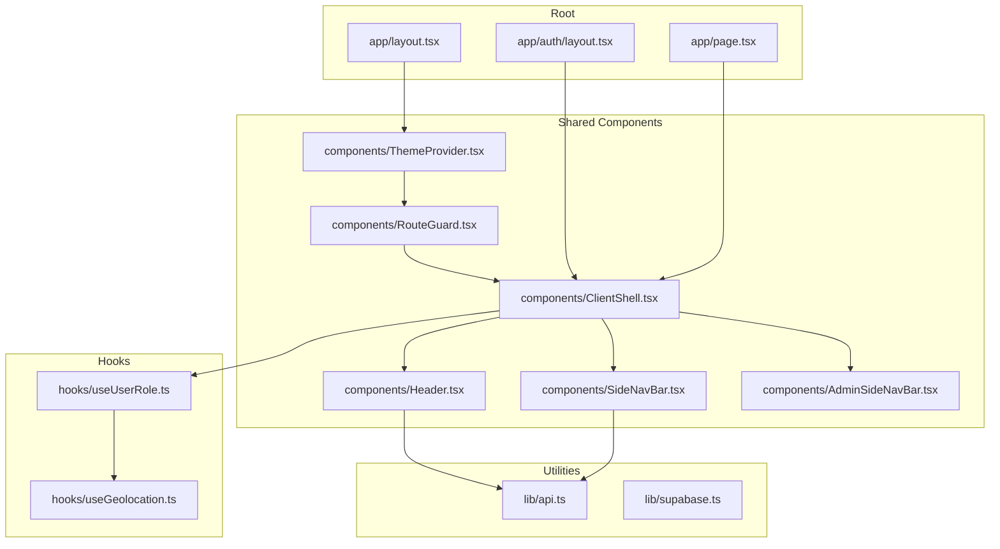
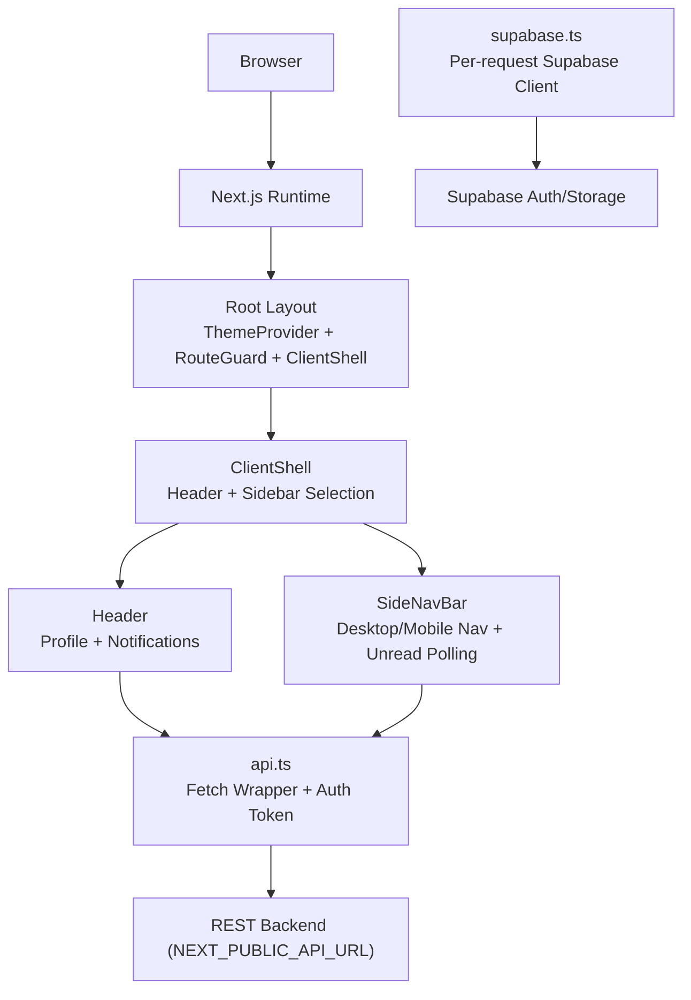
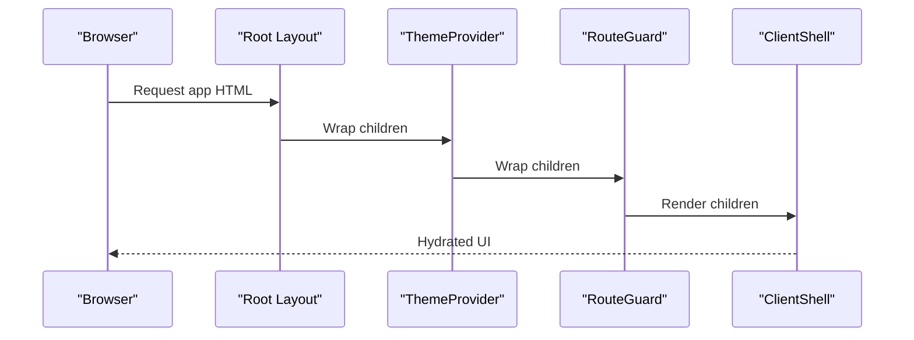
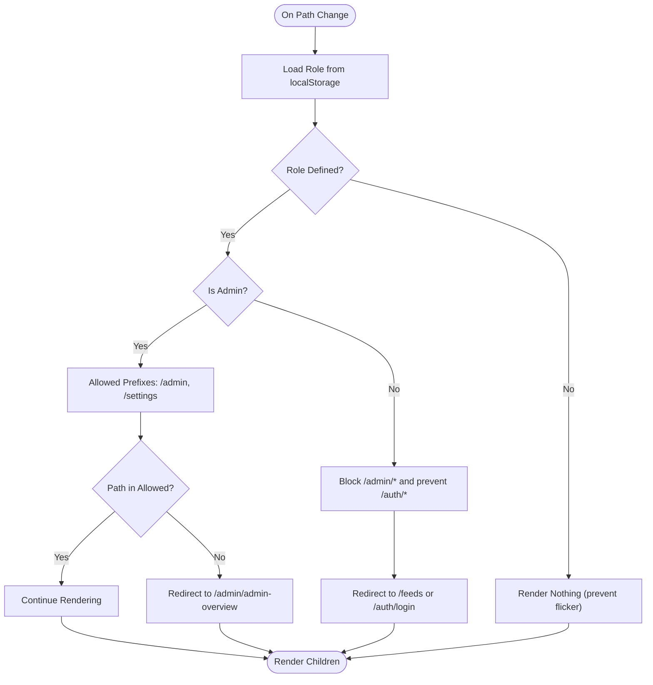
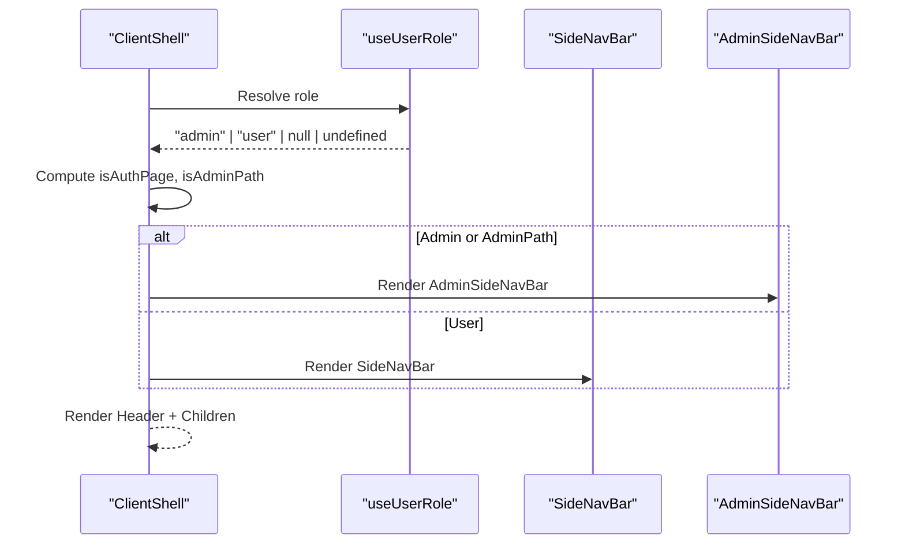
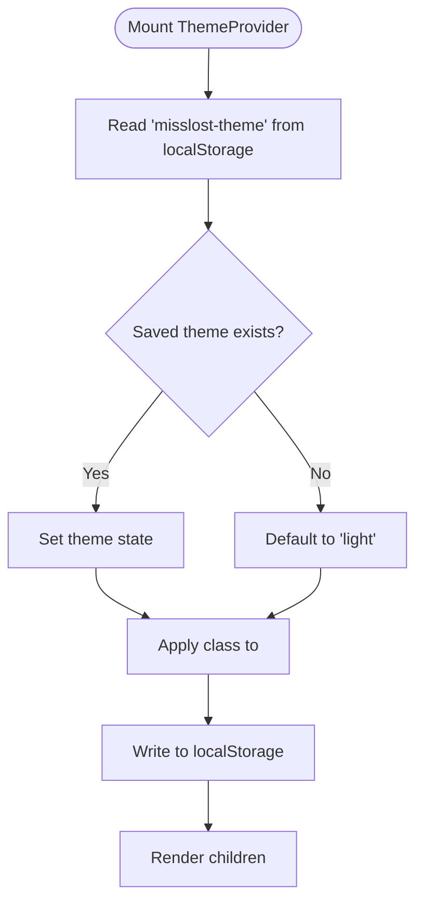
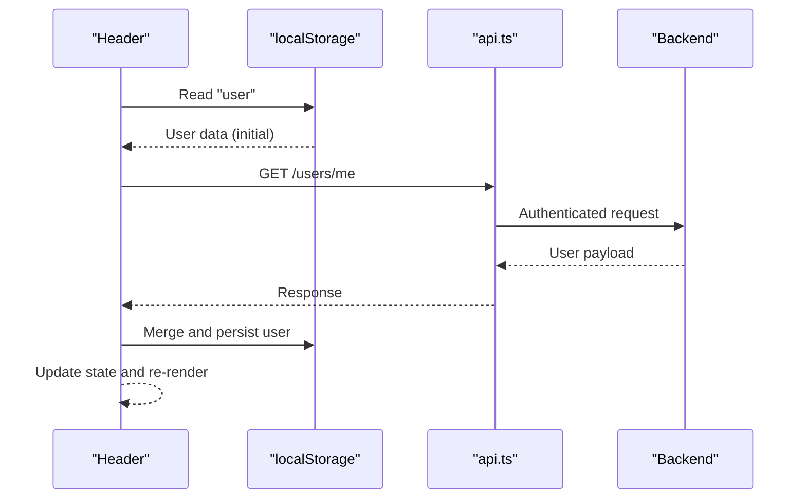
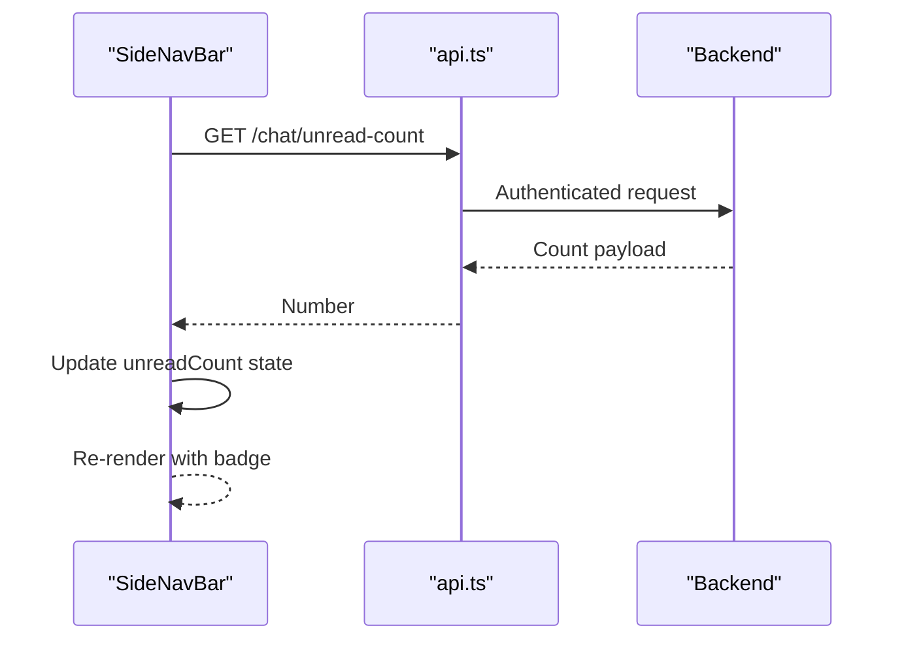
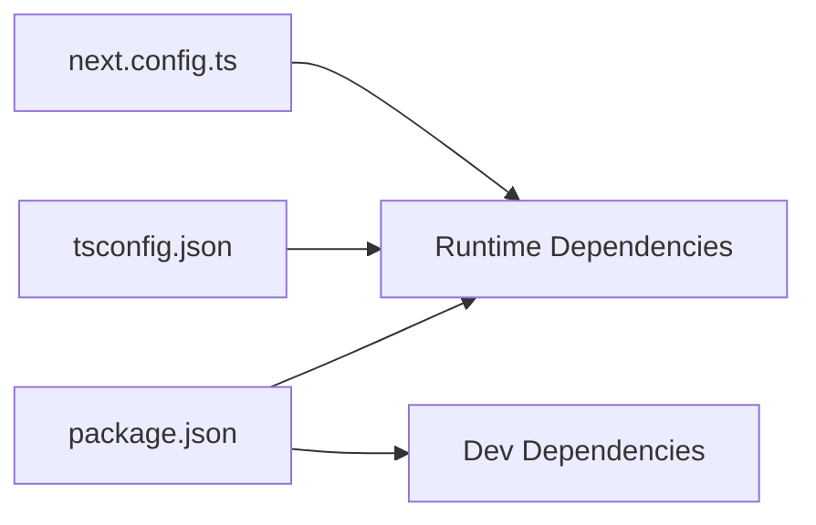

# Frontend Architecture

<cite>
**Referenced Files in This Document**
- [layout.tsx](file://frontend/app/layout.tsx)
- [page.tsx](file://frontend/app/page.tsx)
- [auth/layout.tsx](file://frontend/app/auth/layout.tsx)
- [ClientShell.tsx](file://frontend/app/components/ClientShell.tsx)
- [RouteGuard.tsx](file://frontend/app/components/RouteGuard.tsx)
- [ThemeProvider.tsx](file://frontend/app/components/ThemeProvider.tsx)
- [Header.tsx](file://frontend/app/components/Header.tsx)
- [SideNavBar.tsx](file://frontend/app/components/SideNavBar.tsx)
- [AdminSideNavBar.tsx](file://frontend/app/components/AdminSideNavBar.tsx)
- [api.ts](file://frontend/app/lib/api.ts)
- [supabase.ts](file://frontend/app/lib/supabase.ts)
- [useUserRole.ts](file://frontend/app/hooks/useUserRole.ts)
- [useGeolocation.ts](file://frontend/app/hooks/useGeolocation.ts)
- [package.json](file://frontend/package.json)
- [next.config.ts](file://frontend/next.config.ts)
- [tsconfig.json](file://frontend/tsconfig.json)
</cite>

## Table of Contents
1. [Introduction](#introduction)
2. [Project Structure](#project-structure)
3. [Core Components](#core-components)
4. [Architecture Overview](#architecture-overview)
5. [Detailed Component Analysis](#detailed-component-analysis)
6. [Dependency Analysis](#dependency-analysis)
7. [Performance Considerations](#performance-considerations)
8. [Troubleshooting Guide](#troubleshooting-guide)
9. [Conclusion](#conclusion)
10. [Appendices](#appendices)

## Introduction
This document describes the frontend architecture of the MissLost application built with Next.js 16.2.3 using the App Router. It explains the component hierarchy, routing and protection mechanisms, data flows to backend APIs, and real-time communication patterns. It also covers UI/UX design decisions, responsive layouts, state management, theme switching, and deployment considerations. The frontend integrates with Supabase authentication and a RESTful backend, and supports real-time-like updates for chat unread counts.

## Project Structure
The frontend follows Next.js App Router conventions with a strict file-based routing model. Key areas:
- Root layout initializes theme provider, route guard, and client shell.
- Page-level routes under app/ define entry points and redirects.
- Shared components live under app/components/.
- Utilities for API and Supabase clients reside under app/lib/.
- Custom hooks live under app/hooks/.

**Diagram sources**
- [layout.tsx:1-44](file://frontend/app/layout.tsx#L1-L44)
- [page.tsx:1-24](file://frontend/app/page.tsx#L1-L24)
- [auth/layout.tsx:1-16](file://frontend/app/auth/layout.tsx#L1-L16)
- [ClientShell.tsx:1-43](file://frontend/app/components/ClientShell.tsx#L1-L43)
- [RouteGuard.tsx:1-58](file://frontend/app/components/RouteGuard.tsx#L1-L58)
- [ThemeProvider.tsx:1-56](file://frontend/app/components/ThemeProvider.tsx#L1-L56)
- [Header.tsx:1-265](file://frontend/app/components/Header.tsx#L1-L265)
- [SideNavBar.tsx:1-151](file://frontend/app/components/SideNavBar.tsx#L1-L151)
- [AdminSideNavBar.tsx](file://frontend/app/components/AdminSideNavBar.tsx)
- [api.ts:1-78](file://frontend/app/lib/api.ts#L1-L78)
- [supabase.ts:1-18](file://frontend/app/lib/supabase.ts#L1-L18)
- [useUserRole.ts:1-29](file://frontend/app/hooks/useUserRole.ts#L1-L29)
- [useGeolocation.ts:1-104](file://frontend/app/hooks/useGeolocation.ts#L1-L104)

**Section sources**
- [layout.tsx:1-44](file://frontend/app/layout.tsx#L1-L44)
- [page.tsx:1-24](file://frontend/app/page.tsx#L1-L24)
- [auth/layout.tsx:1-16](file://frontend/app/auth/layout.tsx#L1-L16)
- [package.json:1-29](file://frontend/package.json#L1-L29)
- [next.config.ts:1-8](file://frontend/next.config.ts#L1-L8)
- [tsconfig.json:1-35](file://frontend/tsconfig.json#L1-L35)

## Core Components
- Root layout sets metadata, fonts, and composes ThemeProvider, RouteGuard, and ClientShell around children.
- ClientShell renders Header and navigates sidebar selection based on user role and current path.
- RouteGuard enforces role-based access and redirects unauthorized users.
- ThemeProvider manages theme state, persistence, and prevents flash-of-unstyled-content.
- Header handles user profile, notifications mockup, and logout.
- SideNavBar provides desktop and mobile navigation, prefetching, and periodic unread message polling.
- API utility centralizes fetch requests with Bearer token injection and 401 handling.
- Supabase client helper creates per-request clients with optional token header.
- Custom hooks encapsulate role resolution and geolocation/address lookup.

**Section sources**
- [layout.tsx:1-44](file://frontend/app/layout.tsx#L1-L44)
- [ClientShell.tsx:1-43](file://frontend/app/components/ClientShell.tsx#L1-L43)
- [RouteGuard.tsx:1-58](file://frontend/app/components/RouteGuard.tsx#L1-L58)
- [ThemeProvider.tsx:1-56](file://frontend/app/components/ThemeProvider.tsx#L1-L56)
- [Header.tsx:1-265](file://frontend/app/components/Header.tsx#L1-L265)
- [SideNavBar.tsx:1-151](file://frontend/app/components/SideNavBar.tsx#L1-L151)
- [api.ts:1-78](file://frontend/app/lib/api.ts#L1-L78)
- [supabase.ts:1-18](file://frontend/app/lib/supabase.ts#L1-L18)
- [useUserRole.ts:1-29](file://frontend/app/hooks/useUserRole.ts#L1-L29)
- [useGeolocation.ts:1-104](file://frontend/app/hooks/useGeolocation.ts#L1-L104)

## Architecture Overview
The frontend is a client-side React application bootstrapped by Next.js. It uses:
- App Router for file-system-based routing.
- Client components for interactivity and state.
- Environment-driven configuration for API and Supabase endpoints.
- Local storage for tokens and persisted user/theme data.
- Tailwind CSS v4 for styling with CSS variables for themes.

**Diagram sources**
- [layout.tsx:1-44](file://frontend/app/layout.tsx#L1-L44)
- [ClientShell.tsx:1-43](file://frontend/app/components/ClientShell.tsx#L1-L43)
- [Header.tsx:1-265](file://frontend/app/components/Header.tsx#L1-L265)
- [SideNavBar.tsx:1-151](file://frontend/app/components/SideNavBar.tsx#L1-L151)
- [api.ts:1-78](file://frontend/app/lib/api.ts#L1-L78)
- [supabase.ts:1-18](file://frontend/app/lib/supabase.ts#L1-L18)

## Detailed Component Analysis

### Root Layout and Shell Composition
The root layout composes three layers:
- ThemeProvider: Manages theme state and applies class to html element.
- RouteGuard: Enforces role-based access and redirects.
- ClientShell: Renders shared UI and selects appropriate sidebar.

**Diagram sources**
- [layout.tsx:1-44](file://frontend/app/layout.tsx#L1-L44)
- [ThemeProvider.tsx:1-56](file://frontend/app/components/ThemeProvider.tsx#L1-L56)
- [RouteGuard.tsx:1-58](file://frontend/app/components/RouteGuard.tsx#L1-L58)
- [ClientShell.tsx:1-43](file://frontend/app/components/ClientShell.tsx#L1-L43)

**Section sources**
- [layout.tsx:1-44](file://frontend/app/layout.tsx#L1-L44)
- [ThemeProvider.tsx:1-56](file://frontend/app/components/ThemeProvider.tsx#L1-L56)
- [RouteGuard.tsx:1-58](file://frontend/app/components/RouteGuard.tsx#L1-L58)
- [ClientShell.tsx:1-43](file://frontend/app/components/ClientShell.tsx#L1-L43)

### Route Protection and Role-Based Access
RouteGuard determines access based on user role and current path. It:
- Blocks admin-only routes for non-admin users.
- Redirects authenticated users away from auth pages.
- Restricts admin users to allowed prefixes.

**Diagram sources**
- [RouteGuard.tsx:1-58](file://frontend/app/components/RouteGuard.tsx#L1-L58)
- [useUserRole.ts:1-29](file://frontend/app/hooks/useUserRole.ts#L1-L29)

**Section sources**
- [RouteGuard.tsx:1-58](file://frontend/app/components/RouteGuard.tsx#L1-L58)
- [useUserRole.ts:1-29](file://frontend/app/hooks/useUserRole.ts#L1-L29)

### ClientShell and Sidebar Selection
ClientShell:
- Determines whether the current path is an auth route.
- Selects AdminSideNavBar for admin users or paths under /admin, otherwise SideNavBar.
- Uses role resolution hook to avoid flickering.

**Diagram sources**
- [ClientShell.tsx:1-43](file://frontend/app/components/ClientShell.tsx#L1-L43)
- [useUserRole.ts:1-29](file://frontend/app/hooks/useUserRole.ts#L1-L29)
- [SideNavBar.tsx:1-151](file://frontend/app/components/SideNavBar.tsx#L1-L151)
- [AdminSideNavBar.tsx](file://frontend/app/components/AdminSideNavBar.tsx)

**Section sources**
- [ClientShell.tsx:1-43](file://frontend/app/components/ClientShell.tsx#L1-L43)
- [useUserRole.ts:1-29](file://frontend/app/hooks/useUserRole.ts#L1-L29)
- [SideNavBar.tsx:1-151](file://frontend/app/components/SideNavBar.tsx#L1-L151)

### Theme Provider and Persistence
ThemeProvider:
- Initializes theme from localStorage or defaults to light.
- Applies theme class to html element and persists changes to localStorage.
- Prevents FOUC by conditionally rendering until mounted.

**Diagram sources**
- [ThemeProvider.tsx:1-56](file://frontend/app/components/ThemeProvider.tsx#L1-L56)

**Section sources**
- [ThemeProvider.tsx:1-56](file://frontend/app/components/ThemeProvider.tsx#L1-L56)

### Header and User Experience
Header:
- Loads user info from localStorage initially, then synchronizes with backend.
- Provides notifications dropdown and logout action.
- Uses a custom event to refresh user data on external updates.

**Diagram sources**
- [Header.tsx:1-265](file://frontend/app/components/Header.tsx#L1-L265)
- [api.ts:1-78](file://frontend/app/lib/api.ts#L1-L78)

**Section sources**
- [Header.tsx:1-265](file://frontend/app/components/Header.tsx#L1-L265)
- [api.ts:1-78](file://frontend/app/lib/api.ts#L1-L78)

### SideNavBar Navigation and Real-Time Updates
SideNavBar:
- Prefetches frequently visited routes.
- Polls unread message count periodically and displays badge.
- Provides desktop and mobile navigation experiences.

**Diagram sources**
- [SideNavBar.tsx:1-151](file://frontend/app/components/SideNavBar.tsx#L1-L151)
- [api.ts:1-78](file://frontend/app/lib/api.ts#L1-L78)

**Section sources**
- [SideNavBar.tsx:1-151](file://frontend/app/components/SideNavBar.tsx#L1-L151)
- [api.ts:1-78](file://frontend/app/lib/api.ts#L1-L78)

### Authentication Layout and Redirects
Auth layout:
- Provides a centered container for auth pages.
- Root ClientShell hides shared UI for auth routes.

Home page:
- Redirects based on presence of access token to either feeds or login.

**Section sources**
- [auth/layout.tsx:1-16](file://frontend/app/auth/layout.tsx#L1-L16)
- [page.tsx:1-24](file://frontend/app/page.tsx#L1-L24)
- [ClientShell.tsx:1-43](file://frontend/app/components/ClientShell.tsx#L1-L43)

### API Integration Patterns
api.ts:
- Centralized fetch wrapper with Bearer token injection.
- Handles 401 by clearing tokens and redirecting to login.
- Provides uploadFile helper for multipart/form-data.

supabase.ts:
- Creates Supabase client instances with optional Authorization header.
- Disables auto-refresh and persistence to avoid conflicts with custom auth flow.

**Section sources**
- [api.ts:1-78](file://frontend/app/lib/api.ts#L1-L78)
- [supabase.ts:1-18](file://frontend/app/lib/supabase.ts#L1-L18)

### Hooks: Role and Geolocation
useUserRole:
- Reads user from localStorage and extracts role.
- Returns undefined while resolving, null if not present, otherwise "admin" or "user".

useGeolocation:
- Uses browser geolocation and Nominatim reverse geocoding.
- Returns loading/error states and a function to resolve a human-readable address.

**Section sources**
- [useUserRole.ts:1-29](file://frontend/app/hooks/useUserRole.ts#L1-L29)
- [useGeolocation.ts:1-104](file://frontend/app/hooks/useGeolocation.ts#L1-L104)

## Dependency Analysis
External dependencies and build/runtime configuration:
- Next.js 16.2.3 with App Router.
- React 19 and React DOM.
- Tailwind CSS v4 for styling.
- TypeScript compiler options configured for ES2017, strict mode, and bundler module resolution.
- Environment variables for API and Supabase endpoints.

**Diagram sources**
- [package.json:1-29](file://frontend/package.json#L1-L29)
- [tsconfig.json:1-35](file://frontend/tsconfig.json#L1-L35)
- [next.config.ts:1-8](file://frontend/next.config.ts#L1-L8)

**Section sources**
- [package.json:1-29](file://frontend/package.json#L1-L29)
- [tsconfig.json:1-35](file://frontend/tsconfig.json#L1-L35)
- [next.config.ts:1-8](file://frontend/next.config.ts#L1-L8)

## Performance Considerations
- Client components are hydrated on demand; keep heavy logic inside effects and memoize callbacks.
- Prefetching routes reduces perceived latency; ensure only likely routes are prefetched.
- Polling unread counts should be tuned to balance freshness and network usage.
- Avoid unnecessary re-renders by using stable callbacks and selective state updates.
- CSS variables and minimal inline styles improve runtime performance.
- Keep localStorage reads/writes minimal and batch where possible.

## Troubleshooting Guide
Common issues and resolutions:
- Unauthorized requests: api.ts automatically clears tokens and redirects to login on 401. Verify NEXT_PUBLIC_API_URL and token presence.
- Theme flicker: ThemeProvider prevents rendering until mounted; ensure no early renders outside ThemeProvider.
- Role-based UI flashes: RouteGuard returns null until role is resolved; ensure layouts handle undefined role states.
- Supabase client conflicts: supabase.ts disables auto-refresh and persistence; ensure token is passed via Authorization header when needed.
- Geolocation failures: useGeolocation throws descriptive errors for permission denied, unavailable, and timeout; surface user-friendly messages.

**Section sources**
- [api.ts:1-78](file://frontend/app/lib/api.ts#L1-L78)
- [ThemeProvider.tsx:1-56](file://frontend/app/components/ThemeProvider.tsx#L1-L56)
- [RouteGuard.tsx:1-58](file://frontend/app/components/RouteGuard.tsx#L1-L58)
- [supabase.ts:1-18](file://frontend/app/lib/supabase.ts#L1-L18)
- [useGeolocation.ts:1-104](file://frontend/app/hooks/useGeolocation.ts#L1-L104)

## Conclusion
The MissLost frontend leverages Next.js 16.2.3’s App Router to deliver a structured, modular React application. It enforces route protection via a dedicated guard, centralizes API interactions with robust error handling, and integrates with Supabase for authentication. The design emphasizes responsive navigation, theme persistence, and user-centric UX patterns. With clear separation of concerns and reusable hooks/components, the system is maintainable and extensible.

## Appendices
- Build and start scripts are defined in package.json.
- Environment variables:
  - NEXT_PUBLIC_API_URL: Base URL for REST backend.
  - NEXT_PUBLIC_SUPABASE_URL and NEXT_PUBLIC_SUPABASE_ANON_KEY: Supabase configuration for client usage.
- Deployment considerations:
  - Build with Next.js build pipeline; serve static assets via Next server or compatible host.
  - Ensure environment variables are configured for production.
  - For Supabase, restrict keys and configure CORS appropriately.
  - Consider CDN caching for static assets; apply cache headers for API responses as needed.

**Section sources**
- [package.json:1-29](file://frontend/package.json#L1-L29)
- [api.ts:1-78](file://frontend/app/lib/api.ts#L1-L78)
- [supabase.ts:1-18](file://frontend/app/lib/supabase.ts#L1-L18)