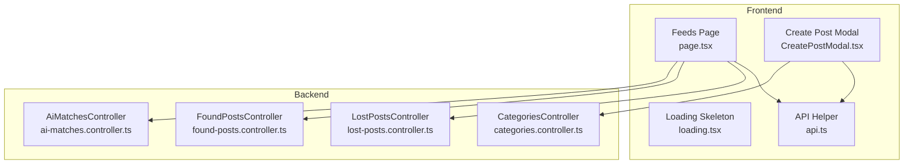
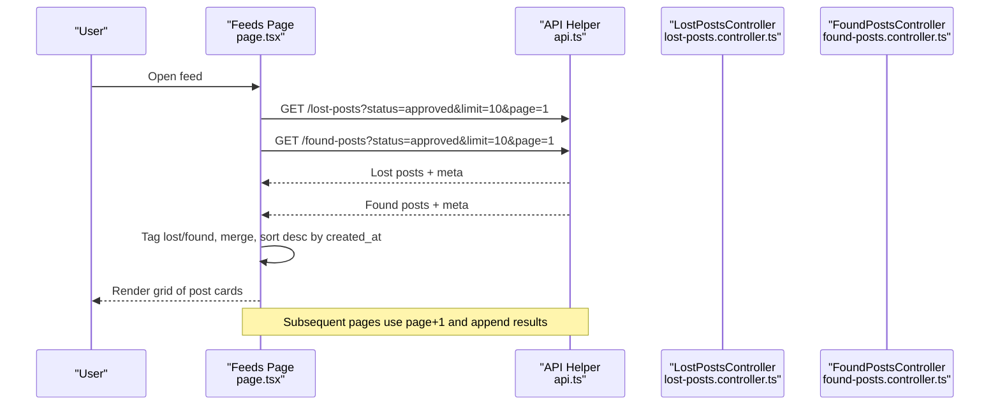
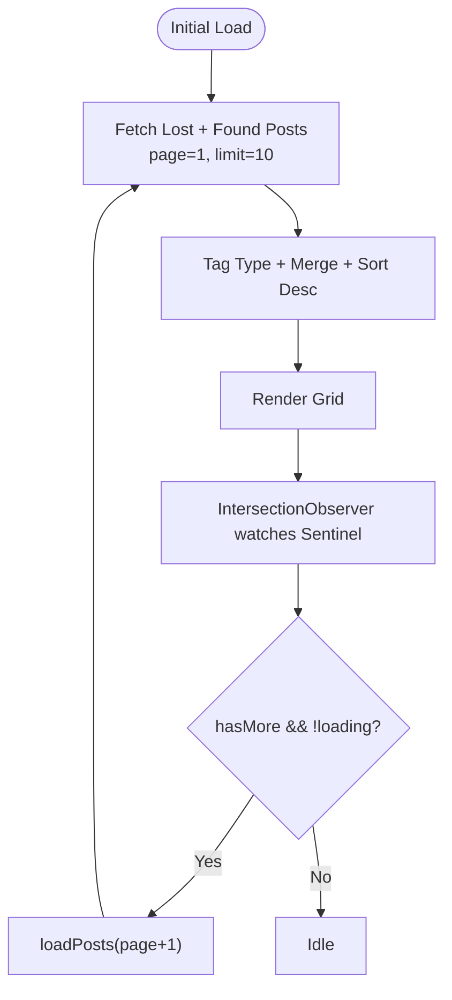
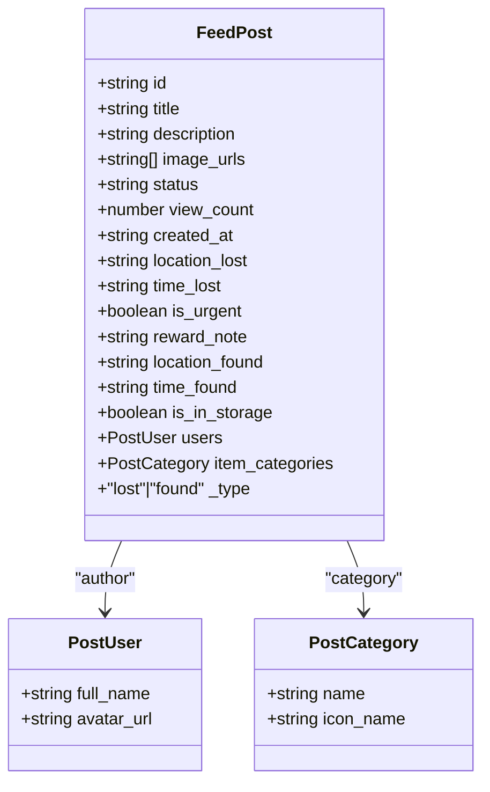
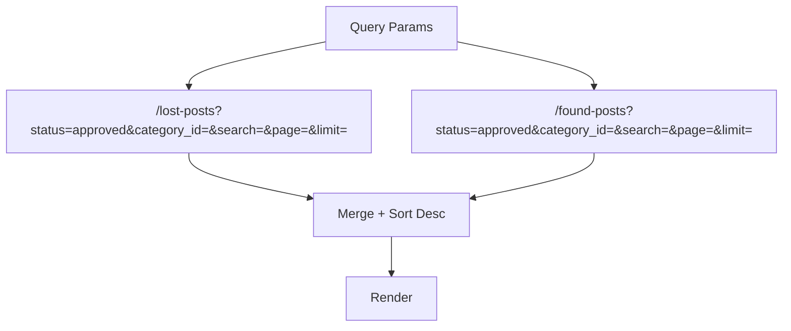
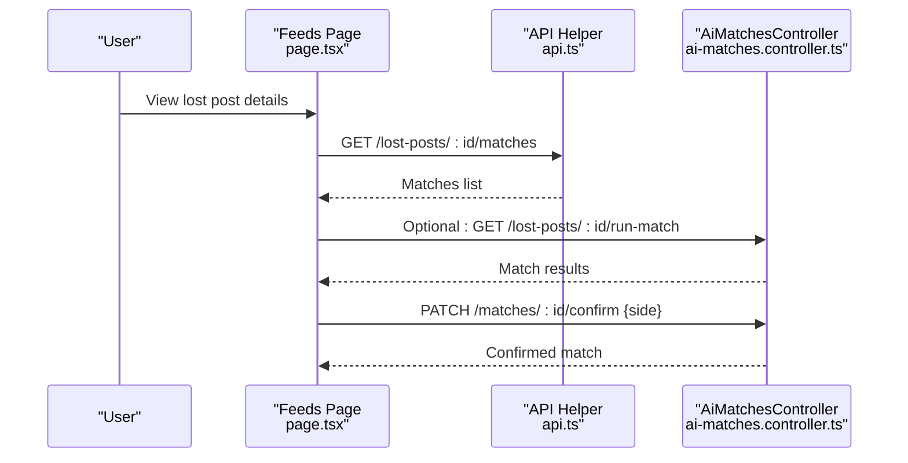
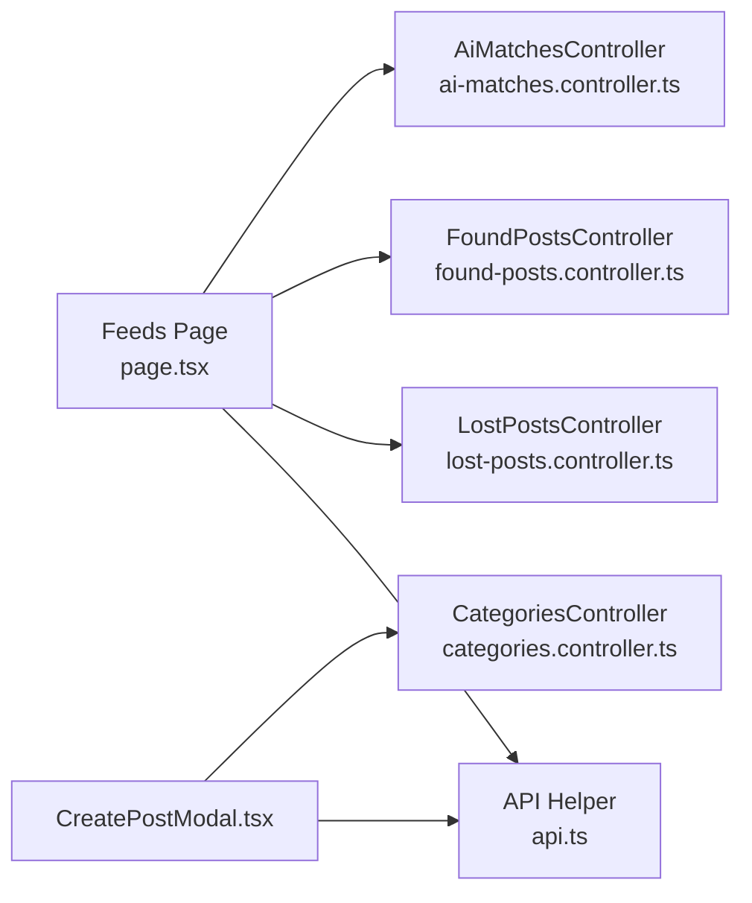

# Feed System

<cite>
**Referenced Files in This Document**
- [page.tsx](file://frontend/app/feeds/page.tsx)
- [loading.tsx](file://frontend/app/feeds/loading.tsx)
- [api.ts](file://frontend/app/lib/api.ts)
- [CreatePostModal.tsx](file://frontend/app/components/CreatePostModal.tsx)
- [layout.tsx](file://frontend/app/layout.tsx)
- [error/page.tsx](file://frontend/app/error/page.tsx)
- [found-posts.controller.ts](file://backend/src/modules/found-posts/found-posts.controller.ts)
- [lost-posts.controller.ts](file://backend/src/modules/lost-posts/lost-posts.controller.ts)
- [query-found-posts.dto.ts](file://backend/src/modules/found-posts/dto/query-found-posts.dto.ts)
- [query-lost-posts.dto.ts](file://backend/src/modules/lost-posts/dto/query-lost-posts.dto.ts)
- [ai-matches.controller.ts](file://backend/src/modules/ai-matches/ai-matches.controller.ts)
- [ai-matches.service.ts](file://backend/src/modules/ai-matches/ai-matches.service.ts)
- [categories.controller.ts](file://backend/src/modules/categories/categories.controller.ts)
- [category.entity.ts](file://backend/src/modules/categories/entities/category.entity.ts)
</cite>

## Table of Contents
1. [Introduction](#introduction)
2. [Project Structure](#project-structure)
3. [Core Components](#core-components)
4. [Architecture Overview](#architecture-overview)
5. [Detailed Component Analysis](#detailed-component-analysis)
6. [Dependency Analysis](#dependency-analysis)
7. [Performance Considerations](#performance-considerations)
8. [Troubleshooting Guide](#troubleshooting-guide)
9. [Conclusion](#conclusion)

## Introduction
This document explains the feed system that displays lost and found posts in a unified timeline. It covers how posts are fetched from the backend, merged and sorted, how infinite scroll and pagination work, and how the UI renders post cards with status indicators. It also documents the loading states, error handling, and user interactions such as creating posts and navigating to post details. Finally, it describes how the AI matching system integrates with the feed for suggesting matches.

## Project Structure
The feed system spans the frontend Next.js app and the NestJS backend:
- Frontend pages and components: feed page, loading skeleton, API helper, and create post modal
- Backend controllers and DTOs: endpoints for lost and found posts, and AI matches
- Shared category model and controller

**Diagram sources**
- [page.tsx:61-489](file://frontend/app/feeds/page.tsx#L61-L489)
- [loading.tsx:1-75](file://frontend/app/feeds/loading.tsx#L1-L75)
- [api.ts:12-43](file://frontend/app/lib/api.ts#L12-L43)
- [CreatePostModal.tsx:23-584](file://frontend/app/components/CreatePostModal.tsx#L23-L584)
- [lost-posts.controller.ts:30-35](file://backend/src/modules/lost-posts/lost-posts.controller.ts#L30-L35)
- [found-posts.controller.ts:30-35](file://backend/src/modules/found-posts/found-posts.controller.ts#L30-L35)
- [ai-matches.controller.ts:24-28](file://backend/src/modules/ai-matches/ai-matches.controller.ts#L24-L28)
- [categories.controller.ts:11-16](file://backend/src/modules/categories/categories.controller.ts#L11-L16)

**Section sources**
- [page.tsx:61-489](file://frontend/app/feeds/page.tsx#L61-L489)
- [api.ts:12-43](file://frontend/app/lib/api.ts#L12-L43)
- [lost-posts.controller.ts:30-35](file://backend/src/modules/lost-posts/lost-posts.controller.ts#L30-L35)
- [found-posts.controller.ts:30-35](file://backend/src/modules/found-posts/found-posts.controller.ts#L30-L35)
- [ai-matches.controller.ts:24-28](file://backend/src/modules/ai-matches/ai-matches.controller.ts#L24-L28)
- [categories.controller.ts:11-16](file://backend/src/modules/categories/categories.controller.ts#L11-L16)

## Core Components
- Feeds page: orchestrates fetching, merging, sorting, pagination, and rendering of posts
- API helper: centralizes HTTP requests with auth and error handling
- Loading skeleton: provides skeleton UI during initial and subsequent loads
- Create post modal: allows users to publish lost or found posts
- Backend controllers: expose endpoints for lost and found posts and AI matching
- DTOs: define query parameters for filtering and pagination
- Categories: provides category metadata for post cards

Key responsibilities:
- Fetch lost and found posts concurrently, tag by type, merge, and sort by creation time
- Implement infinite scroll with an IntersectionObserver sentinel
- Render post cards with type badges, urgency badges, image counts, and metadata
- Provide loading skeletons and empty states
- Integrate with AI matching endpoints for suggested matches

**Section sources**
- [page.tsx:61-140](file://frontend/app/feeds/page.tsx#L61-L140)
- [api.ts:12-43](file://frontend/app/lib/api.ts#L12-L43)
- [loading.tsx:1-75](file://frontend/app/feeds/loading.tsx#L1-L75)
- [CreatePostModal.tsx:23-238](file://frontend/app/components/CreatePostModal.tsx#L23-L238)
- [lost-posts.controller.ts:30-35](file://backend/src/modules/lost-posts/lost-posts.controller.ts#L30-L35)
- [found-posts.controller.ts:30-35](file://backend/src/modules/found-posts/found-posts.controller.ts#L30-L35)
- [query-lost-posts.dto.ts:5-35](file://backend/src/modules/lost-posts/dto/query-lost-posts.dto.ts#L5-L35)
- [query-found-posts.dto.ts:5-35](file://backend/src/modules/found-posts/dto/query-found-posts.dto.ts#L5-L35)
- [categories.controller.ts:11-16](file://backend/src/modules/categories/categories.controller.ts#L11-L16)

## Architecture Overview
The feed page performs two concurrent API calls to the backend for lost and found posts, merges and sorts the results, and renders them in a responsive grid. Users can create new posts via a modal, which uploads images and posts content. The AI matching endpoints support retrieving and computing suggested matches for lost posts.

**Diagram sources**
- [page.tsx:73-113](file://frontend/app/feeds/page.tsx#L73-L113)
- [api.ts:12-43](file://frontend/app/lib/api.ts#L12-L43)
- [lost-posts.controller.ts:30-35](file://backend/src/modules/lost-posts/lost-posts.controller.ts#L30-L35)
- [found-posts.controller.ts:30-35](file://backend/src/modules/found-posts/found-posts.controller.ts#L30-L35)

## Detailed Component Analysis

### Feed Page Implementation
- State management: maintains posts, page, hasMore, loading flags, and initial loading state
- Fetching: runs two parallel fetches for lost and found posts with pagination parameters
- Merging and sorting: tags posts with type, merges arrays, and sorts by created_at descending
- Pagination: determines hasMore based on totalPages from both endpoints
- Infinite scroll: uses IntersectionObserver to detect sentinel element entering viewport and triggers next page load
- Rendering: shows skeleton during initial load, empty state when no posts, otherwise renders a grid of post cards
- Refresh: after successful post creation, reloads page 1 to show newest posts

**Diagram sources**
- [page.tsx:73-135](file://frontend/app/feeds/page.tsx#L73-L135)

**Section sources**
- [page.tsx:61-140](file://frontend/app/feeds/page.tsx#L61-L140)
- [page.tsx:115-135](file://frontend/app/feeds/page.tsx#L115-L135)
- [page.tsx:200-369](file://frontend/app/feeds/page.tsx#L200-L369)

### Post Card Rendering and Status Indicators
- Type badge: red for lost, blue for found
- Urgency badge: shown for lost posts marked urgent
- Image count badge: shown when multiple images exist
- Content: title, description, location, category icon/name, author avatar/full name, time ago
- Lazy loading: images use native lazy loading for performance

**Diagram sources**
- [page.tsx:18-40](file://frontend/app/feeds/page.tsx#L18-L40)

**Section sources**
- [page.tsx:239-347](file://frontend/app/feeds/page.tsx#L239-L347)

### Filtering and Sorting Mechanisms
- Backend supports filtering by status, category_id, and free-text search, with pagination controls
- Current feed page filters posts by approved status and merges results
- To add UI filters (status, category, location), extend the fetch call with query parameters and persist filters in state

**Diagram sources**
- [query-lost-posts.dto.ts:5-35](file://backend/src/modules/lost-posts/dto/query-lost-posts.dto.ts#L5-L35)
- [query-found-posts.dto.ts:5-35](file://backend/src/modules/found-posts/dto/query-found-posts.dto.ts#L5-L35)
- [page.tsx:79-86](file://frontend/app/feeds/page.tsx#L79-L86)

**Section sources**
- [query-lost-posts.dto.ts:5-35](file://backend/src/modules/lost-posts/dto/query-lost-posts.dto.ts#L5-L35)
- [query-found-posts.dto.ts:5-35](file://backend/src/modules/found-posts/dto/query-found-posts.dto.ts#L5-L35)
- [page.tsx:79-86](file://frontend/app/feeds/page.tsx#L79-L86)

### Real-Time Updates and Refresh Patterns
- After a successful post creation, the feed refreshes page 1 to surface new posts immediately
- No WebSocket or server-sent events are implemented; refresh relies on manual reload

**Section sources**
- [page.tsx:137-140](file://frontend/app/feeds/page.tsx#L137-L140)
- [CreatePostModal.tsx:226-230](file://frontend/app/components/CreatePostModal.tsx#L226-L230)

### Data Fetching Patterns and Pagination
- Parallel fetches for lost and found posts with identical pagination parameters
- Uses meta.totalPages to decide whether more pages exist
- Appends new results when loading more; replaces when resetting to page 1

**Section sources**
- [page.tsx:73-113](file://frontend/app/feeds/page.tsx#L73-L113)
- [page.tsx:100-104](file://frontend/app/feeds/page.tsx#L100-L104)

### Infinite Scroll Implementation
- An invisible sentinel element placed after the last post triggers the observer
- Threshold set to 0.1 to trigger slightly before reaching the end
- Prevents loading when already loading or when no more pages remain

**Section sources**
- [page.tsx:121-135](file://frontend/app/feeds/page.tsx#L121-L135)

### Loading States and Skeleton Screens
- Initial skeleton: composer and grid placeholders
- Ongoing loading: spinner centered while appending more posts
- Empty state: friendly illustration and call-to-action to create a post

**Section sources**
- [loading.tsx:1-75](file://frontend/app/feeds/loading.tsx#L1-L75)
- [page.tsx:200-236](file://frontend/app/feeds/page.tsx#L200-L236)
- [page.tsx:355-368](file://frontend/app/feeds/page.tsx#L355-L368)

### Error Handling for API Calls
- Unauthorized responses clear tokens and redirect to login
- Non-OK responses raise errors with message bodies
- Feed catches errors silently to avoid crashing the UI; consider adding user-visible notifications

**Section sources**
- [api.ts:30-43](file://frontend/app/lib/api.ts#L30-L43)
- [page.tsx:105-110](file://frontend/app/feeds/page.tsx#L105-L110)

### User Interaction Patterns
- Create post: opens modal, validates inputs, uploads images, submits post, closes modal, refreshes feed
- Navigation: clicking a post card navigates to the post detail route (implemented in backend controllers)

**Section sources**
- [CreatePostModal.tsx:135-238](file://frontend/app/components/CreatePostModal.tsx#L135-L238)
- [lost-posts.controller.ts:43-48](file://backend/src/modules/lost-posts/lost-posts.controller.ts#L43-L48)
- [found-posts.controller.ts:43-48](file://backend/src/modules/found-posts/found-posts.controller.ts#L43-L48)

### AI Matching Integration
- Retrieve matches for a lost post via dedicated endpoint
- Run text-based matching between lost and found posts in the same category
- Confirm matches from either owner or finder side

**Diagram sources**
- [ai-matches.controller.ts:24-40](file://backend/src/modules/ai-matches/ai-matches.controller.ts#L24-L40)
- [ai-matches.controller.ts:30-34](file://backend/src/modules/ai-matches/ai-matches.controller.ts#L30-L34)
- [ai-matches.controller.ts:36-40](file://backend/src/modules/ai-matches/ai-matches.controller.ts#L36-L40)

**Section sources**
- [ai-matches.controller.ts:24-40](file://backend/src/modules/ai-matches/ai-matches.controller.ts#L24-L40)
- [ai-matches.service.ts:15-40](file://backend/src/modules/ai-matches/ai-matches.service.ts#L15-L40)
- [ai-matches.service.ts:45-96](file://backend/src/modules/ai-matches/ai-matches.service.ts#L45-L96)
- [ai-matches.service.ts:101-141](file://backend/src/modules/ai-matches/ai-matches.service.ts#L101-L141)

## Dependency Analysis
- Frontend depends on:
  - API helper for HTTP requests and auth
  - Backend controllers for data endpoints
  - Categories controller for category metadata
- Backend controllers depend on:
  - DTOs for validating query parameters
  - Services for business logic (not shown here)
- AI matching endpoints integrate with the feed by providing suggestions and confirmation flows

**Diagram sources**
- [page.tsx:61-489](file://frontend/app/feeds/page.tsx#L61-L489)
- [api.ts:12-43](file://frontend/app/lib/api.ts#L12-L43)
- [lost-posts.controller.ts:30-35](file://backend/src/modules/lost-posts/lost-posts.controller.ts#L30-L35)
- [found-posts.controller.ts:30-35](file://backend/src/modules/found-posts/found-posts.controller.ts#L30-L35)
- [ai-matches.controller.ts:24-28](file://backend/src/modules/ai-matches/ai-matches.controller.ts#L24-L28)
- [CreatePostModal.tsx:23-584](file://frontend/app/components/CreatePostModal.tsx#L23-L584)
- [categories.controller.ts:11-16](file://backend/src/modules/categories/categories.controller.ts#L11-L16)

**Section sources**
- [page.tsx:61-489](file://frontend/app/feeds/page.tsx#L61-L489)
- [api.ts:12-43](file://frontend/app/lib/api.ts#L12-L43)
- [lost-posts.controller.ts:30-35](file://backend/src/modules/lost-posts/lost-posts.controller.ts#L30-L35)
- [found-posts.controller.ts:30-35](file://backend/src/modules/found-posts/found-posts.controller.ts#L30-L35)
- [ai-matches.controller.ts:24-28](file://backend/src/modules/ai-matches/ai-matches.controller.ts#L24-L28)
- [CreatePostModal.tsx:23-584](file://frontend/app/components/CreatePostModal.tsx#L23-L584)
- [categories.controller.ts:11-16](file://backend/src/modules/categories/categories.controller.ts#L11-L16)

## Performance Considerations
- Concurrent fetching reduces total latency for lost and found lists
- Sorting in memory is acceptable for small to medium page sizes; consider server-side sorting if needed
- Lazy loading images improves perceived performance
- Skeleton screens reduce perceived latency during initial and subsequent loads
- Consider debouncing search queries and avoiding unnecessary re-renders by memoizing callbacks

## Troubleshooting Guide
- Unauthorized errors: ensure access token exists and is valid; the API helper clears tokens and redirects to login on 401
- Network failures: current implementation swallows errors during feed loading; consider surfacing user-friendly messages
- Infinite scroll not triggering: verify the sentinel element is rendered and IntersectionObserver is attached
- Missing categories: ensure categories endpoint is reachable and returns expected shape

**Section sources**
- [api.ts:30-43](file://frontend/app/lib/api.ts#L30-L43)
- [page.tsx:105-110](file://frontend/app/feeds/page.tsx#L105-L110)
- [page.tsx:121-135](file://frontend/app/feeds/page.tsx#L121-L135)
- [categories.controller.ts:11-16](file://backend/src/modules/categories/categories.controller.ts#L11-L16)

## Conclusion
The feed system consolidates lost and found posts into a single, chronological timeline with robust pagination and infinite scroll. It leverages a shared API layer, category metadata, and optional AI matching to enhance discoverability. The UI provides clear loading states, intuitive post cards, and seamless creation flows. Extending filtering capabilities and adding real-time updates would further improve the user experience.