# Found Items Section

<cite>
**Referenced Files in This Document**
- [page.tsx](file://frontend/app/found/page.tsx)
- [CreatePostModal.tsx](file://frontend/app/components/CreatePostModal.tsx)
- [api.ts](file://frontend/app/lib/api.ts)
- [found-posts.controller.ts](file://backend/src/modules/found-posts/found-posts.controller.ts)
- [found-posts.service.ts](file://backend/src/modules/found-posts/found-posts.service.ts)
- [create-found-post.dto.ts](file://backend/src/modules/found-posts/dto/create-found-post.dto.ts)
- [ai-matches.controller.ts](file://backend/src/modules/ai-matches/ai-matches.controller.ts)
- [ai-matches.service.ts](file://backend/src/modules/ai-matches/ai-matches.service.ts)
- [chat.controller.ts](file://backend/src/modules/chat/chat.controller.ts)
- [chat.service.ts](file://backend/src/modules/chat/chat.service.ts)
- [handovers.controller.ts](file://backend/src/modules/handovers/handovers.controller.ts)
- [handovers.service.ts](file://backend/src/modules/handovers/handovers.service.ts)
- [categories.controller.ts](file://backend/src/modules/categories/categories.controller.ts)
- [categories.service.ts](file://backend/src/modules/categories/categories.service.ts)
- [notifications.service.ts](file://backend/src/modules/notifications/notifications.service.ts)
- [OVERVIEW.md](file://OVERVIEW.md)
</cite>

## Table of Contents
1. [Introduction](#introduction)
2. [Project Structure](#project-structure)
3. [Core Components](#core-components)
4. [Architecture Overview](#architecture-overview)
5. [Detailed Component Analysis](#detailed-component-analysis)
6. [Dependency Analysis](#dependency-analysis)
7. [Performance Considerations](#performance-considerations)
8. [Troubleshooting Guide](#troubleshooting-guide)
9. [Conclusion](#conclusion)

## Introduction
This document explains the Found Items Section end-to-end: how users submit found item posts, how the system surfaces approved posts to the community, how AI matching suggests potential owners, and how the handover process is coordinated. It covers the frontend form components, backend APIs, matching algorithm, approval workflow, chat integration, and the completion of a successful handover with point awards.

## Project Structure
The Found Items Section spans frontend Next.js pages and modals, and backend NestJS modules:
- Frontend: Found feed page, Create Post modal, API utilities
- Backend: Found posts CRUD, AI matching, chat, handovers, categories, notifications

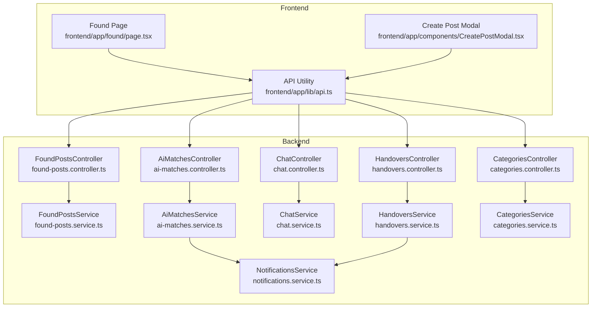

**Diagram sources**
- [page.tsx:1-405](file://frontend/app/found/page.tsx#L1-L405)
- [CreatePostModal.tsx:1-584](file://frontend/app/components/CreatePostModal.tsx#L1-L584)
- [api.ts:1-83](file://frontend/app/lib/api.ts#L1-L83)
- [found-posts.controller.ts:1-78](file://backend/src/modules/found-posts/found-posts.controller.ts#L1-L78)
- [found-posts.service.ts:1-162](file://backend/src/modules/found-posts/found-posts.service.ts#L1-L162)
- [ai-matches.controller.ts:1-72](file://backend/src/modules/ai-matches/ai-matches.controller.ts#L1-L72)
- [ai-matches.service.ts:1-367](file://backend/src/modules/ai-matches/ai-matches.service.ts#L1-L367)
- [chat.controller.ts:1-50](file://backend/src/modules/chat/chat.controller.ts#L1-L50)
- [chat.service.ts:1-151](file://backend/src/modules/chat/chat.service.ts#L1-L151)
- [handovers.controller.ts:1-45](file://backend/src/modules/handovers/handovers.controller.ts#L1-L45)
- [handovers.service.ts:1-147](file://backend/src/modules/handovers/handovers.service.ts#L1-L147)
- [categories.controller.ts:1-18](file://backend/src/modules/categories/categories.controller.ts#L1-L18)
- [categories.service.ts:1-32](file://backend/src/modules/categories/categories.service.ts#L1-L32)
- [notifications.service.ts:1-45](file://backend/src/modules/notifications/notifications.service.ts#L1-L45)

**Section sources**
- [page.tsx:1-405](file://frontend/app/found/page.tsx#L1-L405)
- [CreatePostModal.tsx:1-584](file://frontend/app/components/CreatePostModal.tsx#L1-L584)
- [api.ts:1-83](file://frontend/app/lib/api.ts#L1-L83)
- [found-posts.controller.ts:1-78](file://backend/src/modules/found-posts/found-posts.controller.ts#L1-L78)
- [ai-matches.controller.ts:1-72](file://backend/src/modules/ai-matches/ai-matches.controller.ts#L1-L72)
- [chat.controller.ts:1-50](file://backend/src/modules/chat/chat.controller.ts#L1-L50)
- [handovers.controller.ts:1-45](file://backend/src/modules/handovers/handovers.controller.ts#L1-L45)
- [categories.controller.ts:1-18](file://backend/src/modules/categories/categories.controller.ts#L1-L18)

## Core Components
- Found Feed Page: Loads approved found posts, infinite scroll, and quick chat initiation.
- Create Post Modal: Unified form for Lost and Found posts with images, category, location, date, and optional fields.
- Found Posts Module: Create, list, detail, update, delete, admin review.
- AI Matches Module: Text-based matching between lost and found posts, confirmation workflow.
- Chat Module: Conversations and messaging for matched parties.
- Handovers Module: Coordination of pick-up/return with verification and point grants.
- Categories Module: Item categories for classification.
- Notifications Module: Retrieval of user notifications.

**Section sources**
- [page.tsx:49-127](file://frontend/app/found/page.tsx#L49-L127)
- [CreatePostModal.tsx:23-84](file://frontend/app/components/CreatePostModal.tsx#L23-L84)
- [found-posts.service.ts:19-38](file://backend/src/modules/found-posts/found-posts.service.ts#L19-L38)
- [ai-matches.service.ts:15-40](file://backend/src/modules/ai-matches/ai-matches.service.ts#L15-L40)
- [chat.service.ts:38-66](file://backend/src/modules/chat/chat.service.ts#L38-L66)
- [handovers.service.ts:12-32](file://backend/src/modules/handovers/handovers.service.ts#L12-L32)
- [categories.service.ts:10-19](file://backend/src/modules/categories/categories.service.ts#L10-L19)
- [notifications.service.ts:15-41](file://backend/src/modules/notifications/notifications.service.ts#L15-L41)

## Architecture Overview
The Found Items Section follows a clean separation of concerns:
- Frontend renders the feed and captures user input via the modal.
- API utility centralizes auth and base URL handling.
- Backend controllers expose REST endpoints guarded by authentication and roles.
- Services encapsulate Supabase queries and business logic.
- AI Matching runs text similarity and persists suggestions.
- Chat and Handovers coordinate communication and physical exchange.
- Notifications service supports retrieval of user events.

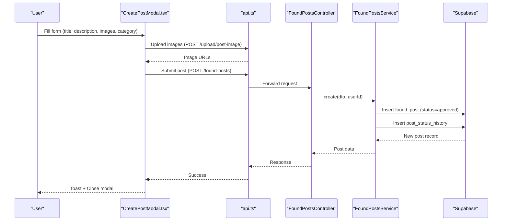

**Diagram sources**
- [CreatePostModal.tsx:135-238](file://frontend/app/components/CreatePostModal.tsx#L135-L238)
- [api.ts:48-82](file://frontend/app/lib/api.ts#L48-L82)
- [found-posts.controller.ts:24-28](file://backend/src/modules/found-posts/found-posts.controller.ts#L24-L28)
- [found-posts.service.ts:19-38](file://backend/src/modules/found-posts/found-posts.service.ts#L19-L38)

## Detailed Component Analysis

### Found Feed Page
- Loads approved found posts with pagination and infinite scroll sentinel.
- Displays featured post and grid cards with image, metadata, and author.
- Provides “Chat” buttons to initiate conversations with post authors.
- Uses timeAgo for relative timestamps.

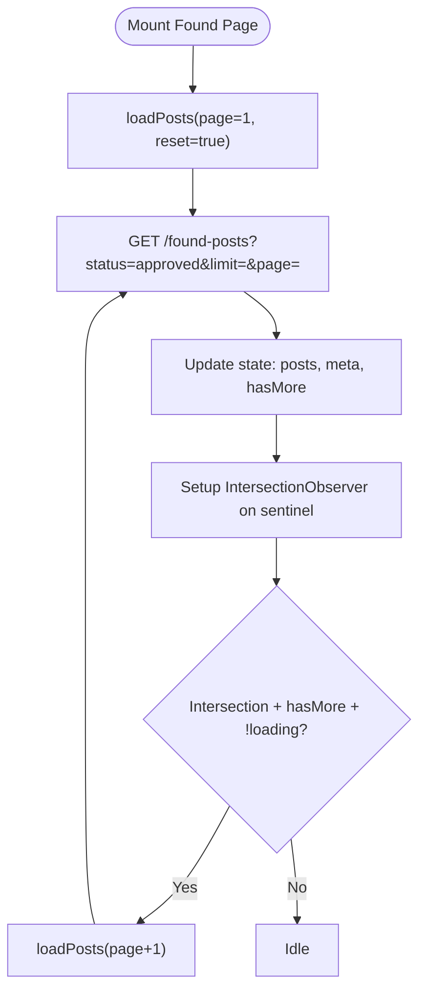

**Diagram sources**
- [page.tsx:82-126](file://frontend/app/found/page.tsx#L82-L126)

**Section sources**
- [page.tsx:49-127](file://frontend/app/found/page.tsx#L49-L127)

### Create Post Modal (Found Item Submission)
- Supports Found posts with location_found, time_found, category_id, image_urls, and is_in_storage.
- Validates minimum lengths and required fields.
- Uploads images via uploadFile and collects URLs.
- Submits to /found-posts with appropriate payload.

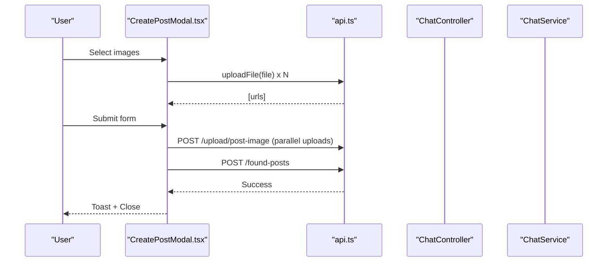

**Diagram sources**
- [CreatePostModal.tsx:135-238](file://frontend/app/components/CreatePostModal.tsx#L135-L238)
- [api.ts:48-82](file://frontend/app/lib/api.ts#L48-L82)

**Section sources**
- [CreatePostModal.tsx:23-84](file://frontend/app/components/CreatePostModal.tsx#L23-L84)
- [CreatePostModal.tsx:135-238](file://frontend/app/components/CreatePostModal.tsx#L135-L238)
- [create-found-post.dto.ts:1-48](file://backend/src/modules/found-posts/dto/create-found-post.dto.ts#L1-L48)

### Found Posts Management (Backend)
- Controller exposes endpoints for create, list, detail, update, delete, and admin review.
- Service inserts found posts with status approved by default and records status history.
- Supports filtering by status, category, and search; paginates results.

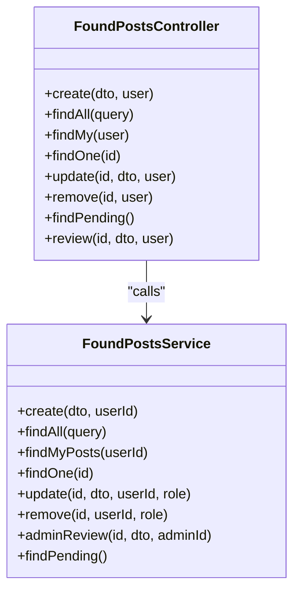

**Diagram sources**
- [found-posts.controller.ts:24-77](file://backend/src/modules/found-posts/found-posts.controller.ts#L24-L77)
- [found-posts.service.ts:19-161](file://backend/src/modules/found-posts/found-posts.service.ts#L19-L161)

**Section sources**
- [found-posts.controller.ts:24-77](file://backend/src/modules/found-posts/found-posts.controller.ts#L24-L77)
- [found-posts.service.ts:19-67](file://backend/src/modules/found-posts/found-posts.service.ts#L19-L67)

### AI Matching Integration
- Text-based matching: computes Jaccard similarity between concatenated title and description of lost and found posts within the same category.
- Suggests matches with a configurable threshold and stores them in ai_matches with pending status.
- Users confirm matches from either side; dual confirmation transitions to confirmed.

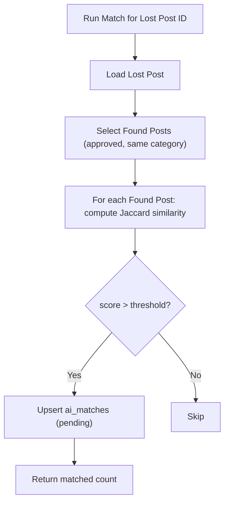

**Diagram sources**
- [ai-matches.service.ts:45-96](file://backend/src/modules/ai-matches/ai-matches.service.ts#L45-L96)
- [ai-matches.service.ts:144-153](file://backend/src/modules/ai-matches/ai-matches.service.ts#L144-L153)

**Section sources**
- [ai-matches.controller.ts:24-40](file://backend/src/modules/ai-matches/ai-matches.controller.ts#L24-L40)
- [ai-matches.service.ts:15-96](file://backend/src/modules/ai-matches/ai-matches.service.ts#L15-L96)

### Approval Workflow and Status Management
- Found posts are created with status approved and a post_status_history entry is inserted.
- Admin endpoints allow reviewing pending posts with rejection reasons and status updates.

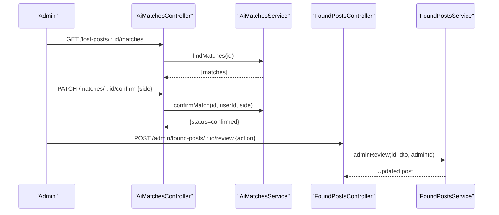

**Diagram sources**
- [ai-matches.controller.ts:36-40](file://backend/src/modules/ai-matches/ai-matches.controller.ts#L36-L40)
- [ai-matches.service.ts:101-141](file://backend/src/modules/ai-matches/ai-matches.service.ts#L101-L141)
- [found-posts.controller.ts:70-76](file://backend/src/modules/found-posts/found-posts.controller.ts#L70-L76)
- [found-posts.service.ts:117-145](file://backend/src/modules/found-posts/found-posts.service.ts#L117-L145)

**Section sources**
- [found-posts.service.ts:19-38](file://backend/src/modules/found-posts/found-posts.service.ts#L19-L38)
- [found-posts.service.ts:117-145](file://backend/src/modules/found-posts/found-posts.service.ts#L117-L145)

### Communication Features with Potential Owners
- Users can start a chat with the post author from the feed.
- Chat service supports creating or retrieving conversations and sending messages.
- Messages are marked as read upon retrieval.

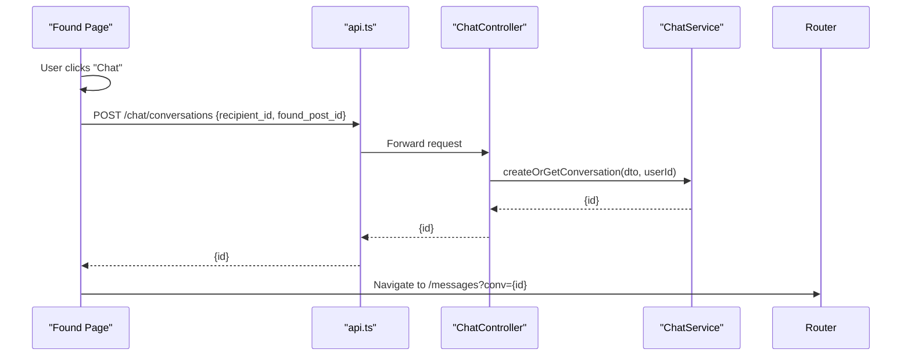

**Diagram sources**
- [page.tsx:61-80](file://frontend/app/found/page.tsx#L61-L80)
- [chat.controller.ts:21-25](file://backend/src/modules/chat/chat.controller.ts#L21-L25)
- [chat.service.ts:38-66](file://backend/src/modules/chat/chat.service.ts#L38-L66)

**Section sources**
- [page.tsx:61-80](file://frontend/app/found/page.tsx#L61-L80)
- [chat.controller.ts:21-25](file://backend/src/modules/chat/chat.controller.ts#L21-L25)
- [chat.service.ts:38-66](file://backend/src/modules/chat/chat.service.ts#L38-L66)

### Matching Visualization and Confirmation
- The feed shows approved found posts; AI matches are surfaced via the AI Matches module.
- Users confirm matches from their perspective; dual confirmation finalizes the suggestion.

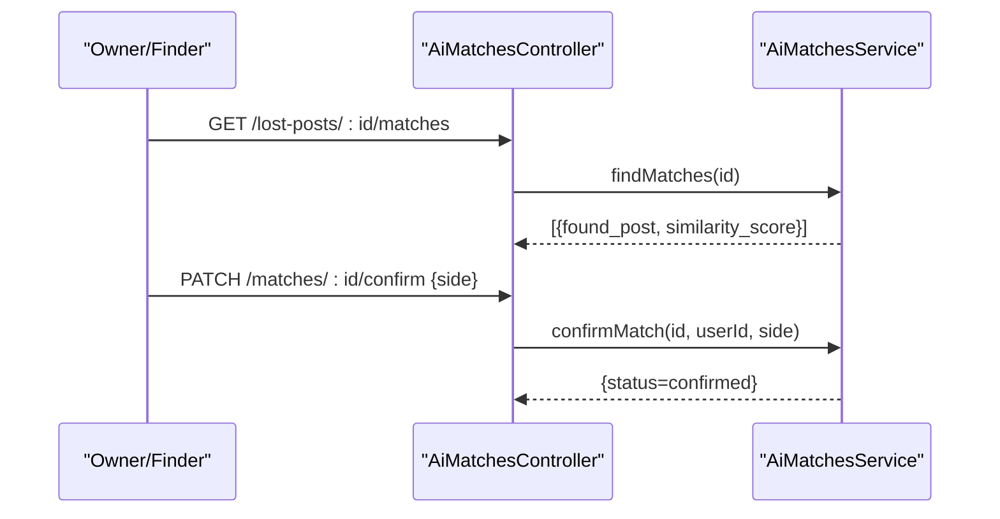

**Diagram sources**
- [ai-matches.controller.ts:24-40](file://backend/src/modules/ai-matches/ai-matches.controller.ts#L24-L40)
- [ai-matches.service.ts:15-40](file://backend/src/modules/ai-matches/ai-matches.service.ts#L15-L40)
- [ai-matches.service.ts:101-141](file://backend/src/modules/ai-matches/ai-matches.service.ts#L101-L141)

**Section sources**
- [ai-matches.controller.ts:24-40](file://backend/src/modules/ai-matches/ai-matches.controller.ts#L24-L40)
- [ai-matches.service.ts:15-40](file://backend/src/modules/ai-matches/ai-matches.service.ts#L15-L40)

### Handover Process Coordination
- A handover request ties a lost post and a found post with a verification code.
- Owner and finder each confirm with the code; on dual confirmation, the status completes and points are awarded.
- Completed handovers update related posts to closed.

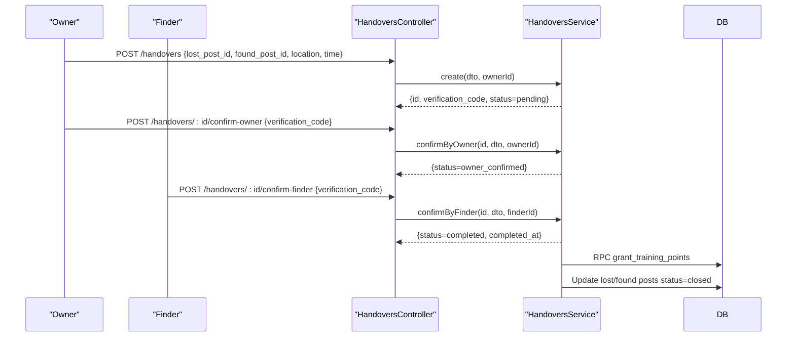

**Diagram sources**
- [handovers.controller.ts:15-43](file://backend/src/modules/handovers/handovers.controller.ts#L15-L43)
- [handovers.service.ts:12-32](file://backend/src/modules/handovers/handovers.service.ts#L12-L32)
- [handovers.service.ts:50-84](file://backend/src/modules/handovers/handovers.service.ts#L50-L84)
- [handovers.service.ts:86-115](file://backend/src/modules/handovers/handovers.service.ts#L86-L115)
- [OVERVIEW.md:526-555](file://OVERVIEW.md#L526-L555)

**Section sources**
- [handovers.controller.ts:15-43](file://backend/src/modules/handovers/handovers.controller.ts#L15-L43)
- [handovers.service.ts:12-32](file://backend/src/modules/handovers/handovers.service.ts#L12-L32)
- [handovers.service.ts:50-115](file://backend/src/modules/handovers/handovers.service.ts#L50-L115)
- [OVERVIEW.md:526-555](file://OVERVIEW.md#L526-L555)

### User Notification System for Matches
- Notifications service retrieves user notifications and unread counts.
- The system supports notification types including match_found, new_message, handover_request, handover_completed, points_awarded, etc.

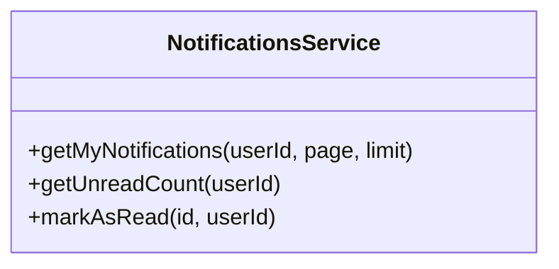

**Diagram sources**
- [notifications.service.ts:15-41](file://backend/src/modules/notifications/notifications.service.ts#L15-L41)

**Section sources**
- [notifications.service.ts:15-41](file://backend/src/modules/notifications/notifications.service.ts#L15-L41)
- [OVERVIEW.md:563-573](file://OVERVIEW.md#L563-L573)

### Form Components and Field Definitions
- Found post creation DTO defines required and optional fields for title, description, location_found, time_found, category_id, image_urls, contact_info, is_in_storage.
- Create Post Modal maps these fields and enforces client-side validation before submission.

**Section sources**
- [create-found-post.dto.ts:7-47](file://backend/src/modules/found-posts/dto/create-found-post.dto.ts#L7-L47)
- [CreatePostModal.tsx:135-238](file://frontend/app/components/CreatePostModal.tsx#L135-L238)

## Dependency Analysis
- Frontend depends on API utility for auth and base URL.
- Controllers depend on Services for business logic.
- Services depend on Supabase client for database operations.
- AI Matches and Handovers integrate with Notifications and database functions.

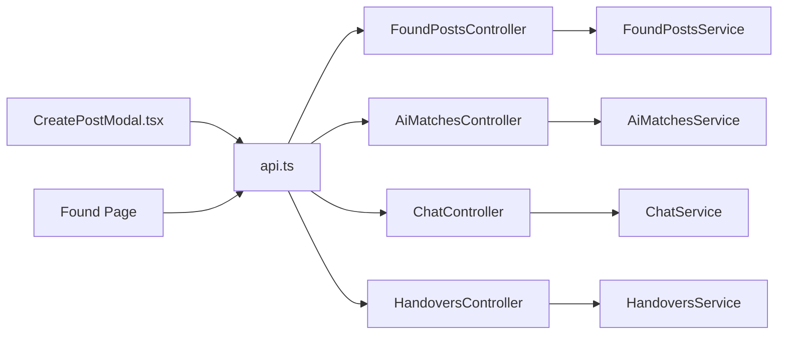

**Diagram sources**
- [api.ts:12-43](file://frontend/app/lib/api.ts#L12-L43)
- [found-posts.controller.ts:24-77](file://backend/src/modules/found-posts/found-posts.controller.ts#L24-L77)
- [ai-matches.controller.ts:24-40](file://backend/src/modules/ai-matches/ai-matches.controller.ts#L24-L40)
- [chat.controller.ts:21-25](file://backend/src/modules/chat/chat.controller.ts#L21-L25)
- [handovers.controller.ts:15-43](file://backend/src/modules/handovers/handovers.controller.ts#L15-L43)

**Section sources**
- [api.ts:12-43](file://frontend/app/lib/api.ts#L12-L43)
- [found-posts.controller.ts:24-77](file://backend/src/modules/found-posts/found-posts.controller.ts#L24-L77)
- [ai-matches.controller.ts:24-40](file://backend/src/modules/ai-matches/ai-matches.controller.ts#L24-L40)
- [chat.controller.ts:21-25](file://backend/src/modules/chat/chat.controller.ts#L21-L25)
- [handovers.controller.ts:15-43](file://backend/src/modules/handovers/handovers.controller.ts#L15-L43)

## Performance Considerations
- Infinite scroll with IntersectionObserver reduces initial payload and improves perceived performance.
- Parallel image uploads minimize submission latency.
- Pagination and range queries on backend reduce result sizes.
- Jaccard similarity is efficient for small to medium candidate sets; consider indexing and thresholds to cap computation.

## Troubleshooting Guide
- Authentication failures: API utility redirects to login on 401; check access_token presence and cookie credentials.
- Upload failures: Ensure images meet MIME type and size constraints; verify upload endpoint availability.
- Unauthorized actions: Found post updates/deletes require ownership or admin role; admin review requires proper roles.
- Chat errors: Ensure participants are part of the conversation; messages marked as read upon retrieval.
- Handover verification: Codes must match and not be expired; dual confirmation required for completion.

**Section sources**
- [api.ts:30-43](file://frontend/app/lib/api.ts#L30-L43)
- [CreatePostModal.tsx:182-193](file://frontend/app/components/CreatePostModal.tsx#L182-L193)
- [found-posts.service.ts:96-115](file://backend/src/modules/found-posts/found-posts.service.ts#L96-L115)
- [chat.service.ts:138-149](file://backend/src/modules/chat/chat.service.ts#L138-L149)
- [handovers.service.ts:57-62](file://backend/src/modules/handovers/handovers.service.ts#L57-L62)

## Conclusion
The Found Items Section integrates a streamlined submission flow, robust approval and matching mechanisms, and a secure handover process. The frontend provides responsive forms and feeds, while the backend ensures data integrity, permission checks, and event-driven notifications. Together, these components enable effective community coordination for returning lost items to their rightful owners.