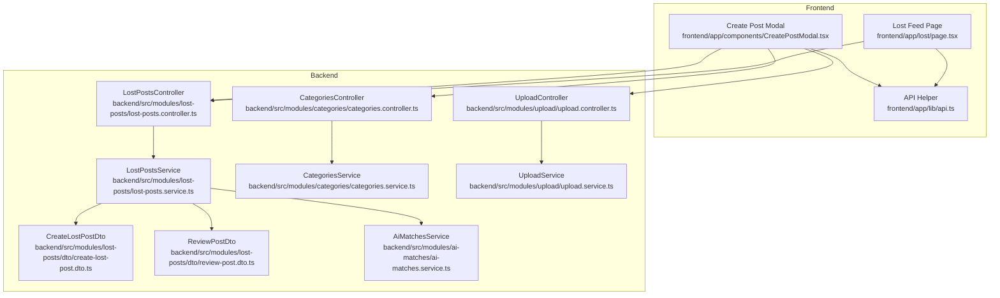
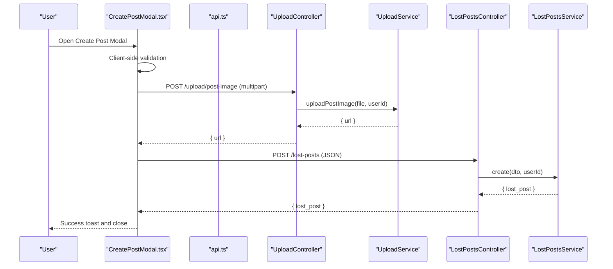
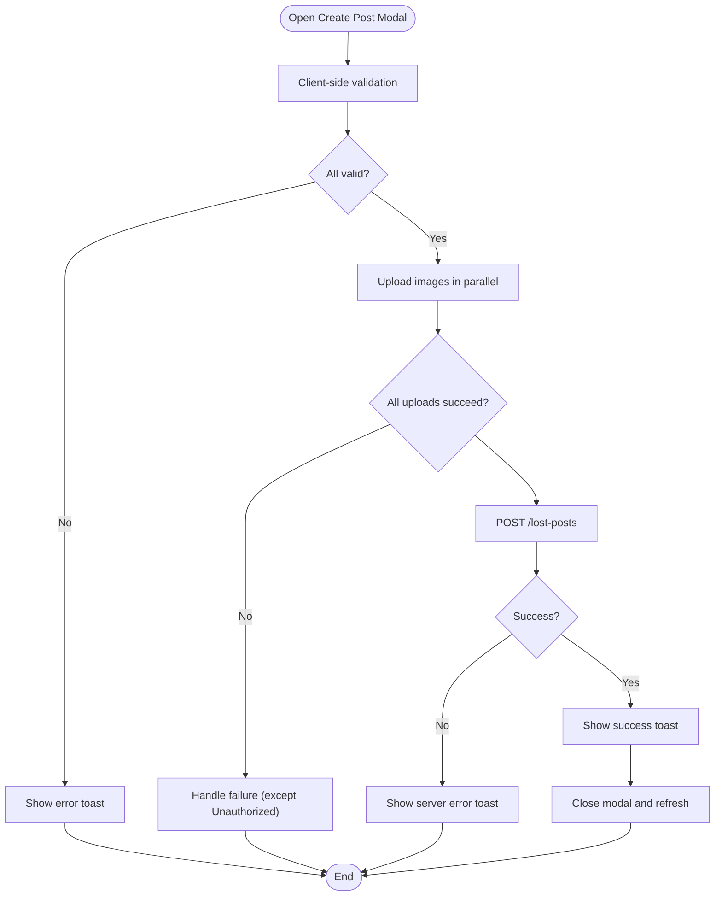
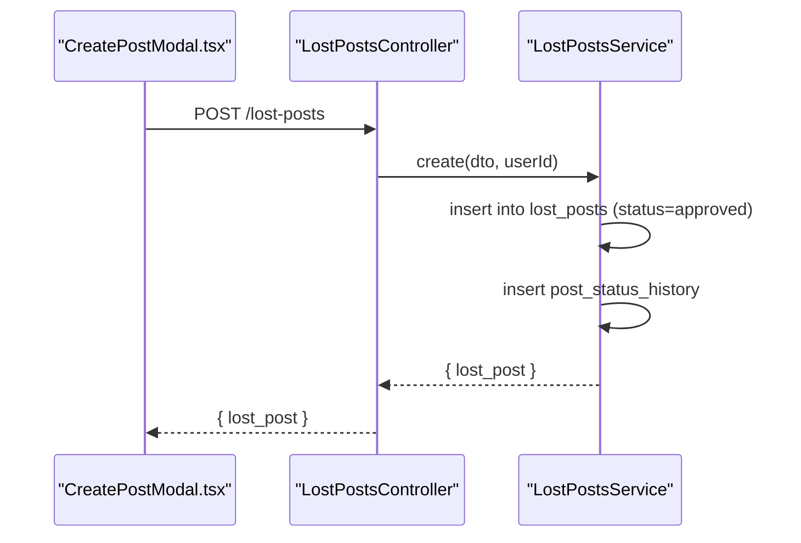
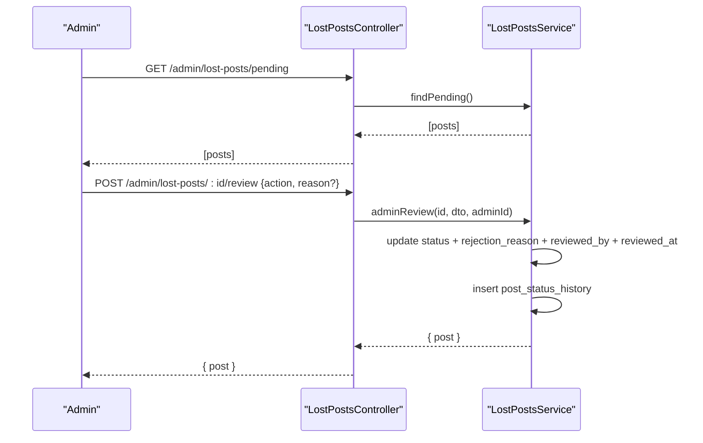
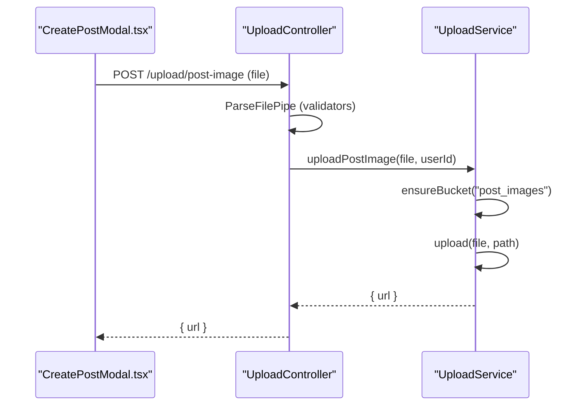
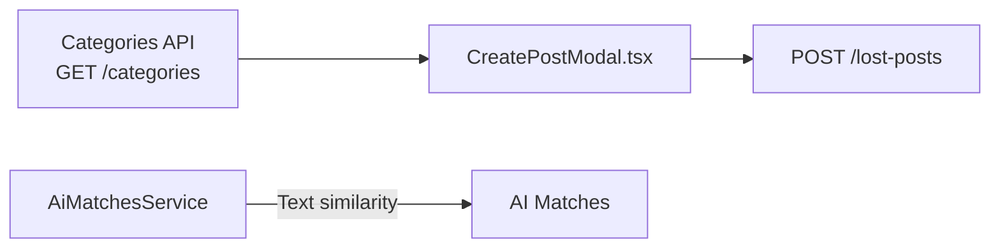
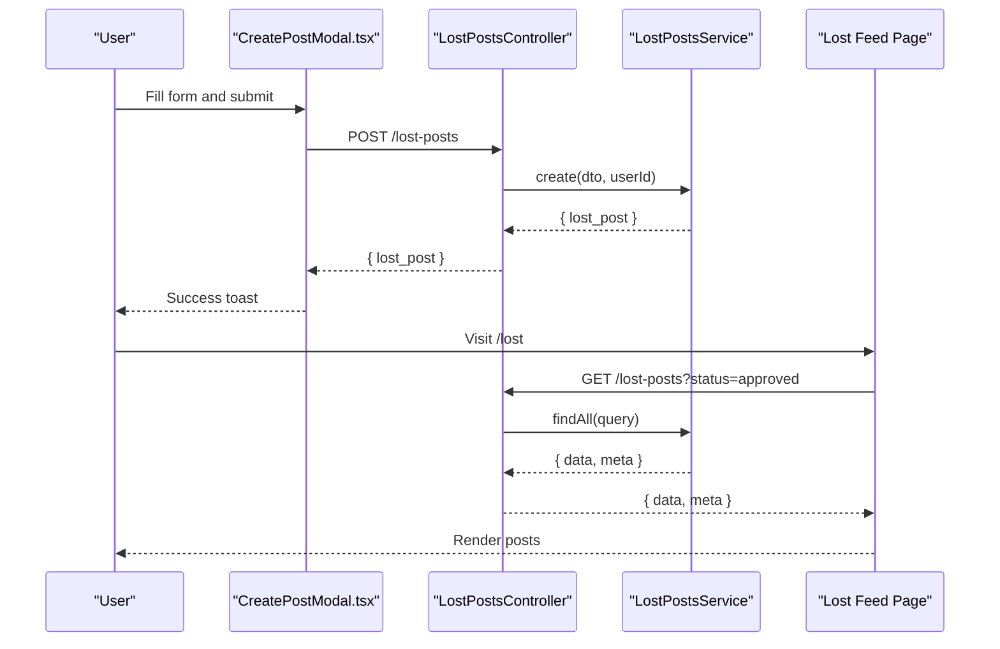
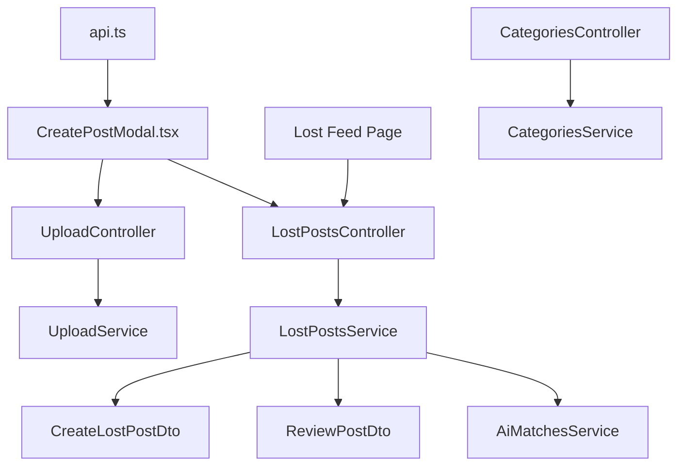

# Lost Items Section

<cite>
**Referenced Files in This Document**
- [lost-posts.controller.ts](file://backend/src/modules/lost-posts/lost-posts.controller.ts)
- [lost-posts.service.ts](file://backend/src/modules/lost-posts/lost-posts.service.ts)
- [create-lost-post.dto.ts](file://backend/src/modules/lost-posts/dto/create-lost-post.dto.ts)
- [review-post.dto.ts](file://backend/src/modules/lost-posts/dto/review-post.dto.ts)
- [categories.controller.ts](file://backend/src/modules/categories/categories.controller.ts)
- [categories.service.ts](file://backend/src/modules/categories/categories.service.ts)
- [category.entity.ts](file://backend/src/modules/categories/entities/category.entity.ts)
- [upload.controller.ts](file://backend/src/modules/upload/upload.controller.ts)
- [upload.service.ts](file://backend/src/modules/upload/upload.service.ts)
- [ai-matches.service.ts](file://backend/src/modules/ai-matches/ai-matches.service.ts)
- [api.ts](file://frontend/app/lib/api.ts)
- [CreatePostModal.tsx](file://frontend/app/components/CreatePostModal.tsx)
- [page.tsx](file://frontend/app/lost/page.tsx)
</cite>

## Table of Contents
1. [Introduction](#introduction)
2. [Project Structure](#project-structure)
3. [Core Components](#core-components)
4. [Architecture Overview](#architecture-overview)
5. [Detailed Component Analysis](#detailed-component-analysis)
6. [Dependency Analysis](#dependency-analysis)
7. [Performance Considerations](#performance-considerations)
8. [Troubleshooting Guide](#troubleshooting-guide)
9. [Conclusion](#conclusion)

## Introduction
This document describes the lost items section page and its associated lost post creation workflow. It covers the frontend form for creating lost posts, including field validation, image upload, and category selection. It explains the backend APIs for lost post creation, approval workflow integration, status tracking, and user feedback mechanisms. It also documents the integration with the AI categorization system for automatic item classification and administrator manual overrides.

## Project Structure
The lost items section spans both frontend and backend:
- Frontend: Next.js app with a lost feed page and a reusable Create Post modal.
- Backend: NestJS modules for lost posts, categories, uploads, and AI matches.

**Diagram sources**
- [page.tsx:51-316](file://frontend/app/lost/page.tsx#L51-L316)
- [CreatePostModal.tsx:23-583](file://frontend/app/components/CreatePostModal.tsx#L23-L583)
- [api.ts:12-82](file://frontend/app/lib/api.ts#L12-L82)
- [lost-posts.controller.ts:21-77](file://backend/src/modules/lost-posts/lost-posts.controller.ts#L21-L77)
- [lost-posts.service.ts:14-188](file://backend/src/modules/lost-posts/lost-posts.service.ts#L14-L188)
- [create-lost-post.dto.ts:14-60](file://backend/src/modules/lost-posts/dto/create-lost-post.dto.ts#L14-L60)
- [review-post.dto.ts:4-13](file://backend/src/modules/lost-posts/dto/review-post.dto.ts#L4-L13)
- [categories.controller.ts:8-17](file://backend/src/modules/categories/categories.controller.ts#L8-L17)
- [categories.service.ts:5-31](file://backend/src/modules/categories/categories.service.ts#L5-L31)
- [upload.controller.ts:23-79](file://backend/src/modules/upload/upload.controller.ts#L23-L79)
- [upload.service.ts:6-171](file://backend/src/modules/upload/upload.service.ts#L6-L171)
- [ai-matches.service.ts:6-366](file://backend/src/modules/ai-matches/ai-matches.service.ts#L6-L366)

**Section sources**
- [page.tsx:51-316](file://frontend/app/lost/page.tsx#L51-L316)
- [CreatePostModal.tsx:23-583](file://frontend/app/components/CreatePostModal.tsx#L23-L583)
- [api.ts:12-82](file://frontend/app/lib/api.ts#L12-L82)
- [lost-posts.controller.ts:21-77](file://backend/src/modules/lost-posts/lost-posts.controller.ts#L21-L77)
- [lost-posts.service.ts:14-188](file://backend/src/modules/lost-posts/lost-posts.service.ts#L14-L188)
- [create-lost-post.dto.ts:14-60](file://backend/src/modules/lost-posts/dto/create-lost-post.dto.ts#L14-L60)
- [review-post.dto.ts:4-13](file://backend/src/modules/lost-posts/dto/review-post.dto.ts#L4-L13)
- [categories.controller.ts:8-17](file://backend/src/modules/categories/categories.controller.ts#L8-L17)
- [categories.service.ts:5-31](file://backend/src/modules/categories/categories.service.ts#L5-L31)
- [upload.controller.ts:23-79](file://backend/src/modules/upload/upload.controller.ts#L23-L79)
- [upload.service.ts:6-171](file://backend/src/modules/upload/upload.service.ts#L6-L171)
- [ai-matches.service.ts:6-366](file://backend/src/modules/ai-matches/ai-matches.service.ts#L6-L366)

## Core Components
- Lost Posts API: Handles creation, retrieval, updates, deletion, and admin review of lost posts.
- Categories API: Provides category metadata for item classification.
- Upload API: Handles image uploads with size/type validation and returns public URLs.
- Create Post Modal: Frontend form for lost post creation with client-side validation, image drag-and-drop, and submission flow.
- Lost Feed Page: Displays approved lost posts with infinite scroll and user actions.

Key backend DTOs:
- CreateLostPostDto: Defines required/optional fields and validation rules for lost post creation.
- ReviewPostDto: Defines admin review action and optional reason.

Key frontend components:
- CreatePostModal: Manages form state, validation, image upload, and submission.
- Lost Feed Page: Fetches and renders approved posts.

**Section sources**
- [lost-posts.controller.ts:21-77](file://backend/src/modules/lost-posts/lost-posts.controller.ts#L21-L77)
- [lost-posts.service.ts:14-188](file://backend/src/modules/lost-posts/lost-posts.service.ts#L14-L188)
- [create-lost-post.dto.ts:14-60](file://backend/src/modules/lost-posts/dto/create-lost-post.dto.ts#L14-L60)
- [review-post.dto.ts:4-13](file://backend/src/modules/lost-posts/dto/review-post.dto.ts#L4-L13)
- [categories.controller.ts:8-17](file://backend/src/modules/categories/categories.controller.ts#L8-L17)
- [categories.service.ts:5-31](file://backend/src/modules/categories/categories.service.ts#L5-L31)
- [upload.controller.ts:23-79](file://backend/src/modules/upload/upload.controller.ts#L23-L79)
- [upload.service.ts:6-171](file://backend/src/modules/upload/upload.service.ts#L6-L171)
- [CreatePostModal.tsx:23-583](file://frontend/app/components/CreatePostModal.tsx#L23-L583)
- [page.tsx:51-316](file://frontend/app/lost/page.tsx#L51-L316)

## Architecture Overview
The lost items section integrates frontend and backend modules to support:
- Lost post creation with image upload and category selection.
- Automatic status assignment upon creation.
- Admin review workflow with status history logging.
- Optional AI-driven matching for related found posts.

**Diagram sources**
- [CreatePostModal.tsx:135-238](file://frontend/app/components/CreatePostModal.tsx#L135-L238)
- [api.ts:12-82](file://frontend/app/lib/api.ts#L12-L82)
- [upload.controller.ts:26-51](file://backend/src/modules/upload/upload.controller.ts#L26-L51)
- [upload.service.ts:53-81](file://backend/src/modules/upload/upload.service.ts#L53-L81)
- [lost-posts.controller.ts:24-28](file://backend/src/modules/lost-posts/lost-posts.controller.ts#L24-L28)
- [lost-posts.service.ts:19-43](file://backend/src/modules/lost-posts/lost-posts.service.ts#L19-L43)

## Detailed Component Analysis

### Lost Post Creation Form (Frontend)
The Create Post Modal provides a unified form for lost/found posts with:
- Title and description with minimum length validations.
- Category selection fetched from the Categories API.
- Incident date/time selection.
- Location input with geolocation helper.
- Optional urgent flag for lost posts and reward note.
- Optional storage flag for found posts.
- Image upload with drag-and-drop, preview, and progress indication.
- Submission flow with toast notifications.

Validation rules and behaviors:
- Title: Required, min 10 chars.
- Description: Required, min 20 chars.
- Location: Required.
- Incident date: Required.
- Images: Up to 5, JPEG/PNG/WebP, max 5MB each.
- Category: Optional UUID; if provided, used in submission.

Submission flow:
- Upload images in parallel and compute upload progress.
- Build request payload based on post type (lost vs found).
- Send POST to /lost-posts.
- Show success toast and close modal after delay.

**Diagram sources**
- [CreatePostModal.tsx:135-238](file://frontend/app/components/CreatePostModal.tsx#L135-L238)
- [api.ts:12-82](file://frontend/app/lib/api.ts#L12-L82)

**Section sources**
- [CreatePostModal.tsx:23-583](file://frontend/app/components/CreatePostModal.tsx#L23-L583)
- [api.ts:12-82](file://frontend/app/lib/api.ts#L12-L82)

### Backend Lost Post Creation (Backend)
The backend creates lost posts with:
- Insert into lost_posts with status set to approved by default.
- Status history logging for new post creation.
- Strict validation via DTOs and thrown exceptions on errors.

Key behaviors:
- Uses CreateLostPostDto for validation (title, description, location_lost, time_lost, optional category_id, image_urls, contact_info, is_urgent, reward_note).
- Returns created post data.

**Diagram sources**
- [lost-posts.controller.ts:24-28](file://backend/src/modules/lost-posts/lost-posts.controller.ts#L24-L28)
- [lost-posts.service.ts:19-43](file://backend/src/modules/lost-posts/lost-posts.service.ts#L19-L43)
- [create-lost-post.dto.ts:14-60](file://backend/src/modules/lost-posts/dto/create-lost-post.dto.ts#L14-L60)

**Section sources**
- [lost-posts.controller.ts:21-77](file://backend/src/modules/lost-posts/lost-posts.controller.ts#L21-L77)
- [lost-posts.service.ts:14-188](file://backend/src/modules/lost-posts/lost-posts.service.ts#L14-L188)
- [create-lost-post.dto.ts:14-60](file://backend/src/modules/lost-posts/dto/create-lost-post.dto.ts#L14-L60)

### Approval Workflow and Status Tracking
Admin review workflow:
- Admin endpoint GET /admin/lost-posts/pending lists pending posts.
- Admin endpoint POST /admin/lost-posts/:id/review updates status to approved or rejected with optional reason.
- Status history logging captures old/new status, changed_by, and note.

User feedback:
- Successful admin review returns updated post.
- Validation errors during review are thrown as ValidationException.

**Diagram sources**
- [lost-posts.controller.ts:62-76](file://backend/src/modules/lost-posts/lost-posts.controller.ts#L62-L76)
- [lost-posts.service.ts:139-187](file://backend/src/modules/lost-posts/lost-posts.service.ts#L139-L187)
- [review-post.dto.ts:4-13](file://backend/src/modules/lost-posts/dto/review-post.dto.ts#L4-L13)

**Section sources**
- [lost-posts.controller.ts:62-76](file://backend/src/modules/lost-posts/lost-posts.controller.ts#L62-L76)
- [lost-posts.service.ts:139-187](file://backend/src/modules/lost-posts/lost-posts.service.ts#L139-L187)
- [review-post.dto.ts:4-13](file://backend/src/modules/lost-posts/dto/review-post.dto.ts#L4-L13)

### Image Upload Functionality
Image upload pipeline:
- Frontend uploads files via multipart/form-data to /upload/post-image.
- Backend validates file size (<5MB) and MIME type (JPEG/PNG/WebP).
- UploadService stores file in Supabase Storage bucket "post_images" and returns public URL.
- Frontend collects URLs and sends them in the lost post creation payload.

**Diagram sources**
- [CreatePostModal.tsx:160-194](file://frontend/app/components/CreatePostModal.tsx#L160-L194)
- [upload.controller.ts:26-51](file://backend/src/modules/upload/upload.controller.ts#L26-L51)
- [upload.service.ts:53-81](file://backend/src/modules/upload/upload.service.ts#L53-L81)

**Section sources**
- [upload.controller.ts:23-79](file://backend/src/modules/upload/upload.controller.ts#L23-L79)
- [upload.service.ts:6-171](file://backend/src/modules/upload/upload.service.ts#L6-L171)
- [CreatePostModal.tsx:104-194](file://frontend/app/components/CreatePostModal.tsx#L104-L194)

### Category Selection and AI Categorization
Category selection:
- Frontend fetches categories from /categories and populates dropdown.
- Backend returns active categories ordered by sort order.

AI categorization:
- The AI Matches service computes text similarity between lost and found posts within the same category.
- Matches are stored with a similarity score and can be confirmed by owner or finder.
- The lost post creation flow sets status to approved immediately; AI matching runs separately to suggest matches.

Note: Automatic category inference is not implemented in the lost post creation flow. Administrators can manually adjust categories via the admin endpoints.

**Diagram sources**
- [categories.controller.ts:11-16](file://backend/src/modules/categories/categories.controller.ts#L11-L16)
- [categories.service.ts:10-19](file://backend/src/modules/categories/categories.service.ts#L10-L19)
- [CreatePostModal.tsx:48-58](file://frontend/app/components/CreatePostModal.tsx#L48-L58)
- [ai-matches.service.ts:45-96](file://backend/src/modules/ai-matches/ai-matches.service.ts#L45-L96)

**Section sources**
- [categories.controller.ts:8-17](file://backend/src/modules/categories/categories.controller.ts#L8-L17)
- [categories.service.ts:5-31](file://backend/src/modules/categories/categories.service.ts#L5-L31)
- [category.entity.ts:1-11](file://backend/src/modules/categories/entities/category.entity.ts#L1-L11)
- [ai-matches.service.ts:6-366](file://backend/src/modules/ai-matches/ai-matches.service.ts#L6-L366)
- [CreatePostModal.tsx:48-58](file://frontend/app/components/CreatePostModal.tsx#L48-L58)

### Lost Feed and User Journey
The lost feed displays approved posts with:
- Infinite scroll pagination.
- User avatars and names.
- Option to start a chat with the post author.

User journey from post creation to approval:
- User fills the Create Post Modal and submits.
- Backend creates the post with status approved and logs status history.
- The post appears immediately in the public feed.
- Admins can review pending posts and change status if needed.

**Diagram sources**
- [CreatePostModal.tsx:196-230](file://frontend/app/components/CreatePostModal.tsx#L196-L230)
- [lost-posts.controller.ts:24-28](file://backend/src/modules/lost-posts/lost-posts.controller.ts#L24-L28)
- [lost-posts.service.ts:45-73](file://backend/src/modules/lost-posts/lost-posts.service.ts#L45-L73)
- [page.tsx:81-104](file://frontend/app/lost/page.tsx#L81-L104)

**Section sources**
- [page.tsx:51-316](file://frontend/app/lost/page.tsx#L51-L316)
- [lost-posts.controller.ts:30-48](file://backend/src/modules/lost-posts/lost-posts.controller.ts#L30-L48)
- [lost-posts.service.ts:45-103](file://backend/src/modules/lost-posts/lost-posts.service.ts#L45-L103)

## Dependency Analysis
- Frontend depends on:
  - API helper for authenticated requests and uploads.
  - CreatePostModal for form UX and submission.
  - Lost feed page for displaying approved posts.
- Backend modules depend on:
  - Supabase client for database and storage operations.
  - DTOs for validation.
  - Services for business logic and external integrations.

**Diagram sources**
- [api.ts:12-82](file://frontend/app/lib/api.ts#L12-L82)
- [CreatePostModal.tsx:23-583](file://frontend/app/components/CreatePostModal.tsx#L23-L583)
- [page.tsx:51-316](file://frontend/app/lost/page.tsx#L51-L316)
- [lost-posts.controller.ts:21-77](file://backend/src/modules/lost-posts/lost-posts.controller.ts#L21-L77)
- [lost-posts.service.ts:14-188](file://backend/src/modules/lost-posts/lost-posts.service.ts#L14-L188)
- [create-lost-post.dto.ts:14-60](file://backend/src/modules/lost-posts/dto/create-lost-post.dto.ts#L14-L60)
- [review-post.dto.ts:4-13](file://backend/src/modules/lost-posts/dto/review-post.dto.ts#L4-L13)
- [upload.controller.ts:23-79](file://backend/src/modules/upload/upload.controller.ts#L23-L79)
- [upload.service.ts:6-171](file://backend/src/modules/upload/upload.service.ts#L6-L171)
- [categories.controller.ts:8-17](file://backend/src/modules/categories/categories.controller.ts#L8-L17)
- [categories.service.ts:5-31](file://backend/src/modules/categories/categories.service.ts#L5-L31)
- [ai-matches.service.ts:6-366](file://backend/src/modules/ai-matches/ai-matches.service.ts#L6-L366)

**Section sources**
- [api.ts:12-82](file://frontend/app/lib/api.ts#L12-L82)
- [lost-posts.controller.ts:21-77](file://backend/src/modules/lost-posts/lost-posts.controller.ts#L21-L77)
- [lost-posts.service.ts:14-188](file://backend/src/modules/lost-posts/lost-posts.service.ts#L14-L188)
- [upload.controller.ts:23-79](file://backend/src/modules/upload/upload.controller.ts#L23-L79)
- [categories.controller.ts:8-17](file://backend/src/modules/categories/categories.controller.ts#L8-L17)
- [ai-matches.service.ts:6-366](file://backend/src/modules/ai-matches/ai-matches.service.ts#L6-L366)

## Performance Considerations
- Image uploads are performed in parallel with progress tracking; consider limiting concurrency for very large batches.
- Pagination on the lost feed uses range queries; ensure proper indexing on status, created_at, and category_id for optimal performance.
- Status history logging adds write overhead on creation and review; monitor frequency and storage growth.
- AI matching runs text similarity against approved found posts; consider batching and rate-limiting for large datasets.

## Troubleshooting Guide
Common issues and resolutions:
- Unauthorized access during upload or submission:
  - The API helper removes local tokens and redirects to login on 401. Ensure the user is authenticated.
- Upload failures:
  - Validate file size (<5MB) and MIME type (JPEG/PNG/WebP). Check network connectivity and Supabase storage availability.
- Validation errors on lost post creation:
  - Ensure title (min 10), description (min 20), location, and incident date are provided. Check backend DTO constraints.
- Admin review errors:
  - Rejection requires a reason. Ensure action and reason are provided when rejecting.
- Status history not recorded:
  - Verify post_status_history inserts occur on creation and review.

**Section sources**
- [api.ts:30-43](file://frontend/app/lib/api.ts#L30-L43)
- [upload.controller.ts:38-47](file://backend/src/modules/upload/upload.controller.ts#L38-L47)
- [create-lost-post.dto.ts:16-32](file://backend/src/modules/lost-posts/dto/create-lost-post.dto.ts#L16-L32)
- [lost-posts.service.ts:142-144](file://backend/src/modules/lost-posts/lost-posts.service.ts#L142-L144)
- [lost-posts.service.ts:32-40](file://backend/src/modules/lost-posts/lost-posts.service.ts#L32-L40)
- [lost-posts.service.ts:160-168](file://backend/src/modules/lost-posts/lost-posts.service.ts#L160-L168)

## Conclusion
The lost items section provides a robust end-to-end experience for reporting lost items:
- A user-friendly form with client-side validation and image upload.
- Immediate post approval with status history logging.
- Admin review workflow with explicit status transitions and reasons.
- Integration with categories and optional AI matching for related found posts.
Future enhancements could include automatic category inference and expanded admin controls for category management.