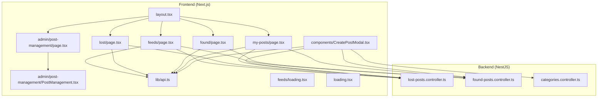
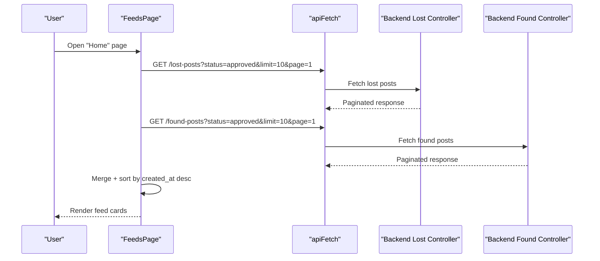
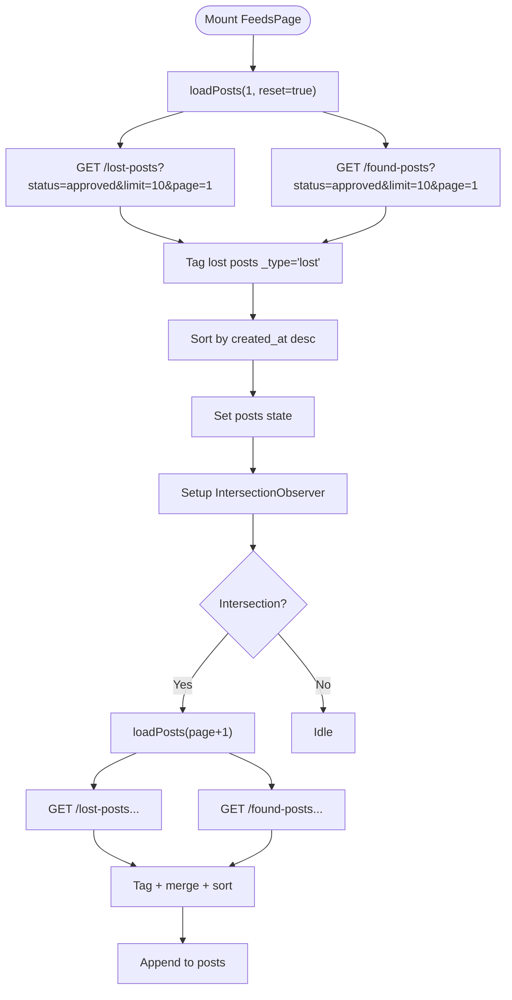
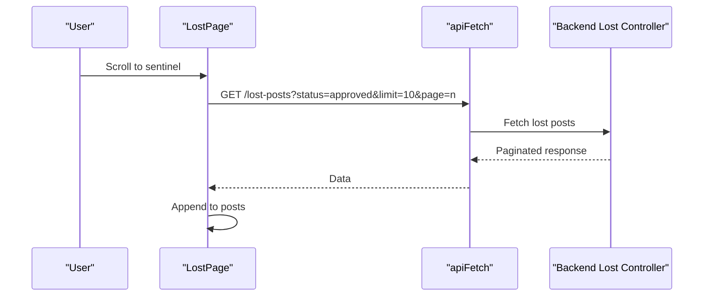
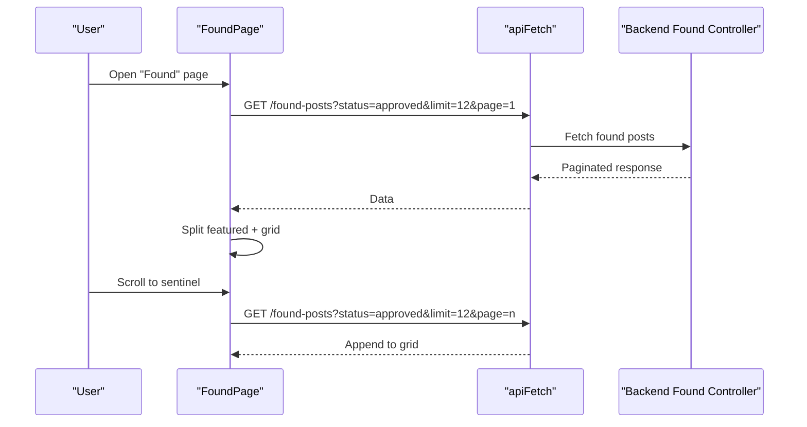
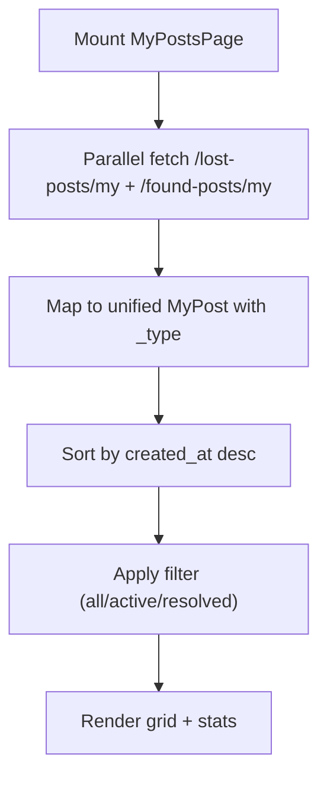
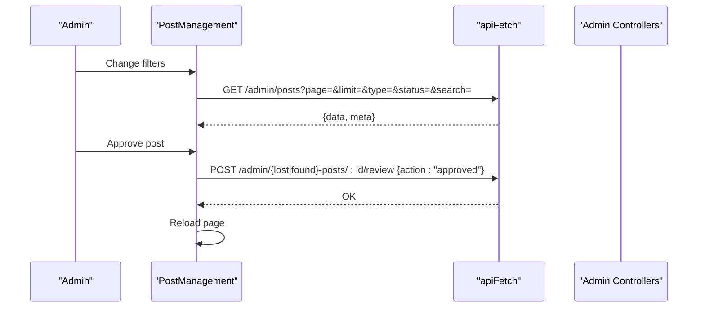
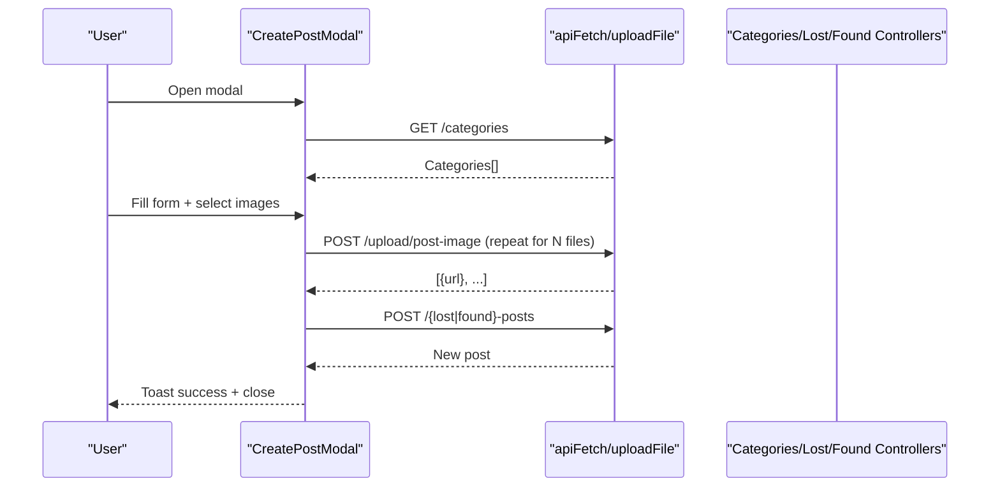
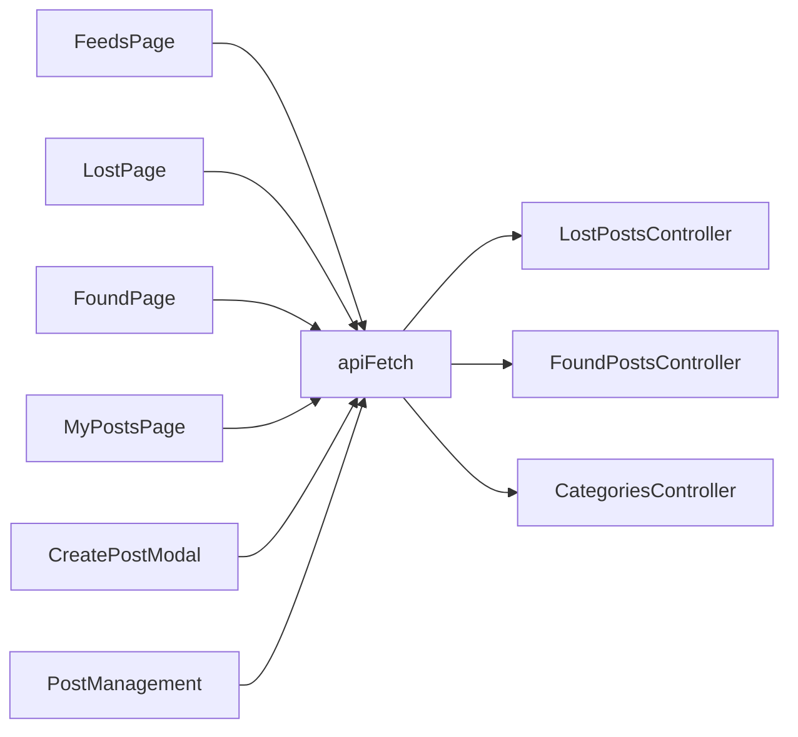

# Main Application Pages

<cite>
**Referenced Files in This Document**
- [frontend/app/feeds/page.tsx](file://frontend/app/feeds/page.tsx)
- [frontend/app/feeds/loading.tsx](file://frontend/app/feeds/loading.tsx)
- [frontend/app/lost/page.tsx](file://frontend/app/lost/page.tsx)
- [frontend/app/found/page.tsx](file://frontend/app/found/page.tsx)
- [frontend/app/my-posts/page.tsx](file://frontend/app/my-posts/page.tsx)
- [frontend/app/admin/post-management/page.tsx](file://frontend/app/admin/post-management/page.tsx)
- [frontend/app/admin/post-management/PostManagement.tsx](file://frontend/app/admin/post-management/PostManagement.tsx)
- [frontend/app/components/CreatePostModal.tsx](file://frontend/app/components/CreatePostModal.tsx)
- [frontend/app/lib/api.ts](file://frontend/app/lib/api.ts)
- [frontend/app/layout.tsx](file://frontend/app/layout.tsx)
- [frontend/app/loading.tsx](file://frontend/app/loading.tsx)
- [backend/src/modules/lost-posts/lost-posts.controller.ts](file://backend/src/modules/lost-posts/lost-posts.controller.ts)
- [backend/src/modules/found-posts/found-posts.controller.ts](file://backend/src/modules/found-posts/found-posts.controller.ts)
- [backend/src/modules/categories/categories.controller.ts](file://backend/src/modules/categories/categories.controller.ts)
- [backend/src/modules/categories/entities/category.entity.ts](file://backend/src/modules/categories/entities/category.entity.ts)
</cite>

## Table of Contents
1. [Introduction](#introduction)
2. [Project Structure](#project-structure)
3. [Core Components](#core-components)
4. [Architecture Overview](#architecture-overview)
5. [Detailed Component Analysis](#detailed-component-analysis)
6. [Dependency Analysis](#dependency-analysis)
7. [Performance Considerations](#performance-considerations)
8. [Troubleshooting Guide](#troubleshooting-guide)
9. [Conclusion](#conclusion)

## Introduction
This document explains the core user-facing pages of the MissLost application. It covers:
- The unified feed displaying lost and found posts with infinite scrolling and filtering
- The lost item posting interface and found item submission process
- User post management (viewing and status filtering)
- Page routing, data fetching patterns, and loading/error handling
- Real-time-like updates for post listings
- Backend API integration for posts, categories, and admin workflows

## Project Structure
The frontend is a Next.js app with route-based page components under app/. Each page encapsulates its own data fetching, rendering, and user interactions. Shared utilities live under app/lib, and reusable UI under app/components. Admin pages are under app/admin.

**Diagram sources**
- [frontend/app/layout.tsx:19-43](file://frontend/app/layout.tsx#L19-L43)
- [frontend/app/feeds/page.tsx:61-489](file://frontend/app/feeds/page.tsx#L61-L489)
- [frontend/app/lost/page.tsx:51-317](file://frontend/app/lost/page.tsx#L51-L317)
- [frontend/app/found/page.tsx:49-405](file://frontend/app/found/page.tsx#L49-L405)
- [frontend/app/my-posts/page.tsx:38-270](file://frontend/app/my-posts/page.tsx#L38-L270)
- [frontend/app/admin/post-management/page.tsx:1-6](file://frontend/app/admin/post-management/page.tsx#L1-L6)
- [frontend/app/admin/post-management/PostManagement.tsx:38-698](file://frontend/app/admin/post-management/PostManagement.tsx#L38-L698)
- [frontend/app/components/CreatePostModal.tsx:23-584](file://frontend/app/components/CreatePostModal.tsx#L23-L584)
- [frontend/app/lib/api.ts:12-83](file://frontend/app/lib/api.ts#L12-L83)
- [backend/src/modules/lost-posts/lost-posts.controller.ts:21-77](file://backend/src/modules/lost-posts/lost-posts.controller.ts#L21-L77)
- [backend/src/modules/found-posts/found-posts.controller.ts:21-77](file://backend/src/modules/found-posts/found-posts.controller.ts#L21-L77)
- [backend/src/modules/categories/categories.controller.ts:8-17](file://backend/src/modules/categories/categories.controller.ts#L8-L17)

**Section sources**
- [frontend/app/layout.tsx:19-43](file://frontend/app/layout.tsx#L19-L43)
- [frontend/app/feeds/page.tsx:61-489](file://frontend/app/feeds/page.tsx#L61-L489)
- [frontend/app/lost/page.tsx:51-317](file://frontend/app/lost/page.tsx#L51-L317)
- [frontend/app/found/page.tsx:49-405](file://frontend/app/found/page.tsx#L49-L405)
- [frontend/app/my-posts/page.tsx:38-270](file://frontend/app/my-posts/page.tsx#L38-L270)
- [frontend/app/admin/post-management/page.tsx:1-6](file://frontend/app/admin/post-management/page.tsx#L1-L6)
- [frontend/app/admin/post-management/PostManagement.tsx:38-698](file://frontend/app/admin/post-management/PostManagement.tsx#L38-L698)
- [frontend/app/components/CreatePostModal.tsx:23-584](file://frontend/app/components/CreatePostModal.tsx#L23-L584)
- [frontend/app/lib/api.ts:12-83](file://frontend/app/lib/api.ts#L12-L83)
- [backend/src/modules/lost-posts/lost-posts.controller.ts:21-77](file://backend/src/modules/lost-posts/lost-posts.controller.ts#L21-L77)
- [backend/src/modules/found-posts/found-posts.controller.ts:21-77](file://backend/src/modules/found-posts/found-posts.controller.ts#L21-L77)
- [backend/src/modules/categories/categories.controller.ts:8-17](file://backend/src/modules/categories/categories.controller.ts#L8-L17)

## Core Components
- Unified Feed (FeedsPage): Loads and merges lost and found posts, supports infinite scroll, and shows a composer trigger to open the CreatePostModal.
- Lost Items Page: Dedicated feed for approved lost posts with category chips and messaging integration.
- Found Items Page: Dedicated feed for approved found posts with featured card and messaging integration.
- My Posts Page: Aggregated view of user’s lost and found posts with status filtering and statistics.
- Admin Post Management: Full CRUD and review workflow for posts with filters and stats.
- Create Post Modal: Multi-step form for lost/found posts with image uploads, category selection, and validation.
- API Utilities: Centralized fetch wrapper with auth and upload helpers.

**Section sources**
- [frontend/app/feeds/page.tsx:61-489](file://frontend/app/feeds/page.tsx#L61-L489)
- [frontend/app/lost/page.tsx:51-317](file://frontend/app/lost/page.tsx#L51-L317)
- [frontend/app/found/page.tsx:49-405](file://frontend/app/found/page.tsx#L49-L405)
- [frontend/app/my-posts/page.tsx:38-270](file://frontend/app/my-posts/page.tsx#L38-L270)
- [frontend/app/admin/post-management/PostManagement.tsx:38-698](file://frontend/app/admin/post-management/PostManagement.tsx#L38-L698)
- [frontend/app/components/CreatePostModal.tsx:23-584](file://frontend/app/components/CreatePostModal.tsx#L23-L584)
- [frontend/app/lib/api.ts:12-83](file://frontend/app/lib/api.ts#L12-L83)

## Architecture Overview
The pages use a shared data-fetching pattern:
- apiFetch: Adds Bearer token and credentials, handles 401 redirects, parses JSON, and throws errors.
- uploadFile: Handles multipart/form-data uploads for images.
- Each page composes data from backend endpoints and renders skeletons during initial load.

**Diagram sources**
- [frontend/app/feeds/page.tsx:73-113](file://frontend/app/feeds/page.tsx#L73-L113)
- [frontend/app/lib/api.ts:12-43](file://frontend/app/lib/api.ts#L12-L43)
- [backend/src/modules/lost-posts/lost-posts.controller.ts:30-35](file://backend/src/modules/lost-posts/lost-posts.controller.ts#L30-L35)
- [backend/src/modules/found-posts/found-posts.controller.ts:30-35](file://backend/src/modules/found-posts/found-posts.controller.ts#L30-L35)

## Detailed Component Analysis

### Unified Feed (FeedsPage)
- Purpose: Display combined lost and found posts in reverse chronological order.
- Features:
  - Parallel fetch of lost and found posts
  - Infinite scroll using IntersectionObserver
  - Composer trigger opens CreatePostModal
  - Loading skeletons and empty state
  - Refresh after successful post creation
- Data model: Merges two backend schemas into a single FeedPost type with a _type discriminator.

**Diagram sources**
- [frontend/app/feeds/page.tsx:73-135](file://frontend/app/feeds/page.tsx#L73-L135)

**Section sources**
- [frontend/app/feeds/page.tsx:61-489](file://frontend/app/feeds/page.tsx#L61-L489)
- [frontend/app/feeds/loading.tsx:1-75](file://frontend/app/feeds/loading.tsx#L1-L75)

### Lost Items Page
- Purpose: Dedicated feed for approved lost posts.
- Features:
  - Infinite scroll loader
  - Category filter chips (UI present; logic placeholder)
  - Messaging integration via chat conversations
  - Skeleton loaders and empty state

**Diagram sources**
- [frontend/app/lost/page.tsx:81-124](file://frontend/app/lost/page.tsx#L81-L124)
- [backend/src/modules/lost-posts/lost-posts.controller.ts:30-35](file://backend/src/modules/lost-posts/lost-posts.controller.ts#L30-L35)

**Section sources**
- [frontend/app/lost/page.tsx:51-317](file://frontend/app/lost/page.tsx#L51-L317)

### Found Items Page
- Purpose: Dedicated feed for approved found posts with a featured card and messaging.
- Features:
  - Infinite scroll loader
  - Filter button (placeholder)
  - Featured post and grid layout
  - Messaging integration via chat conversations
  - Skeleton loaders and empty state

**Diagram sources**
- [frontend/app/found/page.tsx:82-126](file://frontend/app/found/page.tsx#L82-L126)
- [backend/src/modules/found-posts/found-posts.controller.ts:30-35](file://backend/src/modules/found-posts/found-posts.controller.ts#L30-L35)

**Section sources**
- [frontend/app/found/page.tsx:49-405](file://frontend/app/found/page.tsx#L49-L405)

### My Posts Page
- Purpose: Aggregate user’s lost and found posts with status filtering and basic stats.
- Features:
  - Parallel fetch of user’s lost and found posts
  - Client-side merge and sort
  - Status filters: all, active, resolved
  - Featured post and stats card (computed)

**Diagram sources**
- [frontend/app/my-posts/page.tsx:43-83](file://frontend/app/my-posts/page.tsx#L43-L83)

**Section sources**
- [frontend/app/my-posts/page.tsx:38-270](file://frontend/app/my-posts/page.tsx#L38-L270)

### Admin Post Management
- Purpose: Admin dashboard to review, approve, reject, and delete posts with filters and stats.
- Features:
  - Filters: type, status, search
  - Pagination and computed page numbers
  - Stats summary and charts
  - Inline actions with loading states

**Diagram sources**
- [frontend/app/admin/post-management/PostManagement.tsx:53-151](file://frontend/app/admin/post-management/PostManagement.tsx#L53-L151)
- [backend/src/modules/lost-posts/lost-posts.controller.ts:70-76](file://backend/src/modules/lost-posts/lost-posts.controller.ts#L70-L76)
- [backend/src/modules/found-posts/found-posts.controller.ts:70-76](file://backend/src/modules/found-posts/found-posts.controller.ts#L70-L76)

**Section sources**
- [frontend/app/admin/post-management/page.tsx:1-6](file://frontend/app/admin/post-management/page.tsx#L1-L6)
- [frontend/app/admin/post-management/PostManagement.tsx:38-698](file://frontend/app/admin/post-management/PostManagement.tsx#L38-L698)

### Create Post Modal
- Purpose: Unified form for creating lost or found posts with validation and image uploads.
- Features:
  - Toggle between lost/found modes
  - Category selection via /categories
  - Geolocation helper integration
  - Image drag-and-drop upload with progress
  - Client-side validation and toast feedback
  - Submission to /lost-posts or /found-posts

**Diagram sources**
- [frontend/app/components/CreatePostModal.tsx:49-238](file://frontend/app/components/CreatePostModal.tsx#L49-L238)
- [frontend/app/lib/api.ts:48-82](file://frontend/app/lib/api.ts#L48-L82)
- [backend/src/modules/categories/categories.controller.ts:11-16](file://backend/src/modules/categories/categories.controller.ts#L11-L16)
- [backend/src/modules/lost-posts/lost-posts.controller.ts:24-28](file://backend/src/modules/lost-posts/lost-posts.controller.ts#L24-L28)
- [backend/src/modules/found-posts/found-posts.controller.ts:24-28](file://backend/src/modules/found-posts/found-posts.controller.ts#L24-L28)

**Section sources**
- [frontend/app/components/CreatePostModal.tsx:23-584](file://frontend/app/components/CreatePostModal.tsx#L23-L584)
- [frontend/app/lib/api.ts:12-83](file://frontend/app/lib/api.ts#L12-L83)
- [backend/src/modules/categories/categories.controller.ts:11-16](file://backend/src/modules/categories/categories.controller.ts#L11-L16)
- [backend/src/modules/lost-posts/lost-posts.controller.ts:24-28](file://backend/src/modules/lost-posts/lost-posts.controller.ts#L24-L28)
- [backend/src/modules/found-posts/found-posts.controller.ts:24-28](file://backend/src/modules/found-posts/found-posts.controller.ts#L24-L28)

## Dependency Analysis
- Frontend pages depend on:
  - apiFetch for all HTTP requests
  - CreatePostModal for composing posts
  - RouteGuard and ClientShell from layout wrappers
- Backend controllers expose:
  - Public feeds: GET /lost-posts and GET /found-posts
  - User-specific feeds: GET /lost-posts/my and GET /found-posts/my
  - Admin endpoints: GET /admin/{lost|found}-posts/pending and POST /admin/{lost|found}-posts/:id/review
  - Categories: GET /categories

**Diagram sources**
- [frontend/app/feeds/page.tsx:73-86](file://frontend/app/feeds/page.tsx#L73-L86)
- [frontend/app/lost/page.tsx:87-88](file://frontend/app/lost/page.tsx#L87-L88)
- [frontend/app/found/page.tsx:88-89](file://frontend/app/found/page.tsx#L88-L89)
- [frontend/app/my-posts/page.tsx:46-49](file://frontend/app/my-posts/page.tsx#L46-L49)
- [frontend/app/components/CreatePostModal.tsx:169-222](file://frontend/app/components/CreatePostModal.tsx#L169-L222)
- [frontend/app/admin/post-management/PostManagement.tsx:64-66](file://frontend/app/admin/post-management/PostManagement.tsx#L64-L66)
- [frontend/app/lib/api.ts:19-42](file://frontend/app/lib/api.ts#L19-L42)
- [backend/src/modules/lost-posts/lost-posts.controller.ts:30-41](file://backend/src/modules/lost-posts/lost-posts.controller.ts#L30-L41)
- [backend/src/modules/found-posts/found-posts.controller.ts:30-41](file://backend/src/modules/found-posts/found-posts.controller.ts#L30-L41)
- [backend/src/modules/categories/categories.controller.ts:11-16](file://backend/src/modules/categories/categories.controller.ts#L11-L16)

**Section sources**
- [frontend/app/lib/api.ts:12-83](file://frontend/app/lib/api.ts#L12-L83)
- [backend/src/modules/lost-posts/lost-posts.controller.ts:30-41](file://backend/src/modules/lost-posts/lost-posts.controller.ts#L30-L41)
- [backend/src/modules/found-posts/found-posts.controller.ts:30-41](file://backend/src/modules/found-posts/found-posts.controller.ts#L30-L41)
- [backend/src/modules/categories/categories.controller.ts:11-16](file://backend/src/modules/categories/categories.controller.ts#L11-L16)

## Performance Considerations
- Infinite scroll with IntersectionObserver reduces DOM churn and network overhead.
- Parallel fetching of lost and found posts minimizes perceived latency.
- Client-side sorting is bounded by page size; consider server-side sorting if scale grows.
- Image uploads use Promise.allSettled to continue even if some fail; consider retry logic for transient failures.
- Skeleton loaders improve perceived performance during initial loads.

## Troubleshooting Guide
- Authentication errors:
  - apiFetch automatically removes tokens and redirects to login on 401.
  - Verify localStorage access and cookie inclusion for auth.
- Upload failures:
  - uploadFile validates presence of returned URL; handle missing URL gracefully.
  - Unauthorized uploads are treated specially; avoid blocking UX if token expired.
- Silent fails:
  - Many pages catch errors during fetch and continue loading to prevent crashes.
- Form validation:
  - CreatePostModal enforces minimum lengths and required fields; show toast feedback and prevent submission otherwise.

**Section sources**
- [frontend/app/lib/api.ts:30-43](file://frontend/app/lib/api.ts#L30-L43)
- [frontend/app/components/CreatePostModal.tsx:138-154](file://frontend/app/components/CreatePostModal.tsx#L138-L154)
- [frontend/app/feeds/page.tsx:105-110](file://frontend/app/feeds/page.tsx#L105-L110)
- [frontend/app/lost/page.tsx:96-101](file://frontend/app/lost/page.tsx#L96-L101)
- [frontend/app/found/page.tsx:98-104](file://frontend/app/found/page.tsx#L98-L104)

## Conclusion
The MissLost application provides a cohesive set of user-facing pages:
- A unified feed aggregates lost and found posts with smooth infinite scroll.
- Dedicated pages for lost and found enhance discoverability and engagement.
- My Posts centralizes ownership and visibility of user contributions.
- Admin Post Management streamlines moderation and oversight.
- Shared API utilities and modal components ensure consistent UX and robust data handling.