# User Posts Management

<cite>
**Referenced Files in This Document**
- [page.tsx](file://frontend/app/my-posts/page.tsx)
- [api.ts](file://frontend/app/lib/api.ts)
- [lost-posts.controller.ts](file://backend/src/modules/lost-posts/lost-posts.controller.ts)
- [lost-posts.service.ts](file://backend/src/modules/lost-posts/lost-posts.service.ts)
- [found-posts.controller.ts](file://backend/src/modules/found-posts/found-posts.controller.ts)
- [found-posts.service.ts](file://backend/src/modules/found-posts/found-posts.service.ts)
- [jwt-auth.guard.ts](file://backend/src/common/guards/jwt-auth.guard.ts)
- [current-user.decorator.ts](file://backend/src/common/decorators/current-user.decorator.ts)
- [supabase.config.ts](file://backend/src/config/supabase.config.ts)
- [storage.controller.ts](file://backend/src/modules/storage/storage.controller.ts)
- [storage.service.ts](file://backend/src/modules/storage/storage.service.ts)
- [users.service.ts](file://backend/src/modules/users/users.service.ts)
</cite>

## Table of Contents
1. [Introduction](#introduction)
2. [Project Structure](#project-structure)
3. [Core Components](#core-components)
4. [Architecture Overview](#architecture-overview)
5. [Detailed Component Analysis](#detailed-component-analysis)
6. [Dependency Analysis](#dependency-analysis)
7. [Performance Considerations](#performance-considerations)
8. [Troubleshooting Guide](#troubleshooting-guide)
9. [Conclusion](#conclusion)

## Introduction
This document describes the user posts management page that enables logged-in users to view, edit, and delete their own lost and found posts. It explains user-specific filtering, edit controls, deletion flows, status monitoring (approval, matching, completion), backend integration for CRUD operations, permission validation, and the complete user experience during the approval and matching lifecycle.

## Project Structure
The user posts management feature spans the frontend Next.js page and the backend NestJS controllers/services. The frontend fetches user posts from two endpoints (lost and found), merges and sorts them, and renders cards with status badges and action buttons. The backend enforces JWT authentication, user ownership checks, and admin review flows.

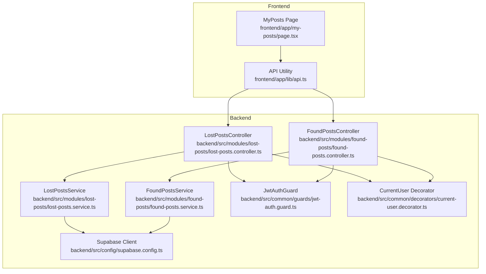

**Diagram sources**
- [page.tsx:1-270](file://frontend/app/my-posts/page.tsx#L1-L270)
- [api.ts:1-83](file://frontend/app/lib/api.ts#L1-L83)
- [lost-posts.controller.ts:1-78](file://backend/src/modules/lost-posts/lost-posts.controller.ts#L1-L78)
- [lost-posts.service.ts:1-189](file://backend/src/modules/lost-posts/lost-posts.service.ts#L1-L189)
- [found-posts.controller.ts:1-78](file://backend/src/modules/found-posts/found-posts.controller.ts#L1-L78)
- [found-posts.service.ts:1-162](file://backend/src/modules/found-posts/found-posts.service.ts#L1-L162)
- [jwt-auth.guard.ts:1-29](file://backend/src/common/guards/jwt-auth.guard.ts#L1-L29)
- [current-user.decorator.ts:1-9](file://backend/src/common/decorators/current-user.decorator.ts#L1-L9)
- [supabase.config.ts:1-25](file://backend/src/config/supabase.config.ts#L1-L25)

**Section sources**
- [page.tsx:1-270](file://frontend/app/my-posts/page.tsx#L1-L270)
- [api.ts:1-83](file://frontend/app/lib/api.ts#L1-L83)
- [lost-posts.controller.ts:1-78](file://backend/src/modules/lost-posts/lost-posts.controller.ts#L1-L78)
- [found-posts.controller.ts:1-78](file://backend/src/modules/found-posts/found-posts.controller.ts#L1-L78)
- [jwt-auth.guard.ts:1-29](file://backend/src/common/guards/jwt-auth.guard.ts#L1-L29)
- [current-user.decorator.ts:1-9](file://backend/src/common/decorators/current-user.decorator.ts#L1-L9)
- [supabase.config.ts:1-25](file://backend/src/config/supabase.config.ts#L1-L25)

## Core Components
- MyPosts Page (frontend): Loads lost and found posts for the current user, merges and sorts them, applies status-based filters, and renders cards with status badges and action affordances.
- API Utility: Provides authenticated fetch helpers with bearer token injection and cookie credentials, handles 401 redirects to login.
- LostPostsController/LostPostsService: Handles creation, retrieval, updates, deletions, and admin review for lost posts with user ownership and status checks.
- FoundPostsController/FoundPostsService: Mirrors lost posts functionality for found posts.
- Authentication: JwtAuthGuard enforces JWT presence for protected routes; CurrentUser decorator injects the authenticated user into controller handlers.
- Supabase Integration: Services use a shared Supabase client for database operations and status history logging.

Key frontend UX highlights:
- Filtering: All, Active (pending/approved), Resolved (resolved/returned/closed)
- Status badges: Pending, Approved/Active, Resolved/Returned/Closed
- Action affordances: Edit and Delete actions per post (UI present; edit/delete flows to be implemented)
- Stats: Total views and placeholders for responses and success metrics
- Featured post: Top-viewed post shown prominently when appropriate

**Section sources**
- [page.tsx:38-270](file://frontend/app/my-posts/page.tsx#L38-L270)
- [api.ts:12-83](file://frontend/app/lib/api.ts#L12-L83)
- [lost-posts.controller.ts:37-60](file://backend/src/modules/lost-posts/lost-posts.controller.ts#L37-L60)
- [lost-posts.service.ts:75-137](file://backend/src/modules/lost-posts/lost-posts.service.ts#L75-L137)
- [found-posts.controller.ts:37-60](file://backend/src/modules/found-posts/found-posts.controller.ts#L37-L60)
- [found-posts.service.ts:69-115](file://backend/src/modules/found-posts/found-posts.service.ts#L69-L115)
- [jwt-auth.guard.ts:13-27](file://backend/src/common/guards/jwt-auth.guard.ts#L13-L27)
- [current-user.decorator.ts:3-8](file://backend/src/common/decorators/current-user.decorator.ts#L3-L8)
- [supabase.config.ts:7-23](file://backend/src/config/supabase.config.ts#L7-L23)

## Architecture Overview
The user posts management flow integrates frontend rendering with backend CRUD and permission enforcement. The frontend calls protected endpoints to fetch user posts, while the backend validates JWT, checks ownership, and applies status rules.

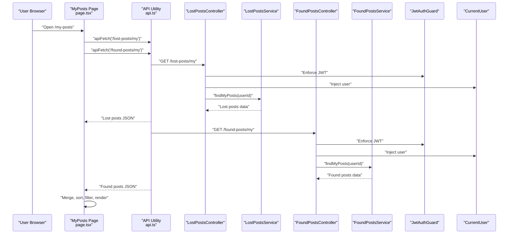

**Diagram sources**
- [page.tsx:43-71](file://frontend/app/my-posts/page.tsx#L43-L71)
- [api.ts:12-43](file://frontend/app/lib/api.ts#L12-L43)
- [lost-posts.controller.ts:37-41](file://backend/src/modules/lost-posts/lost-posts.controller.ts#L37-L41)
- [lost-posts.service.ts:75-84](file://backend/src/modules/lost-posts/lost-posts.service.ts#L75-L84)
- [found-posts.controller.ts:37-41](file://backend/src/modules/found-posts/found-posts.controller.ts#L37-L41)
- [found-posts.service.ts:69-78](file://backend/src/modules/found-posts/found-posts.service.ts#L69-L78)
- [jwt-auth.guard.ts:13-27](file://backend/src/common/guards/jwt-auth.guard.ts#L13-L27)
- [current-user.decorator.ts:3-8](file://backend/src/common/decorators/current-user.decorator.ts#L3-L8)

## Detailed Component Analysis

### Frontend: MyPosts Page
Responsibilities:
- Load lost and found posts concurrently via the API utility
- Merge and sort posts by creation date (newest first)
- Apply user-selected filters (All, Active, Resolved)
- Render cards with images, status badges, and action buttons
- Compute statistics (total views) and highlight the most viewed post

User interactions:
- Filter buttons switch between All, Active, and Resolved
- Action menu button present for each post (edit/delete UI placeholders)
- View details link for non-resolved posts

Status indicators:
- Pending: "Waiting for approval"
- Approved/Active: pulsing badge indicating live posting
- Resolved/Returned/Closed: success badge with checkmark

Statistics card:
- Shows total views aggregated across posts
- Placeholder for responses and success counts

Featured post card:
- Prominent display of the highest-viewed post when filter is All

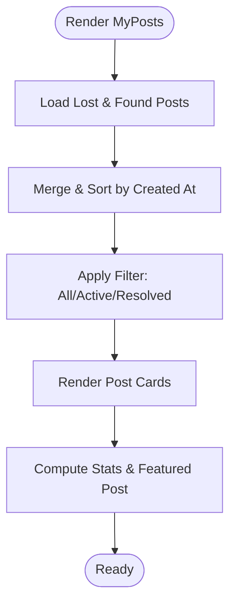

**Diagram sources**
- [page.tsx:43-87](file://frontend/app/my-posts/page.tsx#L43-L87)

**Section sources**
- [page.tsx:38-270](file://frontend/app/my-posts/page.tsx#L38-L270)

### Backend: Lost Posts Module
Endpoints and permissions:
- GET /lost-posts/my: Returns posts owned by the current user
- PATCH /lost-posts/:id: Updates a post; enforces ownership and status rules
- DELETE /lost-posts/:id: Deletes a post; enforces ownership and status rules
- Admin endpoints: Pending list and review with reason validation

Permission validation:
- JwtAuthGuard protects endpoints
- CurrentUser decorator supplies user id and role
- Ownership checks: user_id must match requester or role must be admin
- Status restrictions: edits allowed only when status is pending/approved

Approval and status history:
- Creation sets initial status to approved and logs history
- Admin review updates status and logs history with reason

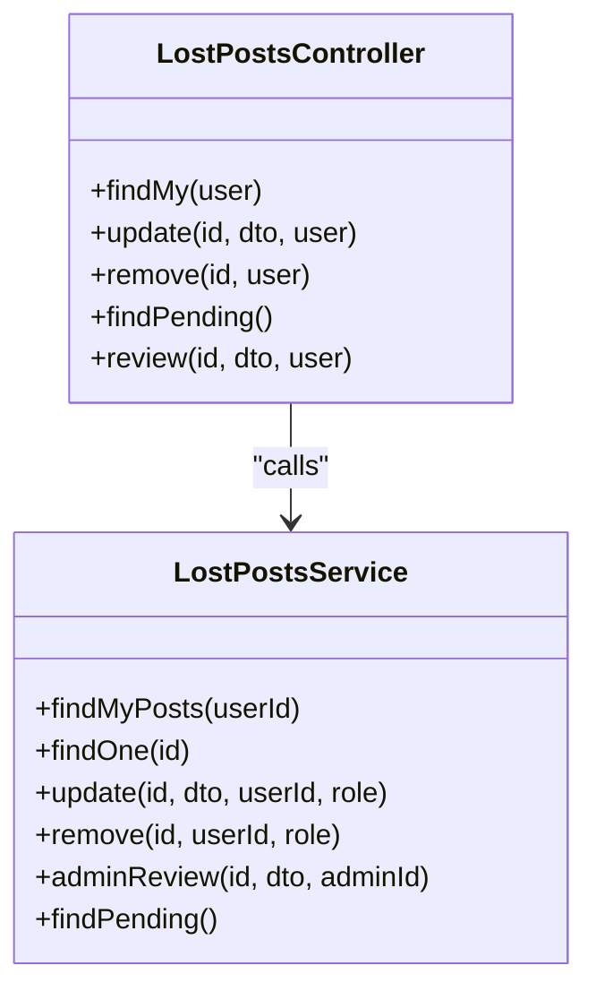

**Diagram sources**
- [lost-posts.controller.ts:21-77](file://backend/src/modules/lost-posts/lost-posts.controller.ts#L21-L77)
- [lost-posts.service.ts:14-188](file://backend/src/modules/lost-posts/lost-posts.service.ts#L14-L188)

**Section sources**
- [lost-posts.controller.ts:37-60](file://backend/src/modules/lost-posts/lost-posts.controller.ts#L37-L60)
- [lost-posts.service.ts:75-137](file://backend/src/modules/lost-posts/lost-posts.service.ts#L75-L137)

### Backend: Found Posts Module
Endpoints mirror lost posts:
- GET /found-posts/my: Returns user's found posts
- PATCH /found-posts/:id: Updates a found post with ownership and status checks
- DELETE /found-posts/:id: Deletes a found post with ownership checks
- Admin endpoints: Pending list and review with reason validation

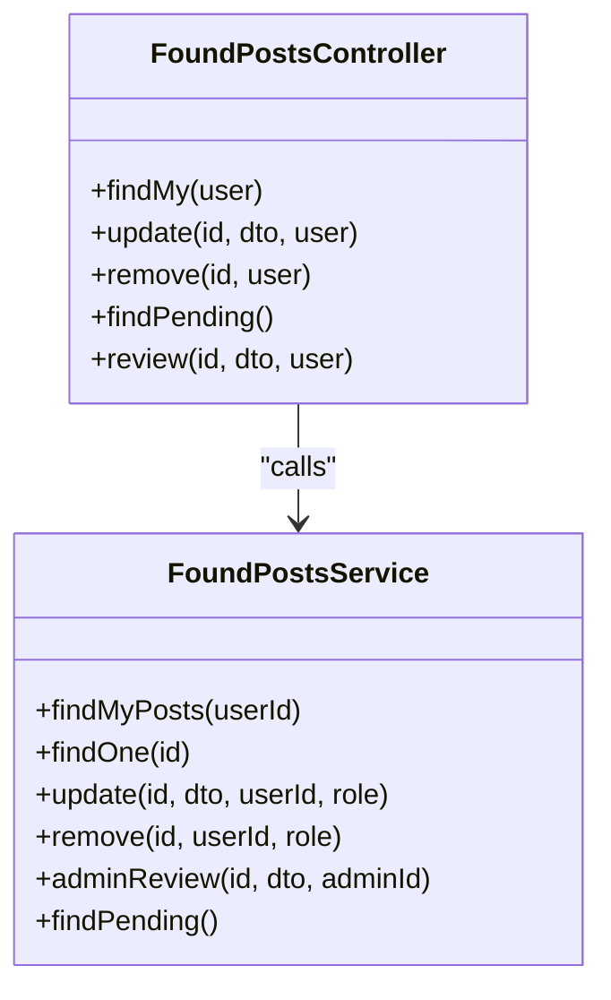

**Diagram sources**
- [found-posts.controller.ts:21-77](file://backend/src/modules/found-posts/found-posts.controller.ts#L21-L77)
- [found-posts.service.ts:14-161](file://backend/src/modules/found-posts/found-posts.service.ts#L14-L161)

**Section sources**
- [found-posts.controller.ts:37-60](file://backend/src/modules/found-posts/found-posts.controller.ts#L37-L60)
- [found-posts.service.ts:69-115](file://backend/src/modules/found-posts/found-posts.service.ts#L69-L115)

### Authentication and Permission Validation
- JwtAuthGuard: Enforces JWT presence for protected routes; allows bypass for public endpoints
- CurrentUser: Extracts user info from request for controller handlers
- Ownership and role checks: Services validate user_id matches requester or role is admin
- Status-based edit restrictions: Prevents editing posts that are resolved/returned/closed

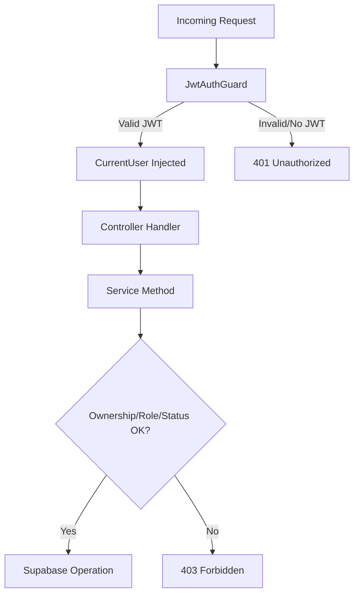

**Diagram sources**
- [jwt-auth.guard.ts:13-27](file://backend/src/common/guards/jwt-auth.guard.ts#L13-L27)
- [current-user.decorator.ts:3-8](file://backend/src/common/decorators/current-user.decorator.ts#L3-L8)
- [lost-posts.service.ts:105-125](file://backend/src/modules/lost-posts/lost-posts.service.ts#L105-L125)
- [found-posts.service.ts:96-105](file://backend/src/modules/found-posts/found-posts.service.ts#L96-L105)

**Section sources**
- [jwt-auth.guard.ts:1-29](file://backend/src/common/guards/jwt-auth.guard.ts#L1-L29)
- [current-user.decorator.ts:1-9](file://backend/src/common/decorators/current-user.decorator.ts#L1-L9)
- [lost-posts.service.ts:105-125](file://backend/src/modules/lost-posts/lost-posts.service.ts#L105-L125)
- [found-posts.service.ts:96-105](file://backend/src/modules/found-posts/found-posts.service.ts#L96-L105)

### Status Monitoring and Matching Integration
- Status tracking: Posts maintain status values (pending, approved, resolved, returned, closed)
- Approval status badges: Visual indicators for pending/approved/resolved states
- Matching progress: While the MyPosts page does not expose AI match progress, the storage module supports tracking items stored and claimed, which can be linked to returned items

Storage integration highlights:
- Storage locations and items listing
- Item search by code
- Create storage item and mark found post as stored
- Claim item with notes and timestamps

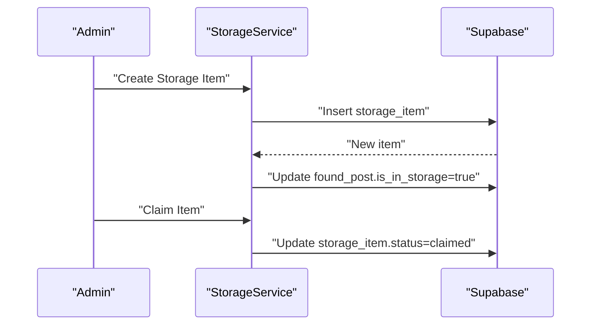

**Diagram sources**
- [storage.service.ts:53-100](file://backend/src/modules/storage/storage.service.ts#L53-L100)

**Section sources**
- [storage.controller.ts:14-59](file://backend/src/modules/storage/storage.controller.ts#L14-L59)
- [storage.service.ts:12-116](file://backend/src/modules/storage/storage.service.ts#L12-L116)

### Image Replacement Functionality
The API utility provides a dedicated upload function supporting multipart/form-data uploads with bearer token and cookie credentials. This enables replacing post images by uploading a new file and updating the post’s image URLs.

Implementation outline:
- Use uploadFile(path, file) to upload to the backend storage endpoint
- On success, receive a URL and update the post’s image_urls via the appropriate PATCH endpoint
- Ensure the upload respects the same authentication and credentials policy as other API calls

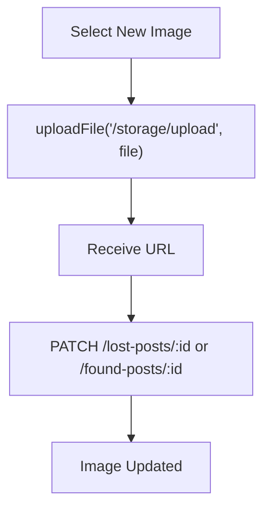

**Diagram sources**
- [api.ts:48-82](file://frontend/app/lib/api.ts#L48-L82)
- [lost-posts.controller.ts:50-54](file://backend/src/modules/lost-posts/lost-posts.controller.ts#L50-L54)
- [found-posts.controller.ts:50-54](file://backend/src/modules/found-posts/found-posts.controller.ts#L50-L54)

**Section sources**
- [api.ts:48-82](file://frontend/app/lib/api.ts#L48-L82)
- [lost-posts.controller.ts:50-54](file://backend/src/modules/lost-posts/lost-posts.controller.ts#L50-L54)
- [found-posts.controller.ts:50-54](file://backend/src/modules/found-posts/found-posts.controller.ts#L50-L54)

### Deletion Controls with Confirmation Dialogs
The frontend UI includes a vertical dots button for each post, indicating potential edit/delete actions. To implement deletion:
- Add a confirmation dialog prompting the user to confirm deletion
- Call DELETE /lost-posts/:id or DELETE /found-posts/:id via the API utility
- On success, remove the post from the local state and recompute stats

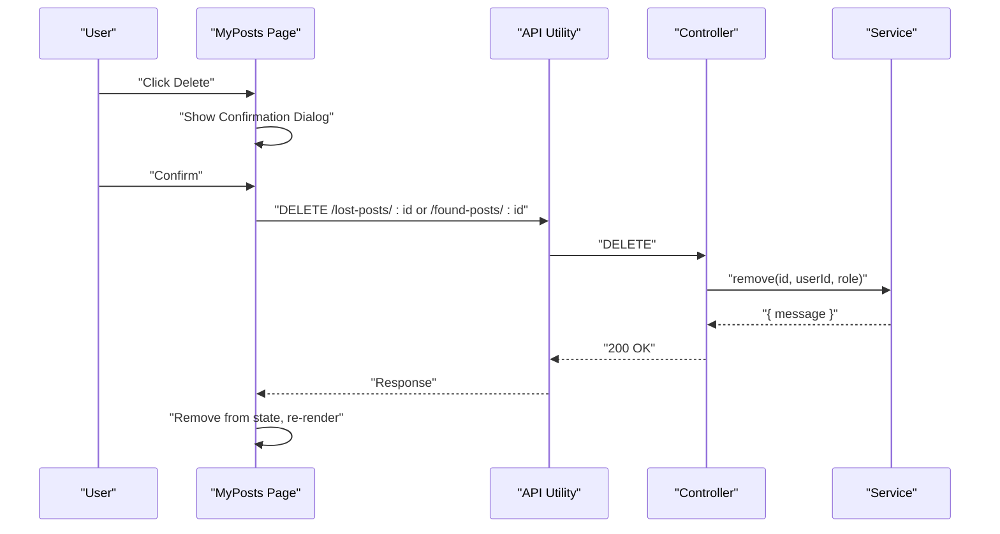

**Diagram sources**
- [page.tsx:190-194](file://frontend/app/my-posts/page.tsx#L190-L194)
- [lost-posts.controller.ts:56-60](file://backend/src/modules/lost-posts/lost-posts.controller.ts#L56-L60)
- [found-posts.controller.ts:56-60](file://backend/src/modules/found-posts/found-posts.controller.ts#L56-L60)
- [lost-posts.service.ts:127-137](file://backend/src/modules/lost-posts/lost-posts.service.ts#L127-L137)
- [found-posts.service.ts:107-115](file://backend/src/modules/found-posts/found-posts.service.ts#L107-L115)

**Section sources**
- [page.tsx:190-194](file://frontend/app/my-posts/page.tsx#L190-L194)
- [lost-posts.controller.ts:56-60](file://backend/src/modules/lost-posts/lost-posts.controller.ts#L56-L60)
- [found-posts.controller.ts:56-60](file://backend/src/modules/found-posts/found-posts.controller.ts#L56-L60)
- [lost-posts.service.ts:127-137](file://backend/src/modules/lost-posts/lost-posts.service.ts#L127-L137)
- [found-posts.service.ts:107-115](file://backend/src/modules/found-posts/found-posts.service.ts#L107-L115)

### Post Editing Workflow
The UI presents an edit affordance for non-resolved posts. The backend supports partial updates via PATCH endpoints. Typical workflow:
- Open edit modal with current post fields
- Allow image replacement using uploadFile
- Submit PATCH /lost-posts/:id or /found-posts/:id
- Validate ownership and status (pending/approved only)
- Update succeeds and UI reflects changes

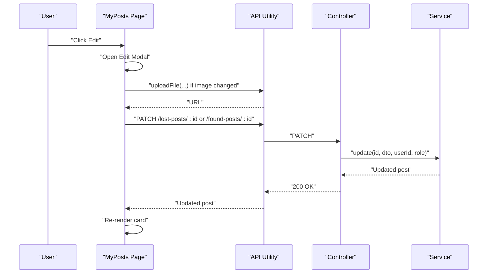

**Diagram sources**
- [page.tsx:190-194](file://frontend/app/my-posts/page.tsx#L190-L194)
- [api.ts:48-82](file://frontend/app/lib/api.ts#L48-L82)
- [lost-posts.controller.ts:50-54](file://backend/src/modules/lost-posts/lost-posts.controller.ts#L50-L54)
- [found-posts.controller.ts:50-54](file://backend/src/modules/found-posts/found-posts.controller.ts#L50-L54)
- [lost-posts.service.ts:105-125](file://backend/src/modules/lost-posts/lost-posts.service.ts#L105-L125)
- [found-posts.service.ts:96-105](file://backend/src/modules/found-posts/found-posts.service.ts#L96-L105)

**Section sources**
- [page.tsx:190-194](file://frontend/app/my-posts/page.tsx#L190-L194)
- [api.ts:48-82](file://frontend/app/lib/api.ts#L48-L82)
- [lost-posts.controller.ts:50-54](file://backend/src/modules/lost-posts/lost-posts.controller.ts#L50-L54)
- [found-posts.controller.ts:50-54](file://backend/src/modules/found-posts/found-posts.controller.ts#L50-L54)
- [lost-posts.service.ts:105-125](file://backend/src/modules/lost-posts/lost-posts.service.ts#L105-L125)
- [found-posts.service.ts:96-105](file://backend/src/modules/found-posts/found-posts.service.ts#L96-L105)

## Dependency Analysis
- Frontend depends on:
  - API utility for authenticated requests
  - Controllers/services for CRUD operations
- Backend controllers depend on:
  - JwtAuthGuard for authentication
  - CurrentUser for user injection
  - Services for data access and business logic
- Services depend on:
  - Supabase client for database operations
  - Shared configuration for client initialization

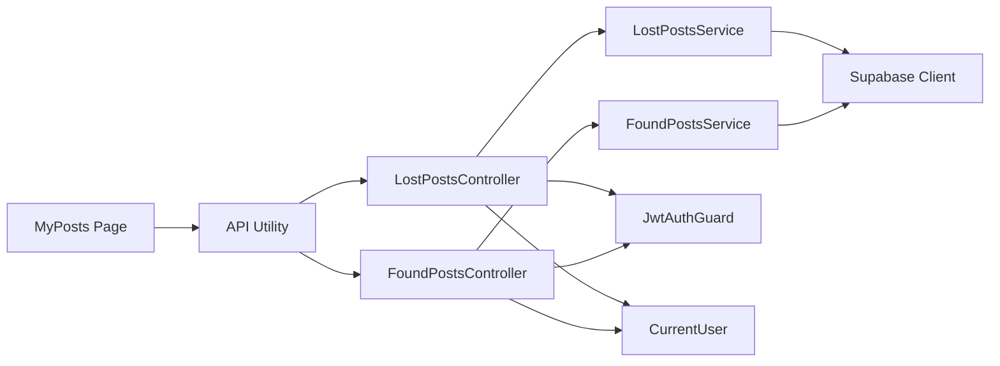

**Diagram sources**
- [page.tsx:1-270](file://frontend/app/my-posts/page.tsx#L1-L270)
- [api.ts:1-83](file://frontend/app/lib/api.ts#L1-L83)
- [lost-posts.controller.ts:1-78](file://backend/src/modules/lost-posts/lost-posts.controller.ts#L1-L78)
- [found-posts.controller.ts:1-78](file://backend/src/modules/found-posts/found-posts.controller.ts#L1-L78)
- [jwt-auth.guard.ts:1-29](file://backend/src/common/guards/jwt-auth.guard.ts#L1-L29)
- [current-user.decorator.ts:1-9](file://backend/src/common/decorators/current-user.decorator.ts#L1-L9)
- [supabase.config.ts:1-25](file://backend/src/config/supabase.config.ts#L1-L25)

**Section sources**
- [page.tsx:1-270](file://frontend/app/my-posts/page.tsx#L1-L270)
- [api.ts:1-83](file://frontend/app/lib/api.ts#L1-L83)
- [lost-posts.controller.ts:1-78](file://backend/src/modules/lost-posts/lost-posts.controller.ts#L1-L78)
- [found-posts.controller.ts:1-78](file://backend/src/modules/found-posts/found-posts.controller.ts#L1-L78)
- [jwt-auth.guard.ts:1-29](file://backend/src/common/guards/jwt-auth.guard.ts#L1-L29)
- [current-user.decorator.ts:1-9](file://backend/src/common/decorators/current-user.decorator.ts#L1-L9)
- [supabase.config.ts:1-25](file://backend/src/config/supabase.config.ts#L1-L25)

## Performance Considerations
- Concurrent fetching: The frontend loads lost and found posts in parallel to reduce latency.
- Sorting and filtering: Client-side operations are efficient for typical post volumes; pagination should be considered if lists grow large.
- Supabase queries: Services use optimized selects and ordering; consider adding indexes for frequently queried columns.
- View counting: Incrementing view counts is fire-and-forget to avoid blocking responses.

## Troubleshooting Guide
Common issues and resolutions:
- Unauthorized access: 401 responses clear local tokens and redirect to login. Verify JWT presence and expiration.
- Forbidden edits: 403 indicates ownership or status restrictions. Ensure the post is pending/approved and belongs to the current user.
- Upload failures: Confirm upload endpoint availability and that the file meets size/type constraints. Check response shape for URL presence.
- Missing environment variables: Supabase client requires URL and keys; missing values cause initialization errors.

**Section sources**
- [api.ts:30-43](file://frontend/app/lib/api.ts#L30-L43)
- [lost-posts.service.ts:108-114](file://backend/src/modules/lost-posts/lost-posts.service.ts#L108-L114)
- [found-posts.service.ts:98-104](file://backend/src/modules/found-posts/found-posts.service.ts#L98-L104)
- [supabase.config.ts:12-14](file://backend/src/config/supabase.config.ts#L12-L14)

## Conclusion
The user posts management page provides a cohesive experience for viewing, filtering, and managing personal posts. It integrates securely with backend services enforcing authentication, ownership, and status-aware operations. The design accommodates future enhancements such as edit/delete dialogs, image replacement, and richer status monitoring aligned with the approval and matching lifecycle.