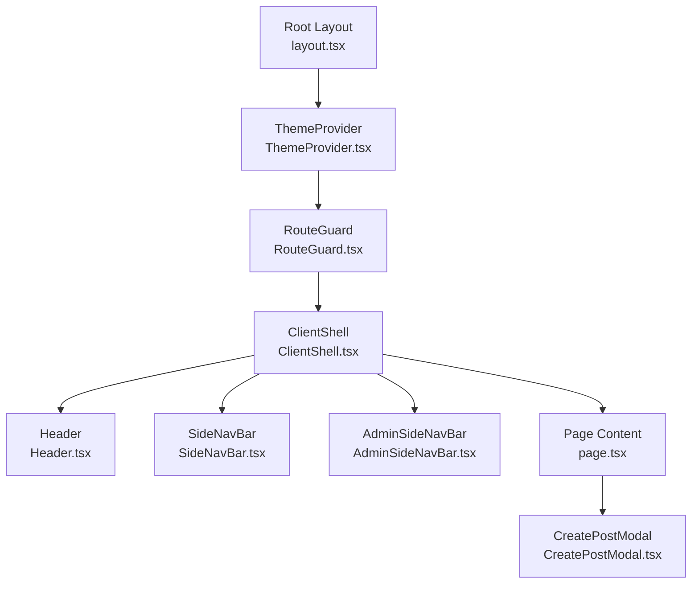
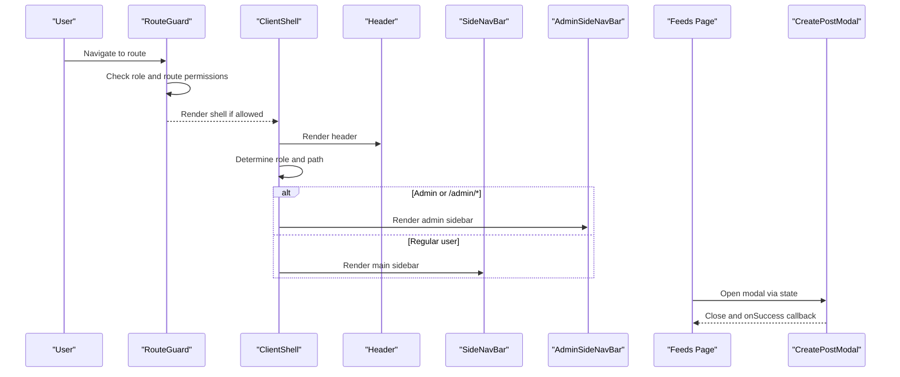
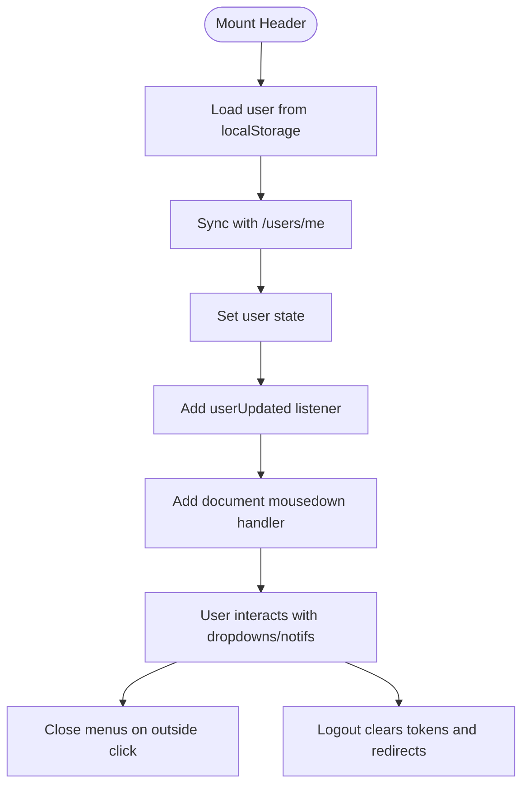
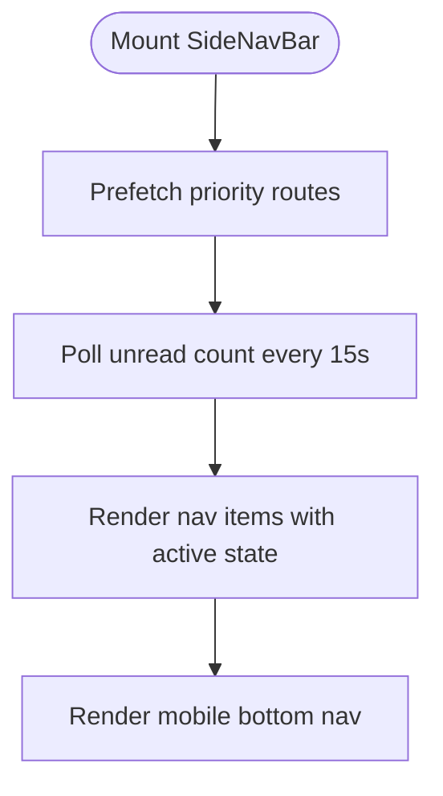
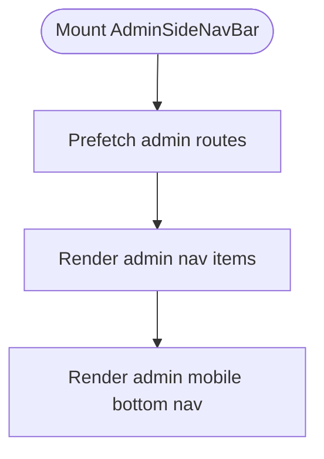
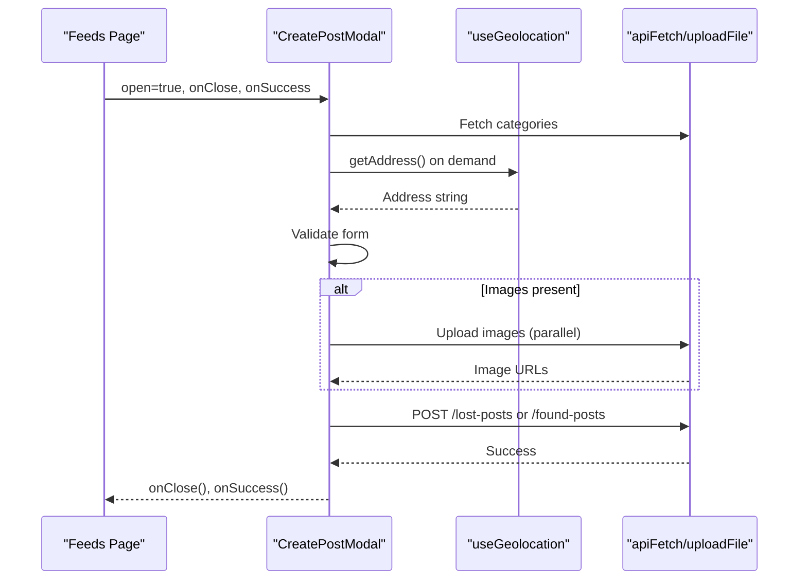
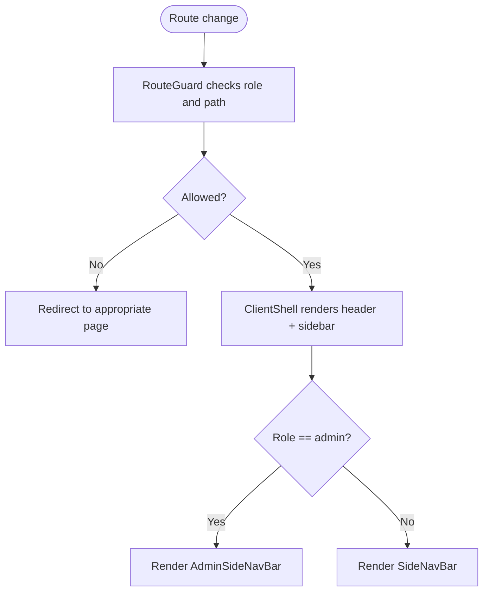
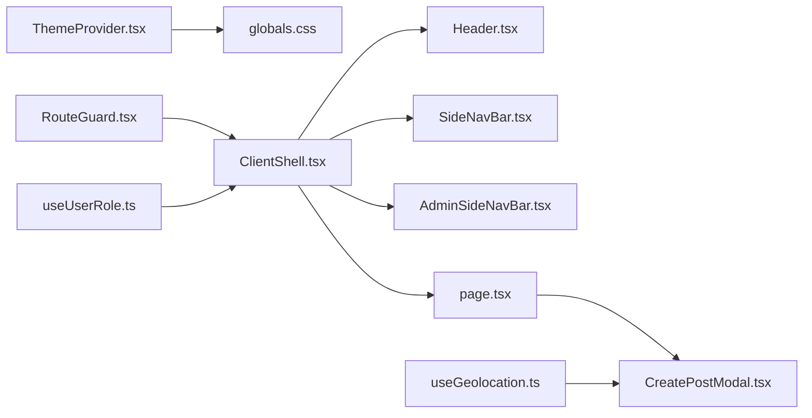

# Supporting Components

<cite>
**Referenced Files in This Document**
- [Header.tsx](file://frontend/app/components/Header.tsx)
- [SideNavBar.tsx](file://frontend/app/components/SideNavBar.tsx)
- [AdminSideNavBar.tsx](file://frontend/app/components/AdminSideNavBar.tsx)
- [CreatePostModal.tsx](file://frontend/app/components/CreatePostModal.tsx)
- [ClientShell.tsx](file://frontend/app/components/ClientShell.tsx)
- [RouteGuard.tsx](file://frontend/app/components/RouteGuard.tsx)
- [ThemeProvider.tsx](file://frontend/app/components/ThemeProvider.tsx)
- [useUserRole.ts](file://frontend/app/hooks/useUserRole.ts)
- [useGeolocation.ts](file://frontend/app/hooks/useGeolocation.ts)
- [layout.tsx](file://frontend/app/layout.tsx)
- [globals.css](file://frontend/app/globals.css)
- [page.tsx](file://frontend/app/feeds/page.tsx)
- [AdminOverview.tsx](file://frontend/app/admin/admin-overview/AdminOverview.tsx)
</cite>

## Table of Contents
1. [Introduction](#introduction)
2. [Project Structure](#project-structure)
3. [Core Components](#core-components)
4. [Architecture Overview](#architecture-overview)
5. [Detailed Component Analysis](#detailed-component-analysis)
6. [Dependency Analysis](#dependency-analysis)
7. [Performance Considerations](#performance-considerations)
8. [Accessibility and Responsive Design](#accessibility-and-responsive-design)
9. [Troubleshooting Guide](#troubleshooting-guide)
10. [Conclusion](#conclusion)

## Introduction
This document explains the reusable UI components that power the main application functionality. It focuses on:
- Header with navigation and user controls
- SideNavBar for main application navigation
- AdminSideNavBar for administrative access
- CreatePostModal for post creation workflows

It details component props, event handling, styling patterns, reusability, modal form handling, state management, component composition, and integration with the overall application state. Accessibility and responsive design patterns are also addressed.

## Project Structure
The frontend uses Next.js App Router. Layout and shell components orchestrate the header, navigation, and modals. Hooks and theme provider support cross-cutting concerns like user roles and theme switching.

**Diagram sources**
- [layout.tsx:19-43](file://frontend/app/layout.tsx#L19-L43)
- [ThemeProvider.tsx:21-55](file://frontend/app/components/ThemeProvider.tsx#L21-L55)
- [RouteGuard.tsx:9-57](file://frontend/app/components/RouteGuard.tsx#L9-L57)
- [ClientShell.tsx:10-42](file://frontend/app/components/ClientShell.tsx#L10-L42)
- [Header.tsx:14-265](file://frontend/app/components/Header.tsx#L14-L265)
- [SideNavBar.tsx:18-151](file://frontend/app/components/SideNavBar.tsx#L18-L151)
- [AdminSideNavBar.tsx:13-119](file://frontend/app/components/AdminSideNavBar.tsx#L13-L119)
- [page.tsx:61-488](file://frontend/app/feeds/page.tsx#L61-L488)
- [CreatePostModal.tsx:23-584](file://frontend/app/components/CreatePostModal.tsx#L23-L584)

**Section sources**
- [layout.tsx:19-43](file://frontend/app/layout.tsx#L19-L43)
- [ClientShell.tsx:10-42](file://frontend/app/components/ClientShell.tsx#L10-L42)

## Core Components
- Header: Fixed top bar with brand, search, notifications, and user profile menu. Manages user state, logout, and click-outside behavior.
- SideNavBar: Desktop sticky sidebar with navigation links and mobile bottom navigation. Polls unread message counts and prefetches routes.
- AdminSideNavBar: Admin-only sidebar with dashboard and management links. Differentiates active states and mobile layout.
- CreatePostModal: Full-featured modal for creating lost or found posts. Handles images, categories, dates, locations, and submission with progress feedback.

**Section sources**
- [Header.tsx:14-265](file://frontend/app/components/Header.tsx#L14-L265)
- [SideNavBar.tsx:18-151](file://frontend/app/components/SideNavBar.tsx#L18-L151)
- [AdminSideNavBar.tsx:13-119](file://frontend/app/components/AdminSideNavBar.tsx#L13-L119)
- [CreatePostModal.tsx:23-584](file://frontend/app/components/CreatePostModal.tsx#L23-L584)

## Architecture Overview
The shell composes the header and navigation based on route and user role. Modals are rendered conditionally within page content. Theme and routing guards wrap the shell to ensure consistent UX and access control.

**Diagram sources**
- [RouteGuard.tsx:9-57](file://frontend/app/components/RouteGuard.tsx#L9-L57)
- [ClientShell.tsx:10-42](file://frontend/app/components/ClientShell.tsx#L10-L42)
- [Header.tsx:14-265](file://frontend/app/components/Header.tsx#L14-L265)
- [SideNavBar.tsx:18-151](file://frontend/app/components/SideNavBar.tsx#L18-L151)
- [AdminSideNavBar.tsx:13-119](file://frontend/app/components/AdminSideNavBar.tsx#L13-L119)
- [page.tsx:61-488](file://frontend/app/feeds/page.tsx#L61-L488)
- [CreatePostModal.tsx:23-584](file://frontend/app/components/CreatePostModal.tsx#L23-L584)

## Detailed Component Analysis

### Header Component
- Purpose: Fixed top bar with brand, search, notifications, and user profile menu.
- Props: None (uses internal state and hooks).
- State and events:
  - User info loaded from localStorage and synced with backend.
  - Dropdown toggles for notifications and profile menus.
  - Click-outside handlers to close menus.
  - Logout clears tokens and navigates to login.
- Styling patterns:
  - Uses CSS variables for theme-aware colors and shadows.
  - Material Symbols icons for actions.
- Reusability:
  - Stateless functional component used across pages.
  - Integrates with theme provider and layout.

**Diagram sources**
- [Header.tsx:31-77](file://frontend/app/components/Header.tsx#L31-L77)
- [Header.tsx:79-83](file://frontend/app/components/Header.tsx#L79-L83)

**Section sources**
- [Header.tsx:14-265](file://frontend/app/components/Header.tsx#L14-L265)

### SideNavBar Component
- Purpose: Main navigation sidebar for authenticated users.
- Props: None.
- State and events:
  - Tracks unread message count via polling.
  - Prefetches key routes for performance.
  - Active link highlighting based on pathname.
- Styling patterns:
  - Sticky desktop layout with scrollable content.
  - Mobile bottom navigation with floating action button.
- Reusability:
  - Used by ClientShell; adapts to active route.

**Diagram sources**
- [SideNavBar.tsx:22-48](file://frontend/app/components/SideNavBar.tsx#L22-L48)
- [SideNavBar.tsx:50-151](file://frontend/app/components/SideNavBar.tsx#L50-L151)

**Section sources**
- [SideNavBar.tsx:18-151](file://frontend/app/components/SideNavBar.tsx#L18-L151)

### AdminSideNavBar Component
- Purpose: Admin-only navigation with dashboard and management links.
- Props: None.
- State and events:
  - Prefetches admin routes.
  - Active state detection for nested paths.
- Styling patterns:
  - Distinct branding for admin area.
  - Mobile bottom nav tailored for admin.
- Reusability:
  - Used by ClientShell when role indicates admin.

**Diagram sources**
- [AdminSideNavBar.tsx:17-20](file://frontend/app/components/AdminSideNavBar.tsx#L17-L20)
- [AdminSideNavBar.tsx:22-119](file://frontend/app/components/AdminSideNavBar.tsx#L22-L119)

**Section sources**
- [AdminSideNavBar.tsx:13-119](file://frontend/app/components/AdminSideNavBar.tsx#L13-L119)

### CreatePostModal Component
- Purpose: Unified modal for creating lost or found posts with rich form handling.
- Props:
  - open: boolean
  - onClose: () => void
  - onSuccess?: () => void
- State and events:
  - Form state for title, description, category, date, location, contact, urgency, reward note, storage flag, images.
  - Image upload with drag-and-drop, preview, and removal.
  - Geolocation hook integration for location resolution.
  - Validation and submission pipeline with progress feedback.
  - Toast notifications for success/error.
  - Reset on close; ESC key handling; backdrop click to close.
- Styling patterns:
  - Theme-aware backgrounds and borders.
  - Animated entrance and exit.
  - Gradient buttons and badges for visual feedback.
- Reusability:
  - Consumed by page components; integrates with page refresh logic.

**Diagram sources**
- [CreatePostModal.tsx:49-58](file://frontend/app/components/CreatePostModal.tsx#L49-L58)
- [CreatePostModal.tsx:125-132](file://frontend/app/components/CreatePostModal.tsx#L125-L132)
- [CreatePostModal.tsx:135-238](file://frontend/app/components/CreatePostModal.tsx#L135-L238)
- [page.tsx:138-140](file://frontend/app/feeds/page.tsx#L138-L140)

**Section sources**
- [CreatePostModal.tsx:14-18](file://frontend/app/components/CreatePostModal.tsx#L14-L18)
- [CreatePostModal.tsx:23-584](file://frontend/app/components/CreatePostModal.tsx#L23-L584)
- [page.tsx:61-488](file://frontend/app/feeds/page.tsx#L61-L488)

### ClientShell and RouteGuard Integration
- ClientShell:
  - Determines whether to show AdminSideNavBar or SideNavBar based on role and path.
  - Wraps children with header and sidebar layout.
- RouteGuard:
  - Enforces role-based access to routes.
  - Redirects unauthorized users and prevents auth pages for logged-in users.

**Diagram sources**
- [RouteGuard.tsx:9-57](file://frontend/app/components/RouteGuard.tsx#L9-L57)
- [ClientShell.tsx:10-42](file://frontend/app/components/ClientShell.tsx#L10-L42)

**Section sources**
- [ClientShell.tsx:10-42](file://frontend/app/components/ClientShell.tsx#L10-L42)
- [RouteGuard.tsx:9-57](file://frontend/app/components/RouteGuard.tsx#L9-L57)

## Dependency Analysis
- Theming:
  - ThemeProvider sets CSS variables on the html element and persists theme selection.
  - Global CSS defines design tokens for light/dark modes.
- Routing and roles:
  - useUserRole reads user role from localStorage to decide sidebar and guard behavior.
- Hooks:
  - useGeolocation encapsulates browser geolocation and reverse geocoding.
- Component composition:
  - ClientShell orchestrates Header, SideNavBar/AdminSideNavBar, and page content.
  - CreatePostModal is composed within page content and communicates via props/callbacks.

**Diagram sources**
- [ThemeProvider.tsx:21-55](file://frontend/app/components/ThemeProvider.tsx#L21-L55)
- [globals.css:12-93](file://frontend/app/globals.css#L12-L93)
- [ClientShell.tsx:10-42](file://frontend/app/components/ClientShell.tsx#L10-L42)
- [Header.tsx:14-265](file://frontend/app/components/Header.tsx#L14-L265)
- [SideNavBar.tsx:18-151](file://frontend/app/components/SideNavBar.tsx#L18-L151)
- [AdminSideNavBar.tsx:13-119](file://frontend/app/components/AdminSideNavBar.tsx#L13-L119)
- [page.tsx:61-488](file://frontend/app/feeds/page.tsx#L61-L488)
- [CreatePostModal.tsx:23-584](file://frontend/app/components/CreatePostModal.tsx#L23-L584)
- [RouteGuard.tsx:9-57](file://frontend/app/components/RouteGuard.tsx#L9-L57)
- [useUserRole.ts:9-29](file://frontend/app/hooks/useUserRole.ts#L9-L29)
- [useGeolocation.ts:19-104](file://frontend/app/hooks/useGeolocation.ts#L19-L104)

**Section sources**
- [ThemeProvider.tsx:21-55](file://frontend/app/components/ThemeProvider.tsx#L21-L55)
- [globals.css:12-93](file://frontend/app/globals.css#L12-L93)
- [useUserRole.ts:9-29](file://frontend/app/hooks/useUserRole.ts#L9-L29)
- [useGeolocation.ts:19-104](file://frontend/app/hooks/useGeolocation.ts#L19-L104)

## Performance Considerations
- ClientShell defers sidebar rendering until role is known to prevent flicker and unnecessary renders.
- SideNavBar prefetches key routes and polls unread counts at intervals to balance freshness and performance.
- CreatePostModal:
  - Parallel image uploads reduce total submission latency.
  - Preview URLs are revoked on unmount to free memory.
  - Progress percentage updates provide user feedback without blocking UI.
- ThemeProvider avoids Flash of Unstyled Content (FOUC) by hiding content until theme is resolved.

[No sources needed since this section provides general guidance]

## Accessibility and Responsive Design
- Accessibility:
  - Header dropdowns and notifications use click-outside handlers to close menus.
  - Buttons and inputs use semantic attributes and focus states.
  - Icons are paired with text labels for clarity.
- Responsive design:
  - SideNavBar hides on small screens; mobile bottom navigation appears.
  - CreatePostModal uses responsive breakpoints for layout and spacing.
  - ThemeProvider switches between light and dark mode based on user preference.

[No sources needed since this section provides general guidance]

## Troubleshooting Guide
- Header user synchronization:
  - If user data does not update, verify localStorage presence and network connectivity for the user endpoint.
- Notifications menu:
  - Ensure click-outside logic targets the correct refs to avoid accidental closures.
- SideNavBar unread count:
  - If unread count does not appear, confirm access token availability and endpoint response shape.
- CreatePostModal:
  - If images fail to upload, check token validity and file types. The component handles partial failures gracefully.
  - If location fails, confirm browser geolocation permissions and network access to reverse geocoding service.
- RouteGuard:
  - If redirected unexpectedly, verify role in localStorage and route prefixes handled by the guard.

**Section sources**
- [Header.tsx:31-52](file://frontend/app/components/Header.tsx#L31-L52)
- [SideNavBar.tsx:30-48](file://frontend/app/components/SideNavBar.tsx#L30-L48)
- [CreatePostModal.tsx:160-194](file://frontend/app/components/CreatePostModal.tsx#L160-L194)
- [useGeolocation.ts:24-100](file://frontend/app/hooks/useGeolocation.ts#L24-L100)
- [RouteGuard.tsx:16-40](file://frontend/app/components/RouteGuard.tsx#L16-L40)

## Conclusion
These reusable UI components provide a cohesive, accessible, and responsive foundation for the application. They integrate tightly with routing, theming, and user-role systems to deliver a consistent experience across pages and roles. The modal component demonstrates robust form handling, state management, and user feedback mechanisms suitable for production use.